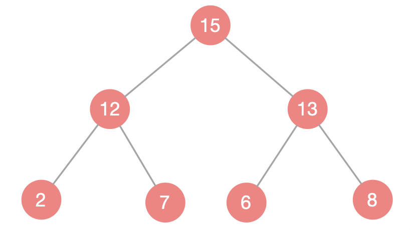
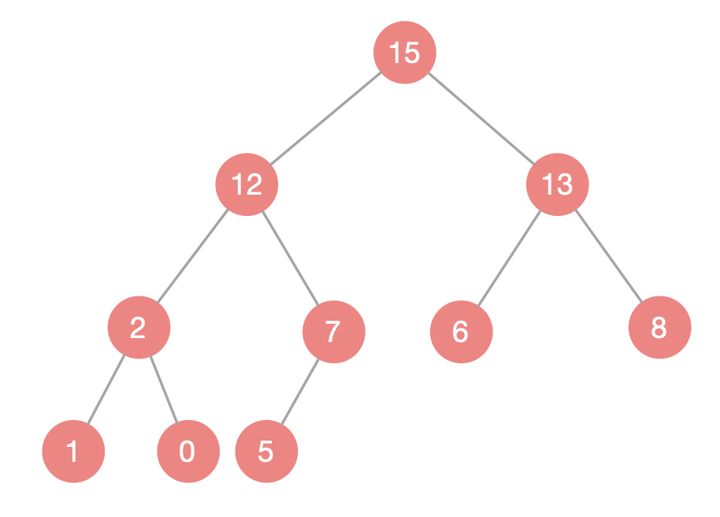

[这或许是东半球分析十大排序算法最好的一篇文章](<https://mp.weixin.qq.com/s/4n0a3sDp0GIs6gFZ7TEZNQ>)

>  不考虑桶排序，只有堆排序、快速排序、归并排序的时间复杂度是$O(NlogN)$


## 快速排序

### 快排

[快速排序---(面试碰到过好几次)](https://blog.csdn.net/nrsc272420199/article/details/82587933)

`思路`:

+ 每次从序列中选出一个基准值，其他数依次和基准值作比较，比基准值大的放在右边，比基准值小的放在左边，然后再对左边和右边的数分别选出一个基准值，进行同样的比较移动，重复步骤，直到最后变为单个元素，整个数组就成为了有序的序列。
+ 所以这里最终需要两个方法，方法① 的功能是对一个区间选择一个基准值，将小于和大于基准值的数分别放在基准值的左右两边；再一个就是总的方法②，在这个函数内部调用方法①，类似于二分的思想，每次二分后对子区间调用方法②

**实现的方式有单边扫描和双边扫描**：

> **单边扫描**

随意抽取一个数作为基准值，同时设定一个标记 mark 代表左边序列最右侧的下标位置，当然初始为 0 ，接下来遍历数组，如果元素大于基准值，无操作，继续遍历，如果元素`小于`基准值，`先将 mark 所在位置的元素和遍历到的元素交换位置，再把 mark + 1` ，mark 这个位置存储的是比基准值小的数据，当遍历结束后，将基准值与 mark 所在元素交换位置即可。

mark 的作用就是，从左至右遍历数组时，将第一个小于基准值的数放在 0 的位置，将第二个小于基准值的数放在 1 的位置，以此类推...

```java
public class QuickSort3 {
    public static void main(String[] args) {
        int[] a = {3,2,1,5,4,7,6,6};
        sort(a);
//        partition(a,0,a.length-1);
        System.out.println("排序后的a:"+ Arrays.toString(a));
    }
  
  	
    public static void sort(int[] arr){
        sort(arr,0,arr.length-1);
    }

    private static void sort(int[] arr,int startIndex,int endIndex){
        if(startIndex >= endIndex) return;
        int p = partition(arr,startIndex,endIndex);
        sort(arr,startIndex,p-1);
        sort(arr,p+1,endIndex);
    }

    private static int partition(int[] arr,int startIndex,int endIndex){
        int mark = 0;
        int pilot = arr[startIndex];
        for(int i=0;i<arr.length;i++){
            if(arr[i]>pilot){
                continue;
            }
            if(arr[i]<=pilot){
                int pre = arr[mark];
                arr[mark] = arr[i];
                arr[i]=pre;
                mark++;
            }
        }
        int pre = arr[startIndex];
        arr[startIndex] = arr[mark-1];
        arr[mark-1] = pre;
        return mark-1;
    }
}
```


> **双边扫描**

随意抽取一个数作为基准值，然后从数组左右两边进行扫描，先从左往右找到一个大于基准值的元素，将下标指针记录下来，然后转到从右往左扫描，找到一个小于基准值的元素，交换这两个元素的位置，重复步骤，直到左右两个指针相遇，再将基准值与左侧最右边的元素交换。

双向扫描 pivot 的选择是数组的第一个元素或者数组的最后一个元素。且最初的扫描方向要和 pivot 的扫描方向要相反（当选择第一个元素为pivot时，最初应该先右边向左扫描；当选择最后一个元素为pivot时，最初应该先左边向右扫描）。其中双向扫描又有两种实现方式，其中一种是`直接覆盖`的方式，还有一种`两头交换`的方式。常见是直接覆盖的方式。

《这或许是东半球分析十大排序算法最好的一篇文章》中快排的动图的思想为`双边扫描`

+ 每次选择局部最右边的数字为P（基准值）
+ 刚开始设置两个指针，左、右分别指向arr[0]、arr[len-2]
+ 当左 < P < 右 或 左、右 < P，则左→
+ 当左、右 > P，则←右，目的是找到一个比P小的数，找到之后，此时左 > P >右，左右交换，变为左 < P < 右
+ 重复以上步骤，直到左 = 右，即左右指的是同一个数字，让此数字与P比较，若小于P，不动；若大于P，则交换位置。

**双边扫描只能选择第一个元素或最后一个元素作为基准值，且最初的扫描方向应与基准值的位置相反，为什么呢？**

因为当最后左右指针即将相遇时（左右指针挨边），此时，左指针指向所有小于基准值的最右边，右指针指向所有大于基准值的最左边，下一步就是指针相遇（指的是同一个位置），这里选的基准值为第一个元素（需要右指针先从右往左扫描），如果是左指针先从左往右扫描，那么此时左指针往右移动一步与右指针重合，但是刚刚说过，此时右指针指向所有大于基准值的最左边，也就是此时重合的位置指向的元素大于基准值，如果此时交换，那么第一个元素就是一个大于基准值的元素，故，应让右指针往左扫描与左边指针重合。

**代码实现**：

```java
// 双边扫描最终版
public class QuickSort2 {
    public static void main(String[] args) {
        int[] A = {5, 3, 6, 4, 1, 7, 9, 2, 8};
        sort(A);
        System.out.println("排序后的A:" + Arrays.toString(A));
    }

    private static void sort(int[] arr) {
        sort(arr, 0, arr.length - 1);
    }

    private static void sort(int[] arr, int startIndex, int endIndex) {
        if (endIndex <= startIndex) return;
        int pivotIndex = partition(arr, startIndex, endIndex);
        sort(arr, startIndex, pivotIndex - 1);  
        sort(arr, pivotIndex + 1, endIndex);
    }

    // 优化后，不需要交换，直接覆盖，这样可以省去每次申请的 temp 变量开销
    // 返回最终基准值的位置
    private static int partition(int[] arr, int startIndex, int endIndex) {
        int left = startIndex;
        int right = endIndex;
        int pivot = arr[startIndex];  //因为这里选择第一个为基准值，所以先①后②
        while (left < right) {
            while (left < right && arr[right] >= pivot) right--; // ① 注意这里是 >=
            arr[left] = arr[right];
            while (left < right && arr[left] <= pivot) left++;   // ② 注意这里是 <=
            arr[right] = arr[left];
        }
        arr[left] = pivot;
        return left;
    }
}
```


### 快排衍生题1

> **找出一个无序数组的中位数？**

对于一个有序数组`arr`来说：

+ 如果数组长度为奇数，中位数为中间的那个数，即`arr[arr.length/2]`

+ 如果数组长度为偶数，中位数为中间的两个数的平均值，即`(arr[length/2] + arr[length/2-1]) / 2`

**方法一**：暴力解法

先将数组排序为有序数组，再找出中位数。

**方法二**：快排思想

**思路**：先挑选一个数作为标准（`pivot`），以该元素为支点，将数组划分为两部分。快排每排完一轮之后左侧都是比它小的元素，右侧都是比它大的元素，那么支点的`index（假设为N-1）`即为第`N`大的数。当`N == K`，我们就找到了第`K`大的数；当`N > K`时， 第`K`大的数在`[0,N-1]`范围内；当`N < K`时，第`K`大的数在`[N+1,n-1]`(n为数组长度)范围内，利用递归即可找到第`K`大的数。

**注意**：这里第`k`大的数，是下标为`k-1`的值，即`arr[k-1]`

对数组进行`partition`，每次的 partition 返回一个位置，直到找到中间那个位置。

**Java 实现如下**：

```java
/**
 * 利用快排思想求无序数组中位数
 * @Author Hory
 * @Date 2020/9/8
 */
public class Solution {
    /**
     * 寻找无序数组第k大的数，其实就是找排序后的数组的 arr[k-1]
     * 这里用到了递归
     * 明确函数意义：该方法实现了找到第k大的数，该方法没有返回值，通过不断调整数组，最终使得第k大的值位于索引k-1
     * @param arr
     * @param k
     * @param start
     * @param end
     * @return
     */
    public static double findMedian(int[] arr){
        if(arr.length <= 0) return -1;
        int length = arr.length;
        if(length % 2 == 1) {  // 如果数组长度为奇数，只需返回中间的数字即可
            selectKthNum(arr,length/2,0,length-1);
            return arr[length/2];
        }else {   //如果数组长度为偶数，返回中间两个数字的平均值
            selectKthNum(arr,length/2-1,0,length-1);
            selectKthNum(arr,length/2,0,length-1);
            return (arr[length/2] + arr[length/2-1])/2.0;
        }
    }
  
  	// 此函数的功能就是
    private static void selectKthNum(int[] arr, int k, int start, int end){
        if(arr == null || k < 0 || start >= end) return;
        int left = start;
        int right = end;
        int pivot = arr[start]; //
        while(left < right){
            while(left < right && arr[right] >= pivot) right--;
            arr[left] = arr[right];
            while(left < right && arr[left] <= pivot) left++;
            arr[right] = arr[left];
        }
        arr[left] = pivot;
        if(left == k) return;  
        else if(left < k) selectKthNum(arr,k,left+1,end);
        else selectKthNum(arr,k,start,left-1);
    }
}
```

**复杂度分析**：

至于为何这个算法是线性级别的，是因为假设每次都正好将数组二分，那么比较的总次数为`（N+N/2+N/4+N/8...）`，直到找到第k 的元素，这个和显然小于2N。和快速排序一样，这里也需要一点数学知识来得到比较的上界，它比快速排序略高。这个算法和快速排序的另一个共同点是这段分析依赖于使用随机的切分元素，因此它的性能保证也来自于概率。

> 命题U。平均来说，基于切分的选择算法的运行时间是线性级别的。
>
> 证明。该命题的分析和快速排序的命题 K 的证明类似，但要复杂得多。结论就是算法的平均比较次数为`~2N+2kln(N/k)+2(N-k)ln(N/(N-k))`，这对于所有合法的 k 值都是线性的。例如，这个公式说明找到中位数`(k=N/2)` 平均需要`~(2+2ln2)N` 次比较。注意，最坏的情况下算法的运行时间仍然是`平方`级别的，但与快速排序一样，将数组乱序化可以有效防止这种情况出现。

设计一个能够保证`在最坏情况下`也只需要线性比较次数的算法是计算复杂性领域的一个经典问题，但到目前为止仍然没有一个能够实用的算法。

> 进而还可以衍生出其他类似 题目，比如：
>
> 找出一个无序数组中第 k 小的元素，即排序后的第 k-1 位置上的元素

给两个有序数组，长度分别为m、n，请找出这两个数组合并之后的中位数，且要求时间复杂度为 $log(m+n)$


### 快排衍生题2

> 最小的k个数

> 输入n个整数，找出其中最小的K个数。例如输入`4,5,1,6,2,7,3,8`这8个数字，则最小的4个数字是1,2,3,4。

详情看本地<a href="./剑指Offer/##最小的k个数">最小的k个数</a>


## 计数排序

[原文](https://www.cnblogs.com/kyoner/p/10604781.html)

有这样一道排序题：数组里有20个随机数，`取值范围为从0到10`，要求用最快的速度把这20个整数从小到大进行排序。

这道题就可以用计数排序来解，这种排序算法不是基于元素比较，而是利用数组下标来确定元素的正确位置

在刚才的题目里，随即整数的取值范围是从0到10，那么这些整数的值肯定是在0到10这11个数里面。于是我们可以建立一个长度为11的数组，数组下标从0到10，元素初始值全为 0，如下所示：

|       |  0   |  0   |  0   |  0   |  0   |  0   |  0   |  0   |  0   |  0   | 0    |
| :---: | :--: | :--: | :--: | :--: | :--: | :--: | :--: | :--: | :--: | :--: | ---- |
| index |  0   |  1   |  2   |  3   |  4   |  5   |  6   |  7   |  8   |  9   | 10   |

加入现在给出一个20个随机数，`取值范围为从0到10`：

```
9, 3, 5, 4, 9, 1, 2, 7, 8，1，3, 6, 5, 3, 4, 0, 10, 9, 7, 9
```

遍历数组，依次将数字出现的次数的次数填入上面的长度为11的数组，最终结果如下：

|       |  1   |  2   |  2   |  3   |  2   |  2   |  1   |  2   |  1   |  4   | 1    |
| :---: | :--: | :--: | :--: | :--: | :--: | :--: | :--: | :--: | :--: | :--: | ---- |
| index |  0   |  1   |  2   |  3   |  4   |  5   |  6   |  7   |  8   |  9   | 10   |

有了这个统计结果，排序就很简单了，直接遍历数组，输出数组元素的下标值，元素的值是几，就输出几次：

```
0, 1, 1, 2, 3, 3, 3, 4, 4, 5, 5, 6, 7, 7, 8, 9, 9, 9, 9, 10
```

这就是计数排序的基本过程，它`适用于一定范围的整数排序`。在`取值范围不是很大`的情况下，它的性能在某些情况甚至快过那些O(nlogn)的排序，例如快速排序、归并排序。

说白了，还是用空间换时间。


> 给出一个数组`arr`，其取值范围为`0-n`
>
> 设计一个函数对它进行排序

**Java实现如下**：

```java
public class Solution6 {
    public static void main(String[] args) {
      	//测试用例
        int[] a = {1,2,1,3,2,4,5,6,7};
        int[] b = {1};
        int[] c = {0,0,0,0};
        int[] d = {1,1,1,1};
				int[] e = {0,2,1,3,2,4,0,6,7};
        int[] res = countSort(d,1);
        for(int each:res) System.out.println(each);
    }

    public static int[] countSort(int[] arr, int n){
        int len = arr.length;
        if(null == arr || arr.length == 0) return null;

        int[] nArray = new int[n+1];
        Arrays.fill(nArray,-1);
        for(int i=0; i<len; i++){
            if(nArray[arr[i]] == -1) nArray[arr[i]] = 1;
            else nArray[arr[i]]++;
        }
        
        int index = 0;
        for(int i=0; i<n+1; i++){
            if(nArray[i] == -1) continue;
            for(int j=0; j<nArray[i]; j++){
                arr[index] = i;
                index++;
            }
        }
        return arr;
    }
}
```

虽然是两个for循环嵌套，但是遍历的次数只是遍历`arr`的长度

>时间复杂度：O(n)，跟`arr`的长度有关
>
>空间复杂度：O(n)，跟取值范围`n`有关


## 归并排序

### 数组的归并排序

**其中**：

`arr[i++];`      先`arr[i]`再`i`自增
`arr[++i];`      先`i`自增再`arr[i]`

**Java实现如下**：

```java
import java.util.Arrays;
/**
 * @Author Hory
 * @Date 2020/9/12
 */
public class Solution6 {
    public static void main(String[] args) {
        int[] a = {3,2,4,1,5,7,6};
        int[] b = new int[a.length];
        mergeSort(a);
        for(int each:a) System.out.println(each);
    }
  
    public static void  mergeSort(int[] arr){
        int[] tempArr = new int[arr.length];
        sort(arr,tempArr,0,arr.length-1);
    }

    private static void sort(int[] arr, int[] tempArr, int startIndex, int endIndex){
        if(endIndex <= startIndex) return;
        int middleIndex = startIndex + ((endIndex - startIndex) >> 1);

      	//分解
        sort(arr, tempArr, startIndex, middleIndex);
        sort(arr, tempArr, middleIndex + 1, endIndex);

      	//归并
        merge(arr, tempArr, startIndex, middleIndex, endIndex);
    }

    private static void merge(int[] arr, int[] temArr, int staIndex, int midIndex, int endIndex){
        for(int i = staIndex; i <= endIndex; i++) temArr[i] = arr[i];
        int left = staIndex;
        int right = midIndex+1;
        for(int i=staIndex; i<=endIndex; i++){
            if(left > midIndex) arr[i] = temArr[right++]; //左边排完了
            else if(right > endIndex) arr[i] = temArr[left++]; //右边排完了
            else if(temArr[right] < temArr[left]) arr[i] = temArr[right++];
            else  arr[i] = temArr[left++];
        }
    }
}
```

> 时间复杂度： O(nlogn)
>
> 空间复杂度： O(1)


### 单向链表归并排序

> 我们通常所说的排序都是数组的排序，面试时可能会让你对链表进行排序，其实链表的排序有时候反而更加简单！

**这道题算是一道比较综合的题**：

- 快慢指针寻找中间节点
- 合并两个有序的链表
- 归并排序的思想

**思想**：

- 设置两个指针，一个步长为1， 一个步长为2，当快指针到达尾结点时，慢指针指向中间结点，时间复杂度为O(n)；
- 平分为左链表L1和右链表L2，递归分裂，直到链表为空或者只有一个结点；
- 将链表L2的每个结点插入到链表L1中，时间复杂度为O(m+n)，m、n分别为两条链表的长度。

**复杂度**：

+ 时间复杂度：`O(NlogN)`
+ 空间复杂度：`O(1)`

**Java 实现如下**：

```java
/**
 * @Author Hory
 * @Date 2020/9/15
 */
public class Solution7{
    public static void main(String[] args){
//        int[] arr = {};
        int[] arr = {3,2,1,4,5,6,0};
//        int[] arr = {0};
//        int[] arr = {0,0,0};
//        int[] arr = {1,1,1,1};
//        int[] arr = {3,2,1,3,5,6,8};

        ListNode head = constructor(arr);
        ListNode newHead = mergeSortList(head);
        printList(newHead);
    }

    // 实现单链表的归并排序
    public static ListNode mergeSortList(ListNode head){
        if(head == null || head.next == null) return head;
        // 快慢指针找中间节点
        ListNode slow = head;
        ListNode fast = head;
        while(fast.next != null && fast.next.next != null){
            slow = slow.next;
            fast = fast.next.next;
        }
        ListNode leftHead = head;
        ListNode rightHead = slow.next;
        slow.next = null;

        leftHead = mergeSortList(leftHead);
        rightHead = mergeSortList(rightHead);
        return ListNodeMerge(leftHead, rightHead);
    }

  	// 节点类
    public static class ListNode{
        int val;
        ListNode next;
        ListNode(int val){
            this.val = val;
            next = null;
        }
    }

    // 根据一个数组创建一个链表
    private  static ListNode constructor(int[] arr){
        if(arr == null || arr.length == 0) return null;
        ListNode head = new ListNode(arr[0]);
        if(arr.length == 1) return head;
        ListNode cur = head;
        for(int i=1; i<=arr.length-1; i++){
            cur.next = new ListNode(arr[i]);
            cur = cur.next;
        }
        return head;
    }

    // 打印一个链表的节点值
    public static void printList(ListNode head){
        if(head == null) return;
        ListNode cur = head;
        while(cur != null){
            System.out.print(cur.val + " ");
            cur = cur.next;
        }
    }

    // 首先实现一个合并两个排序链表的方法
    private static ListNode ListNodeMerge(ListNode list1, ListNode list2){
        if(list1 == null && list2 == null) return null;
        if(list1 == null) return list2;
        if(list2 == null) return list1;

        ListNode newHead = new ListNode(-1);
        ListNode cur = newHead;
        while(list1 != null && list2 != null){
            if(list1.val < list2.val){
                cur.next = list1;
                list1 = list1.next;
            }else{
                cur.next = list2;
                list2 = list2.next;
            }
            cur = cur.next;
        }
        cur.next = (cur.next == list1) ? list2 : list1;
        return newHead.next;
    }
}
```

### 归并排序衍生1

[数组中的逆序对](https://www.nowcoder.com/practice/96bd6684e04a44eb80e6a68efc0ec6c5?tpId=13&&tqId=11188&rp=1&ru=/ta/coding-interviews&qru=/ta/coding-interviews/question-ranking)


## 堆排序

> 关于堆

[在学习堆排序直线先来看看堆这个数据结构](https://mp.weixin.qq.com/s?__biz=MzUyNjQxNjYyMg==&mid=2247484290&idx=1&sn=971ae3365a8a9d284e427e623d825bba&scene=21#wechat_redirect)

堆的一个经典的实现是`完全二叉树(complete binary tree)`，这样实现的堆称为`二叉堆(binary heap)`。

**满二叉树**：除了叶子节点，所有的节点的左右孩子都不为空，就是一棵满二叉树，如下图：



可以看出：满二叉树所有的节点都拥有左孩子，又拥有右孩子。

**完全二叉树**：不一定是一个满二叉树，但它不满的那部分一定在右下侧，如下图：



关于堆详细的描述及实现方式这里不再赘述，网上资源很多，这里重点说一下堆的特性。

**堆的特性**：

- 必须是`完全二叉树`
- 任一结点的值是其子树所有结点的最大值或最小值

最大值时，称为“最大堆”，也称大顶堆；

最小值时，称为“最小堆”，也称小顶堆。

还有一点很重要，那就是如果把一个二叉堆按层次遍历打印出来放在一个数组中，那么对于任意一个有子节点的节点在数组中的索引`index`会满足下面的关系：

+ `leftChild = 2 * index + 1`
+ `rightChild = 2 * index + 2`

比如下面的二叉堆：


> 关于堆排序

堆排序顾名思义，是利用堆这种数据结构来进行排序的算法。

堆是一种优先队列，有两种实现，最大堆和最小堆，由于这里排序按升序排，所以暂且最大堆。

可以把堆看成一棵完全二叉树，位于堆顶的元素总是整棵树的最大值，每个子节点的值都比父节点小，由于堆要时刻保持这样的规则特性，所以一旦堆里面的数据发生变化，必须对堆重新进行一次构建。

既然堆顶元素永远都是整棵树中的最大值，那么我们将数据构建成堆后，只需要从堆顶取元素即可。每次取完根节点，将二叉树的末尾节点移到根节点位置（这里的末尾节点指的是，二叉树按照层序遍历之后的最后一个节点，如上面图中的节点5）。

讲到这里你可能说需要建立一棵真正的二叉树，当然可以，只是没必要，堆排序的精髓并不是真的要用节点类实现一个二叉堆，而是利用堆的思想，通过将数组内部元素进行调整的方式来实现一个虚拟的堆，但是最终达到的效果跟真正通过建立一棵二叉堆来实现排序是一样的。

堆排序其实总的来说就三步：

1. 待排序数组
2. 建立二叉堆
3. 取二叉堆顶元素

这三步都可以通过调整数组中的元素位置来实现！

1. 待排序数组就是给定的待排序数组

2. 建立二叉堆的过程有点麻烦，也是堆排序的精髓，其实看代码更好理解一些。

	当我们拿到一个待排序数组后，我们可以把通过一定的规则访问数组元素的方式建立一棵虚拟的二叉树，就是前面所说的`leftChild = 2 * index + 1`及`rightChild = 2 * index + 2`，有了这个规则，我们可以得到任意一个元素的左右子节点。

	但是现在的二叉树只满足了`它是一个完全二叉树`的特性，`任一结点的值是其子树所有结点的最大值`的`特性还需要一定的操作。

	那就是下沉操作，当一个节点小于其中一个子节点时，就将此节点与那个较大的子节点对调。如果这个操作是自顶向下的，那么就比较麻烦，所以这里的实现是自底向上。

3. 取二叉堆顶元素，就代表将数组中的第一个元素与末尾元素对调。

下面直接上代码，不得不说堆排序的代码真的很巧妙：

```java
public class Solution {

    public static void heapSort(int[] arr) {
        int length = arr.length;
        buildHeap(arr, length);

        for ( int i = length - 1; i > 0; i-- ) {
            int temp = arr[0];
            arr[0] = arr[i];
            arr[i] = temp;
            length--;
            sink(arr,0,length);
        }
    }

    private static void buildHeap(int[] arr, int length) {
        for (int i = length / 2; i >= 0; i--) {
            sink(arr,i,length);
        }
    }

    private static void sink(int[] arr, int index, int length) {
        int leftChild = 2 * index + 1; 
        int rightChild = 2 * index + 2; 
        int present = index; 

        if (leftChild < length && arr[leftChild] > arr[present]) {
            present = leftChild;
        }
        if (rightChild < length && arr[rightChild] > arr[present]) {
            present = rightChild;
        }
        if (present != index) {
            int temp = arr[index];
            arr[index] = arr[present];
            arr[present] = temp;

            sink(arr,present,length);
        }
    }
}
```

解说代码：

```java
package sort.heap;

/**
 * @Author Hory
 * @Date 2020/10/2
 */
public class Solution {

    public static void heapSort(int[] arr) {
        int length = arr.length;
        //构建堆
        buildHeap(arr, length);

        for ( int i = length - 1; i > 0; i-- ) {
            //将堆顶元素与末尾元素调换
            int temp = arr[0];
            arr[0] = arr[i];
            arr[i] = temp;
            //数组长度-1 隐藏堆尾元素
            length--;
            //将堆顶元素下沉 目的是将最大的元素浮到堆顶来
            sink(arr,0,length);
        }
    }

  
  	//构建堆的过程就是一个个节点下沉的过程，只不过这个过程是自底向上
  	//为什么是自底向上？
  	//那就要知道sink这个函数的功能：对指定的元素为根节点以下的节点进行下沉，直到遇到一个节点大于其左右子节点才会退出。但是就算退出了，也不能保证当前节点的子节点的子节点是否满足堆的特性，所以，如果我们自底向上的话，每次执行当前节点，那么它下面的节点全是执行过下沉操作的，这就保证了以当前的节点为根节点的整个树都是满足堆特性的
  	//为什么是i = length/2 ？
  	//因为是自底向上，所以arr[length/2]这个节点刚好最后一个节点的父节点
    private static void buildHeap(int[] arr, int length) {
        for (int i = length / 2; i >= 0; i--) {
            sink(arr,i,length);
        }
    }

    /**
     * 下沉调整
     * 该sink函数的功能就是对指定的元素为根节点以下的节点进行下沉，直到遇到一个节点大于其左右子节点才会退出
     * @param arr 数组
     * @param index 调整位置
     * @param length 数组范围
     */
    private static void sink(int[] arr, int index, int length) {
        int leftChild = 2 * index + 1; //左子节点下标
        int rightChild = 2 * index + 2; //右子节点下标
        int present = index; //要调整的节点下标

      	//这里也不用判断左右子节点是否为空，因为如果为空，那么:
      	// leftChild = 2 * index + 1; 这个结果肯定是大于等于length的
        //下沉左边
        if (leftChild < length && arr[leftChild] > arr[present]) {
            present = leftChild;
        }

        //下沉右边
        if (rightChild < length && arr[rightChild] > arr[present]) {
            present = rightChild;
        }

      	//经过两个if判断下来，最终present指向的值肯定是父节点、左右子节点中最大的那个
      	//不相等证明present肯定指向了其中一个子节点
        if (present != index) {
            //交换值
            int temp = arr[index];
            arr[index] = arr[present];
            arr[present] = temp;

            //继续下沉
            sink(arr,present,length);
        }
      	//最后发现sink这个递归函数貌似没有通常的那种递归出口，其实就包含在最后一个if语句中
      	//只要最后一个if语句满足，就会不断执行sink这个函数，直到最终判断一个节点大于其左右子节点，最终才不会进入if中执行sink
    }
}
```


