[labuladong的算法小抄](https://labuladong.gitbook.io/algo/)

知识点

* 数据结构的基本存储方式就是链式和顺序两种，基本操作就是增删查改，遍历方式无非迭代和递归。

* 数据结构是工具，算法是通过合适的工具解决特定问题的方法。

* `链表`和`树`是面试中出现频率比较高的数据结构(其中链表是面试被提问最频繁的数据结构)。

* 重点掌握`二分查找`、`归并排序`、`快速排序`，做到能随时正确、完整地写出它们的代码。

* 一定要`对各种排序算法的特点`烂熟于胸，能够从`额外空间消耗`、`平均时间复杂度`、`最差时间复杂度`等方面去比较它们的优缺点。

* 要求实现特定库函数（特别是处理数值和字符串的函数）的功能是一类常见的面试题。

* 例如：把字符串转化成整数


## 链表

**Java实现**：

实现一：

```java
public class MyLink {
    public static void main(String[] args) {
        MyLink link = new MyLink();
        link.add(1);
        link.add(2);
        link.add(3);
        NodePrint(link);

    }

    Node head = null;
    class Node{
        Node next = null;
        int val ;
        public Node(int val){
            this.val = val;
        }
    }

    //向链表中插入元素
    public void add(int val){
        Node newNode = new Node(val);
        if(head == null){
            head = newNode;
            return;
        }

        Node temp = head;
        //每次添加一个新的节点，就让temp从头开始判断，一直往后移，直到最后一个节点
        while(temp.next != null){
            temp = temp.next;
        }
        temp.next = newNode;
    }

    //打印所有节点
    public static void NodePrint(MyLink link){
        if(link != null){
            Node temp = link.head;
            while(temp.next != null){
                System.out.println(temp.next.val);
                temp = temp.next;
            }
        }
    }


}
```

实现二：

```java
public class Link {
    public static void main(String[] args) {

    }
    Node head = null;

    class Node{
        Node next = null;
        int value;

        public Node(int value){
            this.value = value;
        }
    }

    //返回节点长度
    public int length(){
        int length = 0;
        Node temp = head;
        while(temp != null){
            length++;
            temp = temp.next;
        }
        return length;
    }

    //向链表中插入数据
    public void add(int value){
        Node newNode = new Node(value); //实例化一个节点
        if(head == null){
            head = newNode;
            return;
        }
        Node temp = head;
        while(temp.next != null){
            temp = temp.next;
        }
        temp.next = newNode;
    }

    //删除第 index 个节点
    public boolean delete(int index){
        if(index < 1  || index > length()) return false;
        if (index == 1) {
            head = head.next;
            return true;
        }
        int i = 1;
        Node preNode = head;
        Node curNode = preNode.next;
        while (curNode != null) {
            if (i == index) {
                preNode.next = curNode.next;
                return true;
            }
            preNode = curNode;
            curNode = curNode.next;
            i++;
        }
        return false;
    }
}
```


## 哈希表

>**解决冲突的两种方法**：

+ 拉链法
+ 线形探测法（Linear probing）

> **拉链法**


>**线形探测法**

当发生碰撞时，查找散列表中离冲突单元最近的空闲单元，并且把新的键插入这个空闲单元。

同样的，查找也同插入如出一辙：从散列函数给出的散列值对应的单元开始查找，直到找到与键对应的值或者是找到空单元。


> **二者区别**：

拉链法需要`链表`特性，操作简单，但需要额外的空间存储指针；

线形探测法需要`数组`特性，以便连续寻址，不需要指针的存储空间，但操作稍微复杂一些。


## 二叉树

> [Leetcode $T_{226}$ ——翻转二叉树](https://leetcode-cn.com/problems/invert-binary-tree/)

**定义一棵树**：

```java
//definition for a binary tree node
public class TreeNode {
  int val;
  TreeNode left;
  TreeNode right;
  TreeNode(int val){
    this.val = val;
  }
}
```

> 树的遍历

**前序遍历（根左右）**

```java
public static void preorderTraversal(TreeNode root){
    if(root == null) return;
    System.out.println(root.value);
    preorderTraversal(root.left);
    preorderTraversal(root.right);
}
```

**中序遍历（左根右）**

```java
public static void  inorderTraversal(TreeNode root){
    if(root == null) return;
    preorderTraversal(root.left);
    System.out.println(root.value);
    preorderTraversal(root.right);
}
```

**后序遍历（左右根）**

```java
public static void  postorderTraversal(TreeNode root){
    if(root == null) return;
    postorderTraversal(root.left);
    postorderTraversal(root.right);
    System.out.println(root.value)
}
```

**求一个树的高度**

```java
public static int treeHeight(TreeNode root){
    if(root == null) return 0;
    return Math.max(treeHigh(root.left),treeHigh(root.right))+1;
}
```

**层次遍历，每行均是从左至右，统一打印**

```java
//需要用队列实现，每次将队列头元素推出之前，依次将其左右子结点加入队列中
public static void bfs(TreeNode root){
        Queue<TreeNode> queue = new LinkedList<>();
        queue.offer(root);
        while(!queue.isEmpty()){
            TreeNode queueHead = queue.peek();
            if(null != queueHead.left) queue.add(queueHead.left);
            if(null != queueHead.right) queue.add(queueHead.right);
            queue.poll();
            System.out.println(queueHead.value+"");  //这两个打印的位置都是对的
        }
    }
```

**打印最后一层最右边的一个节点**

```java
public static void bfs_right(TreeNode_DIY root){
        Queue<TreeNode_DIY> queue = new LinkedList<>();
        queue.offer(root);
        TreeNode_DIY queueHead =null;
        while(!queue.isEmpty()){
            queueHead = queue.peek();
            if(null != queueHead.left) queue.offer(queueHead.left);
            if(null != queueHead.right) queue.offer(queueHead.right);
            queue.poll();
        }
        System.out.println(queueHead.value);
        //其实在倒数第二行的时候就已经把最后一行加进去了，
        //最后一行再通过while()将队列的头poll出
        //当队列中还有一个元素时，就是我们要找的那个底层最右边结点
        //进行最后一个元素while判断时，queueHead = queue.peek();将最后一个元素赋给queueHead
        //所以就算while内部最后queue.poll();还是会记录最后一个元素
    }
```

**层次遍历，一层一层打印，每层从左往右**

```java
//分层打印的话，就要加一个for循环，每次打印一层的长度
//想要每次打印一层，就要每次加进去一层，然后再poll出一层
public static void bfs_tier_lift(TreeNode_DIY root){
        Queue<TreeNode_DIY > queue = new LinkedList<>();
        TreeNode_DIY queueHead = null;
        queue.offer(root);
        while(!queue.isEmpty()){
            int len = queue.size();//在遍历一层之前，先把当前层的数量记录下来
            for(int i = 0;i < len; i++){
                queueHead = queue.peek();
                System.out.print(queueHead.value+" ");
                if(null != queueHead.left) queue.offer(queueHead.left);
                if(null != queueHead.right) queue.offer(queueHead.right);
                queue.poll();
            }
            System.out.println();//每执行完一个for循环换一次行
        }
    }
```

**层次遍历，一层一层打印，每层从右往左**

```java
public static void bfs_tier_right(TreeNode_DIY root){
        Queue<TreeNode_DIY > queue = new LinkedList<>();
        TreeNode_DIY queueHead = null;
        queue.offer(root);
        while(!queue.isEmpty()){
            int len = queue.size();//在遍历一层之前，先把当前层的数量记录下来
            for(int i = 0;i < len; i++){
                queueHead = queue.peek();
                System.out.print(queueHead.value+" ");
                if(null != queueHead.right) queue.offer(queueHead.right);
                if(null != queueHead.left) queue.offer(queueHead.left);
                queue.poll();
            }
            System.out.println();//每执行完一个for循环换一次行
        }
    }
```

**层次遍历，一层一层打印，Z字打印**

```java
//奇数行从左到右，偶数层从右到左
public static void bfs_tier_Z(TreeNode_DIY root){
        Queue<TreeNode_DIY > queue = new LinkedList<>();
        TreeNode_DIY queueHead = null;
        queue.offer(root);
        int tier = 0; //表示已经遍历完第几层
        while(!queue.isEmpty()){
            List<Integer> arr = new ArrayList<>(); //建立一个容器，把每层的元素依次存入，每次while循环更新arr
            int len = queue.size();//在遍历一层之前，先把当前层的数量记录下来
            for(int i = 0;i < len; i++){
                queueHead = queue.peek();
                arr.add(queueHead.value);
                if(null != queueHead.left) queue.offer(queueHead.left);
                if(null != queueHead.right) queue.offer(queueHead.right);
                queue.poll();
            }
            if(tier%2 == 0){
                for(Integer i:arr) System.out.print(i+" ");
            }else {
                Collections.reverse(arr);
                for(Integer i:arr) System.out.print(i+" ");
            }
            tier++;
            System.out.println();//每执行完一个for循环换一次行
        }

    }
```


## 红黑树

[漫画：什么是红黑树？](https://mp.weixin.qq.com/s/-8JFh5iLr88XA4AJ9mMf6g)

[寻找红黑树的操作手册](http://dandanlove.com/2018/03/18/red-black-tree/)

[红黑树深入剖析及Java实现](https://zhuanlan.zhihu.com/p/24367771)

> 二叉查找树（Binary Search Tree，BST）

在了解红黑树之前先来回顾一下二叉查找树。

**BST 的特性：**

1. 左子树上所有结点的值均小于或等于它的根结点的值

2. 右子树上所有结点的值均大于或等于它的根结点的值。

3. 左、右子树也分别为二叉排序树。

**注意**：二叉查找树不一定是平衡二叉树，所以 BST 可能会退化为线性结构

为了解决BST多次插入新节点而导致的不平衡，红黑树出现了。

> 红黑树（Red Black Tree，RBT）特性

它是一种自平衡的二叉查找树，除了符合BST的基本特性外，它还具有以下特性：

1. 每个节点非红即黑；
2. 根节点总是黑色的；
3. 每个叶子节点都是黑色的空节点（NIL节点）；
4. 如果节点是红色的，则它的子节点必须是黑色的（反之不一定），从根节点到叶子节点的所有路径上不能有两个连续的红色节点；
5. 从根节点到叶节点或空子节点的每条路径，必须包含相同数目的黑色节点（即相同的黑色高度）。

**下图中这棵树，就是一颗典型的红黑树**：

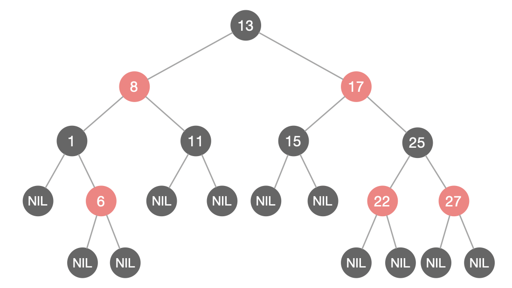

红黑树从`根节点`到`叶子节点`的最长路径不会超过最短路径的 2 倍。

> 红黑树的平衡性

当插入或删除节点的时候，红黑树的规则有可能被打破，这时候就需要作出一些调整，来继续维持红黑树的特性。

加入向原红黑树插入值为`21`的新节点：

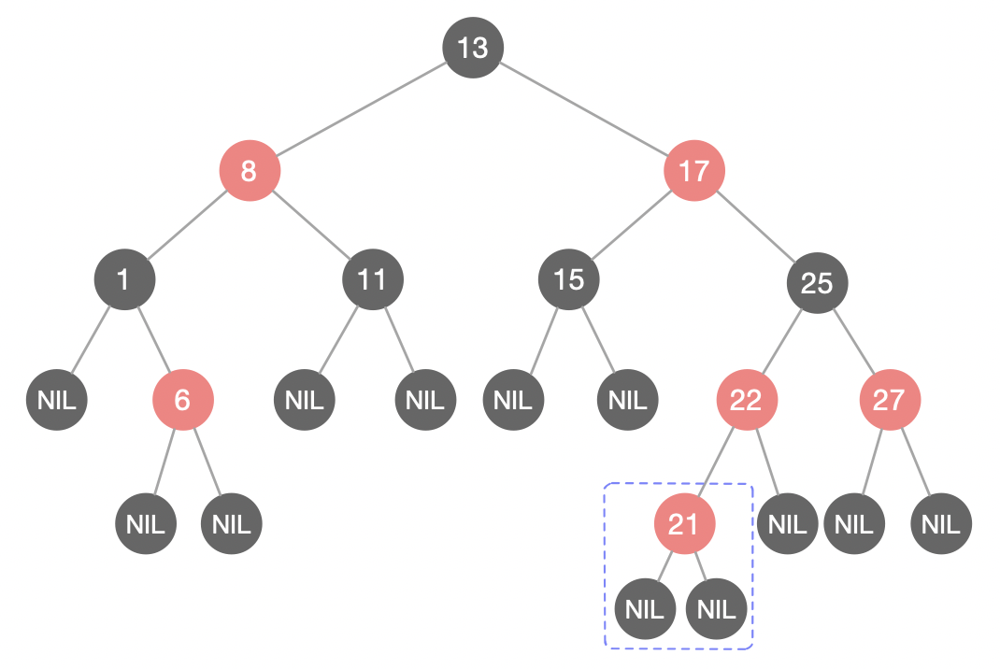

由于父节点 22 是红色节点，因此这种情况打破了红黑树的规则4（每个红色节点的两个子节点都是黑色），必须进行调整，使之重新符合红黑树的规则。

调整有两种方法：`变色`和`旋转`。而旋转又分为`左旋`和`右旋`。

1. **变色**

为了重新符合红黑树的规则，尝试把红色节点变为黑色，或者把黑色节点变为红色。

下图所表示的是红黑树的一部分，需要注意节点25并非根节点。因为节点21和节点22连续出现了红色，不符合规则4，所以把节点22从红色变成黑色：

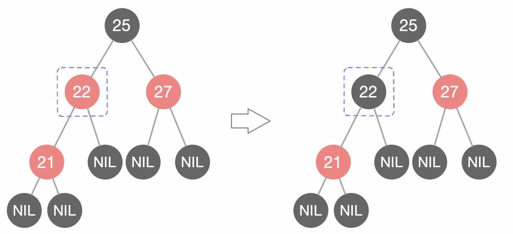

但这样并不算完，因为凭空多出的黑色节点打破了规则 5，所以发生连锁反应，需要继续把节点 25 从黑色变成红色：

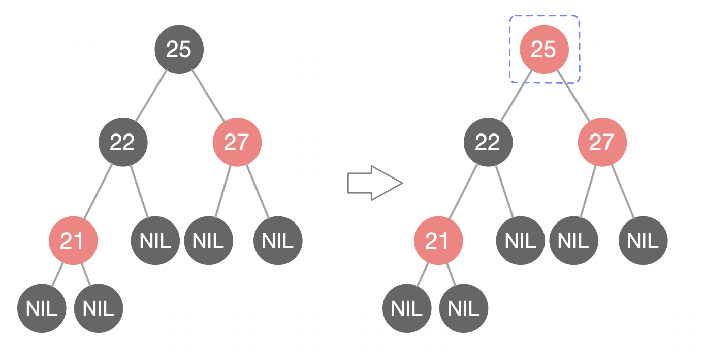

此时仍然没有结束，因为节点25和节点27又形成了两个连续的红色节点，需要继续把节点27从红色变成黑色：

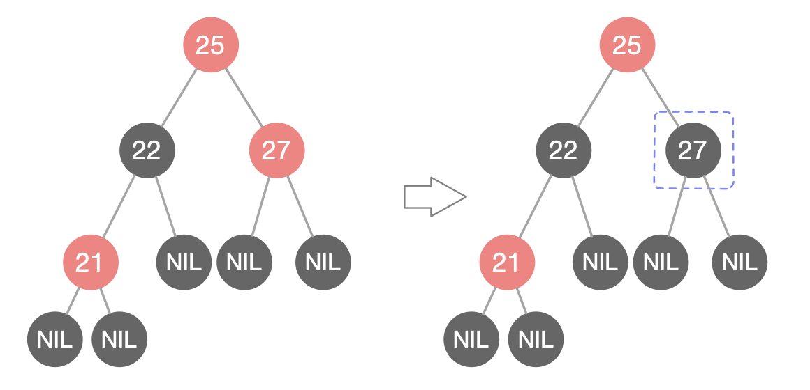

2. **左旋**

`逆时针`旋转红黑树的两个节点，使得父节点被自己的右孩子取代，而自己成为自己的左孩子。如下图：

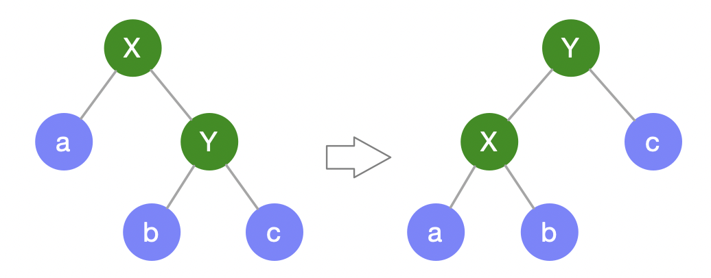

图中，身为右孩子的Y取代了X的位置，而X变成了自己的左孩子。此为左旋转。

3. **右旋**

`顺时针`旋转红黑树的两个节点，使得父节点被自己的左孩子取代，而自己成为自己的右孩子。

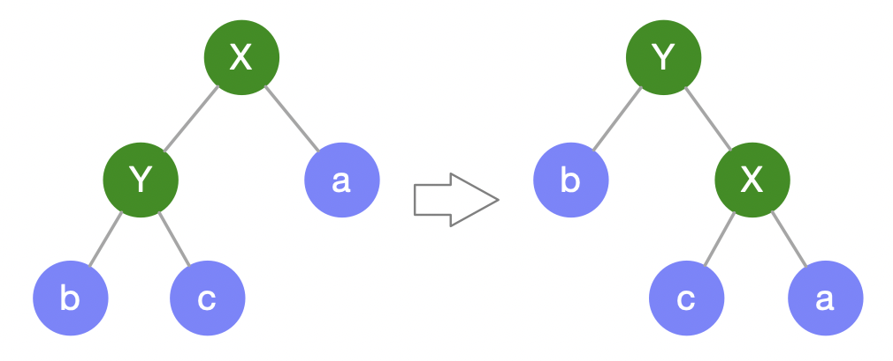

图中，身为左孩子的Y取代了X的位置，而X变成了自己的右孩子。此为右旋转。

> 实例演示

红黑树的插入和删除包含很多种情况，每种情况都有不同的处理方式。

以刚才插入节点21的情况为例：


首先，我们需要做的是`变色`，把节点25及其下方的节点变色：

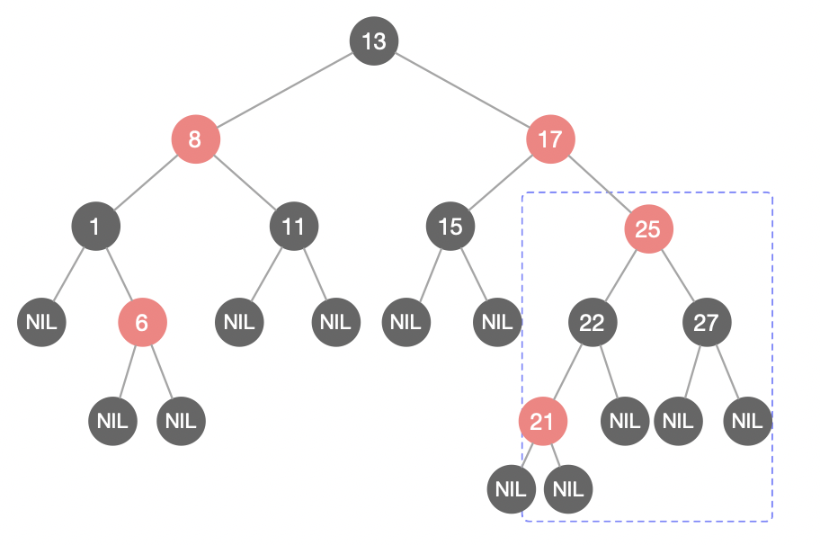

此时节点17和节点25是连续的两个红色节点，那么把节点17变成黑色节点？恐怕不合适。这样一来不但打破了规则4，而且根据规则2（根节点是黑色），也不可能把节点13变成红色节点。

变色已无法解决问题，我们把节点13 看做X，把节点17看做Y，像刚才的示意图那样进行`左旋转`：

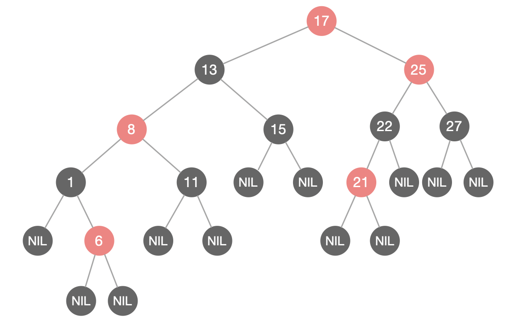

由于根节点必须是黑色节点，所以需要`变色`，变色结果如下：

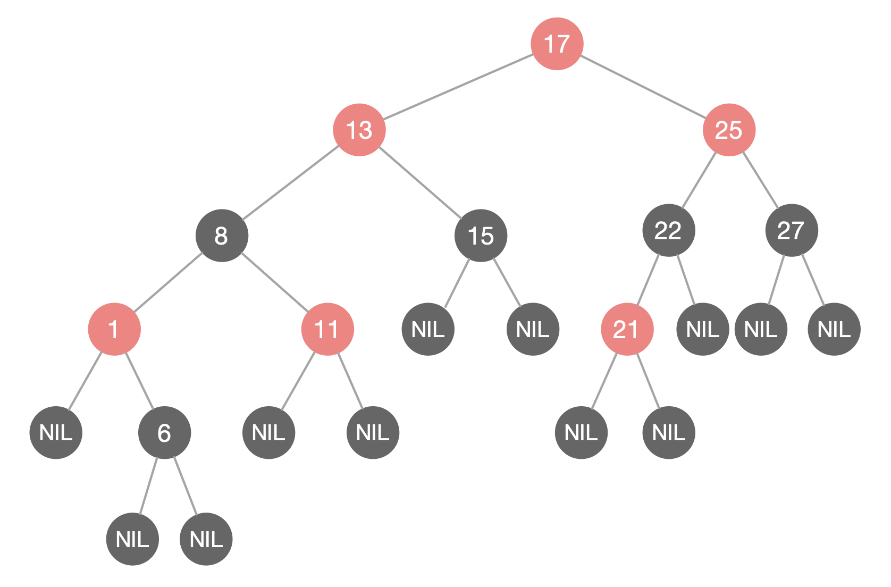

这样就结束了吗？并没有。因为其中两条路径(17 -> 8 -> 6 -> NIL)的黑色节点个数是4，其他路径的黑色节点个数是3，不符合规则5。

这时候我们需要把节点13看做X，节点8看做Y，像刚才的示意图那样进行`右旋转`：

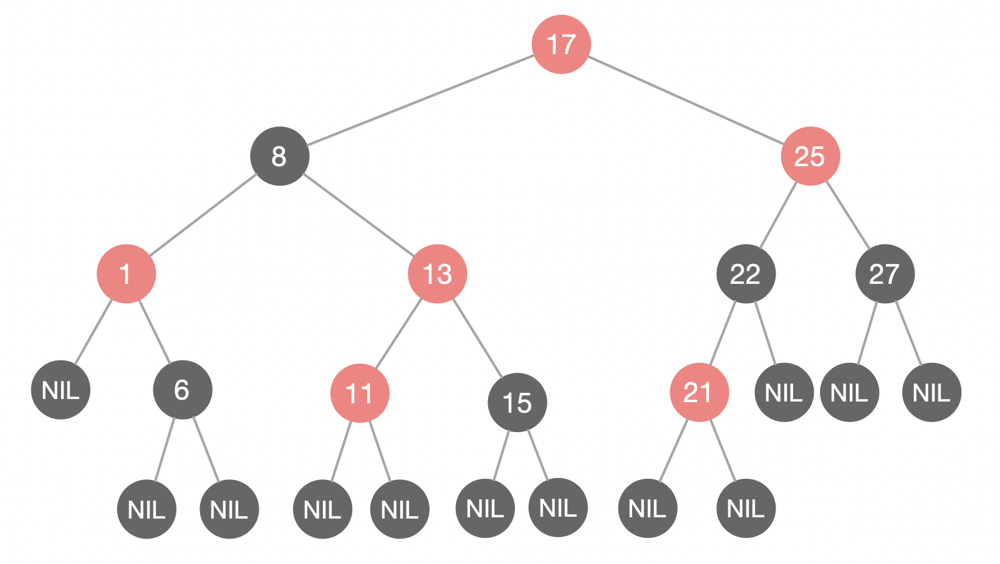

最后根据规则来进行`变色`：

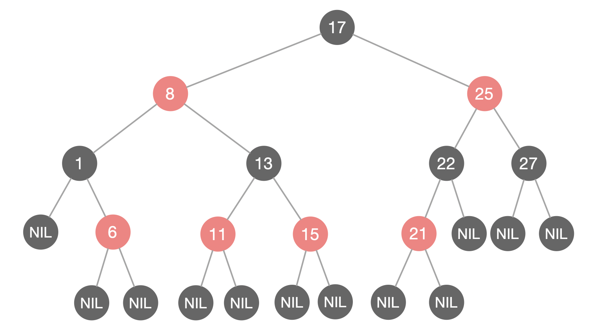

如此一来，我们的红黑树变得重新符合规则。这一个例子的调整过程比较复杂，经历了如下步骤：

`变色 -> 左旋转 -> 变色 -> 右旋转 -> 变色`

> 红黑树的应用：

JDK 的集合类 TreeMap、TreeSet 以及 JDK1.8 的 HashMap 底层都用到了红黑树。


## BTree & B+Tree

[BTree和B+Tree详解](https://blog.csdn.net/hao65103940/article/details/89032538)


## 有向图

> 创建有向图的两种方式：`邻接矩阵`、`邻接表`

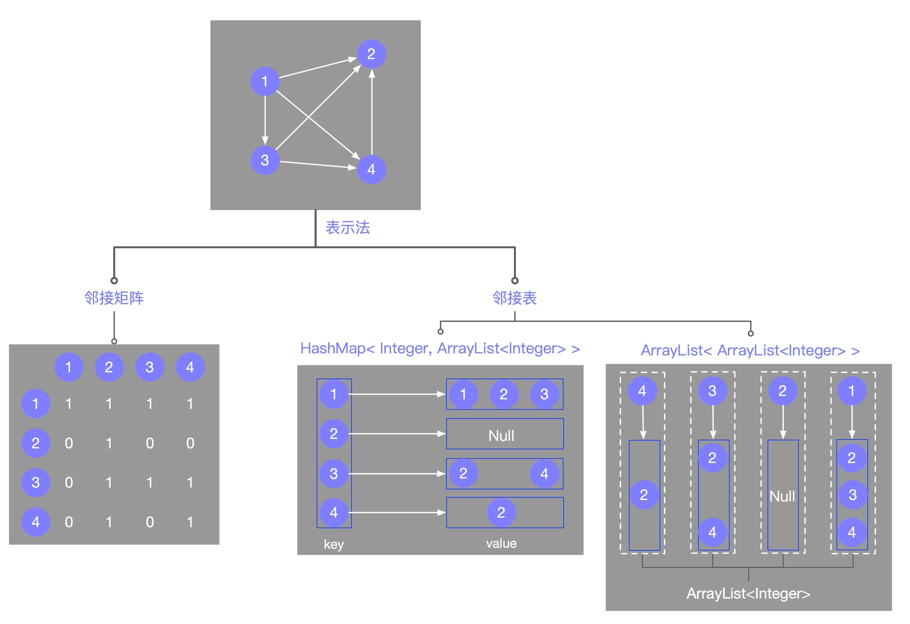

**邻接矩阵**

+ 有N个点，就创建一个N*N的矩阵

**邻接表**

邻接表的两种表示方法

+ HashMap<key,value>

+ key: int 结点

+ value: Arraylist 结点所能直接到达的点

+ Arralist< Arralist<Integer> >


## 单调栈

> 从栈底元素到栈顶元素呈单调递增或单调递减，栈内序列满足单调性的栈。

单调递增栈：从栈顶到栈底为从小到大

单调递减栈：从栈顶到栈底为从大到小

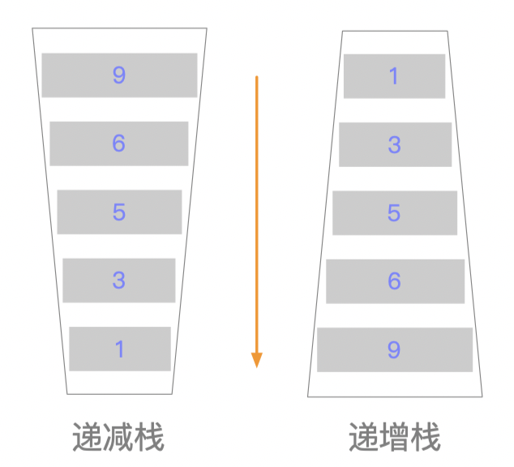

以`递增栈`为例，在任意时刻，栈中的元素自顶向下都是递增的，想要满足该条件，就需要每个元素想要入栈的时候，只有当该元素比栈顶元素小的时候才可以入栈。

在实际应用中，可以根据不同的题目选择相应的单调栈。


>单调栈相关题目

[leetcode 496.下一个更大元素I](https://leetcode-cn.com/problems/next-greater-element-i/)       

[leetcode 496.下一个更大元素II](https://leetcode-cn.com/problems/next-greater-element-ii/)       

[leetcode 1118.一月有多少天](https://leetcode-cn.com/problems/number-of-days-in-a-month/)    

[leetcode 739.每日温度](https://leetcode-cn.com/problems/daily-temperatures/)

[剑指Offer_包含min函数的栈](https://www.nowcoder.com/practice/4c776177d2c04c2494f2555c9fcc1e49?tpId=13&&tqId=11173&rp=1&ru=/ta/coding-interviews&qru=/ta/coding-interviews/question-ranking)

`求最大子矩阵的大小`

`求柱状图中最大矩形面积`


**下一个更大元素I**

```java
public static int[] nextGreaterElement(int[] nums){
    int[] ans = new int[nums.length]; // 存放答案的数组
    Stack stack = new Stack();  // 维持一个递增栈
    for(int i=nums.length-1; i>=0; i--){ // 倒着往栈里放
        while(!stack.empty() && (int)stack.peek() <= nums[i]){  // 一直出栈，直到找到一个栈顶元素大于nums[i]的才终止
            stack.pop(); // 矮个起开，反正也被挡着了，找不到就一直pop，要么找到，要么pop完也没找到
        }
        ans[i] = stack.empty() ? -1 : (int)stack.peek(); // 这个元素身后的第一个高个
        stack.push(nums[i]); // 进栈，接受之后的身高判定吧！
    }
    return ans;
}
```


**柱状图中最大矩形面积**

此外还有单调栈经典题目：`求最大子矩阵的大小`

> 题目：给定一个整型矩阵map，其中的值只有 0 和 1 两种，求其中全是 1 的所有矩形区域中，最大的矩形区域为 1 的数量。
>
> 例如：0 1 1 0
>
> 其中，最大的矩形区域有 2 个 1，所以返回 2
>
> 再如：
> 1 0 1 1
> 1 1 1 1
> 1 1 1 0
>
> 其中，最大的矩形区域有 6 个 1，所以返回 6

在解这道题之前，我们先来看另一道比较简单的题目：`求柱状图中最大矩形面积`

> 给出一个柱状图，它的每个矩形的宽度都为1，高度是题目所给。求出这个矩形图中最大面积的长方形。
>
> 矩形统计图的数据为 [4, 3, 2, 5, 6]

如图：

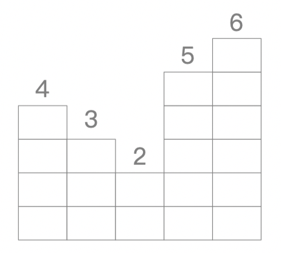

这里就需要维护一个`递减栈`


拉不拉东这是一个`递增栈`，只有当外面的元素小于栈顶元素才会被入栈，出栈的过程是外面的元素寻找比自己大的元素的过程。

```java
public static int[] nextGreaterElement(int[] nums1, int[] nums2) {
    int[] ans = new int[nums1.length];  // 答案数组
    Stack<Integer> stack = new Stack<>(); //递增栈
    Map<Integer,Integer> map = new HashMap<>(nums2.length);

    for(int i=nums2.length-1; i>=0; i--){
        while(!stack.empty() && stack.peek()<=nums2[i]){
            stack.pop();
        }
        int p = stack.empty() ? -1:stack.peek();
        map.put(nums2[i],p);
        stack.push(nums2[i]);
    }

    for(int i=0;i<nums1.length;i++){
        ans[i] = map.get(nums1[i]);
    }
    return ans;
}
```


## 堆

[堆—五分钟学算法](https://mp.weixin.qq.com/s?__biz=MzUyNjQxNjYyMg==&mid=2247484290&idx=1&sn=971ae3365a8a9d284e427e623d825bba&scene=21#wechat_redirect)

### PriorityQueue<>()

[原文](https://www.cnblogs.com/Elliott-Su-Faith-change-our-life/p/7472265.html)

> 堆简介

Java中PriorityQueue通过二叉`小顶堆`实现，可以用一棵`完全二叉树`表示。

前面以Java ArrayDeque为例讲解了Stack和Queue，其实还有一种特殊的队列叫做PriorityQueue，即`优先队列`。优先队列的作用是能保证每次取出的元素都是队列中权值最小的（Java的优先队列每次取最小元素，C++的优先队列每次取最大元素）。这里牵涉到了大小关系，元素大小的评判可以通过元素本身的自然顺序（natural ordering），也可以通过构造时传入的`比较器`（Comparator，类似于C++的仿函数）。

Java中PriorityQueue实现了Queue接口，不允许放入`null`元素；其通过堆实现，具体说是通过完全二叉树（*complete binary tree*）实现的小顶堆（任意一个非叶子节点的权值，都不大于其左右子节点的权值），`也就意味着可以通过数组来作为PriorityQueue的底层实现`。

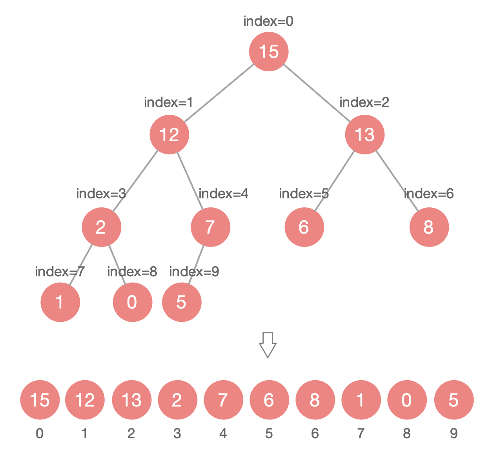

二叉堆可以用数组来表示，父子节点下标关系为：

+ `leftIndex = parentIndex * 2 + 1`     
+ `rightIndex = parentIndex * 2 + 2`
+ `parentIndex = (nodeIndex - 1) / 2`     `nodeIndex 表示左/右子节点`

通过上述三个公式，可以轻易计算出某个节点的父节点以及子节点的下标。这也就是为什么可以直接用数组来存储堆的原因。

**PriorityQueue** 的`peek()`和`element`操作是常数时间，`add()`、 `offer()`、无参数的`remove()`以及`poll()`方法的时间复杂度都是*log(N)*。


> 构造器

**来看一下源码**：

```java
public class PriorityQueue<E> extends AbstractQueue<E>
    implements java.io.Serializable {
  	
  	private static final long serialVersionUID = -7720805057305804111L;
  	private static final int DEFAULT_INITIAL_CAPACITY = 11;
  
  	transient Object[] queue;  //用一个数组来实现
  	private int size = 0;
  	private final Comparator<? super E> comparator;
  	transient int modCount = 0;
  
  	//无参构造器，初始大小默认为11
  	public PriorityQueue() {
        this(DEFAULT_INITIAL_CAPACITY, null);
    }
  
  	//传初始容量的构造器
  	public PriorityQueue(int initialCapacity) {
        this(initialCapacity, null);
    }
  
  	//传比较器的构造器
  	public PriorityQueue(Comparator<? super E> comparator) {
        this(DEFAULT_INITIAL_CAPACITY, comparator);
    }
  
  	//传初始容量、比较器的构造器
  	public PriorityQueue(int initialCapacity,
                         Comparator<? super E> comparator) {
        // Note: This restriction of at least one is not actually needed,
        // but continues for 1.5 compatibility
        if (initialCapacity < 1)
            throw new IllegalArgumentException();
        this.queue = new Object[initialCapacity];
        this.comparator = comparator;
    }
  
  	public PriorityQueue(Collection<? extends E> c) {
        if (c instanceof SortedSet<?>) {
            SortedSet<? extends E> ss = (SortedSet<? extends E>) c;
            this.comparator = (Comparator<? super E>) ss.comparator();
            initElementsFromCollection(ss);
        }
        else if (c instanceof PriorityQueue<?>) {
            PriorityQueue<? extends E> pq = (PriorityQueue<? extends E>) c;
            this.comparator = (Comparator<? super E>) pq.comparator();
            initFromPriorityQueue(pq);
        }
        else {
            this.comparator = null;
            initFromCollection(c);
        }
    }
  
  	public PriorityQueue(PriorityQueue<? extends E> c) {
        this.comparator = (Comparator<? super E>) c.comparator();
        initFromPriorityQueue(c);
    }  	
}
```


>`add(E e)`和`offer(E e)`

`add(E e)`和`offer(E e)`的语义相同，都是向优先队列中插入元素，只是`Queue`接口规定二者对插入失败时的处理不同，前者在插入失败时抛出异常，后者则会返回`false`。但是对于 PriorityQueue 这两个方法其实没什么差别。

```java
public boolean add(E e) {
  	return offer(e);
}

public boolean offer(E e) {
    if (e == null)   //不允许放入null元素
      	throw new NullPointerException();
  	modCount++;
  	int i = size;
    if (i >= queue.length)
      	grow(i + 1);  //自动扩容
  	size = i + 1;
    if (i == 0)       //队列原来为空，这是插入的第一个元素
      	queue[0] = e;
    else
      	siftUp(i, e); //调整
  	return true;
}
```

上述代码中，扩容函数`grow()`类似于`ArrayList`里的`grow()`函数，就是再申请一个更大的数组，并将原数组的元素复制过去，这里不再赘述。需要注意的是`siftUp(int k, E x)`方法，该方法用于插入元素`x`并维持堆的特性。

新加入的元素`x`可能会破坏小顶堆的性质，因此需要进行调整。调整的过程为：从`k`指定的位置开始，将`x`逐层与当前点的`parent`进行比较并交换，直到满足`x >= queue[parent]`为止。注意这里的比较可以是元素的自然顺序，也可以是依靠比较器的顺序。

**其源码如下**：

```java
private void siftUp(int k, E x) {
    if (comparator != null)
      	siftUpUsingComparator(k, x);
    else
      	siftUpComparable(k, x);
}

private void siftUpComparable(int k, E x) {
  	Comparable<? super E> key = (Comparable<? super E>) x;
    while (k > 0) {
      	int parent = (k - 1) >>> 1;
      	Object e = queue[parent];
        if (key.compareTo((E) e) >= 0)
          	break;
      	queue[k] = e;
      	k = parent;
    }
    queue[k] = key;
}

private void siftUpUsingComparator(int k, E x) {
    while (k > 0) {
      	int parent = (k - 1) >>> 1;
      	Object e = queue[parent];
        if (comparator.compare(x, (E) e) >= 0)
         	 break;
    	  queue[k] = e;
     	 	k = parent;
    }
    queue[k] = x;
}
```

**PriorityQueue.offer(E e) siftUp 过程图解**：

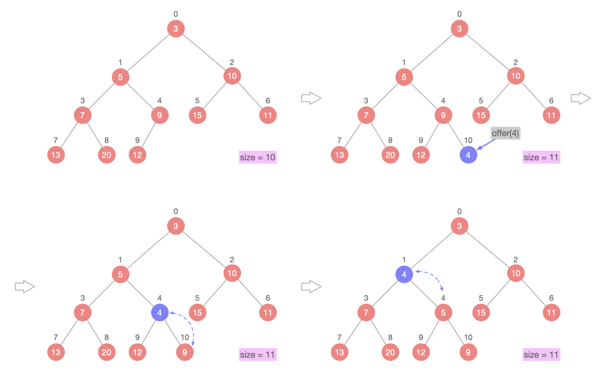


> element() 和 peek()

`element()`和`peek()`的语义完全相同，都是获取但不删除队首元素，也就是队列中权值最小的那个元素，二者唯一的区别是当方法失败时前者抛出异常，后者返回`null`。根据小顶堆的性质，堆顶那个元素就是全局最小的那个；由于堆用数组表示，根据下标关系，`0`下标处的那个元素既是堆顶元素。所以直接返回数组`0`下标处的那个元素即可。

源码如下：

```java
public E peek() {
  	return (size == 0) ? null : (E) queue[0];
}
```


> remove() 和 poll()

`remove()`和`poll()`方法的语义也完全相同，都是`获取并删除队首`元素，区别是当方法失败时`前者`抛出异常，`后者`返回`null`。由于删除操作会改变队列的结构，为维护小顶堆的性质，需要进行必要的调整。

**删除队首**：

```java
public E poll() {
    if (size == 0)
      	return null;
    int s = --size;
    modCount++;
    E result = (E) queue[0]; //0下标处的那个元素就是最小的那个
    E x = (E) queue[s];
    queue[s] = null;
    if (s != 0)
      	siftDown(0, x);   //调整
    return result;
}
```

上述代码首先记录`0`下标处的元素，并用最后一个元素替换`0`下标位置的元素，之后调用`siftDown()`方法对堆进行调整，最后返回原来`0`下标处的那个元素（也就是最小的那个元素）。重点是`siftDown(int k, E x)`方法，该方法的作用是从`k`指定的位置开始，将`x`逐层向下与当前点的左右孩子中较小的那个交换，直到`x`小于或等于左右孩子中的任何一个为止。

```java
private void siftDown(int k, E x) {
    if (comparator != null)
      	siftDownUsingComparator(k, x);
    else
      	siftDownComparable(k, x);
}
```

**PriorityQueue.poll() siftDown 过程图解**：

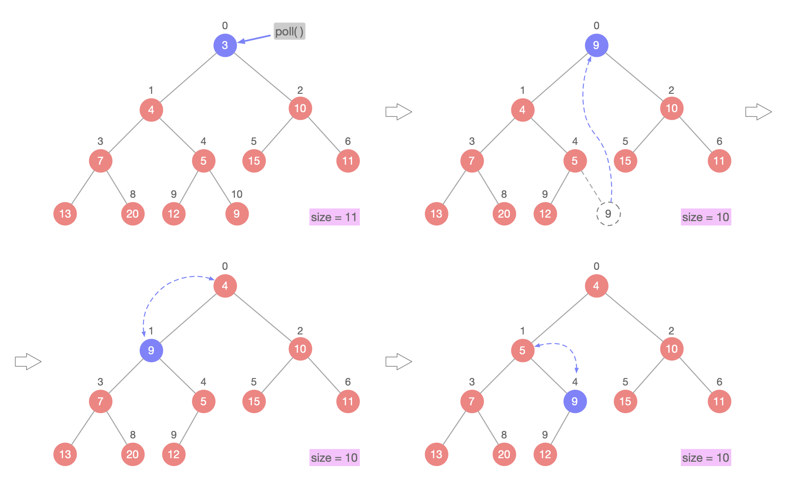

> remove(Object o)

**删除特定元素**：

`remove(Object o)`方法用于删除队列中跟`o`相等的某一个元素（如果有多个相等，只删除一个），该方法不是*Queue*接口内的方法，而是*Collection*接口的方法。由于删除操作会改变队列结构，所以要进行调整；又由于删除元素的位置可能是任意的，所以调整过程比其它函数稍加繁琐。

具体来说，`remove(Object o)`可以分为2种情况：

1. 删除的是最后一个元素。直接删除即可，不需要调整。
2. 删除的不是最后一个元素，从删除点开始以最后一个元素为参照调用一次`siftDown()`即可。此处不再赘述。

**PriorityQueue.remove(Object o) 的 2 种情况**：

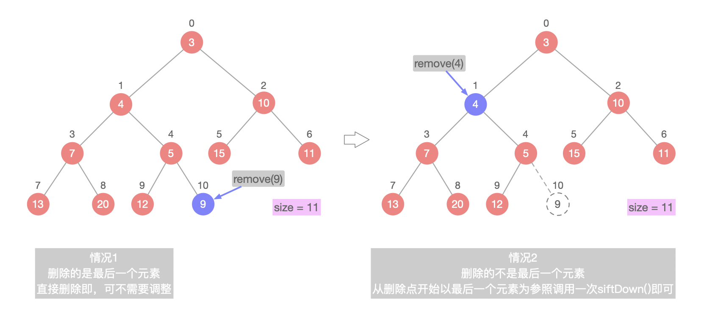

```java
public boolean remove(Object o) {
  	int i = indexOf(o);
    if (i == -1)
      	return false;
    else {
      	removeAt(i);
      	return true;
    }
}

private int indexOf(Object o) {
    if (o != null) {
        for (int i = 0; i < size; i++)
          	if (o.equals(queue[i]))
            		return i;
    }
    return -1;
}

private E removeAt(int i) {
    // assert i >= 0 && i < size;
    modCount++;
    int s = --size;
    if (s == i) // removed last element
      	queue[i] = null;
    else {
        E moved = (E) queue[s];
        queue[s] = null;
        siftDown(i, moved);
        if (queue[i] == moved) {
          	siftUp(i, moved);
            if (queue[i] != moved)
              	return moved;
        }
    }
    return null;
}

boolean removeEq(Object o) {
    for (int i = 0; i < size; i++) {
        if (o == queue[i]) {
          	removeAt(i);
          	return true;
        }
    }
    return false;
}
```


> 常用方法时间复杂度总结

|             方法              | 时间复杂度 |
| :---------------------------: | :--------: |
|      `booean offer(E e)`      |   O(log)   |
| `boolean  contains(Object o)` |    O(N)    |
|          `E peek()`           |    O(1)    |
|          `E poll()`           |   O(log)   |
|  `boolean remove(Object o)`   |    O(N)    |
|         `int size()`          |    O(1)    |


