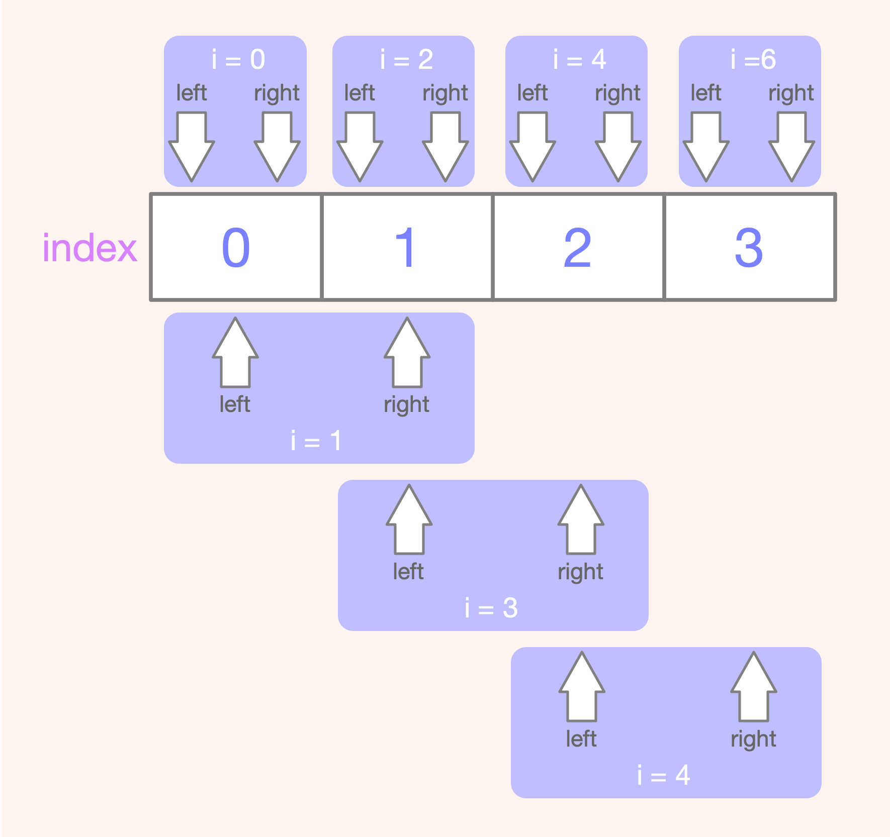
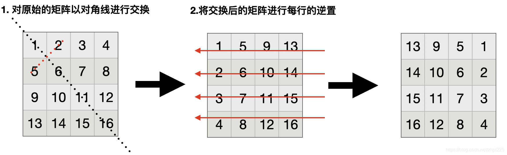

## 2020.10.21 阅文

### 1. 回文串数量

[647. 回文子串](https://leetcode-cn.com/problems/palindromic-substrings/)

> 给定一个字符串，返回这个字符串中有多少个回文子串。
>
> 两个相同的回文子串出现在不同的位置，认为是2个回文串。
>
> a、aa、aaa、aba、aabaa、abcba均认为是回文子串。

**示例1**：

输入

```
"aaa"
```

输出

```
6
```

说明

```
a、a、a、aa、aa、aaa
```

**示例2**：

输入

```
"abcb"
```

输出

```
5
```

说明

```
a、b、c、b、bcb
```

**函数签名**：

```java
import java.util.*;

public class Solution{
  	public int palindromeCount(String str){
      	
    }
}
```

注意题目中说的是`回文子串`，而不是`回文子序列`，子串是连续的，而子序列是不要求连续的。

> **方法一：中心拓展**

计算有多少个回文子串的最朴素方法就是枚举出所有的回文子串，而枚举出所有的回文字串又有两种思路，分别是：

+ 枚举出所有的子串，然后再判断这些子串是否是回文；
+ 枚举每一个可能的回文中心，然后用两个指针分别向左右两边拓展，当两个指针指向的元素相同的时候就拓展，否则停止拓展。

假设字符串的长度为 n。我们可以看出前者会用 $O(n^2)$ 的时间枚举出所有的子串 $s[l_{i}···r_{i}]$，然后再用 $O(r_i - l_i + 1)$ 的时间检测当前的子串是否是回文，整个算法的时间复杂度是 $O(n^3)$。而后者枚举回文中心的是 $O(n)$ 的，对于每个回文中心拓展的次数也是 $O(n)$ 的，所以时间复杂度是$O(n^2)$。所以我们选择第二种方法来枚举所有的回文子串。

在实现的时候，我们需要处理一个问题，即如何有序地枚举所有可能的回文中心，我们需要考虑回文长度是`奇数`和回文长度是`偶数`的两种情况。如果回文长度是奇数，那么回文中心是一个字符；如果回文长度是偶数，那么中心是两个字符。当然你可以做两次循环来分别枚举奇数长度和偶数长度的回文，但是我们也可以用一个循环搞定。我们不妨写一组出来观察观察，假设 n = 4，我们可以把可能的回文中心列出来：

| **编号** $i$ | 回文中心左起始位置 $l_i$ | 回文中心右起始位置 $r_i$ |
| :----------: | :----------------------: | :----------------------: |
|      0       |            0             |            0             |
|      1       |            0             |            1             |
|      2       |            1             |            1             |
|      3       |            1             |            2             |
|      4       |            2             |            2             |
|      5       |            2             |            3             |
|      6       |            3             |            3             |

**如下图所示**：



由此我们可以看出长度为 nn 的字符串会生成 2n-12n−1 组回文中心 $[l_i, r_i]$，其中 $l_i =  \frac{i}{2}$，$r_i = l_i + (i \%2)$。这样我们只要从 $0$ 到 $2n−1$ 遍历$ i$，就可以得到所有可能的回文中心，这样就把奇数长度和偶数长度两种情况统一起来了。

**Java实现如下**：

```java
class Solution {
    public int countSubstrings(String s) {
        int res = 0;
        int len = s.length();
        for(int i = 0; i <= 2*len-1; i++){
            int left = i/2;
            int right = i/2 + i%2;
            while(left >= 0 && right < len && s.charAt(left) == s.charAt(right)){
                left--;
                right++;
                res++;
            }
        }
        return res;
    }
}
```

- 时间复杂度：$O(n^2)$
- 空间复杂度：$O(1)$

笔试的话还要考虑到输入输出：

完整代码如下：

```java
import java.util.Scanner;

/**
 * @Author Hory
 * @Date 2020/10/22
 */
public class Palindrome {
  
    public static void main(String[] args) {
        Scanner input = new Scanner(System.in);
        String str = input.nextLine();
        int out = countSubstrings(str);
        System.out.println(out);
    }

    public static int countSubstrings(String s) {
        int res = 0;
        int len = s.length();
        for(int i = 0; i <= 2*len-1; i++){
            int left = i/2;
            int right = i/2 + i%2;
            while(left >= 0 && right < len && s.charAt(left) == s.charAt(right)){
                left--;
                right++;
                res++;
            }
        }
        return res;
    }
}
```


> **方法二：Manacher 算法**

https://www.jianshu.com/p/116aa58b7d81

Manacher算法，又叫“马拉车”算法，可以在时间复杂度为O(n)的情况下求解一个字符串的`最长回文子串长度`的问题。

该位置的最右回文右边界 = `max（该位置的回文子串最右边的位置 , 该位置之前所有位置的回文子串最右边的位置）`


### 2. 旋转数组

>给定一个整型正方形矩阵 `Matrix`，请把该矩阵调整成顺时针旋转 90 度的样子。

**输入描述**：`请遍历输出矩阵到一行`

**示例**：

输入：第一行是矩阵的总的行数。接下来的 N 行，每行是以逗号隔开的数字

```
4
1,2,3,4
5,6,7,8
9,10,11,12
13,14,15,16
```

输出：翻转之后矩阵的所有元素都在同一行进行输出，并且以逗号进行隔开

```
13, 9, 5, 1, 14, 10, 6, 2, 15, 11, 7, 3,16, 12, 8, 4
```

**备注**：`额外空间复杂度为O(1)`

**思路如下图所示**：



题目本身不是很难，主要是针对题目的输入输出要求，要做适当的处理。由于输入要求每行以逗号作为分隔符进行输入数据，因此考虑`一行作为一个整体`进行以一个字符串接收，然后再使用`split`函数将每行处理成一个字符串数组（`split`函数返回一个字符串数组），然后再赋值给初始的二维的字符串数组一行（一个二维的字符串数组可以看做是多个一维的字符串数组构成）。

**Java实现如下**：

```java
import java.util.Scanner;
public class Solution {

    public static void main(String[] args) {
        Scanner input = new Scanner(System.in);
        int N = input.nextInt();  // N 为矩阵的行数
        String[][] matrix = new String[N][];
        // 然后接收四行字符串比如：1,2,3, 4
        for (int i = 0; i < N; i++) {
            String str = input.next(); // 此处不能使用input.nextLine，因为前面使用sc.nextInt输入后，按了enter键进行换行，使用sc.nextLine会吸收这个N之后的换行作为空格。
            matrix[i] = str.split(",");
        }

        // 上面完成了矩阵的输入，下面完成矩阵的翻转，将矩阵顺指针翻转90度
        // 主要步骤：1.根据对角线进行交换 2.对所有的行进行逆置
        for (int i = 0; i < N; i++) {//外循环表示行
            for (int j = i+1; j < N; j++) {
                String temp = matrix[i][j];
                matrix[i][j] = matrix[j][i];
                matrix[j][i] = temp;
            }
        }
       
        for (int i = 0; i < N; i++) {
            reverse(matrix[i]);
        }

        for (int i = 0; i < N; i++) {
            for (int j = 0; j < N; j++) {
                if(i==N-1 && j==N-1) System.out.println(matrix[i][j]);
                else System.out.print(matrix[i][j]+",");
            }
        }
    }
  
  	// 数组元素逆置
  	public static void reverse(String[] strs){
        for (int i = 0; i < strs.length/2; i++) {
            String temp = strs[i];
            strs[i] = strs[strs.length-i-1];
            strs[strs.length-i-1] = temp;
        }
    }
}
```


### 3. 去除重复字符

>去除字符串中的重复字符，对于出现超过2次（包括2次）的字符，只保留第一个。
>
>例：输入 `abcbdde`，输出`abcde` 。

示例1：

输入

```
"abcbdde"
```

输出

```
"abcde"
```

**函数签名**：

```java
import java.util.*;

public class Solution{
  	public String removeDuplicatedChar{
      	
    }
}
```

**Java实现如下**：

```java
import java.util.HashSet;
import java.util.Scanner;
import java.util.Set;

/**
 * @Author Hory
 * @Date 2020/10/17
 */
public class Hello {
    public static void main(String[] args) {
        Scanner input = new Scanner(System.in);
        String str = input.nextLine();
        String out = removeDuplicate(str);
        System.out.println(out);
    }

    public static String removeDuplicate(String str){
        Set<String> set = new HashSet<String>();
        StringBuilder stb =  new StringBuilder();
        for(int i = 0; i < str.length(); i++){
            if(!set.contains(Character.toString(str.charAt(i)))){
                set.add(Character.toString(str.charAt(i)));
                stb.append(str.charAt(i));
            }else{
                continue;
            }
        }
        String res = new String(stb);
        return res;
    }
}
```


### 4. 矩阵乘法

> 定义
>
> 设 A 为  $m \times p$ 的矩阵，B 为 $p \times n$ 的矩阵，那么称 $m \times n$ 的矩阵 C 为 A 与 B 的乘积，记作 C = AB，其中矩阵 C 的第 `i` 行第 `j` 列元素可以表示为：
>
> $ (AB)_{ij} = \sum\limits_{k=1}^{p} a_{ik}b_{kj} = a_{i1}b_{1j} + a_{i2}b_{2j} +  \cdot  \cdot  \cdot + a_{ip}b_{pj} $

 请编程实现矩阵的乘法。

**输入描述**：

```
输入的第一行包括3个数字，为 m, p, n
接下来的 m 行数据为第一个矩阵的数据，每个数据之间用英文逗号 , 分割
接下来的 p 行数据为第二个矩阵的数据，每个数据之间用英文逗号 , 分割
```

输入

```
2,3,2
1,0,-1
1,1,-3
0,3
1,2
3,1
```

输出

```
-3,2
-8,2
```

**备注**：请注意字符分隔和拼接都使用英文逗号 `,` 输入和输出前后没有空行


### 5. 压轴题

> 请完成一个简单的用户密码验证过程，给定的条件如下：

数据库中存在用户表 `users`，表结构如下：

```mysql
CREATE TABLE 'users'(
  'uid' bigint(20) NOT NULL COMMENT '用户ID',
  'user_name' varchar(32) NOT NULL COMMENT '用户账号',
  'password' varchar(64) NOT NULL COMMENT '用户混淆密码',
  PRIMARY KEY ('uid'),
  UNIQUE KEY 'u_USER_name' ('user_name')
) ENGINE=INNODB DEFAULT CHARSET=utf8mb4 COMMENT='用户表'
```

完善以下方法：

（可以不用写`import`语句，只需要补充关键步骤即可）

```java
public boolean verifyPassWord(String username, String password){
  	Connection con = getConnection(); // getConnection()是个已有的方法，可以获取到数据库连接


}
```


## 2020.9.27 模拟


### 数据结构

- **堆排序**
- 二叉搜索树的第k个元素

- 使用栈来实现一个队列
- 使用队列实现栈

欠缺：堆排序


### 网络

- 为什么有了Mac地址还要有ip地址
- TCP和UDP的区别
- TCP如何保证可靠的
- TCP的流量控制：滑动窗口的运行机制
- TCP的拥塞控制：主要的过程
- 应用层有些协议：
- DNS协议：
- get和post的区别：至少5条，在cyc2018中
- http1.0和http1.1的区别


### 操作系统

- 进程和线程的区别
- 进程之间的通信方式

### java

- Equals和==的区别

- 重写equals为什么要重写hashcode
- Java常量池之Integer 缓存
- Java创建对象的方式：
	- new
	- 反射
	- 序列化
	- 克隆

- 熟悉的设计模式
	-  单例设计模式有哪些实现方式： 懒汉模式、饿汉模式、双重检验（重要）

### 编程题

- 翻转一个单链表


