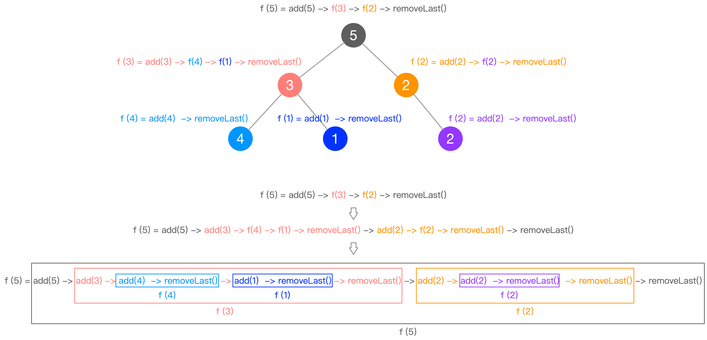
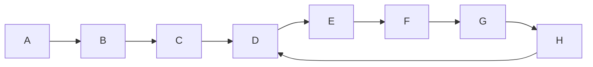
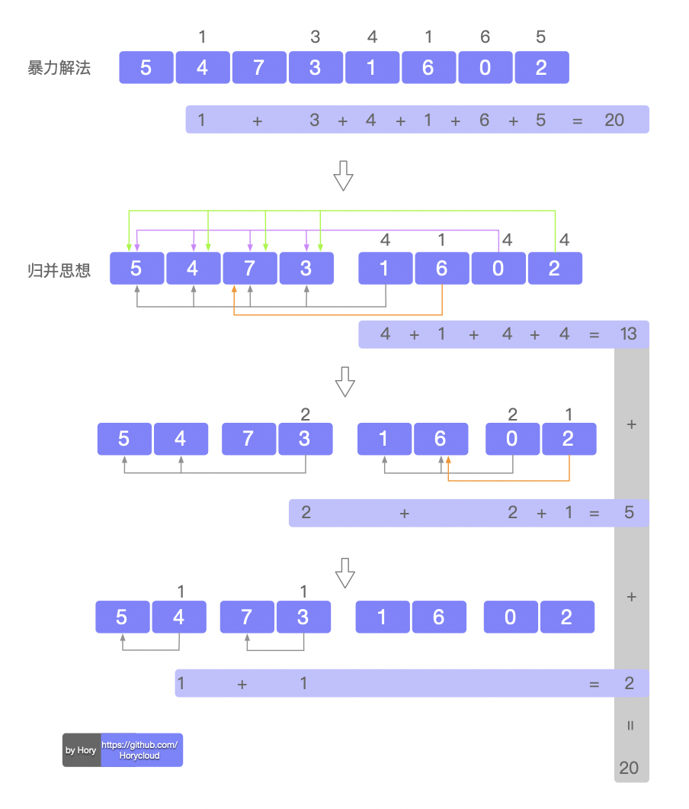

## 剑指Offer牛客网』

[剑指Offer牛客网](https://www.nowcoder.com/ta/coding-interviews)


## 把数字翻译成字符串

[把数字翻译成字符串_Leetcode46](https://leetcode-cn.com/problems/ba-shu-zi-fan-yi-cheng-zi-fu-chuan-lcof/)

> 给定一个数字，我们按照如下规则把它翻译为字符串：0 翻译成 “a” ，1 翻译成 “b”，……，11 翻译成 “l”，……，25 翻译成 “z”。一个数字可能有多个翻译。请编程实现一个函数，用来计算一个数字有多少种不同的翻译方法。


```java
class Solution {
    public static int translateNum(int num) {
        int numLen = (num+"").length();
        int[] list = new int[numLen];
        //将整数各个位上的数倒序依次存入数组
        for(int i=0;i<numLen;i++){
            list[i] = (num/(int)Math.pow(10,i))%10;
        }
        if(numLen == 1) return 1;
        if(numLen == 2) return (list[1])*10+list[0]<=25 ? 2 : 1;
        int[] dp  = new int[numLen];  //dp[n]表示取数组list[n]之前的数字时的结果
        dp[0]=1;
      
        if(list[1]>0 && (list[1])*10+list[0] <= 25){
            dp[1] = 2;
        } 
        else if(list[1]==0 || (list[1])*10+list[0] > 25){
            dp[1] = 1;
        } 
        for(int n=2;n<numLen;n++){
            int p = (list[n])*10+list[n-1];
            if(list[n]>0 && p <= 25 ){
                dp[n] = dp[n-1] + dp[n-2];
            }else if(list[n]==0 || p > 25 ){
                dp[n] = dp[n-1];
            }
        }
        return dp[numLen-1];
    }
}
```


## 把字符串转换成整数 ?

[把字符串转换成整数](https://www.nowcoder.com/practice/1277c681251b4372bdef344468e4f26e?tpId=13&&tqId=11202&rp=1&ru=/ta/coding-interviews&qru=/ta/coding-interviews/question-ranking)

>将一个字符串转换成一个整数，要求不能使用字符串转换整数的库函数。 数值为 0 或者字符串不是一个合法的数值则返回 0

这道题难就难在边界的考察。

如果对于一般规则的数字“字符串”转化为数字都很容易，比如：`"+123"`转化为`123`，`"-123"`转化为`-123`

`int`的范围为 $$[2^{31} - 1,  -2^{31} ]$$ ，如果超过了这两个范围该怎么办？

其实也很简单，首先判断这个数的正负，如果正数，超过了INT_MAX，就设置为INT_MAX，如果是负数，首先我们不考虑负号，如果超过了INT_MAX+1, 则就置为INT_MAX+1, 最后再根据正负号，来加负号。

 


## 转变数组后最接近目标值的数组和

[转变数组后最接近目标值的数组和_leetcode1300](https://leetcode-cn.com/problems/sum-of-mutated-array-closest-to-target/)

> 给你一个整数数组 arr 和一个目标值 target ，请你返回一个整数 value ，使得将数组中所有大于 value 的值变成 value 后，数组的和最接近  target （最接近表示两者之差的绝对值最小）。
>
> 如果有多种使得和最接近 `target` 的方案，请你返回这些整数中的最小值。
>
> 请注意，答案不一定是 `arr` 中的数字。

+ 该题用到了双重二分和前缀和


## 硬币兑换


```java
import java.util.Scanner;

//凑硬币
//随便给个金额，然后用1元、5元、10元、20元去凑出这个金额，有哪些方案，各需要多少张？
public class Coin_game {
    public static void main(String[] args) {
        Scanner in = new Scanner(System.in);
        System.out.println("输入金额：");
        int amount = in.nextInt();
        for(int one = 0; one <= amount; ++one){
            for(int five = 0; five <= amount/5; ++five){
                for(int ten = 0;five <= amount/10; ++ten){
                    for(int twenty = 0; twenty <= amount/20; ++twenty){
                        if(one + five*5 + ten*10 + twenty*20 ==amount){
                            System.out.println(one+"张1元，"+five+"张5元，"+ten+"张10元，"+twenty+"张20元");
                        }
                    }
                }
            }
        }
    }
}
```


## 从上到下打印二叉树

> 从上往下打印出二叉树的每个节点，同层节点从左至右打印。

**Java实现如下**：

```java
import java.util.*;
/**
public class TreeNode {
    int val = 0;
    TreeNode left = null;
    TreeNode right = null;

    public TreeNode(int val) {
        this.val = val;
    }
}
*/
public class Solution {
    public ArrayList<Integer> PrintFromTopToBottom(TreeNode root) {
        ArrayList<Integer> res = new ArrayList<>();
        if(root == null) return res;
        Queue<TreeNode> queue = new LinkedList<>();
        queue.offer(root);
        while(!queue.isEmpty()){
            TreeNode temp = queue.poll();
            res.add(temp.val);
            if(temp.left != null) queue.offer(temp.left);
            if(temp.right != null) queue.offer(temp.right);
        }
        return res;
    }
}
```

> 时间复杂度：O(n)，二叉树的每个节点遍历一次
> 空间复杂度：O(n)，二叉树的每个节点入队列一次

## 翻转二叉树

[ 翻转二叉树_leetcode226](https://leetcode-cn.com/problems/invert-binary-tree/)

```java
/**
 * Definition for a binary tree node.
 * public class TreeNode {
 *     int val;
 *     TreeNode left;
 *     TreeNode right;
 *     TreeNode(int x) { val = x; }
 * }
 */
class Solution {
    public static TreeNode invertTree(TreeNode root) {
        if(root == null) return null;
        TreeNode left = invertTree(root.left);
        TreeNode right = invertTree(root.right);
        root.left = right;
        root.right = left;
        return root;
    }
}

class Solution {
    public static TreeNode invertTree(TreeNode root) {
        if(root == null) return null;
        TreeNode pre = root.left;
        root.left = root.right;
        root.right = pre;
        invertTree(root.left);
        invertTree(root.right);
        return root;
    }
}
```


## 重排链表

[重排链表](https://blog.csdn.net/zhpf225/article/details/108308664)


## 重建二叉树

[重建二叉树_面试题7](https://www.nowcoder.com/practice/8a19cbe657394eeaac2f6ea9b0f6fcf6?tpId=13&&tqId=11157&rp=1&ru=/ta/coding-interviews&qru=/ta/coding-interviews/question-ranking)

> 输入某二叉树的前序遍历和中序遍历的结果，请重建出该二叉树。假设输入的前序遍历和中序遍历的结果中都不含重复的数字。例如输入前序遍历序列 {1,2,4,7,3,5,6,8} 和中序遍历序列 {4,7,2,1,5,3,8,6} ，则重建二叉树并返回。

```java
//Definition for binary tree
public class TreeNode {
     int val;
     TreeNode left;
     TreeNode right;
     TreeNode(int val) { 
        this.val = val; 
     }
 }
```

> 可以先看解法 ①，了解思路之后，再看解法②，最终需要掌握的也是解法② 

解法 ① 

+ 比较好理解，但是空间复杂度为 O(n)，因为用到了 Arrays.copyOfRange()

```java
import java.util.Arrays;

public class Solution {
  
    public TreeNode reConstructBinaryTree(int[] pre, int[] in ) {
      
        if(pre.length == 0 || in.length == 0) return null;
      
        TreeNode root = new TreeNode(pre[0]);
      
        for(int i=0; i<in.length; i++){ 
            if(in[i] == pre[0]){  // 注意：数组 copy 是包前不包后
                root.left = reConstructBinaryTree(
                  Arrays.copyOfRange(pre,1,i+1),
                  Arrays.copyOfRange(in,0,i));
                root.right = reConstructBinaryTree(
                  Arrays.copyOfRange(pre,i+1,pre.length),
                  Arrays.copyOfRange(in,i+1,in.length));
              
                break;
            }
        }
        return root;
    }
}
```

解法 ② 

+ 解法 ② 的框架跟解法 ① 差不多，只不过需要处理一些细节问题
+ 空间复杂度 O(1)

```java
public class Solution {
    public TreeNode reConstructBinaryTree(int[] pre,int[] in ) {
        //if(pre.length == 0 || in.length == 0) return null;
        return reBuild (pre, 0, pre.length-1, in, 0, in.length-1);
    }
  
    public static TreeNode reBuild (int[] pre,int pre_left,int pre_right,
                            int[] in,int in_left,int in_right){
        
     	  if(pre_left > pre_right) return null;
        TreeNode root = new TreeNode(pre[pre_left]); // 找到根节点
        for(int i=in_left; i<in_right; i++){
            if(in[i] == root.val){
                root.left = reBuild(pre,pre_left+1,pre_left+i-in_left, 
                                    in,in_left,i-1);
                root.right = reBuild(pre,pre_left+i-in_left+1,pre_right, 
                                     in,i+1,in_right);
                break;
            }
        }
        return root;
    }
}
```

总结：

+ 仔细观察不难发现此题类型有点类似**快排**
+ 共同点是都是递归实现，且涉及到数组区间的变化
+ **当遇到这种情况时，可以用左右指针 left 和 right 代替数组一定区间**


## 二叉树的下一个节点

[二叉树的下一个节点](https://www.nowcoder.com/practice/9023a0c988684a53960365b889ceaf5e?tpId=13&&tqId=11210&rp=1&ru=/ta/coding-interviews&qru=/ta/coding-interviews/question-ranking)

> 给定一个二叉树和其中的一个结点，请找出中序遍历顺序的下一个结点并且返回。注意，树中的结点不仅包含左右子结点，同时包含指向父结点的指针。

```java
public class TreeLinkNode {
    int val;
    TreeLinkNode left = null;
    TreeLinkNode right = null;
    TreeLinkNode next = null;

    TreeLinkNode(int val) {
        this.val = val;
    }
}
```

> 当看到这道题就应该直接想到两个大分支：存在右子树、不存在右子树
>
> 此外，该题没有用到递归（并不是所有关于树的题目都要优先用递归来解）

① 当结点**存在右子树**的时候，中序遍历的下一个结点为右子树的`最左节点`

② 当节点**不存在右子树**的时候，中序遍历的下一个结点必定为该节点的父辈节点

+ 从该节点开始，一直往上找，直到找到一个`是其父节点的左子节点的`节点

```java
public class Solution {

    public TreeLinkNode GetNext(TreeLinkNode pNode){
        if(pNode.right != null){
            pNode = pNode.right;
            while(pNode.left != null){
                pNode = pNode.left;
            }
            return pNode;
        }
        while(pNode.next != null){
            if(pNode == pNode.next.left) return pNode.next;
            pNode = pNode.next;
        }
        return null;
    }
} 
```


## 树的子结构*

[树的子结构](https://www.nowcoder.com/practice/6e196c44c7004d15b1610b9afca8bd88?tpId=13&&tqId=11170&rp=1&ru=/ta/coding-interviews&qru=/ta/coding-interviews/question-ranking)

> 输入两棵二叉树A、B，判断 B 是不是 A 的子结构。（ps：我们约定空树不是任意一个树的子结构）

```java
/**
public class TreeNode {
    int val = 0;
    TreeNode left = null;
    TreeNode right = null;

    public TreeNode(int val) {
        this.val = val;
    }
}
*/
public class Solution {
    // 遍历大树
    public boolean HasSubtree(TreeNode root1, TreeNode root2) {
        if(root1 == null || root2 == null) return false;
        return dfs(root1,root2) || dfs(root1.left,root2) || dfs(root1.right,root2);
    }
    
    // tree1为大树的一部分，遍历子树
    public boolean dfs(TreeNode tree1, TreeNode tree2){
        if(tree2 == null) return true;
        if(tree1 == null) return false;
        return tree1.val == tree2.val && dfs(tree1.left, tree2.left) && dfs(tree1.right, tree2.right);
    }
}
```


## 二叉搜索树的后序遍历序列

[二叉搜索树的后续遍历序列](https://www.nowcoder.com/practice/a861533d45854474ac791d90e447bafd?tpId=13&&tqId=11176&rp=1&ru=/ta/coding-interviews&qru=/ta/coding-interviews/question-ranking)

> 判断一个序列是不是二叉搜索树的后序遍历序列

```java
public class Solution {
    public boolean VerifySquenceOfBST(int [] sequence) {
        if(sequence == null || sequence.length == 0) return false;
        return verify(sequence,0,sequence.length-1);
    }
    
    
    public static boolean verify(int[] sequence, int start, int root){
        if(start >= root) return true;
        int key = sequence[root];
        int i;
        //找到左右子树的分界点
        for(i=start; i<root; i++){
            if(sequence[i] > key){
                break; //当找到大于根节点的数时，此时的指向的就是大于根节点的第一个数
            }
        }
        for(int j=i; j<root; j++){
            if(sequence[j] < key){
                return false;
            }
        }
        return verify(sequence,start,i-1) && verify(sequence,i,root-1);
    }
}
```


## 二叉树中和为某一值的路径

[二叉树中和为某一值的路径](https://www.nowcoder.com/practice/b736e784e3e34731af99065031301bca?tpId=13&&tqId=11177&rp=1&ru=/ta/coding-interviews&qru=/ta/coding-interviews/question-ranking)

> 输入一棵二叉树的根节点和一个整数，按字典序打印出二叉树中节点值的和为输入整数的所有路径。路径定义为从树的根节点开始往下一直到叶节点所经过的节点形成一条路径。

**前置知识**：

如果节点为`root`，那么当前节点为叶子节点的必要条件是：

+ `root.left == null && root.right == null`

找出路径，当然需要遍历整棵树，遍历树的方式有很多种：前序、中序、后序，还有层序，这里选择前序遍历（根节点 --> 左子树 --> 右子树）。

具备了上述前置知识，这里无非增加了`路径`和`target`以及`叶子节点`的判断。

涉及到树的遍历一般都是`递归`，既然是递归，那么一个大问题就可以分为子问题来求解，且子问题的解决方式与大问题相同。只需改变一些动态参数即可！

**父子问题分析**：

这里以该问题为例，对父问题和子问题进行分析：

+ 这里的父问题就是给我一个二叉树，让我去求满足`target`的所有路径，而这个父问题又可以分为两个子问题（如果左右子节点皆存在的话）
+ 对于这个树的左子节点，那么问题就是，以该左子节点为根节点的左子树，求满足`target-left.value`的所有路径。
+ 以右子节点为根节点的右子树同理。

可以发现小问题可以和父问题共用一个函数进行求解，只不过参数的值是动态变化的而已。

**递归算法三部曲**：

1. **明白递归函数的功能**。例如这里的`FindPath(TreeNode root, int target)`，就是从根节点出发，找和为`target`的所有路径
2. **递归终止条件**。当`root`节点为叶子节点，并且`target == root.val`，表示找到了一条符合条件的路径
3. **下一次递归**。如果左子树不为空，则递归左子树`FindPath(root.left, target-left.value)`，右子树同理

最后，用两个全局变量保存路径。

**Java实现如下**：

```java
import java.util.ArrayList;
/**
public class TreeNode {
    int val = 0;
    TreeNode left = null;
    TreeNode right = null;

    public TreeNode(int val) {
        this.val = val;
    }
}
*/

public class Solution {
  
    private ArrayList<ArrayList<Integer>> result = new ArrayList<>();
    private ArrayList<Integer> list = new ArrayList<>();
  
    public ArrayList<ArrayList<Integer>> FindPath(TreeNode root, int target) {
      
        if(root == null) return result; // 有了这句话，后面就不用再对左右节点进行判断了，即不用加if(root.left == null)
        list.add(root.val);
        target -= root.val; // 更新target
        if(target == 0 && root.left == null && root.right == null){ // target为0，且为叶子节点
          	result.add(new ArrayList<Integer>(list));
        }
        FindPath(root.left, target);
        FindPath(root.right, target);
        list.remove(list.size()-1);  // 去掉最后一个元素
        return result;
    }
}
```

如下图，为一个三层的二叉树，下面以该树为例，展示执行过程如下：



由于从始至终用的都是同一个`list`，最后的`list.remove(list.size()-1); ` 语句的目的是每当判断一个节点，都会将其删除，这样，当结束时，`list`就是空的。

既然是同一个`liist`，那么每当找到一个路径，不能将同一个`list`添加到`result`中，所以

+ `result.add(new ArrayList<Integer>(list));`
+ 目的是新建一个`ArrayList`，将`list`中元素复制到`ArrayList`中，再将`ArrayList`添加到`result`


## 二叉树的深度

[二叉树的深度](https://www.nowcoder.com/practice/435fb86331474282a3499955f0a41e8b?tpId=13&&tqId=11191&rp=1&ru=/ta/coding-interviews&qru=/ta/coding-interviews/question-ranking)

>输入一棵二叉树，求该树的深度。从根结点到叶子结点依次经过的结点（含根、叶结点）形成树的一条路径，最长路径的长度为树的深度。

```java
/**
public class TreeNode {
    int val = 0;
    TreeNode left = null;
    TreeNode right = null;

    public TreeNode(int val) {
        this.val = val;
    }
}
*/

public class Solution {
    public int TreeDepth(TreeNode root) {
        if(root == null) return 0;
        return Math.max(TreeDepth(root.left),TreeDepth(root.right))+1;
    }
}
```


## 平衡二叉树

[平衡二叉树](https://www.nowcoder.com/practice/8b3b95850edb4115918ecebdf1b4d222?tpId=13&&tqId=11192&rp=1&ru=/ta/coding-interviews&qru=/ta/coding-interviews/question-ranking)

>输入一棵二叉树，判断该二叉树是否是平衡二叉树
>
>在这里，我们只需要考虑其平衡性，不需要考虑其是不是排序二叉树

```java
public class Solution {

    public boolean IsBalanced_Solution(TreeNode root) {
        if(root == null) return true;
        int Dvalue = Math.abs(TreeDepth(root.left) - TreeDepth(root.right));
        if(Dvalue > 1) return false;
        return IsBalanced_Solution(root.left) && IsBalanced_Solution(root.left);
    }
    
    // 求一个树的深度
    private static int TreeDepth(TreeNode root){
        if(root == null) return 0;
        return 1 + Math.max(TreeDepth(root.left),TreeDepth(root.right));
    }
}
```


## 二叉树的镜像

[二叉树的镜像](https://www.nowcoder.com/practice/564f4c26aa584921bc75623e48ca3011?tpId=13&&tqId=11171&rp=1&ru=/ta/coding-interviews&qru=/ta/coding-interviews/question-ranking)

> 操作给定的二叉树，将其变换为源二叉树的镜像。

**输入描述**：

```
二叉树的镜像定义：
		源二叉树 
    	    8
    	   /  \
    	  6   10
    	 / \  / \
    	5  7 9  11
    	
    	镜像二叉树
    	    8
    	   /  \
    	  10   6
    	 / \  / \
    	11 9 7   5
```

**方法一**：递归版本

```java
/**
public class TreeNode {
    int val = 0;
    TreeNode left = null;
    TreeNode right = null;

    public TreeNode(int val) {
        this.val = val;
    }
}
*/
public class Solution {
    public void Mirror(TreeNode root) {
        if(root == null) return;
        TreeNode perm = root.right;
        root.right = root.left;   
        root.left = perm;
        Mirror(root.right);
        Mirror(root.left);
    }
}
```

>时间复杂度：O(n)，n为树节点的个数。每个节点只用遍历一次，所以为 O(n)
>空间复杂度：O(n)，每个节点都会在递归栈中存一次

**方法二**：非递归版本

这里采用层次遍历，需要一个队列，进入的时候顺序为左节点、右节点，出来的时候分别设置为右节点、左节点。同时记录当前队列的大小，一层一层地进行遍历。

```java
/**
public class TreeNode {
    int val = 0;
    TreeNode left = null;
    TreeNode right = null;

    public TreeNode(int val) {
        this.val = val;
    }
}
*/
import java.util.*;
public class Solution {
    public void Mirror(TreeNode root) {
        if(root == null) return;
        Queue<TreeNode> q = new LinkedList<>();
        q.offer(root);
        while(!q.isEmpty()){
            int size = q.size();
            for(int i=size; i>0; i--){
                TreeNode head = q.poll();
                if(head.left != null) q.offer(head.left);
                if(head.right != null) q.offer(head.right);
                TreeNode perm = head.right;
                head.right = head.left;
                head.left = perm;
            }
        }
    }
}
```

>时间复杂度：O(n)，n为树节点的个数。每个节点只用遍历一次，所以为O(n)
>空间复杂度：O(n)

## 对称的二叉树

[对称的二叉树](https://www.nowcoder.com/practice/ff05d44dfdb04e1d83bdbdab320efbcb?tpId=13&&tqId=11211&rp=1&ru=/ta/coding-interviews&qru=/ta/coding-interviews/question-ranking)

> 请实现一个函数，用来判断一棵二叉树是不是对称的。
>
> 提示：如果一个二叉树同此二叉树的镜像是同样的，定义其为对称的。

```java
/*
public class TreeNode {
    int val = 0;
    TreeNode left = null;
    TreeNode right = null;

    public TreeNode(int val) {
        this.val = val;
    }
}
*/

public class Solution {
    public static boolean isSymmetrical(TreeNode pRoot){
        return isSame(pRoot, pRoot);
    }
    
    // 判断一棵树和其镜像是否相同
    private static boolean isSame(TreeNode root1, TreeNode root2){
        if(root1 == null && root2 == null) return true;
        if(root1 == null || root2 == null) return false;
        return root1.val == root2.val && 
            isSame(root1.left,root2.right) &&
            isSame(root1.right,root2.left);   
    }
}
```


## 把二叉树打印成多行

[把二叉树打印成多行](https://www.nowcoder.com/practice/445c44d982d04483b04a54f298796288?tpId=13&&tqId=11213&rp=1&ru=/ta/coding-interviews&qru=/ta/coding-interviews/question-ranking)

> 从上到下按层打印二叉树，同一层结点从左至右输出。每一层输出一行。


```java
public class Solution {
    ArrayList<ArrayList<Integer> > Print(TreeNode pRoot) {
        ArrayList<ArrayList<Integer>> result = new ArrayList<>();
        if(pRoot == null) return result;
        
        Queue<TreeNode> q = new LinkedList<>();
        q.offer(pRoot);
        //int level = 0;
        while(!q.isEmpty()){
            ArrayList<Integer> list = new ArrayList<>();
            int levelSize = q.size(); //先将大小保存下来
            for(int i=0;i<levelSize;i++){
                TreeNode head = q.peek();
                list.add(head.val);
                if(null != head.left) q.offer(head.left);
                if(null != head.right) q.offer(head.right);
                q.poll();
            }
            //level++;
            result.add(list);
        }
        return result;
    } 
}
```


## 按之字型顺序打印二叉树

[按之字型顺序打印二叉树](https://www.nowcoder.com/practice/91b69814117f4e8097390d107d2efbe0?tpId=13&&tqId=11212&rp=1&ru=/ta/coding-interviews&qru=/ta/coding-interviews/question-ranking)

> 请实现一个函数按照之字形打印二叉树，即第一行按照从左到右的顺序打印，第二层按照从右至左的顺序打印，第三行按照从左到右的顺序打印，其他行以此类推。

> 在「把二叉树打印成多行」的基础上再添加一个判断条件：偶数行从右到左（当然，还有设置一个变量来记录当前所处的是第几行）


```java
/*
public class TreeNode {
    int val = 0;
    TreeNode left = null;
    TreeNode right = null;

    public TreeNode(int val) {
        this.val = val;
    }
}
*/
public class Solution {
    public ArrayList<ArrayList<Integer>> Print(TreeNode pRoot) {
        ArrayList<ArrayList<Integer> > result = new ArrayList<>();
        if(null == pRoot) return result;
      
        Queue<TreeNode> q = new LinkedList<>();
        q.offer(pRoot);
        int level = 0; //记录当前层数为第0层

        while(!q.isEmpty()){
            ArrayList<Integer> list = new ArrayList<>(); //临时数组，每次存储一层
            int levelSize = q.size(); //将当前层的元素个数记录下来，利用for循环一次存一层
            for(int i = 0;i<levelSize;i++){
                TreeNode head = q.peek();
                list.add(head.val);
                if(null != head.left) q.offer(head.left);
                if(null != head.right) q.offer(head.right);
                q.poll();
            }
            level++;
            if(level %2 == 0) Collections.reverse(list); //层数为偶数，就从右往左
            result.add(list);
        }
        return result;
    }
}
```

上面的是利用`Collections.reverse(list)` 实现对不同的层正反存储

下面使用`ArrayList<>()`的 `add(index,element)`方法实现，每次执行`add(0,node.val)`会将新元素添加到0的位置，后面的元素会依次往后顺延

```java
public class Solution {
    public ArrayList<ArrayList<Integer> > Print(TreeNode pRoot) {
        ArrayList<ArrayList<Integer> > result = new ArrayList<>();
        if(pRoot == null) return result;
        Queue<TreeNode> queue = new LinkedList<>();
        queue.offer(pRoot);
        boolean reverse = false;  // 当前层数是否反转打印
        
        while(!queue.isEmpty()){
            int size = queue.size();
            ArrayList<Integer> list = new ArrayList<>();
            for(int i=0;i<size;i++){
                TreeNode node = queue.poll();
                if(!reverse){    // 如果 reverse==false
                    list.add(node.val);
                }else{
                    list.add(0,node.val);  // 每次加到 0 的位置，就自动逆序了
                }
                if(node.left != null) queue.offer(node.left);
                if(node.right != null) queue.offer(node.right);
            }
            if(list.size() > 0){
                result.add(list);
            }
            reverse = !reverse;  // 每循环一层，逆序
        }
        return result;
    }
}
```


## 二叉搜索树的第k个节点

> 给定一棵二叉搜索树，请找出其中的第k小的结点。例如， （5，3，7，2，4，6，8）  中，按结点数值大小顺序第三小结点的值为4。

递归实现：

```java
/*
public class TreeNode {
    int val = 0;
    TreeNode left = null;
    TreeNode right = null;

    public TreeNode(int val) {
        this.val = val;
    }
}
*/
public class Solution {
  
    private int count = 0;
    private TreeNode res = null;
  
    TreeNode KthNode(TreeNode pRoot, int k){
        help(pRoot, k);
        return res;
    }
    
    void help(TreeNode root, int k){
        if(root == null) return;
        help(root.left, k);
        count++;
        if(count == k){
            res = root;
            return;
        }
        if(count > k){
            return;
        }else{
            help(root.right, k);
        }
    }
}
```

> 时间复杂度：O(N)
>
> 空间复杂度：O(N)


## 序列化二叉树

[序列化二叉树](https://www.nowcoder.com/practice/cf7e25aa97c04cc1a68c8f040e71fb84?tpId=13&&tqId=11214&rp=1&ru=/ta/coding-interviews&qru=/ta/coding-interviews/question-ranking)

>请实现两个函数，分别用来序列化和反序列化二叉树
>
>二叉树的序列化是指：把一棵二叉树按照某种遍历方式的结果以某种格式保存为字符串，从而使得内存中建立起来的二叉树可以持久保存。序列化可以基于先序、中序、后序、层序的二叉树遍历方式来进行修改，序列化的结果是一个字符串，序列化时通过 某种符号表示空节点（#），以 ！ 表示一个结点值的结束（value!）。
>
>二叉树的反序列化是指：根据某种遍历顺序得到的序列化字符串结果str，重构二叉树。

例如，我们可以把一个只有根节点为1的二叉树序列化为"1,"，然后通过自己的函数来解析回这个二叉树。

说明：本题目包含复杂数据结构TreeNode，[点此查看相关信息](https://blog.nowcoder.net/n/954373f213e14eeab0a69ed0e9ef1b6e)

这里提供先序遍历的实现。

**Java实现如下**：

```java
package com.hory.testSerialize;
/**
 * @Author Hory
 * @Date 2020/9/22
 */
public class Solution {
    private static int index;

    public static void main(String[] args) {
        TreeNode n1 = new TreeNode(1);
        TreeNode n2 = new TreeNode(2);
        TreeNode n3 = new TreeNode(3);
        TreeNode n4 = new TreeNode(4);
        TreeNode n5 = new TreeNode(5);
        TreeNode n6 = new TreeNode(6);
        n1.left = n2;
        n1.right = n3;
        n2.left = n4;
        n3.left = n5;
        n3.right = n6;
        System.out.println(Serialize2(n1));
    }

    public static class TreeNode {
        int val = 0;
        TreeNode left = null;
        TreeNode right = null;

        public TreeNode(int val) {
            this.val = val;
        }
    }

    /**
     * 序列化第一种实现
     * @param root
     * @return
     */
    private static String Serialize(TreeNode root) {
        if(root == null) return "";
        return helpSerialize(root, new StringBuilder()).toString();
    }
    private static StringBuilder helpSerialize(TreeNode root, StringBuilder res){
        if(root == null) return res;
        res.append(root.val).append(",");
        if(root.left != null) {
            helpSerialize(root.left,res);
        }else{
            res.append("#,");
        }
        if(root.right != null){
            helpSerialize(root.right,res);
        }else{
            res.append("#,");
        }
        return res;
    }

    /**
     * 序列化第二种实现
     * @param root
     * @return
     */
    private static String Serialize1(TreeNode root){
        if(root == null) return "#,";
        String res = "" + root.val + ",";
        return  res += Serialize1(root.left) + Serialize1(root.right);
    }

    /**
     * 序列化第三种实现
     * @param root
     * @return
     */
    private static String Serialize2(TreeNode root){
        if (root == null) return "#";
        return root.val + "," + Serialize(root.left) + "," + Serialize(root.right);
    }

    /**
     * 反序列化
     * @param str
     * @return
     */
    private static TreeNode Deserialize(String str){
        String[] s = str.split(",");   // 以分隔符","转化为数组
        index++;
        int len = s.length;
        if(index > len) return null;
        TreeNode treeNode = null;
        if(!s[index].equals("#")){
            treeNode = new TreeNode(Integer.parseInt(s[index]));
            treeNode.left = Deserialize(str);
            treeNode.right = Deserialize(str);
        }
        return treeNode;
    }
}
```


## 二叉搜索树与双向链表 ？

[二叉搜索树与双向链表](https://www.nowcoder.com/practice/947f6eb80d944a84850b0538bf0ec3a5?tpId=13&&tqId=11179&rp=1&ru=/ta/coding-interviews&qru=/ta/coding-interviews/question-ranking)

> 输入一棵二叉搜索树，将该二叉搜索树转换成一个排序的双向链表。要求不能创建任何新的结点，只能调整树中结点指针的指向。

**方法一**：中序遍历二叉树，然后用一个ArrayList类保存遍历的结果，在ArratList中节点按顺序保存，然后再来修改指针。这种方法可以实现，但是空间复杂度为O(N)，我们有更好的方法...

**方法二**：线索二叉树的思想

在二叉树的结点上加上线索的二叉树称为`线索二叉树`，对二叉树以某种遍历方式（如先序、中序、后序或层次等）进行遍历，使其变为线索二叉树的过程称为对二叉树进行`线索化`。

为什么要将二叉树线索化？

+ 为了解决无法直接找到该节点在某种遍历序列中的前驱和后继节点的问题。

这道题虽然跟线索二叉树很想，但是还是有区别的。

*做法*：用一个全局变量去保存前一个节点，然后再去创建节点之间的关系（这里`区别`与线索化二叉树的是，线索化二叉树创建节点之间的关系是在节点的左右孩子为空的时候采取创建，这样二叉树还是二叉树。但是这里就不是，只要pre不空，就创建关系，创建后就是链表了，二叉树被破坏了）


## 二进制中 1 的个数

[二进制中1的个数](https://www.nowcoder.com/practice/8ee967e43c2c4ec193b040ea7fbb10b8?tpId=13&&tqId=11164&rp=1&ru=/ta/coding-interviews&qru=/ta/coding-interviews/question-ranking)

> 输入一个整数，输出该数32位二进制表示中1的个数。其中负数用补码表示。


> n & (n-1) 可以消去 n 的右边第一个 1


```java
public class Solution{
  	public int NumberOf1(int n) {
      	int ans = 0;
      	while(n != 0){
          	ans++;
          	n &= n-1;
        }
      return ans;
    }
}
```


## 数组中只出现一次的数字 ？

> 一个整型数组里除了两个数字之外，其他的数字都出现了两次。请写程序找出这两个只出现一次的数字。

这道题是有两个数字只出现一次，另外有个题是`只有一个数字出现了一次，其他数字出现两次`，做法是对数组中的数字两两异或，最后的结果就是该出现一次的数字。

对于这道题，出现两次，数组长度肯定为偶数，那么我们可以先将等分为两部分，对每部分中的数字进行两两异或，那么会出现两种情况：

1. 当这两个`出现一次`的数字在同一部分中，那么必定有另外一部分的两两异或结果为 0
2. 当这两个`出现一次`的数字分别在不同的部分中，那么两部分的两两异或结果就分别是这两个数字

我们需要的第二种情况，因为只有当这两个`出现一次`的数字分别在不同的部分中，我们才能分别得出这两个数字，所以应该一直重复1，直至出现2的情况。

但是还有另外一种思想：我们可以让数组中的每一个数异或一下，最后会得到一个结果`res`，就是两个出现一次的数字的异或结果这个结果肯定是由两个不同数字异或而来，因此我们找`res`二进制中为1的位置`i`，因为1一定是由 0,1 异或而来，因此要求两个数中，一定有一个数的二进制中的第i个位置为 1， 一个为 0。

如何找到位置 `i` ？可用`i = res ^ (-res)`
因为计算机用补码存取二进制数，而负数的补码为反码+1，举个例子
假如`res = 1110 ， -res = 0010 , 所以 i = 0010`
所以，再异或一遍即可得到答案。

Java实现如下：

```java
// num1,num2分别为长度为1的数组。传出参数
// 将num1[0],num2[0]设置为返回结果
// 0 异或任何数都等于该数
public class Solution {
    public void FindNumsAppearOnce(int [] array, int num1[] , int num2[]) {
        int res = 0;
      	for(int each:array) res ^= each;
      	res &= (-res);
      	num1[0] = 0;
      	num2[0] = 0;
      	for(int each:array){
          	if((each & res)==0) num1[0] ^= each;
          	else num2[0] ^= each;
        }      	
    }  	
}
```

>时间复杂度：O(n)
>空间复杂度：O(1)


## 数组中重复的数字

[数组中重复的数字_面试题3](https://www.nowcoder.com/practice/623a5ac0ea5b4e5f95552655361ae0a8?tpId=13&&tqId=11203&rp=1&ru=/activity/oj&qru=/ta/coding-interviews/question-ranking)

> 在一个长度为n的数组里的所有数字都在0到n-1的范围内。 数组中某些数字是重复的，但不知道有几个数字是重复的。也不知道每个数字重复几次。请找出数组中任意一个重复的数字。 例如，如果输入长度为7的数组{2,3,1,0,2,5,3}，那么对应的输出是第一个重复的数字2。

```java
public static boolean duplicate(int numbers[],int length,int[] duplication) {
    if(numbers==null || length<=0) return false;
    for(int i=0;i<length;i++){
        if(numbers[i]<0 || numbers[i]>length-1) return false;
    }
    for(int i=0;i<length;i++){
        while(numbers[i] != i){
            if(numbers[i] == numbers[ numbers[i] ]) {
                duplication[0] = numbers[i];
                return true;
            }
            int temp = numbers[i];
            numbers[i] = numbers[temp];
            numbers[temp] = temp;
        }
    }
    return false;
}
```

+ [相关题目leetcode287—寻找重复数](https://leetcode-cn.com/problems/find-the-duplicate-number/)
+ 不同的是，该题要求不能改变原数组，且额外空间复杂度O(1)，但是时间复杂度小于O(n^2)


## 数值的整数次方

[数值的整数次方](https://www.nowcoder.com/practice/1a834e5e3e1a4b7ba251417554e07c00?tpId=13&&tqId=11165&rp=1&ru=/ta/coding-interviews&qru=/ta/coding-interviews/question-ranking)

> 给定一个 double 类型的浮点数 base 和 int 类型的整数 exponent。求 base 的 exponent 次方。
>
> 保证 base 和 exponent 不同时为 0


假设求 $$x^6$$，已知 6 可以表示成二进制`110`
可以表示成 $$6 = 0*2^0+1*2^1+1*2^2$$，所以可以 $$x^6$$ 可以表示成 $$x^6 = x^{0*2^0+1*2^1+1*2^2} = x^0*x^{1*2^1}*x^{1*2^2}$$ 所以，对于二进制数，遇到位数是 1 的就乘到答案中。


```java
public class Solution {
    public double Power(double b, int n) {
        if(n < 0){
            b = 1/b;
            n = -n;
        }
        double x = b;
        double res = 1.0;
        while(n > 0){
            if((n & 1) == 1) res *= x;
            x *= x;  
            n >>= 1;
        }
        return res;       
  	}
}
```


## 二维数组中的查找

[二维数组中的查找_面试题4](https://www.nowcoder.com/practice/abc3fe2ce8e146608e868a70efebf62e?tpId=13&&tqId=11154&rp=1&ru=/activity/oj&qru=/ta/coding-interviews/question-ranking)

> 在一个二维数组中（每个一维数组的长度相同），每一行都按照从左到右递增的顺序排序，每一列都按照从上到下递增的顺序排序。请完成一个函数，输入这样的一个二维数组和一个整数，判断数组中是否含有该整数。

```java
public boolean Find(int target, int [][] array) {
  	int rowNum = array.length;
  	int columnNum = array[0].length;
  	if(array == null || rowNum == 0 || columnNum == 0) return false;

  	if(target < array[0][0] || target > array[rowNum-1][columnNum-1]) return false;

    else if(target >= array[0][0] && target <= array[rowNum-1][columnNum-1]){
        //拿target与当前数组左下角元素相比
        //如果大于target，则剔除左下角元素所对应的列
        //如果小于target，则剔除左下角元素所对应的行
        //左下角元素取决于当前数组所剩的的行数和列数
        int r = 0;
        int c = 0;
        while(rowNum-1-r >= 0 && c <= columnNum-1){
            if(target == array[rowNum-1-r][c]) return true;
            else if(target < array[rowNum-1-r][c]) r++;
            else c++;
        }
        return false;
    }
  	return false;
}
```


## 和为S的两个数字

[和为S的两个数字](https://www.nowcoder.com/ta/coding-interviews)

> 输入一个**递增排序**的数组和一个数字S，在数组中查找两个数，使得他们的和正好是S，如果有多对数字的和等于S，输出两个数的乘积最小的。

因为数组是有序的，所以可以用双指针，指向数组的首尾，具体步骤如下：

1. 初始化：指针`left`指向数组首， 指针`right`指向数组尾部

2. 如果`arr[left] + arr[right] == sum` , 说明是可能解
3. 否则如果`arr[left] + arr[right] > sum`, 说明和太大，所以`right--`
4. 否则如果`arr[left] + arr[right] < sum`, 说明和太小，所以`left++`

```java
import java.util.ArrayList;
public class Solution {
    public ArrayList<Integer> FindNumbersWithSum(int[] array, int sum) {
        int len = array.length;
        int left = 0;
        int right = len-1;
        ArrayList<Integer> res = new ArrayList<>(2);
        while(left < right){
            int s = array[left] + array[right];
            if(s == sum){
                res.add(array[left]);
                res.add(array[right]);
                break;
            }else if(s < sum){
                left++;
            }else right--;
        }
        return res;
    }
}
```

> 时间复杂度：O(n)
> 空间复杂度：O(1)


## 替换空格

[替换空格_面试题5](https://www.nowcoder.com/practice/4060ac7e3e404ad1a894ef3e17650423?tpId=13&&tqId=11155&rp=1&ru=/activity/oj&qru=/ta/coding-interviews/question-ranking)

> 请实现一个函数，将一个字符串中的每个空格替换成“%20”。例如，当字符串为We Are Happy。则经过替换之后的字符串为We%20Are%20Happy。


```java
public String replaceSpace(StringBuffer str) {
     int spaceNum = 0;   //空格数
     for(int i=0;i<str.length();i++){
         if(str.charAt(i)==' '){    //这里的引号必须是单引号
             spaceNum++;
         }
     }
     int oldLen = str.length();
     int newLen = oldLen+spaceNum*2;
     str.setLength(newLen);  //使str的长度扩大到转换成%20之后的长度,防止下标越界

     int left = oldLen-1;
     int right = newLen-1;
     for(;left>=0 && left<newLen;left--){
         if (str.charAt(left) == ' '){
             str.setCharAt(right--, '0');
             str.setCharAt(right--, '2');
             str.setCharAt(right--, '%');
         }else {
             str.setCharAt(right--, str.charAt(left));
         }
     }
     return str.toString();
}
```

有几个点需要学习一下

首先是这里用到了 StringBuffer 类的几个方法

```java
StringBuffer str = new StringBuffer();
str.charAt(i);            //取索引 i 处的字节
if(str.charAt(i)==' ')    //判断 i 处是否为空格，且注意必须用单引号，且引号内必须为一个空格
str.setCharAt(j, '0');    //设置 j 处为 '0'
str.toString();           //转换为String类型
```

其次是这里的 for 循环

```java
int i=4;
for(;i>=0 && i<7;i--){
   System.out.println(i);
}
```

```java
for(i=4;i>=0 && i<7;i--){
   System.out.println(i);
}
```

二者等价，意思是指定 i 的初始值为4，然后进行判断是否 `i>=0 && i<7`，如果满足条件则执行 i--

**替换空格衍生题目**：有两个排序的数组A1和A2，内存在A1的末尾有足够多的空余空间容纳A2，请实现一个函数，把A2中的所有数字插入A1中，并保证所有的数字是排序的。


## 从尾到头打印链表

[从尾到头打印链表_面试题6](https://www.nowcoder.com/practice/d0267f7f55b3412ba93bd35cfa8e8035?tpId=13&&tqId=11156&rp=1&ru=/activity/oj&qru=/ta/coding-interviews/question-ranking)

> 输入一个链表，按链表从尾到头的顺序返回一个ArrayList。
>
> 通常打印是一个只读操作，我们不希望打印时修改内容

解法 ① 使用 ArrayList

ArrayList 一般用法如下：

```java
boolean       add(E object)
void          add(int location, E object)
void          clear() //清空所有元素 
boolean       contains(Object object)
boolean       isEmpty()
boolean       remove(Object object)
E             remove(int location)
int           size()
E             get(int location)  
E             set(int location, E object)
int           indexOf(Object object)
```


```java
/**
*    public class ListNode {
*        int val;
*        ListNode next = null;
*
*        ListNode(int val) {
*            this.val = val;
*        }
*    }
*
*/
import java.util.*;
public class Solution {
    public ArrayList<Integer> printListFromTailToHead(ListNode listNode) {
        ArrayList<Integer> result = new ArrayList<>();
        if(listNode == null) return result;
        
        ListNode temp = listNode;
        result.add(temp.val);
        while(temp.next != null){
            result.add(temp.next.val);
            temp = temp.next;
        }
        
        int len = result.size();
        for(int i=0;i<len/2;i++){ 
            Integer tem = result.get(i);
            result.set(i,result.get(len-1-i));
            result.set(len-1-i,tem);
        }
        return result;
    }
}
```

  + 解法 ② 使用 Stack
  + 也可以用栈来实现，而递归本质上就是一个栈结构，每访问到一个节点的时候，先递归输出它后面的节点，再输出该结点自身，这样链表的输出结果就反过来了。但是当链表比较长得时候，很可能会造成栈溢出，所以还是用Java的栈来实现比较好
  + Java中栈用 Stack 类，一般用法如下：

```java
Stack<Integer> S = new Stack<>();
S.push(1);
S.push(2);
S.push(3);

S.addElement(4); //跟add()相同，其实push()内部调用了addElement()

S.pop();  //移出栈顶对象

Integer peekElement = S.peek(); //查看栈顶对象而不移出它

Boolean isEmpty = S.isEmpty(); //判断栈是否为空，为空则返回false

for(Integer each:S){
    System.out.println(each); 
}
//结果为1、2、3，可见遍历的顺序与push的顺序是相同的
```


## 单链表的归并排序

> 这道题算是一道比较综合的题：

+ 快慢指针寻找中间节点
+ 合并两个有序的链表
+ 归并排序的思想


Java 实现如下：

```java
/**
 * @Author Hory
 * @Date 2020/9/15
 */
public class Solution7{
    public static void main(String[] args){
//        int[] arr = {};
        int[] arr = {3,2,1,4,5,6,0};
//        int[] arr = {0};
//        int[] arr = {0,0,0};
//        int[] arr = {1,1,1,1};
//        int[] arr = {3,2,1,3,5,6,8};

        ListNode head = constructor(arr);
        ListNode newHead = mergeSortList(head);
        printList(newHead);
    }

    // 实现单链表的归并排序
    public static ListNode mergeSortList(ListNode head){
        if(head == null || head.next == null) return head;
        // 快慢指针找中间节点
        ListNode slow = head;
        ListNode fast = head;
        while(fast.next != null && fast.next.next != null){
            slow = slow.next;
            fast = fast.next.next;
        }
        ListNode leftHead = head;
        ListNode rightHead = slow.next;
        slow.next = null;

        leftHead = mergeSortList(leftHead);
        rightHead = mergeSortList(rightHead);
        return ListNodeMerge(leftHead, rightHead);
    }

  	// 节点类
    public static class ListNode{
        int val;
        ListNode next;
        ListNode(int val){
            this.val = val;
            next = null;
        }
    }

    // 根据一个数组创建一个链表
    private  static ListNode constructor(int[] arr){
        if(arr == null || arr.length == 0) return null;
        ListNode head = new ListNode(arr[0]);
        if(arr.length == 1) return head;
        ListNode cur = head;
        for(int i=1; i<=arr.length-1; i++){
            cur.next = new ListNode(arr[i]);
            cur = cur.next;
        }
        return head;
    }

    // 打印一个链表的元素值
    public static void printList(ListNode head){
        if(head == null) return;
        ListNode cur = head;
        while(cur != null){
            System.out.print(cur.val + " ");
            cur = cur.next;
        }
    }

    // 首先实现一个合并两个排序链表的方法
    private static ListNode ListNodeMerge(ListNode list1, ListNode list2){
        if(list1 == null && list2 == null) return null;
        if(list1 == null) return list2;
        if(list2 == null) return list1;

        ListNode newHead = new ListNode(-1);
        ListNode cur = newHead;
        while(list1 != null && list2 != null){
            if(list1.val < list2.val){
                cur.next = list1;
                list1 = list1.next;
            }else{
                cur.next = list2;
                list2 = list2.next;
            }
            cur = cur.next;
        }
        cur.next = (cur.next == list1) ? list2 : list1;
        return newHead.next;
    }
}
```


## 两个链表的第一个公共节点

[两个链表的第一个公共节点](https://www.nowcoder.com/practice/6ab1d9a29e88450685099d45c9e31e46?tpId=13&&tqId=11189&rp=1&ru=/ta/coding-interviews&qru=/ta/coding-interviews/question-ranking)

**Java 实现如下**：

```java
/*
public class ListNode {
    int val;
    ListNode next = null;

    ListNode(int val) {
        this.val = val;
    }
}*/
public class Solution {
    public ListNode FindFirstCommonNode(ListNode pHead1, ListNode pHead2) {
        if(pHead1 == null || pHead2 == null)return null;
        ListNode p1 = pHead1;
        ListNode p2 = pHead2;
        while(p1 != p2){
            p1 = p1.next;
            p2 = p2.next;
            if(p1 != p2){
                if(p1 == null)p1 = pHead2;
                if(p2 == null)p2 = pHead1;
            }
        }
        return p1;
    }
}
```


## 链表中环的入口节点

> 给一个`单链表`，若其中包含环，请找出该链表的环的入口结点，否则，输出`null`。




**方法一**：哈希法

1. 遍历单链表的每个结点
2. 如果当前结点地址没有出现在set中，则存入set中
3. 否则，出现在set中，则当前结点就是环的入口结点
4. 整个单链表遍历完，若没出现在set中，则不存在环

Java实现如下：

```java
/*
 public class ListNode {
    int val;
    ListNode next = null;

    ListNode(int val) {
        this.val = val;
    }
}
*/
import java.util.*;
public class Solution {

    public ListNode EntryNodeOfLoop(ListNode pHead){
        if(pHead == null) return null;
        ListNode cur = pHead;
        HashSet<ListNode> map = new HashSet<>();
        while(cur != null){
            if(map.contains(cur)){
                return cur;
            }else{
                map.add(cur);
                cur = cur.next;
            }
        }
        return null;
    }
}
```

+ 时间复杂度：O(n)
+ 空间复杂度：O(n)，最坏情况下，单链表的所有结点都在存入`set`

**方法二**：双指针法

如果是仅仅判断是否有环，则需要两个指针（快慢指针）即可，快指针每次走两步，慢指针每次走一步，如果存在环，则两指针必定会相遇。

但是这道题是要找到入口节点，我们需要更多的操作。

1. 初始化：快指针`fast`指向头结点， 慢指针`slow`指向头结点
2. 让`fast`一次走两步， `slow`一次走一步，第一次相遇在`C`处，停止
3. 然后让`fast`指向头结点，`slow`原地不动，然后`fast`、`slow`每次走一步，当再次相遇，就是入口结点。

下面来揭示该算法的原理：

如下图链表，D-E-F-G-H-D组成一个环，D为入口节点


slow和fast在入口节点D之前是不会相遇的，当slow第一次走到D时，fast一定在`环中`的某个位置，此时，再进行下去，slow和fast肯定会在`环中`的某点相遇，且该相遇点往前走`x%y`（假设A-D的距离为x）步到达入口D。

根据上述过程我们可以列出如下方程：

假设slow的速度为v，则fast的速度为2v，当slow第一次到达D时，fast肯定位于D前面`x%y`处即为①，此时继续走，二者相遇，假设二者相遇的点在①前面s处，则可以列出以下方程：

+ `T·v = x%y + h`
+ `T·2v = y + h`

其中T为该时间段

求得 `h = y - 2(x%y)`

则`h + x%y = y - x%y`

则相遇点与D的距离为`y - (y - x % y) = x%y`

Java实现：

```java
/*
 public class ListNode {
    int val;
    ListNode next = null;

    ListNode(int val) {
        this.val = val;
    }
}
*/
import java.util.*;
public class Solution {

    public ListNode EntryNodeOfLoop(ListNode pHead){
        if(pHead == null) return null;
        ListNode slow = pHead;
        ListNode fast = pHead;
        while(fast != null && fast.next != null){
            slow = slow.next;
            fast = fast.next.next;
            if(slow == fast) break;
        }
      	//上一个while循环结束会出现两种情况，①循环期间两者相遇，结束循环 ②循环因为fast == null结束，此时两者没有相遇，如果是这种情况，如下，直接返回null即可
        if(fast == null || fast.next == null) return null;
        fast = pHead;
        while(fast != slow){
            slow = slow.next;
            fast = fast.next;
        }
        return slow;
    }
}
```

+ 时间复杂度：O(n)
+ 空间复杂度：O(1)

## 用两个栈实现队列

[用两个栈实现队列_面试题9](https://www.nowcoder.com/practice/54275ddae22f475981afa2244dd448c6?tpId=13&&tqId=11158&rp=1&ru=/ta/coding-interviews&qru=/ta/coding-interviews/question-ranking)

> 用两个栈来实现一个队列，完成队列的Push和Pop操作。 队列中的元素为int类型。

+ **Java Stack 用法**

```java
Stack<Object> stack = new Stack<>();

stack.empty();       //判空
stack.peek();        //取栈顶值（不出栈）
stack.push(Object);  //进栈
stack.pop();         //出栈
```

+ **两个栈 stack1，stack2分别用于不同的功能**
	+ 当队列 push 的时候，不需要任何判断，只需要将对象 pusn 进 stack 即可
	+ 当队列 pop 的时候，只需从 stack2 中 pop 即可，如果stack2 不为空，直接 stack2.pop() 操作；如果stack2 为空，则需要先将 stack1 的对象全部 push 进 stack2 中即可（且必须是**stack1全部清空**），之后，再进行stack2.pop() 操作

```java
import java.util.Stack;

public class Solution {
    Stack<Integer> stack1 = new Stack<Integer>();
    Stack<Integer> stack2 = new Stack<Integer>();
    
    public void push(int node) {
        stack1.push(node);
    }
    
    public int pop(){
        if(stack2.empty() == true){
            while(stack1.empty() != true){
                stack2.push(stack1.peek());
                stack1.pop();
            }
        }
      	return (int)stack2.pop();
    }
}
```


## 反转链表

[反转链表](https://www.nowcoder.com/practice/75e878df47f24fdc9dc3e400ec6058ca?tpId=13&&tqId=11168&rp=1&ru=/ta/coding-interviews&qru=/ta/coding-interviews/question-ranking)

初始化 3 个指针：pre、cur、nex

pre 指向已经反转好的最后一个节点，最开始没有反转，所以指向 null

cur 指针指向待反转链表的第一个节点，最开始第一个节点待反转，所以指向 head 

nex 指针指向待反转链表的第二个节点，目的是保存链表，因为 cur 改变指向后，后面的链表则失效了，所以需要保存

接下来，循环执行以下三个操作：

① `nex = cur.next`  保存作用

② `cur.next = pre` 未反转链表的第一个节点的下个指针指向已反转链表的最后一个节点

③ `pre = cur`， `cur = nex` 指针后移，操作下一个未反转链表的第一个节点

循环条件，当然是 `cur != null`
循环结束后，cur 当然为null，所以返回 pre，即为反转后的头结点 

```java
/*
public class ListNode {
    int val;
    ListNode next = null;

    ListNode(int val) {
        this.val = val;
    }
}*/
public class Solution {
    public ListNode ReverseList(ListNode head) {
        //初始化三个指针的初始位置
        ListNode cur = head;
        ListNode pre = null;
        ListNode nex = null; //这里可以指向null，为啥不是head.next
        
        while(cur != null){
            nex = cur.next; // ① 将当前cur的next记录下来 
            cur.next = pre; // ② 将当前cur的后继指向pre 
            
            // ③ 将三个指针后移
            pre = cur;
            cur = nex;
            //nex = nex.next; //为啥没这步，注意上面的①就是
        }
        return pre;      
    }
}
```


## 复杂链表的复制

[leetcode复杂链表的复制](https://leetcode-cn.com/problems/fu-za-lian-biao-de-fu-zhi-lcof/)

[剑指Offer复杂链表的复制](https://www.nowcoder.com/practice/f836b2c43afc4b35ad6adc41ec941dba?tpId=13&&tqId=11178&rp=1&ru=/ta/coding-interviews&qru=/ta/coding-interviews/question-ranking)

>请实现 copyRandomList 函数，复制一个复杂链表。在复杂链表中，每个节点除了有一个 next 指针指向下一个节点，还有一个 random 指针指向链表中的任意节点或者 null。

将链表进行拓展，在每个链表结点的旁边拷贝，比如 A->B->C 变成 A->A'->B->B'->C->C'，然后将拷贝的结点分离出来变成 A->B->C和A'->B'->C'，最后返回 A'->B'->C'。

> 时间复杂度：O(N)
>
> 空间复杂度：O(1)


```java
/*
// Definition for a Node.
class Node {
    int val;
    Node next;
    Node random;

    public Node(int val) {
        this.val = val;
        this.next = null;
        this.random = null;
    }
}
*/
class Solution {
    public Node copyRandomList(Node head) {
        if(head == null) return head;
        Node p = head;
        while(p != null){  // 在每个节点后面添加复制节点
            Node copy_node = new Node(p.val);
            copy_node.next = p.next;
            p.next = copy_node;
            p = p.next.next;
        }

        p = head;
        while(p != null){  // 添加复制节点的 random
            if(p.random != null) {
                p.next.random = p.random.next;
            }
            p = p.next.next;
        }

        p = head;
        Node copy_head = head.next;
        Node p_copy = head.next;
        while(p != null){  // 将链表一分为二
            p.next = p.next.next;
            p = p.next;
            if(p_copy.next != null){
                p_copy.next = p_copy.next.next;
                p_copy = p_copy.next;
            }
        }
        return copy_head;
    }
}
```


## 删除链表中重复的节点

> 在一个排序的链表中，存在重复的结点，请删除该链表中重复的结点，重复的结点不保留，返回链表头指针。 例如，链表1->2->3->3->4->4->5 处理后为 1->2->5

**双指针问题**：

**Java代码如下**： 

```java
/*
 public class ListNode {
    int val;
    ListNode next = null;

    ListNode(int val) {
        this.val = val;
    }
}
*/
public class Solution {
    public ListNode deleteDuplication(ListNode pHead){
        if(pHead == null) return null;
        ListNode vHead = new ListNode(-1);
        vHead.next = pHead;
        ListNode pre = vHead;
        ListNode cur = pHead;
        while(cur != null){
            if((cur.next != null) && (cur.next.val == cur.val)){
                cur = cur.next;
                while((cur.next != null) && (cur.next.val == cur.val)){
                    cur = cur.next;
                }
                cur = cur.next;
                pre.next = cur;
            }else {
                pre = cur;
                cur = cur.next;
            }
        }
        return vHead.next;
    }
}
```

>时间复杂度：O(n)
>空间复杂度：O(1)


## 斐波那契数列

[斐波那契数列_面试题10](https://www.nowcoder.com/practice/c6c7742f5ba7442aada113136ddea0c3?tpId=13&&tqId=11160&rp=1&ru=/ta/coding-interviews&qru=/ta/coding-interviews/question-ranking)

+ **「青蛙跳台阶」的问题本质上就是「斐波那契数列 」**

> 大家都知道斐波那契数列，现在要求输入一个整数n，请你输出斐波那契数列的第n项（从0开始，第0项为0，第1项是1）。
>
> n<=39

+ **递归实现**
	+ 时间复杂度：O(2^n)
	+ 空间复杂度：递归栈的空间

```java
public int Fibonacci(int n) {
    if(n == 0 || n == 1) return n;
    return Fibonacci(n-1) + Fibonacci(n-2);
}
```

+ **循环实现**
	+ 时间复杂度：O(n)
	+ 空间复杂度：O(1)
	+ 注意①和②的数据不能颠倒，如果②在①之前，先将current赋给right，那么，righ指向了current，此时如果再将。right赋给left，left指向的就不是原来的right，而是此时的current，所以导致最终left和right均指向了current

```java
public int Fibonacci(int n) {
    if(n == 0 || n == 1) return n;
    int left = 0;
    int right = 1;
    int current = 0;
    for(int i=2;i<=n;i++){
      	current = left + right;
      	left = right;      // ①  
      	right = current;   // ②  
    }
    return current;
}
```


## 旋转数组的最小数字

[旋转数组的最小数字_面试题11](https://www.nowcoder.com/practice/9f3231a991af4f55b95579b44b7a01ba?tpId=13&&tqId=11159&rp=1&ru=/ta/coding-interviews&qru=/ta/coding-interviews/question-ranking)

> 把一个数组最开始的若干个元素搬到数组的末尾，我们称之为数组的旋转。
> 输入一个**非递减排序**的数组的一个旋转，输出旋转数组的最小元素。
> 例如数组{3,4,5,1,2}为{1,2,3,4,5}的一个旋转，该数组的最小值为1。
> NOTE：给出的所有元素都大于0，若数组大小为0，请返回0。

+ 以 array[length-1] 为 target ，这道题是在找**小于等于target 的最左边的那个数**
+ 注意：不能选 array[0] 为 target
+ 当 array[mid] == target 时，无法判断是在左边还是在右边
+ O(lgn) 的时间复杂度是建立在数字基本不相同的情况下，当所有元素相同，时间复杂度会退化到O(n)

```java
import java.util.ArrayList;
public class Solution {
    public int minNumberInRotateArray(int [] array) {
        int len = array.length;
      	if(len == 0) return 0;
      	int target = array[len-1];
      	int l = 0;
      	int r = len-1;
      	while(l < r){ //最后剩下一个元素即为答案
          	if(array[l] < array[r]) return array[l];
          	int mid = l+((r-l)>>1);
          	if(array[mid] > target) l = mid + 1;
          	else if(array[mid] < target)r = mid;
          	else r--;
        }
        return array[l];
    }
}
```


## 矩阵中路径

[矩阵中的路径_面试题12](https://www.nowcoder.com/practice/c61c6999eecb4b8f88a98f66b273a3cc?tpId=13&&tqId=11218&rp=1&ru=/ta/coding-interviews&qru=/ta/coding-interviews/question-ranking)

> 请设计一个函数，用来判断在一个矩阵中是否存在一条包含某字符串所有字符的路径。路径可以从矩阵中的任意一个格子开始，每一步可以在矩阵中向左，向右，向上，向下移动一个格子。如果一条路径经过了矩阵中的某一个格子，则该路径不能再进入该格子。 例如 [a,b,c,e], [s,f,c,s], [a,d,e,e] 矩阵中包含一条字符串"bcced"的路径，但是矩阵中不包含"abcb"路径，因为字符串的第一个字符b占据了矩阵中的第一行第二个格子之后，路径不能再次进入该格子。

+ 由于回溯法的递归特性，路径可以被看成一个栈。当在矩阵中定位了路径中前 n 个字符的位置之后，在与第 n 个字符对应的格子的周围都没有找到 n+1 个字符，这时候只好在路径上回到第 n-1 个字符，重新定位第 n 个字符。

```java
public class Solution {
    public static void main(String[] args) {
        char[] array = {'a','b','c','e',  's','f','c','s',  'a','d','e','e'};
        char[] str = {'b','c','c','e','d'};
        Solution s = new Solution();
        boolean hasPath = s.hasPath(array,3,4,str);
        System.out.println(hasPath);

    }

    private final static int[][] next = {{0, -1}, {0, 1}, {-1, 0}, {1, 0}}; //代表下一步走的方向：上下左右
    private int rows;
    private int cols;

    public boolean hasPath(char[] array, int rows, int cols, char[] str) {
        if (rows == 0 || cols == 0) return false;
        this.rows = rows;
        this.cols = cols;
        boolean[][] marked = new boolean[rows][cols];  //标记数组，默认值为全为false
        char[][] matrix = buildMatrix(array); //将一维数组转为二维数组
        for (int i = 0; i < rows; i++)
            for (int j = 0; j < cols; j++)
                if (backtracking(matrix, str, marked, 0, i, j))
                    return true;
        return false;
    }

    //这里用了递归，本题的核心代码，
    //既然是递归，那么明白函数的意义尤为重要
    //意思是从二维矩阵的某点[r, c]开始，当路径长度为pathLen时，通过上下左右是否能找到路径
    //当第一个匹配了之后，下一个也是同样的操作
    //pathLen是从某点出发已走的路劲长度，对应字符数组str中已核对的字符数
    //其实就分为五部分
    private boolean backtracking(char[][] matrix, char[] str,
                                 boolean[][] marked, int pathLen, int r, int c) {
        //6个参数中marked、pathLen、r、c 在变
      
        // ①
        if (pathLen == str.length) return true; //递归出口   
        // ②
        if (r < 0 || r >= rows || c < 0 || c >= cols         
                || matrix[r][c] != str[pathLen] || marked[r][c]) {
            return false;
        }
        // ③
        marked[r][c] = true;  
        // ④
        for (int[] n : next)  //通过for循环实现上下左右
            if (backtracking(matrix, str, marked, pathLen + 1, r + n[0], c + n[1]))
                return true; 
        marked[r][c] = false; //如果上下左右都不是所对应的字符，则将标记置为false，且从内到外一次执行，该过程即为回溯
        return false;
    }

    //将一维字符数组array中的字符填充到二维字符矩阵matrix中
    private char[][] buildMatrix(char[] array) {
        char[][] matrix = new char[rows][cols];
        for (int r = 0, idx = 0; r < rows; r++)
            for (int c = 0; c < cols; c++)
                matrix[r][c] = array[idx++];
        return matrix;
    }
}
```


## 机器人的活动范围

[机器人的活动范围_面试题13](https://www.nowcoder.com/practice/6e5207314b5241fb83f2329e89fdecc8?tpId=13&&tqId=11219&rp=1&ru=/ta/coding-interviews&qru=/ta/coding-interviews/question-ranking)

> 地上有一个m行和n列的方格。一个机器人从坐标0,0的格子开始移动，每一次只能向左，右，上，下四个方向移动一格，但是不能进入行坐标和列坐标的数位之和大于k的格子。 例如，当k为18时，机器人能够进入方格（35,37），因为3+5+3+7 = 18。但是，它不能进入方格（35,38），因为3+5+3+8 = 19。请问该机器人能够达到多少个格子？


```java
public class Solution {
    public int movingCount(int threshold, int rows, int cols)
    {
        
    }
}
```


```java
public class Solution {
  	private final static int[][] next = {{0,-1},{0,1},{-1,0},{1,0}};
  	int flag = r/10 + r%10 + c/10 + c%10;
    public int movingCount(int threshold, int rows, int cols) {
        
    }
}
```


## 剪绳子

[剪绳子_面试题14](https://www.nowcoder.com/practice/57d85990ba5b440ab888fc72b0751bf8?tpId=13&&tqId=33257&rp=1&ru=/activity/oj&qru=/ta/coding-interviews/question-ranking)

> 给你一根长度为n的绳子，请把绳子剪成整数长的m段（m、n都是整数，n>1并且m>1），每段绳子的长度记为k[0],k[1],...,k[m]。请问k[0]xk[1]x...xk[m]可能的最大乘积是多少？例如，当绳子的长度是8时，我们把它剪成长度分别为2、3、3的三段，此时得到的最大乘积是18。


```java
public class Solution {
    public int cutRope(int target) {
        if(target < 2) return 0;
        if(target == 2)return 1;
        if(target == 3)return 2;
        //定义数组长度的时候为什么是 target+1
        int[] dp = new int[target+1];
        //这个并不是纯粹的长度为1的时候的最大值，如果长度真为1，则max为0，
        //因为必须要剪一刀，当真实长度>=4的时候，计算子问题时，默认剪了一刀，
        //所以，dp[1] = 1; dp[2] = 2;dp[3] = 3;
        dp[0] = 0;
        dp[1] = 1; 
        dp[2] = 2;
        dp[3] = 3;
        dp[4] = 0;
        //两个for循环，其中要不要 n=target，i=n/2 这是个细节问题
        for(int n=4;n<=target;n++){ //该层循环计算dp[4]···dp[target]的最大值
            for(int i=1;i<=n/2;i++){  //该层循环计算dp[n]的最大值
                dp[n] = Math.max(dp[i]*dp[n-i],dp[n]);
            }
        }
        return dp[target];
    }
}
```


## 把数组排成最小的数

[把数组排成最小堆的数_面试题45](https://www.nowcoder.com/practice/8fecd3f8ba334add803bf2a06af1b993?tpId=13&&tqId=11185&rp=1&ru=/ta/coding-interviews&qru=/ta/coding-interviews/question-ranking)

> 输入一个正整数数组，把数组里所有数字拼接起来排成一个数，打印能拼接出的所有数字中最小的一个。例如输入数组{3，32，321}，则打印出这三个数字能排成的最小数字为 321323。

这道题需要用到`比较器`

思路：将数组中的各个元素按照我们规定的规则进行排序，然后将排序之后的元素串连起来，最终就得到我们想要的结果。那么这个`规则又是什么呢？`

对于一个数组`{3, 12, 243, 25}`，最终组合的结果，这个数字的最高位肯定是最小的才行，所以刚开始应该找最小的为`12`的`1`，所以将`12`放在最左边，然后只剩下`3、243、25`，找最高位最小的，发现有两个（`243`和`25`的高位都是`2`），将谁放在前面能保证组合的结果较小呢，显然`24325`小于`25243`，所以将`243`放在`25`的左边，这就是我们定义的规则—按照 `ab` 和 `ba` 大小进行排序，小的放在左边。

其实刚开始的那个`1`也可以按照这个规则来排，`12`的高位最小，所以`12X`肯定是小于`X12`的。

因此，最终我们只需要按照这个规则对题目给出的数组进行排序即可，然后将排序之后的元素串连起来，最终就得到我们想要的结果。

```java
import java.util.ArrayList;
import java.util.Comparator;
import java.util.*;

public class Solution {
    public String PrintMinNumber(int[] numbers) {
        int len = numbers.length;
        Integer[] arr = new Integer[len];
        for(int i=0;i<len;i++){
            arr[i] = numbers[i];
        }
        
        Arrays.sort(arr,new Comparator<Integer>(){
            public int compare(Integer a1,Integer a2){
                String s1 = a1+""+a2;
                String s2 = a2+""+a1;
                return s1.compareTo(s2);
            }
        });
        String res = "";
        for(Integer each:arr) res += each;
        return res;
    } 
}
```


## 栈的压入和弹出序列


```java
import java.util.Stack;

public class Solution {
    public boolean IsPopOrder(int [] pushA,int [] popA) {
      Stack<Integer> stack  =  new Stack<>();
      int i = 0;
      int j = 0;
      while(i < pushA.length){
          if(pushA[i] != popA[j]){
              stack.push(pushA[i]);
            	i++;
          }else{
              i++;
              j++;
              while(!stack.empty() && stack.peek() == popA[j]){
                  stack.pop();
                  j++;
              }
          }
      }
      return stack.empty();
    }
}
```

大分支就两个， `pushA[i]` 和  `popA[j]` 要么等要么不等，

进栈的时候是如果 `pushA[i]` 一直 不等于 `popA[j]`，就将 `pushA[i]` 一直入栈

出栈的时候是如果栈顶 `stack.peek()` 一直等于 `popA[j]`，就一直 `stack.pop()`


## 调整数组顺序使奇数位于偶数前面

[调整数组顺序使奇数位于偶数前面](https://www.nowcoder.com/practice/beb5aa231adc45b2a5dcc5b62c93f593?tpId=13&&tqId=11166&rp=1&ru=/ta/coding-interviews&qru=/ta/coding-interviews/question-ranking)

**方法一：使用辅助数组**

开辟一个新的数组，数组长度跟原数组相同

第一次遍历原数组，将奇数依次添加到新数组中；

第二次遍历原数组，从上次添加之后的末尾位置开始，将偶数依次添加到新数组中。

然后新数组的数字依次赋值给原数组。

>时间复杂度：O(n)
>空间复杂度：O(n)

```java
public class Solution {
    public void reOrderArray(int [] array) {
        int len = array.length;
        int[] temArray = new int[len];
        int p = 0;
        for(int i=0;i<len;i++){
            if((array[i]&1) == 1){  //为奇数就加进去
                temArray[p] = array[i];
                p++;  //只有加进去了才执行p++
            }
        }
        for(int i=0;i<len;i++){     //为偶数就加进去
            if((array[i]&1) == 0){
                temArray[p] = array[i];
                p++;
            }
        }
        for(int i=0;i<len;i++) array[i] = temArray[i];
    }
}
```


**方法二：in-place 算法（不开辟额外的空间，直接在原数组上修改）**

初始化操作：记录一个变量 `p` 表示已经将奇数放好的下一个位置，显然最开始 `p=0`，表示还没有一个奇数放好。
`i` 表示数组的下标，初始值为0， 表示从下标 0 开始遍历。

1. 如果遇到偶数，`i++`
2. 如果遇到奇数，假设位置为 `i`，就将此奇数插入到 p 所指的位置，然后 p 往后移动一个位置，在插入之前，显然会涉及到数据的移动，也就是将`[p,i-1]`整体往后移动。
3. 直到整个数组遍历完毕，结束

> 时间复杂度：O(n^2) ，假设数组中一半偶数在前，一半奇数在后，每次都要移动 n/2 个元素，是n^2/4
> 空间复杂度：O(1)

```java
public class Solution {
    public void reOrderArray(int [] array) {
        int len = array.length;
        int p = 0;
        for(int i=0;i<len;i++){
            if((array[i]&1) == 1){ //如果为奇数则进入判断
                int temp = array[i];
                for(int j=i-1;j>=p;j--){
                    array[j+1] = array[j];  //让 p ~ i-1 的数依次往后顺延
                }
                array[p] = temp;
                p++;
            }    
        }    
    }
}
```


## 链表中倒数第 k 个节点

[链表中倒数第 k 个节点](https://www.nowcoder.com/practice/529d3ae5a407492994ad2a246518148a?tpId=13&&tqId=11167&rp=1&ru=/ta/coding-interviews&qru=/ta/coding-interviews/question-ranking)

**方法一：普遍解法**

首先先遍历链表，求得链表的长度 `len`

链表的倒数第`k`个节点，其实就是正向索引为`len-k`的节点

此外需要考虑`k`的值，当`k`的值大于链表的长度，返回`null`

>时间复杂度：O(n)，需要遍历数组两次
>空间复杂度：O(1)

Java 实现如下：

```java
/*
public class ListNode {
    int val;
    ListNode next = null;

    ListNode(int val) {
        this.val = val;
    }
}*/
public class Solution {
    public ListNode FindKthToTail(ListNode head, int k) {
        if(head == null || k < 0) return null;
        ListNode p = head;
        int len = 0;
        while(p != null){
            p = p.next;
            len++;
        }
        if(len == 0 || k > len) return null;
        p = head;
        for(int i=0;i<len-k;i++){
            p = p.next;
        }
        return p;
    }
}
```

**方法二：快慢指针**

设置两个指针 `left` 和 `right`，刚开始皆指向`head`

让快指针`right`先走`k`步，然后两个指针一起走

直到`right`指向链表的尾部，此时`left`指向的就是倒数第`k`个节点

>时间复杂度：O(n)，只需要遍历一次，真正的O(n)
>空间复杂度：O(1)

```java
/*
public class ListNode {
    int val;
    ListNode next = null;

    ListNode(int val) {
        this.val = val;
    }
}*/
public class Solution {
    public ListNode FindKthToTail(ListNode head, int k) {
        if(head == null || k < 0) return null;
        ListNode left = head;
        ListNode right = head;
        
        for(int i=0;i<k;i++){
            if(right == null) return null;
            right = right.next;
        }
        while(right != null){
            left = left.next;
            right = right.next;
        }
        return left;
    }
}
```


## 删除链表中倒数第 n 个节点

[leetcode19 删除链表倒数第n个节点](https://leetcode-cn.com/problems/remove-nth-node-from-end-of-list/)

相对于「链表中倒数第 k 个节点」，需要时刻维护一个前置节点，最终`left`指向的节点就是需要删除的节点；

当然，也可以不用维护，通过设置哨兵的方式，使得最终` left.next`就是需要删除的节点，最后让`left.next = left.next.next;`即可！

> 时间复杂度：O(n)，只需要遍历一次
> 空间复杂度：O(1)

```java
/**
 * Definition for singly-linked list.
 * public class ListNode {
 *     int val;
 *     ListNode next;
 *     ListNode(int x) { val = x; }
 * }
 */
class Solution {
    public ListNode removeNthFromEnd(ListNode head, int n) {
        if(head == null || n < 0) return null;     
        ListNode sentry = new ListNode(0);
        sentry.next = head;
        ListNode left = sentry;
        ListNode right = sentry;
        for(int i=0;i<=n;i++){
            if(right == null) return null;
            right = right.next;
        }
        while(right != null){
            left = left.next;
            right = right.next;
        }
        left.next = left.next.next;
        return sentry.next;
    
```

## 合并两个排序的链表

> 输入两个单调递增的链表，输出两个链表合成后的链表，当然我们需要合成后的链表满足单调不减规则。

初始化：定义 `cur` 指向新链表的头结点
操作：

1. 如果`list1`指向的结点值小于`list2`指向的结点值，则将l1指向的结点值链接到`cur`的`next`指针，然后`list1`指向下一个结点值
2. 否则，让`list2`指向下一个结点值
3. 循环步骤`1`,`2`，直到`list1`或者`list2`为 `null`
4. 将`list1`或者`list2`剩下的部分链接到`cur`的后面

**技巧**

一般创建单链表，都会设一个虚拟头结点，也叫哨兵，因为这样每一个结点都有一个前驱结点。

**如下图**：


**Java 实现如下**：

```java
/*
public class ListNode {
    int val;
    ListNode next = null;

    ListNode(int val) {
        this.val = val;
    }
}*/
public class Solution {
    public static ListNode Merge(ListNode list1, ListNode list2) {
        if(list1 == null && list2 == null) return null;
        if(list1 == null) return list2;
        if(list2 == null) return list1;
        
        ListNode newHead = new ListNode(-1);
        ListNode cur = newHead;
        while(list1 != null && list2 != null){
            if(list1.val < list2.val){
                cur.next = list1;  
                list1 = list1.next;
            }    
            else {
                cur.next = list2;
                list2 = list2.next;
            }
            cur = cur.next; 
        }
        cur.next = (cur.next == list1)? list2:list1; 
        return newHead.next;
    }
}
```

## 跳台阶

[跳台阶](https://www.nowcoder.com/practice/8c82a5b80378478f9484d87d1c5f12a4?tpId=13&&tqId=11161&rp=1&ru=/ta/coding-interviews&qru=/ta/coding-interviews/question-ranking)

> 一只青蛙一次可以跳上1级台阶，也可以跳上2级。求该青蛙跳上一个n级的台阶总共有多少种跳法（先后次序不同算不同的结果）。

**递归实现**：

```java
public class Solution {
    public int JumpFloor(int target) {
        if(target <= 1) return 1;
        return JumpFloor(target-1) + JumpFloor(target-2);
    }
}
```

> 时间复杂度：O(N)
>
> 空间复杂度：O(N) 和递归栈的空间


**迭代实现**：

`targer`的取值范围为`0~target`，需要创建的数组长度为`target+1`

```java
public class Solution {
  	public int JumpFloor(int target) {
      	int[] arr = new int[target+1];
        arr[0] = 1;
        arr[1] = 1;
      	for(int i=2;i<=target;i++){
          	arr[i] = arr[i-1] + arr[i-2];
        }
      	return arr[target];
    }
}
```

>时间复杂度：O(N)
>
>空间复杂度：O(N)

**迭代优化**：不必创建数组，只用三个变量保存当前涉及到的三个位置

```java
public class Solution {
  	public int JumpFloor(int target) {
        if(target == 0 || target == 1) return target;
      	int a = 1;
      	int b = 1;
        int c = 0;
      	for(int i=2; i<=target; i++){
          	c = a + b;
          	a = b;
          	b = c;
        }
      	return c;
    }
}
```

> 时间复杂度：O(N)
>
> 空间复杂度：O(1)

## 变态跳台阶

[变态跳台阶](https://www.nowcoder.com/practice/22243d016f6b47f2a6928b4313c85387?tpId=13&&tqId=11162&rp=1&ru=/ta/coding-interviews&qru=/ta/coding-interviews/question-ranking)

> 一只青蛙一次可以跳上1级台阶，也可以跳上2级……它也可以跳上n级。求该青蛙跳上一个n级的台阶总共有多少种跳法。

状态转移方程：

`f(n) = f(n-1) + f(n-2) + ... + f(1) + f(0)`

`f(n-1) = f(n-2) + ... + f(1) + f(0)`

合并一下：`f(n)= 2*f(n-1)`

**直接迭代**：

```java
public class Solution {
  	public static int JumpFloorII(int target){
      	if(target <= 1) return 1;
      	int a = 1;
      	int b = 0;
      	for(int i=2; i<=target; i++){
          	b = a << 1;
          	a = b;
        }
      	return b;
    }
}
```

当然，你会发现一个规律：

$$f[0] = f[1] = 1$$

$$f[2] = 2 = 2^1$$

$$f[3] = 4 = 2^2$$

$$f[4] = 8 = 2^3$$

**所以代码还可以更简单**：

```java
public class Solution {
  	public static int JumpFloorII(int target){
        if(target <= 1) return 1;
        return (int) Math.pow(2,target-1);
    }
}
```

> 时间复杂度：O(N)
>
> 空间复杂度：O(1)


## 矩阵覆盖

[矩阵覆盖](https://www.nowcoder.com/practice/72a5a919508a4251859fb2cfb987a0e6?tpId=13&&tqId=11163&rp=1&ru=/ta/coding-interviews&qru=/ta/coding-interviews/question-ranking)

>我们可以用 2\*1 的小矩形横着或者竖着去覆盖更大的矩形。请问用 n 个 2\*1 的小矩形无重叠地覆盖一个2*n的大矩形，总共有多少种方法？
>
>比如 n=3 时，2*3 的矩形块有 3 种覆盖方法：

**Java 实现如下**：

```java
public class Solution {
    public int RectCover(int target) {
        if(target <= 2) return target;
      	int a = 1;
      	int b = 2;
        int c = 0;
      	for(int i=3; i<=target; i++){
          	c = a + b;
          	a = b;
          	b = c;
        }
      	return c;
    }
}
```


## 连续子数组的最大和 ？

[连续子数组的最大和](https://www.nowcoder.com/practice/459bd355da1549fa8a49e350bf3df484?tpId=13&&tqId=11183&rp=1&ru=/ta/coding-interviews&qru=/ta/coding-interviews/question-ranking)

> 在古老的一维模式识别中，常常需要计算连续子向量的最大和，当向量全为正数的时候，问题很好解决。但是，如果向量中包含负数，是否应该包含某个负数，并期望旁边的正数会弥补它呢？例如:{6,-3,-2,7,-15,1,2,2}，连续子向量的最大和为8(从第0个开始，到第3个为止)。给一个数组，返回它的最大连续子序列的和？(子向量的长度至少是1)

```java
import java.util.Arrays;

public class Solution {
    public int FindGreatestSumOfSubArray(int[] array) {
        int len = array.length;
        int[] dp = new int[len+1];
        Arrays.fill(dp,1);
        dp[0] = 0;
        int res = array[0];
        for(int i=1;i<=len;i++){
            dp[i] = Math.max(array[i-1], dp[i-1]+array[i-1]);
            res = Math.max(res, dp[i]);
        }
        return res;
    }
}
```


## 包含min函数的栈

[包含min函数的栈](https://www.nowcoder.com/practice/4c776177d2c04c2494f2555c9fcc1e49?tpId=13&&tqId=11173&rp=1&ru=/ta/coding-interviews&qru=/ta/coding-interviews/question-ranking)

> 定义栈的数据结构，请在该类型中实现一个能够得到栈中所含最小元素的min函数
>
> 时间复杂度应为 O(1)

**思路**：维持一个单调递增栈

**Java实现**：

```java
import java.util.Stack;

// 还是单调栈的应用，维持一个递增栈
public class MinStack {
    
    private static Stack<Integer> normal = new Stack<>();
    private static Stack<Integer> minval = new Stack<>();
    
    public void push(int node) {
        normal.push(node);
        if(minval.isEmpty()){
            minval.push(node);
        }else{
            if(node <= minval.peek()) minval.push(node);
            else minval.push(minval.peek());
        }   
    }
    public void pop() {
        if(normal.isEmpty()) return;
        normal.pop();
        minval.pop();
    }
    
    public int top() {
        if(normal.isEmpty()) return -1;
        return normal.peek();
    }
    
    public int min() {
        if(minval.isEmpty()) return -1;
        return minval.peek();
    }
}
```


## 不用加减乘除做加法 ?

[不用加减乘除做加法](https://www.nowcoder.com/practice/59ac416b4b944300b617d4f7f111b215?tpId=13&&tqId=11201&rp=1&ru=/ta/coding-interviews&qru=/ta/coding-interviews/question-ranking)

| a(i) | b(i) | 正常加法 |  &   |  ^   |           最终            |
| :--: | :--: | :------: | :--: | :--: | :-----------------------: |
|  1   |  1   |   `10`   |      |  0   | ( `a(i)` & `b(i)` )  << 1 |
|  1   |  0   |   `1`    |      | `1`  |      `a(i)` ^ `b(i)`      |
|  0   |  1   |   `1`    |      | `1`  |      `a(i)` ^ `b(i)`      |
|  0   |  0   |   `0`    |      | `0`  |      `a(i)` ^ `b(i)`      |


**拥有了两个基本表达式：**

- 执行加法  `x ^ y`
- 进位操作  `( x & y ) << 1`

**例如**：

*正确的加法计算：`11+01 = 100`*

使用位运算实现二位加法：

+ 按位加法  `res1 = 11 ^ 01 = 10`
+ 与运算进位 ` res2 = (11 & 01) << 1 = ( 01 ) << 1 = 010`
+ `res1 ^ res2 = 10 ^ 010 = 00`
+ `(10 & 10) << 1 = 100`


```java
public class Solution {
    public int Add(int num1,int num2) {
        while(num2 != 0){
            int c = ((int)(num1 & num2)) << 1;
            num1 ^= num2;
            num2 = c;
        }
        return num1;
    }
}
```

> 时间复杂度：O(1)
>
> 空间复杂度：O(1)


## 求1+2+...+n

> 求1+2+3+...+n，要求不能使用乘除法、for、while、if、else、switch、case等关键字及条件判断语句（A?B:C）。


**法一**：

```java
public class Solution {
    public int Sum_Solution(int n) {
        return (int)(n + Math.pow(n,2)) >> 1;
    }
}
```

> 时间复杂度：O(1)
>
> 空间复杂度：O(1)

**法二**：

递归解法为

```java
public class Solution {
    public int Sum_Solution(int n) {
        if(n == 1) return n;
      	return n + Sum_Solution(n-1);
    }
}
```

但是用到了`if`

改进为：

```java
public class Solution {
    public int Sum_Solution(int n) {
        int sum = n;
        boolean flag = (sum>0)&&( (sum += Sum_Solution(n-1)) > 0 );
      	return sum;
    }
}
```


## 构建乘积数组

[构建成绩数组](https://www.nowcoder.com/practice/94a4d381a68b47b7a8bed86f2975db46?tpId=13&&tqId=11204&rp=1&ru=/ta/coding-interviews&qru=/ta/coding-interviews/question-ranking)

>给定一个数组`A[0,1,...,n-1]`,请构建一个数组`B[0,1,...,n-1]`,其中 B 中的元素`B[i]=A[0] * A[1] * ... * A[i-1] * A[i+1] *...* A[n-1]`。
>
>不能使用除法！！
>
>注意：规定`B[0] = A[1] * A[2] * ... * A[n-1]`，`B[n-1] = A[0] * A[1] * ... * A[n-2]`
>
>对于 A 长度为 1 的情况，B 无意义，故而无法构建，因此该情况不会存在。

我们把整个结果画到下表：

|  B[0]  |  1   | A[1] | A[2] | A[3] | A[4] | ...  | A[n-1] |
| :----: | :--: | :--: | :--: | :--: | :--: | :--: | :----: |
|  B[1]  | A[0] |  1   | A[2] | A[3] | A[4] | ...  | A[n-1] |
|  B[2]  | A[0] | A[1] |  1   | A[3] | A[4] | ...  | A[n-1] |
|  B[3]  | A[0] | A[1] | A[2] |  1   | A[4] | ...  | A[n-1] |
|  B[4]  | A[0] | A[1] | A[2] | A[3] |  1   | ...  | A[n-1] |
|  ...   | ...  | ...  | ...  | ...  | ...  | ...  |  ...   |
| B[n-1] | A[0] | A[1] | A[2] | A[3] | A[4] | ...  |   1    |

可知：
`left[i+1] = A[0]*...A[i-1]*A[i]`
`right[i+1] = A{i+2]*...*A[n-1]`

于是，
`left[i+1] = left[i] * A[i]`
`right[i] = right[i+1] * A[i+1]`

所以，我们可以先把所有的`left[i]`求出，`right[i]`求出。

**代码如下**：

```java
import java.util.ArrayList;
import java.util.Arrays;

public class Solution {
    public int[] multiply(int[] A) {
        int len = A.length;
      	if(len <= 1) return null;
        
        int[] B = new int[len];
        Arrays.fill(B,1);
        for(int i=1;i<len;i++){
            B[i] = B[i-1]*A[i-1];
        }
        int temp = 1;
        for(int j=len-2;j>=0;j--){
            temp *= A[j+1];
            B[j] *= temp;
        }
        return B;
    }
}
```


## 数组中的逆序对？

[数组中的逆序对](https://www.nowcoder.com/practice/96bd6684e04a44eb80e6a68efc0ec6c5?tpId=13&&tqId=11188&rp=1&ru=/ta/coding-interviews&qru=/ta/coding-interviews/question-ranking)

> 在数组中的两个数字，如果前面一个数字大于后面的数字，则这两个数字组成一个逆序对。输入一个数组,求出这个数组中的逆序对的总数P。并将P对1000000007取模的结果输出。 即输出P%1000000007

**输入描述**：

> 题目保证输入的数组中没有的相同的数字数据范围：	
>
> + 对于%50的数据，size<=10^4	
>
> + 对于%75的数据，size<=10^5	
>
> + 对于%100的数据，size<=2*10^5

**示例**：

输入 `1,2,3,4,5,6,7,0`

输出 `7`

**思考**：其实就是找出每个数字前面所有大于它的个数，或者每个数字后面所有小于它的个数，道理都是一样的

**方法一**：暴力解法

```java
public class Solution {
    private int kmod = 1000000007;
    
    public int InversePairs(int [] array) {
        int len = array.length;
        int res = 0;
        for(int i=0;i<len;i++){
            for(int j=i+1;j<len;j++){
                if(array[j] < array[i]) {
                    res += 1;
                    res %= kmod;
                }
            }
        }
        return res;  
    }
}
```

>对于$$10^{5}$$ 数据，$$O(N^{2})$$算法显然超时。
>时间复杂度：$$O(N^2)$$
>空间复杂度：$$O(1)$$

**方法二**：归并排序的思想

<a href="./八大排序.md">八大排序</a>

将原数组一分为二，求后半段中的每一个数相对于前半段的逆序数，然后再计算这两段各自的逆序数，后面想法类似，直至到不能再分为止。

还有个问题，如果两个区间为`[4, 3]` 和`[1, 2]`，那么逆序数为`(4,1),(4,2),(3,1),(3,2)`，同样的如果区间变为有序，比如`[3,4]` 和 `[1,2]`的结果是一样的，也就是说`区间有序和无序结果是一样的`。
但是如果区间有序会有什么好处吗？当然，如果区间有序，比如`[3,4]` 和`[1,2]`，如果`3 > 1`, 显然3后面的所有数都是大于1， 这里为 `4 > 1`，明白其中的奥秘了吧。所以我们可以在合并的时候利用这个规则。



```java
public class Solution {
    private int cnt;
    
    public int InversePairs(int [] array) {
        MergeSort(array, 0, array.length-1);
        return cnt;
    }
    
    private void MergeSort(int[] array, int start, int end){
        if(start>=end)return;
        int mid = (start+end)/2;
        MergeSort(array, start, mid);
        MergeSort(array, mid+1, end);
        MergeOne(array, start, mid, end);
    }
    
    private void MergeOne(int[] array, int start, int mid, int end){
        int[] temp = new int[end-start+1];
        int k=0,i=start,j=mid+1;
        while(i<=mid && j<= end){
//如果前面的元素小于后面的不能构成逆序对
            if(array[i] <= array[j])
                temp[k++] = array[i++];
            else{
//如果前面的元素大于后面的，那么在前面元素之后的元素都能和后面的元素构成逆序对
                temp[k++] = array[j++];
                cnt = (cnt + (mid-i+1))%1000000007;
            }
        }
        while(i<= mid)
            temp[k++] = array[i++];
        while(j<=end)
            temp[k++] = array[j++];
        for(int l=0; l<k; l++){
            array[start+l] = temp[l];
        }
    }
}
```

>时间复杂度：O(NlogN)
>空间复杂度：O(N)


该代码没通过：

```java
public class Solution {
    private static int kmod = 1000000007;
    
    public int InversePairs(int [] array) {
        int res = 0;
        int[] tmp = new int[array.length];
        merge_sort(array, tmp, 0, array.length - 1, res);
        return res;
    }
    
    private static void merge_sort(int[] arr,  int[] tmp, 
                                   int left, int right, int res){
        if(left >= right) return;
        int mid = left + ((right-left) >> 1);
        merge_sort(arr, tmp, left, mid, res);
        merge_sort(arr, tmp, mid+1, right, res);
        merge(arr, tmp, left, mid, right, res);
    }
    
    private static void merge(int[] arr, int[] tmp, 
                              int left, int mid, int right, int res){
        int i = left, j = mid + 1, k = 0;
        while(i <= mid && j <= right){
            if(arr[i] > arr[j]){
                tmp[k++] = arr[j++];
                res += (mid - i + 1);
                res %= kmod;
            }else{
                tmp[k++] = arr[i++];
            }
        }
        while(i <= mid){
            tmp[k++] = arr[i++];
        }
        while(j <= right){
            tmp[k++] = arr[j++];
        }

        k = 0;
        for(i = left; i <= right; i++){
            arr[i] = tmp[k];
            k++;
        }
    }
}
```


## 数组中出现次数超过一半的数字

[数组中出现次数超过一半的数字](https://www.nowcoder.com/practice/e8a1b01a2df14cb2b228b30ee6a92163?tpId=13&&tqId=11181&rp=1&ru=/ta/coding-interviews&qru=/ta/coding-interviews/question-ranking)

> 数组中有一个数字出现的次数超过数组长度的一半，请找出这个数字。例如输入一个长度为9的数组{1,2,3,2,2,2,5,4,2}。由于数字2在数组中出现了5次，超过数组长度的一半，因此输出2。如果不存在则输出0。


**法一**：哈希法

哈希法比较简单，这里不再赘述

> 时间复杂度：O(n)
> 空间复杂度：O(n)

**法二**：排序法

先将数组排序，然后可能的众数肯定在数组中间，然后选出中间的数，然后统计该数字的个数，如果大于数组长度的一半，则该数字即为所求。

```java
import java.util.*;

public class Solution {
    public int MoreThanHalfNum_Solution(int[] array) {
        int len = array.length;
        if(len == 0 || array == null) return 0;
        
        Arrays.sort(array);
        int target = array[len/2];
        int num = 0;
        for(int each:array){
            if(each == target) num++;
        }
        if(num > len/2) return target;
        return 0;
    }
}
```

> 时间复杂度：O(nlongn)
> 空间复杂度：O(1)

**法三**：候选法（最优解）

思想：如果两个数不相等，就消去这两个数，最坏情况下，每次消去一个众数和一个非众数，那么如果存在众数，最后留下的数肯定是众数。

具体实现：

1. 初始化：候选人candidate = -1， 候选人的投票次数count = 0
2. 遍历数组，如果count=0， 表示没有候选人，则选取当前数为候选人，count++
3. 否则，如果count  > 0, 表示有候选人，如果当前数等于candidate，则 count++，否则 count--
4. 直到数组遍历完毕，最后检查candidate是否为众数

```java
import java.util.*;

public class Solution {
    public int MoreThanHalfNum_Solution(int[] array) {
        int len = array.length;
        if(len == 0 || array == null) return 0;
        int candidate = -1;
        int count = 0;
        for(int i=0;i<len;i++){
            if(count == 0){
                candidate = array[i];
                count++;
            }else{
                if(candidate == array[i]) count++;
                else count--;
            }
        }
        
        int num = 0;
        for(int each:array){
            if(each == candidate) num++;
        }
        if(num > len/2) return candidate;
        return 0;
    }
}
```

>时间复杂度：O(n)
>空间复杂度：O(1)


## 整数中1出现的次数 ？

[整数中1出现的次数（从1到n整数中1出现的次数）](https://www.nowcoder.com/practice/bd7f978302044eee894445e244c7eee6?tpId=13&&tqId=11184&rp=1&ru=/ta/coding-interviews&qru=/ta/coding-interviews/question-ranking)

> 求出 1\~13 的整数中 1 出现的次数，并算出 1001300 的整数中1出现的次数？为此他特别数了一下1~13中包含1的数字有 1、10、11、12、13 因此共出现6次，但是对于后面问题他就没辙了。ACMer希望你们帮帮他，并把问题更加普遍化，可以很快的求出任意非负整数区间中1出现的次数（从1 到 n 中1出现的次数）。

思路看这里  [leetcode43. 1～n 整数中 1 出现的次数（清晰图解）](https://leetcode-cn.com/problems/1nzheng-shu-zhong-1chu-xian-de-ci-shu-lcof/solution/mian-shi-ti-43-1n-zheng-shu-zhong-1-chu-xian-de-2/)

**实现一**：

```java
public class Solution {
    public int NumberOf1Between1AndN_Solution(int n) {
        int count = 0;
        for (int i = 1; i <= n; i *= 10) {
            int a = n / i;
            int b = n % i;
            count += (a+8)/10*i + (a%10==1 ? b+1 : 0);
        }
        return count;     
    }
}
```

**实现二**：

```java
public class Solution {
    public int NumberOf1Between1AndN_Solution(int n) {
        int digit = 1, res = 0;
        int high = n/10, cur = n%10, low = 0;  //初始化当前位为个位
        while(high != 0 || cur != 0){
            if(cur == 0) res += high * digit;
            else if(cur == 1) res += high * digit + low + 1;
            else res += (high + 1) * digit;
          
            low += cur * digit;
            cur = high % 10;
            high /= 10;
          
            digit *= 10;
        }
        return res;
    }
}
```

>时间复杂度 O(logn) ： 循环内的计算操作使用 O(1) 时间；循环次数为数字 n 的位数，即 $$log_{10}{n} $$，因此循环使用 $$O(log n)$$ 时间。
>空间复杂度 O(1)： 几个变量使用常数大小的额外空间。


## 顺时针打印矩阵

[顺时针打印矩阵](https://www.nowcoder.com/practice/9b4c81a02cd34f76be2659fa0d54342a?tpId=13&&tqId=11172&rp=1&ru=/ta/coding-interviews&qru=/ta/coding-interviews/question-ranking)

> 输入一个矩阵，按照从外向里以顺时针的顺序依次打印出每一个数字，例如，如果输入如下 4 X 4 矩阵：
>
> 1 2 3 4 
>
> 5 6 7 8 
>
> 9 10 11 12 
>
> 13 14 15 16 
>
> 则依次打印出数字1,2,3,4,8,12,16,15,14,13,9,5,6,7,11,10.


**Java实现如下**：

```java
import java.util.ArrayList;
public class Solution {
    public ArrayList<Integer> printMatrix(int[][] matrix) {
        ArrayList<Integer> res = new ArrayList<>();
        if(matrix.length == 0 || matrix[0].length == 0 || matrix == null ) return res;
        int row = matrix.length; //行数
        int column = matrix[0].length; //列数
        
        // 设置上下左右的边界，随着循环的进行，边界在逐渐缩小
        int up = 0;
        int down = row-1;
        int left = 0;
        int right = column-1;
        while(true){
            for(int i=left;i<=right;i++){
                res.add(matrix[up][i]);
            }
            up++;
            if(up > down) break;
            
            for(int i=up;i<=down;i++){
                res.add(matrix[i][right]);
            }
            right--;
            if(right < left) break;
            
            for(int i=right;i>=left;i--){
                res.add(matrix[down][i]);
            }
            down--;
            if(up > down) break;
            
            for(int i=down;i>=up;i--){
                res.add(matrix[i][left]);
            }
            left++;
            if(left > right) break;
        }
        return res;
    }
}
```

>时间复杂度：O(mn)，矩阵中每个元素遍历一次
>空间复杂度：O(mn)，每个元素需要存下来


## 最小的k个数

[最小的K个数](https://www.nowcoder.com/practice/6a296eb82cf844ca8539b57c23e6e9bf?tpId=13&&tqId=11182&rp=1&ru=/ta/coding-interviews&qru=/ta/coding-interviews/question-ranking)

> 输入n个整数，找出其中最小的K个数。例如输入`4,5,1,6,2,7,3,8`这8个数字，则最小的4个数字是1,2,3,4。

**方法一**：直接排序

直接对数组进行全排序，这种方式总是有效的，但是其实不用全部排序。

>时间复杂度：O(nlongn)
>空间复杂度：O(1)

**方法二**：堆排序

> 时间复杂度：O(nlongk), 插入容量为k的大根堆时间复杂度为O(longk), 一共遍历n个元素
> 空间复杂度：O(k)

**方法二**：快排

```java
import java.util.*;

public class Solution {
    public ArrayList<Integer> GetLeastNumbers_Solution(int[] input, int k) {
        int len = input.length;
        ArrayList<Integer> res = new ArrayList<>();
        if(input == null || len == 0 || k < 0 || k > len-1) return res;
        getK(input, k, 0, len-1);
        for(int i=0; i<k; i++){
            res.add(input[i]);
        }
        return res;
    }
    
    private static void getK(int[] arr, int k, int startIndex, int endIndex){
        int len = arr.length;
        if(arr == null || len == 0 || k > len || startIndex >= endIndex) return;
        int left = startIndex;
        int right = endIndex;
        int pivot = arr[left];
        
        while(left < right){
            while(left < right && arr[right] >= pivot) right--;
            arr[right] = arr[left];
            while(left < right && arr[left] <= pivot) left++;
            arr[left] = arr[right];
        }
        arr[left] = pivot;
        if(k == left) return;
        else if(k < left) getK(arr, k, startIndex, left-1);
        else getK(arr, k, left+1, endIndex);
    }
}
```

> 时间复杂度：平均时间复杂度为O(n)，每次partition的大小为`n+n/2+n/4+... = 2n`，最坏时间复杂度为O(n^2), 因为每次partition都只减少一个元素
> 空间复杂度：O(1)


## 丑数

[丑数](https://www.nowcoder.com/practice/6aa9e04fc3794f68acf8778237ba065b?tpId=13&&tqId=11186&rp=1&ru=/ta/coding-interviews&qru=/ta/coding-interviews/question-ranking)

> 把只包含质因子 2、3 和 5 的数称作丑数（Ugly Number）。例如6、8都是丑数，但14不是，因为它包含质因子7。 习惯上我们把1当做是第一个丑数。求按从小到大的顺序的第N个丑数。

也就是说，丑数能够分解成 $$2^{x}3^{y}5^{z}$$

前 20个丑数为：`1, 2, 3, 4, 5, 6, 8, 9, 10, 12, 15, 16, 18, 20, 24, 25, 27, 30, 32, 36。`

判断一个数是否为丑数：首先除2，直到不能整除为止，然后除5到不能整除为止，然后除3直到不能整除为止。最终判断剩余的数字是否为1，如果是1则为丑数，否则不是丑数。

**下面举几个例子**：

**4**：`4/2=2`能整除，接着`2/2=1`，结果为`1`

**5**：`5/2`不能整除，接着`5/5=1`，结果为`1`

**6**：`6/2=3`能整除，接着`3/2`不能整除，接着`3/5`不能整除，接着`3/3=1`，结果为`1`

**7**：`7/2`不能整除，接着`7/5`不能整除，接着`7/3`不能整除，最后还是余`7`，不是丑数

**10**：`10/2=5`能整除，`5/5=1`能整除，结果为`1`

**14**：`14/2=7`能整除，接着`7/2`不能整除，接着`7/5`不能整除，接着`7/3`不能整除，最后余`7`，不是丑数

如果是判断一个数是否为丑数，我们完全可以用上面的思路，但是这里让我们求第N个丑数。

[个人感觉LeetCode上的题解比较好](https://leetcode-cn.com/problems/chou-shu-lcof/solution/mian-shi-ti-49-chou-shu-dong-tai-gui-hua-qing-xi-t/)

代码如下：

```java
public class Solution {
    public int GetUglyNumber_Solution(int index) {
        if(index == 0) return 0;
        int a = 0, b = 0, c = 0;
        int[] dp = new int[index];
        dp[0] = 1;
        for(int i=1; i<index; i++){
            int n2 = dp[a]*2, n3 = dp[b]*3, n5 = dp[c]*5;
            dp[i] = Math.min(Math.min(n2, n3), n5);
            if(dp[i] == n2) a++;
            if(dp[i] == n3) b++;
            if(dp[i] == n5) c++;
        }
        return dp[index-1];
    }
}
```


## 数字在升序数组中出现的次数

[数字在升序数组中出现的次数](https://www.nowcoder.com/practice/70610bf967994b22bb1c26f9ae901fa2?tpId=13&&tqId=11190&rp=1&ru=/ta/coding-interviews&qru=/ta/coding-interviews/question-ranking)

> 统计一个数字在升序数组中出现的次数。

**方法一**：暴力解

查找数组中某个目标，不管数组是否有序，直接遍历一遍即可。

显然方法一没有把数组有序的条件利用上。

> 时间复杂度：O(N)
> 空间复杂度：O(1)

**方法二**：伪二分

先用二分找到该值，然后分别往左和往右遍历

该方法与方法一没有本质区别，极限情况下，需要遍历的次数为数组的长度（当数组中只有k时）

```java
public class Solution {
    public int GetNumberOfK(int[] array, int k) {
        int num = 0;
        if(array == null || array.length == 0) return num;
        int left = 0;
        int right = array.length-1;
        int mid = 0;
        while(left <= right){
            mid = left + (right - left)/2;
            if(array[mid] == k) break;
            else if(array[mid] < k) left = mid + 1;
            else right = mid - 1;
        }
        if(array[mid] == k){
            for(int i=mid; i>= 0; i--){
                if(array[i] == k) num++;
            }
            for(int j = mid; j<=array.length-1; j++){
                if(array[j] == k) num++;
            }
            return num-1;
        }
        return 0;
    }   
}
```

>时间复杂度：O(N)
>空间复杂度：O(1)

**方法三**：真二分

这就涉及到二分的`左边界`和`右边界`问题。

因为有序，所以目标值`target`如果有多个，肯定是连在一起。又已知我们可以在有序数组中查找任意一个值，因此我们可以先查找目标范围的`下界`和`上界`。
`下界定义为`：如果存在目标值，则指向第一个目标值，否则，如果不存在， 则指向大于目标值的第一个值。
`上界定义为`：不管目标值存在与否，都指向大于目标值的第一个值。

```java
public class Solution {
    public int GetNumberOfK(int[] array, int k) {
        if(array == null || array.length == 0) return 0;
        int left = 0;
        int right = array.length-1;
        int mid = 0;
        while(left < right){
            mid = left + (right - left)/2;
            if(array[mid] < k) left = mid + 1;
            else right = mid;
        }
        int left_b = left;
       
        left = 0;
        right = array.length-1;
        while(left < right){
            mid = left + (right - left +1)/2;
            if(array[mid] > k) right = mid - 1;
            else left = mid;
        }
        int right_b = left;
        if(array[left_b] == k && array[right_b] == k) return right_b - left_b + 1;
        return 0;
    }   
}
```

也可以这样：

```java
public class Solution {
    public int GetNumberOfK(int[] array, int k) {
        //if(array == null || array.length == 0) return 0;
        int left_b = 0, right_b = 0;
        int left = 0, right = array.length;
				// 寻找上界
        while(left < right){
            int mid = left + (right - left)/2;
            if(array[mid] < k) left = mid + 1;
            else right = mid;
        }
        left_b = left;
        // 寻找下界
        left = 0;
        right = array.length;
        while(left < right){
            int mid = left + (right - left)/2;
            if(array[mid] <= k) left = mid + 1;
            else right = mid;
        }
        right_b = left;
        return right_b - left_b;
    }   
}
```

> 时间复杂度：O(logN)
> 空间复杂度：O(1)


## 孩子们的游戏（圆圈中最后剩下的数）

[孩子们的游戏（圆圈中最后剩下的数）](https://www.nowcoder.com/ta/coding-interviews)

这是一个约瑟夫问题，题解百度上都有

```java
public class Solution {
    public int LastRemaining_Solution(int n, int m) {
        if(n <= 0) return -1;
        int index = 0;
        for(int i=2; i<=n; i++){
            index = (index + m)%i;
        }
        return index;
    }
}
```

> 时间复杂度：O(N)
> 空间复杂度: O(1)


## 和为S的连续正数序列

[和为S的连续正数序列](https://www.nowcoder.com/practice/c451a3fd84b64cb19485dad758a55ebe?tpId=13&&tqId=11194&rp=1&ru=/ta/coding-interviews&qru=/ta/coding-interviews/question-ranking)

> 输出所有和为S的连续正数序列。序列内按照从小至大的顺序，序列间按照开始数字从小到大的顺序
>
> 原始数组为：`1, 2, 3, 4, 5, ..., n`

**滑动窗口解法**：

**什么是滑动窗口**？
顾名思义，首先是一个窗口，既然是一个窗口，就需要用窗口的左边界`i`和右边界`j`来唯一表示一个窗口，其次，滑动代表，窗口始终从左往右移动，这也表明左边界`i`和右边界`j`始终会往后移动，而不会往左移动。
这里我用`左闭右开`区间来表示一个窗口。

**滑动窗口的操作**：

- 扩大窗口，`j += 1`
- 缩小窗口，`i += 1`
	算法步骤：

1. 初始化，`i=1,j=1`, 表示窗口大小为`0`
2. 如果窗口中值的和小于目标值sum， 表示需要扩大窗口，`j += 1`
3. 否则，如果窗口中值和大于目标值sum，表示需要缩小窗口，`i += 1`
4. 否则，等于目标值，存结果，缩小窗口，继续进行步骤`2,3,4`

**这里需要注意2个问题**：

1. 什么时候窗口终止呢，这里窗口左边界走到`sum`的一半即可终止，因为题目要求至少包含2个数
2. 什么时候需要扩大窗口和缩小窗口？解释可看上述算法步骤。

Java实现如下：

```java
public class Solution {
    public ArrayList<ArrayList<Integer> > FindContinuousSequence(int sum) {
        ArrayList<ArrayList<Integer> > res = new ArrayList<>();
        int left = 1, right = 1;
        int s = 0; // 窗口中值的和
        while(left <= sum/2){
            if(s == sum){
                ArrayList<Integer> tmp = new ArrayList<>();
                for(int i=left;i<right;i++) tmp.add(i);
                res.add(tmp);
                s -= left;
                left++;
            }else if(s < sum){ 
                s += right;
                right++;
            }
            else {
                s -= left;
                left++; 
            }
        }
        return res;
    }
}
```

>时间复杂度：O(N)
>空间复杂度：O(1)


## 数据流中的中位数

>如何得到一个数据流中的中位数？如果从数据流中读出奇数个数值，那么中位数就是所有数值排序之后位于中间的数值。如果从数据流中读出偶数个数值，那么中位数就是所有数值排序之后中间两个数的平均值。我们使用`Insert()`方法读取数据流，使用`GetMedian()`方法获取当前读取数据的中位数。


```java
import java.util.*;
public class Solution {
    
    private int count;
    private PriorityQueue<Integer> low = new PriorityQueue<>();
    private PriorityQueue<Integer> high = new PriorityQueue<>(
        new Comparator<Integer>(){
            public int compare(Integer o1, Integer o2){
                return o2.compareTo(o1);
            }
        }
    );

    public void Insert(Integer num) {
        count++;
        if((count & 1) == 1){
            if(!low.isEmpty() && num > low.peek()){
                low.offer(num);
                num = low.poll();  
            }
            high.offer(num);
        }else{
            if(!high.isEmpty() && num < high.peek()){
                high.offer(num);
                num = high.poll();
            }
            low.offer(num);
        }
    }

    public Double GetMedian() {
        double res = 0;
        if((count & 1) == 1){
            res = high.peek();
        }else{
            res = (high.peek() + low.peek()) / 2.0;
        }
        return res;
    }
}
```

>时间复杂度：Insert()为O(logn)，GetMedian()为O(1)
>空间复杂度：O(n)


## 滑动窗口的最大值

> 给定一个数组和滑动窗口的大小，找出所有滑动窗口里数值的最大值。例如，如果输入数组{2,3,4,2,6,2,5,1}及滑动窗口的大小3，那么一共存在6个滑动窗口，他们的最大值分别为{4,4,6,6,6,5}； 针对数组{2,3,4,2,6,2,5,1}的滑动窗口有以下6个： {[2,3,4],2,6,2,5,1}， {2,[3,4,2],6,2,5,1}， {2,3,[4,2,6],2,5,1}， {2,3,4,[2,6,2],5,1}， {2,3,4,2,[6,2,5],1}， {2,3,4,2,6,[2,5,1]}。
>
> 窗口大于数组长度的时候，返回空

**方法一**：暴力法

```java
import java.util.*;
public class Solution {
    public ArrayList<Integer> maxInWindows(int[] num, int size){
        int len = num.length;
        ArrayList<Integer> res = new ArrayList<>();

        if(num.length == 0 || size > len || size < 1) return res;
        
        for(int left = 0; left <= len-size; left++){
            int right = left + size -1;
            res.add(maxOfArr(num, left, right));
        }
        return res;
    }
    
    //求一个窗口中的最大值
    private static int maxOfArr(int[] arr, int startIndex, int endIndex){
        int max = -1;
        for(int i=startIndex; i<=endIndex; i++){
            max = Math.max(max, arr[i]);
        }
        return max;
    }
}
```

>时间复杂度：O(n*k)，其中n为数组大小，k为窗口大小
>空间复杂度：O(1)，存结果必须要开的数组不算入额外空间

**方法二**：大顶堆

**思路**：用一个大顶堆，保存当前滑动窗口中的数据。滑动窗口每次移动一格，就将前面一个数出堆，后面一个数入堆。

```java
import java.util.*;

public class Solution {
    public PriorityQueue<Integer> maxQueue = new PriorityQueue<Integer>((o1,o2)->o2-o1);//大顶堆
    public ArrayList<Integer> result = new ArrayList<Integer>(); 
    public ArrayList<Integer> maxInWindows(int [] num, int size){
        if(num == null || num.length <= 0 || size <= 0 || size > num.length){
            return result;
        }
        int count = 0;
        for(;count<size;count++){ //初始化滑动窗口
            maxQueue.offer(num[count]);
        }
        while(count<num.length){ //对每次操作，找到最大值（用优先队列的大顶堆），然后向后滑动（出堆一个，入堆一个）
            result.add(maxQueue.peek());
            maxQueue.remove(num[count-size]);
            maxQueue.offer(num[count]);
            count++;
        }
        result.add(maxQueue.peek()); //最后一次入堆后没保存结果，这里额外做一次即可
        return result;
    }
}
```

`remove(Object o)`的时间复杂度为O(k)；`offer()`的时间复杂度为O(logk)，k为窗口大小

所以最后时间复杂度为O( n(k+logk) )，即O(n*k)

> 时间复杂度：O(n*k)
>
> 空间复杂度：O(n)

**方法三**：单调队列

维护一个单调递减的双端队列，Java中双端队列的实现是Deque，[Java关于Deque的使用](https://blog.csdn.net/onedegree/article/details/108295374)

注意：这里队列中存放的不是元素的值，而是元素在数组中的索引

```java
import java.util.*;
public class Solution {
    public ArrayList<Integer> maxInWindows(int [] num, int size){
        ArrayList<Integer> res = new ArrayList<>();
        int len = num.length;
        if(num == null || len == 0 || size > len || size < 1) return res;
        Deque<Integer> deque = new LinkedList<>();
        
        for(int i = 0; i < len; i++){
            while(!deque.isEmpty() && num[deque.peekLast()] < num[i]){
                deque.pollLast();
            }
            deque.offerLast(i);
            if(deque.peekFirst() + size <= i){
                deque.pollFirst();
            }
            if(i + 1 >= size){
                res.add(num[deque.peekFirst()]);
            }
        }
        return res;
    }
}
```

>时间复杂度：O(n)，其中n为数组大小
>空间复杂度：O(k)，k为窗口的大小


## 左旋转字符串

> 汇编语言中有一种移位指令叫做`循环左移`（ROL），现在有个简单的任务，就是用字符串模拟这个指令的运算结果。对于一个给定的字符序列S，请你把其循环左移K位后的序列输出。例如，字符序列S=”abcXYZdef”,要求输出循环左移3位后的结果，即“XYZdefabc”。是不是很简单？OK，搞定它！


**方法一**：使用`String`

```java
public class Solution {
    public String LeftRotateString(String str, int n) {
        int len = str.length();
        String res = "";
        if(len == 0 || str == null) return res;
        int n_true = n % len;
        //StringBuilder res = new StringBuilder();
        //byte[] byteArr = new byte[len];
        for(int i = n_true; i < len; i++){
            res += str.charAt(i);
        }
        for(int i = 0; i < n_true; i++){
            res += str.charAt(i);
        }
        return res;
    }
}
```

其实可以这样：

```java
public class Solution {
    public String LeftRotateString(String str, int n) {
        String res = "";
        for(int i = n; i < n + str.length(); i++){
          	res += str.charAt(i % str.length());
        }
        return res;
    }
}
```

>时间复杂度：O(N)
>空间复杂度：O(N)


**方法二**：使用`StringBuilder`

`String`拼接会产生许多“碎片”，使用`StringBuilder`

```java
public class Solution {
    public String LeftRotateString(String str, int n) {
        int len = str.length();
        String res = "";
        if(len == 0 || str == null) return res;
        int n_true = n % len;
        StringBuilder stringBuilder = new StringBuilder();
        for(int i = n; i < n + str.length(); i++){
          	stringBuilder.append(str.charAt(i % str.length()));
        }
        res = stringBuilder.toString();
        return res;
    }
}
```

>时间复杂度：O(N)
>空间复杂度：O(N)


**方法三**：字符串切片

```java
public class Solution {
    public String LeftRotateString(String str,int n) {
        if(str.length() == 0 || str == null) return str;
        return str.substring(n, str.length()) + str.substring(0, n);
    }
}
```

>时间复杂度：O(N)
>空间复杂度：O(N)


**方法四**：使用翻转函数

先将`0 - (n-1)`翻转，再将`n-(length-1)`翻转，最后将`0-(length-1)`翻转

例如：字符串`"abc123"`，`n = 3`

1. 先将`0 - 2`翻转变为`"cba123"`；

2. 再将`3-5`翻转变为`"cba321"`；
3. 最后将`0-5`翻转变为`"123abc"`；

```java
import java.util.Arrays;

public class Solution {
    public static String LeftRotateString(String str, int n) {
        if(str.length() == 0 || str == null) return str;
        str = reverse(str, 0 , n-1);
        str = reverse(str, n , str.length()-1);
        str =reverse(str, 0 , str.length()-1);
        return str;
    }

    private static String reverse(String str, int startIndex, int endIndex){
        char[] chars = str.toCharArray();
        while(startIndex < endIndex){
            char temp = chars[startIndex];
            chars[startIndex] = chars[endIndex];
            chars[endIndex] = temp;
            startIndex++;
            endIndex--;
        }
        str = new String(chars);
        return str;
    }
}
```


## 第一次只出现一次的字符

[第一次只出现一次的字符](https://www.nowcoder.com/practice/1c82e8cf713b4bbeb2a5b31cf5b0417c?tpId=13&&tqId=11187&rp=1&ru=/ta/coding-interviews&qru=/ta/coding-interviews/question-ranking)

> 在一个字符串(0<=字符串长度<=10000，全部由字母组成)中找到第一个只出现一次的字符,并返回它的位置, 如果没有则返回 -1（需要区分大小写）.（从0开始计数）

对于出现次数这种问题，`hash表`的思想是万能的。

这里也不例外，只是这里的实现方式是用一个`int数组`来代替哈希表

申请一个`256`的`int数组`，将字符串中的字符作为`int数组`数字的下标，这里是按照字符在字符串中的顺序依次保存的，取的时候，也是按照这个顺序取的，而不是按照`int数组`的下标来存取。

Java实现如下：

```java
public class Solution {
    public int FirstNotRepeatingChar(String str) {
        if(str == "" || str.length() == 0) return -1;
        int[] arr = new int[256];
        for(int i=0;i<str.length();i++){
            arr[str.charAt(i)]++;
        }
        for(int j=0;j<str.length();j++){
            if(arr[str.charAt(j)] == 1) 
                return j;
        }
        return 0;
    }
}
```

>时间复杂度：O(2n)，需要遍历两次字符串
>空间复杂度：O(n)


## 字符流中第一个不重复的字符

> 请实现一个函数用来找出字符流中第一个只出现一次的字符。例如，当从字符流中只读出前两个字符"go"时，第一个只出现一次的字符是"g"。当从该字符流中读出前六个字符“google"时，第一个只出现一次的字符是"l"。
>
> 如果当前字符流没有存在出现一次的字符，返回#字符。

只使用一个数组，数组中不仅可以判断是否出现了多次，并且在出现一次时，数组中存放字符在字符流中出现第一次的位置，而数组索引和字符的ASCII码对应起来，由于ASCII码有128个字符，因此数组大小为128即可。
  将数组初值赋值-1，某个字符第一次出现时，将-1更新成当前字符在字符流中的索引（位置）。第二次出现时，将之前赋值的索引擦除，并且不用进入后续的判断，这里选择赋值成-2（赋值情况不唯一）。`也就是说，没出现过，数组记录-1，出现一次，数组记录位置，出现多次，数组记录成-2`。
  而在FirstAppearingOnce方法中，我们要遍历数组找到正确的解，所以我们要做两件事，第1是找到所有出现1次的字符，由于要求我们返回第一次出现一次的字符，所以第2件事就是比较各个出现1次的字符在字符流中的位置，我们要找到最先出现的那个字符即位置最小的字符。因此还需要设置一个变量，该变量记录某个字符的位置，在找到下一个出现一次的字符时，比较这两个只出现1次的字符的位置，看谁更靠前，就要谁。（可以把这一过程理解成，在某个数组中找到最小的那个数，这个数就是第一个出现1次的字符的索引）
  最妙的是，这个方法只利用一个数组，就完成了记录某个字符是否出现了一次，以及出现一次时的在字符流的位置。


```java
import java.util.*;

public class Solution {
    
    private int index = 0;
    private static int[] arr = new int[128];
    static{
        Arrays.fill(arr,-1);
    }
    //Insert one char from stringStream
    public void Insert(char ch){
        if(arr[ch] == -1){
            arr[ch] = index;
        }else if(arr[ch]>=0){
            arr[ch] = -2;
        }
        index++;
        
    }
    //return the first appearance once char in current stringStream
    public char FirstAppearingOnce(){
        int minIndex = Integer.MAX_VALUE;
        char res = '#';
        for(int i=0; i<128; i++){
            if(arr[i]>=0 && arr[i] < minIndex){
                res = (char)i;
                minIndex = arr[i];
                
            }
        }
        return res;
    }
}
```

## 扑克牌顺子

> LL今天心情特别好，因为他去买了一副扑克牌，发现里面居然有2个大王，2个小王(一副牌原本是54张)...他随机从中抽出了5张牌，想测测自己的手气，看看能不能抽到顺子，如果抽到的话，他决定去买体育彩票，嘿嘿！！“红心A，黑桃3，小王，大王，方片5”，“Oh My God!”不是顺子.....LL不高兴了，他想了想，决定大\小 王可以看成任何数字，并且A看作1，J为11，Q为12，K为13。上面的5张牌就可以变成“1,2,3,4,5”(大小王分别看作2和4)，“So Lucky!”。LL决定去买体育彩票啦。 现在，要求你使用这幅牌模拟上面的过程，然后告诉我们LL的运气如何， 如果牌能组成顺子就输出true，否则就输出false。为了方便起见，你可以认为大小王是0。

分两种情况考虑：

1. `numbers`中不包含 0 的情况：
	那么如何判断呢？因为需要是顺子，所以首先`不能有重复值`， 如果没有重复值，那么形如`[1 2 3 4 5]`
	`[5 6 7 8 9]`， 会发现`最大值与最小值的差值应该小于5`。

2. `numbers`中包含 0 的情况：
	发现除去0后的值，判断方法和1中是一样的。

思路：首先排序，然后记录最后一个0的位置，因为0代表大小王，它可以充当任何数字，然后从除了0的最小的那个数开始遍历，如果有相同的数字，那么肯定是false，如果遍历完之后，发现除了0之外没有相同的数字，最后判断除0之外的最大值和最小值的差是否小于5

```java
import java.util.Arrays;

public class Solution {
    public boolean isContinuous(int[] numbers) {
        int len = numbers.length;
        if(len == 0 || numbers == null) return false;
        Arrays.sort(numbers);
        int i = 0; 
        for(int j = 0; j < len; j++){
            if(numbers[j] == 0) {
                i++; // i记录最小值的下标
                continue;
            }
            if(j+1 < len && numbers[j] == numbers[j+1]){
                return false;
            }
        }
        return numbers[len-1] - numbers[i] < 5;
    }
}
```

>时间复杂度：O(NlogN)
>空间复杂度：O(1)


## 表示数值的字符串

> 请实现一个函数用来判断字符串是否表示数值（包括整数和小数）。例如，字符串`"+100","5e2","-123","3.1416"和"-1E-16","+10.5E-3"`都表示数值。 但是`"12e","1a3.14","1.2.3","+-5"和"12e+4.3"`都不是。

**使用正则表达式就很容易**：

```java
import java.util.regex.Pattern;
public class Solution{
  	public static boolean isNumeric(char[] str){
      	String s = new String(str);
      	String pattern = "^[+-]?\\d*(?:\\.\\d*)?(?:[Ee][+-]?\\d+)?$";
    }
}
```

`^` 和 `$`框定正则表达式，它指引这个正则表达式对文本中的所有字符都进行匹配。如果省略这些标识，那么只要一个字符串中包含一个数字这个正则表达式就会进行匹配。如果仅包含 `^` ，它将匹配以一个数字开头的字符串。如果仅包含 `$` ，则匹配以一个数字结尾的字符串。

`[-+]?` 

+ 正负号后面的`?`后缀表示这个负号是可选的，表示有0到1个负号或者正号

`\\d*` 

+ `\\d`的含义和[0-9]一样。它匹配一个数字。后缀 `*` 指引它可匹配零个或者多个数字。

`(?:\\.\\d*)?`

+ `(?:…)?`表示一个可选的非捕获型分组。`*` 指引这个分组会匹配后面跟随的0个或者多个数字的小数点。

`(?:[eE][+\\-]?\d+)?`

+ 这是另外一个可选的非捕获型分组。它会匹配一个`e(或E)`、一个可选的正负号以及一个或多个数字。


## 正则表达式匹配？

> 请实现一个函数用来匹配包括 `'.' `和 `'*'` 的正则表达式。模式中的字符`'.'`表示任意一个字符，而`'*'`表示它前面的字符可以出现任意次（包含0次）。 在本题中，匹配是指字符串的所有字符匹配整个模式。例如，字符串`"aaa"`与模式`"a.a"`和`"ab*ac*a"`匹配，但是与`"aa.a"`和`"ab*a"`均不匹配

[LeetCode](https://leetcode-cn.com/problems/zheng-ze-biao-da-shi-pi-pei-lcof/solution/zhu-xing-xiang-xi-jiang-jie-you-qian-ru-shen-by-je/)


## 翻转单词顺序列

> 给定一个首尾可能带空格的字符串，请让你翻转该字符串。首尾不能有多余空格。如果全部是空格，请返回原字符串。
>
> 例如将 `“student. a am I”` 翻转为 `“I am a student.”`

首先需要进行预处理，判断输入字符串是不是全部空格，如果是，直接输出字符串。

把每个单词拆分出来，然后以单词为翻转单元，即可得到结果串。

一个单词为：从不是空格的字符开始到是空格的前一个字符结束，即为一个单词。

```java
public class Solution {
    public String ReverseSentence(String str) {
        if(str == null) return str;
        int len = str.length();
        int i = 0;
        while(i<len && str.charAt(i) == ' ') i++;
        if(i == len) return str;
        
        String res = "";
        String tmp = "";
        boolean hasWord = false; // 是否已经形成一个单词
        for(int j = len-1; j >=0; j--){
            if(str.charAt(j) != ' '){
                tmp = str.charAt(j) + tmp;
                hasWord = true;
            }else if(str.charAt(j) == ' ' && hasWord == true){
                res = res + tmp + " ";
                tmp = "";  // 重置 tmp
                hasWord = false;  // 重置 hasWord
            }
        }
        if(tmp != ""){
            res += tmp;
        }
        return res;
    }
}
```


用`StringBuilder`实现：

```java
public class Solution {
    public String ReverseSentence(String str) {
        if(str == null) return str;
        int len = str.length();
        int i = 0;
        while(i<len && str.charAt(i) == ' ') i++;
        if(i == len) return str;
        
        StringBuilder res = new StringBuilder();
        StringBuilder tmp = new StringBuilder();
        boolean hasWord = false;
        for(int j = len-1; j >=0; j--){
            if(str.charAt(j) != ' '){  
                tmp.insert(0,str.charAt(j));
                hasWord = true;
            }else if(str.charAt(j) == ' ' && hasWord == true){
                res = res.append(tmp).append(" ");
                //tmp = new StringBuilder();
                tmp.delete(0, tmp.length()); // 这里用delete避免产生新的对象
                hasWord = false;
            }
        }
        if(tmp.length() != 0){
            res.append(tmp);
        }
        str = res.toString();
        return str;
    }
}
```

>时间复杂度：O(N)
>空间复杂度：O(N)，因为没有在原字符串上进行翻转，所以需要额外的空间


