# Introduction

数据结构无非就是数组、链表为骨架的一些特定操作而已；每个数据结构实现的功能无非增删查改罢了。

算法就是对数据结构准确而巧妙的运用。常用算法问题也就那几大类，算法题无非就是不断变换场景，给那几个算法框架套上不同的皮。刷题，就是在锻炼你的眼力，看你能不能看穿问题表象揪出相应的解法框架。

比如说，让你求解一个迷宫，你要把这个问题层层抽象：迷宫 -> 图的遍历 -> N 叉树的遍历 -> 二叉树的遍历。然后让框架指导你写具体的解法。


# 面试必考真题

[面试必考真题](https://www.nowcoder.com/ta/job-code-high)


# Classic

## 反转链表

[剑指 Offer 24. 反转链表](https://leetcode-cn.com/problems/fan-zhuan-lian-biao-lcof/)

**ListNode**

```java
// Definition for singly-linked list.
public class ListNode {
    int val;
    ListNode next;
    ListNode(int x) { 
      	val = x; 
    }
}
```

**迭代解法**：

```java
class Solution {
    public ListNode reverseList(ListNode head) {
        if(head == null) return null;
      	// 初始化指针的位置
        ListNode cur = head;  
        ListNode pre = null;
      
        while(cur != null){   
            ListNode nxt = cur.next;  // ① 保存当前cur的下一个节点
            cur.next = pre;  // ② 改变当前节点的指针，指向前一个节点
            pre = cur;       // ③ pre和cur整体往后移，但是必须先移动pre
            cur = nxt;       // ④ 
        }
        return pre;
    }
}
```

迭代解法不难理解，需要注意的有两点：

1. 不需要虚拟节点，将 pre = null 即可；
2. ① ② ③ ④ 的顺序是固定的。


**递归解法**：

```java
class Solution {
    public ListNode reverseList(ListNode head) {
        if(head == null || head.next == null) return head;

        ListNode tmp = reverseList(head.next);
        head.next.next = head;
        head.next = null;

        return tmp;
    }
}
```

首先要明白 reverseList(ListNode head) 这个函数的作用就是：

+ 给我一个头结点，我就能把这个链表反转过来，然后返回反转后的链表的头结点。

不要去想这个函数的内部，利用递归解题都是这样，就把这个函数当做一个黑盒子，然后明白三件事：

1. 给我这个函数，我就能实现某个功能
2. 函数的参数是啥
3. 函数返回的是啥

接着，我们就用这个黑盒子来反转一个链表，链表的头结点为head

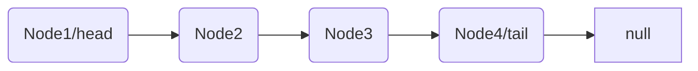

先不用管head，假如执行 `ListNode tmp = reverseList(head.next);`这么一个操作会发生什么？

+  就会发生：以 head.next 节点（即Node2节点）为头结点的链表，后面的节点的next指针都会发生反转，最终 head.next 节点变为尾节点，
+ 如下

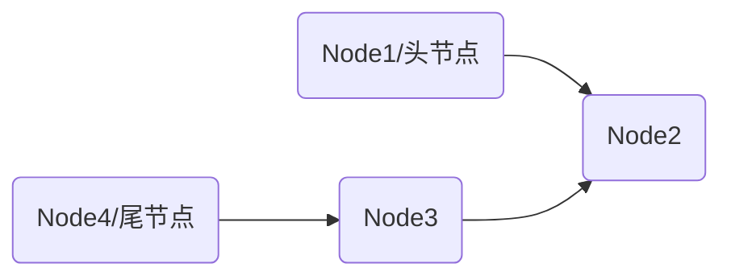

此时只需执行下面两步操作：

+ `head.next.next = head`    将Node2的next节点指向head
+ `head.next = null`    将head的的next节点指向null

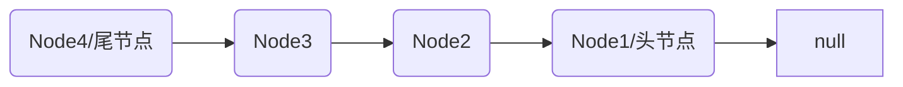


## 有序链表转换二叉搜索树**

[有序链表转换二叉搜索树](https://leetcode-cn.com/problems/convert-sorted-list-to-binary-search-tree/)

>给定一个单链表，其中的元素按升序排序，将其转换为高度平衡的二叉搜索树。
>
>本题中，一个高度平衡二叉树是指一个二叉树每个节点 的左右两个子树的高度差的绝对值不超过 1。

**示例**：

```
给定的有序链表： [-10, -3, 0, 5, 9],

一个可能的答案是：[0, -3, 9, -10, null, 5], 它可以表示下面这个高度平衡二叉搜索树：

      0
     / \
   -3   9
   /   /
 -10  5
```

**思路**：将给定的有序链表转换为二叉搜索树的第一步是确定根节点。由于我们需要构造出平衡的二叉树，因此比较直观的想法是让根节点左子树中的节点个数与右子树中的节点个数尽可能接近。这样一来，左右子树的高度也会非常接近，可以达到高度差绝对值不超过 1 的题目要求。

具体操作：

+ 快慢指针找出中间节点`mid`，将中间节点作为树的根节点。

+ 断开`mid`前后指针，至于前指针，我们要维护一个`slow`的前节点。所以还要创建一个虚节点。

+ 找出中节点`mid`后，对于左边和右边进行相同的操作。

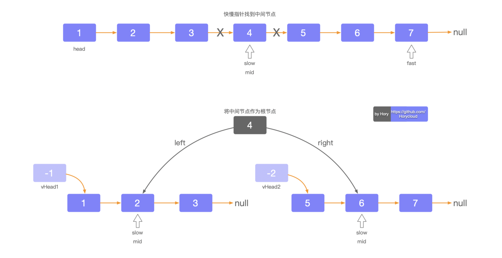

**Java实现如下**：

```java
/**
 * Definition for singly-linked list.
 * public class ListNode {
 *     int val;
 *     ListNode next;
 *     ListNode() {}
 *     ListNode(int val) { this.val = val; }
 *     ListNode(int val, ListNode next) { this.val = val; this.next = next; }
 * }
 */
/**
 * Definition for a binary tree node.
 * public class TreeNode {
 *     int val;
 *     TreeNode left;
 *     TreeNode right;
 *     TreeNode() {}
 *     TreeNode(int val) { this.val = val; }
 *     TreeNode(int val, TreeNode left, TreeNode right) {
 *         this.val = val;
 *         this.left = left;
 *         this.right = right;
 *     }
 * }
 */
class Solution {
    public TreeNode sortedListToBST(ListNode head) {
        if(head == null) return null;
        ListNode slow = head;
        ListNode fast = head;
        ListNode mid = null;
        
        ListNode head2 = null;
        ListNode vHead1 = new ListNode(-1);
        vHead1.next = head;
        ListNode vHead2 = new ListNode(-2);
        ListNode pre = vHead1;

        while(fast.next != null && fast.next.next != null){
            pre = pre.next;
            slow = slow.next;
            fast = fast.next.next;
        }
        mid = slow;
        pre.next = null;
        vHead2 = mid.next;
        mid.next = null;

        TreeNode treeHead = new TreeNode(mid.val);
        if(vHead1.next != null) treeHead.left = sortedListToBST(vHead1.next);
        if(vHead2.next != null) treeHead.right = sortedListToBST(vHead2.next);
        return treeHead;
    }
}
```


## 目标和


```java
class Solution {
  
    int res = 0;
  
    public static int findTargetSumWays(int[] nums, int S){
      	help(nums, S, 0, 0);
      	return res;
    }	

    public static void help(int[] nums, int S, int sum, int depth){
        if(depth == nums.length && sum == S){
            res++;
            return;
        }
        if(depth >= nums.length) return;
        help(nums, S, sum+nums[depth], depth+1);
        help(nums, S, sum-nums[depth], depth+1);
    }
}
```

这个结果是正确的，但是会造成超时。


## 中位数

> 给定数轴上n个点，找出一个到他们的距离之和尽量小的点

[原文](https://blog.csdn.net/fjx1173865548/article/details/44994353?utm_medium=distribute.pc_relevant.none-task-blog-BlogCommendFromMachineLearnPai2-3.channel_param&depth_1-utm_source=distribute.pc_relevant.none-task-blog-BlogCommendFromMachineLearnPai2-3.channel_param)

其实不难猜到，这个最优的解就是这些数的中位数（即排序以后位于中间的数）。

我们证明的是给定数轴上n个点，在数轴上的所有点中，中位数离所有顶点之和的距离之和最小。

想象一数轴，任意找一个点，它左边有4个点，右边有2个点，把该点往左移动一点点，不要移动太多，以免碰到其他输入点。假设移动了d单位距离，则该点到左边4个点的距离各减少d，该点都右边2个点的距离各增加d,但总的来说，距离之和减少了2d。

同理，该点的左边有2个点，右边有4个点时，类似，不过此时应该是向右移动。

换句话说，只要该点的左右两边的输入点个数不一样多，就不是最优解。那什么情况下，左右点一样多勒？如果输入点有奇数个，则最优解应该是中间那个点即中位数。如果有偶数个，则可以位于最中间两个点的任意位置（还是中位数）。

凡是可以转换为这个模型的问题都能用中位数求解。


## L146. LRU缓存机制

[146. LRU缓存机制](https://leetcode-cn.com/problems/lru-cache/)

### 造轮子

> 在解题之前我们先来试着自己造轮子，然后再用JDK自带的数据结构来实现。

[labuladong](https://labuladong.gitbook.io/algo/shu-ju-jie-gou-xi-lie/2.4-shou-ba-shou-she-ji-shu-ju-jie-gou/lru-suan-fa)

在面试中，面试官一般会期望读者能够自己实现一个简单的双向链表，而不是使用语言自带的、封装好的数据结构。所以，造轮子还是很有必要的。

LRU 缓存淘汰算法就是一种常用策略。LRU 的全称是 Least Recently Used，翻译过来就是最近最久未使用。

力扣第 146 题「LRU缓存机制」就是让我们来设计这样一个数据结构：

首先要接收一个 `capacity` 参数作为缓存的最大容量，然后实现两个 API，一个是 `put(key, val)` 方法存入键值对，另一个是 `get(key)` 方法获取 `key` 对应的 `val`，如果 `key` 不存在则返回 -1。

函数签名如下：

```java
class LRUCache {
    public LRUCache(int capacity) {}
    public int get(int key) {}
    public void put(int key, int value) {}
}
```

注意：`get` 和 `put` 方法必须都是 `O(1)` 的时间复杂度，我们先来举个具体例子看看 LRU 算法怎么工作。

```java
LRUCache cache = new LRUCache(2);  // 缓存容量为 2
// 可以把 cache 理解成一个队列
// 假设左边是队头，右边是队尾
// 那么最近使用的排在队头，最久未使用的排在队尾
// 圆括号表示键值对 (key, val)

cache.put(1, 1);  // cache = [(1, 1)]

cache.put(2, 2);  // 新来的添加到队头（左边），此时 cache = [(2, 2), (1, 1)] 

cache.get(1);     // 访问一次 key=1，返回 1。
// 因为(1,1)被访问，被提到队头，此时 cache = [(1, 1), (2, 2)] 

cache.put(3, 3);  // 新添加一个元素
// 但是此时已经满了，需要将队尾（最久未使用）元素删除，然后将新元素添加到队头
// 此时 cache = [(3, 3), (1, 1)] 

cache.get(2);     // 返回 -1 (未找到)

cache.put(1, 4);  // key=1 已存在，把value覆盖为 4，同时将(1，4)提到队头
// 此时cache = [(1, 4), (3, 3)] 
```

分析上面的操作，要让 `put` 和 `get` 方法的时间复杂度为 O(1)，我们可以总结出 `cache` 这个数据结构必要的条件：

1、显然 `cache` 中的元素必须有时序，以区分最近使用的和久未使用的数据，当容量满了之后要删除最久未使用的那个元素腾出位置。

2、我们要在 `cache` 中快速找某个 `key` 是否已存在并得到对应的 `val`；

3、每次访问 `cache` 中的某个 `key`，需要将这个元素变为最近使用的，这个操作可以分为三个步骤：①快速找到该元素（即上面的2）；② 将该元素删除；③ 将该元素重新添加到队头位置。也就是说 `cache` 要支持在任意位置快速删除和插入元素。

那么，什么数据结构同时符合上述条件呢？哈希表查找快，但是数据无固定顺序；链表有顺序之分，插入删除快，但是查找慢。所以结合一下，形成一种新的数据结构：哈希链表 `LinkedHashMap`。

LRU 缓存算法的核心数据结构就是哈希链表，双向链表和哈希表的结合体。这个数据结构长这样：

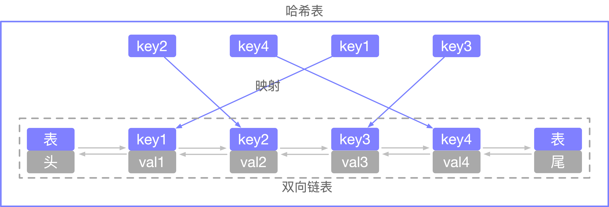

读到这里可能会产生两个问题：

1. 为什么要是双向链表，单链表行不行？
2. 哈希表中已经存了 `key`，为什么链表中还要存 **`key`** 和 **`val`** 呢？

这两个问题凭空不好解释，接着往下看，从代码中寻找答案。

**架构设计**：

我们的最终目的是想实现`LRUCache`这么一个数据结构，在此之前，我们先来画一下架构图：

需要实现三层架构：`底层、抽象层、实现层`。

我们的底层需要三个类：`Node`、`DoubleList`、`HashMap`

总体架构如下：

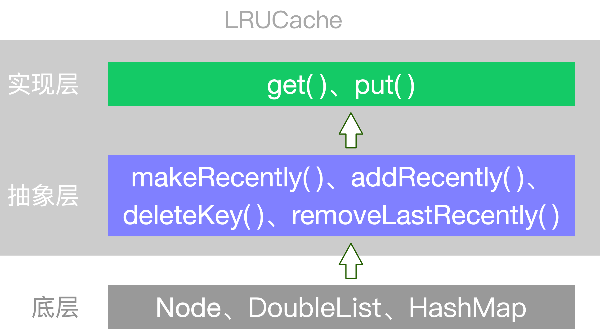

**代码实现**：

```java
class Node{
  	public int key, val;
  	public Node next, prev;
  	public Node(int k, int v){
      	this.key = k;
      	this.val = v;
    }
}
```

然后依靠我们的 `Node` 类型构建一个双链表，实现几个 LRU 算法必须的 API（无非是一些增删改的方法）：

```java
class DoubleList {  
    // 头尾虚节点
    private Node head, tail;  
    // 链表元素数
    private int size;

    public DoubleList() {
        // 初始化双向链表的数据
        head = new Node(0, 0);
        tail = new Node(0, 0);
        head.next = tail;
        tail.prev = head;
        size = 0;
    }

    // 在链表尾部添加节点 x，时间 O(1)
    public void addLast(Node x) {
        x.prev = tail.prev;
        x.next = tail;
        tail.prev.next = x;
        tail.prev = x;
        size++;
    }

    // 删除链表中的 x 节点（x 一定存在）
    // 由于是双链表且给的是目标 Node 节点，时间 O(1)
    public void remove(Node node) {
        x.prev.next = x.next;
        x.next.prev = x.prev;
        size--;
    }

    // 删除链表中第一个节点，并返回该节点，时间 O(1)
    public Node removeFirst() {
        if (head.next == tail)
            return null;
        Node first = head.next;
        remove(first);
        return first;
    }

    // 返回链表长度，时间 O(1)
    public int size() { return size; }
}
```

到这里就能回答刚才「为什么必须要用双向链表」的问题了，因为我们需要删除操作。删除一个节点不光要得到该节点本身的指针，也需要操作其前驱节点的指针，而双向链表才能支持直接查找前驱，保证操作的时间复杂度 O(1)。

其中：`addLast(Node x)、remove(Node node)、removeFirst()`三个方法的示意图如下：

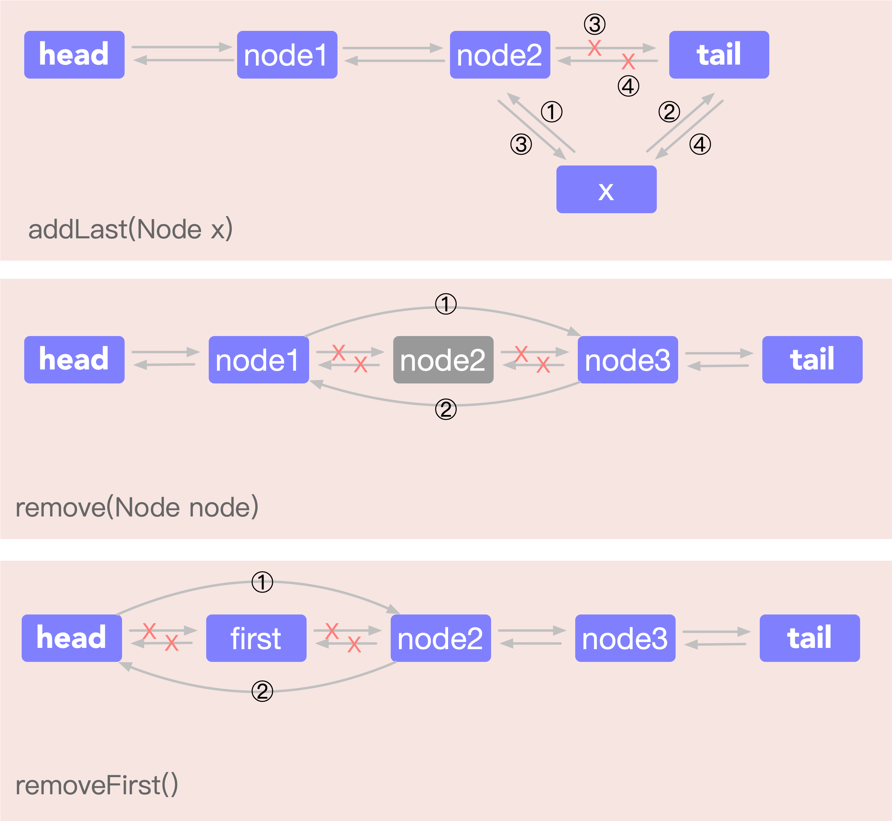

注意我们实现的双链表 API 只能从尾部插入，也就是说靠尾部的数据是最近使用的，靠头部的数据是最久为使用的。

有了双向链表的实现，我们只需要在 LRU 算法中把它和哈希表结合起来即可，先搭出代码框架：

```java
class LRUCache {
    // key -> Node(key, val)
    private HashMap<Integer, Node> map;
    // Node(k1, v1) <-> Node(k2, v2)...
    private DoubleList cache;
    // 最大容量
    private int cap;

    public LRUCache(int capacity) {
        this.cap = capacity;
        map = new HashMap<>();
        cache = new DoubleList();
    }
  	
  	/* 将某个 key 提升为最近使用的 */
    private void makeRecently(int key) {
        Node x = map.get(key);
        // 先从链表中删除这个节点
        cache.remove(x);
        // 重新插到队尾
        cache.addLast(x);
    }

    /* 添加最近使用的元素 */
    private void addRecently(int key, int val) {
        Node x = new Node(key, val);
        // 链表尾部就是最近使用的元素
        cache.addLast(x);
        // 别忘了在 map 中添加 key 的映射
        map.put(key, x);
    }

    /* 删除某一个 key */
    private void deleteKey(int key) {
        Node x = map.get(key);
        // 从链表中删除
        cache.remove(x);
        // 从 map 中删除
        map.remove(key);
    }

    /* 删除最久未使用的元素 */
    private void removeLeastRecently() {
        // 链表头部的第一个元素就是最久未使用的
        Node deletedNode = cache.removeFirst();
        // 同时别忘了从 map 中删除它的 key
        int deletedKey = deletedNode.key;
        map.remove(deletedKey);
    }
}
```

这里就能回答之前的问答题「为什么要在链表中同时存储 key 和 val，而不是只存储 val」，注意 `removeLeastRecently` 函数中，我们需要用 `deletedNode` 得到 `deletedKey`。

也就是说，当缓存容量已满，我们不仅仅要删除最后一个 `Node` 节点，还要把 `map` 中映射到该节点的 `key` 同时删除，而这个 `key` 只能由 `Node` 得到。如果 `Node` 结构中只存储 `val`，那么我们就无法得知 `key` 是什么，就无法删除 `map` 中的键，造成错误。

上述方法就是简单的操作封装，调用这些函数可以避免直接操作 `cache` 链表和 `map` 哈希表，下面我先来实现 LRU 算法的 `get` 方法：

```java
public int get(int key) {
    if (!map.containsKey(key)) {
        return -1;
    }
    // 将该数据提升为最近使用的
    makeRecently(key);
    return map.get(key).val;
}
```

`put` 方法稍微复杂一些，我们先来画个图搞清楚它的逻辑：

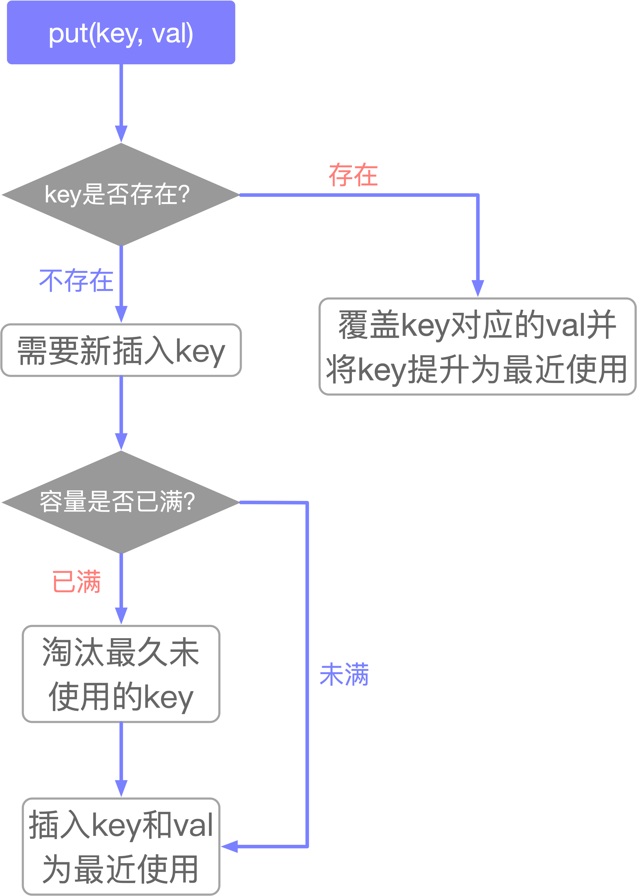

这样我们可以轻松写出 `put` 方法的代码：

```java
public void put(int key, int val) {
    if (map.containsKey(key)) {
        // 删除旧的数据
        deleteKey(key);
        // 新插入的数据为最近使用的数据
        addRecently(key, val);
        return;
    }
    if (cap == cache.size()) {
        // 删除最久未使用的元素
        removeLeastRecently();
    }
    // 添加为最近使用的元素
    addRecently(key, val);
}
```

至此，你应该已经完全掌握 LRU 算法的原理和实现了，

### 解题

我们最后用 Java 的内置类型 `LinkedHashMap` 来实现 LRU 算法，逻辑和之前完全一致：

```java
class LRUCache {

    int capacity;
    LinkedHashMap<Integer, Integer> cache = new LinkedHashMap<>();

    public LRUCache(int capacity) {
        this.capacity = capacity;
    }
    
    public int get(int key) {
        if(!cache.containsKey(key)){
            return -1;
        }
        makeRecently(key);
        return cache.get(key);
    }
    
    public void put(int key, int value) {
        if(cache.containsKey(key)){
            cache.put(key, value);  // 修改 key 的值
            makeRecently(key);
            return;
        }
        if(cache.size() >= this.capacity){
          	// 链表头部就是最久未使用的 key
            int oldestKey = cache.keySet().iterator().next();
            cache.remove(oldestKey);
        }
      	// 将新的 key 添加链表尾部
        cache.put(key, value);
    }

    private void makeRecently(int key){
        int val = cache.get(key);
      	// 删除 key，重新插入到队尾
        cache.remove(key);
        cache.put(key, val);
    }
}
```

+ 时间复杂度：对于 put 和 get 都是 `O(1)`

+ 空间复杂度：`O(capacity)`，因为哈希表和双向链表最多存储 `capacity+1` 个元素


## L232. 用栈实现队列

[232. 用栈实现队列](https://leetcode-cn.com/problems/implement-queue-using-stacks/)

> 请你仅使用两个栈实现先入先出队列。队列应当支持一般队列的支持的所有操作（`push`、`pop`、`peek`、`empty`）

+ 直接上最优解

两个栈分别充当不同的角色：

+ 一个只负责存(push)
+ 一个只负责取(pop)

假设负责存和取的栈分别为`s1`和`s2`：

+ 当存的时候只需要直接`push`到`s1`即可，不需要考虑其他的情况
+ 当取的时候，肯定直接从`s2`中取，如果`s2`不为空有则直接`s2.pop()`，如果`s2`为空呢，就只能将`s1`中的所有元素添加到`s2`中，然后再执行`s2.pop()`
+ `peek()`的实现逻辑与`pop()`相同，只是`peek()`只是拿到栈顶元素而不取出而已。

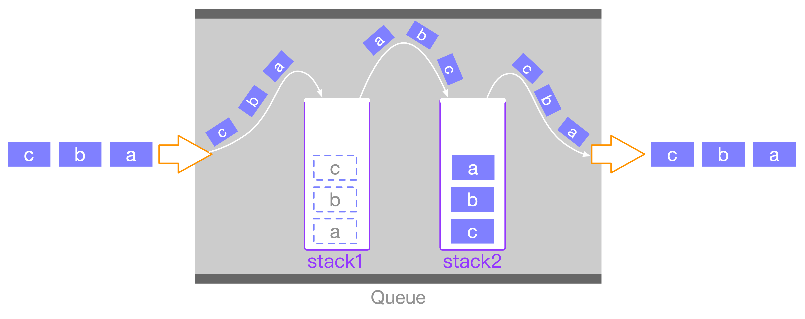

Java实现如下：

```java
class MyQueue {
  
  	private Stack<Integer> s1;
    private Stack<Integer> s2;

    /** Initialize your data structure here. */
    public MyQueue() {
        s1 = new Stack<>();
        s2 = new Stack<>();
    }
    
    /** Push element x to the back of queue. */
    public int push(int x) {
        return s1.push(x); 
    }
    
    /** Removes the element from in front of queue and returns that element. */
    public int pop() {
        if(s2.isEmpty()){
            while(!s1.isEmpty()){
                s2.push(s1.pop());
            }
        } 
        return s2.pop();
    }
    
    /** Get the front element. */
    public int peek() {
        if(s2.isEmpty()){
            while(!s1.isEmpty()){
                s2.push(s1.pop());
            }
        } 
        return s2.peek();
    }
    
    /** Returns whether the queue is empty. */
    public boolean empty() {
        return s1.isEmpty() && s2.isEmpty();
    }
}
```

> **复杂度分析**

1. **push()**

显而易见，`push`操作的时间复杂度为`O(1)`

2. **pop()**

`pop()`的时间复杂度为 `O(1)`，有人可能会问，不是最坏情况下需要考虑将`s1`中所有的元素取出然后push到`s2`中吗？下面就来分析一下，pop()的时间复杂度为什么是 `O(1)`而不是`O(n)`。

`pop()`操作的时间复杂度比较有意思，某一次`pop()`操作的时间复杂度取决于`s2`是否为空：

+ 如果`s2`为不为空，则`pop()`操作的时间复杂度为`O(1)`
+ 如果`s2`为为空，需要将`s1`中所有的元素取出然后push到`s2`中，然后再执行`s2.pop()`，则`pop()`操作的时间复杂度取决于`s1`中元素的个数。可以发现，只要执行一次「将`s1`中所有的元素取出然后push到`s2`中」的操作，那么，之后`s2.pop()`操作的时间复杂度都为`O(1)`，直到`s2`再次为空。

**摊还分析**

摊还分析给出了所有操作的平均性能。摊还分析的核心在于，最坏情况下的操作一旦发生了一次，那么在未来很长一段时间都不会再次发生，这样就会均摊每次操作的代价。

单次`s2.pop()`操作最坏情况下的时间复杂度为 O(n)。考虑到要做 n 次出队操作，如果用最坏情况下的时间复杂度来计算的话，那么所有操作的时间复杂度为 O(n^2)。然而，在一系列的操作中，最坏情况不可能每次都发生，在一系列的的`s2.pop()`操作中，某一次操作为 O(n)的时间内复杂度摊还给后续的时间复杂度为O(1)的操作。

某次的出队操作最多可以执行的次数跟它之前执行过`入队`操作的次数有关。虽然一次出队操作代价可能很大，但是每 n 次入队才能产生这么一次代价为 n 的 出队 操作。因此所有操作的总时间复杂度为：n(所有的入队操作产生） + 2 * n(第一次出队操作产生） + n - 1(剩下的出队操作产生）， 所以实际时间复杂度为 O(2*n)。于是我们可以得到每次操作的平均时间复杂度为 `O(2n/2n)=O(1)`。

3. **peek()**

同理，`peek()`的时间复杂度也为`O(1)`

4. **empty()**

`empty()`的时间复杂度为`O(1)`


## L225. 用队列实现栈

[225. 用队列实现栈](https://leetcode-cn.com/problems/implement-stack-using-queues/)

>总的来说有两种方法：
>
>+ 用`两个`队列实现
>+ 用`一个`队列实现


该方法不是最优解：

```java
class MyStack {
  
    private Queue<Integer> q1;
    private Queue<Integer> q2;

    /** Initialize your data structure here. */
    public MyStack() {
        q1 = new LinkedList<Integer>();
        q2 = new LinkedList<Integer>();
    }
    
    /** Push element x onto stack. */
    // 哪个队列不为空，就往哪个里面添加；都为空，默认添加到q1(但是题目不会出现都为空的情况)
    public void push(int x) {
        if(!q2.isEmpty()){
            q2.offer(x);
        } else {
            q1.offer(x);
        }
    }
    
    /** Removes the element on top of the stack and returns that element. */
    // 每次pop操作的时间复杂度都是O(n)，将不为空的添加到为空的，且只剩一个,题目中说不可能两个都为空，然后也不能两个都不为空
    public int pop() {
        int pop;
        if(q1.isEmpty()){
            while(q2.size() > 1){
                q1.offer(q2.poll());
            } 
            pop = q2.poll();
        } else {
            while(q1.size() > 1){
                q2.offer(q1.poll());
            }
            pop = q2.poll();
        }
        return pop;
    }
    
    /** Get the top element. */
    public int top() {
        int top;
        if(!q1.isEmpty()){
            top = q1.peek();
        } else {
            top = q2.peek();
        }
        return top;
    }
    
    /** Returns whether the stack is empty. */
    public boolean empty() {
        return q1.isEmpty() && q2.isEmpty();
    }
}

/**
 * Your MyStack object will be instantiated and called as such:
 * MyStack obj = new MyStack();
 * obj.push(x);
 * int param_2 = obj.pop();
 * int param_3 = obj.top();
 * boolean param_4 = obj.empty();
 */
```


**方法一**：用`两个`队列实现

最好的方法就是让两个队列`q1`（入栈队列）和`q2`（出栈队列）分别充当入栈和出栈的角色，即：

+ `push` 操作内部将元素添加到`q1`
+ `pop` 从`q2`中`poll`元素

`q1`和`q2`只是一个指针，在 `push` 内部利用一个临时变量来时刻交换`q1`和`q2`的指向，使得`q1`和`q2`分别指向的队列始终分别指向 `入栈队列`和 `出栈队列`。

这样做的好处是，可以简化`pop()`与`top()`的实现，因为`s2`是出栈队列，所以只需要分别执行 `q2.poll()` 和 `q2.peek()`即可。

主要是`push()`的实现比较复杂，下面来通过几张图来阐述添加元素的过程：

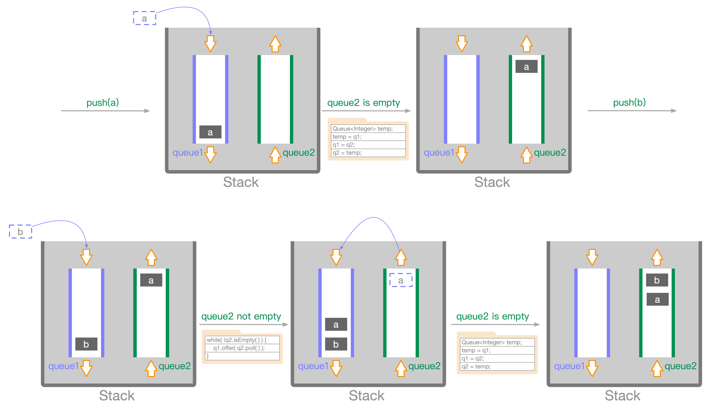

**Java实现如下**：

```java
class MyStack {
  
    private Queue<Integer> q1;
    private Queue<Integer> q2;

    public MyStack() {
        q1 = new LinkedList<Integer>();
        q2 = new LinkedList<Integer>();
    }
    
  	// 只要是进栈操作就添加到q1，只要是出栈操作就从q2中poll
    public void push(int x) {
        q1.offer(x);
        while(!q2.isEmpty()){
            q1.offer(q2.poll());
        }
      	// 通过一个临时的队列来交换q1和q2的指向
        Queue<Integer> temp;   // 这里只是声明一个变量，并没有开辟一个真正的队列空间
        temp = q1;
        q1 = q2;
        q2 = temp;
    }
    
    public int pop() {
        return q2.poll();
    }
    
    public int top() {
        return q2.peek();
    }
    
    public boolean empty() {
        return q1.isEmpty() && q2.isEmpty();
    }
}
```

> **时间复杂度分析**

1. **push()**

入栈操作需要将 `q2` 中的 `n` 个元素出队，并入队 `n+1` 个元素到 `q1`，共有 `2n+1` 次操作，每次出队和入队操作的时间复杂度都是 `O(1)`，因此入栈操作的时间复杂度是 `O(n)`。

+ 某次的push的时间复杂度取决于出栈队列是否为空，若没有pop操作（或者pop的次数远小于push），这样，几乎每次的push操作的复杂度都为O(n)，因为几乎每次q2都不为空。

2. **其余都是`O(1)`**


**方法二**：用`一个`队列实现

同样，用一个队列实现的时候，主要的实现在于`push()`操作。

具体做法如下：

+ 在每次添加一个元素之前，先将当前队列中的元素个数记下为`n`
+ 然后执行`queue.offer(x);` 将元素添加到`queue`
+ 接下来比较梦幻的一步就是，将`queue`中的前`n`个元素`poll`出依次`offer`到`queue`
+ 这样，目前处于队首的位置必定是刚刚新添加的`x`

下面来通过几张图来阐述添加元素的过程：

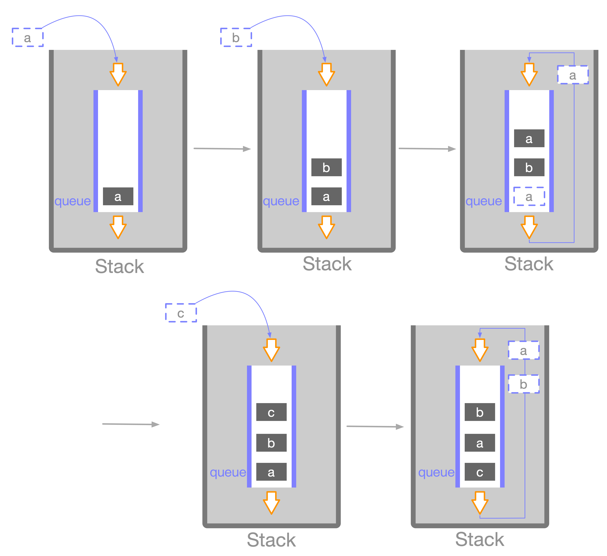

**Java 实现如下**：

```java
class MyStack {
    Queue<Integer> queue;

    public MyStack() {
        queue = new LinkedList<Integer>();
    }
    
    public void push(int x) {
        int n = queue.size();
        queue.offer(x);
        for (int i = 0; i < n; i++) {
            queue.offer(queue.poll());
        }
    }
    
    public int pop() {
        return queue.poll();
    }
    
    public int top() {
        return queue.peek();
    }
   
    public boolean empty() {
        return queue.isEmpty();
    }
}
```

> **时间复杂度分析**

1. **push()**

每一次的`push`操作都会将n个元素重新添加到`queue`中，因此`push()`的时间复杂度为`O(n)`

2. **其余都是`O(1)`**


