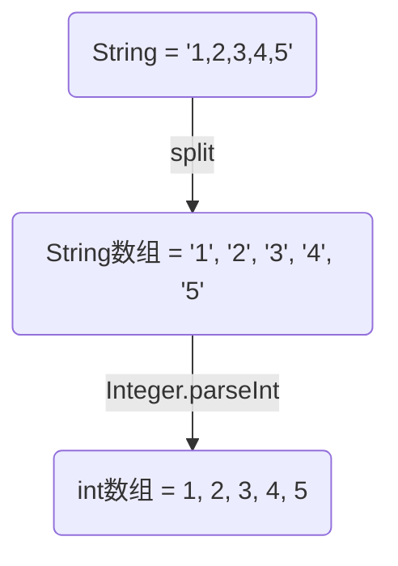

[OJ在线编程常见输入输出练习场](https://ac.nowcoder.com/acm/contest/5650?from=hr_test#question)


## 正确用法

```java
public class OJdemo {
  	public static void main(String args[]) {
      
      	// 构造Scanner类的对象scan，接收从控制台输入的信息，它只是一个扫描仪，而不是输入
      	Scanner scan = new Scanner(System.in);  
      
      	// 接收一个字符串。执行该语句之后，会要求你在控制台输入，然后你输入的内容被name接收
      	String name = scan.nextLine()
          
        // hasNextLine()方法判断当前是否有输入，当键盘有输入后执行循环
        while(scan.hasNextLine()){
          	
        }
      	
}
```


## hasNext() / Next()

```java
public final class Scanner implements Iterator<String>, Closeable {}
```

Scanner 继承了 Iterator接口，hasNext() / Next()是Iterator中的方法。

```java
public interface Iterator<E> {
    /**
     * Returns {@code true} if the iteration has more elements.
     * (In other words, returns {@code true} if {@link #next} would
     * return an element rather than throwing an exception.)
     *
     * @return {@code true} if the iteration has more elements
     */
    boolean hasNext();

    /**
     * Returns the next element in the iteration.
     *
     * @return the next element in the iteration
     * @throws NoSuchElementException if the iteration has no more elements
     */
    E next();
}
```

可见：

+ hasNext()：判断集合中元素是否遍历完毕，如果没有，就返回true
+ next()：返回当前元素， 并指向下一个元素。

`System.out.println(System.in);` 执行结果为 `java.io.BufferedInputStream@3764951d`，BufferedInputStream是缓冲输入流，继承于FilterInputStream，作用是为另一个输入流添加一些功能，本质上是通过一个内部缓冲数组实现的。例如，在新建某输入流对应的BufferedInputStream后，当通过read()读取数据时，BufferedInputStream会将输入流的数据分批的填入到缓冲区中，每当缓冲区的数据读完之后，输入流会再次填充数据缓冲区，直到读完数据。

BufferedInputStream是缓冲输入流，继承于FilterInputStream，作用是为另一个输入流添加一些功能，本质上是通过一个内部缓冲数组实现的。

>sc.hasNext() 同Next()一样，也会要求输入！

比如：

```java
Scanner sc = new Scanner(System.in);
sc.hasNext();
System.out.println("结束");
```

同样会让你输入

执行结果如下：

```java
a
结束
```

可以发现，hasNext() 返回的是boolean类型，而 next() 返回的是你输入的那个值，如下面的用法：

```java
boolean bo = sc.hasNext();
String input = sc.Next();
```

再来看这段代码：

```java
public static void main(String[] args){
    Scanner sc = new Scanner(System.in);

    boolean bo = sc.hasNext();  // ①
    System.out.println("----"); // ②
    int lines = sc.nextInt();   // ③
}
```

1. 如果只有①②，则结果为：

```java
5
----
```

2. 如果只有②③，则结果为：

```java
----
5
```

3. 如果①②③都有，则结果为：

```java
5
----
```

可见，如果不只有`sc.hasNext()`，如果后面还有个`sc.nextInt()` ，则后面的`sc.nextInt()`不会执行。但是如果①③顺序颠倒：

```java
public static void main(String[] args){
    Scanner sc = new Scanner(System.in);

    int lines = sc.nextInt();   // ③
    System.out.println("----"); // ②
  	boolean bo = sc.hasNext();  // ①
}
```

结果为：

```java
3
----
5
```


+ 在笔试中，通常只需要一轮测试即可，无需`while(sc.hasNext())`

> 无`while(sc.hasNext())`

```java
package OJ;
import java.util.Scanner;
/**
 * @Author Hory
 * @Date 2021/1/23
 */
public class OJ {
    public static void main(String[] args){

        Scanner sc = new Scanner(System.in);
      
        int lines = sc.nextInt();  // 组数
        for(int i = 0; i < lines; i++){
            int nums = sc.nextInt();   // 每组参与加法的数的个数
            int res = 0;
            for(int j = 0; j < nums; j++){
              	res += sc.nextInt();
            }
            System.out.println(res);
        }
    }
}
```

+ 无`while(sc.hasNext())`当执行完lines组之后，程序终止

执行结果：

```java
2   //组数

3   1 2 3
6

2   1 2
3
```

当测试这两组之后，程序终止。

> 有`while(sc.hasNext())`

```java
package OJ;
import java.util.Scanner;
/**
 * @Author Hory
 * @Date 2021/1/23
 */
public class OJ {
    public static void main(String[] args){

        Scanner sc = new Scanner(System.in);
      
        while(sc.hasNext()){
            int lines = sc.nextInt();  // 组数
            for(int i = 0; i < lines; i++){
                int nums = sc.nextInt();  // 每组参与加法的数的个数
                int res = 0;
                for(int j = 0; j < nums; j++){
                    res += sc.nextInt();
                }
                System.out.println(res);
            }
        }
    }
}
```

+ 无`while(sc.hasNext())`当执行完lines组之后，还可以再输入一个lines开始下轮的测试

执行结果：

```java
2   //组数

3   1 2 3
6

2   1 2
3
  
  
// 当测试这两组之后，程序不会终止，还可以进行下一轮测试。接下来开始第二轮测试：
  
3   //组数
  
2   1 2
3
  
2   5 6
11
  
1   5
5
// 第二轮结束，还可以无限继续...
```


## next() / nextLine()

>**input.`next()`** 

`next()`方法在读取内容时，会过滤掉有效字符前面的无效字符，对输入有效字符之前遇到的`空格键`、`Tab键`或`Enter键`等结束符，next() 方法会自动将其过滤掉；只有在读取到有效字符之后，next() 方法才将其后的空格键、Tab键或Enter键等视为结束符，所以 next() 方法不能得到带空格的字符串。

所以，如果使用`next()`输入时，先按空格键、Tab键或Enter键等结束符，再输入一个字母，则不会直接返回，因为在遇到有效字符前，空格键、Tab键或Enter键等结束符是被忽略的，只有在遇到有效字符后，再按这些键，它才会视为结束符。

>**input.`nextLine()`**

`nextLine()`方法字面上有扫描一整行的意思，它的结束符`只能是Enter键`，即`nextLine()`方法返回的是Enter键之前没有被读取的所有字符，它是可以得到带空格的字符串的。

> **补充**

若在`input.nextInt()`或`input.nextDouble()`之后使用`input.nextLine()`，是有可能出问题的，会出现`nextLine()`识别上一个输入的回车，因而输出空格。

所以若在`input.nextInt()`或`input.nextDouble()`后使用`input.nextLine()`，要先加一个`input.nextLine()`进行换行。

**示例**：

```java
import java.util.Scanner;

/**
 * @Author Hory
 * @Date 2020/10/17
 */
public class test{

    public static void main(String[] args) {

        Scanner input = new Scanner(System.in);
        String out = input.next(); // ①
      	// String out = input.nextLine(); // ②
        System.out.println(out);
    }
}
```

输入：`bytedance ali tecent`

执行 ① 输出：`bytedance`

执行 ② 输出：`bytedance ali tecent`


## 输入输出

```java
import java.util.Scanner;

/**
 * @Author Hory
 * @Date 2020/10/19
 */
public class Main {
    public static void main(String[] args) {
        Scanner input = new Scanner(System.in);

        System.out.println("input name：");
        String userName = input.next();

        System.out.println("input age：");
        int userAge = input.nextInt();

        System.out.println("name is " + userName);
        System.out.println("age is " + userAge);
    }
}

```

`System.in`是一个 InputStream 类型

```java
public final class System {
		...
    public final static InputStream in = null;
  	...
}
    
```

Scanner

```java
public final class Scanner implements Iterator<String>, Closeable {
  	...
    public Scanner(InputStream source) {
        this(new InputStreamReader(source), WHITESPACE_PATTERN);
    }
    ...
}
```


## A+B

> **每次只输入一次`a、b`时**

示例：

```
5 6
11
```

代码如下：

```java
import java.util.Scanner;

public class Main {
    public static void main(String[] args){
        Scanner input = new Scanner(System.in);
      
        Integer a = input.nextInt();
        Integer b = input.nextInt();
        System.out.println(a+b);
    }
}
```


## A+B(1)

> **输入包括两个正整数`a,b(1 <= a, b <= 10^9)`，输入数据包括多组。**

示例：

```
1 5
6

10 20
30

2 3
5
```

代码如下：

```java
import java.util.Scanner;

public class Main {
    public static void main(String[] args){
        Scanner input = new Scanner(System.in);
        
        // 使用while循环判断是否有下一个输入
        while(input.hasNext()){
            Integer a = input.nextInt();
            Integer b = input.nextInt();
            System.out.println(a+b);
        }
    }
}
```


## A+B(2)

> **输入第一行包括一个数据组数t(1 <= t <= 100)**
>
> **接下来每行包括两个正整数a,b(1 <= a, b <= 10^9)**

示例：

```
99

1 5
6

9 8
17

6 3
9
```

代码如下：

```java
import java.util.Scanner;

public class Main {
    public static void main(String[] args){
        Scanner input = new Scanner(System.in);
        
        Integer first = input.nextInt();
        
        while(input.hasNext()){
            Integer a = input.nextInt();
            Integer b = input.nextInt();
            System.out.println(a+b);
        }
    }
}
```


## A+B(3)

>**输入包括两个正整数`a,b(1 <= a, b <= 10^9)`，输入数据有多组，如果输入为`0 0`则结束输入**

示例：

```
1 5
6

10 20
30

0 0
```

代码如下：

```java
import java.util.Scanner;

public class Main {
    public static void main(String[] args){
        Scanner input = new Scanner(System.in);
        
        while(input.hasNext()){
            Integer a = input.nextInt();
            Integer b = input.nextInt();
            if(a == 0 && b == 0){
                return;
            }
            System.out.println(a+b);
        }
    }
}
```


## A+B(4)

>**输入数据包括多组。**
>
>**每组数据一行，每行的第一个整数为整数的个数`n(1 <= n <= 100)`，`n`为`0`的时候结束输入。**
>
>**接下来`n`个正整数，即需要求和的每个正整数。**

示例：

```
4 1 2 3 4
10

5 1 2 3 4 5
15

0
```

代码如下：

```java
import java.util.Scanner;

public class Main {
    public static void main(String[] args){
        Scanner input = new Scanner(System.in);
        
        while(input.hasNext()){
            Integer num = input.nextInt();
            if(num <= 0) return;
            Integer sum = 0; // 总和
            int i = 0; // 记录输入的个数
            while(input.hasNext() && i < num){
                Integer newInput = input.nextInt();
                i++;
                sum += newInput;
            }
            
            System.out.println(sum);
        }
    }
}
```


## A+B(5)

>**输入的第一行包括一个正整数`t(1 <= t <= 100)`，表示数据组数。**
>
>**接下来`t`行，每行一组数据。**
>
>**每行的第一个整数为整数的个数`n(1 <= n <= 100)`。**
>
>**接下来`n`个正整数，即需要求和的每个正整数。**

示例：

```
2

4 1 2 3 4
10

5 1 2 3 4 5
15
```

代码如下：

```java
import java.util.Scanner;

public class Main {
    public static void main(String[] args){
        Scanner input = new Scanner(System.in);
        
        Integer arrNum = input.nextInt(); // 组数
        if(arrNum <= 0) return;
        
        while(input.hasNext()){
            Integer num = input.nextInt();
            if(num <= 0) return;
            Integer sum = 0; // 总和
            int i = 0; // 记录输入的个数
            while(input.hasNext() && i < num){
                Integer newInput = input.nextInt();
                i++;
                sum += newInput;
            }
            System.out.println(sum);
        }
    }
}
```


## A+B(6)

>**输入数据有多组, 每行表示一组输入数据。
>每行的第一个整数为整数的个数`n(1 <= n <= 100)`。
>接下来`n`个正整数, 即需要求和的每个正整数。**

示例：

```
4 1 2 3 4
10

5 1 2 3 4 5
15
```

代码如下：

```java
import java.util.Scanner;

public class Main {
    public static void main(String[] args){
        Scanner input = new Scanner(System.in);
        
        while(input.hasNext()){
            Integer num = input.nextInt();
            if(num <= 0) return;
            Integer sum = 0; // 总和
            int i = 0; // 记录输入的个数
            while(input.hasNext() && i < num){
                Integer newInput = input.nextInt();
                i++;
                sum += newInput;
            }
            
            System.out.println(sum);
        }
    }
}
```


## 输入一串以逗号隔开数字然后存入数组中并输出

代码：

```java
public class OJ {
    public static void main(String[] args){

        Scanner sc = new Scanner(System.in);
        System.out.println("请输入一串用英文逗号隔开的整数：");

        String input = sc.next();
        String[] strArr = input.split(",");

        int[] nums = new int[strArr.length];
        for(int i = 0; i < strArr.length; i++){
            nums[i] = Integer.parseInt(strArr[i]);
            System.out.println(nums[i] + " ");
        }
    }
}
```

运行结果：

```java
请输入一串用英文逗号隔开的整数：
1,2,3,4,5
输出：
1 
2 
3 
4 
5 
```

示意图：




