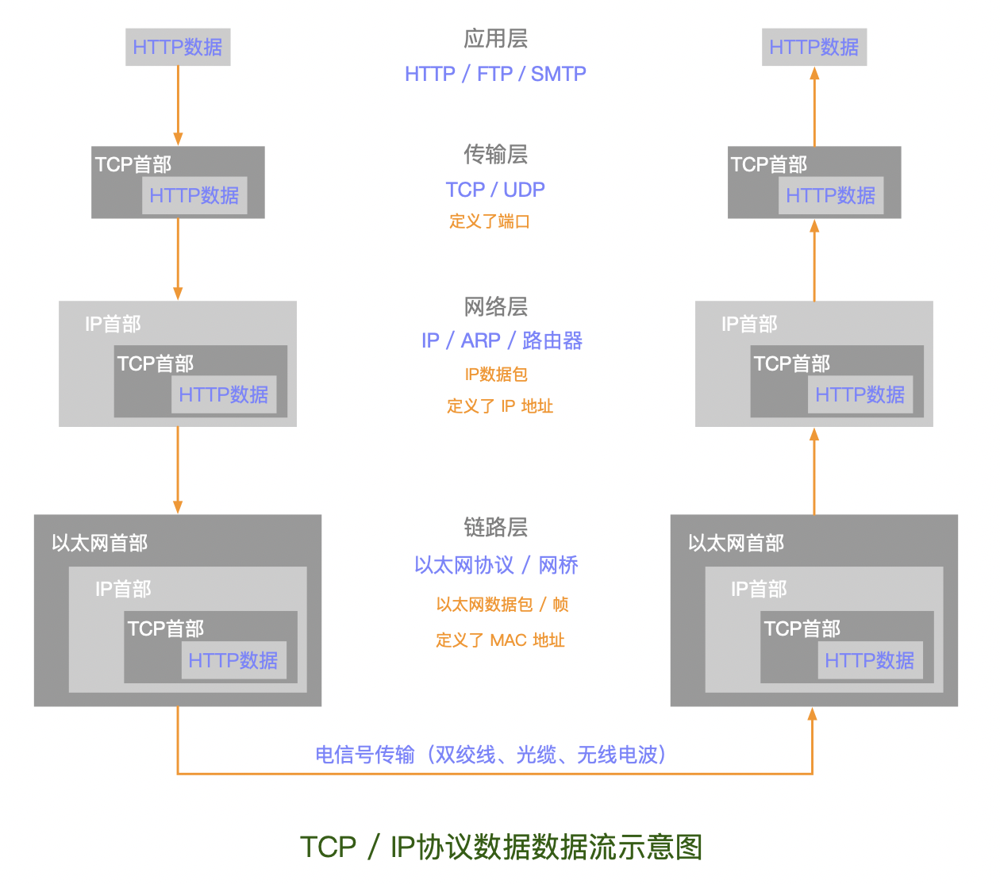
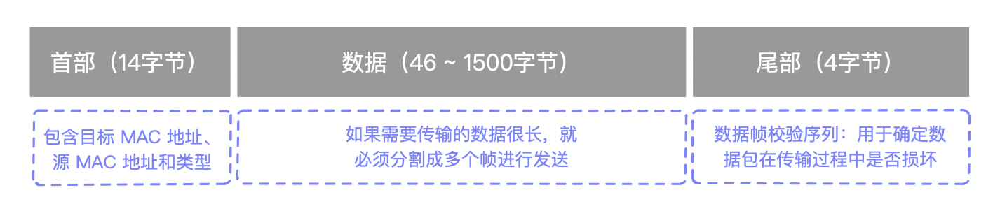
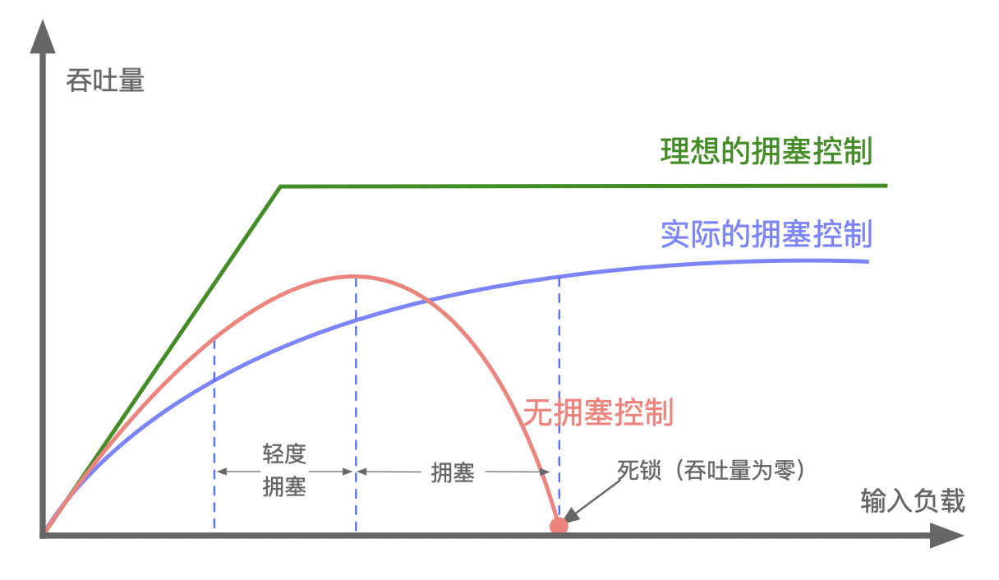
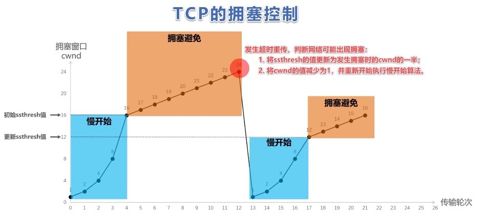
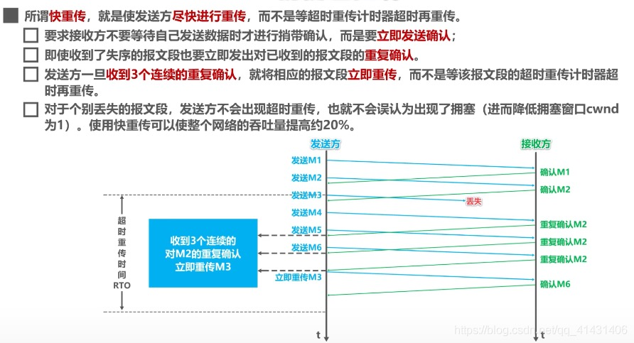
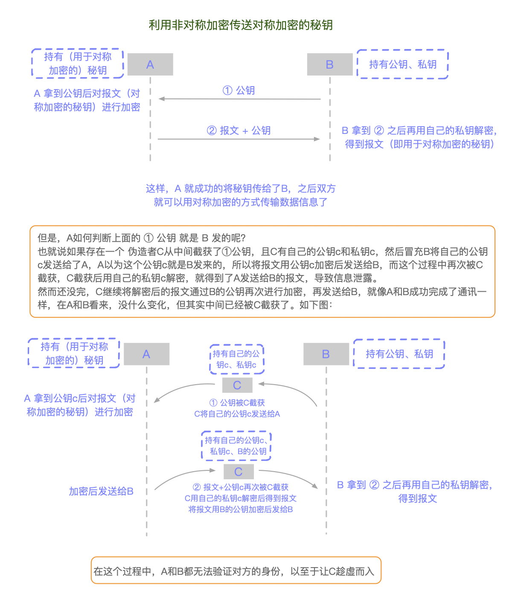
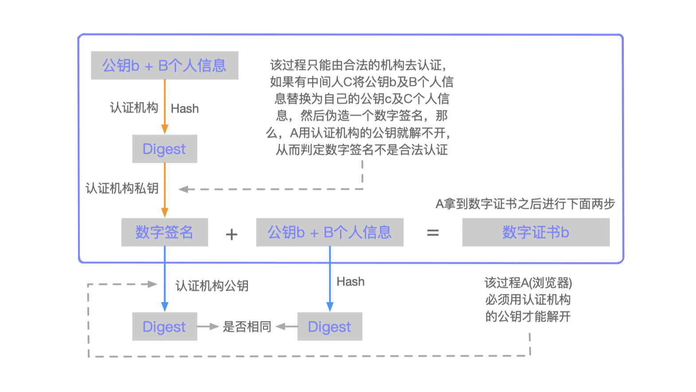

#  TCP/IP 协议栈

[炸裂！万字长文拿下HTTP 我在字节跳动等你！](https://blog.csdn.net/L15519543837/article/details/106310070?utm_source=app)

[深入浅出 TCP/IP 协议栈](https://www.cnblogs.com/onepixel/p/7092302.html)       

[IP 基础知识“全家桶”，45 张图一套带走——JavaGuide](https://mp.weixin.qq.com/s/4YozGKXO7wZ9V4bBzjWuTQ)

> OSI七层模型

OSI七层模型只是参考参考模型，并没有被物理 实现出来


> 见《图解HTTP》1.4.2 确保可靠性的TCP协议

TCP/IP 协议栈是一系列网络协议的总和，是构成网络通信的核心骨架，它定义了电子设备如何连入因特网，以及数据如何在它们之间进行传输。TCP/IP 协议采用4层结构，分别是`应用层、传输层、网络层和链路层`，每一层都呼叫它的下一层所提供的协议来完成自己的需求。由于我们大部分时间都工作在应用层，下层的事情不用我们操心；其次网络协议体系本身就很复杂庞大，入门门槛高，因此很难搞清楚TCP/IP的工作原理，通俗一点讲就是，一个主机的数据要经过哪些过程才能发送到对方的主机上。 接下来，我们就来探索一下这个过程。

## 物理层

物理介质就是把电脑连接起来的物理手段，常见的有光纤、双绞线，以及无线电波，它决定了电信号(0和1)的传输方式，物理介质的不同决定了电信号的传输带宽、速率、传输距离以及抗干扰性等等。

TCP/IP协议栈分为四层，每一层都由特定的协议与对方进行通信，而协议之间的通信最终都要转化为 0 和 1 的电信号，通过物理介质进行传输才能到达对方的电脑，因此物理介质是网络通信的基石。

下面我们通过一张图先来大概了解一下TCP/IP协议的基本框架：



当通过 Http 发起一个请求时，应用层、传输层、网络层和链路层的相关协议依次对该请求进行包装并携带对应的`首部`，最终在链路层生成`以太网数据包`，以太网数据包通过物理介质传输给对方主机，对方接收到数据包以后，然后再一层一层采用对应的协议进行拆包，最后把应用层数据交给应用程序处理。

+ 网络通信就好比送快递，商品外面的一层层包裹就是各种协议，协议包含了商品信息、收货地址、收件人、联系方式等，然后还需要配送车、配送站、快递员，商品才能最终到达用户手中。一般情况下，快递是不能直达的，需要先转发到对应的配送站，然后由配送站再进行派件。配送车就是物理介质，配送站就是网关， 快递员就是路由器，收货地址就是IP地址，联系方式就是MAC地址。 快递员负责把包裹转发到各个配送站，配送站根据收获地址里的省市区，确认是否需要继续转发到其他配送站，当包裹到达了目标配送站以后，配送站再根据联系方式找到收件人进行派件。 

有了整体概念以后，下面我们详细了解一下各层的分工。

## 链路层

网络通信就是把有特定意义的数据通过物理介质传送给对方，单纯的发送 0 和 1 是没有意义的，要传输有意义的数据，就需要以`字节为单位`对 0 和 1 进行分组，并且要标识好每一组电信号的信息特征，然后按照分组的顺序依次发送。

`以太网`规定一组电信号就是一个`数据包`，一个数据包被称为`一帧`， 制定这个规则的协议就是`以太网协议`。一个完整的以太网数据包如下图所示：



整个数据帧由`首部`、`数据`和`尾部`三部分组成。以太网协议通过对电信号进行分组并形成数据帧，然后通过物理介质把数据帧发送给接收方。

那么以太网如何来识别接收方的身份呢？

以太网协议规定，接入网络的设备都必须安装网络适配器，即`网卡`， 数据包必须是从一块网卡传送到另一块网卡。而`网卡地址`就是数据包的发送地址和接收地址，也就是帧首部所包含的`MAC地址`。

+ MAC地址（Media Access Control Address）直译为`媒体存取控制位址`，也称为局域网地址（LAN Address）、以太网地址（Ethernet Address）或物理地址（Physical Address），由网络设备制造商生产时写在硬件内部，是每块`网卡`的身份标识，就如同我们身份证上的身份证号码，具有全球唯一性。一台设备若有一个或多个网卡，则每个网卡都会有一个唯一的MAC地址 。MAC地址采用十六进制标识，共6个字节， 前三个字节是厂商编号，后三个字节是网卡流水号，例如 4C-0F-6E-12-D2-19

有了 MAC 地址以后，以太网采用`广播`形式，把数据包发给该`子网内`所有主机，子网内每台主机在接收到这个包以后，都会读取首部里的`目标 MAC 地址`，然后和自己的 MAC 地址进行对比，如果相同就做下一步处理，如果不同，就丢弃这个包。

`链路层的主要工作就是对电信号进行分组并形成具有特定意义的数据帧，然后以广播的形式通过物理介质发送给接收方`。


注意跟[ARQ—超时重传请求](https://baike.baidu.com/item/ARQ/7402812)区分


## 网络层

对于上面的过程，有几个细节问题值得我们思考：

+ 发送者如何知道接收者的 MAC地址？

+ 发送者如何知道接收者和自己同属一个子网？

+ 如果接收者和自己不在同一个子网，数据包如何发给对方？

为了解决这些问题，网络层引入了三个协议，分别是`ARP协议`、`IP协议`、`路由协议`。

> **ARP协议**

`Address Resolution Protocol` 地址解析协议，是根据`IP地址`获取`MAC地址`的一个网络层协议。

IP地址，一般家庭用户的，都是活动的，每次上线时，由服务商临时分配。所以每次上网，IP都不一样，一个IP，会在不同的时间里，被很多用户用到。但在同一时间里，网上的IP都是唯一的，每个都不一样。

其工作原理如下：

ARP首先会发起一个请求数据包，数据包的首部包含了目标主机的 IP地址，然后这个数据包会在链路层进行再次包装，生成以太网数据包，最终由以太网广播给子网内的`所有主机`，每一台主机都会接收到这个数据包，并取出标头里的IP地址，然后和自己的IP地址进行比较，如果相同就返回自己的 MAC地址，如果不同就丢弃该数据包。

ARP接收返回消息，以此确定目标机的MAC地址。与此同时，ARP还会将返回的MAC地址与对应的IP地址存入本机ARP缓存中并保留一定时间，下次请求时直接查询ARP缓存以节约资源。`cmd`输入 `arp -a` 就可以查询本机缓存的ARP数据。

> **IP协议**

通过前面的介绍我们知道，MAC地址只与厂商有关，与所处的网络无关，所以无法通过MAC地址来判断两台主机是否属于同一个子网。

因此，网络层引入了IP协议，制定了一套新地址，使得我们能够区分两台主机是否同属一个网络，这套地址就是网络地址，也就是所谓的 IP地址。

IP地址目前有两个版本，分别是`IPv4`和`IPv6`，IPv4是一个32位的地址，常采用4个十进制数字表示。IP协议将这个32位的地址分为两部分，前面部分代表`网络地址`，后面部分表示该主机在`局域网中的地址`。

由于各类地址的分法不尽相同，以C类地址`192.168.24.1`为例**，**其中前24位就是网络地址，后 8 位就是主机地址。因此， `如果两个IP地址在同一个子网内，则网络地址一定相同`。

为了判断IP地址中的网络地址，IP协议还引入了`子网掩码`，IP地址和子网掩码通过按与(&)运算后就可以得到网络地址。通过与IP地址进行与操作之后，可以将IP地址中后面部分的局域网地址掩盖（都变为了0），所以叫子网掩码。如果没有子网掩码，前面就需要只比较IP的网络地址部分，比较麻烦，有了子网掩码，通过不同的IP地址与子网掩码进行与操作之后，可对它们直接进行比较，如果相等，则代表 网络地址相同，即同在一个局域网内。

由于发送者和接收者的 IP 地址是已知的(应用层的协议会传入)， 因此我们只要通过子网掩码对两个 IP 地址进行AND运算后就能够判断双方是否在同一个子网了。

> **路由协议**

通过ARP协议的工作原理可以发现，ARP的 MAC寻址还是局限在同一个子网中，因此网络层引入了路由协议。

首先通过 IP协议来判断两台主机是否在同一个子网中，如果在同一个子网，就通过ARP协议查询对应的MAC地址，然后以广播的形式向该子网内的主机发送数据包；`如果不在同一个子网，以太网会将该数据包转发给本子网的网关进行路由`。网关是互联网上子网与子网之间的桥梁，所以网关会进行`多次转发`，最终将该数据包转发到目标 IP所在的子网中，然后再通过ARP获取目标机MAC，最终也是通过广播形式将数据包发送给接收方。

而完成这个路由协议的物理设备就是`路由器`，在错综复杂的网络世界里，路由器扮演`交通枢纽`的角色，它会根据信道情况，选择并设定路由，以最佳路径来转发数据包。

> **IP数据包**

IP数据包由首部和数据两部分组成，首部长度为20个字节，主要包含了目标IP地址和源IP地址，目标IP地址是网关路由的线索和依据；数据部分的最大长度为65515字节，理论上一个IP数据包的总长度可以达到65535个字节，而以太网数据包的最大长度是1500个字符，如果超过这个大小，就需要对IP数据包进行分割，分成多帧发送。

`网络层的主要工作是定义网络地址，区分网段，子网内 MAC寻址，对于不同子网的数据包进行路由。`


## 传输层

链路层定义了主机的身份，即 MAC 地址， 而网络层定义了IP地址，明确了主机所在的网段，有了这两个地址，数据包就从可以从一个主机发送到另一台主机。但实际上数据包是从一个主机的某个应用程序发出，然后由对方主机的应用程序接收。而每台电脑都有可能同时运行着很多个应用程序，所以当数据包被发送到主机上以后，是无法确定哪个应用程序要接收这个包。

因此传输层引入了UDP协议（User Datagram Protocol）用户数据报协议来解决这个问题，为了给每个应用程序标识身份，UDP协议定义了`端口`，同一个主机上的每个应用程序都需要指定唯一的端口号，并且规定网络中传输的数据包必须加上端口信息。 这样，当数据包到达主机以后，就可以根据端口号找到对应的应用程序了。UDP 定义的数据包就叫做UDP数据包。

UDP数据包由`首部`和`数据`两部分组成：

+ 首部长度为8个字节，主要包括源端口和目标端口
+ 数据最大为65527个字节，整个数据包的长度最大可达到65535个字节

UDP 协议比较简单，实现容易，但它没有确认机制， 数据包一旦发出，无法知道对方是否收到，因此可靠性较差。

为了解决这个问题，提高网络可靠性，`TCP协议`就诞生了。

`TCP（Transmission Control Protocol）传输控制协议`，是一种`面向连接的`、`可靠的`、基于`字节流`的通信协议。简单来说`TCP就是有确认机制的UDP协议`，每发出一个数据包都要求确认，如果有一个数据包丢失，就收不到确认，发送方就必须重发这个数据包。

为了保证传输的可靠性，TCP 协议在 UDP 基础之上建立了`三次对话（三次握手）`的确认机制，也就是说，在正式收发数据前，必须和对方建立可靠的连接。

经过三次对话之后，主机 A 才会向主机 B 发送正式数据，而 UDP 是面向非连接的协议，它不与对方建立连接，而是直接就把数据包发过去了。所以 TCP 能够保证数据包在传输过程中不被丢失，但相比 UDP，TCP 实现过程复杂，消耗连接资源多，传输速度慢。

TCP 数据包和 UDP 一样，都是由首部和数据两部分组成，`唯一不同的是，TCP 数据包没有长度限制`，理论上可以无限长，但是为了保证网络的效率，通常 TCP 数据包的长度不会超过 IP 数据包的长度，以确保单个 TCP 数据包不必再分割。

`传输层的主要工作是定义端口，标识应用程序身份，实现端口到端口的通信，TCP协议可以保证数据传输的可靠性。`


## 应用层

理论上讲，有了以上三层协议的支持，数据已经可以从一个主机上的应用程序传输到另一台主机的应用程序了，但此时传过来的数据是`字节流`，不能很好的被程序识别，操作性差。因此，应用层定义了各种各样的协议来规范数据格式，常见的有 `HTTP（Hyper Text Transfer Protocol）`、`FTP（File Transfer Protocol）`、`SMTP（Simple Mail Transfer Protocol）`等，HTTP 是一种比较常用的应用层协议，主要用于 `B/S 架构`之间的数据通信。

在 `Resquest Headers` 中

+ ContentType 则表示客户端发送的数据格式

+ Accept 表示客户端期望接收的数据格式

在 `Response Headers` 中

+ ContentType 表示服务端响应的数据格式，这里定义的格式，一般是和 Resquest Headers 中 Accept 定义的格式是一致的。

有了这个规范以后，服务端收到请求以后，就能正确的解析客户端发来的数据，当请求处理完以后，再按照客户端要求的格式返回，客户端收到结果后，按照服务端返回的格式进行解析。

`所以应用层的主要工作就是定义数据格式并按照对应的格式解读数据。`

 

# URI & URL

> URI和URL的区别是什么?

`URI(Uniform Resource Identifier)` 是统一资源标志符，可以唯一标识一个资源。

`URL(Uniform Resource Location) `是统一资源定位符，可以提供该资源的路径。它是一种具体的 URI，即 URL 不仅可以用来唯一标识一个资源，还指明了如何 locate 这个资源。

URI 的作用像身份证号一样，URL 的作用更像家庭住址一样。


# Put a URL 

> 当你在浏览器输入一个 URL 时，发生了什么？

当你输入一个网址并按下回车键的时候

首先，**应用层**协议（Http）对该请求包做了`格式定义`；

紧接着**传输层**协议（TCP/UDP）加上了双方的`端口号`，确认了双方通信的应用程序；

然后**网络协议**加上了双方的`IP地址`，确认了双方的网络位置，并通过`ARP`协议找到对方的MAC地址；

最后**链路层协议**加上了`双方的MAC地址`，确认了双方的物理位置，同时将数据进行分组，形成数据帧，采用广播方式，通过传输介质发送给对方主机。

而对于不同网段，该数据包首先会转发给网关路由器，经过多次转发后，最终被发送到目标主机。目标机接收到数据包后，采用对应的协议，对帧数据进行组装，然后再通过一层一层的协议进行解析，最终被应用层的协议解析并交给服务器处理。


# TCP

> 简单介绍一下TCP

首先，TCP面向连接的；其次，TCP是可靠的传输协议。


# TCP VS UDP

|      | 是否面向连接 | 传输可靠性 | 传输形式     | 传输效率 | 所需资源 | 应用场景                                                     | 首部字节                 |
| :--: | ------------ | ---------- | ------------ | -------- | -------- | ------------------------------------------------------------ | ------------------------ |
| TCP  | √            | √          | `字节流`     | 慢       | 多       | 要求通信数据可靠（`如文件传输`、`邮件传输`、`远程登录`等）   | 20-60                    |
| UDP  | X            | X          | `数据报文段` | 快       | 少       | 要求通信速度高（如`域名转换`、`QQ 语音`、 `QQ 视频` 、`直播`等） | 8个字节（由4个字段组成） |

**UDP** 在传送数据之前不需要事先建立连接，远地主机在收到 UDP 报文后，不需要给出任何确认。虽然 UDP 不提供可靠交付，但在某些情况下 UDP 确是一种最有效的工作方式（一般用于`即时通信`），比如： `QQ 语音`、 `QQ 视频` 、`直播`等场景。

**TCP** 提供面向连接的服务。在传送数据之前必须先建立连接，数据传送结束后要释放连接。 TCP 不提供`广播或多播`服务。由于 TCP 要提供可靠的、面向连接的传输服务（TCP 的可靠体现在 ① TCP 在传递数据之前，会有三次握手来建立连接；② 在数据传递时，有确认、窗口、重传、拥塞控制机制；③在数据传完后，还会断开连接以节约系统资源），这难以避免增加了许多开销，如`确认`、`流量控制`、`计时器`以及`连接管理`等。这不仅使协议数据单元的首部增大很多，还要占用许多处理机资源。TCP 一般用于`文件传输`、发送和接收`邮件`、`远程登录`等场景。


# TCP 协议可靠传输

> TCP 协议如何保证可靠传输 ？

1. **连接管理**：连接管理就是三次握手与四次挥手的过程。
2. **分割成数据块**：应用数据被分割成 TCP 认为最适合发送的数据块。
3. **序列号**：TCP 给发送的每一个包进行编号，就是`序列号`。接收方对数据包进行排序，把有序数据传送给应用层。
4. **检验和：** TCP 将保持它`首部`和`数据`的检验和。这是一个端到端的检验和，目的是为了发现TCP`首部`和`数据`在发送端到接收端之间发生的任何改动，如果接收端检测到检验和有差错，则 TCP 段会被直接丢弃。
5. **ARQ 协议**：Automatic Repeat-reQuest 自动重传请求，也是为了实现可靠传输，TCP传输的过程中，接收方每次收到数据后，都会对发送方进行确认应答。也就是发送 ACK 报文。这个ACK报文当中带有对应的确认序列号，告诉发送方，接收到了哪些数据，下一次的数据从哪里发。
6. **超时重传：** 当 TCP 发出一个报文段后，会启动一个`计时器`，等待接收端确认收到这个报文段。如果不能及时收到一个确认，将重发这个报文段。
7. **流量控制：** TCP 连接的每一方都有固定大小的缓冲空间，TCP 的接收端只允许发送端发送接收端缓冲区能接纳的数据。当接收方来不及处理发送方的数据，则提示发送方降低发送的速率，防止包丢失。TCP 使用的流量控制协议是可变大小的`滑动窗口协议`。 （TCP 利用滑动窗口实现流量控制，就是如果接收端和发送端对数据包的处理速度不同，如何让双方达成一致。）
8. **拥塞控制：** 当网络拥塞时，减少数据的发送。

## ARQ 协议

`自动重传请求（Automatic Repeat-reQuest，ARQ`是OSI模型中数据链路层和传输层的错误纠正协议之一。它通过使用确认和超时这两个机制，在不可靠服务的基础上实现可靠的信息传输。如果发送方在发送后一段时间之内没有收到确认帧，它通常会重新发送。ARQ包括停止等待ARQ协议和连续ARQ协议。

> 停止等待 ARQ 协议

- 停止等待协议是为了实现可靠传输的，它的基本原理就是每发完一个分组就停止发送，等待对方确认（回复ACK）。如果过了一段时间（超时时间后），还是没有收到 ACK 确认，说明没有发送成功，需要重新发送，直到收到确认后再发下一个分组；
- 在停止等待协议中，若接收方收到重复分组，就丢弃该分组，但同时还要发送确认；

**优点：** 简单

**缺点：** 信道利用率低，等待时间长

**1) 无差错情况:**

发送方发送分组,接收方在规定时间内收到,并且回复确认.发送方再次发送。

**2) 出现差错情况（超时重传）:**

停止等待协议中超时重传是指只要超过一段时间仍然没有收到确认，就重传前面发送过的分组（认为刚才发送过的分组丢失了）。因此每发送完一个分组需要设置一个超时计时器，其重传时间应比数据在分组传输的平均往返时间更长一些。这种自动重传方式常称为 **自动重传请求 ARQ** 。另外在停止等待协议中若收到重复分组，就丢弃该分组，但同时还要发送确认。**连续 ARQ 协议** 可提高信道利用率。发送维持一个发送窗口，凡位于发送窗口内的分组可连续发送出去，而不需要等待对方确认。接收方一般采用累积确认，对按序到达的最后一个分组发送确认，表明到这个分组位置的所有分组都已经正确收到了。

**3) 确认丢失和确认迟到**

- **确认丢失** ：确认消息在传输过程丢失。当A发送M1消息，B收到后，B向A发送了一个M1确认消息，但却在传输过程中丢失。而A并不知道，在超时计时过后，A重传M1消息，B再次收到该消息后采取以下两点措施：1. 丢弃这个重复的M1消息，不向上层交付。 2. 向A发送确认消息。（不会认为已经发送过了，就不再发送。A能重传，就证明B的确认消息丢失）。
- **确认迟到** ：确认消息在传输过程中迟到。A发送M1消息，B收到并发送确认。在超时时间内没有收到确认消息，A重传M1消息，B仍然收到并继续发送确认消息（B收到了2份M1）。此时A收到了B第二次发送的确认消息。接着发送其他数据。过了一会，A收到了B第一次发送的对M1的确认消息（A也收到了2份确认消息）。处理如下：1. A收到重复的确认后，直接丢弃。2. B收到重复的M1后，也直接丢弃重复的M1。

> 连续ARQ协议

连续 ARQ 协议可提高信道利用率。发送方维持一个发送窗口，凡位于发送窗口内的分组可以连续发送出去，而不需要等待对方确认。接收方一般采用累计确认，对按序到达的最后一个分组发送确认，表明到这个分组为止的所有分组都已经正确收到了。

**优点：** 信道利用率高，容易实现，即使确认丢失，也不必重传。

**缺点：** 不能向发送方反映出接收方已经正确收到的所有分组的信息。 比如：发送方发送了 5条 消息，中间第三条丢失（3号），这时接收方只能对前两个发送确认。发送方无法知道后三个分组的下落，而只好把后三个全部重传一次。这也叫 Go-Back-N（回退 N），表示需要退回来重传已经发送过的 N 个消息。

## 滑动窗口和流量控制

TCP 利用滑动窗口实现流量控制。

流量控制是为了控制发送方发送速率，保证接收方来得及接收。接收方发送的确认报文中的窗口字段可以用来控制发送方窗口大小，从而影响发送方的发送速率。将窗口字段设置为 0，则发送方不能发送数据。

## 拥塞控制

[原文](https://blog.csdn.net/qq_41431406/article/details/97926927)

在某段时间，若对网络中某一资源的需求超过了该资源所能提供的可用部分，网络的性能就要变坏。这种情况就叫`拥塞`。拥塞控制就是为了防止过多的数据注入到网络中，这样就可以使网络中的路由器或链路不致过载。拥塞控制所要做的都有一个前提，就是网络能够承受现有的网络负荷。拥塞控制是一个全局性的过程，涉及到所有的主机，所有的路由器，以及与降低网络传输性能有关的所有因素。相反，流量控制往往是点对点通信量的控制，是个端到端的问题。流量控制所要做的就是`抑制发送端发送数据的速率，以便接收端来得及接收`。

为了进行拥塞控制，TCP 发送方要维持一个 `拥塞窗口(cwnd)` 的状态变量。拥塞控制窗口的大小取决于网络的拥塞程度，并且动态变化。发送方让自己的`发送窗口`取为`拥塞窗口`和`接收方的接收窗口`中较小的一个。

TCP的拥塞控制采用了四种算法，即 `慢开始` 、 `拥塞避免` 、`快重传` 和 `快恢复`。在网络层也可以使路由器采用适当的分组丢弃策略（如主动队列管理 AQM），以减少网络拥塞的发生。



- **慢开始：** 慢开始算法的思路是当主机开始发送数据时，如果立即把大量数据字节注入到网络，那么可能会引起网络阻塞，因为现在还不知道网络的符合情况。经验表明，较好的方法是先`探测`一下，即由小到大逐渐增大（每次为之前的2倍）发送窗口，也就是由小到大逐渐增大拥塞窗口数值。
- **拥塞避免：** 拥塞避免算法的思路是让拥塞窗口cwnd缓慢增大，即每经过一个往返时间RTT就把发送方的cwnd加1。

+ **快重传与快恢复：** 在 TCP/IP 中，快速重传和恢复（fast retransmit and recovery，FRR）是一种拥塞控制算法，它能快速恢复丢失的数据包。

	没有 FRR，如果数据包丢失了，TCP 将会使用定时器来要求传输暂停。在暂停的这段时间内，没有新的或复制的数据包被发送。

	有了 FRR，如果接收方接收到一个不按顺序的数据段，它会立即给发送方发送一个`重复确认`。如果发送方接收到三个重复确认，它会假定确认件指出的数据段丢失了，并立即重传这些丢失的数据段。有了 FRR，就不会因为重传时要求的暂停被耽误。 　当有单独的数据包丢失时，快速重传和恢复（FRR）能最有效地工作。当有多个数据信息包在某一段很短的时间内丢失时，它则不能很有效地工作。

发送方维护一个叫做`拥塞窗口cwnd`的状态变量，其值取决于网络的拥塞程度，并且动态变化。

**cwnd 的维护原则**：网络不出现拥塞，增大cwnd，出现拥塞，减小。

**判断出现网络拥塞的依据**：没有按时收到应当到达的确认报文（即发生重传）。

发送方将拥塞窗口作为发送窗口，即 `swnd = cwnd`

维护一个慢开始门限`ssthresh`状态变量：

+ 当`cwnd < ssthresh`时，使用慢开始算法；
+ 当`cwnd > ssthresh`时，停止使用慢开始，启动拥塞避免算法；
+ 当`cwnd = ssthresh`时，即可以使用慢开始，也可以使用拥塞避免

每个传输轮次，拥塞窗口cwnd只能线性加一，而不是像慢开始算法时，每个传输轮次，拥塞窗口cwnd按指数增长。同理，16+1……直至到达24，假设24个报文段在传输过程中丢失4个，接收方只收到20个报文段，给发送方依次回复20个确认报文段，一段时间后，丢失的4个报文段的重传计时器超时了，发送发判断可能出现拥塞，更改cwnd和ssthresh.并重新开始慢开始算法，如图所示：



+ “慢开始”是指一开始向网络注入的报文段少，而不是指拥塞窗口cwnd增长速度缓慢。
+ “拥塞避免”并不是指完全能够避免拥塞，而是指在拥塞避免阶段将拥塞窗口控制为按线形规律增长，使网络比较不容易出现拥塞。

**快速重传：**

发送方发送1号数据报文段，接收方收到1号报文段后给发送方发回对1号报文段的确认，在1号报文段到达发送方之前，发送方还可以将发送窗口内的2号数据报文段发送出去，接收方收到2号报文段后给发送方发回对2号报文段的确认，在2号报文段到达发送方之前，发送方还可以将发送窗口内的3号数据报文段发送出去。

假设该报文丢失，接收方便不会发送针对该报文的确认报文给发送方，发送方还可以将发送窗口内的4号数据报文段发送出去，接收方收到后，发现这不是按序到达的报文段，因此给发送方发送针对2号报文段的重复确认，表明我现在希望收到的是3号报文段，但是我没有收到3号报文段，而收到了未按序到达的报文段4，发送方还可以将发送窗口中的5号报文段发送出去，接收方收到后，发现这不是按序到达的报文段，因此给发送方发送针对2号报文段的重复确认，表明我现在希望收到的是3号报文段，但是我没有收到3号报文段，而收到了未按序到达的报文段，发送方还可以将发送窗口内的最后一个数据段即6号数据报文段发送出去，接收方收到后，发现这不是按序到达的报文段，因此给发送方发送针对2号报文段的重复确认，表明我现在希望收到的是3号报文段，但是我没有收到3号报文段，而收到了未按序到达的报文段。

此时，发送方收到了累计3个连续的针对2号报文段的重复确认，立即重传3号报文段，接收方收到后，给发送方发回针对6号报文的确认，表明，序号到6为止的报文都收到了，这样就不会造成发送方对3号报文的`超时重传`，而是提早收到了重传。




# 端到端 & 点到点

[端到端和点到点连接的区别](https://jingyan.baidu.com/article/19192ad812650de53e570781.html)

> 端到端与点到点是针对网络中传输的**两端设备间的关系**而言的。

<font color=DarkOrchid>**端到端**</font>

端到端传输指的是在数据传输前，经过各种各样的交换设备，在两端设备间建立一条链路，就像它们是直接相连的一样，链路建立后，发送端就可以发送数据，直至数据发送完毕，接收端确认接收成功。

端到端是网络连接。网络要通信，不管有多远，中间有多少机器，都必须在两头（源和目的）建立连接，一旦连接建立起来，就是端到端连接了，即端到端是**逻辑链路**，这条路可能经过了很复杂的物理路线，但两端主机不管，只认为是有两端的连接，而且**一旦通信完成，这个连接就释放了**，物理线路可能又被别的应用用来建立新的连接了。**TCP** 就是用来建立这种端到端连接的一个具体协议，**SPX** 也是。

端到端是**传输层**的，比如将数据从 A 传送到 E，中间可能经过A->B->C->D->E，对于传输层来说他并不知道B、C、D的存在，它只认为报文数据是从 A 直接到 E 的，这就叫做端到端。

端到端传输的**优点**是链路建立后，发送端知道接收设备一定能收到，而且经过中间交换设备时不需要进行存储转发，因此传输延迟小。

端到端传输的**缺点**：① 直到接收端收到数据为止，发送端的设备一直要参与传输。如果整个传输的延迟很长，那么会对发送端的设备造成很大的浪费；② 如果接收设备关机或故障，那么端到端传输不可能实现。

<font color=DarkOrchid>**点到点**</font>

点到点系统指的是发送端把数据传给与它**直接相连**的设备，这台设备在合适的时候又把数据传给与之直接相连的下一台设备，通过一台一台直接相连的设备，把数据传到接收端。

点到点传输的**优点**：① 发送端设备送出数据后，它的任务已经完成，不需要参与整个传输过程，这样不会浪费发送端设备的资源；② 即使接收端设备关机或故障，点到点传输也可以采用**存储转发技术**进行缓冲。

点到点传输的**缺点**是发送端发出数据后，不知道接收端能否收到或何时能收到数据。 

`总之，一句话概括就是端到端是由无数的点到点实现和组成的。在一个网络系统的不同分层中，可能用到端到端传输，也可能用到点到点传输。如 Internet 网、IP 及以下各层采用点到点传输，传输层以上采用端到端传输。`


# 三次握手 & 四次挥手

[三次握手和四次挥手](https://gitee.com/moxi159753/LearningNotes/tree/master/%E8%AE%A1%E7%AE%97%E6%9C%BA%E7%BD%91%E7%BB%9C/1_%E4%B8%89%E6%AC%A1%E6%8F%A1%E6%89%8B%E5%92%8C%E5%9B%9B%E6%AC%A1%E6%8C%A5%E6%89%8B)

[两张图彻底明白三次握手与四次挥手](https://blog.csdn.net/qzcsu/article/details/72861891)


<font color=DarkOrchid>**Tcp为什么要三次握手？**</font>

三次握⼿的⽬的是建⽴可靠的通信信道，说到通讯，简单来说就是数据的发送与接收，⽽三次握⼿最主要的⽬的就是双⽅确认⾃⼰和对⽅的发送与接收是正常的。

确认双方的接收、发送能力（两次太少，四次又没必要）。


<font color=DarkOrchid>**为什么是三次而不是两次？**</font>

 [原文](https://zhidao.baidu.com/question/1830997910635735340.html)

1. 二次不足以确认对方的收发能力

2. 假如只有两次握手，如果碰到下面这两种场景：

①`超时重传机制`。 比如是 A 机要连到 B 机，结果发送的连接信息由于某种原因没有到达 B 机；那么 A 也就不会收到 B 的确认信息，超过设定时间后，A 将此连接关闭（且不会再接收 B 发来的关于此连接信息）又重新建立了一次连接通道，又发了一次，结果这次 B 收到了，于是就发信息回来，两机就连接。传完东西后，**断开**。结果这时候，原先没有到达的连接信息突然又传到了 B 机，于是 B 机发信息给 A，然后 B 机就以为和 A 连上了（我们假想的是没有第三次握手），这个时候 B 机就在等待 A 传东西过去，但是之前说了，A 已经关闭此次通道，不会作出响应，那么此时 B 就会处于**忙等**。

② `死锁`。考虑计算机 A 和 B 之间的通信，假定 A 给 B 发送一个连接请求分组，B 收到了这个分组，并发送了确认应答分组。按照两次握手的协定，B 认为连接已经成功地建立了，可以开始发送数据分组。可是，在 B 的应答分组在传输中被丢失的情况下，A将不知道 B 是否已准备好，不知道 B 建立什么样的序列号，A 甚至怀疑 B 是否收到自己的连接请求分组。在这种情况下，A认为连接还未建立成功，将忽略 B 发来的任何数据分组，只等待连接确认应答分组。而 B 在发出的分组超时后，重复发送同样的分组。这样就形成了**死锁**。


# HTTP VS HTTPS

[《码农翻身——一个故事讲完https》](https://blog.csdn.net/hmh13548571896/article/details/101066146)

> HTTP 的缺陷：

1. 通信使用`明文`（不加密），内容可能会被`窃听`；

2. 不验证通信方的`身份`，因此有可能遭遇`伪装`；

3. 无法证明报文的`完整性`，所以有可能已遭`篡改`

> 而 HTTPS 就很好地解决了这些问题！
>
> 下面的内容可以不说，只是帮助记忆，用上面概括的语言回答即可。

1. ==针对第一点==

	**通信的加密**

	一种方式就是将通信加密。HTTP协议中没有加密机制，但可以通过和 `SSL（Secure Socket Layer，安全套接层）`或 `TLS（Transport Layer Security，安全传输层协议）`的组合使用，加密 HTTP 的通信内容。

	用 SSL 建立安全通信线路之后，就可以在这条线路上进行 HTTP 通信了。与 SSL 组合使用的 HTTP 被称为HTTPS（HTTPSecure，超文本传输安全协议）或 HTTP over SSL。

	**内容的加密**

	还有一种将参与通信的内容本身加密的方式。由于 HTTP 协议中没有加密机制，那么就对 HTTP 协议传输的`内容本身`加密。即把 HTTP 报文里所含的内容进行加密处理。在这种情况下，客户端需要对 HTTP 报文进行加密处理后再发送请求。

	报文首部未被加密，报文主体被加密处理（通信本身是不加密的，这个跟上面的通信加密相反）。

	这就要求客户端和服务器同时具备`加密`和`解密`机制。主要应用在 Web 服务中。有一点必须引起注意，由于该方式不同于 SSL 或 TLS 将整个通信线路加密处理，所以内容仍有被篡改的风险。

2. ==针对第二点==

	虽然使用HTTP协议无法确定通信方，但如果使用 SSL 则可以。SSL不仅提供加密处理，而且还使用了一种被称为`证书`的手段，可用于确定方。

	证书由值得信任的第三方机构（普遍已获得社会认可的企业或组织机构）颁发，用以证明服务器和客户端是实际存在的。另外，伪造证书从技术角度来说是异常困难的一件事。所以只要能够确认通信方（服务器或客户端）持有的证书，即可判断通信方的真实意图。

3. ==针对第三点==

	虽然 HTTP协议也有相应的方法来确定报文完整性，但事实上并不便捷、可靠。其中常用的是 MD5 和 SHA-1 等`散列值`校验的方法，以及用来确认文件的`数字签名`方法。但是如果 PGP 和 MD5 本身被改写的话，用户是没有办法意识到的。

> HTTP 和 HTTPS 的区别？

因为内容比较多，所以这个问题如果说的特别细的话很难牵扯到很多东西，可以大概说一下，但是要将要点讲明白！要将以下三点说出来，最重要的是安全性，其中又包括`加密`、`验证`、`完整性`，讲一下 HTTPS 是如何实现这三点的！

1. **表现** ：HTTP 的 URL 由 `http://`起始且默认使用`80`端口，而 HTTPS 的 URL 由`https://`起始且默认使用`443`端口。此外，使用 HTTP 协议的网站，浏览器的地址栏内通常会出现一个带锁的标记。

2. **安全性**：

	HTTP 协议直接运行在 TCP 之上，① 所有传输的内容都是`明文`，② 客户端和服务器端都`无法验证`对方的身份，③ 无法证明报文的`完整性`。

	HTTPS 是 HTTP 加上`加密处理`和`认证`以及`完整性保护`后的协议，运行在 `SSL/TLS` 之上的 HTTP 协议，然后 SSL/TLS 运行在 TCP 之上。所以说，HTTPS 并非是应用层的一种新协议，只是 HTTP `通信接口`部分用 SSL（Secure Socket Layer）和 TLS（Transport LayerSecurity）协议代替而已。

	HTTP 如何实现以上的三点：

	① ==加密==

	HTTPS 采用`共享密钥加密（对称加密）`和`公开密钥加密（非对称加密）`两者并用的混合加密机制。因为公钥加密与私钥加密相比，其处理速度要慢，所以对传输的内容进行`对称加密`，但对称加密的密钥用服务器方的证书进行了`非对称`加密。即在交换密钥环节使用非对称加密，之后的建立通信交换报文阶段则使用对称加密方式。（就是使用非对称加密传输私钥，当对方也有了私钥之后，再用对报文进行对称加密）。

	

	② ==验证==

	对公钥进行数字签名。

	为了解决上述问题，使用由`数字证书认证机构（CA,Certificate Authority）`和其相关机关颁发的`公钥证书`。服务器的运营人员向数字证书认证机构提出公钥申请。数字证书认证机构在判明提出申请者的身份之后，会对`已申请的公钥做数字签名`，然后分配这个已签名的公钥，并将该公钥放入公钥证书后绑定在一起。

	认证机构用自己的私钥，对B的公钥和一些B的相关信息一起加密，生成“`数字证书（Digital Certificate）`”，接到证书的客户端可使用认证机构的公钥，对那证书上的`数字签名`进行验证，一旦验证通过，客户端便可明确两件事：一，认证服务器的公钥的是真实有效的认证机构。二，服务器的公钥是值得信赖的。

	认证机构的公钥被事先植入到浏览器中，浏览器的“证书管理器”，有“受信任的根证书颁发机构”列表。它会根据这张列表，查看解开数字证书的公钥是否在列表之内。

	

3. **资源消耗**：

	所以说，HTTP 安全性没有 HTTPS 高，但是 HTTPS 比 HTTP 耗费更多服务器资源。

> 补充：

`HTTP + 加密 + 认证 + 完整性保护 = HTTPS`。

SSL是独立于HTTP的协议，所以不光是HTTP协议，其他运行在应用层的SMTP和Telnet等协议均可配合SSL协议使用。

SSL采用一种叫做公开密钥加密（Public-key cryptography）的加密处理方式。


B这边：`原文`  --Hash--> `Digest` --私钥B--> `数字签名`

+ `Digest` 是死的，一旦生成无法篡改

A这边：将 `原文`+`数字签名`  发送给 A

+ `数字签名` --公钥B--> `Digest` 
+ `原文` --Hash--> `Digest`

对比两个 `Digest`是否相同，从而判断`原文是否被修改`

**数字签名的作用是判断信息有没有被修改，证书的作用是验证`认证机构`和`B`的身份。**

> 关于一些自己的理解：

于是发现一个问题：只要公钥在途中传输，就有被中间人截获并篡改的可能，那么，如果公钥匙不在途中传输，就解决了这个问题，将服务器的公钥匙提前植入到浏览器或者操作系统，既然是提前，说明这些服务器都是比较权威的，所以就有了CA用来对这些服务器做认证。

最后确认两件事：
1. 能解开，则证明数字签名是通过认证机构的私钥加密的，这个摘要就是认证服务端发来的；
3. 两个摘要对比相等，则证明进行哈希前的原始信息（公钥b）没有被篡改。


# 对称加密 VS 非对称加密

对称加密：`密钥只有一个`，加密解密为同一个密码，且加解密速度快，典型的对称加密算法有 DES、AES 等。对称加密的秘钥需要经过网络传输，这就可能导致秘钥被泄漏。

非对称加密：`密钥成对`出现（且根据公钥无法推知私钥，根据私钥也无法推知公钥），加密解密使用不同密钥（公钥加密需要私钥解密，私钥加密需要公钥解密），私有密钥不能让其他任何人知道，而公开密钥则可以随意发布，任何人都可以获得。相对对称加密速度较慢，典型的非对称加密算法有 RSA、DSA 等。

近代的加密方法中加密算法是公开的，而密钥却是保密的。


**公钥加密，私钥解密**

发送密文的一方 A 使用`对方 B 的公钥`进行加密，对方 B 收到被加密的信息后，再使用自己 (B) 的私有密钥进行解密。利用这种方式，不需要发送用来解密的私有密钥，也不必担心密钥被攻击者窃听而盗走。

对称加密就像我们平时用的锁一样，只有同一把要是才能打开。但是非对称加密就不同了，可以这么理解非对称加密，“锁”一旦经过`公钥`加密之后，内部“结构”就会发生变换，只有`私钥`才能打开。


**私钥加密，公钥解密**

比如上面的 Https


# HTTP 长连接/短连接

在 `HTTP/1.0` 中默认使用`短连接`。也就是说，客户端和服务器每进行一次 HTTP 操作，就建立一次连接，任务结束就中断连接。当客户端浏览器访问的某个HTML或其他类型的Web页中包含有其他的Web资源（如JavaScript文件、图像文件、CSS文件等），每遇到这样一个Web资源，浏览器就会重新建立一个HTTP会话。

而从 `HTTP/1.1` 起，默认使用`长连接`，用以保持连接特性。使用长连接的HTTP协议，会在`响应头`加入这行代码：

```
Connection:keep-alive
```

在使用长连接的情况下，当一个网页打开完成后，客户端和服务器之间用于传输HTTP数据的TCP连接不会关闭，客户端再次访问这个服务器时，会继续使用这一条已经建立的连接。

Keep-Alive不会永久保持连接，它有一个保持时间，可以在不同的服务器软件（如Apache）中设定这个时间。

实现长连接需要客户端和服务端都支持长连接。

HTTP协议的长连接和短连接，实质上是TCP协议的长连接和短连接。


# HTTP1.0 vs HTTP1.1

> HTTP1.0 和 HTTP1.1 的主要区别是什么?

HTTP1.0 最早在网页中使用是在1996年，那个时候只是应用在一些较为简单的网页和网络请求上，而 HTTP1.1 则在1999年才开始广泛应用于现在的各大浏览器网络请求中，同时 HTTP1.1 也是当前使用最为广泛的HTTP协议。 主要区别主要体现在：

1. **长连接** : 在HTTP/1.0中，默认使用的是`短连接`，也就是说每次请求都要重新建立一次连接。HTTP 是基于TCP/IP协议的，每一次建立或者断开连接都需要三次握手四次挥手的开销，如果每次请求都要这样的话，开销会比较大。因此最好能维持一个长连接，可以用个长连接来发多个请求。HTTP 1.1起，默认使用`长连接`，默认开启`Connection:keep-alive`。 

	HTTP/1.1的持续连接有`非流水线方式`和`流水线方式`：① 流水线方式是客户在收到 HTTP 的响应报文之前就能接着发送新的请求报文；② 非流水线方式是客户在收到前一个响应后才能发送下一个请求。

2. **错误状态响应码**：在HTTP1.1中新增了24个错误状态响应码，如`409（Conflict）`表示请求的资源与资源的当前状态发生冲突；`410（Gone）`表示服务器上的某个资源被永久性的删除。

3. **缓存处理**：在HTTP1.0中主要使用 header 里的 `If-Modified-Since, Expires`来做为缓存判断的标准，HTTP1.1则引入了更多的缓存控制策略例如`Entity tag，If-Unmodified-Since, If-Match, If-None-Match`等更多可供选择的缓存头来控制缓存策略。

4. **带宽优化及网络连接的使用**：HTTP1.0中，存在一些浪费带宽的现象，例如客户端只是需要某个对象的一部分，而服务器却将整个对象送过来了，并且不支持断点续传功能，HTTP1.1则在请求头引入了`range头域`，它允许只请求资源的某个部分，即返回码是`206（Partial Content）`，这样就方便了开发者自由地选择以便于充分利用带宽和连接。


# HTTP有哪些方法

HTTP 规范定义了多种请求资源的方式，最基本的有四种，分别为：

+ `POST`（增） /  `DELETE`（删） /  `PUT`（改） /  `GET`（查）

其余的还有：

+ ` HEAD ` /  `CONNECT`  /  `OPTIONS` / `TRACE`

在实际应用中，很多人并没有按照这个规范做，因为使用GET/POST同样可以完成PUT和DELETE操作，甚至GET也可以完成POST操作，因为GET不需要用到表单，而POST却需要通过表单来发送。

> **GET方法**

GET方法用于使用给定的URI从给定服务器中检索信息，即从指定资源中请求数据。使用GET方法的请求应该只是检索数据，并且不应对数据产生其他影响。

在GET请求的URL中发送查询字符串（名称/值对），需要这样写：

```
/test/demo_form.php?name1=value1&name2=value2
```

说明：

GET请求是可以缓存的，我们可以从浏览器历史记录中查找到GET请求，还可以把它收藏到书签中；且GET请求有长度限制，仅用于请求数据（不修改）。

注：因GET请求的不安全性，在处理敏感数据时，绝不可以使用GET请求。

> **POST方法**

POST方法用于将数据发送到服务器以创建或更新资源，它要求服务器确认请求中包含的内容作为由URI区分的Web资源的另一个下属。

POST请求永远不会被缓存，且对数据长度没有限制；我们无法从浏览器历史记录中查找到POST请求。

> **HEAD方法**

HEAD方法与GET方法相同，但没有响应体，仅传输状态行和标题部分。这对于恢复相应头部编写的元数据非常有用，而无需传输整个内容。

> **PUT方法**

PUT方法用于将数据发送到服务器以创建或更新资源，它可以用上传的内容替换目标资源中的所有当前内容。

它会将包含的元素放在所提供的URI下，如果URI指示的是当前资源，则会被改变。如果URI未指示当前资源，则服务器可以使用该URI创建资源。

> **DELETE方法**

DELETE方法用来删除指定的资源，它会删除URI给出的目标资源的所有当前内容。

> **CONNECT方法**

CONNECT方法用来建立到给定URI标识的服务器的隧道；它通过简单的TCP / IP隧道更改请求连接，通常实使用解码的HTTP代理来进行SSL编码的通信（HTTPS）。

> **OPTIONS方法**

OPTIONS方法用来描述目标资源的通信选项，会返回服务器支持预定义URL的HTTP策略。

> **TRACE方法**

TRACE方法用于沿着目标资源的路径执行消息环回测试；它回应收到的请求，以便客户可以看到中间服务器进行了哪些（假设任何）进度或增量。


# GET vs POST

> **关于参数**

**get 请求的参数位于 url 中，而 post 请求的参数位于 request body 中。**

这导致了三个问题：

+ get 请求的安全性不如 post 请求；
+ get 的参数有长度限制，而 post 没有；
+ get 的参数只允许ASCII字符，post 没有限制。

> **关于回退**

点击回退或刷新时，post 请求会再次提交表单，而 get 请求不会。
所以 post 是回退有害的，get 回退无害。

> **关于缓存**

get 能被缓存，可以收藏为书签，参数保留在浏览器历史中；
post 不能被缓存，不可收藏为书签，参数不会保留在浏览器历史中。

> **关于请求包**

get 请求只发送一个 tcp 数据包，即 http header 和 data 共同发送给 web服务器，服务器响应 200 OK；
post 请求会发送两个 tcp 数据包，第一次发送 http header，如果web服务器予以响应100 continue，则发送第二个数据包data，服务器响应200 OK。

> 对比总结

|            |         get          |            post            |
| :--------: | :------------------: | :------------------------: |
|  参数位置  |        url 中        |        request body        |
|  参数长度  |        有限制        |           无限制           |
|  参数编码  |      ASCII编码       |           无限制           |
| 后退/刷新  | 不重复提交，回退无害 |     重复提交，回退有害     |
|   安全性   |   参数暴露，不安全   |            安全            |
|    缓存    |       可以缓存       |         不可以缓存         |
|    书签    |    可以收藏为书签    |       不可收藏为书签       |
|    历史    | 参数保留在浏览器历史 |     不保留在浏览器历史     |
| 请求包个数 | 1个 http header+data | 两个 先http header，再data |


# 状态码

| 状态码 |                 类别                 |          原因短语          |
| :----: | :----------------------------------: | :------------------------: |
|  1XX   |  `Informational`（`信息性`状态码）   |     接收的请求正在处理     |
|  2XX   |      `Success`（`成功`状态码）       |      请求正常处理完毕      |
|  3XX   |   `Redirection`（`重定向`状态码）    | 需要进行附加操作以完成请求 |
|  4XX   | `Client Error`（`客户端错误`状态码） |     服务器无法处理请求     |
|  5XX   | `Server Error`（`服务器错误`状态码） |     服务器处理请求出错     |


# Socket

[Socket 套接字](https://baike.baidu.com/item/%E5%A5%97%E6%8E%A5%E5%AD%97/9637606?fromtitle=socket&fromid=281150)

> 什么是Socket套接字？

所谓套接字(Socket)，就是对网络中不同主机上的`应用进程`之间进行双向通信的端点的抽象。

Socket(套接字)可以看成是两个网络应用程序进行通信时，各自通信连接中的端点，这是一个逻辑上的概念。它是网络环境中进程间通信的API，也是可以被命名和寻址的通信端点，使用中的每一个套接字都有其类型和一个与之相连的进程。

通信时其中一个网络应用程序将要传输的一段信息写入它所在主机的 Socket中，该 Socket通过与网络接口卡(NIC)相连的传输介质将这段信息送到另外一台主机的 Socket中，使对方能够接收到这段信息。

Socket 是由IP地址和端口结合的，提供向应用层进程传送数据包的机制。

> 表示方法

套接字 Socket = IP地址：端口号，每一个传输层连接唯一地被通信两端的两个端点（即两个套接字）所确定。例如：如果IP地址是210.37.145.1，而端口号是23，那么得到套接字就是(210.37.145.1：23) 。

> 工作流程

要通过互联网进行通信，至少需要`一对套接字`，其中一个运行于客户端，我们称之为 `Client Socket`，另一个运行于服务器端，我们称之为 `Server Socket`。

根据连接启动的方式以及本地套接字要连接的目标，套接字之间的连接过程可以分为三个步骤：

1. **服务器监听**。指服务器端套接字并不定位具体的客户端套接字，而是处于等待连接的状态，实时监控网络状态。

2. **客户端请求**。指由客户端的套接字提出连接请求，要连接的目标是服务器端的套接字。为此，客户端的套接字必须首先描述它要连接的服务器的套接字信息，指出服务器端套接字的地址和端口号，然后就向服务器端套接字提出连接请求。

3. **连接确认**。指当服务器端套接字监听到或者说接收到客户端套接字的连接请求，就会响应客户端套接字的请求，`建立一个新的线程`，并把服务器端套接字的描述发送给客户端。一旦客户端确认了此描述，连接就建立好了。`而服务器端套接字继续处于监听状态，接收其他客户端套接字的连接请求`。


# Cookie & Session

[原文](https://www.cnblogs.com/8023-CHD/p/11067141.html)

> Cookie 和 Session 会话机制

更多详情请看本地<a href="../计算机网络/计算机网络知识点">计算机网络知识点—Cookie & Session</a>

前面我们已经学到了Servlet的几个对象了，分别是Config（获取配置信息）、Context（代表整个Web应用）、Request（HTTP请求）、Response（HTTP响应）。

**首先我们了解一下Cookie是存储在哪的，以及Cookie的基本API使用，包括：**

- Cookie的有效期如何设置
- Cookie如何保存中文
- Cookie的不可跨域性是什么意思
- 使用Cookie来显示用户上次访问的时间
- 使用Cookie来显示上次浏览过的商品

**Cookie的API使用基本会了以后，我们就可以学习Session了，学Session的时候我们需要解决：**

- 有了Cookie，为什么需要Session（因为它俩都是会话机制）
- Session的API基本使用
- Session的生命周期和有效期
- Session的实现原理，如果禁用Cookie，还能使用Session吗
- 尝试完成Session的几个小Demo
- 使用Session完成购物的功能
- 使用Session完成简单的登录注册
- 使用Session完成防止表单重复提交
- 使用Session完成一次性校验码

**Cookie和Session的区别主要有哪些?**

Cookie是检查用户身上的”通行证“来确认用户的身份，Session就是通过检查服务器上的”客户明细表“来确认用户的身份的。Session相当于在服务器中建立了一份“客户明细表”。

> HTTP是不保存状态的协议，如何保存用户状态?

协议，是指计算机通信网络中两台计算机之间进行通信所必须共同遵守的规定或规则，超文本传输协议(HTTP)是一种通信协议，它允许将超文本标记语言(HTML)文档从Web服务器传送到客户端的浏览器。

HTTP 是一种不保存状态，即`无状态（stateless）`协议。HTTP 协议自身不对请求和响应之间的通信状态进行保存。也就是说，一旦数据交换完毕，客户端与服务器端的连接就会关闭，再次交换数据需要建立新的连接。这就意味着服务器无法从连接上跟踪会话。

**那么我们如何保存用户状态呢？**

`Session 机制`的存在就是为了解决这个问题。

生活中的会话比如打电话，从拨通，通话，到挂断，这个过程可以称为一次通话，也可以说是会话。在计算机中，会话指的用户登录网站的一系列动作。

Session 的主要作用就是通过服务端记录用户的状态。典型的场景是购物车，当添加商品到购物车的时候，系统不知道是哪个用户操作的，因为 HTTP 协议是无状态的。服务端给特定的用户创建特定的 Session 之后就可以标识这个用户并且跟踪这个用户了（一般情况下，服务器会在一定时间内保存这个 Session，过了时间限制，就会销毁这个Session）。

在服务端保存 Session 的方法很多，最常用的就是内存和数据库(比如是使用内存数据库 Redis 保存)。既然 Session 存放在服务器端，那么我们如何实现 Session 跟踪呢？大部分情况下，我们都是通过`在 Cookie 中附加一个 Session ID 来方式来跟踪`。

**Cookie 被禁用怎么办?**

最常用的就是利用 URL 重写把 Session ID 直接附加在 URL 路径的后面。


> 会话跟踪

会话（Session）跟踪 是Web程序中常用的技术，用来跟踪用户的整个会话。

常用的会话跟踪技术有 `Cookie` 和 `Session` 。

<font color=DarkOrchid>**Cookie**</font>

如果对 Web 前端知识没有了解的话，是很难通过字面意思去理解这个单词。

简单来说， Cookies 是访问网络服务时，服务器暂存在你计算机上的一笔小资料，方便服务器下次识别你的身份，如你的登录账户等。

Cookie实际上是一小段的文本信息。客户端请求服务器，如果服务器需要记录该用户状态，就使用`response`向客户端浏览器颁发一个Cookie。客户端会把Cookie保存起来。

当浏览器再次请求该网站时，浏览器把请求的网址连同该Cookie一同提交给服务器。服务器检查该Cookie，以此来辨认用户身份。

服务器还可以根据需要修改Cookie的内容。

**会话 Cookie 和 持久Cookie**

+ **会话 Cookie**。不设置过期时间，其生命期为浏览器会话期间，关闭浏览器窗口，cookie则消失。会话cookie一般不存储在硬盘上而是保存在`内存`里；
+ **持久Cookie**。设置过期时间，浏览器把cookie保存到硬盘上，关闭后再次打开浏览器，这些cookie仍然有效直到超过设定的过期时间。`存储在硬盘上的cookie可以在浏览器的不同进程间共享`。这种称为持久Cookie。 

Cookie具有不可跨域名性。就是说，浏览器访问百度不会带上谷歌的cookie

<font color=DarkOrchid>**Session**</font>

Session是另一种记录客户状态的机制。不同的是，Cookie 通过在`客户端`记录信息`识别用户身份`，Session 通过在`服务器端`记录信息确定用户身份。

客户端浏览器访问服务器的时候，服务器把客户端信息以某种形式记录在服务器上。这就是 Session。

用户与服务器建立连接的同时，服务器会自动为其分配一个 `Session Id` 用以标识用户的唯一身份。

当一个用户提交了表单时，浏览器会将用户的 SessionId 自动附加在 HTTP 头信息中，当服务器处理完这个表单后，将结果返回给 SessionId 所对应的用户。

服务器通过 Session Id 作为 key，读写到对应的 value，这就达到了保存会话信息的目的。

> **客户端禁用 Cookie后 如何实现Session?**

一般是通过Cookie来保存Session ID，如果客户端禁用了Cookie，那么Session也就无法正常工作。

如果客户端禁用了Cookie，通常有两种方法在不依赖 Cookie 的情况下实现 Session：

① **URL重写**。即把Session Id直接附加在URL路径的后面；

② **表单隐藏字段**。服务器会自动修改表单，添加一个隐藏字段，以便在表单提交时能够把session Id传递回服务器。比如： 

```
<form name="testform" action="/xxx"> 
<input type="hidden" name="jsessionid" value="ByOK3vjFD75aPnrF7C2HmdnV6QZcEbzWoWiBYEnLerjQ99zWpBng!-145788764"> 
<input type="text"> 
</form> 
```

<font color=DarkOrchid>**Session共享**</font>

对于多网站（同一父域不同子域）单服务器，我们需要解决的就是来自不同网站之间 Session Id 的共享。

由于域名不同（aaa.test.com和bbb.test.com），而SessionId又分别储存在各自的 Cookie 中，因此服务器会认为对于两个子站的访问是来自不同的会话。

解决的方法是通过修改 Cookie 的域名为父域名达到 Cookie 共享的目的，从而实现 Session Id 的共享。带来的弊端就是，子站间的 Cookie 信息也同时被共享了。

<font color=DarkOrchid>**应用场景**</font>

Cookie 免密码登录；

Session 的一个场景是购物车，添加了商品之后客户端可以知道添加了哪些商品，而服务器端如何判别呢，所以也需要存储一些信息就用到了Session

> Cookie的作用是什么?和Session有什么区别？

Cookie 和 Session都是用来跟踪浏览器用户身份的会话方式，但是两者的应用场景不太一样。

Cookie 一般用来保存`用户信息`，比如：

① 我们在 Cookie 中保存已经登录过得用户信息，下次访问网站的时候页面可以自动帮你登录的一些基本信息给填了；

② 一般的网站都会有保持登录，也就是说下次你再访问网站的时候就不需要重新登录了，这是因为用户登录的时候我们可以存放了一个 Token 在 Cookie 中，下次登录的时候只需要根据 Token 值来查找用户即可(为了安全考虑，重新登录一般要将 Token 重写)；

③ 登录一次网站后访问网站其他页面不需要重新登录。`Session 的主要作用就是通过服务端记录用户的状态`。典型的场景是购物车，当你要添加商品到购物车的时候，系统不知道是哪个用户操作的，因为 HTTP 协议是无状态的。服务端给特定的用户创建特定的 Session 之后就可以标识这个用户并且跟踪这个用户了。

Cookie 数据保存在客户端(浏览器端)，Session 数据保存在服务器端。

Cookie 存储在客户端中，而Session存储在服务器上，相对来说 Session 安全性更高。

Cookie不安全，别人可以分析存放在本地的 Cookie 并进行 Cookie 欺骗，考虑到安全应当使用 Session。

Session 会在一定时间内保存在服务器上。当访问增多，会影响服务器性能，考虑到减轻服务器性能方面，应当使用 Cookie。

可以考虑将登陆信息等重要信息存放为 Session，其他信息如果需要保留，可以放在 Cookie中。如果要在 Cookie 中存储一些敏感信息，不要直接写入 Cookie 中，最好能将 Cookie 信息加密然后使用到的时候再去服务器端解密。


# Token

`令牌机制`是一种编程思想，被引入到 Struts2 中，主要是为了防止用户在提交表单数据时，多次提交，从而引起数据紊乱或者系统崩溃！

> 原理：

用户申请表单时，服务器会给用户分发一个令牌（一组值），并且将此令牌拷贝一份放在 Session 中，然后返回表单界面及令牌给用户；

用户填写表单并提交后 (令牌一并提交)，服务器会将用户提交时所携带的令牌和Session中的令牌进行比对，通过之后会将服务器中的令牌销毁；

当用户再次重复提交表单时，再次比对令牌则找不到服务器中的备份令牌，从而判断出此次请求为二次或多次提交，防止系统紊乱崩溃。

> Struts2 使用步骤：

在 Struts 配置文件中引入 Token 拦截器（同时配置默认拦截器）

在页面使用</s:token> </s:token>标签（获取和存储令牌）


# 跨域及跨域解决方案 CORS

## 同源策略

> **同源策略简介**

同源策略（Same origin policy）是一种约定，是浏览器限制一个域名与另外一个域名的资源之间交互的规则，是浏览器最核心也最基本的安全功能，如果缺少了同源策略，则浏览器的正常功能可能都会受到影响。可以说 Web 是构建在同源策略基础之上的，浏览器只是针对同源策略的一种实现。

如果一个请求地址里面的`协议`、`域名`和`端口号`都相同，就属于同源。

举个例子，判断下面URL是否与http://www.a.com/a/a.html同源：

+ http://www.a.com/b/b.html 同源

+ http://www.b.com/a/a.html 不同源，域名不相同

+ https://www.a.com/b/b.html 不同源，协议不相同

+ http://www.a.com:8080/b/b.html 不同源，端口号不相同

举个例子：当一个浏览器的两个 tab 页中分别打开百度和谷歌的页面，当浏览器的百度 tab 页执行一个脚本的时候会检查这个脚本是属于哪个页面的，即检查是否同源，只有和百度同源的脚本才会被执行。如果非同源，那么在请求数据时，浏览器会在控制台中报一个异常，提示拒绝访问。

同源策略是浏览器的行为，是为了`保护本地数据不被 JavaScript 代码获取回来的数据所污染`，因此拦截的是客户端发出的请求回来的数据，即请求发送了，服务器响应了，但是无法被浏览器接收。

也就是说，不允许跨域访问（同源策略）并非是浏览器限制了发起跨站请求，而是跨站请求可以正常发起，但是返回结果被浏览器拦截了。

+ 有些浏览器不允许从 HTTPS 跨域访问 HTTP，比如 Chrome 和 Firefox，这些浏览器在请求还未发出的时候就会拦截请求，这是特例。

> **假如没有同源策略会如何？**

设想一下，有一个域名为www.a.com的 A 网站，在该网站里面放置一个域名为www.b.com的 B 网站的 `iframe`标签，并且该 iframe 设置100% 的宽度和高度。

+ `iframe` 是 HTML 的一个嵌入式框架，每个框架里面可以加载一个网页。比如一个网页划分了几个栏目，都要在主页显示，每个栏目占用一个框架。也就是每个栏目做成了一个小网页。这样在打开主页时各栏目可以同时分别加载。

用户在不知道域名的情况下访问了 A 网站，但他以为是访问了 B 网站，所以正常登录了 B 网站。（由于 iframe，B 网站被包含在 A 网站中）

这时 A 网站通过 document.querySelector('iframe').contentWindow.document.cookie 脚本就能获得该用户在 B 网站下的 cookie，并且可以随意冒充该用户了。

是不是很危险？？但是有了同源策略的存在，当 A 网站试图获取 B 网站的 cookie 的时候，浏览器会提示一个错误。

```
Uncaught DOMException: Blocked a frame with origin "fiddle.jshell.net" from accessing a cross-origin frame.
```

同理除了`不能获取 cookie`，同源策略也`限制了 DOM 节点的访问`，因为与其获取 cookie，倒不如直接监控 input 输入框，获取用户的账号密码来得更简单。


## Web 常见攻击手段

1. XSS 攻击（Cross-site scripting）`跨站脚本`，
2. CSRF攻击（Cross-site request forgery `跨站请求伪造`，同源策略主要防范此类攻击）
3. SQL 注入
4. DDOS 攻击
5. SYN 攻击

> **CSRF 攻击（跨站请求伪造）**

这里重点讲解一下CSRF 攻击

跨站请求伪造（英语：Cross-site request forgery），也被称为 one-click attack 或者 session riding，通常缩写为 CSRF 或 XSRF， 是一种挟制用户在当前已登录的 Web 应用程序上执行非本意的操作的攻击方法。跟[跨网站脚本](https://baike.baidu.com/item/跨网站脚本)（XSS）相比：

+ XSS 利用的是`用户`对`指定网站`的信任
+ CSRF 利用的是`网站`对用户网页`浏览器`的信任

简单地说，CSRF 是攻击者通过一些技术手段欺骗用户的浏览器去访问一个自己曾经认证过的网站并运行一些操作（如发邮件，发消息，甚至财产操作如转账和购买商品）。由于浏览器曾经认证过，所以被访问的网站会认为是真正的用户操作而去运行。这利用了 web 中用户身份验证的一个漏洞：`简单的身份验证只能保证请求发自某个用户的浏览器，却不能保证请求本身是用户自愿发出的`。如下面的这个例子：

+ 假如一家银行用以运行转账操作的URL地址如下：http://www.examplebank.com/withdraw?account=AccoutName&amount=1000&for=PayeeName，那么，一个恶意攻击者可以在另一个网站上放置如下代码： \，如果有账户名为 Alice 的用户访问了恶意站点，而在这之前该用户恰巧刚访问过银行不久，登录信息尚未过期，那么她就会损失1000资金。

通过例子能够看出，攻击者并不能通过 CSRF 攻击来直接获取用户的账户控制权，也不能直接窃取用户的任何信息。他们能做到的，是`欺骗用户浏览器，让其以用户的名义运行操作`。

> **防御措施**

**检查 Referer 字段**。HTTP 头中有一个 Referer 字段，该字段用以表明请求来源于哪个地址。在处理敏感数据请求时，通常来说，`Referer 字段应和请求的地址位于同一域名下`。以上文银行操作为例，Referer 字段地址通常应该是转账按钮所在的网页地址，应该也位于www.examplebank.com之下。而如果是CSRF攻击传来的请求，Referer字段会是包含恶意网址的地址，不会位于www.examplebank.com之下，这时候服务器就能识别出恶意的访问。

**添加校验 token**。由于 CSRF 的本质在于攻击者欺骗用户去访问自己设置的地址，所以，如果要求在访问敏感数据请求时，要求用户浏览器提供不保存在 cookie 中且攻击者无法伪造的数据作为校验，那么攻击者就无法再运行 CSRF 攻击。这种数据通常是窗体中的一个数据项。服务器将其生成并附加在窗体中，其内容是一个伪随机数。当客户端通过窗体提交请求时，这个伪随机数也一并提交上去以供校验。正常的访问时，客户端浏览器能够正确得到并传回这个伪随机数，而通过 CSRF 传来的欺骗性攻击中，攻击者无从事先得知这个伪随机数的值，服务端就会因为校验 token 的值为空或者错误，拒绝这个可疑请求。


## 跨域

> **什么是跨域 ？**

为了保证浏览器的安全，不同源的客户端脚本在没有明确授权的情况下，不能读写对方资源。这叫作`同源策略`，同源策略是浏览器安全的基石。

依据浏览器同源策略，非同源脚本不可操作其他源下面的对象，想要操作其他源下的对象就需要跨域。综上所述，在同源策略的限制下，非同源的网站之间不能发送 AJAX 请求。如有需要，可通过降域或其他技术实现。

> **为什么要跨域 ？**

在前后端分离的模式下，`前后端的域名是不一致的`，此时就会发生跨域访问问题。在请求的过程中我们要想获取数据一般都是 post/get 请求，所以..跨域问题出现。

跨域问题来源于 JavaScript 的同源策略，即只有 协议+主机名+端口号(如存在)相同，则允许相互访问。也就是说 JavaScript 只能访问和操作自己域下的资源，不能访问和操作其他域下的资源。跨域问题是针对 JS 和 AJAX 的，HTML 本身没有跨域问题，比如\<a> 标签、\<script> 标签、甚至 \<form> 标签（可以直接跨域发送数据并接收数据）等。

> **跨域的方法**

克服跨域限制的方法有(实践中后两种最常用，所以重点介绍):

+ 通过 JSONP 跨域
+ 通过修改 document.domain 来跨子域
+ 使用 window.name 来进行跨域
+ 使用 HTML5 中新引进的 window.postMessage 方法实现跨域来传送数据
+ 使用`代理服务器`，使用代理方式跨域更加直接，因为同源限制是浏览器实现的。如果请求不是从浏览器发起的，就不存在跨域问题了。


## 跨域解决方案之 CORS

> **跨域解决方案之 CORS 技术**

为了解决浏览器跨域问题，W3C 提出了`跨源资源共享`方案，即 CORS（Cross-Origin Resource Sharing）。CORS 可以在`不破坏既有规则`的情况下，通过后端服务器实现 CORS 接口，从而实现跨域通信。

通俗地讲，它允许浏览器向跨源服务器发出 `XMLHttpRequest` 请求，从而克服了AJAX只能同源使用的限制。

CORS 需要浏览器和服务器同时支持。目前，所有浏览器都支持该功能，IE浏览器不能低于IE10。

整个CORS 的通信过程，都是浏览器自动完成，不需要用户参与。对于开发者来说，CORS 通信与同源的 AJAX 通信没有差别，代码完全一样。浏览器一旦发现 AJAX 请求跨源，就会自动添加一些附加的头信息，有时还会多出一次附加的请求（预检请求），但用户不会察觉。

因此，实现 CORS 通信的关键是`服务器`。只要服务器实现了 CORS 接口，就可以跨源通信。


**CORS 将请求分为两类：`简单请求（simple request）`和`非简单请求（not-so-simple request）`，分别对跨域通信提供了支持。**

> **简单请求**

只要`同时`满足以下两大条件，就属于简单请求：

① 请求方法是以下三种方法之一（发送 HTTP 请求时在头信息中不能包含任何自定义字段）：

+ HEAD
+ GET
+ POST

② HTTP 信息不超出以下几个字段：

+ Accept

+ Accept-Language
+ Content-Language
+ Last-Event-ID
+ Content-Type（仅限于三个值：application/x-www-form-urlencoded、multipart/form-data、text/plain）

一个简单请求的例子：

```http
GET /test HTTP/1.1
Accept: */*
Accept-Encoding: gzip, deflate, sdch, br
Origin: http://www.test.com
Host: www.test.com
```

对于简单请求，CORS 的策略是请求时在请求头中增加一个 `Origin` 字段（浏览器发现这次跨源 AJAX 请求是简单请求，就自动在头信息之中，添加一个`Origin`字段）， `Origin` 字段用来说明本次请求来自哪个源（协议 + 域名 + 端口），服务器收到请求后，根据该字段判断是否允许该请求访问。

+ 如果允许，就在返回的 HTTP 头信息中添加 `Access-Control-Allow-Origin`字段，并返回正确的结果。该字段是必须的，它的值要么是请求时 `Origin` 字段的值，要么是一个 ` * ` ，表示接受任意域名的请求。

+ 如果不允许，就不在返回的 HTTP 头信息中添加 `Access-Control-Allow-Origin` 字段。浏览器发现，这个回应的头信息没有包含`Access-Control-Allow-Origin`字段，就知道出错了，从而抛出一个错误，被 `XMLHttpRequest` 的 `onerror` 回调函数捕获。注意，这种错误无法通过状态码识别，因为 HTTP 回应的状态码有可能是 200。

除了上面提到的 Access-Control-Allow-Origin，还有几个字段用于描述 CORS 返回结果：

+ `Access-Control-Allow-Credentials`：可选，值为布尔类型，表示用户是否可以发送、处理 Cookie。默认情况下，Cookie 不包含在 CORS 请求中，设为 `true` 表示服务器明确许可，Cookie 可以包含在请求中，一起发给服务器。且这个值也只能设为`true`，如果服务器不要浏览器发送 Cookie，删除该字段即可。
+ `Access-Control-Expose-Headers`：可选，可以让用户拿到的字段。CORS请求时，`XMLHttpRequest`对象的`getResponseHeader()`方法只能拿到6个基本字段（这几个字段无论设置与否都可以拿到的）：Cache-Control、Content-Language、Content-Type、Expires、Last-Modified、Pragma。如果想拿到其他字段，就必须在`Access-Control-Expose-Headers`里面指定。

> **非简单请求**

凡是`不同时`满足上面两个条件，就属于非简单请求。

对于非简单请求的跨源请求，浏览器会在真实请求发出前增加一次 OPTION 请求，称为`预检请求`（preflight request）。预检请求将客户端真实请求的信息，包括请求方法、自定义头字段、源信息添加到 HTTP 头信息字段中，询问服务器是否允许这样的操作。

例如一个 GET 请求：

```http
OPTIONS /test HTTP/1.1
Origin: www.test.com
Access-Control-Request-Method: GET
Access-Control-Request-Headers: X-Custom-Header
Host: www.test.com
```

与 CORS 相关的字段有：

+ 请求使用的 HTTP 方法 `Access-Control-Request-Method`。
+ 请求中包含的自定义头字段 `Access-Control-Request-Headers`。

服务器收到请求时，需要分别对 Origin、Access-Control-Request-Method、Access-Control-Request-Headers 进行验证，验证通过后，会在返回的 HTTP 头信息中添加：

```http
Access-Control-Allow-Origin: http://www.test.com
Access-Control-Allow-Methods: GET, POST, PUT, DELETE
Access-Control-Allow-Headers: X-Custom-Header
Access-Control-Allow-Credentials: true
Access-Control-Max-Age: 1728000
```

它们的含义分别是：

+ `Access-Control-Allow-Methods`：真实请求允许的方法。
+ `Access-Control-Allow-Headers`：服务器允许使用的字段。
+ `Access-Control-Allow-Credentials`：是否允许用户发送、处理 cookie。
+ `Access-Control-Max-Age`：预检请求的有效期，单位为秒。有效期内，不会重复发送预检请求。

当预检请求通过后，浏览器才会发送真实请求到服务器。这样就实现了跨域资源的请求访问。

> **非简单请求为何需要预检请求 ？**

「预检请求」要求必须先发送一个 OPTIONS 请求给目的站点，来查明这个跨站请求对于目的站点是不是安全可接受的。这样做，是因为跨站请求可能会对目的站点的数据造成破坏。 

此外，要回答某个请求是否接受跨源，可能涉及额外的计算逻辑。这个逻辑可能很简单，比如一律放行。也可能比较复杂，结果可能取决于哪个资源哪种操作来自哪个 origin。对浏览器来说，就是某个资源是否允许跨源这么简单；对服务器来说，计算成本却可大可小。所以我们希望最好不用每次请求都让服务器劳神计算。这就好比，你不知道啥时候开学，先打电话问问，如果开学了，就带着行李去上学，而不是不管三七二十一，直接背着行李去学校。

> **CORS 实现**

CORS 的代码实现比较简单，主要是要理解 CORS 实现跨域的原理和方式。在项目的 `config` 包下新建一个 CORS 配置类，实现 `WebMvcConfigurer` 接口。

`WebMvcConfigurer.java`

```java
import org.springframework.web.servlet.config.annotation.CorsRegistry;
import org.springframework.web.servlet.config.annotation.WebMvcConfigurer;

public class CorsConfig implements WebMvcConfigurer {

    @Override
    public void addCorsMappings(CorsRegistry registry) {
        registry.addMapping("/**")  // 允许跨域访问的路径
        .allowedOrigins("*")        // 允许跨域访问的源
        .allowedMethods("POST", "GET", "PUT", "OPTIONS", "DELETE")  // 允许请求方法
        .allowedHeaders("*")        // 允许头部设置
        .allowCredentials(true);    // 是否允许用户发送、处理cookies
    }
}
```

这样，每当客户端发送请求的时候，都会在头部附上跨域信息，就可以支持跨域访问了。


