# HOT

## MySQL简介

MySQL 是一种关系型数据库，在Java企业级开发中非常常用，因为 MySQL 是开源免费的，并且方便扩展。阿里巴巴数据库系统也大量用到了 MySQL，因此它的稳定性是有保障的。MySQL是开放源代码的，因此任何人都可以在 GPL(General Public License) 的许可下下载并根据个性化的需要对其进行修改。MySQL的默认端口号是`3306`。

## 存储引擎**

> 查看存储引擎

**查看MySQL提供的所有存储引擎**

```mysql
mysql> show engines;
```

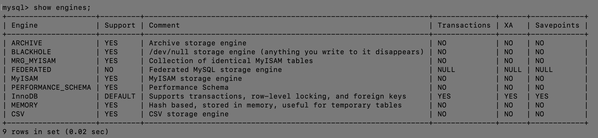

从上图我们可以查看出 MySQL 当前默认的存储引擎是InnoDB，并且在`5.7版本`所有的存储引擎中只有 InnoDB 是`事务性`存储引擎，也就是说只有 InnoDB 支持事务。

**查看MySQL当前默认的存储引擎**

```mysql
mysql> show variables like '%storage_engine%';
```

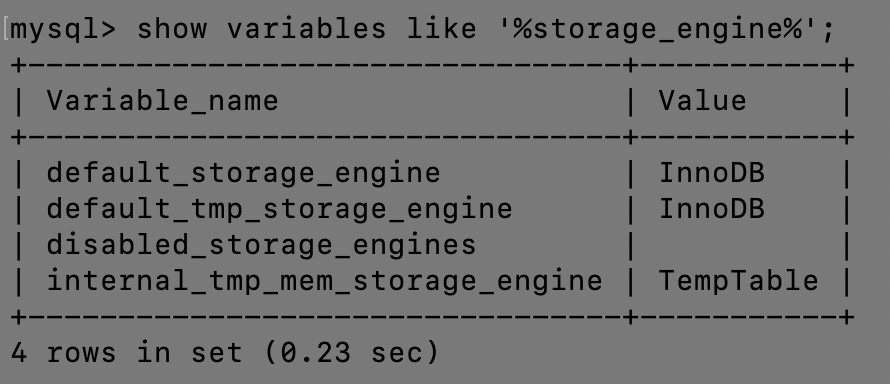

**查看表的存储引擎**

```mysql
show table status like "table_name";
```


## 主键 & 外键

[关于数据库的主键和外键终于弄懂了](https://blog.csdn.net/f45056231p/article/details/81070437)

> 什么是主键 ？

关系型数据库中的一条记录中有若干个属性（字段），若其中某一个属性组（注意是组，也就是多个字段一块）能唯一标识一条记录（即唯一地标识一行），该属性组就可以成为一个主键。

**学生表**：

| `学号` | 姓名 | 性别 | 班级 |
| :----: | :--: | :--: | :--: |
|        |      |      |      |

其中每个学生的学号是唯一的，学号就是一个主键。

**课程表**：

| `课程编号` | 课程名 | 满分 |
| :--------: | :----: | :--: |
|            |        |      |

其中课程编号是唯一的，课程编号就是一个主键。

**成绩表**：

| `学号` | `课程号` | 成绩 |
| :----: | :------: | :--: |
|        |          |      |

成绩表中任何单一属性无法唯一标识一条记录，`学号和课程号的组合`才可以唯一标识一条记录，所以学号和课程号的属性组是一个主键。

> 什么是外键？

上面成绩表中的学号不是成绩表的主键，但它和学生表中的学号相对应，并且学生表中的学号是学生表的主键，则称`成绩表中的学号是学生表的外键`。

外键是相对于主键来说的，是建立表之间的联系的必要前提。


## 主键 & 候选键

>主键和候选键有什么区别？

`答案`：

+ 表格的每一行都由主键唯一标识，一个表只有一个主键。
+ 主键也是候选键。按照惯例，候选键可以被指定为主键，并且可以用于任何外键引用。


## 数据库三范式

[原文](https://blog.csdn.net/wenco1/article/details/88077279)

`题目`： **数据库三范式是什么?**

`答案`：

+ 第一范式（1NF）：**无重复的列**
+ 第二范式（2NF）： **不存在非主属性（成绩）对于码 （学号、课程号）的部分函数依赖**
+ 第三范式（3NF）：**属性不依赖于其它非主属性**


> 第一范式（1NF）

**无重复的列**

> 第二范式（2NF）

**不存在非主属性（成绩）对于码 （学号、课程号）的部分函数依赖**

+ 即只能由码（学号与课程号的组合）才能唯一确定非主属性的每一列，任意非主属性的一列都不可能由码的`真子集`（学号或课程号）来唯一确定。

**函数依赖**：

若在一张表中，在属性（或属性组）**X** 的值确定的情况下，必定能确定属性Y的值，那么就可以说 Y 函数依赖于 **X**，写作 **X** → Y。也就是说，在数据表中，不存在任意两条记录，它们在 **X** 属性（或属性组）上的值相同，而在Y属性上的值不同（即：由 **X** 能确定唯一的 Y）。这也就是`“函数依赖”`名字的由来，类似于函数关系 y = f(x)，在x 的值确定的情况下，y 的值一定是确定的。

**完全函数依赖**：

在一张表中，若 **X** → Y，且对于 **X** 的任何一个真子集（假如属性组 **X** 包含超过一个属性的话），**X'** → Y 不成立，那么我们称 Y 对于 **X** 完全函数依赖，记作 **X** F→ Y。（那个F应该写在箭头的正上方，没办法打出来。

**部分函数依赖**：

假如 Y 函数依赖于 **X**，但同时 Y 并不完全函数依赖于 **X**，也就是存在一个 **X** 的真子集**X'**，使得**X'** → Y 成立，那么我们就称 Y 部分函数依赖于 **X**，记作 **X** P→ Y。

**码**：

设 K 为某表中的一个属性或属性组，若除 K 之外的所有属性都`完全`函数依赖于 K（即：由 K 可以唯一锁定任何一列，且 K 的真子集 K' 做不到这点），那么我们称 K 为`候选码`，简称为`码`。

在实际中我们通常可以理解为：当 K 确定的情况下，该表除 K 之外的所有属性的值也就随之确定，那么 K 就是码。

一张表中可以有超过一个码（实际应用中为了方便，通常选择其中的一个码作为主码）。

 例如：对于下表，（学号、课程号）这个属性组就是码。该表中有且仅有这一个码。（假设所有课没有重名的情况）

| `学号` | 姓名 | 系名 | 系主任 | `课程号` | 成绩 |
| :----: | :--: | :--: | :----: | :------: | :--: |
|        |      |      |        |          |      |

来看一下上表是否符合2NF：

第一步：找出数据表中所有的码。

第二步：根据第一步所得到的码，找出所有的主属性。

第三步：数据表中，除去所有的主属性，剩下的就都是非主属性了。

第四步：查看是否存在非主属性对码的部分函数依赖。

显然，存在非主属性`姓名`对码的部分函数依赖，即由码的真子集`学号`就可确定唯一的姓名。

为了让它满足2NF，我们可以对它进行拆分，在拆分的过程中，要达到更高一级范式的要求，这个过程叫做`「模式分解」`，模式分解的方法不是唯一的，以下是其中一种方法：

**选课**：

| `学号` | `课程号` | 分数 |
| :----: | :------: | :--: |
|        |          |      |

**学生**：

| `学号` | 姓名 | 系名 | 系主任 |
| :----: | :--: | :--: | :----: |
|        |      |      |        |

> 第三范式（3NF）

**非主属性不依赖于其它非主属性，即非主属性之间相互独立**

3NF在2NF的基础之上，消除了非主属性对于码的传递函数依赖。也就是说， 如果存在非主属性对于码的传递函数依赖，则不符合3NF的要求。

总结就是：`不存在非主属性对码的部分函数依赖和传递函数依赖`。

一个表存在非主属性对于码的部分函数依赖，最高只符合1NF的要求，不符合2NF的要求。

接下来我们看看下表中的设计，是否符合3NF的要求。

**选课**：

| `学号` | `课程号` | 分数 |
| :----: | :------: | :--: |
|        |          |      |

**学生**：

| `学号` | 姓名 | 系名 | 系主任 |
| :----: | :--: | :--: | :----: |
|        |      |      |        |

对于选课表，主码为（学号，课程号），主属性为学号和课程号，非主属性只有一个，为分数，不可能存在传递函数依赖，所以选课表的设计，符合3NF的要求。

对于学生表，主码为学号，主属性为学号，非主属性为姓名、系名和系主任。`因为 学号 → 系名，同时 系名 → 系主任，所以存在非主属性系主任对于码(学号)的传递函数依赖`，所以学生表的设计，不符合3NF的要求。

为了让数据表设计达到3NF，我们必须进一步进行模式分解为以下形式：

**选课**：

| `学号` | `课程号` | 分数 |
| :----: | :------: | :--: |
|        |          |      |

**学生**：

| `学号` | 姓名 | 系名 |
| :----: | :--: | :--: |
|        |      |      |

**系**：

| `系名` | 系主任 |
| :----: | :----: |
|        |        |

符合3NF要求的数据库设计，基本上解决了数据冗余过大，插入异常，修改异常，删除异常的问题。

>还有另一种说法：

第一范式（**1NF**）：字段具有原子性，不可再分。(所有关系型数据库系统都满足第一范式数据库表中的字段都是单一属性的，不可再分) 

要求数据库表中的每个实例或行必须可以被惟一地区分。通常需要为表加上一个列，以存储各个实例的惟一标识。这个惟一属性列被称为主关键字或主键。

第三范式（**3NF**）要求一个数据库表中不包含已在其它表中已包含的非主关键字信息。

所以第三范式具有如下特征：

+ 每一列只有一个值
+ 每一行都能区分
+ 每一个表都不包含其他表已经包含的非主关键字信息


## Mysql 技术特点

> Mysql 的技术特点是什么？

`答案`：

MySQL 数据库软件是一个客户端或服务器系统，其中包括：支持各种客户端程序和库的多线程 SQL 服务器、不同的后端、广泛的应用程序编程接口和管理工具。


## Mysql vs Oracle

> 与 Oracle 相比 MySQL 有何优势 ？

`答案`：

1. Mysql 是开源软件，随时可用，无需付费
2. Mysql 是便携式的带有命令提示符的 `GUI`
3. 使用 Mysql 查询浏览器支持管理


## MyISAM vs InnoDB

> MyISAM 和 InnoDB 区别

在`5.5版本`之前，MyISAM 是MySQL的默认数据库引擎。虽然性能极佳，而且提供了大量的特性，包括`全文索引`、`压缩`、`空间函数`等，但 MyISAM `不支持事务和行级锁`，而且最大的缺陷就是`崩溃后无法安全恢复`。

MySQL 5.5版本后默认的存储引擎为InnoDB，InnoDB `事务性`数据库引擎。

大多数时候我们使用的都是 InnoDB 存储引擎，但是在某些情况下使用 MyISAM 也是合适的，比如`读密集`的情况下（如果你不介意 MyISAM 崩溃恢复问题的话）。

**两者的对比：**

1. **是否支持行级锁**：MyISAM 只有表级锁(table-level locking)，而 InnoDB 支持行级锁(row-level locking)和表级锁，默认为行级锁。
2. **是否支持事务和崩溃后的安全恢复**： MyISAM 强调的是`性能`，每次查询具有`原子性`，其执行速度比InnoDB类型更快，但是不提供事务支持。InnoDB 提供事务支持，外部键等高级数据库功能，具有`事务(commit)`、`回滚(rollback)`和`崩溃修复能力(crash recovery capabilities)`的事务安全(transaction-safe (ACID compliant))型表。
3. **是否支持外键**： MyISAM不支持，而InnoDB支持。
4. **是否支持MVCC**：仅 InnoDB 支持。

**或者看下面的总结**：

|                      |       MyISAM       |          InnoDB          |
| :------------------: | :----------------: | :----------------------: |
|        **锁**        |       表级锁       | 表级锁、行级锁 (default) |
|       **事务**       |       不支持       |           支持           |
| **崩溃后的安全恢复** |       不支持       |           支持           |
|       **外键**       |       不支持       |           支持           |
|       **MVCC**       |       不支持       |           支持           |
|       **性能**       |        较高        |           较低           |
|       **其他**       | 每次查询具有原子性 |           回滚           |

**《MySQL高性能》上面有一句话这样写到**：

不要轻易相信 “MyISAM 比 InnoDB 快” 之类的经验之谈，这个结论往往不是绝对的。在很多我们已知场景中，InnoDB 的速度都可以让 MyISAM 望尘莫及，尤其是用到了`聚簇索引`，或者需要访问的数据都可以放入内存的应用。

一般情况下我们选择 InnoDB 都是没有问题的，但是某些情况下你并不在乎`可扩展能力`和`并发能力`，也不需要`事务`支持，也不在乎崩溃后的`安全恢复`问题的话，选择MyISAM也是一个不错的选择。但是一般情况下，我们都是需要考虑到这些问题的。

## MVCC

**MVCC**：Multi-Version Concurrency Control 多版本并发控制

推荐阅读：[MySQL-InnoDB-MVCC多版本并发控制](https://segmentfault.com/a/1190000012650596)       [MVCC详解](https://www.jianshu.com/p/dd3724fc0f66)

1. MVCC的实现，是通过保存数据在某个时间点的快照来实现的，即：无论需要执行多长时间，每个事务看到的数据都是一致的；
2. 应对高并发事务，MVCC 比单纯的加锁更高效；
3. MVCC只在 `READ COMMITTED` 和 `REPEATABLE READ` 两个隔离级别下工作；
4. MVCC可以使用`乐观(optimistic)锁` 和 `悲观(pessimistic)锁`来实现；
5. 各数据库中MVCC实现并不统一。

**<高性能MySQL>中对MVCC的部分介绍**：

- MySQL的大多数事务型存储引擎实现的其实都不是简单的行级锁。`基于提升并发性能的考虑`, 它们一般都同时实现了多版本并发控制(MVCC)。不仅是MySQL，包括Oracle、PostgreSQL等其他数据库系统也都实现了MVCC，但各自的实现机制不尽相同，因为MVCC没有一个统一的实现标准。
- 可以认为MVCC是行级锁的一个变种，但是它在很多情况下避免了加锁操作，因此开销更低。虽然实现机制有所不同，但大都实现了非阻塞的读操作，写操作也只锁定必要的行。
- 其他两个隔离级别够和MVCC不兼容，因为 `READ UNCOMMITTED` 总是读取最新的数据行，而不是符合当前事务版本的数据行。而 `SERIALIZABLE` 则会对所有读取的行都加锁。

**MVCC 解决了什么问题**？

锁机制可以控制并发操作，但是其系统开销较大，而MVCC可以在大多数情况下代替行级锁，使用MVCC，能降低其系统开销。

**MVCC 的实现**：

MVCC是通过保存数据在某个时间点的快照来实现的。不同存储引擎的MVCC，不同存储引擎的MVCC实现是不同的；典型的有乐观并发控制和悲观并发控制。

书中提到`“InnoDB的MVCC是通过在每行记录后面保存两个隐藏的列来实现的”`(网上也有很多此类观点)，但其实并不准确，参考[MySQL官方文档](https://dev.mysql.com/doc/refman/5.7/en/innodb-multi-versioning.html)，可以看到，InnoDB存储引擎在数据库每行数据的后面添加了`三个字段`，而不是两个！！

平时所说的这两个列，分别保存了这个行的`创建时间`和`删除时间`。这里存储的并不是实际的时间值，而是`系统版本号`(可以理解为事务的ID)，每开始一个新的事务，系统版本号就会自增，事务开始时刻的系统版本号会作为事务的ID。下面看一下在`REPEATABLE READ`隔离级别下，MVCC具体是如何操作的。

**InnoDB实现MVCC的方式是:**

+ 事务以`排他锁`的形式修改原始数据

+ 把修改前的数据存放于`undo log`，通过`回滚指针`与主数据关联

+ 如果修改成功（commit）则啥都不做，失败则恢复`undo log`中的数据（rollback）

+ 悲观锁和乐观锁

其中，悲观锁和乐观锁：

1. 悲观锁

	排它锁：当事务在操作数据时把这部分数据进行锁定，直到操作完毕后再解锁，其他事务操作才可操作该部分数据。这将防止其他进程读取或修改表中的数据。

	实现：大多数情况下依靠数据库的锁机制实现。一般使用 `select ...for update` 对所选择的数据进行加锁处理，例如 `select * from account where name=”Max” for update`， 这条 sql 语句锁定了`account` 表中所有符合检索条件（`name=”Max”`）的记录。本次事务提交之前（事务提交时会释放事务过程中的锁），外界无法修改这些记录。

2. 乐观锁

	如果有人在你之前更新了，你的更新应当是被拒绝的，可以让用户重新操作。

	实现：大多数基于数据`版本（Version）`记录机制实现，即`版本号机制`。具体可通过给表加一个`版本号`或`时间戳`字段实现，当读取数据时，将version字段的值一同读出，数据每更新一次，对此version值加1。当我们提交更新的时候，判断当前版本信息与第一次取出来的版本值大小，如果数据库表当前版本号与第一次取出来的version值相等，则予以更新，否则认为是过期数据，拒绝更新，让用户重新操作。

**排他锁（Exclusive Locks，简称X锁）**，又称为写锁、独占锁，是一种基本的锁类型。若事务T对数据对象A加上X锁，则只允许T读取和修改A，其他任何事务都不能再对A加任何类型的锁，直到T释放A上的锁。这就保证了其他事务在T释放A上的锁之前不能再读取和修改A。

> MyISAM & InnoDB自增ID

`题目`：一张表，里面有 ID 自增主键，当 insert 了 17 条记录之后，删除了第 15、16、17 条记录， 再把 Mysql 重启，再 insert 一条记录，这条记录的 ID 是 18 还是 15 ？

`答案`：

如果表的类型是 `InnoDB`，那么是 15

+ 因为 InnoDB 表只是把自增主键的最大 ID 记录到`内存`中，所以重启数据库或者是对表进行 `OPTIMIZE` 操作，都会导致最大 ID 丢失。

如果表的类型是 `MyISAM`，那么是 18

+ 因为 MyISAM 表会把自增主键的最大 ID 记录到`数据文件`里，重启 MySQL 自增主键的最大 ID 也不会丢失。

## 字符集及校对规则

字符集指的是`一种从二进制编码到某类字符符号的映射`。

校对规则是指某种字符集下的`排序规则`。MySQL中每一种字符集都会对应一系列的校对规则。

MySQL采用的是类似`继承`的方式指定字符集的默认值，每个数据库以及每张数据表都有自己的默认值，他们逐层继承。比如：某个库中所有表的默认字符集将是该数据库所指定的字符集（这些表在没有指定字符集的情况下，才会采用默认字符集） PS：整理自《Java工程师修炼之道》。

详细内容可以参考： [MySQL字符集及校对规则的理解](https://www.cnblogs.com/geaozhang/p/6724393.html#MySQLyuzifuji)

## MySQL索引

[原文](https://blog.csdn.net/hao65103940/article/details/89032538)

MySQL索引使用的数据结构主要有`BTree索引` 和 `哈希索引` 。对于哈希索引来说，底层的数据结构就是哈希表，因此在绝大多数需求为`单条`记录查询的时候，可以选择哈希索引，查询性能最快；其余大部分场景，建议选择BTree索引。

MySQL的 BTree索引使用的是B树中的B+Tree，但主要的两种存储引擎的实现方式是不同的。

### MyISAM  / InnoDB

> **MyISAM** 

B+Tree叶节点的`data域`存放的是数据记录的地址。在索引检索的时候，首先按照B+Tree搜索算法搜索索引，如果指定的Key存在，则取出其 `data 域`的值，然后以 data 域的值为地址读取相应的数据记录。这被称为`“非聚簇索引”`。

> **InnoDB** 

其数据文件本身就是索引文件。相比 MyISAM（`索引文件和数据文件是分离的`），`其表数据文件本身就是按 B+Tree 组织的一个索引结构`，树的叶节点 `data 域`保存了完整的数据记录。这个索引的key是数据表的主键，因此InnoDB表数据文件本身就是主索引。这被称为`“聚簇索引（或聚集索引）”`。

而其余的索引都作为辅助索引，辅助索引的data域存储相应记录主键的值而不是地址，这也是和MyISAM不同的地方。在根据主索引搜索时，直接找到key所在的节点即可取出数据；在根据辅助索引查找时，则需要先取出主键的值，再走一遍主索引。 因此，`在设计表的时候，不建议使用过长的字段作为主键，也不建议使用非单调的字段作为主键，这样会造成主索引频繁分裂`。PS：整理自《Java工程师修炼之道》

> **不同存储引擎的索引区别**

MyISAM表数据文件和索引文件是分离的，索引文件仅保存数据记录的磁盘地址。

InnoDB表数据文件本身就是主索引，叶节点data域保存了完整的数据记录。

> **MySQL 索引结构、特点，为什么使用这个**？

索引（在MySQL中也叫做`键(Key)`）是存储引擎快速找到记录的一种数据结构。

在MySQL中，索引是在存储`引擎层`而不是服务层实现的。

InnoDB存储引擎支持以下常见的索引：B+ 树索引、全文索引、哈希索引

存储引擎以不同的方式使用B-Tree索引，性能也各有不同，例如 MyISAM 使用`前缀压缩技术`使得索引更小，但 InnoDB 则按照`原数据格式`进行存储。再如：MyISAM索引通过数据的`物理位置`引用被索引的行，而InnoDB则根据`主键`引用被索引的行。

###  聚集 / 非聚集索引

[原文](https://blog.csdn.net/qq_29373285/article/details/85254407)

> **聚集索引**

聚集索引表记录的排列顺序和索引的排列顺序一致，数据行的物理顺序与列值（一般是主键那一列）的逻辑顺序相同，所以查询效率快，只要找到第一个索引值记录，其余就连续性的记录在物理也一样连续存放。

一个表中只能拥有一个聚集索引。

优点是查询快。

缺点是修改慢。因为需要保证表中记录的物理和索引顺序一致，在记录插入的时候，会对数据页重新排序。

```mysql
-- 添加聚集索引
create clustered index CLU_ABC on abc(A);

-- 删除聚集索引
drop index abc.CLU_ABC;
```

+ 其中，CLU_ABC 为聚集索引的名字，abc(A) 为表 abc 的 A 列

> **非聚集索引**

该索引中索引的逻辑顺序与磁盘上的物理存储顺序不同，一个表中可以拥有多个非聚集索引

非聚集索引层次多，不会造成数据重排。

非聚集索引又可以分为`普通索引、唯一索引、全文索引`。

```mysql
-- 添加非聚集索引
create nonclustered index NONCLU_ABC on abc(A);
```

> **二者区别**

二者的根本区别是：`表记录的排列顺序和索引的排列顺序是否一致`。

用一个例子来形容聚集索引和非聚集索引的区别就是：聚集索引就好像用新华字典的汉字的拼音首字母去查询汉字所在页，而非聚集索引就好像你用汉字的偏旁部首去查询一个汉字（偏旁部首的顺序跟汉字实际存储的顺序不一致）。

+ 聚集索引的叶子节点就是对应的数据节点，可以直接获取到某一行对应的全部列的信息；
+ 非聚集索引的叶子节点仍然是索引节点，只是有一个指针指向对应的数据块。在索引没有覆盖到对应的列时候需要进行二次查询。
+ 因此在查询方面，聚集索引的速度更优。

> **总结：**

|              动作描述              | 使用聚集索引 | 使用非聚集索引 |
| :--------------------------------: | :----------: | :------------: |
|          列经常被分组排序          |      应      |       应       |
|         返回某范围内的数据         |      应      |      不应      |
| 一个或极少不同值（其他几乎都相同） |     不应     |      不应      |
|           小数目的不同值           |      应      |      不应      |
|           大数目的不同值           |     不应     |       应       |
|            频繁更新的列            |     不应     |       应       |
|               外键列               |      应      |       应       |
|               主键列               |      应      |       应       |
|           频繁修改索引列           |     不应     |       应       |

有以下几个问题：

1. 聚集索引的约束是唯一性，是否要求字段也是唯一的呢？

	不要求唯一！

	一般认为是唯一的，可能是受系统默认设置的影响，一般我们指定一个表的主键，如果这个表之前没有聚集索引，同时建立主键时候没有强制指定使用非聚集索引，SQL会默认在主键上创建一个聚集索引，而主键都是唯一的，所以理所当然的认为创建聚集索引的字段也需要唯一。

	聚集索引可以创建在任何一列字段上，这是从理论上讲，实际情况并不能随便指定，否则在性能上会是恶梦。

2. 为什么聚集索引可以创建在任何一列上，如果此表没有主键约束，即有可能存在重复行数据呢？

	如果未使用 UNIQUE 属性创建聚集索引，数据库引擎将向表自动添加一个四字节 uniqueifier 列。必要时，数据库引擎将向行自动添加一个 uniqueifier 值，使每个键唯一。此列和列值供内部使用，用户不能查看或访问。

3. 在主键是创建聚集索引的表，在数据插入上为什么比在主键上创建非聚集索引表速度要慢？

	在有主键的表中插入数据行，由于有主键唯一性的约束，所以需要保证插入的数据没有重复。

	聚集索引由于索引叶节点就是数据页，所以如果想检查主键的唯一性，需要遍历所有数据节点才行，

	而非聚集索引上已经包含了主键值，所以查找主键唯一性，只需要遍历所有的索引页就行，这比遍历所有数据行减少了不少IO消耗。

> **测试**：

假如现在有这么一张表：

`children`

|      | age  | name  |
| :--: | :--: | :---: |
|  1   |  1   | hory  |
|  2   |  5   | casia |
|  3   |  7   | amili |
|  4   |  9   | ferry |

这个时候插入一条数据：

```mysql
insert into children values('6','kiven');
```

此时再次查询为下表所示：

|      | age  |  name   |
| :--: | :--: | :-----: |
|  1   |  1   |  hory   |
|  2   |  5   |  casia  |
|  3   |  7   |  amili  |
|  4   |  9   |  ferry  |
| `5`  | `6`  | `kiven` |

添加聚集索引：

```mysql
create clustered index CLU_CHIL on children(age);
```

再查询数据显示为如下表，此时发现表的顺序发生了变化，此时的排序按`age`字段的递增排序：

|      | age  | name  |
| :--: | :--: | :---: |
|  1   | `1`  | hory  |
|  2   | `5`  | casia |
|  3   | `6`  | kiven |
|  4   | `7`  | amili |
|  5   | `9`  | ferry |

删除聚集索引，会发现表的顺序不会发生改变：

```mysql
drop index children.CLU_CHIL;
```

接着添加非聚集索引，添加新的记录：

```mysql
create nonclustered index NONCLU_CHIL on children(age);
insert into children values('4','mari');
```

查看表顺序，如下表，并没有影响表的顺序：

|      | age  |  name  |
| :--: | :--: | :----: |
|  1   |  1   |  hory  |
|  2   |  5   | casia  |
|  3   |  6   | kiven  |
|  4   |  7   | amili  |
|  5   |  9   | ferry  |
| `6`  | `4`  | `mari` |


### 覆盖 / 联合索引

覆盖索引：可以简单认为查询列被所建的索引覆盖。也就是select数据列只从索引中就能够取得，不必读取数据行，MySQL可以利用索引返回select列表中的字段，而不必根据索引再次读取数据文件。

联合索引：多列值组成一个索引，专门用于组合搜索，其效率大于索引合并，遵循“最左前缀”原则，把最常用作为检索或排序的列放在最左，依次递减，组合索引相当于建立了 col1、col1col2、col1col2col3 三个索引，而col2或者col3是不能使用索引的。


### 磁盘相关知识

+ B-Tree是为磁盘等外存储设备设计的一种平衡查找树，因此在讲B-Tree之前先了解下磁盘的相关知识。

系统从磁盘读取数据到内存时是以`磁盘块（block）`为基本单位的，位于同一个磁盘块中的数据都会被读取出来，而不是只读取需要的信息。

InnoDB存储引擎中有`页（Page）`的概念，页是InnoDB存储引擎磁盘管理的最小单位，InnoDB存储引擎中默认每个页的大小为`16Kb`，可通过参数 `innodb_page_size` 将页的大小设置为4K、8K、16K，在 MySQL 中可通过如下命令查看页的大小：

```mysql
mysql> show variables like 'innodb_page_size';
```

而一个磁盘块的存储空间往往没有这么大，因此InnoDB每次申请磁盘空间时都会是`若干地址连续磁盘块来达到页的大小16KB`。InnoDB在把数据读入到磁盘时会以`页`为基本单位，在查询数据时如果一个页中的每条数据都能有助于定位数据记录的位置，这将会减少磁盘I/O次数，提高查询效率。

B-Tree 结构的数据可以让系统高效地找到数据所在的磁盘块。


### B-Tree

[原文](https://blog.csdn.net/hao65103940/article/details/89032538)

B-Tree `平衡多路查找树`

B-Tree 通常意味着所有的值都是按顺序存储的，并且每一个叶子页到根的距离相同。

为了描述 B-Tree，首先定义一条记录为一个`二元组[key, data] `，`key`为记录的键值，对应表中的`主键值`，`data`为一行记录中除主键外的数据。对于不同的记录，`key值互不相同`。

**一棵 m 阶的 B-Tree 有如下特性**： 

1. 每个节点最多有`m`个孩子；
2. 除了根节点和叶子节点外，其它每个节点至少有Ceil(m/2)个孩子；
3. 若根节点不是叶子节点，则至少有2个孩子；
4. 所有叶子节点都在同一层，且不包含其它关键字信息；
5. 每个非终端节点包含 n 个关键字信息（P0,P1,…Pn, k1,…kn）；
6. 关键字的个数 n 满足：ceil(m/2)-1 <= n <= m-1；
7. ki(i=1,…n)为关键字，且关键字升序排序； 
8. Pi(i=1,…n)为指向子树根节点的指针。P(i-1)指向的子树的所有节点关键字均小于ki，但都大于k(i-1)。

B-Tree中的每个节点根据实际情况可以包含大量的关键字信息和分支，如下图所示为一个`3`阶的 B-Tree：

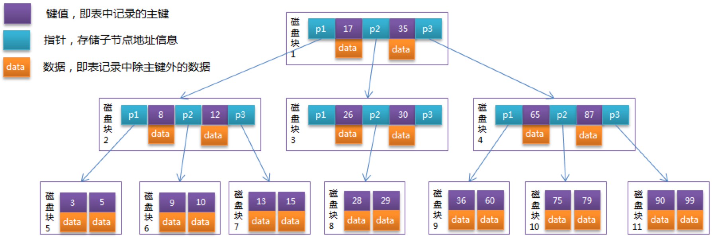

从图中可以看到，每个节点占用一个盘块的磁盘空间，一个节点上有两个升序排序的关键字和三个指向子树根节点的指针，指针存储的是子节点所在磁盘块的地址。两个关键字划分成的三个范围域对应三个指针指向的子树的数据的范围域。

以根节点为例，关键字为 17 和 35，P1指针指向的子树的数据范围为小于17，P2指针指向的子树的数据范围为17~35，P3指针指向的子树的数据范围为大于35。

**模拟查找关键字 29 的过程**：

1. 根据根节点找到磁盘块1，读入内存。【磁盘I/O操作第1次】
2. 比较关键字29在区间（17, 35），找到磁盘块1的指针P2。
3. 根据P2指针找到磁盘块3，读入内存。【磁盘I/O操作第2次】
4. 比较关键字29在区间（26, 30），找到磁盘块3的指针P2。
5. 根据P2指针找到磁盘块8，读入内存。【磁盘I/O操作第3次】
6. 在磁盘块8中的关键字列表中找到关键字29。

分析上面过程，发现需要 3 次磁盘I/O操作，和 3 次内存查找操作。由于内存中的关键字是一个有序表结构，可以利用二分法查找提高效率。而 3 次磁盘I/O操作是影响整个B-Tree查找效率的决定因素。

B-Tree相对于AVLTree（平衡二叉树）缩减了节点个数，使每次磁盘I/O取到内存的数据都发挥了作用，从而提高了查询效率。

**树的深度和表的大小直接相关**：

由于B-Tree的每个节点中不仅包含数据的key值，还有data值，而每一个页的存储空间是有限的，当data数据较大时将会导致一个页中能存储的key的数量很小，这样就会增加B树的深度，从而增加磁盘查询的时的I/O次数，进而影响查询效率。由此对B树进行优化得到B+树...

**索引可以包含一个或多个列的值，如果索引包含多个列，那么列的顺序也十分重要**：

+ 索引对多个值进行排序的依据是 CREATE TABLE 语句中定义索引时列的顺序。

假如有如下数据表：

```mysql
CREATE TABLE People(
  	last_name varchar(50) not null,
  	first_name varchar(50) not null,
  	birthday date not null
);
```

last_name 为姓，first_name为名

索引对于一行的多个值进行排序的依据是 CREATE TABLE 语句中定义索引时列的顺序，假如两人的姓和名都一样，则根据他们的出生日期来排列顺序。

可以使用 B-Tree 索引的查询类型：`全键值、键值范围、键前缀查找`，其中键前缀查找只适用于根据最左前缀的查找

**全值匹配**：指的是和索引中的所有列进行匹配，例如前面提到的索引可用于查找姓名为 Cuba Allen 、出生日期为 1960-01-01 的人

**匹配最左前缀**：前面提到的索引可用于查找所有姓为 Allen 的人，即只使用索引的第一列

**匹配列前缀**：只匹配某一列的值的开头部分。例如查找所有以 **J** 开头的姓的人

**匹配范围值**：例如查找姓在 Allen 和 Barrymore 之间的人

**精确匹配某一列并范围匹配另外一列**：例如查找所有姓为 Allen，并且名字是字母K开头的人。即第一列 last_name 全匹配，第二列 first_name 范围匹配

**只访问索引的查询**：即查询只需访问索引，而无需访问数据行

> **B-Tree索引的局限性：**

+ 如果不是按照索引的最左列开始查找，则无法使用索引。例如 无法越过第一列，直接查找名为 Bill 的人，也无法查找某个特定生日的人，因为这两列都不是最左数据列。类似的，也无法查找姓氏以某个字母结尾的人
+ 不能跳索引中的列。比如无法查找姓为Smith，并且在某个特定日期出生的人，因为越过了中间的列 first_name
+ 如果查询中有某个列的范围查询，则其右边所有列都无法使用索引优化查找。例如查询 WHERE last_name='Smith' AND first_name LIKE 'J%' AND birthday='1976-02-05'，这个查询只能使用索引的前两列，因为这里LIKE是一个范围条件。如果范围查询列的值的数量有限，可以使用等于多个使用条件来代替范围条件。

### B+Tree

B+Tree是通过二叉查找树，再由平衡二叉树、B 树演化而来，但B+Tree不是一个二叉树。

**二叉查找树**：在二叉查找树中，`左子树`的键值总是小于根节点的键值，`右子树`的键值总是大于根节点的键值，因此可以通过`中序遍历`得到键值得排序输出

**平衡二叉树**：要想更大限度地优化一颗二叉查找树的查找效率，需要将二叉查找树设计成平衡二叉树（AVL树），平衡二叉树除满足AVL树的定义外，还需要满足`任意节点的两个子树的高度差最大为1`。维护平一棵衡二叉树代价是很大的，需要1次或多次左旋和右旋来得到插入或更新后的树的平衡性，不过平衡二叉树多用于内存结构对象中，因此维护的开销相对较小。

**最优二叉树**：平衡二叉树的查找性能并不是最高的，最好的性能是建立一棵最优二叉树，但是最优二叉树的建立和维护需要大量的操作，所以用户一般只需建立一棵平衡二叉树即可。

>B+Tree

B+Tree索引并不能找到一个给定键值的具体行，而是被查找数据行所在的页，然后数据库通过把页读入到内存，再在内存中进行查找。

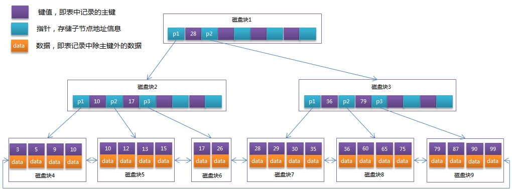

从B-Tree结构图中可以看到每个节点中不仅包含数据的key值，还有data值。而每一个页的存储空间是有限的，如果data数据较大时将会导致每个节点（即一个页）能存储的key的数量很小，当存储的数据量很大时同样会导致B-Tree的深度较大，增大查询时的磁盘I/O次数，进而影响查询效率。

在B+Tree中，所有数据记录节点都是按照键值大小顺序存放在同一层的叶子节点上，而`非叶子节点上只存储key值信息`，这样可以大大加大每个节点存储的key值数量，降低B+Tree的高度。

所有叶子节点也通过指针连接，形成一个循环链表。因此可以对B+Tree进行两种查找运算：

1. 对于主键的范围查找和分页查找；
2. 从根节点开始，进行随机查找。


### B+Tree vs B-Tree

> **B+Tree相对于B-Tree有几点不同**：

1. 非叶子节点只存储键值信息；
2. 所有叶子节点之间都有一个链指针；
3. 数据记录都存放在叶子节点中。


**可能上面例子中只有22条数据记录，看不出B+Tree的优点，下面做一个推算**：

InnoDB存储引擎中页的大小为16KB，一般表的主键类型为INT（占用4个字节）或BIGINT（占用8个字节），指针类型也一般为4或8个字节，也就是说一个页（B+Tree中的一个节点）中大概存储16KB/(8B+8B)=1K个键值（因为是估值，为方便计算，这里的K取值为10^3）。 也就是说一个深度为3的B+Tree索引可以维护10^3 * 10^3 * 10^3 = 10亿 条记录。

实际情况中每个节点可能不能填充满，因此在数据库中，B+Tree的高度一般都在 2~4 层。InnoDB存储引擎在设计时是将根节点常驻内存的，也就是说查找某一键值的行记录时最多只需要 1~3 次磁盘I/O操作。

B+Tree索引可以分为`聚集索引（clustered index）`和`辅助索引（secondary index）`

+ 上面B+Tree示例图在数据库中的实现即为聚集索引，聚集索引的B+Tree中的叶子节点存放的是`整张表的行记录数据`。
+ **辅助索引和聚集索引的区别在于**，辅助索引的叶子节点并不包含行记录的全部数据，而是存储相应行数据的聚集索引键（即主键）。当通过辅助索引键查询数据时，InnoDB存储引擎会遍历辅助索引找到主键，然后再通过主键在聚集索引中找到完整的行记录数据。


### 哈希索引

哈希索引基于哈希表实现，只有精确匹配索引所有列的查询才有效。

`对于每一行数据，存储引擎都会对所有的索引列计算一个哈希码（hash code）`，哈希索引将所有的哈希码存储在索引中，同时在哈希表中保存指向每个数据行的指针。

在MySQL中，只有`Memory引擎`显式支持哈希索引，这也是 Memory 引擎的默认索引类型，Memory引擎同时也支持B-Tree索引。值得一提的是Memory引擎是支持非唯一哈希索引的，如果多个列的哈希值相同，索引会以`链表`的方式存放多个记录指针到同一个哈希条目中。

例如：通过哈希函数`hash()`

first_name='lebron'，hash('lebron')=2315，又如：hash('Kyrie')=3394，hash('Stephen')=1373

在数据表中的顺序是'lebron'、'Kyrie'、'Stephen'

转为哈希值之后，哈希值是按大小排序的，有序的好处是为了提高查询效率。

这样，在查询的时候，先计算其哈希值，然后根据哈希值找到对应的数据行。

> **哈希索引的局限性：**

+ 哈希索引数据行并不是按照索引值顺序存储的，所以也就`无法用于对数据行进行排序`

+ `哈希索引不支持部分索引列匹配查找`，因为哈希索引是使用索引列的全部内容来计算哈希值的。

	例如，在数据列first_name、last_name上建立哈希索引，那么哈希值就是根据first_name、last_name这两个列的值来计算的，如果查询只有数据列first_name，则无法使用该索引；

+ 哈希索引`只支持等价比较查询`，包括=、IN()、<=>（注意<>和<=>是不同的操作），也不支持任何范围查询，例如 WHERE price > 100

+ 一般情况下哈希索引的效率很高，但是如果碰到很多哈希冲突，存储引擎必须遍历链表中的所有行指针。

另外，**NDB集群引擎也支持唯一哈希索引**

InnoDB引擎有一个特殊的功能叫做“自适应哈希索引（adaptive hash index）”，当InnoDB注意到某些索引值被使用的非常频繁时，它会在内存中基于B-Tree索引之上再创建一个哈希索引。

> **创建自定义哈希索引**

如果存储引擎不支持哈希索引，则可以模拟像InnoDB一样创建哈希索引

实现方法：在B-Tree基础上创建一个**伪哈希索引**，这跟真正的哈希索引不是一回事，因为还是使用B-Tree进行查找，但是它使用哈希值而不是键本身进行索引查找。我们需要做的就是在查询的WHERE字句中手动指定使用哈希函数

例如需要存储大量的URL，并根据URL进行搜索查找，如果使用B-Tree来存储URL，存储的内容就比较大，因为URL通常很长，正常情况下会有如下查询：

```mysql
SELECT id FROM url WHERE url="http://www.mysql.com";
```

若删除原来URL列上的索引，而新增一个被索引的url_crc列，使用CRC32做哈希，就可以使用下面的方式查询：

```mysql
SELECT id FROM url WHERE url="http://www.mysql.com" AND url_crc=CRC32("http://www.mysql.com");
```

这样实现的缺陷是需要维护哈希值。可以手动维护，也可以使用触发器实现，

下面的案例演示了触发器如何在插入和更新时维护url_crc列。首先创建如下表：

```mysql
CREATE TABLE pseudohash(
		id int unsigned NOT NULL auto_increment,
  	url varchar(255) NOT NULL,
  	url_crc int unsigned NOT NULL DEFAULT 0,
  	PRIMARY KEY(id)
);
```

然后创建触发器

```mysql
CREATE TRIGGER pseudohash_crc_ins BEFORE INSERT ON pseudohash FOR EACH ROW BEGIN SET NEW.url_crc=crc32(NEW.url);

CREATE TRIGGER pseudohash_crc_upd BEFORE UPDATE ON pseudohash FOR EACH ROW BEGIN SET NEW.url_crc=crc32(NEW.url);
END;

DELIMITER;
```

创建触发器的语句是：create  trigger  pseudohash_crc_ins  before  insert  on  pseudohash  for  each  row  begin  set  NEW.url_crc=crc32(NEW.url);

翻译过来就是：对于每一行数据在表pseudohash中插入一个新的url之前，创建一个触发器pseudohash_crc_ins，使得插入的url所对应的哈希值放在url_crc列

这样当执行下列语句：

```mysql
INSERT INTO pseudohash (url) VALUES ('http://www.mysql.com');
```

触发器就会为http://www.mysql.com生成一个哈希值放在url_crc列，查询一下即可发现：

```mysql
SELECT * FROM pseudohash LIMIT 1000;
```

结果为：

|  id  |         url          |  url_crc   |
| :--: | :------------------: | :--------: |
|  1   | http://www.mysql.com | 1560514994 |

同样地，执行UPDATE也是如此：

```mysql
UPDATE pseudohash SET url='http://www.mysql.com/' WHERE id=1;
```

这里使用的是哈希函数CRC32()，注意不要使用SHA1()和MD5()，这两个函数是强加密函数，设计的目的是最大限度消除冲突，所以计算出的哈希值是非常长的字符串。

如果数据表非常大，CRC32()会出现大量哈希冲突，则可以考虑自己实现一个简单的64位哈希函数，这个自定义函数要返回整数，而不是字符串。一个简单的办法是使用MD5()函数返回值的一部分作为自定义哈希函数。

```mysql
SELECT CONY(RIGHT(MD5('http://www.mysql.com/'),16)16,10) 
```

处理哈希冲突。当使用哈希索引进行查询的时候，必须在WHERE字句中包含常量值：

```mysql
SELECT id FROM pseudohash WHERE url_crc=CRC32("http://www.mysql.com") AND url="http://www.mysql.com";
```

因为所谓的”生日悖论“，出现哈希冲突的概率的增长速度可能比想象的要快得多。

还可以使用如FNV64()函数作为哈希函数，这是移植自Percona Server的函数，可以以插件的方式在任何MySQL版本中使用，哈希值为64位，速度快，且冲突比CRC32()要少的多。


### 空间数据索引（R-Tree）

MyISAM表支持空间索引，可以用于地理数据存储，和B-Tree不同，这种在索引无须前缀查询。

空间索引可以从任何维度来索引数据，查询时，可以有效地使用任意维度来组合查询。必须使用MySQL的GIS相关函数如MBRCONTAINS()等来维护数据。


### 全文索引

它查找的是文中的关键词，而不是直接比较索引中的值。它跟其它几类索引的匹配方式完全不一样，它有许多需要注意的细节，如停用词、词干和复数、布尔搜索等。全文索引更类似于搜索引擎做的事，而不是简单的WHERE条件匹配。


### 其它索引

TokuDB使用的分形树索引（fractal tree index），这是一类较新开发的数据结构，既有B-Tree的许多优点，也避免了B-Tree树的一些缺点

另外还有InnoDB的`聚簇索引、覆盖索引`


### 总结

> 索引的优点

+ 大大减少了服务器需要扫描的数据量
+ 可以帮助服务器避免排序和临时表
+ 可以将随机I/O变为顺序I/O

>**索引是最好的解决方案吗**？

索引不总是最好的解决方案，总的来说，只有当索引帮存储引擎快速查找到记录带来的好处大于其带来的额外工作时，索引才是有效的。对于非常小的表，大部分情况下，简单的全表扫描更加高效。大中型的表，索引就非常有效。但是对于特大型的表，建立和使用索引的代价将随之增长。这种情况下，需要一种技术可以直接区分区分出查询需要的一组数据，而不是一条一条记录地查询。例如`「分区技术」`

如果表的数量特别多，可以建一个`元数据信息表`，用来查询需要用到某些特性，例如执行哪些需要聚合多个应用分布在多个表的数据的查询，则需要记录`「哪个用户的信息存储在哪个表中」`的元数据。对于TB级别的数据，定位单条记录的意义不大，所以经常会使用`「块级别元数据技术」`来替代索引。

> **不走索引的情况**

1. 模糊查询（前模糊即百分号在前面或者全模糊）；
2. or 条件中只要有一个字段没有索引，该语句就不走索引；
3. !=、<>  不走索引；
4. not in 不走索引；
5. 隐式转换 不走索引（name 字段为 string 类型，这里123为数值类型，进行了类型转换，所以不走索引，改为 '123' 则走索引）；
6. 函数运算 不走索引；
7. and 语句，多条件字段，最多只能用到一个索引，如果需要，可以建组合索引。

> **建立索引的原则**

1. where后面参与查询的列可以组成单列索引或者联合索引；
2. 避免排序，即如果sql语句中出现了order by column，那么取出的结果集就已经是按照column排好序的了，不需要再生成临时表；
3. select 对应的列应该尽量是索引列，即避免回表查询。

> **如何避免回表**

+ 回表就是指当执行一条 sql 语句，需要从两个b+索引中去取数据。

1. 建立联合索引，实现索引覆盖也就是要查找的内容直接在索引树中就能找到；
2. 不是必须的字段就不要出现在SELECT里面

>**在sql语句的前面使用explain可以查看sql的执行计划**

如下：

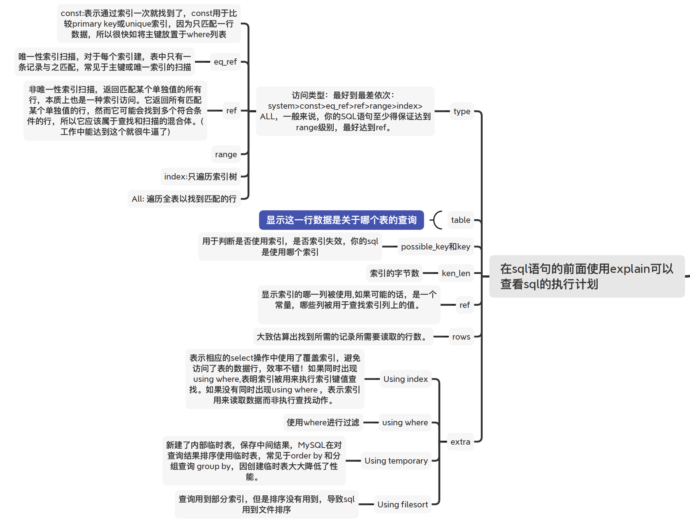


## 查询缓存的使用

MySQL 执行查询语句的时候，会先查询缓存。不过，MySQL 8.0 版本后移除，因为这个功能不太实用。

`my.cnf`加入以下配置，重启MySQL开启查询缓存（本机的`my.cnf`在`/usr/local/Cellar/mysql/8.0.19/.bottle/etc/my.cnf`）

```cnf
query_cache_type=1
query_cache_size=600000
```

MySQL执行以下命令也可以开启查询缓存

```mysql
set global  query_cache_type=1;
set global  query_cache_size=600000;
```

如上，开启查询缓存后在同样的查询条件以及数据情况下，会直接在缓存中返回结果。这里的查询条件包括查询本身、当前要查询的数据库、客户端协议版本号等一些可能影响结果的信息。因此任何两个查询在任何字符上的不同都会导致缓存不命中。此外，如果查询中包含任何用户自定义函数、存储函数、用户变量、临时表、MySQL库中的系统表，其查询结果也不会被缓存。

缓存建立之后，MySQL的查询缓存系统会跟踪查询中涉及的每张表，如果这些表（数据或结构）发生变化，那么和这张表相关的所有缓存数据都将失效。

缓存虽然能够提升数据库的查询性能，但是缓存同时也带来了额外的开销，每次查询后都要做一次缓存操作，失效后还要销毁。因此，开启缓存查询要谨慎，尤其对于`写密集`的应用来说更是如此。如果开启，要注意`合理控制缓存空间大小`，一般来说其大小设置为`几十Mb`比较合适。此外，还可以通过 `sql_cache `和`sql_no_cache`来控制某个查询语句是否需要缓存：

```mysql
select sql_no_cache count(*) from usr;
```


## 事务

> 什么是事务？

事务是逻辑上的一组操作，要么都执行，要么都不执行。

事务最经典也经常被拿出来说例子就是转账了。假如小明要给小红转账1000元，这个转账会涉及到两个关键操作就是：将小明的余额减少1000元，将小红的余额增加1000元。万一在这两个操作之间突然出现错误比如银行系统崩溃，导致小明余额减少而小红的余额没有增加，这样就不对了。事务就是保证这两个关键操作要么都成功，要么都要失败。


>MySQL 支持事务吗？

`答案`：

在缺省模式下，MYSQL 是 `autocommit` 模式的，所有的数据库更新操作都会`即时`提交，所以在缺省情况下，mysql 是不支持事务的。

但是如果你的 MYSQL 表类型是使用 InnoDB Tables 或 BDB tables 的话，你的 MYSQL 就可以使用事务处理：

+ 使用 `SET AUTOCOMMIT = 0` 就可以使 MYSQL 开启`非autocommit` 模式
+ 在`非 autocommit` 模式下，你必须使用 `COMMIT` 来提交你的更改，且用 `ROLLBACK` 来回滚你的更改
+ 示例如下：

```mysql
START TRANSACTION;
SELECT @A:=SUM(salary) FROM table1 WHERE type=1;
UPDATE table2 SET summmary=@A WHERE type=1;
COMMIT;
```


## 分布式事务

https://mp.weixin.qq.com/s/7gfmnXQRRim0OCIRC0tQ5w

平时所见的事务是单机下的事务，这里介绍一下分布式事务。

> 没有分布式事务的系统会出现什么问题？

在讲解分布式事务之前先来说一下如果没有分布式事务会如何？

在一系列微服务系统当中，假如不存在分布式事务，会发生什么呢？让我们以互联网中常用的交易业务为例：

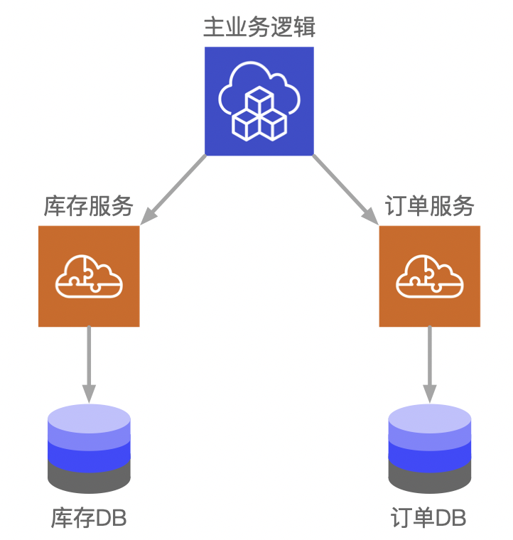

上图中包含了库存和订单两个独立的微服务，每个微服务维护了自己的数据库。在交易系统的业务逻辑中，一个商品在下单之前需要先调用库存服务，进行扣除库存，再调用订单服务，创建订单记录。

正常情况下，两个数据库各自更新成功，两边数据维持着一致性。

但是，在非正常情况下，有可能库存的扣减完成了，随后的订单记录却因为某些原因插入失败。这个时候，两边数据就失去了应有的一致性。

这种时候必须要保证数据的一致性，`单数据源`的一致性依靠`单机事务`来保证，多数据源的一致性就要依靠`分布式事务`。

>什么是分布式事务？

分布式事务用于在`分布式系统`中保证不同节点之间的数据一致性。分布式事务的实现有很多种，最具有代表性的是由`Oracle Tuxedo`系统提出的`XA分布式事务协议`。

XA协议有`两阶段提交（2PC）`和`三阶段提交（3PC）`两种实现，这里我们重点介绍两阶段提交的具体过程。

> 两阶段提交

XA 协议的运作方式，和魔兽世界中的团队协作有些类似，在魔兽世界这款游戏中，副本组团打BOSS的时候，为了更方便队长与队员们之间的协作，队长可以发起一个“就位确认”的操作：当队员收到就位确认提示后，如果已经就位，就选择“是”，如果还没就位，就选择“否”。当队长收到了所有人的就位确认，就会向所有队员们发布消息，告诉他们开始打BOSS。

这个流程和XA分布式事务协议的`两阶段提交`非常相似。

那么XA协议究竟是什么样子呢？在XA协议中包含着两个角色：`事务协调者`和`事务参与者`。来看一看它们之间的交互流程：

**第一阶段**：

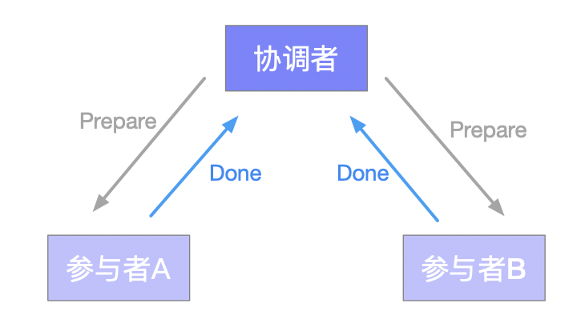

在XA分布式事务的第一阶段，作为事务协调者的节点会首先向所有的参与者节点发送Prepare请求。

在接到Prepare请求之后，每一个参与者节点会各自执行与事务有关的数据更新，写入`Undo Log`和`Redo Log`。如果参与者执行成功，则`暂时不提交事务`，而是向事务协调节点返回“完成”消息。

当事务协调者接到了所有参与者的返回消息，整个分布式事务将会进入第二阶段。

**第二阶段**：

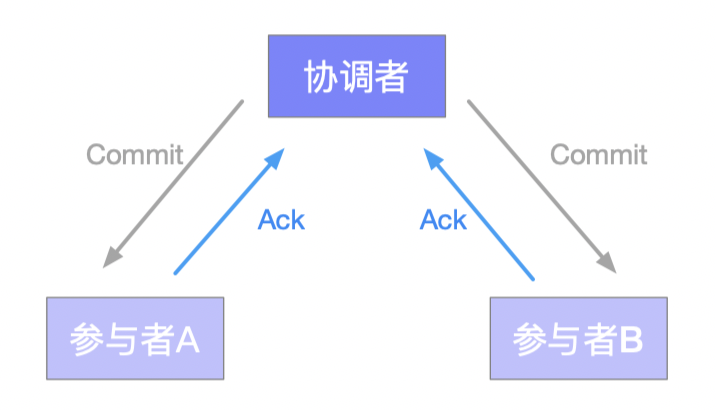

在XA分布式事务的第二阶段，如果事务协调节点在之前所收到的都是正向返回，那么它将会向所有事务参与者发出Commit请求。

接到Commit请求之后，事务参与者节点会各自进行本地的事务提交，`并释放锁资源`。当本地事务完成提交后，将会向事务协调者返回“完成”消息。

当事务协调者接收到所有事务参与者的“完成”反馈，整个分布式事务完成。

**以上所描述的是XA两阶段提交的正向流程，接下来我们看一看失败情况的处理流程**：

**第一阶段**：

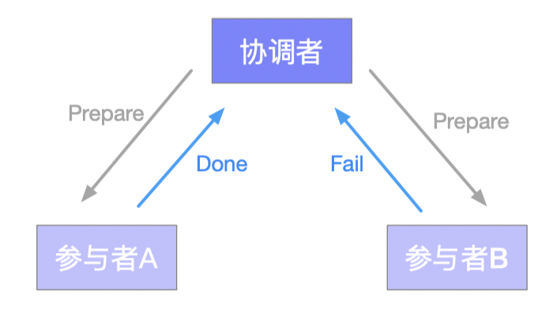

**第二阶段**：

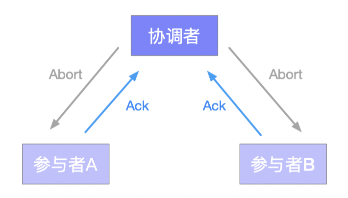

在XA的第一阶段，如果某个事务参与者反馈失败消息，说明该节点的本地事务执行不成功，必须回滚。

于是在第二阶段，事务协调节点向所有的事务参与者发送Abort请求。接收到Abort请求之后，各个事务参与者节点需要在本地进行事务的回滚操作，回滚操作依照`Undo Log`来进行。

以上就是XA两阶段提交协议的详细过程。

> XA两阶段提交协议的不足

XA两阶段提交协议虽然解决了分布式事务的一致性问题，但仍然存在着许多不足之处：

1. **性能问题**

XA协议遵循`强一致性`。在事务执行过程中，各个节点占用着数据库资源，只有当所有节点准备完毕，事务协调者才会通知提交，参与者提交后释放资源。这样的过程有着非常明显的性能问题。

2. **协调者单点故障问题**

事务协调者是整个XA模型的核心，一旦事务协调者节点挂掉，参与者收不到提交或是回滚通知，参与者会一直处于中间状态无法完成事务。

3. **丢失消息导致的不一致问题**

在XA协议的第二个阶段，如果发生局部网络问题，一部分事务参与者收到了提交消息，另一部分事务参与者没收到提交消息，那么就导致了节点之间数据的不一致。

> 解决方案

如果避免XA两阶段提交的种种问题呢？有许多其他的分布式事务方案可供选择：

1. **XA三阶段提交**

XA三阶段提交在两阶段提交的基础上增加了`CanCommit` 阶段，并且引入了`超时机制`。一旦事物参与者迟迟没有接到协调者的 commit 请求，会自动进行`本地 commit`。这样有效解决了`协调者单点故障`的问题。但是性能问题和不一致的问题仍然没有根本解决。

2. **MQ事务**

利用`消息中间件`来`异步`完成事务的后一半更新，实现系统的最终一致性。这个方式避免了像XA协议那样的性能问题。

3. **TCC事务**

TCC事务是`Try、Commit、Cancel`三种指令的缩写，其逻辑模式类似于XA两阶段提交，但是实现方式是在代码层面来人为实现。


## 事务 ACID 属性

>  事务应该具有4个属性：原子性、一致性、隔离性、持久性。这四个属性通常称为ACID特性。

1. **原子性 Atomicity**

事务是最小的执行单位，不允许分割，事务包含的所有操作要么全部成功，要么全部失败回滚。

事务的操作如果成功就必须要完全应用到数据库，如果操作失败则不能对数据库有任何影响

2. **一致性 Consistency**

一致性是指事务必须使`数据库`从一个一致性状态变换到另一个一致性状态，也就是说一个事务执行之前和执行之后都必须处于一致性状态；多个事务对同一个数据`读取`的结果是相同的。

拿转账来说，假设用户A和用户B两者的钱加起来一共是5000，那么不管A和B之间如何转账，转几次账，事务结束后两个用户的钱相加起来应该还得是5000，这就是事务的一致性

3. **隔离性 Isolation**

并发访问数据库时，一个事务的执行不能被其他事务干扰。即一个事务内部的操作及使用的数据对并发的其他事务是隔离的，并发执行的各个事务之间不能互相干扰。

隔离性是当多个用户并发访问数据库时，比如操作同一张表时，数据库为每一个用户开启的事务，不能被其他事务的操作所干扰，多个并发事务之间要相互隔离。

即要达到这么一种效果：对于任意两个并发的事务T1和T2，在事务T1看来，T2要么在T1开始之前就已经结束，要么在T1结束之后才开始，这样每个事务都感觉不到有其他事务在并发地执行。

4. **持久性 Durability**

持久性也称永久性（permanence），指一个事务一旦提交，它对数据库中数据的改变就应该是永久性的，即便是在数据库系统遇到故障的情况下也不会丢失提交事务的操作。


## 事务隔离级别

> 并发事务带来哪些问题？

在典型的应用程序中，多个事务并发运行，经常会操作相同的数据来完成各自的任务（多个用户对同一数据进行操作）。并发虽然是必须的，但可能会导致以下的问题：

1. **更新丢失（Lost Update）**

指在一个事务①读取一个数据时，另外一个事务②也访问了该数据，那么在事务①中修改了这个数据后，事务②也修改了该数据。这样事务①内的修改结果就会被丢失，因此称为`更新丢失`。 

**第一类更新丢失：回滚丢失**

在事务A执行期间，事务B对数据进行了修改，在事务A撤销之后，则两次更新操作都丢失了。

SQL92 没有定义这种现象，标准定义的所有隔离级别都不允许第一类丢失更新发生。

| 时间 |                取款事务A                |            汇款事务B            |
| :--: | :-------------------------------------: | :-----------------------------: |
|  T1  |                开始事务                 |                                 |
|  T2  |                                         |            开始事务             |
|  T3  |         查询账户余额为`1000`￥          |                                 |
|  T4  |                                         |     查询账户余额为`1000`￥      |
|  T5  |                                         | 汇入`100`￥将余额更新为`1100`￥ |
|  T6  |                                         |            提交事务             |
|  T7  |     取出`100`￥将余额更新为`900`￥      |                                 |
|  T8  |                撤销事务                 |                                 |
|  T9  | 余额恢复至事务A刚开始读取的余额`1000`￥ |                                 |

**第二类更新丢失：覆盖丢失/两次更新问题**

在事务B期间，事务A对数据进行了更新；在事务B提交之后，覆盖了事务A已经提交的数据。
第二类丢失更新，实际上和`不可重复读`是同一种问题。

| 时间 |           取款事务A            |            汇款事务B            |
| :--: | :----------------------------: | :-----------------------------: |
|  T1  |            开始事务            |                                 |
|  T2  |                                |            开始事务             |
|  T3  |     查询账户余额为`1000`￥     |                                 |
|  T4  |                                |     查询账户余额为`1000`￥      |
|  T5  | 取出`100`￥将余额更新为`900`￥ |                                 |
|  T6  |            提交事务            |                                 |
|  T7  |                                | 汇入`100`￥将余额更新为`1100`￥ |
|  T8  |                                |            提交事务             |

2. **脏读（Dirty Read）:** 

一个事务中访问到了另一个事务未提交的数据。

当事务①正在访问数据并且对数据进行了修改，而这种修改还没有提交到数据库中，这时另外一个事务②也访问了这个数据，然后使用了这个数据。因为这个数据是事务①还没有提交的数据，那么事务②读到的这个数据就是`“脏数据”`，依据“脏数据”所做的操作可能是不正确的。

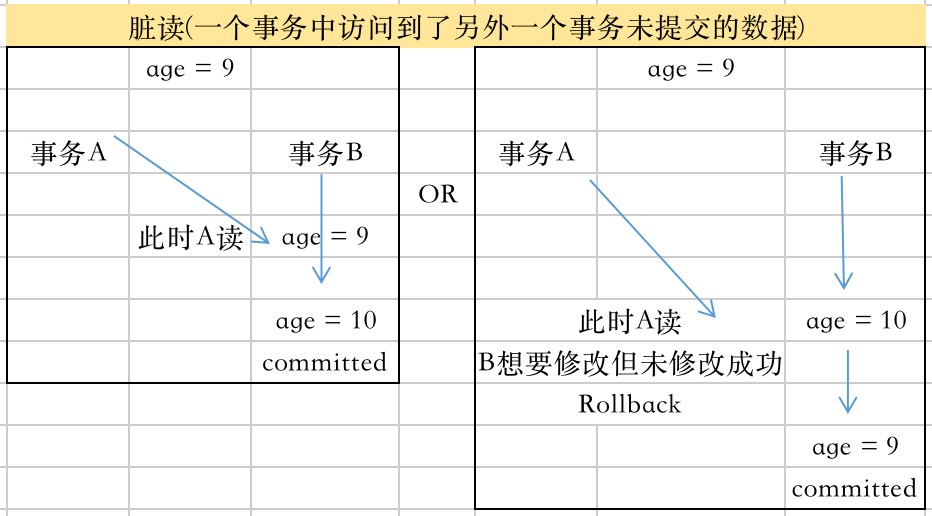

3. **不可重复读（Unrepeatable Read）**

指在事务①内需要多次读取同一数据，在事务①还没有结束时，事务②也访问该数据。那么，在事务①中的两次读数据期间，由于第二个事务的修改导致事务①两次读取的数据可能会不一样。这就发生了在一个事务内两次读到的数据是不一样的情况，因此称为`不可重复读`。

4. **幻读（Phantom Read）** 

幻读与不可重复读类似。

事务①首先根据条件索引得到 N 条数据，然后事务②改变了这 N 条数据之外的 M 条或者增添了 M 条符合事务 A 搜索条件的数据，导致事务 A 再次搜索发现有 N+M 条数据了。事务①发现多了一些原本不存在的记录，就好像发生了幻觉一样，所以称为`幻读`。


> InnoDB 支持的四种事务隔离级别有哪些？

**READ-UNCOMMITTED(读取未提交)：** 最低的隔离级别，允许读取尚未提交的数据变更，可能会导致`脏读、幻读、不可重复读`。

**READ-COMMITTED(读取已提交)：** 允许读取并发事务已经提交的数据，可以防止`脏读`，但是`幻读`或`不可重复读`仍有可能发生。

**REPEATABLE-READ(可重复读)：** 对同一字段的多次读取结果都是一致的，除非数据是被本身事务自己所修改，可以阻止`脏读`和`不可重复读`，但`幻读`仍有可能发生。

**SERIALIZABLE(可串行化)：** 最高的隔离级别，完全服从ACID的隔离级别。所有的事务依次逐个执行，这样事务之间就完全不可能产生干扰，也就是说，该级别可以防止`脏读`、`不可重复读`以及`幻读`。

**总结如下**：

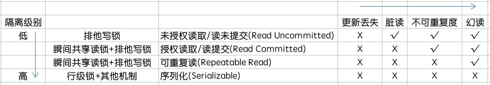

**同上**

|               隔离级别                |          锁           | 更新丢失 | 脏读 | 不可重复读 | 幻读 |
| :-----------------------------------: | :-------------------: | :------: | :--: | :--------: | :--: |
| 读未提交/未授权读取(Read Uncommitted) |       排他写锁        |    X     |  √   |     √      |  √   |
|    读提交/授权读取(Read Committed)    | 瞬间共享读锁+排他写锁 |    X     |  X   |     √      |  √   |
|       可重复读(Repeatable Read)       | 瞬间共享读锁+排他写锁 |    X     |  X   |     X      |  √   |
|         序列化(Serializable)          |    行级锁+其他机制    |    X     |  X   |     X      |  X   |


MySQL InnoDB 存储引擎的默认支持的隔离级别是 **`REPEATABLE-READ（可重复读）`**。

可通过`SELECT @@tx_isolation;`命令来查看

MySQL 8.0 之后改为`SELECT @@transaction_isolation;`

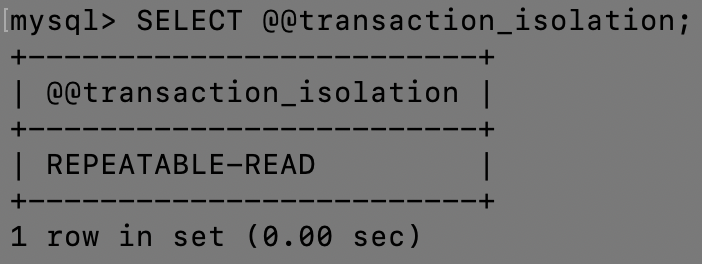

>InnoDB 存储引擎下开启 REPEATABLE-READ（可重复读）可防止幻读

与 SQL 标准不同的地方在于 InnoDB 存储引擎在 `REPEATABLE-READ（可重复读）` 事务隔离级别下使用的是`Next-Key Lock 锁`算法，因此可以避免`幻读`，这与其他数据库系统(如 SQL Server) 是不同的。

所以说 InnoDB 存储引擎的默认支持的隔离级别是 `REPEATABLE-READ（可重复读）` 已经可以完全保证事务的隔离性要求，即达到了 SQL标准的 `SERIALIZABLE(可串行化)` 隔离级别。

因为隔离级别越低，事务请求的锁越少，所以大部分数据库系统的隔离级别都是 `READ-COMMITTED(读提交)` ，但是你要知道 InnoDB 存储引擎默认使用 `REPEAaTABLE-READ（可重复读）` 并不会有任何性能损失。

InnoDB 存储引擎在 `分布式事务` 的情况下一般才会用到 `SERIALIZABLE(可串行化)` 隔离级别。


## MySQL 锁

>MySQL 中有哪几种锁？

`答案`：MyISAM 支持表锁，InnoDB 支持表锁和行锁，默认为行锁

+ 表级锁（table-level locking）：开销小，加锁快，不会出现死锁。锁定粒度大，发生锁冲突的概率最高，并发量最低
+ 行级锁（row-level locking）：开销大，加锁慢，会出现死锁。锁力度小，发生锁冲突的概率小，并发度最高

> 表级锁 vs 行级锁

- **表级锁：** MySQL中锁定 `粒度最大` 的一种锁，对当前操作的整张表加锁，实现简单，资源消耗也比较少，加锁快，`不会出现死锁`。其锁定粒度最大，触发锁冲突的概率最高，并发度最低，MyISAM 和 InnoDB引擎都支持表级锁。
- **行级锁：** MySQL中锁定 `粒度最小` 的一种锁，只针对当前操作的行进行加锁。 行级锁能大大减少数据库操作的冲突。其加锁粒度最小，并发度高，但加锁的`开销也最大`，加锁慢，`会出现死锁`。

详细内容可以参考 MySQL锁机制 简单了解一下：https://blog.csdn.net/qq_34337272/article/details/80611486

> InnoDB 存储引擎的锁的算法有三种：

- **Record lock**：单个行记录上的锁
- **Gap lock**：间隙锁，锁定一个范围，不包括记录本身
- **Next-key lock**：record + gap 锁定一个范围，包含记录本身

**相关知识点：**

1. innodb对于行的查询使用next-key lock
2. Next-locking keying 为了解决 Phantom Problem 幻读问题
3. 当查询的索引含有唯一属性时，将 next-key lock 降级为 record key
4. Gap 锁设计的目的是为了阻止多个事务将记录插入到同一范围内，而这会导致幻读问题的产生
5. 有两种方式显式关闭 gap 锁：（除了外键约束和唯一性检查外，其余情况仅使用record lock） A. 将事务隔离级别设置为RC B. 将参数innodb_locks_unsafe_for_binlog设置为1


## 大表优化

> 当 MySQL 单表记录数过大时，数据库的CRUD性能会明显下降，一些常见的优化措施如下：

1. **限定数据的范围**

	务必禁止不带任何限制数据范围条件的查询语句。

	比如：我们当用户在查询订单历史的时候，我们可以控制在一个月的范围内；

2. **读/写分离**

	经典的数据库拆分方案，主库负责写，从库负责读；

3. **垂直分区**

	根据数据库里面数据表的相关性进行拆分。

	例如：用户表中既有用户的登录信息又有用户的基本信息，可以将用户表拆分成两个单独的表，甚至放到单独的库做分库。

	简单来说垂直拆分是指数据`表列`的拆分，把一张列比较多的表拆分为多张表。 如下图所示，这样来说大家应该就更容易理解了。

	

	**垂直拆分的优点：** 可以使得列数据变小，在查询时减少读取的Block数，减少I/O次数。此外，垂直拆分可以简化表的结构，易于维护。

	**垂直拆分的缺点：** `主键`会出现冗余（如上图中的列1），需要管理冗余列，并会引起Join操作，可以通过在应用层进行Join来解决。此外，垂直分区会让事务变得更加复杂；

4. **水平分区**

	保持数据表结构不变，通过某种策略将存储数据分片。这样每一片数据分散到不同的表或者库中，达到了`分布式`的目的。 水平拆分可以支撑非常大的数据量。

	水平拆分是指数据表`行`的拆分，表的行数超过200万行时，就会变慢，这时可以把一张的表的数据拆成多张表来存放。举个例子：我们可以将用户信息表拆分成多个用户信息表，这样就可以避免单一表数据量过大对性能造成影响。

	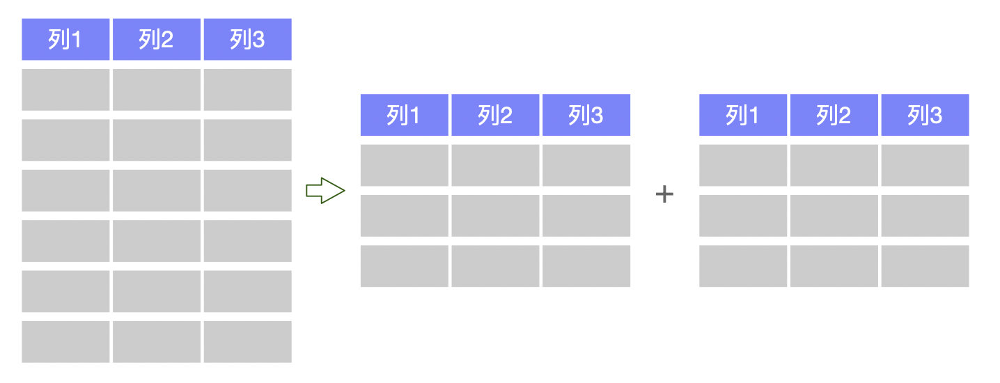

水平拆分可以支持非常大的数据量。需要注意的一点是：分表仅仅是解决了单一表数据过大的问题，但由于表的数据还是在同一台机器上，其实对于提升MySQL并发能力没有什么意义，所以 `水平拆分最好分库` 。

水平拆分能够 `支持非常大的数据量存储，应用端改造也少`，但 `分片事务难以解决` ，跨节点Join性能较差，逻辑复杂。《Java工程师修炼之道》的作者推荐 `尽量不要对数据进行分片，因为拆分会带来逻辑、部署、运维的各种复杂度` ，一般的数据表在优化得当的情况下支撑千万以下的数据量是没有太大问题的。如果实在要分片，尽量选择`客户端分片架构`，这样可以减少一次和中间件的网络I/O。

**下面补充一下数据库分片的两种常见方案：**

- **客户端代理**： 分片逻辑在应用端，封装在jar包中，通过修改或者封装JDBC层来实现。当当网的Sharding-JDBC、阿里的TDDL是两种比较常用的实现。
- **中间件代理**：在应用和数据中间加了一个代理层。分片逻辑统一维护在中间件服务中。我们现在谈的 Mycat、360 的 Atlas、网易的DDB等等都是这种架构的实现。

详细内容可以参考： MySQL大表优化方案: https://segmentfault.com/a/1190000006158186

> 分库分表之后，id 主键如何处理？

`答案就是维护一个全局id`

如果分成多个表之后，每个表都是从 1 开始累加，这样是不对的，我们需要一个全局唯一的 id 来支持。

生成全局 id 有下面这几种方式：

- [UUID](https://baike.baidu.com/item/UUID/5921266?fr=aladdin)：不适合作为主键，因为太长了，并且无序不可读，查询效率低。比较适合用于生成唯一的名字的标示比如文件的名字。
- **数据库自增 id** : 两台数据库分别设置不同步长，生成不重复ID的策略来实现高可用。这种方式生成的 id 有序，但是需要独立部署数据库实例，成本高，还会有性能瓶颈。
- **利用 redis 生成 id :** 性能比较好，灵活方便，不依赖于数据库。但是，引入了新的组件造成系统更加复杂，可用性降低，编码更加复杂，增加了系统成本。
- **Twitter的snowflake算法** ：Github 地址：https://github.com/twitter-archive/snowflake。
- **美团的[Leaf](https://tech.meituan.com/2017/04/21/mt-leaf.html)分布式ID生成系统** ：Leaf 是美团开源的分布式ID生成器，能保证全局唯一性、趋势递增、单调递增、信息安全，里面也提到了几种分布式方案的对比，但也需要依赖关系数据库、Zookeeper等中间件。感觉还不错。美团技术团队的一篇文章：https://tech.meituan.com/2017/04/21/mt-leaf.html 。
- ......


## 数据库连接池

> 池化设计思想

池化设计应该不是一个新名词。我们常见的如 `Java线程池`、`jdbc连接池`、`redis连接池`等就是这类设计的代表实现。

这种设计会`初始预设资源`，解决的问题就是`抵消每次获取资源的消耗`，如`创建线程的开销`、`获取远程连接的开销`等。就好比你去食堂打饭，打饭的大妈会先把饭盛好几份放那里，你来了就直接拿着饭盒加菜即可，不用再临时又盛饭又打菜，效率就高了。

除了初始化资源，池化设计还包括如下这些特征：池子的`初始值`、池子的`活跃值`、池子的`最大值`等，这些特征可以直接映射到`Java线程池`和`数据库连接池`的成员属性中。

这篇文章对[池化设计思想](https://mp.weixin.qq.com/s?__biz=Mzg2OTA0Njk0OA==&mid=2247485679&idx=1&sn=57dbca8c9ad49e1f3968ecff04a4f735&chksm=cea24724f9d5ce3212292fac291234a760c99c0960b5430d714269efe33554730b5f71208582&token=1141994790&lang=zh_CN#rd)介绍得还不错，直接复制过来，避免重复造轮子了。

> 什么是数据库连接池？为什么需要连接池？

数据库连接本质就是一个 `Socket` 的连接。数据库服务端还要维护一些`缓存`和用`户权限信息`之类的，所以占用了一些内存。我们可以把数据库连接池是看做是`维护的数据库连接的缓存`，以便将来需要对数据库的请求时可以重用这些连接。

为每个用户打开和维护数据库连接，尤其是对动态数据库驱动的网站应用程序的请求，既昂贵又浪费资源。在连接池中，创建连接后，将其放置在池中，并再次使用它，因此不必建立新的连接。如果使用了所有连接，则会建立一个新连接并将其添加到池中。 连接池还减少了用户必须等待建立与数据库的连接的时间。


## SQL语句执行流程

[一条SQL语句在MySQL中如何执行的](https://mp.weixin.qq.com/s?__biz=Mzg2OTA0Njk0OA==&mid=2247485097&idx=1&sn=84c89da477b1338bdf3e9fcd65514ac1&chksm=cea24962f9d5c074d8d3ff1ab04ee8f0d6486e3d015cfd783503685986485c11738ccb542ba7&token=79317275&lang=zh_CN#rd)


## MySQL高性能优化规范建议

[MySQL高性能优化规范建议](https://snailclimb.gitee.io/javaguide/#/docs/database/MySQL?id=mysql高性能优化规范建议)


## SQL语句执行慢的原因

[一条SQL语句执行得很慢的原因有哪些？](https://snailclimb.gitee.io/javaguide/#/docs/database/MySQL?id=一条sql语句执行得很慢的原因有哪些？)


## information_schema

> **简介**

`information_schema` 库是MySQL自带的，它提供了访问数据库元数据的方式。

其中保存着关于MySQL服务器所维护的所有其他数据库的信息。如数据库名，数据库的表，表栏的数据类型与访问权限等。在 information_schema 中，有多个只读表。它们实际上是视图，而不是基本表，因此，你将无法看到与之相关的任何文件。

> **information_schema数据库表说明:**

**SCHEMATA表**：提供了当前mysql实例中所有数据库的信息。

+ `show databases`的结果就是取自此表。

**TABLES表**：提供了关于数据库中的表的信息（包括视图）。详细表述了某个表属于哪个schema，表类型，表引擎，创建时间等信息。

+ `show tables from schemaname`的结果则取自此表。

**COLUMNS表**：提供了表中的列信息。详细表述了某张表的所有列以及每个列的信息。

+ `show columns from schemaname.tablename`的结果取自此表。

**STATISTICS表**：提供了关于表索引的信息。

+ `show index from schemaname.tablename`的结果取自此表。

**USER_PRIVILEGES（用户权限）表**：给出了关于全程权限的信息。

+ 该信息源自mysql.user授权表。是非标准表。

**SCHEMA_PRIVILEGES（方案权限）表**：给出了关于方案（数据库）权限的信息。

+ 该信息来自mysql.db授权表。是非标准表。

**TABLE_PRIVILEGES（表权限）表**：给出了关于表权限的信息。

+ 该信息源自mysql.tables_priv授权表。是非标准表。

**COLUMN_PRIVILEGES（列权限）表**：给出了关于列权限的信息。

+ 该信息源自mysql.columns_priv授权表。是非标准表。

**CHARACTER_SETS（字符集）表**：提供了mysql实例可用字符集的信息。

+ `SHOW CHARACTER SET`结果集取自此表。

**COLLATIONS 表**：提供了关于各字符集的对照信息。

**COLLATION_CHARACTER_SET_APPLICABILITY表**：指明了可用于校对的字符集。

+ 这些列等效于SHOW COLLATION的前两个显示字段。

**TABLE_CONSTRAINTS 表**：描述了存在约束的表。以及表的约束类型。

**KEY_COLUMN_USAGE 表**：描述了具有约束的键列。

**ROUTINES 表**：提供了关于存储子程序（存储程序和函数）的信息。

+ 此时，ROUTINES表不包含自定义函数（UDF）。名为“mysql.proc name”的列指明了对应于INFORMATION_SCHEMA.ROUTINES 表的mysql.proc表列。

**VIEWS 表**：给出了关于数据库中的视图的信息。

+ 需要有show views权限，否则无法查看视图信息。

**TRIGGERS 表**：提供了关于触发程序的信息。

+ 必须有super权限才能查看该表


## 临时表？

> 什么是临时表，临时表何时删除？


# COLD

## FLOAT & DOUBLE

> 如何区分 FLOAT 和 DOUBLE ？

`答案`：以下是 FLOAT 和 DOUBLE 的区别

+ 浮点数以 8 位精度存储在 FLOAT 中，并且有四个字节

+ 浮点数存储在 DOUBLE 中，精度为 18 位，有八个字节


## CHAR_LENGTH & LENGTH

>区分 CHAR_LENGTH 和 LENGTH

`答案`：

CHAR_LENGTH 是字符数，而 LENGTH 是字节数。

Latin 字符的这两个数据是相同的，但是对于 Unicode 和其他编码，它们是不同的。


## 数据库的基本结构

数据库的基本结构分三个层次，反映了观察数据库的三种不同角度。

以内模式为框架所组成的数据库叫做物理数据库；以概念模式为框架所组成的数据叫概念数据库；以外模式为框架所组成的数据库叫用户数据库。

1. **物理数据层**。它是数据库的最内层，是物理存贮设备上实际存储的数据的集合。这些数据是原始数据，是用户加工的对象，由内部模式描述的指令操作处理的位串、字符和字组成。

2. **概念数据层**。它是数据库的中间一层，是数据库的整体逻辑表示。指出了每个数据的逻辑定义及数据间的逻辑联系，是存贮记录的集合。它所涉及的是数据库所有对象的逻辑关系，而不是它们的物理情况，是数据库管理员概念下的数据库。

3. **用户数据层**。它是用户所看到和使用的数据库，表示了一个或一些特定用户使用的数据集合，即逻辑记录的集合。数据库不同层次之间的联系是通过映射进行转换的。


## ENUM 的用法

> 在 Mysql 中 ENUM 的用法是什么？

`答案`：

ENUM 是一个字符串对象，用于指定一组预定义的值，并可在创建表时使用。

```mysql
ENUM('Small','Medium','Large');
```


## 如何定义 RegExp

`答案`：

RegExp（正则表达式）

RegExp 是模式匹配，其中匹配模式在搜索值的任何位置


## CHAR & VARCHAR

`答案`：

CHAR 和 VARCHAR 类型在存储和检索方面有所不同

CHAR 列长度固定为创建表时声明的长度，长度值范围是 1 到 255

当 CHAR 值被存储时，它们被用空格填充到特定长度，检索 CHAR 值时需删除尾随空格


## 列的字符串类型

`题目`：列的字符串类型可以是什么？

`答案`：SET、 BLOB、 ENUM、 CHAR、 TEXT、VARCHAR


## Mysql 中的存储引擎

>Mysql 中使用什么存储引擎？

`答案`：

存储引擎称为`表类型`，数据使用各种技术存储在文件中。

技术涉及：Storage、 mechanism、 Locking levels、 Indexing、Capabilities and functions


## Mysql 驱动程序

> Mysql 驱动程序是什么？

`答案`：以下是 Mysql 中可用的驱动程序

+ PHP 驱动程序
+ JDBC 驱动程序
+ ODBC 驱动程序
+ CWRAPPER PYTHON 驱动程序
+ PERL 驱动程序
+ RUBY 驱动程序
+ CAP11PHP 驱动程序


## TIMESTAMP

>TIMESTAMP 在 UPDATE CURRENT_TIMESTAMP 数据类型上做什么？

`答案`：

+ 创建表时 TIMESTAMP 列用 Zero 更新。只要表中的其他字段发生更改，UPDATE CURRENT_TIMESTAMP 修饰符就将时间戳字段更新为当前时间。

> 如果一个表有一列定义为 TIMESTAMP，将发生什么？

`答案`：每当行被更改时，时间戳字段将获取当前时间戳。


## Unix登录 Mysql

> 如何使用 Unix shell 登录 Mysql？

`答案`：

```shell
[mysql dir]/bin/mysql -h hostname -u 
```


## myisamchk

>myisamchk 是用来做什么的？

`答案`：用来压缩 MyISAM 表，这减少了磁盘或内存使用


## 性能分析命令

>MYSQL 数据库服务器性能分析的方法命令有哪些?

`答案`：


## Heap 表

> Heap 表是什么？

`答案`：

HEAP 表存在于内存中，用于临时高速存储

BLOB 或 TEXT 字段是不允许的

只能使用比较运算符=，<，>，=>，= <

HEAP 表不支持 AUTO_INCREMENT (自增)

索引不可为 NULL

> 如何控制 HEAP 表的最大尺寸？

`答案`：Heal 表的大小可通过称为 max_heap_table_size 的 Mysql 配置变量来控制。


## MyISAM Static & MyISAM Dynamic

>MyISAM Static 和 MyISAM Dynamic 有什么区别？

`答案`：

MyISAM Static 上的所有字段都有固定宽度。

MyISAM Dynamic 表具有像 TEXT，BLOB 等字段，以适应不同长度的数据类型。

MyISAM Static 在受损情况下更容易恢复。


## federated 表

>federated 表是什么？

`答案`：federated 表，允许访问位于其他服务器数据库上的表。


## AUTO INCREMENT

`题目`：列设置为 AUTO INCREMENT 时，如果在表中达到最大值，会发生什么情况？

`答案`：它会停止递增，任何进一步的插入都将产生错误，因为密钥已被使用。


## 找出自动增量

>怎样才能找出最后一次插入时分配了哪个自动增量 ？

`答案`：LAST_INSERT_ID 将返回由 Auto_increment 分配的最后一个值，并且不需要指定表名称。


## 所有索引

`题目`：怎么看到为表格定义的所有索引？

`答案`：索引是通过以下方式为表格定义的：

+ ```mysql
  SHOW INDEX FROM
  ```


## LIKE 声明中的％ 和 _

>LIKE 声明中的％和_是什么意思？

`答案`：％对应于 0 个或更多字符，_只是 LIKE 语句中的一个字符。


## Unix & Mysql 时间戳转换

`题目`：如何在 Unix 和 Mysql 时间戳之间进行转换？

`答案`：

+ UNIX_TIMESTAMP 是从 Mysql 时间戳转换为 Unix 时间戳的命令
+ FROM_UNIXTIME 是从 Unix 时间戳转换为 Mysql 时间戳的命令


## 列对比运算符

`题目`：列对比运算符是什么？

`答案`：在 SELECT 语句的列比较中使用 =、<>、<=、<、> =、>、<<、>>、<=>、AND、OR 或 LIKE 运算符。


## 查询影响的行数

`题目`：如何得到受查询影响的行数？

`答案`：

```mysql
SELECT COUNT(user_id) FROM users; 
```


## LIKE 和 RegExp

`题目`：LIKE 和 REGEXP 操作有什么区别？

`答案`：

```mysql
SELECT * FROM employee WHERE emp_name REGEXP "^b"; 
```

```mysql
SELECT * FROM employee WHERE emp_name LIKE "%b"; 
```


## BLOB 和 TEXT 

`题目`：BLOB 和 TEXT 有什么区别？

`答案`：

BLOB 是一个二进制对象，可以容纳可变数量的数据。这几个类型之间的唯一区别是在存储文件的最大大小上不同。有四种类型:
+ TINYBLOB   （最大255字节）
+ BLOB     （最大65k）
+ MEDIUMBLOB     （最大16M）
+ LONGBLOB    （最大4G）

TEXT 是一个不区分大小写的 BLOB。它们对应于四种 BLOB 类型，并具有相同的最大长度和存储要求。四种 TEXT 类型:
+ TINYTEXT
+ TEXT
+ MEDIUMTEXT 
+ LONGTEXT

BLOB 和 TEXT 类型之间的唯一区别在于对 BLOB 值进行排序和比较时区分大小写，对 TEXT 值不区分大小写。


## mysql_fetch_array & mysql_fetch_object

>mysql_fetch_array 和 mysql_fetch_object 的区别

`答案`：

mysql_fetch_array（） - 将**结果行**作为**关联数组**或**来自数据库的常规数组**返回。

mysql_fetch_object  - 从数据库返回结果行作为**对象**。


## mysql 批处理模式

> 如何在 mysql 中运行批处理模式？

`答案`：以下命令用于在批处理模式下运行： 

```mysql
mysql;
mysql mysql.out
```


## MyISAM 表格

> MyISAM 表格将在哪里存储，并且还提供其存储格式？

`答案`：每个 MyISAM 表格以三种格式存储在磁盘上：

+ “.frm”文件存储表定义
+ 数据文件具有“.MYD”（MYData）扩展名
+ 索引文件具有“.MYI”（MYIndex）扩展名


## Mysql 中表格类型

> Mysql 中有哪些不同的表格？

`答案`：共有 5 种类型的表格：

+ MyISAM （Mysql 的默认存储引擎）
+ Heap
+ Merge
+ INNODB 
+ ISAM


## ISAM

>ISAM 是什么？

`答案`：ISAM 简称 **索引顺序访问**方法。由 IBM 开发，用于在磁带等辅助存储系统上存储和检索数据。


## InnoDB

>InnoDB 是什么？

`答案`：lnnoDB 是一个由 Oracle 公司开发的 **Innobase Oy 事务安全存储引擎 **。


## DISTINCT 优化

>Mysql 如何优化 DISTINCT ？

`答案`：DISTINCT 在所有列上转换为 GROUP BY，并与 ORDER BY 子句结合使用。

```mysql
SELECT DISTINCT t1.a FROM t1,t2 where t1.a=t2.a; 
```


## 输入字符为十六进制数字

>如何输入字符为十六进制数字？

`答案`：

+ 如果想输入字符为十六进制数字，可以输入带有单引号的十六进制数字和前缀（X），或者只用（Ox）前缀输入十六进制数字。
+ 如果表达式上下文是字符串，则十六进制数字串将自动转换为字符串。


## 显示前 50 行

>如何显示前 50 行？

`答案`：

```mysql
SELECT*FROM user_table LIMIT 0,50;
```


## 创建索引

>可以使用多少列创建索引？

`答案`：任何标准表最多可以创建 16 个索引列。


## NOW( ) & CURRENT_DATE( )

> NOW( ) 和 CURRENT_DATE( )有 什 么 区 别 ？

`答案`：

+ NOW( ) 命令用于显示当前年份、月份、日期、小时、分钟和秒
+ CURRENT_DATE( )仅显示当前年份、月份和日期


## 可用 CREATE 创建的对象

`题目`：什么样的对象可以使用 CREATE 语句创建？

`答案`：DATABASE 、EVENT 、FUNCTION 、INDEX、PROCEDURE、 TABLE 、TRIGGER、 USER、VIEW


## TRIGGERS

> Mysql 表中允许有多少个 TRIGGERS

`答案`：在 Mysql 表中允许有六个触发器，如下： 

```mysql
BEFORE INSERT
AFTER INSERT
BEFORE UPDATE
AFTER UPDATE
BEFORE DELETE
AFTER DELETE
```


## 非标准字符串类型

> 什么是非标准字符串类型？

`答案`：TINYTEXT、TEXT、MEDIUMTEXT、LONGTEXT


## 通用 SQL 函数

> 什么是通用 SQL 函数？

`答案`：

CONCAT(A, B) - 连接两个字符串值以创建单个字符串输出。通常用于将两个或多个字段合并为一个字段

FORMAT(X, D) - 格式化数字 X 到 D 有效数字

CURRDATE(), CURRTIME() - 返回当前日期或时间

NOW() - 将当前日期和时间作为一个值返回

MONTH()，DAY()，YEAR()，WEEK()，WEEKDAY() - 从日期值中提取给定数据

HOUR()，MINUTE()，SECOND() - 从时间值中提取给定数据

DATEDIFF(A,B) - 确定两个日期之间的差异，通常用于计算年龄

SUBTIMES(A,B) - 确定两次之间的差异

FROMDAYS(INT) - 将整数天数转换为日期值


## 解释访问控制列表

`答案`：

+ ACL（访问控制列表）是与对象关联的权限列表。这个列表是 Mysql 服务器安全模型的基础，它有助于排除用户无法连接的问题
+ Mysql 将 ACL（也称为授权表）缓存在内存中。当用户尝试认证或运行命令时，Mysql 会按照预定的顺序检查 ACL 的认证信息和权限


## 货币字段类型

> mysql 里记录货币用什么字段类型好 ？

`答案`：NUMERIC 和 DECIMAL 类型被 Mysql 实现为同样的类型，这在 SQL92 标准允许。他们被用于保存值，该值的准确精度是极其重要的值，例如与金钱有关的数据。当声明一个类是这些
类型之一时，精度和规模的能被(并且通常是)指定

例如：

```mysql
salary DECIMAL(9,2)
```

在这个例子中，9(precision)代表将被用于存储值的总的小数位数，而 2(scale)代表将被用于存储小数点后的位数

因此，在这种情况下，能被存储在 salary 列中的值的范围是从-9999999.99 到 9999999.99。

在 ANSI/ISO SQL92 中，句法 DECIMAL(p) 等价于 DECIMAL(p,0)

同样，句法 DECIMAL 等价于 DECIMAL(p,0)，这里实现被允许决定值 p

Mysql 当前不支持 DECIMAL/NUMERIC 数据类型的这些变种形式的任一种

这一般说来不是一个严重的问题，因为这些类型的主要益处来自于明显地控制精度和规模的能力。

DECIMAL 和 NUMERIC 值作为字符串存储，而不是作为二进制浮点数，以便保存那些值的小数精度

DECIMAL 和 NUMERIC 值得最大的范围与 DOUBLE 一样，但是对于一个给定的 DECIMAL 或NUMERIC 列，实际的范围可由给定列的 precision 或 scale 限制。

当这样的列赋给了小数点后面的位超过指定 scale 所允许的位的值，该值根据 scale 四舍五入

当一个 DECIMAL 或 NUMERIC 列被赋给了其大小超过指定(或缺省的）precision 和 scale 隐含的范围的值，Mysql 存储表示那个范围的相应的端点值。


## MYSQL 数据表可靠性

>MYSQL 数据表在什么情况下容易损坏？

`答案`：

+ 服务器突然断电导致数据文件损坏

+ 强制关机，没有先关闭 mysql 服务等


## 有关权限的表

>MySQL 有关权限的表都有哪几个？

`答案`：

+ Mysql 服务器通过权限表来控制用户对数据库的访问，权限表存放在 mysql 数据库里，由 mysql_install_db 脚本初始化。
+ 这些权限表分别有 user，db，table_priv，columns_priv 和 host

 