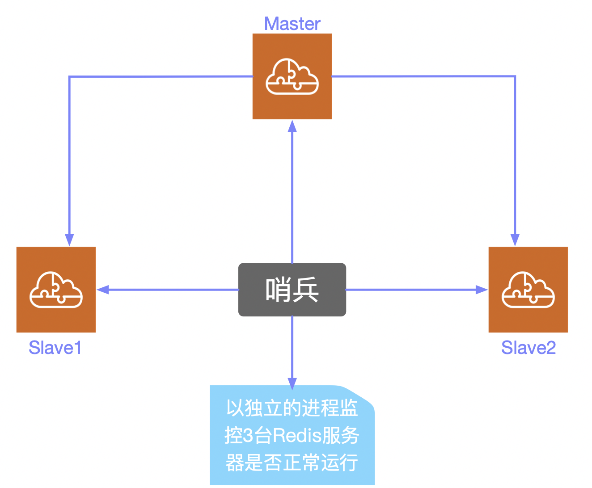
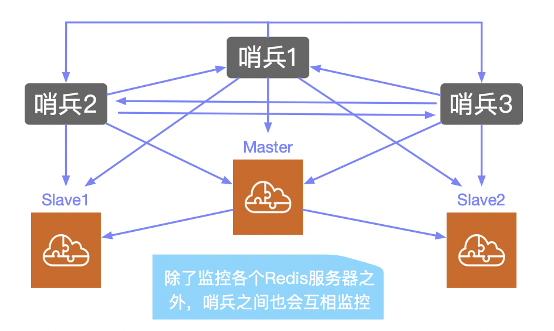
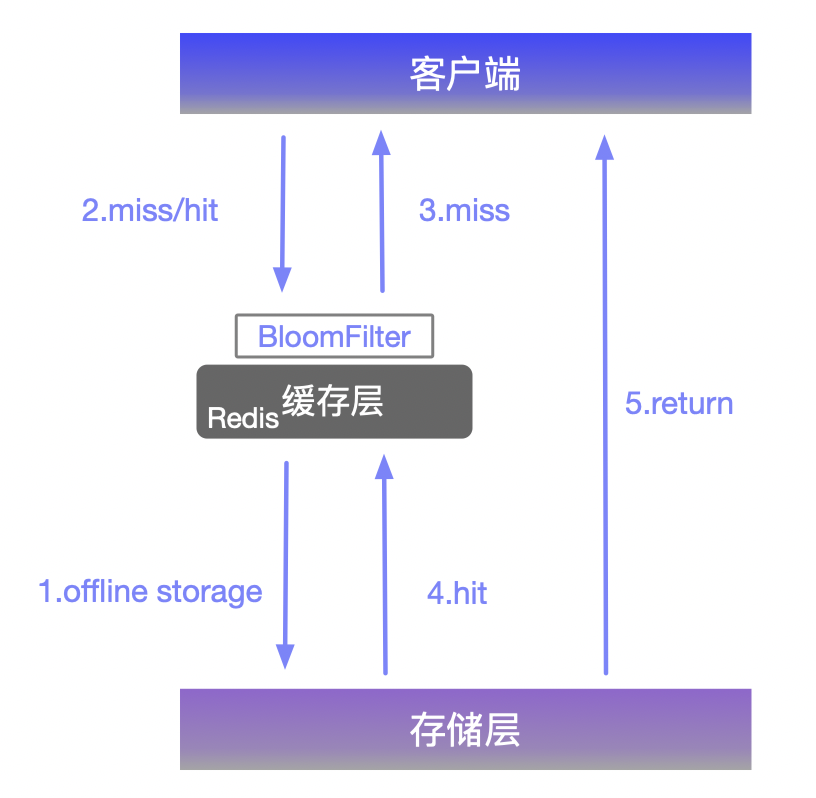
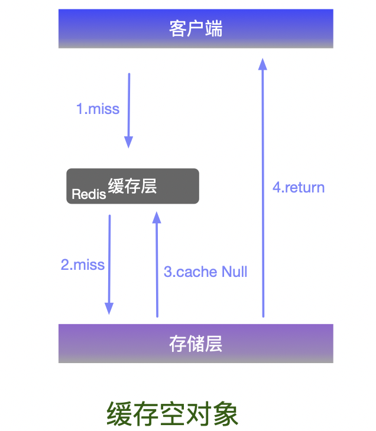
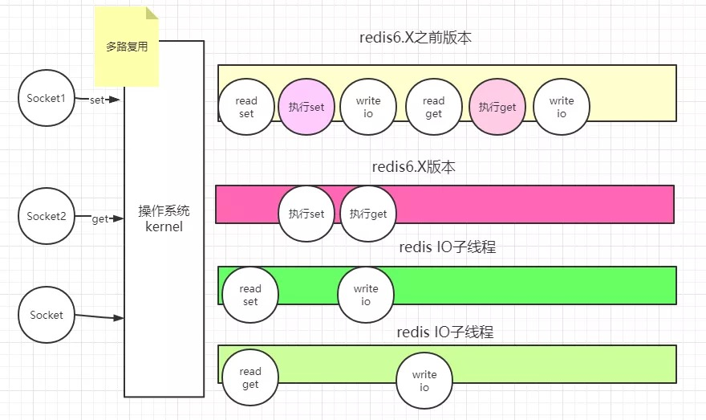

分库分表 + 水平拆分 + MySQL 集群

早期MyISAM：表锁，十分影响效率

转战InnoDB：行锁

逐渐采用分库分表的方式来解决写的压力，MySQL在那个年代提出了表分区


> Redis 的学习重点在于 Redis 的`思想`、`原理`，以及每一种数据结构的用处和`应用场景`

## NoSQL

> 为什么要用NoSQL？

近些年来，MySQL等关系型数据库不够用了，数据量多，变化快。如果用MySQL来存储一些比较大的数据，博客、图片等，数据库表会很大，效率低。如果有一种数据库来专门处理这种数据，那么将会减小MySQL的存储压力。大数据IO的压力下，后期的表结构几乎无法更改。

用户的个人信息、社交网络、地理位置、用户产生的数据、用户日志等等呈爆炸式增长。这时候就需要用NoSQL数据库，NoSQL可以处理以上情况。

NoSQL = Not Only SQL ，泛指`非关系型数据库`。

关系型数据库：表格、行、列

>NoSQL 特点

**解耦**

1. **方便扩展**。数据之间没有关系，很好扩展

2. **大数据量高性能**。Redis可以一秒写8万次，读11万次，NoSQL的缓存记录级，是一种细粒度的缓存，性能很高

3. **数据库是多样型的**。不需要事先设计数据库，随取随用


传统 RDBMS 和 NoSQL

>+ 传统的 RDBMS
>+ 结构化组织
>+ SQL
>+ 数据和关系都存在单独的表中
>+ 操作，数据定义语言
>+ 严格的一致性
>+ 基础的事务

>NoSQL
>
>+ 不仅仅是数据
>+ 没有固定的查询语言
>+ 键值对存储、列存储、文档存储、图形数据库（社交关系）
>+ 最终一致性
>+ CAP 定理 和 BASE （异地多活）
>+ 解决三高：高性能、高可用、高可扩展性

了解：大数据时代的3V+3高

3V：主要是描述问题的。海量Volumn、多样Variety、实时Velocity

3高：主要是对程序的要求。高并发、高可扩（机器不够了，可以随时扩展）、高性能

真正在公司中的实践：NoSQL + RDBMS 一起使用


## 阿里巴巴的架构演进

就像淘宝的一个页面有好多图片、评论等内容，这些东西的实现肯定不仅仅是用MySQL就能实现的。

> 敏捷开发、极限编程

1. 商品的基本信息：名称、价格、商家信息。关系型数据库（MySQL、Oracle 淘宝早年就去IOE了）就可以解决了，但是淘宝内部的 MySQL 已经不是我们平时使用的MySQL了。

2. 商品的描述、评论（文字比较多）。文档型数据库。MongoDB

3. 图片。分布式文件系统 FastDFS淘宝自己的 TFS；Google 的GFS;Hadoop的HDFS；阿里云的OSS

4. 商品的关键字（搜索）。搜索引擎 solr\elasticsearch；ISerach：多隆
5. 商品热门的波段信息。内存数据库；Redis Tair、Memache
6. 商品的交易，外部的支付接口。调用三方应用。

大型互联网应用问题：

+ 数据类型多
+ 数据源多，经常重构
+ 数据要大面积改造


## Redis简介

`Redis` 是 REmote DIctionary Server 远程字典服务器的缩写。

Redis 是一个开源的高性能键值对数据库。它通过提供`多种键值数据类型`来适应不同场景下的存储需求，并借助许多高层级的接口使其可以胜任如`缓存、队列系统`等不同的角色。

它以字典结构存储数据，并允许其他应用通过TCP协议读写字典中的内容。

作为一个缓存数据库，Redis 的目的就是为了解决程序处理速度和访问常规关系型数据库速度不对等的关系。

### Redis数据结构

> 到目前为止Redis支持的键值数据类型如下：


字符串类型 String

散列类型 Hash

列表类型 List

集合类型 Set

有序集合类型 Sorted Set

但是，如果你是Redis中高级用户，而且你要在这次面试中突出你和其他候选人的不同，还需要加上下面几种数据结构 `HyperLogLog、Geo、Pub/Sub`。

如果能答出来 `Redis Module`，像 `BloomFilter、RedisSearch、Redis-ML` 会加分不少。

 [避免缓存穿透的利器之BloomFilter](https://juejin.im/post/5db69365518825645656c0de)


### Why Redis

> 为什么使用Redis？

因为传统的关系型数据库如Mysql已经不能适用所有的场景了，比如`秒杀的库存扣减`，`APP首页的访问流量高峰`等等，都很容易将数据库打崩，所以引入了`缓存中间件`，目前市面上比较常用的缓存中间件有`Redis` 和 `Memcached` 不过中和考虑了它们的优缺点，最后选择了Redis。

[Redis特点、优势、与其他key-value存储的不同——菜鸟教程](https://www.runoob.com/redis/redis-intro.html)

> Redis 与其他 `key - value` 缓存产品相比有以下三个特点：

1. **Redis支持数据的持久化。**Redis不仅仅是一个缓存数据库，还提供了持久化机制。

2. **丰富的数据类型。**Redis不仅仅支持简单的key-value类型的数据，同时还提供`list，set，zset，hash`等数据结构的存储。

3. **Redis支持数据的备份。**即`master-slave`模式的数据备份。

>Redis优势

1. **性能极高**。 Redis能读的速度是110000次/s，写的速度是81000次/s 。

2. **丰富的数据类型**。Redis支持二进制案例的 `Strings`、`Lists`、`Hashes`、`Sets` 及 `Ordered Sets` 数据类型操作。

3. **原子**。 Redis的所有单个操作都是原子性的。多个操作也支持事务，通过`MULTI`和`EXEC`指令包起来。

4. **丰富的特性** Redis还支持 `publish/subscribe`、`通知`、`key过期`等特性。


### Redis & Memcached

通常来说，两者的共同点及区别如下：

> 共同点（不限于以下几点）：

+ **内存数据库**。
+ **分布式**。都支持一主多从。

> 区别（不限于以下几点）：

+ **数据类型**。Redis 不仅仅支持简单的`key/value`类型的数据，同时还提供`list、set、hash`等数据结构的存储

+ **持久化**。Redis支持数据持久化，Memcached不支持持久化。所以Redis支持数据恢复，而Memcached挂掉之后，数据就没了
+ **过期策略**。Memcache 在 set 时就指定，例如`set key 1 0 0 8`，即永不过期。Redis 可以通过 expire 设定，例如`expire name 10`

其中Redis持久化有必要讲一下。

Redis 只会缓存所有的 key 的信息，如果 Redis 发现内存的使用量超过了某一个阀值，将触发`swap`的操作，Redis 根据`swappability = age*log(size_in_memory)`计算出哪些key对应的value需要swap到磁盘。然后再将这些key对应的value持久化到磁盘中，同时在内存中清除。这种特性使得Redis可以保持超过其机器本身内存大小的数据。当然，机器本身的内存必须要能够保持所有的key，毕竟这些数据是不会进行swap操作的。

同时由于Redis将内存中的数据swap到磁盘中的时候，提供服务的主线程和进行swap操作的子线程会共享这部分内存，所以如果更新需要swap的数据，Redis将阻塞这个操作，直到子线程完成swap操作后才可以进行修改。


### Redis & MySQL

> Redis和MySQL这种关系型数据库有什么不同？或者说Redis和MySQL相比有什么优势？

1. **存储结构**

在MySQL中，表与表之间通过另外一张表产生联系，进而表达完整的数据信息，达到查询的目的。而Redis`字典结构`的存储方式和对`多种键值数据类型`的支持使得开发者可以将程序中的数据直接映射到Redis中，数据在Redis中的存储形式和其在程序中的存储方式非常相近。

使用 Redis 的另一个优势是其对不同的数据类型提供了非常方便的操作方式，如使用`集合类型`存储文章标签，Redis可以对标签进行如`交集、并集`这样的集合运算操作。

2. **内存存储与持久化**

Redis数据库中的所有数据都存储在内存中，不过Redis提供了对持久化的支持，即可以将内存中的数据异步写入到硬盘中，同时不影响继续提供服务。

3. **功能丰富**

Redis 虽然是作为数据库开发的，但由于其提供了丰富的功能，越来越多的人将其用作缓存、队列系统等。

Redis可以为每个键设置`生存时间`（Time To Live，TTL），生存时间到期后键会自动被删除。这一功能配合出色的性能让Redis可以作为`缓存系统`来使用。作为缓存系统，Redis还可以`限定数据占用的最大内存空间`，在数据达到空间限制后可以按照一定的规则自动淘汰不需要的键。


## Redis下载安装

安装在 `/usr/local/redis-6.0.5` 目录下


[Mac下Redis下载与安装](https://www.jianshu.com/p/bb7c19c5fc47)

下载地址：[http://redis.io/download](http://redis.io/download)，下载最新稳定版本

```shell
cd redis-6.0.5
make
```

make 完后 redis-6.0.5目录下会出现编译后的 redis 服务程序 redis-server，还有用于测试的客户端程序 redis-cli，两个程序位于安装目录 src 目录下：

下面启动redis服务:

(注意这种方式启动 redis 使用的是默认配置)

```shell
cd src
./redis-server
```

也可以通过启动参数告诉redis使用指定配置文件使用下面命令启动:

```shell
cd src
./redis-server ../redis.conf
```

`redis.conf` 是一个默认的配置文件，我们可以根据需要来使用自己的配置文件。

**Control + C 退出 Redis**


## Redis常用命令

+ 提示： Redis命令不区分大小写，但这里使用大写字母表示Redis命令。

**终端启动，直接输入**：

```shell
redis-server
```

**启动之后新建终端窗口，输入**：

```shell
redis-cli
```

**获得符合规则的键名列表**：

```shell
KEYS pattern
```

pattern支持glob风格通配符格式，具体规则如下：

+  `?` 匹配一个字符

+ `*` 匹配任意个（包括0个）字符

+ `[]` 匹配括号间的任一字符，可以使用 “-” 符号表示一个范围，如 `a[b-d]` 可以匹配“ab”、“ac”、"ad"
+ `\x` 匹配字符 x ，用于转义符号。如要匹配 “?” 就需要使用 \?


**添加/设置** 

+ `key = "bar"，value = 1`

```shell
SET bar 1
```


**查询所有的键**：

```shell
KEYS *
```

注意 KEYS命令需要遍历Redis中的所有键，当键的数量较多时会影响性能，不建议在生产环境中使用。


**用通配符查询多个键**：

+ 例如查询以 user 开头的键

```shell
KEYS user*
```


**判断一个键是否存在**：

```shell
EXISTS key
```

如果键存在则返回整数类型1，否则返回0


**删除键**

+ 可以删除一个或多个键，返回值是删除的键的个数

删除一个键：

```shell
DEL key
```

删除多个键：

```shell
DEL user01 \n user02
```


**注意：DEL命令的参数不支持通配符**

+ 但我们可以结合Linux的管道和xargs命令自己实现删除所有符合规则的键。

比如要删除所有以 “user:” 开头的键，就可以执行：

```shell
redis-cli KEYS "user:＊" | xargsredis-cli DEL
```


**获得键的数据类型**：

```shell
TYPE key
```


**LPUSH命令**

LPUSH命令的作用是向指定的「列表类型」键中增加一个元素，如果键不存在则创建它

+ 比如下面的操作：

+ ```shell
  LPUSH userList hory
  ```

+ 这个  `userList` 键的类型是一个list，该操作的意思是向  userList 这个 list 类型的键中增加一个元素 hory，而不是 userList 键所对应的 value 是 hory

如果设置 userList 键所对应的 value，应该使用SET命令：

```shell
SET userList hr
```


## String 字符串类型

字符串类型是Redis中最基本的数据类型，它能存储任何形式的字符串，包括二进制数据。

字符串类型是其他4种数据类型的基础，其他数据类型和字符串类型的差别从某种角度来说只是组织字符串的形式不同。

+ 例如，列表类型是以列表的形式组织字符串，而集合类型是以集合的形式组织字符串。

**INCR命令**

前面说过字符串类型可以存储任何形式的字符串，当存储的字符串是整数形式时，Redis提供了一个实用的命令INCR，其作用是让当前键值递增，并返回递增后的值。

+  比如现在有一个 user 键，其对应的value为1，执行如下命令：

```shell
INCR user
```

+  value为1自增之后变为2，结果返回2

如果不存在 user 键，则会默认其 value 为 0，执行 INCR user 之后，创建user键，同时返回自增后的 value 为1

当 value 不是整数时Redis会提示错误：`(error) ERR value is not an integer or out of range`


## List 列表类型


## Hash 哈希类型


## Zset 有序集合


## Geospatial 地理位置


## Hyperloglog 基数统计

> 什么是基数？

在 `Redis 2.8.9` 版本更新了 Hyperloglog 数据结构

Redis Hyperloglog 是做`基数统计`的算法，

网页的 UV (一个人访问一个网站多次，但还是一个人)

传统的方式：set 保存用户的 ID

+ 这种方式如果保存大量的用户 ID 就会比较麻烦，我们的目的是为了计数，而不是保存用户 ID


> Hyperloglog 的优点：

占用内存是固定的，`2^64`个不同的元素的技术，只需要 12KB 内存

0.81% 的错误率，统计 UV 任务可以忽略不计

```bash
PFADD mykey a b c d e f      # 创建一组元素mykey
PFCOUNT mykey
PFMERGE mykey3 mykey1 mykey2 # 将 mykey1 mykey2合并到 mykey3
```

如果允许容错，那么一定可以使用 Hyperloglog，否则，就使用 set 或者自己的数据类型。


## Bitmaps 位图场景

> 位存储

统计用户信息：活跃/不活跃，登录/未登录，打卡/365打卡

这种两个状态的都可以使用 Bitmaps 位图数据结构，通过操作二进制位来进行记录，只有 0 和 1 两个状态。

365 天 = 365 bit，1 字节 = 8 bit，只需 46 个字节左右。

比如一周有7天，分别用 0，1，2，3，4，5，6 代表周几，那么 打卡/不打卡 就可以用 1/0 代替

```bash
setbit sign 0 1
setbit sign 1 1
setbit sign 2 0
setbit sign 3 1
setbit sign 4 1
setbit sign 5 0
setbit sign 6 0
```

```bash
getbit sign 3  # 查看周四有没有打卡
bitcount sign  # 查看有几天打卡（可以在后面添加参数选择查看的范围），可以判断是否全勤
```


## Redis 基本事务操作

MySQL:ACID

事务：一组命令要么全部执行，要么全部不执行。一个事务中的所有命令都会被序列化，在事务执行过程中，会按照顺序执行。一次性、顺序性、排他性（执行的过程中不允许被干扰）

`Redis 单条命令是保证原子性的，但是Redis的事务不保证原子性。`

`Redis事务没有隔离级别的概念。`

`所有的命令在事务中并没有直接被执行。`


Redis 事务（transaction）：

事务同命令一样，都是 Redis 最小的执行单位，

+ 开启事务

```bash
multi
```

+ 命令入队（开启事务之后所敲的一系列操作，会将其放入事务的 QUEUE 中）
+ 取消事务

```bash
discard
```


+ 执行事务

```bash
exec
```

中间取消事务

```bash
multi
set k1 v1
set k2 v2
set k3 v3
DISCARD    # 放弃事务
```

> 编译型异常（代码有错，命令有错），事务中所有命令都不会别执行


> 运行时异常（1/0），如果事务队列中存在语法性，那么执行命令的时候，其他命令是可以正常执行，错误命令抛出异常

比如在 MySQL 中，一个账户扣钱，往一个人账户里加钱，这个事务是原子性的，不会出现一个账户扣完钱了而另一个账户没有加上钱的情况。

而由于 Redis 不能保证事务的原子性，所以这种情况在 Redis 中是有可能出现的。


## Redis 实现乐观锁

> Redis 监视测试

```bash
set money 100
set out 0

watch money     # 监视 money 对象

multi # 事务正常
DECRBY money 20
INCRBY out 20
exec  # 事务执行成功后，监控会自动取消
# money 80
# out 20
```

> watch 的 key 是对整个连接有效的，事务也一样，如果连接断开，监视和事务都会别自动清除。
>
> 当然 exec、discard、unwatch 命令都会清除连接中的所有监视。


如果事务开启且做了一些操作之后，在事务关闭关闭之前，有另一个线程对 money 做操作，则事务关闭的时候就不会成功，如下：

线程① ：

```bash
watch money
multi
DECRBY money 10
INCRBY out 10
# 在这个时间段里线程 ② 执行了相应操作
# 此时再执行 exec则不会成功
```

线程② ：

```bash
get money
set money 1000
```

线程 ② 在此期间修改了money为1000，此时 watch 监视到 money 被修改，告诉线程① 的事务，money 已经被修改，该事务的提交一定会失败。

`watch 这里就是一个乐观锁`

如果发现事务执行失败，就先解锁，解锁完之后再次获取锁，然后再次创建事务

```bash
UNWATCH  # 解锁
WATCH money  # 再次监视
multi
DECRBY money 50
INCRby out 50
exec  # 比对监视的值是否发生变化，如果没有变化，则可以执行成功
```


## Jedis/Redisson/Lettuce

[Redis的三个客户端框架比较：Jedis、Redisson、Lettuce](https://www.cnblogs.com/liyan492/p/9858548.html)


## Jedis

[Jedis使用教程完整版](https://www.jianshu.com/p/a1038eed6d44)

> **概述**

[Jedis](https://link.jianshu.com?t=https://github.com/xetorthio/jedis)是Redis官方推荐的Java连接开发工具。要在Java开发中使用好Redis中间件，必须对Jedis熟悉才能写成漂亮的代码。

另外，Spring也提供了`Spring-data-redis`包来整合Jedis的操作，另外Spring也单独封装了Jedis。

> **基本使用**

**导入 Jar 包**：

```xml
<dependency>
    <groupId>redis.clients</groupId>
    <artifactId>jedis</artifactId>
</dependency>
```

Jedis的基本使用非常简单，只需要创建Jedis对象的时候指定 host、port、password 即可。当然，Jedis对象有很多构造方法，都大同小异，只是对应和Redis连接的socket的参数不一样而已。

```java
Jedis jedis = new Jedis("localhost", 6379);  //指定Redis服务Host和port
jedis.auth("xxxx");                 //如果Redis服务连接需要密码，指定密码
String value = jedis.get("key");    //访问Redis服务
jedis.close();                      //使用完关闭连接
```

Jedis基本使用十分简单，在每次使用时，构建Jedis对象即可。在Jedis对象构建好之后，Jedis底层会打开一条Socket通道和Redis服务进行连接。所以在使用完Jedis对象之后，需要调用`Jedis.close()`方法关闭连接，不然会占用系统资源。

+ 当然，如果应用非常平凡地创建和销毁Jedis对象，对应用的性能是有很大影响的，因为构建Socket的通道是很耗时的(类似数据库连接)。
+ 我们应该`使用连接池来减少Socket对象的创建和销毁过程`。

> **连接池使用**

Jedis连接池是基于 apache-commons pool2 实现的。在构建连接池对象的时候，需要提供池对象的配置对象，即`JedisPoolConfig`(继承自GenericObjectPoolConfig)。我们可以通过这个配置对象对连接池进行相关参数的配置(如最大连接数，最大空数等)。

```java
JedisPoolConfig config = new JedisPoolConfig();
config.setMaxIdle(8);
config.setMaxTotal(18);

JedisPool pool = new JedisPool(config, "127.0.0.1", 6379, 2000, "password");
Jedis jedis = pool.getResource();
String value = jedis.get("key");
......
jedis.close();
pool.close();
```

使用Jedis连接池之后，在每次用完连接对象后一定要记得把连接归还给连接池。

+ Jedis对`close()`方法进行了改造，如果是连接池中的连接对象，调用`close()`方法将会把连接对象返回给对象池，若不是关闭连接。可以查看如下代码：

```java
@Override
public void close() {              // Jedis的close方法
    if (dataSource != null) {
        if (client.isBroken()) {
            this.dataSource.returnBrokenResource(this);
        } else {
            this.dataSource.returnResource(this);
        }
    } else {
        client.close();
    }
}

// 另外从对象池中获取Jedis链接时，将会对dataSource进行设置
// JedisPool.getResource()方法
public Jedis getResource() {
    Jedis jedis = super.getResource();   
    jedis.setDataSource(this);
    return jedis;
}
```

> **高可用连接**

我们知道，连接池可以大大提高应用访问Reids服务的性能，减去大量的Socket的创建和销毁过程。但是Redis为了保障高可用，服务一般都是Sentinel部署方式（详情见[Redis Sentinel](https://www.jianshu.com/p/cbd40a188226)）。当Redis服务中的主服务挂掉之后，会仲裁出另外一台Slave服务充当Master。这个时候，我们的应用即便使用了Jedis连接池，Master服务挂了，我们的应用将还是无法连接新的Master服务。

为了解决这个问题，Jedis也提供了相应的Sentinel实现，能够在Redis Sentinel主从切换时候，通知我们的应用，把我们的应用连接到新的 Master服务。

+ 注意：Jedis版本必须2.4.2或更新版本

```java
Set<String> sentinels = new HashSet<>();
sentinels.add("172.18.18.207:26379");
sentinels.add("172.18.18.208:26379");
JedisPoolConfig config = new JedisPoolConfig();
config.setMaxIdle(5);
config.setMaxTotal(20);
JedisSentinelPool pool = new JedisSentinelPool("mymaster", sentinels, config);
Jedis jedis = pool.getResource();
jedis.set("jedis", "jedis");
......
jedis.close();
pool.close();
```

Jedis Sentinel的使用也是十分简单的，只是在JedisPool中添加了Sentinel和MasterName参数。Jedis Sentinel底层基于Redis订阅实现Redis主从服务的切换通知。当Reids发生主从切换时，Sentinel会发送通知主动通知Jedis进行连接的切换。JedisSentinelPool在每次从连接池中获取连接对象的时候，都要对连接对象进行检测，如果此连接和Sentinel的Master服务连接参数不一致，则会关闭此连接，重新获取新的Jedis连接对象。

```java
public Jedis getResource() {
    while (true) {
        Jedis jedis = super.getResource();
        jedis.setDataSource(this);

        // get a reference because it can change concurrently
        final HostAndPort master = currentHostMaster;
        final HostAndPort connection = new HostAndPort(jedis.getClient().getHost(), jedis.getClient().getPort());
        if (master.equals(connection)) {
            // connected to the correct master
            return jedis;
        } else {
            returnBrokenResource(jedis);
        }
    }
}
```

当然，JedisSentinelPool对象要实时监控RedisSentinel的主从切换。在其内部通过Reids的订阅实现。具体的实现看JedisSentinelPool的两个方法就很清晰。

```java
private HostAndPort initSentinels(Set<String> sentinels, final String masterName) {
    HostAndPort master = null;
    boolean sentinelAvailable = false;
    log.info("Trying to find master from available Sentinels...");
    for (String sentinel : sentinels) {
        final HostAndPort hap = HostAndPort.parseString(sentinel);
        log.fine("Connecting to Sentinel " + hap);
        Jedis jedis = null;
        try {
            jedis = new Jedis(hap.getHost(), hap.getPort());
            //从RedisSentinel中获取Master信息
            List<String> masterAddr = jedis.sentinelGetMasterAddrByName(masterName);
            sentinelAvailable = true; // connected to sentinel...
            if (masterAddr == null || masterAddr.size() != 2) {
                log.warning("Can not get master addr, master name: " + masterName + ". Sentinel: " + hap + ".");
                continue;
            }
            master = toHostAndPort(masterAddr);
            log.fine("Found Redis master at " + master);
            break;
        } catch (JedisException e) {
            // it should handle JedisException there's another chance of raising JedisDataException
            log.warning("Cannot get master address from sentinel running @ " + hap + ". Reason: " + e + ". Trying next one.");
        } finally {
            if (jedis != null) {
                jedis.close();
            }
        }
    }
    if (master == null) {
        if (sentinelAvailable) {
            // can connect to sentinel, but master name seems to not monitored
            throw new JedisException("Can connect to sentinel, but " + masterName + " seems to be not monitored...");
        } else {
            throw new JedisConnectionException("All sentinels down, cannot determine where is " + masterName + " master is running...");
        }
    }
    log.info("Redis master running at " + master + ", starting Sentinel listeners...");
    //启动后台线程监控RedisSentinal的主从切换通知
    for (String sentinel : sentinels) {
        final HostAndPort hap = HostAndPort.parseString(sentinel);
        MasterListener masterListener = new MasterListener(masterName, hap.getHost(), hap.getPort());
        // whether MasterListener threads are alive or not, process can be stopped
        masterListener.setDaemon(true);
        masterListeners.add(masterListener);
        masterListener.start();
    }
    return master;
}


private void initPool(HostAndPort master) {
    if (!master.equals(currentHostMaster)) {
        currentHostMaster = master;
        if (factory == null) {
            factory = new JedisFactory(master.getHost(), master.getPort(), connectionTimeout, soTimeout, password, database, clientName, false, null, null, null);
            initPool(poolConfig, factory);
        } else {
            factory.setHostAndPort(currentHostMaster);
            // although we clear the pool, we still have to check the returned object
            // in getResource, this call only clears idle instances, not
            // borrowed instances
            internalPool.clear();
        }
        log.info("Created JedisPool to master at " + master);
    }
}
```

可以看到，JedisSentinel 的监控时使用MasterListener这个对象来实现。看对应源码可以发现是基于Redis的订阅实现的，其订阅频道为"+switch-master"。当MasterListener接收到switch-master消息时候，会使用新的Host和port进行initPool。这样对连接池中的连接对象清除，重新创建新的连接指向新的Master服务。

> **客户端分片**

对于大应用来说，单台Redis服务器肯定满足不了应用的需求。在Redis3.0之前，是不支持集群的。如果要使用多台Reids服务器，必须采用其他方式。很多公司使用了代理方式来解决Redis集群。

对于Jedis，也提供了客户端分片的模式来连接“Redis集群”。其内部是采用`Key的一致性hash算法`来区分key存储在哪个Redis实例上的。

```java
JedisPoolConfig config = new JedisPoolConfig();
config.setMaxTotal(500);
config.setTestOnBorrow(true);
List<JedisShardInfo> jdsInfoList = new ArrayList<>(2);
jdsInfoList.add(new JedisShardInfo("192.168.2.128", 6379));
jdsInfoList.add(new JedisShardInfo("192.168.2.108", 6379));
pool = new ShardedJedisPool(config, jdsInfoList, Hashing.MURMUR_HASH, Sharded.DEFAULT_KEY_TAG_PATTERN);
jds.set(key, value);
......
jds.close();
pool.close();
```

当然，采用这种方式也存在两个问题：

1. **扩容问题**

	因为使用了一致性哈稀进行分片，那么不同的key会分布到不同的Redis-Server上，当我们需要扩容时，需要增加机器到分片列表中，这时候会使得同样的key算出来落到跟原来不同的机器上，这样如果要取某一个值，会出现取不到的情况。

2. **单点故障问题**

	当集群中的某一台服务挂掉之后，客户端在根据一致性 hash 无法从这台服务器取数据。

**解决方法**：

+ 对于扩容问题，Redis的作者提出了一种名为Pre-Sharding的方式。即事先部署足够多的Redis服务。
+ 对于单点故障问题，我们可以使用Redis的HA高可用来实现。利用Redis-Sentinal来通知主从服务的切换。当然，Jedis没有实现这块。


> 通过 Jedis 再次理解事务

```java
public class TestTX{
  	Jedis jedis = new Jedis("ip",Redis端口号);
  	JSONObject jsonObject = new JSONObject();
  	jsonObject.put("hello","world");
 	 	jsonObject.put("hell","wo");
  
  	// 开启事务
  	Transaction multi = jedis.multi();
  	String result = jsonObject.toJSONString();
  
  	try{
      	multi.set("user1",result);
      	multi.set("user2",result);
      
      	multi.exec();
    } catch (Exception e){
      	multi.discard();
      	e.printStrackTrace();
    } finally {
      	System .out.println(jedis.get("user1"));
    	  System .out.println(jedis.get("user2"));
      	jedis.close();
    }
  	jedis.close();
}
```

## Spring-data-redis

> `spring-data-redis`与`jedis`的区别

[原文](https://blog.csdn.net/houpeibin2012/article/details/104364826)

Spring Data Redis目前支持两种驱动：`Jedis` 和 `Lettuce`，可以看成是这两种驱动的统一封装，以高度统一的形式屏蔽了底层驱动的操作细节，向用户提供一种统一的API。


## Spring Boot 整合

SpringBoot 操作数据：Spring-data \ JPA \ JDBC \ mongoDB \ Redis

SpringData 也是和 SpringBoot 齐名的项目

说明：在 SpringBoot2.X 之后，原来使用的 Jedis 被替换为了 `lettuce`

> Jedis：采用的是直连，多个线程操作的话，是不安全的，如果想要避免，需要使用 Jedis pool 连接池。更像BIO模式
>
> lettuce：采用 netty ，实例可以在多个线程池中共享，不存在线程不安全的情况，可以减少线程数据，更像 NIO 模式

SpringBoot 所有配置类，都有一个自动配置类。

lettuce 用 RedisTemplate 来实现对 Redis 的操作。


```java
class User implements Serializable{ //实现序列化接口
  	private String name;
  	private int age;
}
```

```java
@SpringBootTest 
class Redis02SpringBootApplicationTests{
  	@Autowired
  	private RedisTemplate redisTemplate;
  	
  	@Test
  	public void test() throws JsonProcessingException{
      	//真实的开发中一般只用 Json 来传递对象
      	User user = new User("hory",25);
      	//对象需要序列化
      	String jsonUser = new ObjectMapper().writeValueAsString(user);
      	redisTemplate.opsForValue().set("user",jsonUser);
    }
}
```


默认的序列化方式 JDK 的序列化，我们也可以自己配置序列化方式

```java
@Configuration
public class RedisConfig {
  	//编写我们自己的 redisTemplate
  	@Bean
  	public RedisTemplate<String,Object>redisTemplate(RedisConnectionFactory redisConnectionFactory) throws UnkonwHostException{
      	RedisTemplate<String,Object> template = new RedisTemplate();
      
      
      	Jackson2JsonRedisSerializer<Object> objectJackson2JsonRedisSerializer = new Jackson2JsonRedisSerializer<Object>();
      	//配置具体的序列化方式
      	template.setKeySerializer(objectJackson2JsonRedisSerializer);

      	template.setConnectionFactory(redisConnectionFactory);
      	return template;
    }
  	
}
```


## Redis.conf 详解

`include /path/to/local.conf`  可以将其他的配置文件包含进来


> 网络配置

`bind 127.0.0.1`   # 绑定的 ip

`protected-mode yes`  # 保护模式

`port 6379`   # 端口设置

> 通用 GENERAL

```bash
daemonize yes  # 以守护进程的方式运行，默认是 no，我们需要自己开启为 yes
supervised no  # 用来管理守护进程

pidfile /var/run/redis_6379.pid # 如果以后台的方式运行，我们需要制定一个 pid 文件

loglevel notice
logfile "" # 日志的文件位置名
database 16 # 默认的数据库的数量，默认16个
always-show-logo yes  # 是否总是显示LOGO
```

> 快照

持久化：在规定的时间内执行了多少次操作，则会持久化到 .rdb .aof

```bash
save 900 1   # 900秒内，如果至少有一个 key 进行了修改，就会进行持久化操作
save 300 10
save 60 10000

stop-writes-on-bgsave-error yes  # 持久化出错是否还要继续工作（一般是开启的）
rdbcompression yes # 是否压缩 rdb 文件（rdb即持久化文件），需要消耗一些 CPU 资源
rdbchecksum yes  # 保存rdb文件的时候，进行错误的检查校验
dir ./ # rdb文件保存的目录
```


> 安全 SECURITY 

```bash
requirepass 151869 # 设置密码(默认没有密码)
```

也可以在终端设置

```shell
config get requirepass
config set requirepass "151869"
```

设置密码密码就需要登录：

```shell
auth 151869  
```


> 限制 CLIENTS

```bash
maxclients 10000 # 能连上 Redis 的最大客户端的数量
maxmemory <bytes> # Redis 配置最大的内存容量
maxmemory-policy noeviction # 内存到达上限之后的处理策略
```


`redis 设置过期Key 的 maxmemory-policy 六种方式`

1. volatile-lru：只对设置了过期时间的 key 进行 LRU（默认值） 

2. allkeys-lru ： 删除lru算法的key  

3. volatile-random：随机删除即将过期key  

4. allkeys-random：随机删除  

5. volatile-ttl ： 删除即将过期的  

6. noeviction ： 永不过期，返回错误


> APPEND ONLY 模式 aof 配置

```bash
appendonly  no  # 默认不是开启 aof 模式的，默认使用 rdb 方式持久化的，在大部分所有的情况下
appendfilename "appendonly.aof"  # 持久化文件名

# appendsync always  # 每次修改都会同步，消耗性能
appendfsync everysec # 每秒执行一次 sync，可能会丢失这1秒的数据
appendfsync no       # 不执行 sync，此时操作系统自己同步数据，速度最快
```

具体的配置在后面的 `Redis 持久化`


## RDB & AOF

Redis 不同于 Memcached 的很重要一点就是，Redis 支持持久化，而且支持两种不同的持久化操作：

+ `快照（snapshotting，RDB）`
+ `只追加文件（append-only file, AOF）`

### **前沿知识**

> **数据库在进行写操作时主要有下面五个过程**： 


1. 客户端向服务端发送写操作（此时数据在客户端的内存中）
2. 数据库服务端接收到写请求的数据（数据在服务端的内存中）
3. 服务端调用`write`这个系统调用，将数据往磁盘上写（数据在系统内存的缓冲区中）
4. 操作系统将缓冲区中的数据转移到磁盘控制器上（数据在磁盘缓存中）
5. 磁盘控制器将数据写到磁盘的物理介质中（数据真正落到磁盘上）

**结合上面的5个流程看一下各种级别的故障**： 

1. 当`数据库系统故障`时，但是操作系统还可以继续工作。那么此时只要执行`完`第3步（数据就已经不在内存中了），那么数据就是安全的，因为操作系统会来完成后面几步，保证数据最终会落到磁盘上。

2. 当`断电`时，上面5项中提到的所有`缓存`都会失效，并且数据库和操作系统都会停止工作。所以只有当数据在完成第5步后（在磁盘上），才能保证在断电后数据不丢失。

**通过上面5步的了解，可能我们会希望搞清下面一些问题**： 

1. 数据库多长时间调用一次write，将数据写到内核缓冲区？

2. 内核多长时间会将内核缓冲区中的数据写到磁盘控制器？
3. 磁盘控制器又在什么时候把缓存中的数据写到物理介质上？

对于第一个问题，通常数据库层面会进行全面控制。

对于第二个问题，操作系统有其默认的策略，但是我们也可以通过POSIX API提供的fsync系列命令强制操作系统将数据从内核区写到磁盘控制器上。

对于第三个问题，好像数据库已经无法触及，但实际上，大多数情况下磁盘缓存是被设置关闭的，或者是只开启为读缓存，也就是说写操作不会进行缓存，而是直接写到磁盘。

+ 建议的做法是仅仅磁盘设备有备用电池时才会开启写缓存。

> **数据损坏** 

所谓数据损坏，就是数据无法恢复，上面讲的都是如何保证数据是确实写到磁盘上去，但是写到磁盘上可能并不意味着数据不会损坏。比如一次写请求会进行两次不同的写操作，当意外发生时，可能会导致一次写操作安全完成，但是另一次还没有进行。如果数据库的数据文件结构组织不合理，可能就会导致数据完全不能恢复的状况出现。 

**通常有三种策略来组织数据，以防止数据文件损坏到无法恢复的情况**： 

1. 第一种是最粗糙的处理，就是不通过数据的组织形式保证数据的可恢复性。而是通过配置数据同步备份的方式，在数据文件损坏后通过数据备份来进行恢复。实际上MongoDB在不开启操作日志，通过配置Replica Sets时就是这种情况。
2. 另一种是在上面基础上添加一个`操作日志`，每次操作时记一下操作的行为，这样我们可以通过操作日志来进行数据恢复。`因为操作日志是顺序追加的方式写的，所以不会出现操作日志也无法恢复的情况。`这也类似于MongoDB开启了操作日志的情况。
3. 更保险的做法是数据库不进行旧数据的修改，只是以追加方式去完成写操作，这样数据本身就是一份日志，这样就永远不会出现数据无法恢复的情况了。实际上CouchDB就是此做法的优秀范例。

### 持久化-RDB*

**快照**：在指定的时间间隔内，将内存中的`数据集快照`写入磁盘，当恢复（Redis启动）时，将快照文件直接读到内存中。

快照，顾名思义可以理解为拍照一样，把整个内存数据映射到硬盘中，保存一份到硬盘，因此恢复数据起来比较快，把数据映射回去即可，不像AOF，一条条的执行操作命令。

> RDB文件保存过程

**总的过程就是**：

+ Redis 会单独 fork 一个子进程来进行持久化（父进程继续处理客户端请求），会先将数据写到一个`临时文件`中，等持久化过程结束了，再用这个临时文件替换掉上次持久化好的文件（上次持久化好的文件肯定还在磁盘中）。

**下面是详细过程**：

1. 触发RDB机制，会产生一个快照文件。

	+ Redis默认会将快照文件存储在Redis当前进程的工作目录中的`dump.rdb`文件中（可见快照文件在磁盘中），可以通过配置`dir`和`dbfilename`两个参数分别指定快照文件的`存储路径`和`文件名`。

	+ `快照文件`即`整个`数据库的一个快照，就像给数据库拍个照一样，把整个数据库都有哪些数据全“记录”下来。

	+ RDB 文件是经过压缩（可以配置rdbcompression 参数以禁用压缩节省CPU占用）的二进制格式，所以占用的空间会小于内存中的数据大小，更加利于传输。

2. Redis调用fork，现在有了子进程和父进程。

3. 父进程继续处理client请求（也就是父进程负责将client远端数据写到内存），子进程负责将内存中数据写入到磁盘中的`临时文件`。
	+ 由于OS的`写时复制机制（copy on write)`，父子进程会共享相同的物理页面，当父进程处理写请求时OS会为父进程要修改的页面创建副本，而不是对整个共享的页面操作。
	+ 写时复制机制：为了节约物理内存，在调用fork()生成新进程时，新进程与父进程会共享同一内存区。当父进程要更改其中某片数据时（如执行一个写命令），操作系统会将该片数据另外复制一份以保证子进程的数据不受影响。
	+ 所以新的RDB文件存储的是执行fork一刻的内存数据

4. 当子进程将快照写入`dump.rdb`临时文件完毕后，将原来的`rbd`文件替换掉，然后子进程退出。

> 关于`bgsave`命令和`save`命令

可以通过执行`bgsave`命令或执行`save`命令通知redis做一次快照持久化，区别是：

+ 执行`bgsave`命令，此时redis会fork一个子进程，父进程负责继续接受命令。
+ 执行`save`命令后，到系统创建快照完成之前系统不会再接收新的命令。因为save操作是在主线程中保存快照的，由于redis是用一个主线程来处理所有 client的请求，这种方式会阻塞所有client请求。所以不推荐使用。

> 触发机制

下面三点会触发持久化：

1. `save` 规则满足的情况下，会自动触发 RDB 规则
	+ 比如 `save 900 1` ，只要我们在900秒内修改了一次，就会触发持久化机制
2. 执行 `flashall` 命令
3. 执行 `SHUTDOWN`退出 Reids 时 

> 如何恢复  RDB 文件？

只需要将 RDB 文件放入 Redis 的启动目录中即可，Redis 启动时会自动检查  `dump.rdb`  文件，恢复其中的数据。

> 优点

1. 适合大规模的数据恢复，与 AOF 相比会更快；
2. 对数据的完整性要求不高。
3. 通过上述过程可以发现Redis在进行快照的过程中不会修改RDB文件，只有快照结束后才会将旧的文件替换成新的，也就是说任何时候 RDB 文件都是完整的。这使得我们可以通过定时备份 RDB 文件来实现 Redis 数据库备份。

> 缺点

1. 最后一次快照以后更改的所有数据可能会丢失
	+ 因为RDB方式持久化需要一定的时间进行操作，如果在此期间 Redis 意外宕机了，最后一次修改的数据就没了（联系上面的前沿知识进行理解）
	+ 这就需要开发者根据具体的应用场合，通过组合设置自动快照条件的方式来将可能发生的数据损失控制在能够接受的范围。例如，使用Redis存储缓存数据时，丢失最近几秒的数据或者丢失最近更新的几十个键并不会有很大的影响。如果数据相对重要，希望将损失降到最小，则可以使用AOF方式进行持久化。
2. fork 进程的时候，会占用一定的内存空间。
3. 由于每次快照持久化都是将内存数据完整写入到磁盘一次，并不是增量的只同步脏数据。如果数据量大的话，而且写操作比较多，必然会引起大量的磁盘io操作，可能会严重影响性能。

### 持久化-AOF*

将所有命令都记录下来（有个 `history`文件），恢复的时候将该文件全部执行一遍。

+ Redis默认采用RDB方式进行持久化，可用`appendonly yes`  启用AOF持久化方式。

即提供一个操作日志，以日志的形式记录每个写操作，将所有执行过的指令记录下来（读操作不记录），只许追加文件，但不许改写文件，当Redis重启时会通过重新执行文件中保存的写命令来在内存中重建整个数据库的内容。

+ Redis会将每一个收到的写命令都通过`write`函数追加到文件中（默认是 `appendonly.aof` 文件）
+ 当然由于OS会在内核中缓存 write 做的修改，所以可能不是立即写到磁盘上。
+ 这样AOF方式的持久化也还是有可能会丢失部分修改，不过我们可以通过配置文件告诉Redis我们想要通过`fsync`函数强制OS写入到磁盘的时机（默认是：每秒`fsync`一次），有如下三种方式：
	+ `appendfsync always`  每次收到写命令就立即强制写入磁盘，效率最低，但可保证完全的持久化，不推荐使用
	+ `apendfsync everysec`  每秒钟强制写入磁盘一次，在性能和持久化方面做了很好的折中，推荐
	+ `appendfsync no` 完全依赖OS，性能最好，持久化没保证

> 关于`appendonly.aof` 文件

AOF 默认的是文件的无限追加，这样的话持久化文件会变得越来越大。

+ 例如我们调用`incr test`命令100次，文件中必须保存全部的100条命令，其实有99条都是多余的。因为要恢复数据库的状态其实文件中保存一条`set test 100`就够了。

为了压缩AOF的持久化文件。Redis提供了`bgrewriteaof`命令。收到此命令Redis将使用与快照类似的方式将内存中的数据以命令的方式保存到临时文件中，最后替换原来的文件。具体过程如下：

- Redis调用fork ，现在有父子两个进程
- 子进程根据内存中的数据库快照，往临时文件中写入重建数据库状态的命令
- 父进程继续处理client请求，除了把写命令写入到原来的aof文件中。同时把收到的写命令缓存起来。这样就能保证如果子进程重写失败的话并不会出问题。
- 当子进程把快照内容以命令方式写到临时文件中后，子进程发信号通知父进程，然后父进程把缓存的写命令也写入到临时文件。
- 现在父进程可以使用临时文件替掉换老的aof文件，并重命名，后面收到的写命令也开始往新的aof文件中追加。

**重弄规则说明**：

```bash
auto-aof-rewrite-percentage 100
auto-aof-rewrite-min-size 64m
```

Redis 会记录上次文件的大小。

如果 AOF 文件过大（大于64m），将会 fork 一个新的进程将文件重写。

> 优点

1. 每一次修改都同步，文件的完整性会更好；

2. 使用 AOF 持久化会让 Redis 变得非常耐久（much more durable）

	+ 可以设置不同的 fsync 策略，比如无 fsync ，每秒钟一次 fsync ，或者每次执行写入命令时 fsync 。
	+ AOF 的默认策略为每秒钟 fsync 一次，在这种配置下，Redis 仍然可以保持良好的性能，并且就算发生故障停机，也最多只会丢失一秒钟的数据
	+ fsync 会在后台线程执行，所以主线程可以继续努力地处理命令请求。

3. AOF 文件是一个只进行追加操作的日志文件（append only log）， 因此对 aof文件的写入不需要进行 seek ， 即使日志因为某些原因而包含了未写入完整的命令（比如写入时磁盘已满、写入中途停机等等），如果该文件有错误，Redis 是启动不了的，我们就需要修复该文件。 `redis-check-aof` 工具也可以轻易地修复这种问题：

	```shell
	redis-check-aof --fix appendonly.aof
	```

	Redis 可以在 AOF 文件体积变得过大时，自动地在后台对 AOF 进行重写： 重写后的新 AOF 文件包含了恢复当前数据集所需的最小命令集合。 整个重写操作是绝对安全的，因为 Redis 在创建新 AOF 文件的过程中，会继续将命令追加到现有的 AOF 文件里面，即使重写过程中发生停机，现有的 AOF 文件也不会丢失。 而一旦新 AOF 文件创建完毕，Redis 就会从旧 AOF 文件切换到新 AOF 文件，并开始对新 AOF 文件进行追加操作。

4. AOF 文件有序地保存了对数据库执行的所有写入操作， 这些写入操作以 Redis 协议的格式保存， 因此 AOF 文件的内容非常容易被人读懂， 对文件进行分析（parse）也很轻松。 导出（export） AOF 文件也非常简单： 举个例子， 如果你不小心执行了 FLUSHALL 命令， 但只要 AOF 文件未被重写， 那么只要停止服务器， 移除 AOF 文件末尾的 FLUSHALL 命令， 并重启 Redis ， 就可以将数据集恢复到 FLUSHALL 执行之前的状态。

> 缺点

1. 对于相同的数据集来说，AOF文件远远大于 RBD，修复的速度也比 RDB 慢；
2. AOF 运行效率也要比 RDB 慢，所以 Redis 默认的配置就是 RDB。
	+ 根据所使用的 fsync 策略，AOF 的速度可能会慢于 RDB 。 在一般情况下， 每秒 fsync 的性能依然非常高， 而关闭 fsync 可以让 AOF 的速度和 RDB 一样快， 即使在高负荷之下也是如此。 不过在处理巨大的写入载入时，RDB 可以提供更有保证的最大延迟时间（latency）。
	+ AOF 在过去曾经发生过这样的 bug ： 因为个别命令的原因，导致 AOF 文件在重新载入时，无法将数据集恢复成保存时的原样。 （举个例子，阻塞命令 BRPOPLPUSH 就曾经引起过这样的 bug ） 测试套件里为这种情况添加了测试： 它们会自动生成随机的、复杂的数据集， 并通过重新载入这些数据来确保一切正常。 虽然这种 bug 在 AOF 文件中并不常见， 但是对比来说， RDB 几乎是不可能出现这种 bug 的。


## Redis 发布订阅

> 简介

场景：微信公众号、微博热搜

**订阅端**

```bash
[superfarr@22:40:50]:~->redis-cli
127.0.0.1:6379> 
127.0.0.1:6379> 
127.0.0.1:6379> SUBSCRIBE hory  # 订阅一个频道
Reading messages... (press Ctrl-C to quit)

# 等待读取推送的信息
1) "subscribe"
2) "hory"
3) (integer) 1
1) "message"  # 消息
2) "hory"   # 哪个频道的消息
3) "hello"  # 消息的具体内容
```

**发布端**

```bash
[superfarr@22:41:47]:~->redis-cli
127.0.0.1:6379> ping
PONG
127.0.0.1:6379> PUBLISH hory "hello"  # 发布者发布消息到频道
(integer) 1
127.0.0.1:6379> 
```


> 原理

Redis 是使用 C 实现的，通过分析 Redis 源码中的 `pubsub.c `文件，了解发布和订阅的底层实现。

Redis 通过 PUBLISH、SUBSCRIBE、PSUBSCRIBE 等命令实现发布和订阅功能

通过 SUBSCRIBE 订阅某频道后，redis-server 中维护了一个`字典`，`字典的键就是一个个频道，值则是一个链表`，链表中保存了所有订阅这个 channel 的客户端。SUBSCRIBE 命令的关键，就是将客户端添加到给定 channel 的订阅链中。

通过 PUBLISH 向订阅者发送消息，redis-server 会使用给定的频道作为键，在它所维护的 channel 字典中查找记录了订阅该频道的所有客户端的链表，遍历这个链表，将消息发布给所有订阅者。

Pub/Sub 从字面上理解就是发布（publish）和订阅（subscribe），在 Redis 中，你可以设定对某一个 key 值进行消息发布及消息订阅，当在一个 key 值上进行了消息发布后，所有订阅它的客户端都会收到相应的消息。这一功能最明显的用法就是用作实时消息系统，比如普通的`即时聊天、群聊`等功能。


## Redis 主从复制

高可用：主从复制、哨兵模式

> **概念**

主从复制，是指将一台 Redis 服务器的数据复制到其他 Redis 服务器。前者称之为主节点（master/leader），后者称为从节点（slave/follower）；数据的复制是单向的，只能由主节点到从节点。Master 以写为主，Slave 以读为主。

默认情况下，每台 Redis 服务器都是主节点，且一个主节点可以有多个从节点（或没有从节点），但一个从节点只能有一个主节点。

主从复制的作用主要包括：

1. 数据冗余：主从复制实现了数据的热备份，是持久化之外的一种数据冗余方式。
2. 故障恢复：当主节点出现问题时，可以由从节点提供服务，实现快速的故障恢复；实际上是一种故障的冗余。
3. 负载均衡：在主从复制的基础上，配合读写分离，可以由主节点提供写服务，由从节点提供读服务（写 Redis 数据时应用连接主节点，读 Redis 数据时，应用连接从节点），分担服务器压力。尤其是在写少读多的场景下，通过多个从节点分担读负载，可以大大提高 Redis 的并发量。
4. 高可用（集群）基石：除上述作用以外，主从复制还是`哨兵`和`集群`能够实施的基础，因此说主从复制是 Redis 高可用的基础。


一般来说，要将 Redis 运用于工程项目中，只使用一台 Redis 是万万不够的（宕机，基本是一主二从），原因如下：

1. 从结构上，单个 Redis 会发生单点故障，并且一台服务器要处理所有的请求负载，压力较大；
2. 从容量上，单个 Redis 服务器容量有限，就算一台 Redis 服务器有 256G，也不能将所有内存用作 Redis 存储内存，一般来说，单台 Redis 最大使用内存不应该超过20G。

电商网站上的商品，一般都是一次上传，无数次浏览的，即“多读少写”。


<font color=DarkOrchid>**配置**</font>

只配置从库，不用配置主库

```bash
127.0.0.1:6379> info replication   # 查看当前库信息
# Replication
role:master  # 角色
connected_slaves:0  # 没有从机
master_replid:c4e7980a68417a0e69800ef5f7350881b72d94c8
master_replid2:0000000000000000000000000000000000000000
master_repl_offset:0
second_repl_offset:-1
repl_backlog_active:0
repl_backlog_size:1048576
repl_backlog_first_byte_offset:0
repl_backlog_histlen:0
```

配置从库，需要复制几个配置文件，修改相应的信息：

1. 端口
2. pid 名字
3. log 文件名字
4. dump.rdb 名字

但是现在还没有配置主从复制，默认情况下这几台都是主节点。

一般情况下只需要配置从机即可（认老大）

打开待配置的从机：

```bash
SLAVEOF 127.0.0.1 6379
```

`6379` 是主机的端口号

配置后，该从机的角色就会从主机转变为 `6379` 的从机

> 真实的配置应该在配置文件中配置，这样才会是永久的，上面的配置方式在暂时的。

打开配置文件

```conf
replicaof <masterip> <masterport>

# 如果主机有密码
masterauth <master-password>
```


> 细节

主机可以写，从机不能写，只能读。

主机中的所有信息和数据，都会自动被从机保存。

没有配置哨兵，当主机断了，从机的身份还是从节点，如果想变为新的主机，需要手动配置

如果主机断开连接，从机依旧连接到主机的，但是没有写操作，这个时候，主机回来了，从机依旧可以直接获取到主机写的信息。

如果是使用命令行配置的主从，如果从机重启了，就会变为主机。如果再次变为从机，数据就会再次从主机复制到从机。

> 复制原理

Slave 启动成功连接到 Master 后会发送一个 sync 同步命令

Master 接到命令，启动后台的存盘进程，同时收集所有接收到的用于修改数据集命令，在后台进程执行完毕之后，master 将传送整个文件到 slave ，完成一次完全同步。

`全量复制`：slave 服务在接受到数据库文件数据后，将其存盘加载到内存中

`增量复制`：master 继续将新的收集到的修改命令一次传给 slave ，完成同步

但是只要是重新连接 master ，一次完全同步（全量复制）将被自动执行。


> 主从复制的模式

除了上述的「一主二从」模式，还有一种模式是：假如有三个节点，1节点为主节点，2节点为1的从节点，同时2又是3的主节点，3是的2的从节点，就像一个链表一样。

这时，2依旧为从节点（虽然对于3来说2是主节点），所以2是无法进行写入的

如果主节点1断了，此时在2执行

```bash
SLAVEOF no one 
```

此时2将变为主节点，其他的节点就可以手动连接到最新的这个主节点（没有哨兵只能手动），如果此时老大恢复了，那就重新连接。


## 哨兵模式

> 概述

主从切换技术的方法是：当主服务器宕机后，需要手动将一台从服务器切换为主，这就需要人工干预，费时费力，还会造成一段时间内服务不可用。

有了哨兵模式就可以自动完成主从的切换。

Redis 从 2.8 开始正式提供了 Sentinel（哨兵）架构来解决这个问题。

它能够自动监控主机是否故障，如果故障了根据`投票数`自动将从转换为主。

哨兵模式是一种特殊的模式，首先 Redis 提供了哨兵的命令，哨兵是一个独立的进程，作为进程，它会独立运行。

> 哨兵模式原理

其原理是`哨兵通过发送命令，等待 Redis服务器响应，从而监控运行的多个Redis实例。`



这里的哨兵有两个作用：

1. 通过发送命令，让 Redis 服务器返回监控其运行状态，包括主服务器和从服务器
2. 当哨兵检测到 master 宕机，会自动将 slave 切换成 master，然后通过`发布订阅模式`通知其他的从服务器，修改配置文件，让它们切换主机

然后一个哨兵进程对 Redis 服务器进行监控可能会出现问题（哨兵死了），为此我们可以使用多个哨兵进行监控。各个哨兵之间还会进行监控，这样就形成了`多哨兵模式`。



**主观下线**

+ 假设服务器宕机，`哨兵1`先检测到这个结果，系统并不会马上进行 `failover`过程，仅仅是`哨兵1`主观地认为服务器不可用，这个现象称为`主观下线`

**客观下线**

+ 当后面的哨兵也检测到主服务器不可用，并且数量达到一定值时，那么哨兵之间就会进行一次投票，投票的结果由一个哨兵发起，进行 `failover`(故障转移)操作。切换成功后，就会通过发布订阅模式，让各个哨兵把自己监控的从服务器实现切换主机，这个过程称为`客观下线`。


> 配置哨兵模式

新建一个配置文件：

```bash
vim sentinel.conf
```

加入以下内容：

```conf
sentinel monitor myredis 127.0.0.1 6379 1
```

+ `myredis` 被监控的名称

+ `127.0.0.1` host

+ `6379` 端口号

+ `1` 表示当主机挂掉之后，会投票，看一下谁来称为主机

启动哨兵：

```bash
redis-sentinel sentinel.conf
```

如果主机断开了，这个时候就会在从机中随机选择一个服务器（这里面有一个投票算法）

现在就算主机重新连接，只能归并到新的主机下，当做从机，这就是哨兵模式的规则。

> 哨兵模式优点

1. 哨兵集群，基于主从复制模式，所有的主从复制的优点，它全有
2. 主从可以切换，故障可以转移，系统的可用性会更好
3. 哨兵模式就是主从模式的升级，手动到自动，更加健壮

> 哨兵模式缺点

1. Redis 不好在线扩容，集群容量一旦达到上限，在线扩容十分麻烦
2. 实现哨兵模式的配置其实是非常复杂的，里面有很多选择

> 哨兵模式的全部配置


## 缓存穿透

这里不会详细地去分析解决方案的底层。

Redis 缓存的使用，极大地提升了应用程序的性能和效率，特别是数据查询方面。但同时，它也带来的了一些问题。其中，最严重的问题就是数据的一致性问题，从严格意义上讲，这个问题无解，如果对数据的一致性要求很高，就不能使用缓存。

> 缓存穿透

用户想要访问的数据，Redis 没有命中，于是向持久层数据库查询，发现也没有，于是本次查询失败。当很多的请求数据 Redis 都没有命中，于是都去访问持久层数据库，这会给持久层数据库造成很大的压力，这就是缓存穿透（Redis缓存形同虚设）。

> 解决方法——`布隆过滤器`  

更多详情请看本地<a href="../AlgorithmsAndDataStructures/BloomFilter">『算法与数据结构/BloomFilter』</a>

布隆过滤器是一种数据结构，对所有可能查询的参数以 hash 形式存储，在控制层先进行校验，不符合则丢弃，从而避免了对底层存储系统的查询压力。



`缓存空对象`

当存储层不命中后，即使返回的是空对象也将其缓存起来，同时会设置一个过期时间，之后再访问这个数据将会从缓存中获取，保护了后端数据源。



> 但是这两种方法会存在两个问题：

1. 如果空值能够被缓存起来，这就意味着缓存需要更多的空间去存储更多的键；
2. 即使对空值设置了过期时间，还是会存在缓存层和存储层的数据会有一段时间窗口的不一致，这对于需要保持一致性的业务会有影响。


## 缓存击穿 

> 概述

这里需要注意和`缓存穿透`的区别

缓存击穿(Cache breakdown)是指热点key在某个时间点过期的时候，而恰好在这个时间点对这个Key有大量的并发请求过来，从而大量的请求打到db。

> 解决方案

1. **设置热点数据永不过期**

从缓存层面来看，没有设置过期时间，所以不会出现热点 key 过期后产生的问题。

2. **加互斥锁**

分布式锁：使用分布式锁，保证对于每个 key 同时只有一个线程去查询后端服务，其他线程没有获得分布式锁的权限，因此只需要等待即可，这种方式将高并发的压力转移到了分布式锁，因此对分布式锁的考验很大。


## 缓存雪崩

> 概念

缓存雪崩，指的是在某一个时间段，大批量缓存集体过期失效，而查询数据量巨大，引起数据库压力过大甚至down机。

+ 产生雪崩的原因之一，比如在写文本的时候，马上就要到双十一零点，很快就会迎来一波抢购，这波商品时间比较集中地放入了缓存，假设缓存一个小时，那么到了凌晨一点钟的时候，这批商品的缓存期就全过期了，而对这批商品的访问查询，都落到了数据库上，对于数据库而言，就会产生周期性的压力波峰。于是所有的请求都会到达存储层，存储层的调用量会暴增，造成存储层也会挂掉的情况。

其实集中过期，倒不是非常致命，比较致命的是缓存雪崩，是缓存服务器某个节点宕机或断网。因为自然形成的缓存雪崩，一定是在某个时间段集中创建缓存，这个时候数据库也是可以顶住压力的，无非就是对数据库产生周期性的压力而已。而缓存服务节点的宕机，对数据库服务器造成的压力是不可预知的，很有可能在瞬间把数据库压垮。

> 解决方案

1. **Redis 高可用**

这个思想的含义是，既然 Redis 有可能挂掉，那就多设几台 Redis，即`搭建集群`。

2. **限流降级**

这个解决方案的思想是，在缓存失效后，通过加锁或者队列来控制读数据库写缓存的线程数量。

+ 比如对一个 key 只允许一个线程查询数据和写缓存，其他线程等待。（异地多活）

+ 双十一（服务降级）：停掉一些服务，保证主要的服务可用，比如当天无法退款

3. **数据预热**

数据预热的含义就是在正式部署之前，先将可能访问的数据预先访问一遍，这样部分可能大量被访问的数据就会被加载到缓存中。在即将发生大并发访问前手动触发加载缓存不用的 key，设置不同的过期时间，让缓存失效的时间点尽量均匀。


## Redis 面试题

### Redis为什么效率高？

1. **完全基于内存**，绝大部分请求是纯粹的内存操作，非常迅速。数据存在内存中，类似于HashMap，HashMap的优势就是查找和操作的时间复杂度都是O(1)；

2. **数据结构简单**，对数据操作也简单，Redis全程使用hash结构（键值对），读取速度快，还有一些特殊的数据结构，对数据存储进行了优化，如压缩表（对短数据进行压缩存储），再如跳表，使用有序的数据结构加快读取的速度；

3. **采用单线程**，避免了不必要的上下文切换和竞争条件，也不存在多进程或者多线程导致的切换而消耗 CPU，保证了每个操作的原子性，不用去考虑各种锁的问题，不存在加锁释放锁操作，没有因为可能出现死锁而导致的性能消耗；

4. **采用非阻塞I/O多路复用模型**

5. 使用底层模型不同，它们之间底层实现方式以及与客户端之间通信的应用协议不一样，Redis直接自己构建了VM 机制 ，因为一般的系统调用系统函数的话，会浪费一定的时间去移动和请求；

### Redis 官方为什么不提供 Windows 版本？

因为目前 Linux 版本已经相当稳定，且 Linux 操作系统自带的 `epoll` 相关函数，在高并发情况下性能一般比 windows 的 `select` 函数性能要好，为了高性能起见，Redis 官网不提供 windows 版本。


### 使用Redis有什么缺点？

+ 由于是内存数据库，所以，单台机器，存储的数据量会依赖机器本身的内存大小。虽然redis自身有key过期策略，但是还是需要提前预估和节约内存。如果内存增长过快，需要定期删除数据。

+ 修改配置文件，进行重启，将硬盘中的数据加载进内存，时间比较久。在这个过程中，redis不能

	提供服务。

+ 缓存和数据库双写一致性问题

> **Redis是单线程还是多线程?**

主线程是单线程，但6.0版本前后线程机制有做调整，只要看懂下面这张图即可(看不懂没关系，后面会讲到)




> MySQL 中有 2000w 的数据，redis 中只存 20w 的数据，如何保证 redis 中的数据都是热点数据？

非常简单，当Redis 内存数据集大小上升到一定大小的时候，就会执行`数据淘汰策略`。

> Redis过期策略和内存淘汰机制

Redis采用的是 `定期删除` + `惰性删除`策略。

1. **定期删除**

创建一个计时器，当key设置有过期时间，且过期时间到达时，由定时器任务立即执行对键的删除操作

优点：节约内存，到时就删除，快速释放掉不必要的内存占用

缺点：CPU压力很大,无论CPU此时负载量多高，均占用CPU，会影响redis服务器响应时间和指令吞吐量

用处理器性能换取存储空间（时间换空间）

2. **惰性删除**

同样设置一个虚拟的过期时间，但是数据达到过期时间，不做处理。当访问数据时：

- 如果发现所访问的数据未过期，则返回数据
- 如果发现已过期，删除，返回不存在

优点：节约CPU性能，发现必须删除的时候才删除

缺点：内存压力很大，出现长期占用内存的数据

总结：用存储空间换取处理器性能（空间换时间）


**总结**：定期删除与数据被是否访问无关，只要达到过期时间，它就会自动删除；惰性删除就是过了过期时间，但是并不删除，当访问到且发现过期了才删除。


> Redis 的持久化底层如何实现的？有什么优缺点？

**RDB**: 在不同的时间点将 Redis 的数据生成的`快照`(snapshoot)同步到磁盘等介质上，内存到硬盘的快照，定期更新。缺点：耗时，耗性能（ fork+io 操作），易丢失数据。 

**AOF**：将 redis 所执行过的所有指令都记录下来，在下次 redis 重启时，只需要执行指令就可以了，写日志。缺点：体积大，恢复速度慢。

Redis4.0 之后有了混合持久化的功能，将 bgsave 的全量和 aof 的增量做了融合处理，这样既保证了恢复的效率又兼顾了数据的安全性。

> 什么是缓存穿透? 如何解决缓存穿透问题?

指查询一个一定不存在的数据，如果从存储层查不到数据则不写入缓存，这将导致这个不存在的数据每次请求都要到 DB 去查询，可能导致 DB 挂掉。 

穿透解决方案如下：

1. 查询返回的数据为空，仍把这个空结果进行缓存，但过期时间会比较短；

2. 布隆过滤器：将所有可能存在的数据哈希到一个足够大的 bitmap 中，一个一定不存在的数据会被这个 bitmap 拦截掉，从而避免了对 DB 的查询。

> **Redis 常见的性能问题和解决方案**


> **GEO 底层实现原理**

Redis 的 ·Geospatial· 地理位置的实现的原理其实就是 `Zset`

我们可以使用 Zset 命令来操作 geo


