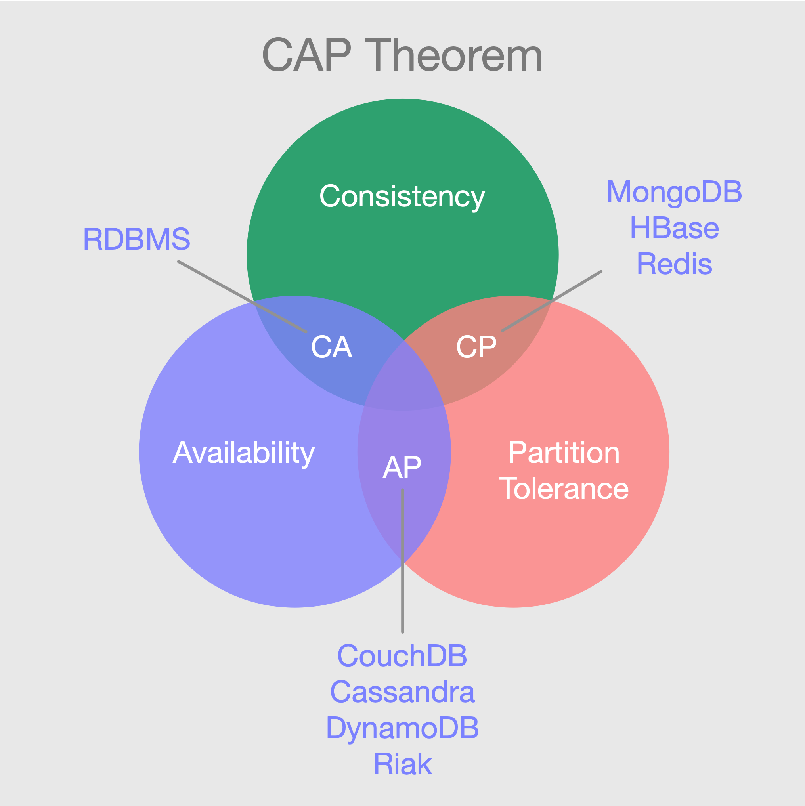
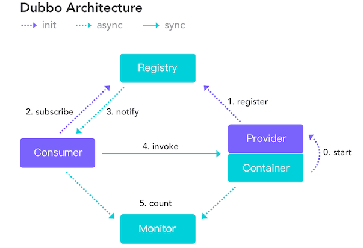
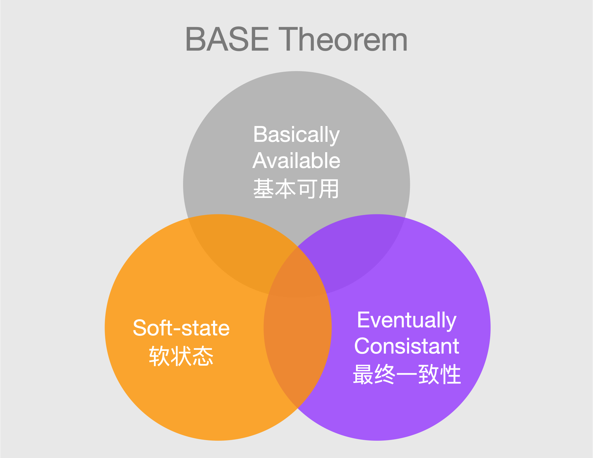

## 集群/分布式/微服务/SOA

[什么是集群、分布式](https://www.jianshu.com/p/d4fb16fafc2e)

> **集群**

单机处理到达瓶颈的时候，你就把单机复制几份，这样就构成了一个`“集群”`。集群中每台服务器就叫做这个集群的一个`“节点”`，所有节点构成了一个集群。每个节点都提供相同的服务，那么这样系统的处理能力就相当于提升了好几倍（有几个节点理论上就相当于提升了多少倍）。

但问题是用户的请求究竟由哪个节点来处理呢？最好能够让此时此刻负载较小的节点来处理，这就涉及到`负载均衡`。

但是，当业务发展到一定程度的时候，你会发现一个问题——无论怎么增加节点，貌似整个集群性能的提升效果并不明显了。这时候，你就需要使用`微服务架构`了。

> **分布式**

从单机结构到集群结构，代码基本无需要作任何修改，要做的仅仅是多部署几台服务器，每台服务器上运行相同的代码就行了。但是，从集群结构演进到微服务结构的时候，之前的那套代码就需要发生较大的改动了。

所以对于新系统我们建议，系统设计之初就采用微服务架构，这样后期运维的成本更低。但如果一套老系统需要升级成微服务结构的话，那就得对代码大动干戈了。所以，对于老系统而言，究竟是继续保持集群模式，还是升级成微服务架构，这需要我们的架构师深思熟虑、权衡投入产出比。

`分布式架构就是将一个完整的系统，按照业务功能，拆分成一个个独立的子系统`，在分布式架构中，每个子系统就被称为`“服务”`。这些子系统能够独立运行在web容器中，它们之间通过`RPC方式`通信。

举个例子，假设需要开发一个在线商城。按照微服务的思想，我们需要按照功能模块拆分成多个独立的服务，如：`用户服务`、`产品服务`、`订单服务`、`后台管理服务`、`数据分析服务`等等。这一个个服务都是一个个独立的项目，可以独立运行。`如果服务之间有依赖关系，那么通过RPC方式调用`。

**分布式的好处**：

+ **系统之间耦合度降低**。可独立开发、独立部署、独立测试，系统与系统之间的边界非常明确，易于排错，开发效率提升。
+ **系统扩展性增强**。可以针对性地扩展某些服务，假设商城要搞一次大促，下单量可能会大大提升，因此我们可以针对性地提升订单系统、产品系统的节点数量，而对于后台管理系统、数据分析系统而言，节点数量维持原有水平即可。
+ **服务的复用性提高**。比如，当我们将用户系统作为单独的服务后，该公司所有的产品都可以使用该系统作为用户系统，无需重复开发。

## 分布式

Java是为Internet的分布式环境设计的，因为它能够处理TCP/IP协议。

事实上，通过URL访问一个网络资源和访问本地文件是一样简单的。

Java还支持`远程方法调用`(RMI, Remote Method Invocation)，使程序能够通过网络调用方法。

+ **分布式** （大数据环境下、数据多、高并发、服务器压力大）: 数据库的分布式 + Java 代码的分布式（Java EE的高级部分，面向工作的）。

- **数据库的分布式**: `Redis数据库`（`缓存`数据库，消息`中间件`），比如商品秒杀场景
- **Java 的分布式**: 微服务、Zookeeper（注册方）、docker容器（把项目的所有依赖的东西整体打包，增强可移植性）

## CAP定理

CAP 理论/定理起源于 2000 年，由加州大学伯克利分校的 Eric Brewer 教授在分布式计算原理研讨会（PODC）上提出，因此 CAP 定理又被称作 布鲁尔定理（Brewer’s theorem）。2 年后，麻省理工学院的 Seth Gilbert 和 Nancy Lynch 发表了布鲁尔猜想的证明，CAP 理论正式成为分布式领域的定理。

> **简介**

CAP定理（CAP theorem）指出对于一个分布式计算系统来说，不可能同时满足以下三点:

+ **一致性(Consistency)**：在分布式系统中的所有数据备份，在同一时刻是否同样的值。（等同于所有节点访问同一份最新的数据副本）
+ **可用性(Availability)**：在集群中一部分节点故障后，集群整体是否还能响应客户端的读写请求。非故障的节点在合理的时间内返回合理的响应（不是错误或者超时的响应）。

- **分区容错性(Partition tolerance)**：出现网络分区时，仍能对外提供服务。以实际效果而言，分区相当于对通信的时限要求。系统如果不能在时限内达成数据一致性，就意味着发生了分区的情况，必须就当前操作在C和A之间做出选择。

`网络分区`：分布式系统中，多个节点之前的网络本来是连通的，但是因为某些故障（比如部分节点网络出了问题）某些节点之间不连通了，整个网络就分成了几块区域，这就叫网络分区。

CAP理论的核心是：一个分布式系统不可能同时很好的满足一致性，可用性和分区容错性这三个需求，最多只能同时较好的满足其中两个。

> **不是简单的 3 选 2**

原则上，根据 CAP 原理可以将一个分布式系统分成满足 `CA` 原则、满足 `CP` 原则和满足 `AP` 原则三 大类。

实际上，并不是简单的`“3选2”`：

+ 当发生网络分区的时候，如果我们要继续服务，那么强一致性和可用性只能 2 选 1。也就是说当网络分区之后 ，分区容错性(Partition tolerance)是必须要保证的，它是前提，决定了 P 之后才有 C 和 A 的选择。

因此，`分布式系统理论上不可能选择 CA 架构，只能选择 CP 或者 AP 架构`。

> **在P的前提下，为何无法同时保证 C 和 A ？**

若系统出现“分区”，系统中的某个节点在进行写操作。

+ 为了保证`一致性(Consistency)`， 必须要禁止其他节点的读写操作，这就和 A 发生冲突了。
+ 同样，为了保证`可用性(Availability)`，其他节点的读写操作正常的话，那就和 C 发生冲突了。

选择的关键在于当前的业务场景，比如对于需要确保强一致性的场景，如银行一般会选择保证 CP 而牺牲掉一定的可用性(Availability)。

> **CAP实际应用场景**

以Dubbo为例

注册中心(Registry)负责服务地址的注册与查找，相当于目录服务，服务提供者和消费者只在启动时与注册中心交互，注册中心不转发请求，压力较小。

常见的可以作为注册中心的组件有：`ZooKeeper`、`Eureka`、`Nacos`等，它们分别满足了CAP中的不同的原则：

1. **ZooKeeper 保证的是 CP。** 任何时刻对 ZooKeeper 的读请求都能得到一致性的结果，但是， ZooKeeper 不保证每次请求的可用性，比如在 Leader 选举过程中或者半数以上的机器不可用的时候，服务就是不可用的。
2. **Eureka 保证的则是 AP。** Eureka 在设计的时候就是优先保证 A （可用性）。在 Eureka 中不存在什么 Leader 节点，每个节点都是一样的、平等的。因此 Eureka 不会像 ZooKeeper 那样出现选举过程中或者半数以上的机器不可用时服务就是不可用的情况。Eureka 保证即使大部分节点挂掉也不会影响正常提供服务，只要有一个节点是可用的就行了，只不过这个节点上的数据可能并不是最新的。
3. **Nacos 不仅支持 CP 也支持 AP。**

> **如果没有发生分区**

如果系统没有发生“分区”的话，节点间的网络连接通信正常的话，也就不存在 P 了。这个时候，我们就可以同时保证 C 和 A 了。

## BASE理论

BASE 理论起源于 2008 年， 由 eBay 的架构师 Dan Pritchett 在 ACM 上发表。

> **简介**

`BASE` 即 `Basically Available（基本可用）` 、`Soft-state（软状态）` 和 `Eventually Consistent（最终一致性）` 三个短语的缩写。

BASE 理论是对 CAP 中一致性C 和可用性A 权衡的结果，其来源于对大规模互联网系统分布式实践的总结，是基于 CAP 定理逐步演化而来的，它大大降低了我们对系统的要求。

> **BASE 理论的核心思想**

即使无法做到强一致性，但每个应用都可以根据自身业务特点，采用适当的方式来使系统达到最终一致性。

也就是牺牲数据的`强一致性`来满足系统的`高可用性`，系统中一部分数据不可用或者不一致时，仍需要保持系统整体“`主要可用`”。

BASE 理论本质上是对 CAP 的延伸和补充，更具体地说，是对 CAP 中 `AP` 方案的一个补充。AP 方案只是在系统发生分区的时候放弃一致性，而不是永远放弃一致性。在分区故障恢复后，系统应该达到最终一致性。这一点其实就是 BASE 理论延伸的地方。

1. **基本可用**

基本可用是指分布式系统在出现不可预知故障的时候，允许损失部分可用性。但是，这绝不等价于系统不可用。

什么叫允许损失部分可用性呢？

+ **响应时间上的损失**: 正常情况下，处理用户请求需要 0.5s 返回结果，但是由于系统出现故障，处理用户请求的时间变为 3 s。
+ **系统功能上的损失**：正常情况下，用户可以使用系统的全部功能，但是由于系统访问量突然剧增，系统的部分非核心功能无法使用。

2. **软状态**

软状态指允许系统中的数据存在中间状态（CAP 理论中的数据不一致），并认为该中间状态的存在不会影响系统的整体可用性，即允许系统在不同节点的数据副本之间进行数据同步的过程存在延时。

3. **最终一致性**

最终一致性强调的是系统中所有的数据副本，在经过一段时间的同步后，最终能够达到一个一致的状态。因此，最终一致性的本质是需要系统保证最终数据能够达到一致，而不需要`实时`保证系统数据的强一致性。

分布式一致性的 3 种级别：

+ 强一致性：系统写入了什么，读出来的就是什么。
+ 弱一致性：不一定可以读取到最新写入的值，也不保证多长时间之后读取到的数据是最新的，只是会尽量保证`某个时刻`达到数据一致的状态。

+ 最终一致性：弱一致性的升级版。系统会保证在一定时间内达到数据一致的状态。

BASE 理论这块的话还可以结合分布式事务来谈。相关阅读：[阿里终面：分布式事务原理](https://mp.weixin.qq.com/s?__biz=Mzg2OTA0Njk0OA==&mid=2247494827&idx=1&sn=aa5d7401d53b1ca61b5e49462262bd22&chksm=cea1a360f9d62a761dff15a682f69fcacdd5b70a8afc4e1114cc7f6704b31d9aa3ad82ae5233&token=934329621&lang=zh_CN&scene=21#wechat_redirect)

ACID 是数据库事务完整性的理论，CAP 是分布式系统设计理论，BASE 是 CAP 理论中 AP 方案的延伸。