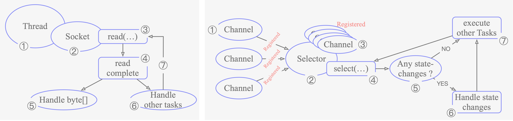

[尚硅谷Netty视频教程（2019发布）](https://www.bilibili.com/video/BV1DJ411m7NR?from=search&seid=17546089431013346294)

[Netty入门教程——认识Netty](https://www.jianshu.com/p/b9f3f6a16911)

[一个轻量级分布式RPC框架--NettyRpc](https://www.cnblogs.com/luxiaoxun/p/5272384.html)

## Netty能做什么

[小白科普：Netty有什么用？](https://blog.csdn.net/bjweimengshu/article/details/78786315?utm_source=app)

有了Netty，你可以实现自己的HTTP服务器，FTP服务器，UDP服务器，RPC服务器，WebSocket服务器，Redis的Proxy服务器，MySQL的Proxy服务器等等。

如果你想知道Nginx是怎么写出来的，如果你想知道Tomcat和Jetty是如何实现的，如果你也想实现一个简单的Redis服务器，那都应该好好理解一下Netty，它们高性能的原理都是类似的。

> 传统的HTTP服务器的原理：

1. 创建一个ServerSocket，监听并绑定一个端口
2. 一系列客户端来请求这个端口
3. 服务器使用Accept，获得一个来自客户端的Socket连接对象

4. 启动一个新线程处理连接

+ 读Socket，得到字节流
+ 解码协议，得到Http请求对象

+ 处理Http请求，得到一个结果，封装成一个HttpResponse对象

+ 编码协议，将结果序列化字节流

+ 写Socket，将字节流发给客户端

5. 继续循环步骤 3

HTTP服务器之所以称为`HTTP`服务器，是因为编码解码协议是HTTP协议，如果协议是Redis协议，那它就成了Redis服务器，如果协议是WebSocket，那它就成了WebSocket服务器，等等。

使用Netty就可以定制编解码协议，实现自己的特定协议的服务器。

> 基于NIO的Netty

上面我们说的是一个传统的多线程服务器，这个也是Apache处理请求的模式。在高并发环境下，线程数量可能会创建太多，操作系统的任务调度压力大，系统负载也会比较高。那怎么办呢？

于是NIO诞生了，NIO并不是Java独有的概念，NIO代表的一个词汇叫着`IO多路复用`。它是由操作系统提供的系统调用，早期这个操作系统调用的名字是`select`，但是性能低下，后来渐渐演化成了Linux下的`epoll`和Mac里的`kqueue`。我们一般就说是epoll，因为没有人拿苹果电脑作为服务器使用对外提供服务。而Netty就是基于Java NIO技术封装的一套框架。为什么要封装，因为原生的Java NIO使用起来没那么方便，而且还有臭名昭著的bug，Netty把它封装之后，提供了一个易于操作的使用模式和接口，用户使用起来也就便捷多了。

Netty是建立在NIO基础之上，Netty在NIO之上又提供了更高层次的抽象。

在Netty里面，Accept连接可以使用单独的线程池去处理，读写操作又是另外的线程池来处理。

Accept连接和读写操作也可以使用同一个线程池来进行处理。而请求处理逻辑既可以使用单独的线程池进行处理，也可以跟放在读写线程一块处理。线程池中的每一个线程都是NIO线程。用户可以根据实际情况进行组装，构造出满足系统需求的并发模型。

> Netty提供了哪些东西

Netty提供了内置的常用编解码器，包括行编解码器［一行一个请求］，前缀长度编解码器［前N个字节定义请求的字节长度］，可重放解码器［记录半包消息的状态］，HTTP编解码器，WebSocket消息编解码器等。Netty提供了一些列生命周期回调接口，当一个完整的请求到达时，当一个连接关闭时，当一个连接建立时，用户都会收到回调事件，然后进行逻辑处理。

Netty可以同时管理多个端口，可以使用NIO客户端模型，这些对于RPC服务是很有必要的。

Netty除了可以处理TCP Socket之外，还可以处理UDP Socket。

在消息读写过程中，需要大量使用ByteBuffer，Netty对ByteBuffer在性能和使用的便捷性上都进行了优化和抽象。


## Netty和Tomcat的区别

Netty 和 Tomcat 最大的区别就在于通信协议，Tomcat是基于Http协议的，它实质是一个基于http协议的web容器，但是Netty不一样，它能通过编程自定义各种协议，因为Netty能够通过codec自己来编码/解码字节流，完成类似redis访问的功能，这就是Netty和Tomcat最大的不同。


## 为什么Netty受欢迎

[原文](https://www.jianshu.com/p/b9f3f6a16911)

1. **并发高**
2. **传输快**
3. **封装好**

>**并发高**

Netty是一款基于NIO（Nonblocking I/O，非阻塞IO）开发的网络通信框架，对比于BIO（Blocking I/O，阻塞IO），它的并发性能得到了很大提高：


从这两图可以看出，NIO的单线程能处理连接的数量比BIO要高出很多，而为什么单线程能处理更多的连接呢？原因就是右图中出现的`Selector`。

当一个连接建立之后，有两个步骤要做，第一步是接收完客户端发过来的全部数据，第二步是服务端处理完请求业务之后返回response给客户端。

NIO和BIO的区别主要是在第一步：

+ 在BIO中，等待客户端发数据这个过程是阻塞的，这样就造成了一个线程只能处理一个请求的情况，而机器能支持的最大线程数是有限的，这就是为什么BIO不能支持高并发的原因。
+ 而NIO中，当一个Socket建立好之后，Thread并不会阻塞去接收这个Socket，而是将这个请求交给Selector，Selector会不断地去遍历所有的Socket，一旦有一个Socket建立完成，它会通知Thread，然后Thread处理完数据再返回给客户端——`这个过程是不阻塞的`，这样就能让一个Thread处理更多的请求了。

下面两张图是基于BIO的处理流程和Netty的处理流程：



`BIO` | `Netty`

> **传输快**

Netty的传输快其实也是依赖了NIO的一个特性——*`零拷贝`*。我们知道，Java的内存有堆内存、栈内存和字符串常量池等等，其中堆内存是占用内存空间最大的一块，也是Java对象存放的地方，一般我们的数据如果需要从IO读取到堆内存，中间需要经过`Socket缓冲区`，也就是说一个数据会被拷贝两次才能到达它的终点，如果数据量大，就会造成不必要的资源浪费。
 Netty针对这种情况，使用了NIO中的另一大特性——*`零拷贝`*，当它需要接收数据的时候，会在堆内存之外开辟一块内存，数据就直接从IO读到了那块内存中去，在Netty里面通过`ByteBuf`可以直接对这些数据进行直接操作，从而加快了传输速度。

ByteBuf是Netty的一个重要概念，是Netty数据处理的容器，也是Netty封装好的一个重要体现。

> **封装好**

直接上代码

**阻塞I/O**：

```java
public class PlainOioServer {

    public void serve(int port) throws IOException {
        final ServerSocket socket = new ServerSocket(port);     //1
        try {
            for (;;) {
                final Socket clientSocket = socket.accept();    //2
                System.out.println("Accepted connection from " + clientSocket);

                new Thread(new Runnable() {                        //3
                    @Override
                    public void run() {
                        OutputStream out;
                        try {
                            out = clientSocket.getOutputStream();
                            out.write("Hi!\r\n".getBytes(Charset.forName("UTF-8"))); //4              
                            out.flush();
                            clientSocket.close();                //5

                        } catch (IOException e) {
                            e.printStackTrace();
                            try {
                                clientSocket.close();
                            } catch (IOException ex) {
                                // ignore on close
                            }
                        }
                    }
                }).start();                                        //6
            }
        } catch (IOException e) {
            e.printStackTrace();
        }
    }
}
```

**非阻塞IO**：

```java
public class PlainNioServer {
    public void serve(int port) throws IOException {
        ServerSocketChannel serverChannel = ServerSocketChannel.open();
        serverChannel.configureBlocking(false);
        ServerSocket ss = serverChannel.socket();
        InetSocketAddress address = new InetSocketAddress(port);
        ss.bind(address);                                            //1
        Selector selector = Selector.open();                        //2
        serverChannel.register(selector, SelectionKey.OP_ACCEPT);    //3
        final ByteBuffer msg = ByteBuffer.wrap("Hi!\r\n".getBytes());
        for (;;) {
            try {
                selector.select();                                    //4
            } catch (IOException ex) {
                ex.printStackTrace();
                // handle exception
                break;
            }
            Set<SelectionKey> readyKeys = selector.selectedKeys();    //5
            Iterator<SelectionKey> iterator = readyKeys.iterator();
            while (iterator.hasNext()) {
                SelectionKey key = iterator.next();
                iterator.remove();
                try {
                    if (key.isAcceptable()) {                //6
                        ServerSocketChannel server =
                                (ServerSocketChannel)key.channel();
                        SocketChannel client = server.accept();
                        client.configureBlocking(false);
                        client.register(selector, SelectionKey.OP_WRITE |
                                SelectionKey.OP_READ, msg.duplicate());    //7
                        System.out.println(
                                "Accepted connection from " + client);
                    }
                    if (key.isWritable()) {                //8
                        SocketChannel client =
                                (SocketChannel)key.channel();
                        ByteBuffer buffer =
                                (ByteBuffer)key.attachment();
                        while (buffer.hasRemaining()) {
                            if (client.write(buffer) == 0) {        //9
                                break;
                            }
                        }
                        client.close();                    //10
                    }
                } catch (IOException ex) {
                    key.cancel();
                    try {
                        key.channel().close();
                    } catch (IOException cex) {
                        // 在关闭时忽略
                    }
                }
            }
        }
    }
}
```

**Netty**：

```java
public class NettyOioServer {

    public void server(int port) throws Exception {
        final ByteBuf buf = Unpooled.unreleasableBuffer(
                Unpooled.copiedBuffer("Hi!\r\n", Charset.forName("UTF-8")));
        EventLoopGroup group = new OioEventLoopGroup();
        try {
            ServerBootstrap b = new ServerBootstrap();        //1

            b.group(group)                                    //2
             .channel(OioServerSocketChannel.class)
             .localAddress(new InetSocketAddress(port))
             .childHandler(new ChannelInitializer<SocketChannel>() {   //3
                 @Override
                 public void initChannel(SocketChannel ch) 
                     throws Exception {
                     ch.pipeline().addLast(new ChannelInboundHandlerAdapter() {  //4
                         @Override
                         public void channelActive(ChannelHandlerContext ctx) throws Exception {
                             ctx.writeAndFlush(buf.duplicate()).addListener(ChannelFutureListener.CLOSE);//5
                         }
                     });
                 }
             });
            ChannelFuture f = b.bind().sync();  //6
            f.channel().closeFuture().sync();
        } finally {
            group.shutdownGracefully().sync();  //7
        }
    }
}
```

从代码量上来看，Netty就已经秒杀传统Socket编程了，但是这一部分博大精深，仅仅贴几个代码岂能说明问题，在这里给大家介绍一下Netty的一些重要概念，让大家更理解Netty。


# 《Netty 4 核心原理与手写RPC框架实战》

## I/O基础篇

如果想要提高I/O效率，需要将等待时间降低。因此发展出来五种I/O模型，分别是：

**同步I/O**

+ 阻塞I/O模型（阻塞）
+ 非阻塞I/O模型（非阻塞）
+ 多路复用I/O模型（阻塞）
+ 信号驱动I/O模型（非阻塞）

**异步I/O模型**（非阻塞）


