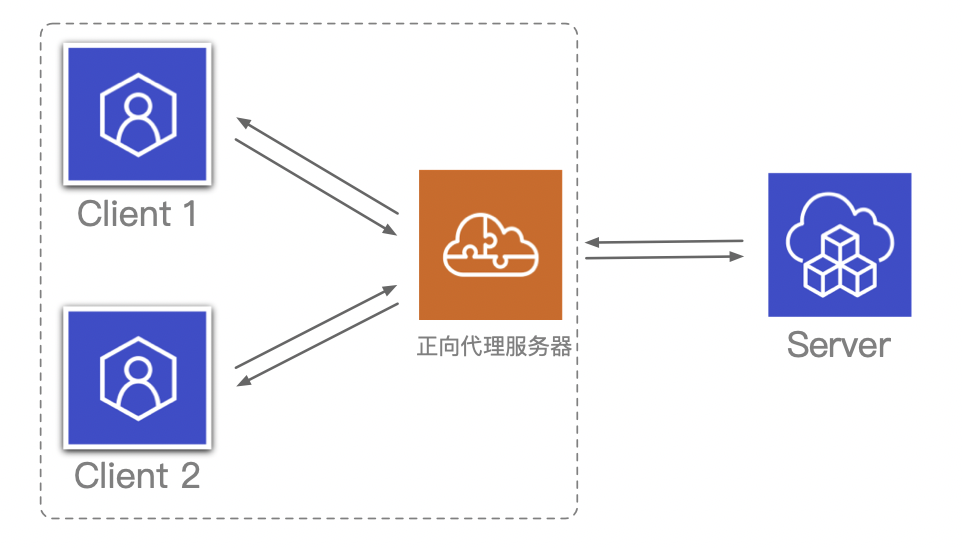
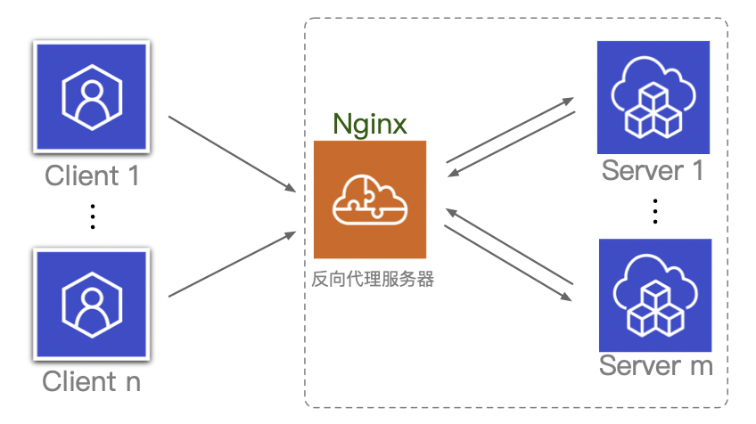
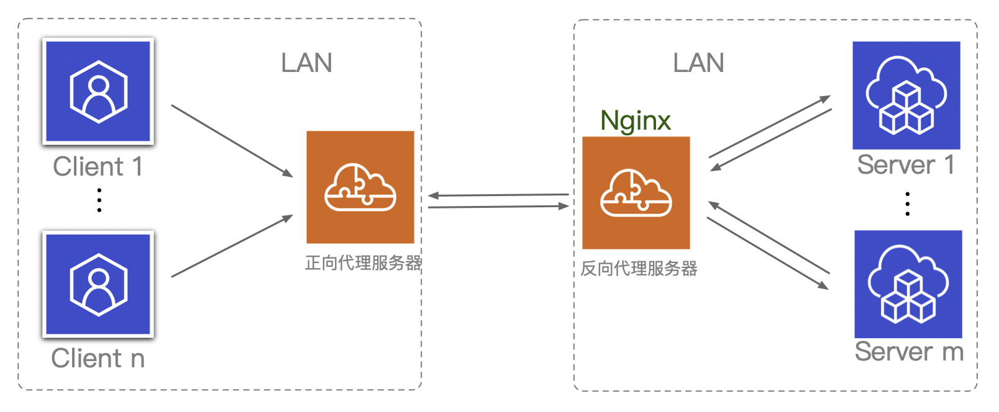
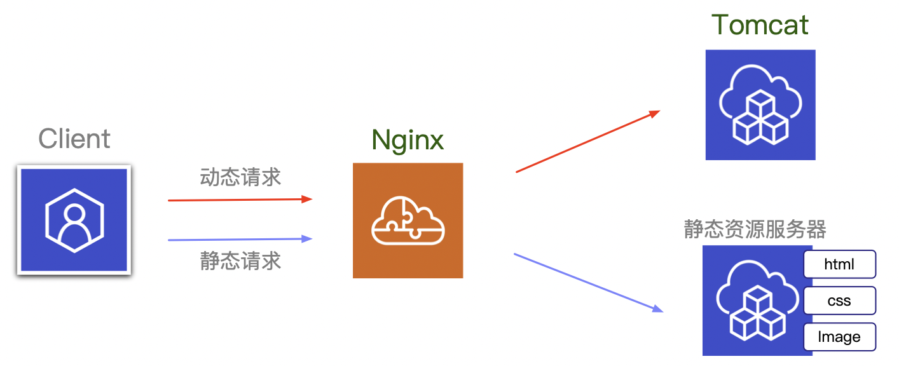
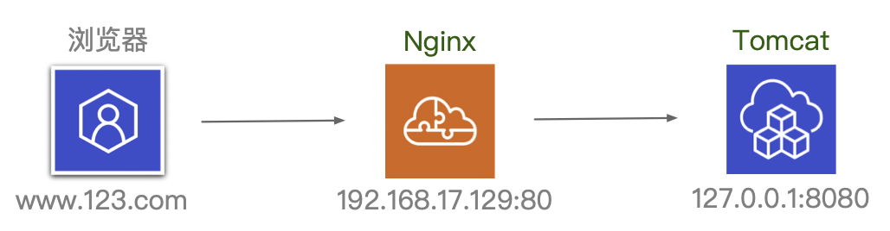
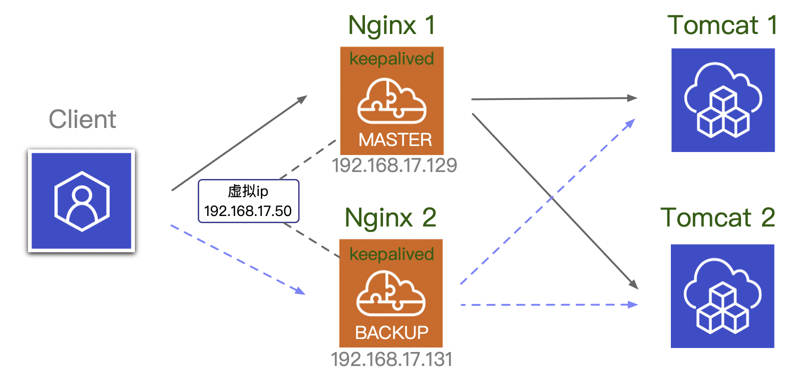

## Nginx

[尚学堂视频](https://www.bilibili.com/video/BV1zJ411w7SV?p=1)

[Nginx 相关介绍(Nginx是什么?能干嘛?)](https://www.cnblogs.com/wcwnina/p/8728391.html)

### Nginx 简介

Nginx 同 Apache  一样都是一种 WEB 服务器。基于 REST 架构风格，以统一资源描述符(Uniform Resources Identifier)URI 或者统一资源定位符(Uniform Resources Locator)URL 作为沟通依据，通过 HTTP 协议提供各种网络服务。

然而，这些服务器在设计之初受到当时环境的局限，例如当时的用户规模、网络带宽、产品特点等局限并且各自的定位和发展都不尽相同。这也使得各个WEB服务器有着各自鲜明的特点。

Apache 有着很多优点：稳定、开源、跨平台等等，但是受限于当时的互联网环境，刚开始被设计成一个`重量级`服务器，且`不支持高并发`。在 Apache 上运行数以万计的并发访问，会导致服务器消耗大量内存。操作系统对其进行进程或线程间的切换也消耗了大量的CPU资源，导致 HTTP 请求的平均响应速度降低。这些都决定了Apache不可能成为高性能Web服务器，轻量级高并发服务器 `Nginx` 就应运而生了。

> **Nginx 的优点**

**事件驱动**。Nginx 使用基于事件驱动架构，使得其可以支持数以百万级别的TCP连接；

**开源**。高度的模块化和自由软件许可证使得第三方模块层出不穷（这是个开源的时代啊~）；

**跨平台**。Nginx 是一个跨平台服务器，可以运行在Linux、Windows、FreeBSD、Solaris、AIX、Mac OS等操作系统上。

> **总说 Apache 是重量级的，Nginx 和 lighttpd 是轻量级的，体现在哪？**

从代码量上来看，Apache 超过30W行，Nginx 则是十来万，相比之下，Nginx 代码少得多。 

从资源（主要是内存）占用来看，Nginx 比 Apache 也少得多。因此高并发场合下表现比 Apache 好得多。

Apache 主要采用的是基于进程的 Prefork 模式（还有基于线程的Worker模式），也就是，对于每个请求都会用一个进程去进行服务，而进程非常占资源 ，当并发量大的时候，就需要等额的进程，导致高内存占用和CPU占用 ，这就是所谓的`重量级`。

而 Lighty 和 Nginx 则是基于 Reactor 模式（可以查阅相关论文）的服务器，其原理是当链接的状态发生改变的时候，呼叫`事件分发器`来处理链接变化；由于http请求大部分时间都是在等待，所以只需要一个进程就可以同时处理大量链接，这就是所谓的`轻量级`。

> **Nginx 的应用场景**

Nginx 是一款自由的、开源的、高性能的 `HTTP 服务器`和`反向代理`服务器；

同时也是一个 IMAP、POP3、SMTP 代理服务器；

Nginx 可以作为一个 HTTP 服务器进行网站的发布处理；

另外 Nginx 可以作为反向代理进行`负载均衡`的实现。

### 正向代理&反向代理

> **正向代理**

正向代理：如果把局域网外的 Internet 想象成一个巨大的资源库，则局域网中的客户端要访问 Internet，则需要通过代理服务器来访问，这种代理服务就称为正向代理。

例如，当我们想通过浏览器去访问国外的某些网站，但是访问不到，此时大家可能都会用一个操作 FQ 进行访问，FQ 的方式主要是找到一个可以访问国外网站的代理服务器，我们将请求发送给代理服务器，代理服务器去访问国外的网站（服务器），然后将访问到的数据传递给我们！

上述这样的代理模式称为正向代理，正向代理最大的特点是客户端非常明确要访问的服务器地址；`服务器只清楚请求来自哪个代理服务器，而不清楚来自哪个具体的客户端；正向代理模式屏蔽或者隐藏了真实客户端信息`。

来看个示意图（这里把客户端和正向代理框在一块，同属于一个环境，后面有介绍）：



**客户端必须设置正向代理服务器，当然前提是知道正向代理服务器的 IP 地址，还有代理程序的端口** 

总结来说：正向代理，`它代理的是客户端，代客户端发出请求`，是一个位于客户端和原始服务器（origin server）之间的服务器，为了从原始服务器取得内容，客户端向代理发送一个请求并指定目标（原始服务器），然后代理向原始服务器转交请求并将获得的内容返回给客户端。客户端必须要进行一些特别的设置才能使用正向代理。

**正向代理的作用**：
① 访问原来无法访问的资源，如 Google
② 可以做`缓存`，加速访问资源
③ 对客户端访问授权，上网进行认证
④ 代理可以记录用户访问记录（上网行为管理），对外（原始服务器）隐藏用户信息

> **反向代理**

例如某宝网站，每天同时连接到网站的访问人数已经爆表，单个服务器远远不能满足人民日益增长的购买欲望了，此时就出现了一个大家耳熟能详的名词：`分布式部署`，也就是通过部署多台服务器来解决访问人数限制的问题，某宝网站中大部分功能也是直接使`用Nginx进行反向代理`实现的，并且`通过封装 Nginx 和其他的组件`之后起了个高大上的名字：`Tengine`，有兴趣的童鞋可以访问 Tengine 的官网查看具体的信息：http://tengine.taobao.org/。

那么反向代理具体是通过什么样的方式实现的分布式的集群操作呢，我们先看一个示意图（这里将服务器和反向代理框在一块，同属于一个环境，后面有介绍）：



如图，多个客户端给服务器发送请求，Nginx 服务器接收到请求之后，按照一定的规则`分发`给了后端的业务处理服务器进行处理。此时请求的来源（客户端）是明确的，但是请求具体由哪台服务器处理的并不明确，Nginx 扮演的就是一个反向代理角色。

**客户端是无感知代理的存在的，反向代理对外都是透明的，访问者并不知道自己访问的是一个代理。因为客户端不需要任何配置就可以访问。**

反向代理，`它代理的是服务端，代服务端接收请求`，主要用于`服务器集群分布式部署`的情况下，反向代理隐藏了服务器的信息。

**反向代理的作用**：
① 保证内网的安全，通常将反向代理作为公网访问地址，Web 服务器是内网
② 负载均衡，通过反向代理服务器来优化网站的负载

> **项目场景**

通常情况下，在实际项目操作时，正向代理和反向代理很有可能会存在于一个应用场景中，正向代理代理客户端的请求去访问目标服务器，目标服务器是一个反向代理服务器，反向代理了多台真实的业务处理服务器。

具体的拓扑图如下：



> **正向代理和反向代理区别**

在正向代理中，Proxy 和 Client 同属于一个LAN（图中方框内），隐藏了客户端信息；

在反向代理中，Proxy 和 Server 同属于一个LAN（图中方框内），隐藏了服务端信息；

`实际上，Proxy 在两种代理中做的事情都是替服务器代为收发请求和响应，不过从结构上看正好左右互换了一下，所以把后出现的这种代理方式称为反向代理了。`

### 负载均衡

> **负载均衡**

客户端发送多个请求到服务器，服务器处理请求，有一些可能要与数据库进行交互，服务器处理完毕后，再将结果返回给客户端。 

这种架构模式对于早期的系统相对单一，并发请求相对较少的情况下是比较适合的，成本也低。但是随着信息数量的不断增长，访问量和数据量的飞速增长，以及系统业务的复杂度增加，这种架构会造成服务器相应客户端的请求日益缓慢，并发量特别大的时候，还容易造成服务器直接崩溃。很明显这是由于服务器性能的瓶颈造成的问题，那么如何解决这种情况呢？ 

这时候集群的概念产生了，单个服务器解决不了，我们增加服务器的数量，然后将请求分发到各个服务器上，将原先请求集中到单个服务器上的情况改为将请求分发到多个服务器上，将负载分发到不同的服务器，也就是我们所说的`负载均衡`。

**负载量**：客户端发送的、Nginx 反向代理服务器接收到的请求数量；

**均衡规则**：请求数量按照一定的规则进行分发到不同的服务器处理的规则；

**负载均衡**：将服务器接收到的请求按照规则分发的过程。

负载均衡在实际项目操作过程中，有`硬件负载均衡`和`软件负载均衡`两种，硬件负载均衡也称为`硬负载`，如 F5 负载均衡，相对造价昂贵成本较高，但是数据的稳定性安全性等等有非常好的保障，如中国移动\中国联通这样的公司才会选择硬负载进行操作；更多的公司考虑到成本原因，会选择使用软件负载均衡，软件负载均衡是利用现有的技术结合主机硬件实现的一种`消息队列分发机制`。

> **Nginx 支持的负载均衡调度算法方式如下**：

1. **weight 轮询**（默认，常用，具有 HA 功效）：接收到的请求按照权重分配到不同的后端服务器，如果在使用过程中，某一台后端服务器宕机，Nginx 会自动将该服务器剔除出队列，请求受理情况不会受到任何影响。 这种方式下，可以`给不同的后端服务器设置一个权重值(weight)`，用于调整不同的服务器上接收请求的`分配率`；权重数据越大，被分配到请求的几率越大；该权重值，主要是针对实际工作环境中不同的后端服务器`硬件配置`进行调整的。
2. **ip_hash**（常用）：每个请求按访问`ip`的`hash`结果分配，这样每个访客固定访问一个后端服务器，这也在一定程度上解决了集群部署环境下`Session共享`的问题。
3. **fair**：`智能调整调度算法`，动态地根据后端服务器的请求处理到响应的时间进行均衡分配，响应时间短处理效率高的服务器分配到请求的概率高，响应时间长处理效率低的服务器分配到的请求少；结合了前两者的优点的一种调度算法。但是需要注意的是Nginx默认不支持fair算法，如果要使用这种调度算法，请安装`upstream_fair`模块。
4. **url_hash**：按照访问的`url`的`hash`结果分配请求，每个请求的url会指向后端固定的某个服务器，可以在Nginx作为静态服务器的情况下提高缓存效率。同样要注意Nginx默认不支持这种调度算法，要使用的话需要安装Nginx的hash软件包。

**几种常见的 Web 服务器对比**：

| 对比项 \ 服务器 | Apache | Nginx  | Lighttpd |
| :-------------: | :----: | :----: | :------: |
|   Proxy 代理    | 非常好 | 非常好 |   一般   |
|    Rewriter     |   好   | 非常好 |   一般   |
|      Fcgi       |  不好  |   好   |  非常好  |
|     热部署      | 不支持 |  支持  |  不支持  |
|    系统压力     |  很大  |  很小  |  比较小  |
|     稳定性      |   好   | 非常好 |   不好   |
|     安全性      |   好   | `一般` |   一般   |
|  静态文件处理   |  一般  | 非常好 |    好    |
|    反向代理     |  一般  | 非常好 |   一般   |


### 动静分离

为了加快网站的解析速度，可以把`动态页面`和`静态页面`由不同的服务器来解析，加快解析速度。降低原来单个服务器的压力。

而 Nginx 就可以充当分配请求的角色。



### Nginx 常用命令

使用 Nginx 命令的前提条件是在 nginx 的 sbin 目录下执行命令，以下命令均是在 /usr/local/nginx/sbin 目录下进行的操作

所以如果当前不在 sbin 目录下，则需要切换目录:

```shell
cd /usr/local/nginx/sbin
```

**启动**

```shell
./nginx
```

**关闭**

```shell
./nginx s stop
```

**重新加载**

比如，当在 Nginx 已经启动的情况下修改其配置文件，如果想让配置文件重新启动则需要重新启动 Nginx，但是也可以不用重新启动，使用重新加载命令即可：

```shell
./nginx s reload
```


### Nginx 配置文件

名为 `nginx.conf` 即为Nginx配置文件，在此文件夹下：

```shell
cd /usr/local/nginx/conf
```

> **配置文件内容**

```conf
#user  nobody;
worker_processes  1;

#error_log  logs/error.log;
#error_log  logs/error.log  notice;
#error_log  logs/error.log  info;

#pid        logs/nginx.pid;

events {
    worker_connections  1024;
}

http {
    include       mime.types;
    default_type  application/octet-stream;

    #log_format  main  '$remote_addr - $remote_user [$time_local] "$request" '
    #                  '$status $body_bytes_sent "$http_referer" '
    #                  '"$http_user_agent" "$http_x_forwarded_for"';

    #access_log  logs/access.log  main;

    sendfile        on;
    #tcp_nopush     on;

    #keepalive_timeout  0;
    keepalive_timeout  65;

    #gzip  on;

    server {
        listen       80;
        server_name  localhost;

        #charset koi8-r;

        #access_log  logs/host.access.log  main;

        location / {
            root   html;
            index  index.html index.htm;
        }

        #error_page  404              /404.html;

        # redirect server error pages to the static page /50x.html
        #
        error_page   500 502 503 504  /50x.html;
        location = /50x.html {
            root   html;
        }

        # proxy the PHP scripts to Apache listening on 127.0.0.1:80
        #
        #location ~ \.php$ {
        #    proxy_pass   http://127.0.0.1;
        #}

        # pass the PHP scripts to FastCGI server listening on 127.0.0.1:9000
        #
        #location ~ \.php$ {
        #    root           html;
        #    fastcgi_pass   127.0.0.1:9000;
        #    fastcgi_index  index.php;
        #    fastcgi_param  SCRIPT_FILENAME  /scripts$fastcgi_script_name;
        #    include        fastcgi_params;
        #}

        # deny access to .htaccess files, if Apache's document root
        # concurs with nginx's one
        #
        #location ~ /\.ht {
        #    deny  all;
        #}
    }

    # another virtual host using mix of IP-, name-, and port-based configuration
    #
    #server {
    #    listen       8000;
    #    listen       somename:8080;
    #    server_name  somename  alias  another.alias;

    #    location / {
    #        root   html;
    #        index  index.html index.htm;
    #    }
    #}

    # HTTPS server
    #
    #server {
    #    listen       443 ssl;
    #    server_name  localhost;

    #    ssl_certificate      cert.pem;
    #    ssl_certificate_key  cert.key;

    #    ssl_session_cache    shared:SSL:1m;
    #    ssl_session_timeout  5m;

    #    ssl_ciphers  HIGH:!aNULL:!MD5;
    #    ssl_prefer_server_ciphers  on;

    #    location / {
    #        root   html;
    #        index  index.html index.htm;
    #    }
    #}
}
```

> **location 指令说明**

该指令用于匹配 URL

语法如下：

```config
location [ = | ~ | ~* | ^~] uri {

}
```

+ **=**：用于不含正则表达式的 uri 前，要求请求字符串，与 uri 严格匹配，如果匹配成功，就停止继续向下搜索并立即处理该请求
+ **~**：用于表示 uri 包含正则表达式，并且区分大小写
+ **~***：用于表示 uri 包含正则表达式，并且不区分大小写 
+ **^~**：用于不含正则表达式的 uri 前，要求 Nginx 服务器找到标识 uri 和请求字符串匹配度最高的 location 后，立即使用此 location 处理请求，而不再使用 location 块中的正则 uri 和请求字符串做匹配。 

**注意**：如果 uri 包含正则表达式，则必须要有 ~ 或者 ~* 标识。 

> **根据上述文件，我们可以很明显的将 nginx.conf 配置文件分为三部分：** 

**第一部分：全局块** 

从配置文件开始到 events 块之间的内容，主要会设置一些影响 nginx 服务器整体运行的配置指令，主要包括`配置运行 Nginx 服务器的用户（组）`、`允许生成的 worker process 数`、`进程 PID 存放路径`、`日志存放路径和类型`以及`配置文件的引入`等。 

比如上面第一行配置的： 

```config
worker_processes  1;
```

这是 Nginx 服务器并发处理服务的关键配置，worker_processes 值越大，可以支持的并发处理量也越多，但是会受到硬件、软件等设备的制约。

**第二部分：events 块** 

```config
events {
    worker_connections  1024;
}
```

events 块涉及的指令主要影响 Nginx 服务器与用户的网络连接，常用的设置包括是否开启对多 work process 下的网络连接进行序列化，是否允许同时接收多个网络连接，选取哪种事件驱动模型来处理连接请求，每个 word process 可以同时支持的最大连接数等。 

上述例子就表示每个 work process 支持的最大连接数为 1024

这部分的配置对 Nginx 的性能影响较大，在实际中应该灵活配置。 

**第三部分：http 块** 

这块算是 Nginx 服务器配置中最频繁的部分，代理、缓存和日志定义等绝大多数功能和第三方模块的配置都在这里。

需要注意的是，http 块包括 `http 全局块`和 `server 块`。

**http全局块**

http全局块配置的指令包括文件引入、MIME-TYPE 定义、日志自定义、连接超时时间、单链接请求数上限等。 

这块和虚拟主机有密切关系，虚拟主机从用户角度看，和一台独立的硬件主机是完全一样的，该技术的产生是为了节省互联网服务器硬件成本。 

每个 http 块可以包括多个 server 块，而每个 server 块就相当于一个虚拟主机。 

而每个 server 块也分为全局 server 块，以及可以同时包含多个 locaton 块。 

1. 全局 server 块

最常见的配置是本虚拟机主机的监听配置和本虚拟主机的名称或 IP 配置。 

2. location 块 

一个 server 块可以配置多个 location 块。 

这块的主要作用是基于 Nginx 服务器接收到的请求字符串（例如 server_name/uri-string），对虚拟主机名称（也可以是IP别名）之外的字符串（例如 前面的 /uri-string）进行匹配，对特定的请求进行处理。地址定向、数据缓存和应答控制等功能，还有许多第三方模块的配置也在这里进行。 


### Nginx 配置准备工作

1. 在Linux系统中安装Tomcat，使用默认端口8080

2. 对外开放访问的端口（因为默认是不能访问 Tomcat 的8080端口）

	```shell
	firewall-cmd --add-port=8080/tcp --permanent
	firwall-cmd -reload
	```


### 配置反向代理 1

> Nginx 配置实例之配置反向代理1

实现效果：打开浏览器，输入URL：www.123.com，跳转到 Linux 系统 Tomcat 主页面中。

示意图：



1. **修改 www.123.com 域名**

www.123.com 这个域名需要在 host 文件进行配置域名映射的 ip 地址。当我们在浏览器地址栏中输入域名时，会现在本地 host 文件下找与此域名相对应的 ip 地址，如果本地没有，则会去网络上找 DNS（域名解析）服务器。

这里再 host 文件中加入以下（假设本地 ip 为192.168.17.129）：

```
192.168.17.129      www.123.com
```

2. **修改配置文件**

将 nginx.conf 配置文件中 http/server/server_name  localhost; 中的 localhost 改为本地 ip 192.168.17.129

修改 location 中的内容，当我们访问192.168.17.129 的之后，它会根据 location 转发到另一个路径中，所以需要在这里加一个转发的路径

```config
http {   
    server {
        listen       80;
        server_name  192.168.17.129;  # 修改后
        ...
        location / {
            root   html;
            proxy_pass    http://127.0.0.1:8080;      # 修改后
            index  index.html index.htm;
        }
    }
}
```


### 配置反向代理 2

> Nginx 配置实例之配置反向代理1

实现效果：使用 Nginx 反向代理，根据访问的路径跳转到不同端口的服务中，Nginx 监听端口为 9001

+ 访问 http://192.168.17.129:9001/edu/ 直接跳转到 127.0.0.1:8080
+ 访问 http://192.168.17.129:9001/vod/ 直接跳转到 127.0.0.1:8081

1. **准备工作**

+ 准备两台 Tomcat 服务器，端口分别为 8080 和 8081
+ 创建文件夹和测试页面

2. **修改 Nginx.conf 配置文件**

再添加一个server信息 

```config
server {
		listen     		9001;
		server_name   192.168.17.129;
		
		location ~ /edu/ {
				proxy_pass   http://127.0.0.1:8080;
		}
		
		location ~ /vod/ {
				proxy_pass   http://127.0.0.1:8081;
		}
}
```


### 配置负载均衡

> Nginx 配置实例之配置负载均衡

实现效果：浏览器地址栏输入地址 http://192.168.17.129/edu/a.html，负载均衡效果，平均分配到 8080 和8081 端口中

1. **准备工作**

+ 准备两台 Tomcat 服务器，端口分别为 8080 和 8081
+ 在两台 Tomcat 里面 webpps 目录中，创建名称是 edu 文件夹，在 edu 文件夹中创建页面 a.html，用于测试

2. **修改 Nginx.conf 配置文件**

```config
http {
		...添加
		upstream myerver {
		server 192.168.17.129:8080;
		server 192.168.17.129:8081;
		}
		...
		
		server {
        listen          80;
        server_name     192.168.17.129;

        location {
            proxy_pass  http://myserver;
            root        html;
            index       index.html  index.htm;
        }
		}
}
```


### 配置动静分离

>Nginx 配置实例之配置动静分离

Nginx 动静分离简单来说就是把动态跟静态**请求**分开，不能理解成只是单纯的把动态页面和静态页面物理分离。严格意义上说应该是动态请求跟静态请求分开，可以理解成使用 Nginx 处理静态页面，Tomcat 处理动态页面。动静分离从目前实现角度来讲大致分为两种：

+ 一种是纯粹把静态文件独立成单独的域名，放在独立的服务器上，也是目前主流推崇的方案； 

+ 另外一种方法就是动态跟静态文件混合在一起发布，通过 Nginx 来分开。 

通过 **location** 指定不同的后缀名来实现不同的请求转发。通过 **expires** 参数设置，可以使浏览器缓存过期时间，减少与服务器之前的请求和流量。具体 Expires 定义：是给一个资源设定一个过期时间，也就是说无需去服务端验证，直接通过浏览器自身确认是否过期即可，所以不会产生额外的流量。此种方法非常适合不经常变动的资源。（如果经常更新的文件，不建议使用 Expires 来缓存），设置 3d，表示在 3 天之内访问这个 URL，发送一个请求，比对服务器该文件最后更新时间没有变化，则不会从服务器抓取，返回状态码 304，如果有修改，则直接从服务器重新下载，返回状态码 200。 

1. **准备工作**

2. **修改 Nginx.conf 配置文件**

重点是添加 location

```config
server {
		listen     192.168.17.129;     # 改为当前ip
		location /www/ {
				root/data/;
				index index.html index.htm;
		}
		
		location /image/ {
				root/data/;
				autoindex on;
		}
}
```

最后检查 Nginx 配置是否正确即可，然后测试动静分离是否成功，只需要删除后端 Tomcat 服务器上的某个静态文件，查看是否能访问，如果可以访问说明静态资源 Nginx 直接返回了，不走后端 Tomcat 服务器。


### 配置高可用集群

通过设置 Nginx 集群实现高可用



两台 Nginx 服务器，一台为主服务器（MASTER），一台为备用服务器（BACKUP），当 MASTER 挂掉了，会启动 BACKUP。

此外，主备服务器中需要用到一个软件——`keepalived` ，它类似于一个路由，里面有脚本来检测当前的服务器是否为存活状态，如果存活，则进行访问，若宕机，则切换到另一台服务器。

但是两台 Niginx 服务器的 ip 不同，在这个过程中，需要对外提供一个虚拟 ip（该虚拟 ip 实际不存在，只是用于对外提供访问），虚拟 ip：192.168.17.50 会被绑定到MASTER 中，而 keepaliced 起到的是一个路由的作用，当 keepalived 检测到主服务器挂掉之后，会将虚拟 ip：192.168.17.50 绑定到 BACKUP 中，客户端最终通过虚拟 ip 进行访问。

1. **准备工作**

需要两台服务器

在两台服务器上安装 Nginx 

在两台服务器上安装 keepalived

虚拟 ip

2. **在两台服务器上安装 keepalived**

使用 yum 命令安装

```shell
yum install keepalived -y
```

安装之后，在 **etc** 里面生成目录**keepalived**，有文件 **keepalived.conf**

3. 完**成高可用配置（主从配置）**

修改 **/etc/keepalived/keepalivec.conf **配置文件

```config
global_defs { 
    notification_email {
        acassen@firewall.loc
        failover@firewall.loc
        sysadmin@firewall.loc
    }
    notification_email_from Alexandre.Cassen@firewall.loc
    smtp_server 1 92.168.17.129
    smtp_connect_timeout 30
    router_id LVS_DEVEL
    
# 检测脚本和一些权重的参数
vrrp_script chk_http_port {
    script "/usr/local/src/nginx_check.sh"
    interval 2                # 检测脚本执行的间隔
    weight 2 									# 设置当前服务器权重
}

vrrp_instance VI_1 {
    state BACKUP              # 备份服务器上将 MASTER 改为 BA CKUP
    interface ens33           # 网卡
    virtual_router_id 51      # 主、备机的 virtual_router_id 必须相同
    priority 90               # 主、备机取不同的优先级，主机值较大，备份机值较小
    advert_int 1							# 时间间隔，每隔一段时间检测服务器是否
    authentication {
        auth_type PASS
        auth_pass 1111
    virtual_ipaddress {
    		192.168.17.50         # VRRP H 虚拟 ip 地址
    }
}
```

在 **/usr/local/src** 添加检测脚本

```
#!/bin/bash
A=`ps C nginx no header |wc l`
if [ $A eq 0 ];then
    /usr/local/nginx/sbin/nginx
    sleep 2
    if [ `ps C nginx no header |wc l` eq 0 ];then
    		killall keepalived
    fi
fi
```


把两台服务器上 **Nginx** 和 **keepalived** 启动

+ 启动 **Nginx**：

```shell
./nginx
```

+ 启动 **keepalived**：

```shell
systemctl start keepalived.service
```

