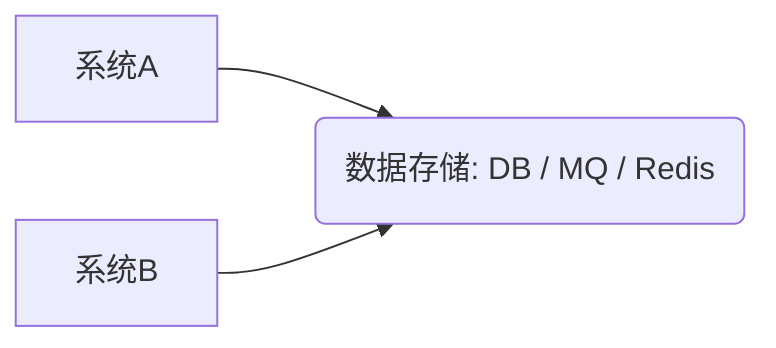
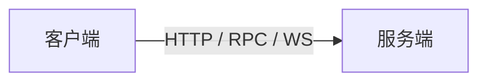
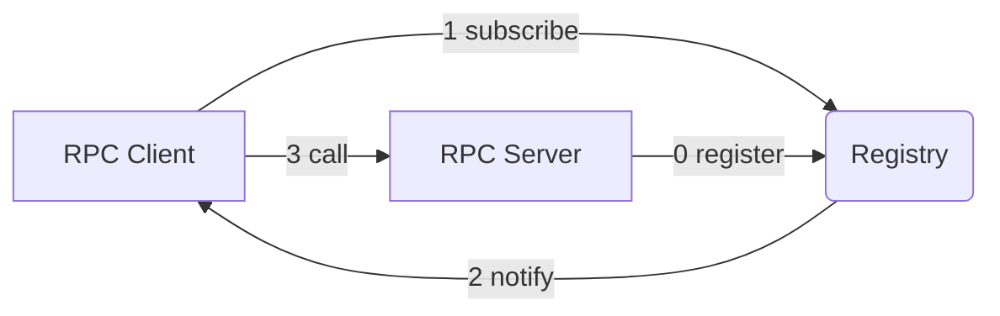
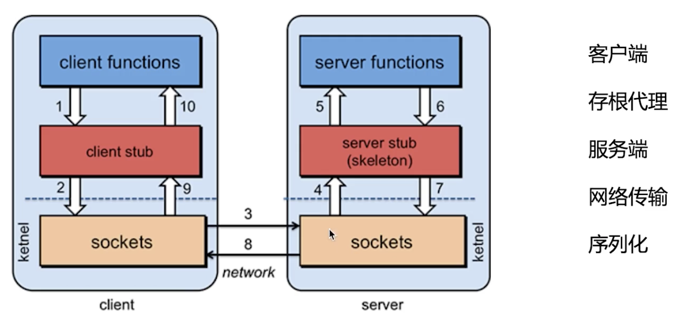
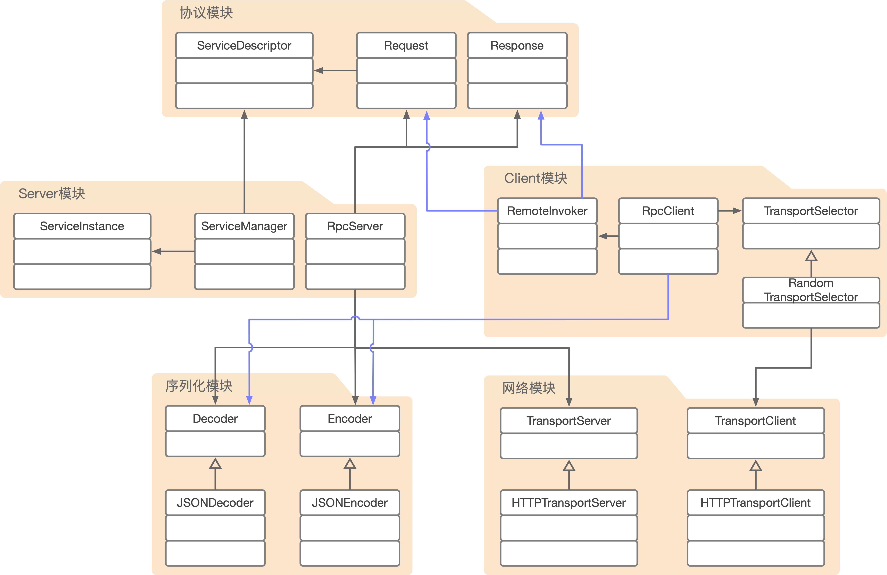
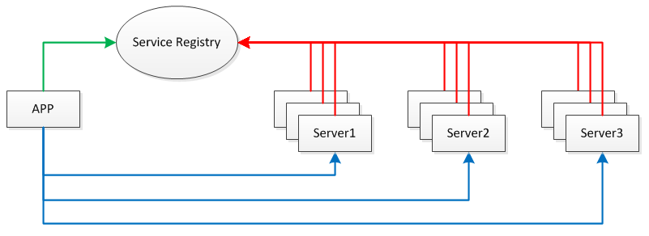

[视频](https://www.imooc.com/video/20234)

# 收获

> **通过该RPC项目的搭建，你可以学到**

+ 如果你想让自己的Java基础知识得到运用，那么，来做一个 RPC 框架吧

+ 如果你想对Java这门语言有更深刻的理解，那么，来学 Netty 吧

一个RPC的实现你可能要看两遍，甚至是几遍，因为牵扯到底层的东西，只有多看几遍，你才能深刻理解这些底层的设计架构，以及，如何去优化这个框架，都是值得商榷的问题。

1. 通过自己实现一个RPC框架，让我看到，一个实现了基本功能的框架需要哪些组件；
2. 随着对知识理解的加深，你可能追求更加优美的架构设计、更加丰富的功能；
3. 如果，一开始就直接看Dubbo的源码，你可能一头雾水，但是通过自己实现了一个RPC框架之后，可以拿自己的框架与市场上现有的比较优秀的RPC框架进行比较，在这个比较的过程中你会发现自己的设计的不足，以及如何丰富它的功能。这时候你再来看Dubbo的源码，会有一种恍然大悟的感觉。

# 简介

[课程地址](http://www.imooc.com/learn/1158)

在微服务、分布式盛行的时代，RPC在其中扮演者非常重要的角色。本课程将带大家从原理及实现上理解RPC框架。

1. 首先讲解RPC是什么，我们为什么需要RPC；
2. 进一步分析其核心原理，梳理其中会设计到的技术点，为我们后续造轮子做准备；
3. 然后从工程建立模块划分开始，接着定义协议、实现序列化、实现网络模块、实现server模块、实现client模块，
4. 开发完成之后利用自己的RPC开发一个具备分布式特效的计算器；
5. 最后对课程进行总结，难点分析，指出存在的不足以及解决方法。

其中涉及到`反射`，我们是自己实现的`ReflectUtil`，没有用JDK的`ReflectUtil`工具。

网络传输部分（transport），只是用的简单的IO，后期也可以引入`Netty`（Netty是一个传输模块，是对NIO的又一次封装），RPC框架最重要的部分就是IO，很容易称为远程调用的效率瓶颈，而用IO又绕不过Netty。

服务注册与发现也是自己实现的一个简单的模块，后期也可以用`ZooKeeper`等框架。

# 理论篇

本章中会对RPC的概念进行讲解，对比现有框架`grpc、thrift、duboo、hadoop-rpc`等，分析其优缺点加深对RPC的理解；剖析RPC的核心原理剖析；并对开发所需技术栈进行解释。

## RPC简介

RPC是远程过程调用（Remote Procedure Call）的缩写形式。是分布式系统常见的一种通信方法，从跨进程到跨物理机已经有几十年的历史。

IPC（跨进程）交互形式：RESTful、WebService、HTTP、基于DB作数据交换、基于MQ作数据交换、以及RPC。

既然有了HTTP为什么还要RPC呢？这就相当于普通话和方言一样。

**依赖中间件做数据交互**：

+ `MySQL、RabbitMQ、Kafka、Redis`

**直接交互**：

+ `RESTful、WebService、RPC、HTTP`

**Stub**：存根、服务描述

## 现有框架对比

**现有框架对比**：

|          |     gRPC      |   thrift    |     RMI     |   dubbo   | HadoopRPC  |
| :------: | :-----------: | :---------: | :---------: | :-------: | :--------: |
| 开发语言 |    多语言     |   多语言    |    Java     |   Java    |    Java    |
|  序列化  |   protobuf    | thrift 格式 | Java 序列化 | hession2  | R/Writable |
| 注册中心 |       X       |      X      |  JDK 自带   |   Zk 等   |     X      |
|  跨语言  |       √       |      √      |      X      |     X     |     X      |
| 服务定义 | Protobuf 文件 | Thrift 文件 |  Java 接口  | Java 接口 | Java 接口  |
| 服务治理 |       X       |      X      |      X      |     √     |     X      |

## 核心原理

> **核心原理（整体架构）：**

+ **Server**：Provider 暴露服务，服务提供方
+ **Client**：Consumer 服务消费，调用远程服务
+ **Register**：服务注册与发现

其实这里的注册中心不是必须的，Client可以把Server的信息直接写死到Client中，然后直接去调用Server。所以这里的`call`才是RPC最关键的一步。

**过程 3 描述**：

Client在通过sockets传输数据之前，需要将所要传输的对象转换为二进制数据，比如图中的步骤2，那么这个过程就叫做`序列化`。那么步骤4则为`反序列化`。反序列化后的对象中包含了客户端要调用的服务端的信息（调用哪个接口（即存根），以及接口中的方法，方法中参数的类型，返回值的类型，实参），紧接着，server会找到具体实现类的对象（通常考虑到性能，会采用单例模式），找到对象之后，会通过反射调用这个方法，方法调用完成即可拿到计算的结果。拿到计算结果之后，server会将结果数据序列化为二进制数据（对应图中步骤7），然后传给client。

在这个过程中，有几个比较关键的点：

+ 步骤3、8网络传输，所以说RPC中肯定要有一个网络模块
+ 还有序列化模块，用于对象和二进制数据之间的转换
+ client是如何通过调用一个接口就能调用远程方法的呢？其实，client 内部有一个存根的代理对象，而网络交互、序列化操作都是由该代理对象来完成的。
+ server端中肯定要有一个对服务进行管理的组件，来完成服务的查找，服务的反射调用

## 技术栈

> **基础知识**

JavaCore、Maven、反射

Maven是一个依赖管理工具，这里会用到它的一些比较高级的功能—`Maven多模块管理`，因为我们的RPC框架会分为几块，利用多模块管理，整个工程结构看起来会比较清晰。

> **动态代理**

利用动态代理生成client存根实际调用对象。

这里用Java自带的动态代理，当然也有其他的动态代理的框架，如ASM、Javassist（这些用起来比Java自带的难一些，因为涉及到字节码的问题）

**为什么其他的比较麻烦还要用？**

+ 这些框架主要的作用是动态地修改和创建Class，而动态代理只是它们自带的一个功能
+ 此外，JDK动态代理的一个局限性就是它只能代理接口，而这些框架是不存在这些问题的

> **序列化**

用于对象和二进制数据之间的转换

这里用阿里的 fastjson

> **网络通信**

用来传输序列化之后的二进制数据

这里选择 HTTP（通常采用TCP长连接）

在Server端还要用到Jetty，将其嵌入到我们的程序中

客户端用JDK自带的 URLConnection

其实网络编程还是挺难的，也有一些优秀的框架，像Netty这些，但是不要担心，我们接下来要开发的这个RPC框架对网络层做了一层抽象，我们可以很方便地把底层HTTP换成这些框架，或者直接使用Socket。

# 实战篇

本章会正式进入RPC框架阶段。首先对关键模块及核心类进行说明；然后按照工程初始化、协议模块、通用模块、序列化模块、网络模块、server模块、client模块进行开发；最后使用自己开发的RPC框架做一个分布式计算器。

1. 实现创建工程、制定协议、通用工具方法
2. 实现序列化模块
3. 实现网络模块
4. 实现Server模块
5. 实现Client模块（这里会用到动态代理，在代理对象内部会通过网络通信与server之间尽心交互）
6. gk-rpc使用案例

> **RPC架构图**

Server模块主要是描述Server与Client之间通信的协议

# 总结篇

回顾开发过程涉及知识点总结，对难点知识进行重点说明，最后指明我们开发的RPC框架存在的不足以及解决方法。

# NettyRpc

跟真正的Dubbo之间有啥区别？

## **项目简介**

[该项目](https://www.cnblogs.com/luxiaoxun/p/5272384.html)是[轻量级分布式 RPC 框架](https://my.oschina.net/huangyong/blog/361751)基础上的改进，作者用 Zookeeper、Netty 和 Spring写了一个轻量级的分布式RPC框架，可以算是一个简易版的[dubbo](http://dubbo.io/)，麻雀虽小，五脏俱全。

新增加的特性：

- 异步调用，支持[Future机制](https://www.jianshu.com/p/43dab9b7c25b)机制，支持回调函数`callback`
- 客户端使用 TCP 长连接（在多次调用共享连接）
- TCP心跳连接检测
- 服务端异步多线程处理RPC请求
- 支持不同的 load balance 策略
- 支持不同的序列化/反序列化

> **原项目技术选型**

RPC 可基于 HTTP 或 TCP 协议，Web Service 就是基于 HTTP 协议的 RPC，它具有良好的跨平台性，但其性能却不如基于 TCP 协议的 RPC。有两方面会直接影响 RPC 的性能，一是`传输方式`，二是`序列化`。

众所周知，TCP 是传输层协议，HTTP 是应用层协议，而传输层较应用层更加底层，在数据传输方面，越底层越快，因此，在一般情况下，TCP 一定比 HTTP 快。就序列化而言，Java 提供了默认的序列化方式，但在高并发的情况下，这种方式将会带来一些性能上的瓶颈，于是市面上出现了一系列优秀的序列化框架，比如：[Protostuff](https://blog.csdn.net/oppo5630/article/details/80173520)、Kryo、Hessian、Jackson 等，它们可以取代 Java 默认的序列化，从而提供更高效的性能。

为了支持高并发，传统的阻塞式 IO 显然不太合适，因此我们需要异步的 IO，即 NIO。Java 提供了 NIO 的解决方案，Java 7 也提供了更优秀的 NIO.2 支持，用 Java 实现 NIO 并不是遥不可及的事情，只是需要我们熟悉 NIO 的技术细节。

我们需要将服务部署在分布式环境下的不同节点上，通过服务注册的方式，让客户端来自动发现当前可用的服务，并调用这些服务。这需要一种`服务注册表（Service Registry）`的组件，让它来注册分布式环境下所有的服务地址（包括：主机名与端口号）。

应用、服务、服务注册表之间的关系见下图：

每台 Server 上可发布多个 Service，这些 Service 共用一个 host 与 port，在分布式环境下会提供 Server 共同对外提供 Service。此外，为防止 Service Registry 出现单点故障，因此需要将其搭建为集群环境。

本文将为您揭晓开发轻量级分布式 RPC 框架的具体过程，该框架基于 `TCP 协议`，提供了 NIO 特性，提供高效的序列化方式，同时也具备服务注册与发现的能力。

**根据以上技术需求，我们可使用如下技术选型**：

1. **Spring**：它是最强大的依赖注入框架，也是业界的权威标准。
2. **Netty**：它使 NIO 编程更加容易，屏蔽了 Java 底层的 NIO 细节。
3. **Protostuff**：它基于 Protobuf 序列化框架，面向 POJO，无需编写 .proto 文件。
4. **ZooKeeper**：提供服务注册与发现功能，开发分布式系统的必备选择，同时它也具备天生的集群能力。

相关 Maven 依赖请见附录。

