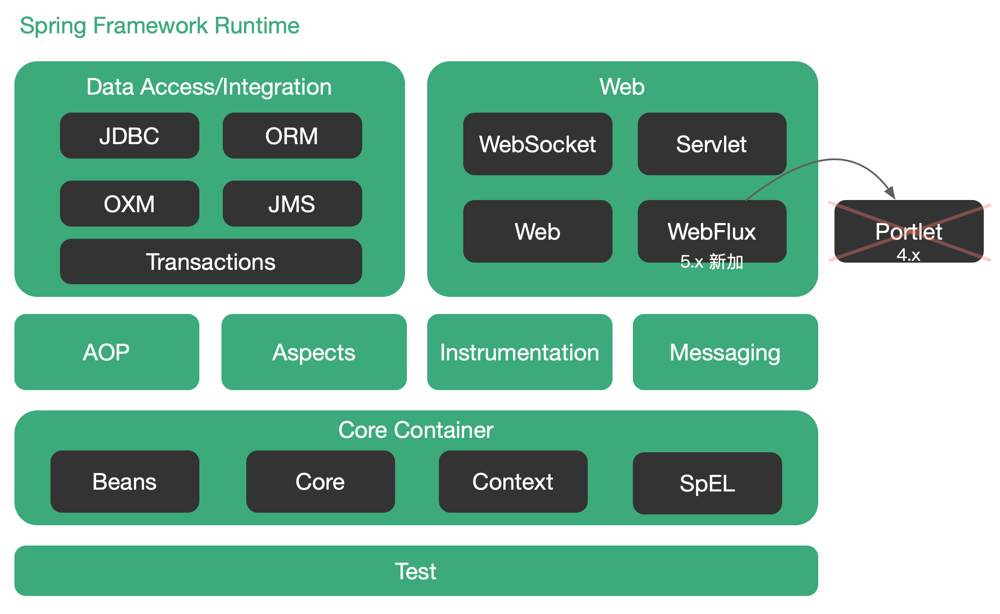

怎么产生Bean

我们怎么获取Bean

实现FactoryBean接口产生Bean

BeanFactory获取Bean


## 前言

[spring、springMvc、springBoot和springCloud的联系与区别](https://blog.csdn.net/alan_liuyue/article/details/80656687)

[Spring是如何做到解耦的](https://blog.csdn.net/Mr_haixin/article/details/80914342)

[从IOC方面谈谈我个人对Spring方便解耦这点的理解](https://blog.csdn.net/weixin_41866960/article/details/83994137)


## Spring 简介

Spring 是一种轻量级开发框架，旨在提高开发人员的开发效率以及系统的可维护性。Spring 官网：https://spring.io/。

我们一般说 Spring 框架指的都是 Spring Framework，它是很多模块的集合，使用这些模块可以很方便地协助我们进行开发。**这些模块包括**：`核心容器`、`数据访问/集成`、`Web`、`AOP`、`工具`、`消息`和`测试`模块。

比如：Core Container 中的 Core 组件是Spring 所有组件的核心，Beans 组件和 Context 组件是实现 IOC 和 DI 的基础，AOP组件用来实现面向切面编程。

**Spring 官网列出的 Spring 的 6 个特征**：

- **核心技术** ：依赖注入(DI)，AOP，事件(events)，资源，i18n，验证，数据绑定，类型转换，SpEL。
- **测试** ：模拟对象，TestContext框架，Spring MVC 测试，WebTestClient。
- **数据访问** ：事务，DAO支持，JDBC，ORM，编组XML。
- **Web支持** : Spring MVC 和 Spring WebFlux Web框架。
- **集成** ：远程处理，JMS，JCA，JMX，电子邮件，任务，调度，缓存。
- **语言** ：Kotlin，Groovy，动态语言。

> **Spring 模块**

下图对应的是 Spring 5.x 版本，将4.x版本中Web模块的 Portlet 组件废弃，同时添加了用于异步响应式处理的 WebFlux 组件。



各个组件解释如下：

+ **Spring Core**：基础组件，Spring 其他所有功能都需要依赖该类库，主要提供 IoC 功能。
+ **Spring Aspects**：该模块为与 AspectJ 的集成提供支持。
+ **Spring AOP**：提供面向切面编程。
+ **Spring JDBC**：Java数据库连接。
+ **Spring JMS**：Java消息服务。
+ **Spring ORM**：用于支持 Hibernate 等ORM工具。
+ **Spring Web**：为创建Web应用程序提供支持。
+ **Spring Test**：提供了对 JUnit 和 TestNG 测试的支持。


## IoC / DI

[Spring IOC 容器源码分析](https://javadoop.com/post/spring-ioc)

[Dependency injection ](https://link.zhihu.com/?target=https%3A//en.wikipedia.org/wiki/Dependency_injection) 

[Inversion of Control Containers and the Dependency Injection pattern](https://link.zhihu.com/?target=https%3A//martinfowler.com/articles/injection.html)


`Ioc(Inverse of Control)`控制反转是一种设计思想，就是将原本在程序中⼿动创建对象的控制权，交由Spring框架来管理。Ioc 在其他语言中也有应用，并非 Spring 特有。

要了解`控制反转( Inversion of Control )`，有必要先了解软件设计的一个重要思想：`依赖倒置原则（Dependency Inversion Principle ）`。

这个例子真的对吗，重新找一下依赖倒置原则的文章。

+ [Spring IoC的理解](https://www.zhihu.com/question/23277575/answer/169698662) 该文讲解了从依赖倒置原则到 IoC，并通过一个建造汽车的例子生动形象地对这些概念进行了说明。

```java
Class Car{
  	private Framework framework;
  	Car(){
      	this.framework = new Framework();
    }
}

Class Framework{
  	private Bottom bottom;
  	Framework(){
      	this.bottom = new Bottom();
    }
}

Class Bottom {
  	private Tire tire;
  	Bottom(){
      	this.tire = new Tire();
    }
}

Class Tire {
  	private int size;
  	Tire(){
      	this.size = 30;
    }
}
```

`控制反转（IoC）`，就是上层控制下层，而不是下层控制着上层。我们用`依赖注入`这种方式来实现控制反转。

所谓`依赖注入`，就是把底层类作为`参数`传入上层类，实现上层类对下层类的“控制”。这里我们用构造方法传递的依赖注入方式重新写 Car 类的定义：

```java
Class Car{
  	private Framework framework;
  	Car(Framework framework){
      	this.framework = framework;
    }
}

Class Framework{
  	private Bottom bottom;
  	Framework(Bottom bottom){
      	this.bottom = bottom;
    }
}

Class Bottom {
  	private Tire tire;
  	Bottom(Tire tire){
      	this.tire = tire;
    }
}

Class Tire {
  	private int size;
  	Tire(){
      	this.size = 30;
    }
}
```

如果要修改`Tire`类的`size`为动态的，即：

```java
Tire(int size){
  	...
}
```

使用第一种方式定义的类，需要将所有依赖`Tire`的类都进行修改，比如：

```java
Class Bottom {
  	private Tire tire;
  	Bottom(int size){
      	this.tire = new Tire(size);
    }
}
```

而使用依赖注入的方式只需修改`Tire`即可，其他类不用修改：

```java
Class Tire {
  	private int size;
  	Tire(int size){
      	this.size = size;
    }
}
```

这显然是更容易维护的代码。不仅如此，在实际的工程中，这种设计模式还有利于`不同工作小组之间的协同合作和单元测试`：

+ 假如开发这四个类的分别是四个不同的小组，那么只要定义好接口，四个不同的小组可以同时进行开发而不相互受限制；
+ 而对于单元测试，如果我们要写Car类的单元测试，只需要Mock一下 Framework 类传入 Car 就行了，而不用把 Framework、Bottom、Tire 全部 new 一遍再来构造 Car。

这里我们采用的是`构造函数传入的方式`进行依赖注入。其实还有另外两种方法：`Setter传递`和`接口传递`。这里就不多讲了，核心思路都是一样的，都是为了实现`控制反转`。

**依赖注入之 Setter 传递**：

```java
Class Car {
  	private Framework framework;
  	public void setFramework(Framework framework){
      	this.framework = framework;
    }
}
```

**依赖注入之接口传递**：

```java
Interface Framework {
  	...
}

Class Car {
  	private Framework framework;
  	Car(Framework framework){
      	this.framework = framework;
    }
}

Class BMWFramework implements Framework {
  	...
}
```


> **IoC 容器**

IoC 容器是 Spring ⽤来实现 IoC 的载体， IoC 容器实际上就是个 `Map(key, value)`，Map 中存放的是各种对象。

用刚才的例子来解释什么是IoC容器，如果我们要创建一个Car对象：

```java
int size = 40;
Tire tire = new Tire(size);
Bottom bottom = new Bottom(tire);
Framework framework = new Framework(bottom);
Car car = new Car(framework);
```

可以看到，因为采用了依赖注入，在初始化的过程中就不可避免地会写大量的new，那么IoC容器就解决了这个问题。

>**IoC Container的好处**

1. IoC容器可以自动对代码进行初始化，我们只需维护一个Configuration(XML或者一段代码)，而不用每次初始化一辆车都要亲手去写那一大段初始化的代码。

2. 在创建实例的时候不需要了解其中的细节。
	+ 在上面的例子中，我们自己手动创建一个Car 实例时，是从底层往上层new的
	+ 这个过程中，我们需要了解整个  Car/Framework/Bottom/Tire 类构造函数是怎么定义的，才能一步一步new/注入：
	+ 
	+ 而 IoC Container 在进行这个工作的时候是反过来的，它先从最上层开始往下找依赖关系，到达最底层之后再往上一步一步new（有点像深度优先遍历）：
	+ 

这里IoC Container可以直接隐藏具体的创建实例的细节，在我们来看它就像一个工厂：


我们就像是工厂的客户。我们只需要向工厂请求一个Car实例，然后它就给我们按照Config创建了一个Car实例。我们完全不用管这个Car实例是怎么一步一步被创建出来。

> 总结

将对象之间的相互依赖关系交给IoC容器来管理，并由IoC容器完成对象的注入。这样做的好处是可以很大程度简化应用程序的开发。

IoC就像一个工厂一样，当我们需要创建一个对象的时候，只需配置配置文件/注解即可，完全不用考虑对象是如何被创建出来的。

+ 所以，当使用Spring容器时，我们在写代码时很少会通过 `new` 来创建一个对象，我们只需配置相关文件，就可将创建对象的任务交给Spring
+ Spring 不仅会创建对象，还会对创建的对象进行管理等等，这些都是 Spring 要做的事

+ 在实际项目中，如果我们自己用 new 的方式创建对象，一个Service类可能有几百甚至上千个类作为它的底层，加入我们需要实例化这个Service，可能每次都要搞清楚该Service所有底层类的构造函数，这个工作量是巨大的，如果用IoC，只需配置好，然后在需要的地方引用即可，这样大大降低了开发难度且增加了项目的可维护性。


## IoC 源码解析

[原文](https://javadoop.com/post/spring-ioc)


## AOP

>**AOP简介**


在软件行业，AOP为`Aspect Oriented Programming` 的缩写，意为：面向切面编程，通过预编译方式和运行期动态代理 功能的统一维护的一种技术。

AOP 是 OOP（面向对象编程）的延续，是软件开发中的一个热点，也是Spring框架中的一个重要内容，是函数式编程的一种衍生范型。

> **Why AOP ?**

AOP解决的是 非业务代码抽取的问题。

+ 对重复的非业务代码进行抽取，在运行的时候往业务方法上动态植入“切面类代码”。

+ 采用`横向抽取`机制，取代了传统`纵向继承`体系重复性代码。

利用AOP可以对业务逻辑的各个部分进行隔离，从而使得业务逻辑各个部分之间的耦合度降低，提高程序的可重用性，同时提高开发效率。

Spring AOP 使用纯 Java 实现，不需要专门的编译过程和类加载器，在运行期通过`代理方式`向目标类`织入增强代码`。

`AspectJ​` 是一个基于 Java 语言的AOP框架，Spring2.0 开始，Spring AOP 引入对 ​`Aspect​` 的支持，$AspectJ$ 扩展了Java语言，提供了一个专门的编译器，在编译时提供横向代码的织入 。

> **AOP应用场景**

经典应用：`事务管理、性能监视、安全检查、缓存、日志等`。

在业务系统里除了要实现业务功能之外，还要实现如权限拦截、性能监控、事务管理等非业务功能。

通常的作法是非业务的代码穿插在业务代码中，从而导致了业务组件与非业务组件的耦合。

aop 面向切面编程，就是将这些分散在各个业务逻辑代码中的非业务代码，通过横向切割的方式抽取到一个独立的模块中，从而实现业务组件与非业务组件的解耦。

**高内聚**：单一责任原则

但是日志一般不用AOP写，日志一般都是写死的，一个方法里，不同位置处，有可能用的日志不同，它需要判断语句，另外日志是很常用的，一般占整体代码的4%。

> **AOP术语**


**Target（目标类）**：需要被代理的类

+ 例如： 上面的 UserSerrvice

**Joinpoint（连接点）**：官方说法（指那些被拦截到的点），即那些可能被连接的目标类的方法

+ 例如： UserSerrvice的所有方法

**PointCut（切入点）**：官方说法（我们要对哪些Joinpoint进行拦截），即已经被增强的连接点

+ 例如：addUser( )

**Advice（通知/增强）**：增强代码

+ 例如：before、after

**Weaving（织入）**：指把增强advice应用到目标对象target来创建新的代理对象的过程

**Proxy（代理）**：一个类被AOP增强后，就产生一个结果代理类

**Aspect（切面）**：是切入点PointCut和通知advice的集合

+ 一条线是一个特殊的面


>AOP代码示例

下面通过具体的例子来讲解一下AOP的实现...

例如有下面这个方法：

```java
//保存一个用户
public void add(User user) {
  	Session session = null;
  	Transaction trans = null;
  	try{
      	session = HibernateSessionFactoryUtils.getSession();  //关注点代码
      	trans = session.beginTransaction();  //关注点代码
      
      	session.save(user);  //『核心业务代码』
      
      	trans.commit; //关注点代码
    }catch (Exception e){
      	e.printStackTrace();
      	if(trans != null){
          	trans.rollback();  //关注点代码
        }
    }finally{
      	HibernateSessionFactoryUtils.closeSession(session);  //关注点代码
    }
}
```

上面的代码其实最核心的就一行代码：保存 user 对象到数据库中

```java
session.save(user);
```

我们的数据库表肯定不止 user 一张表，对数据库的操作除了 add() 方法还有 删、改、查等。

所以我们可以想象到：对数据库的每次操作，都要写「开启事务」和「关闭事务」这种代码。

这种代码对我们来说是重复的，于是我们会想把这种代码给「**抽取**」出来。

如果我们单纯用 OOP（面向对象）的思想去把非业务代码封装起来，最终我们的效果可能是这样的：

```java
public class UserDao() {
  	AOP aop;
  	public void save() {
      	aop.begin();
      	System.out.println("DB:保存用户");
      	aop.close();
    }
}
```

即使这样看起来代码已经很少了，但我们细想会发现，这样做只是对原来的非业务代码进行了封装，但是最终 update()/delete() 方法同样也会有`aop.begin();`这样的重复的代码。

而我们的目的就是彻底消除这样的代码（明面上看不到），但是仍然可以实现原来的功能，那么就要用到「动态代理」，通过动态代理，将非业务代码写在要「增强」的逻辑上。

```java
public class ProxyFactory {
  	//维护目标对象
  	private static Object target;
  	//维护关键点代码的类
  	private static AOP aop;
  
  	public static Object getProxyInstance(Object target_, AOP aop_) {
      	//目标对象和关键点代码的类都是通过外界传递进来
      	target = target_;
        aop = aop_;
      	
      	return Proxy.newProxyInstance(
            target.getClass().getClassLoader(),
            target.getClass().getInterfaces(),
            new InvocationHandler(){
								@Override
              	public Object invoke(Object proxy, Method method, Object[] args) throws Throwable{
                  	aop.begin();
                  	Object returnValue = method.invoke(target, args);
                  	aop.close();
                  
                  	return returnValue;
                }
            }
        );
    }
}
```

完了以后，我们就可以通过「代理对象」去调用方法，最终屏蔽掉「重复代码」

```java
public class App {
  	public static void main(String[] args) {
      	ApplicationContext ac = new ClassPathXmlApplicationContext("dao/applicationContext.xml");
      	IUser iUser = (IUser)ac.getBean("proxy");
      	iUser.save();
    }
}
```

上面是 DIY 的代理来实现对「非业务代码的」的抽取，类似这样的场景还有很多，比如权限控制、对参数进行校验等等。

Spring AOP让我们可以不用自己手动去写代理对象，达到将「非业务代码」的抽取的效果。

下面是使用Spring AOP实现的代码：

```java
@Component
@Aspect  // 指定为切面类
public class AOP{
  
  	// 里面的值为切入点表达式
  	@Before("execution(* dao.*.*(..))")
  	public void begin() {
      	System.out.println("开始事务");
    }
  
  	@After("execution(* dao.*.*(..))")
  	public void close() {
      	System.out.println("关闭事务");
    }
}
```

其中：

```java
//接口（在dao包下）
public interface IUser {
  	void save();
}
```

```java
//实现类（在dao包下）
@Component
public class UserDao implements IUser {
  	@Override
  	public void save(){
      	System.out.println("DB:保存用户");
    }
}
```

测试：

```java
public class APP {
  	public static void main(String[] args) {
      	ApplicationContext ac = new ClassPathXmlApplicationContext("dao/applicationContext.xml");
      	//这里得到的是代理对象
      	IUser iUser = (IUser)ac.getBean("userDao");
      	System.out.println(iUser.getClass());
      	iUser.save();
    }
}
```


## @annotation

[视频](https://www.bilibili.com/video/BV1oW41167AV?p=1)

[Spring/SpringBoot常用注解总结](https://zhuanlan.zhihu.com/p/135987318)

> 注解相当于一种标记，加上注解之后，Javac编译器开发工具和其他程序可以用反射来了解你的类以及各种元素上有无任何标记，看你有什么标记，就去干相应的事


### @interface

> 自定义注解

Java 用 `@interface Annotation{ }` 定义一个注解 `@Annotation`，一个注解是一个类。


### @Configuration

### @ComponentScan

### @Filter

### @Bean

### @Scope

### @Lazy

```java
//配置类==配置文件
@Configuration  //告诉Spring这是一个配置类
@ComponentScan(value="com.zhr",
               excluderFilters = {@Filter(type = FilterType.ANNOTATION, classes = Controller.class)
                                  @Filter(type = FilterType.ASSIGNABLE_TYPE, classes = BookService.class)
                                 }
              ) 
public class MainConfig {
  	//给容器中注册一个Bean，类型为返回值的类型，默认用方法名作为id
  	@Scope("prototype")
  	@Lazy
  	@Bean("person")
  	public Person person(){
      	return new Person("adads",20);
    }
}
```


测试：

```java
public class MainTest {
  	public static void main(String[] args){
      	AnnotationConfigApplicationContext applicationContext = new AnnotationConfigApplicationContext(MainConfig.class);
      	applicationContext.getBean(Person.class);
    }
}
```


<font color=DarkOrchid>**ex/includerFilters**</font>

`excluderFilters` 代表排除的组件过滤器，实际是一个数组。

相反，也有includerFilters，但是要加上useDefaultFilters = false，因为useDefaultFilters = ture代表默认扫描整个包，如下：

```java
@ComponentScan(value="com.zhr",
               includerFilters = {@Filter(type=FilterType.ANNOTATION, classes = Controller.class)},
               useDefaultFilters = false
              )
```

<font color=DarkOrchid>**type**</font>

> type表示按照什么规则进行过滤

FilterType.**ANNOTATION** ：按照注解

FilterType.**ASSIGNABLE_TYPE** ：按照给定的类型

这里排除@Controller标注的类和BookService类型的组件

此外还有：

FilterType.**ASPECTJ** ：使用ASPECTJ表达式，该规则不常用

FilterType.**REGEX** ：使用正则表达式

FilterType.**CUSTOM** ：自定义规则，需要实现 TypeFilter 接口

下面讲一下自定义规则：

```java
public class MyTypeFilter implements TypeFilter {
  	//MetadataReader 获取当前正在扫描的类的类信息
  	//MetadataReaderFactory 获取到其他任何类信息
  	@Override
  	public boolean match(MetadataReader metadataReader, MetadataReaderFactory metadataReaderFactory) throws IOException{
      	//获取当前类注解的信息
      	AnnotationMetadata annotationMetadata = metadataReader.getAnnotationMetadata();
      	
      	//获取当前正在扫描的类的类信息
      	ClassMetadata classMetadata = metadataReader.getClassMetadata();
      
      	//获取当前资源（类路径）
      	Resource resource = metadataReader.getResource();
      
      	String className = classMetadata.getClassName();
      	System.out.println("--->"+className);
      
      	if(className.contains("er")){  //包含 “er” 的
          	return true;
        }
      	return false;	
    }
}
```

使用：

```java
type = FilterType.CUSTOM, classes = {MyTypeFilter.class}
```


<font color=DarkOrchid>**@Scope 作用域**</font>

**singleton**：单实例的（默认）

+ Ioc 容器启动会调用方法创建对象，以后每次获取直接从容器（通过`map.get()`）中拿

**pototype**（原型）：

+ 每次通过 Spring 容器获取 `prototype` 定义的 Bean 时，容器都会创建一个新的 Bean 实例。 

**request**：同一次请求创建一个实例

**session**：同一个`session`创建一个实例

<font color=DarkOrchid>**@Lazy**</font>

单实例下...

懒加载，对应`懒汉模式`，不加 `@Lazy` **默认**是`饿汉模式`

加 @Lazy 变为懒加载后，容器启动不创建对象，第一次使用（获取）Bean创建对象，并初始化。


### @Conditional

> 该注解是 Spring Boot 底层大量使用的注解

[原文1](https://www.cnblogs.com/haha12/p/11304738.html)  [原文2](https://www.cnblogs.com/cxuanBlog/p/10960575.html)

它的作用是根据某个条件创建特定的 Bean。通过实现Condition接口，并重写matches方法来构造判断条件，满足条件则在容器中注册 Bean

<font color=DarkOrchid>**@Conditional的源码**</font>

```java
@Target({ElementType.TYPE, ElementType.METHOD})  //该行表示可以标在类上也可以标在方法上
@Retention(RetentionPolicy.RUNTIME)
@Documented
public @interface Conditional {
  	Class<? extends Condition>[] value();
}
```


```java
@Configuration 
@ComponentScan(value="com.zhr",
               excluderFilters = {@Filter(type = FilterType.ANNOTATION, classes = Controller.class)}) 
@Conditional({WindownsCondition.class}) //也可以放在类上，表示满足条件，这个类中所有Bean注册才能生效
public class MainConfig {
  	
  	@Scope("prototype")
  	@Lazy
  	@Bean("person")
  	public Person person(){
      	return new Person("adads",20);
    }
  
  	/**
  	 * 如果是Window系统，给容器中注册“bill”
  	 * 如果是Linux系统，给容器中注册“linus”
  	 */
  	@Conditional({WindownsCondition.class})
  	@Bean("bill")
  	public Person person01(){
      	return new Person("Bill Gates",62);
    }
  	
  	@Conditional({LinuxCondition.class})
  	@Bean("linus")
  	public Person person02() {
      	return new Person("linus",48);
    }
}
```


继承 Condition 接口，重写 matches()

```java
public class WindownsCondition extends Condition() {
  	@Override
  	public boolean matches(ConditionContext context, AnnotatedTypeMetadata annotatedTypeMetadata){
      	//ConfigurableListableBeanFactory beanFactory = context.getBeanFactory();
      	//ClassLoader classLoader = context.getClassLoader();
        BeanDefinitionRegistry registry = context.getRegistry(); //获取到Bean定义的注册类
      	Environment environment = context.getEnvironment();  //获取环境
      
        boolean definition = registry.containsBeanDefinition("person"); //如果容器中有person则注册 Bill Gates
      
      	//运行环境是Windows则注册 Bill Gates
      	String property = environment.getProperty("os.name");
      	if(property.contains("Windows")){
          	return true;
        }
      	return false;
    } 	
}
```

```java
public class LinuxCondition extends Condition() {
  	@Override
  	public boolean matches(ConditionContext context, AnnotatedTypeMetadata annotatedTypeMetadata){
      
      	String property = environment.getProperty("os.name");
      	if(property.contains("Linux")){
          	return true;
        }
      	return false;
    } 	
}
```

测试：

```java
public class MainTest {
  	public static void main(String[] args){
      	AnnotationConfigApplicationContext applicationContext = new AnnotationConfigApplicationContext(MainConfig.class);
      
      	ConfigurableEnvironment environment = applicationContext.getEnvironment(); //拿到运行环境
      	String property = environment.getProperty("os.name");  //获取系统名字
      	String[] namesForType = applicationContext.getBean(Person.class); //获取装载的类
    }
}
```


### @Import

给容器中注册组件的几种方式：

+ 包扫描+组件标注注解（@Controller\@Service等）
+ @Bean  导入的第三方包里面的组件
+ @Import  快速给容器中导入一个组件
+ 使用Spring提供的FactoryBean(工厂Bean)

<font color=DarkOrchid>**@Import**</font>

@Import源码

```java
@Target(ElementType.TYPE)
@Retention(RetentionPolicy.RUNTIME)
@Documented
public @interface Import {
  	Class<?>[] value();
}
```

```java
public class Color(){}
```

```java
public class Size(){}
```

测试：

```java
@Configuration 
@Import({Color.class, Size.class}) 
public class MainConfig {}
```

<font color=DarkOrchid>**ImportSelector**</font>

> 返回要导入的组件的全限定类名数组

```java
//自定义逻辑返回需要导入的组件
public class MyImportSelector implements ImportSelector {
  	//返回值就是要导入容器中的组件的全限定类名
  	//AnnotationMetadata：当前标注@Import注解的类的所有注解信息
  	@Override
  	public String[] selectImports(AnnotationMetadata importingClassM){
      	return new String[]{};
    }
}
```

<font color=DarkOrchid>**ImportBeanDefinitionRegistrar**</font>

> 手动注册 bean 到容器中

默认获取的是工厂Bean调用getObject( ) 创建的对象

要获取工厂Bean本身，我们需要给 id 前加一个 &


### @Autowired

@Autowired 表示被修饰的类需要注入对象，Spring 会扫描所有被 @Autowired 标注的类，然后根据类型在 Ioc 容器中找到匹配的类注入。


### @Mapper

[Spring Boot 启动报错 Consider defining a bean of type 'com.example.springbootdruid.mapper.UserMapper' in your configurati](https://www.cnblogs.com/kingsonfu/p/10344388.html)

<font color=DarkOrchid>**有两种方式两种方式**</font>

① **@Mapper注解：**

+ 在接口类上添加@Mapper，在编译之后会生成相应的接口实现类

+ 在 dao.mapper 下的接口 UserMapper 上添加注解 @Mapper

+ ```java
	@Mapper
	public interface UserMapper {
	//    @Select("SELECT * FROM User")
	    List<User> queryAllUsers();
	}
	```

+ 如果想要每个接口都要变成实现类，那么需要在每个接口类上加上@Mapper注解，比较麻烦，解决这个问题用@MapperScan

② **@MapperScan：**

+ 指定要变成实现类的接口所在的包，然后包下面的所有接口在编译之后都会生成相应的实现类

+ 使用@MapperScan注解多个包

+ 启动类DemoApplication中添加 @MapperScan({"扫描路径"})  

+ ```java
	@SpringBootApplication
	@MapperScan("com.example.demo.dao.mapper")//使用MapperScan批量扫描所有的Mapper接口
	public class DemoApplication {
		public static void main(String[] args) {
			SpringApplication.run(DemoApplication.class, args);
		} 
	}
	```


### @RestController

> **简介**

`@Controller`标识一个 Spring 类是 Spring MVC Controller 处理器。

`@Controller`、`@RestController` 都是用来表示 Spring 某个类是否可以接收 HTTP 请求。

`@RestController`是`@Controller`和`@ResponseBody`的结合体，两个标注合并起来的作用。

+ [@ResponseBody & @RequestBody](https://blog.csdn.net/originations/article/details/89492884)

+ `@ResponseBody` 注解的作用是将 Controller 的方法返回的对象通过适当的转换器转换为指定的格式后，写入到 Http 响应（Response）对象的 body 中，通常用来返回 JSON 或者 XML 数据，返回 JSON 数据的情况比较多。


> **区别**

[原文](https://dzone.com/articles/spring-framework-restcontroller-vs-controller)

单独使用`@Controller`不加`@ResponseBody`的话，一般使用在要返回一个视图的情况下，这种情况属于比较传统的 Spring MVC 应用，对应于前后端不分离的情况。

`@RestController`返回JSON 或 XML 形式数据。但`@RestController` 只返回`对象`，对象数据直接以 JSON 或 XML 形式写入 HTTP 响应（Response）中，这种情况属于 RESTful Web 服务，也是目前最常用的方式（前后端分离）。

+ Spring 4 之前开发 RESTful Web 服务，需要使用`@Controller`并结合`@ResponseBody`注解。从 Spring 4 开始，使用`@RestController`。

**下面的步骤描述了一个典型的 Spring MVC REST工作流**：

1. 客户端以 URI 形式向 Web 服务器发送请求
2. 请求被`Dispatcher Servlet`拦截，它查找 `Handler Mapping`及其类型
	+ `application context` 文件中定义的`Handler Mapping`部分告诉`dispatcher servlet`使用哪一种策略来查找基于传入的请求控制器。
	+ Spring MVC 支持将请求 URI 映射到 Controller 的三种不同类型：注释、名称约定和显式映射。
3. 控制器处理请求，响应返回到`dispatcher servlet`，然后`dispatcher servlet`分派到视图。

当在方法上使用`@responsebody`注解时，Spring 会自动转换返回值并将其写入 Http 响应。控制器类中的每个方法都必须用`@responsebody`注释。


### LifeCycleOfBean 

**Bean的生命周期**：创建->初始化->销毁的过程

我们可以自定义初始化和销毁方法，Spring容器在进行到当前生命周期的时候调用我们自定义的初始化和销毁方法。

初始化：

+ 对象创建完成并赋值好，调用初始化方法

销毁：

+ 单实例。容器关闭的时候
+ 对实例。容器不会管理这个方法，容器不会调用销毁方法

<font color=DarkOrchid>**通过 @Bean 指定initMethod和destroyMethod**</font>

```java
@Configuration
public class MainConfigOfLifeCtcle {
  	
  	@Bean(initMethod="init",destroyMethod="destroy")
  	public Car car() {
      	return new car();
    }
}
```

```java
public class Car {
  	public Car() {}
  	public void init() {}
  	public void destroy() {}
}
```

<font color=DarkOrchid>**通过 Bean 实现InitializingBean 和 DiposableBean 接口定义初始化和销毁逻辑**</font>

```java
@Component
public class Cat implements InitializingBean, DisposableBean {
  	public Cat() {}
  	
  	@Override
  	public void destroy() throws Exception(){}
  
  	@Override
  	public void afterPropertiesSet() throws Exception(){}
}
```

<font color=DarkOrchid>**使用JSR250**</font>

@PostConstruct：在bean创建完成，并且属性赋值完成，来执行初始化方法

@PreDestroy：在容器销毁bean之前，通知我们进行清理工作

```java
@Component
public class Car {
  	public Car() {}
  
  	@PostConstruct
  	public void init() {}
  
  	@PreDestroy
  	public void destroy() {}
}
```

<font color=DarkOrchid>**使用BeanPostProcessor**</font>

BeanPostProcessor【interface】：bean的后置处理器，在bean的初始化前后进行一些处理工作

postProcessBeforeInitialization：在初始化前工作

postProcessAfterInitialization：在初始化后工作

```java
public class MyBeanPostProcessor implements BeanPostProcessor{
  	@Override
  	public Object postProcessBeforeInitialization(Object bean,String beanName) throws BeansException{
      	return null;
    }
  
  	@Override
  	public Object postProcessAfterInitialization(Object bean,String beanName) throws BeansException{
      	return null;
    }
}
```


### @Value

>属性赋值

使用@Value赋值

+ 基本数值
+ [SpEL（Spring Expression Language）](https://www.jianshu.com/p/e0b50053b5d3)，即Spring表达式语言
+ ${ }：可以去除配置文件中的值（在运行环境变量中的值）

```java
public class Person {
  
  	@Value("张三")
  	private String name;
  
  	@Value("#{20+5}")
  	private Integer age;
  
  	public String getName(){return name;}
  	public void setName(String name){this.name = name;}
  	public Integer getAge(){return age;}
  	public void setAge(Integer age){this.age = age;}
  	
}
```


### @Autowired

> 自动装配：Spring利用依赖注入（DI），完成对IoC容器中各个组件的依赖关系赋值

<font color=DarkOrchid>**Autowired**</font>

默认优先按照类型去容器中找对应的组件：applicationContext.getBean(UserDao.class); 找到就赋值

如果找到多个相同类型的组件，再将属性的名称作为组件的id去容器中找 applicationContext.getBean("bookDao");

@Primary：让Spring进行自动装配的时候，默认使用首选的bean，也可以继续使用@Qualifier指定需要装配的bean的名字

```java
public class UserService{
  	@Autowired
  	UserDao userdao;
}
```

使用@qualifier指定要装配的组件id，而不是让它默认使用属性名去找

```java
public class UserService{
  	@Qualifier("userdao2") //指定userdao2
  	@Autowired(required=false)  //required=false表示匹配不到也不会报错
  	UserDao userdao;
}
```


### @Resource

### @Inject

> @Resource\@Inject 和 @Autowired 作用相同，只是功能没有 @Autowired 丰富
>
> 此外，@Autowired 是 Spring 定义的，@Resource 和 @Inject  都是Java规范

<font color=DarkOrchid>**@Resource**</font>

> Spring还支持使用@Resource（JSR250）和@Inject（JSR330）

@Resource：可以和@Autowired一样实现自动装配，默认按照组件名称进行装配

它不能结合@Qualifier，不能支持@Primary，也没有required这些属性

```java
public class UserService{
  	@Resource(name="userdao2")
  	UserDao userdao;
}
```

<font color=DarkOrchid>**@Inject**</font>

需要导入

```xml
<dependency>
  	<groupId>javax.inject</groupId>
  	<artifactId>javax.inject</artifactId>
  	<version>1</version>
</dependency>
```

@Inject：其功能跟@Autowired也是一样的，但是没有 required=false


### @ConditionalOnMissingBean

当这个 bean 不存在的时候，这个类就生效


### @RequestMapping

[原文](https://blog.csdn.net/renanrenan/article/details/84654362)

在Spring MVC 中使用 `@RequestMapping` 来映射请求，也就是，通过它来指定控制器可以处理哪些URL请求，相当于如下Servlet中在web.xml中配置的映射作用一致。

```xml
<servlet>
    <servlet-name>servletName</servlet-name>
    <servlet-class>ServletClass</servlet-class>
</servlet>
<servlet-mapping>
    <servlet-name>servletName</servlet-name>
    <url-pattern>url</url-pattern>
</servlet-mapping>
```

`RequestMapping`注解类的源码：

```java
@Target({ElementType.METHOD, ElementType.TYPE}) // 可以在方法和类的声明中使用
@Retention(RetentionPolicy.RUNTIME)
@Documented
@Mapping
public @interface RequestMapping {
    String name() default "";
    String[] value() default {};
    String[] path() default {};
    RequestMethod[] method() default {};
    String[] params() default {};
    String[] headers() default {};
    String[] consumes() default {};
    String[] produces() default {};
}
```

可以看到注解中的属性除了 `name()` 返回的是字符串，其它的方法均返回数组，也就是可以定义多个属性值，例如 value() 和 path() 都可以同时定义多个字符串值来接收多个URL请求。


### @PathVariable

@PathVariable是spring3.0的一个新功能：接收请求路径中占位符的值

比如：

```java
@GetMapping({"/page/{pageNum}"})
public String page(HttpServletRequest request, @PathVariable("pageNum") int pageNum) {}
```

+ 其中 `@GetMapping({"/page/{pageNum}"}) `中的 `pageNum` 必须和 `@PathVariable("pageNum")`中的 `pageNum`保持一致；
+ 而后面的`int pageNum`则不要求必须一致。


## JUnit 

JUnit 单元测试