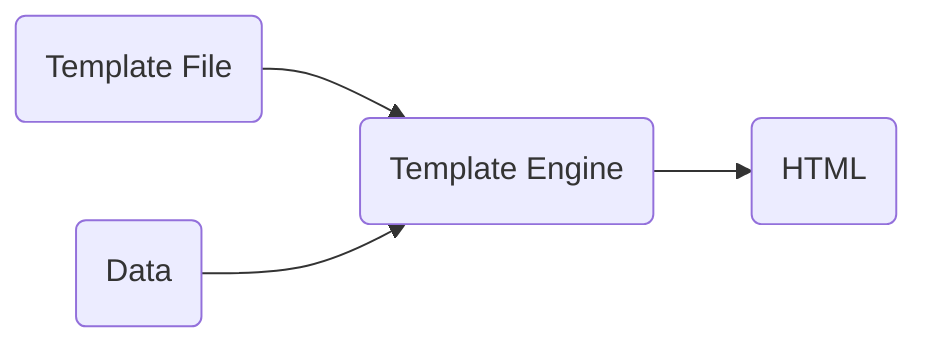
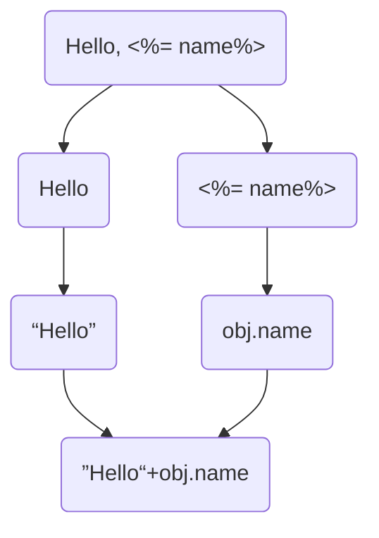

## 狂神SpringBoot视频及笔记

[SpringBoot视频](https://www.bilibili.com/video/BV1PE411i7CV)

> **笔记**

[狂神说SpringBoot01：Hello,World！原创:狂神说](http://mp.weixin.qq.com/s?__biz=Mzg2NTAzMTExNg==&mid=2247483724&idx=1&sn=77ce80187dbfdbaaafa0366f6a0c9151&scene=19#wechat_redirect)

[狂神说SpringBoot02：运行原理初探](http://mp.weixin.qq.com/s?__biz=Mzg2NTAzMTExNg==&mid=2247483743&idx=1&sn=431a5acfb0e5d6898d59c6a4cb6389e7&scene=19#wechat_redirect)

[狂神说SpringBoot03：yaml配置注入](http://mp.weixin.qq.com/s?__biz=Mzg2NTAzMTExNg==&mid=2247483744&idx=1&sn=b4ec762e71b2ddf9403c035635299206&scene=19#wechat_redirect)

[狂神说SpringBoot04：JSR303数据校验及多环境切换](http://mp.weixin.qq.com/s?__biz=Mzg2NTAzMTExNg==&mid=2247483750&idx=1&sn=d6758d00371bea97f92e4968d0d96fb9&scene=19#wechat_redirect)

[狂神说SpringBoot05：自动配置原理](http://mp.weixin.qq.com/s?__biz=Mzg2NTAzMTExNg==&mid=2247483766&idx=1&sn=27739c5103547320c505d28bec0a9517&scene=19#wechat_redirect)

[狂神说SpringBoot06：自定义starter](http://mp.weixin.qq.com/s?__biz=Mzg2NTAzMTExNg==&mid=2247483767&idx=1&sn=4c23abf553259052f335086dba1ce80c&scene=19#wechat_redirect)

[狂神说SpringBoot07：整合JDBC](http://mp.weixin.qq.com/s?__biz=Mzg2NTAzMTExNg==&mid=2247483785&idx=1&sn=cbf46019c14be7129bcd39002ab16706&scene=19#wechat_redirect)

[狂神说SpringBoot08：整合Druid](http://mp.weixin.qq.com/s?__biz=Mzg2NTAzMTExNg==&mid=2247483786&idx=1&sn=f5f4ca792611af105140752eb67ce820&scene=19#wechat_redirect)

[狂神说SpringBoot09：整合MyBatis](http://mp.weixin.qq.com/s?__biz=Mzg2NTAzMTExNg==&mid=2247483788&idx=1&sn=aabf8cf31d7d45be184cc59cdb75258c&scene=19#wechat_redirect)

[狂神说SpringBoot10：Web开发静态资源处理](http://mp.weixin.qq.com/s?__biz=Mzg2NTAzMTExNg==&mid=2247483796&idx=1&sn=ea13e2858328a582338e89c3459021c1&scene=19#wechat_redirect)

[狂神说SpringBoot11：Thymeleaf模板引擎](http://mp.weixin.qq.com/s?__biz=Mzg2NTAzMTExNg==&mid=2247483807&idx=1&sn=7e1d5df51cdeb046eb37dec7701af47b&scene=19#wechat_redirect)

[狂神说SpringBoot12：MVC自动配置原理](http://mp.weixin.qq.com/s?__biz=Mzg2NTAzMTExNg==&mid=2247483819&idx=1&sn=b9009aaa2a9af9d681a131b3a49d8848&scene=19#wechat_redirect)

[狂神说SpringBoot13：页面国际化](http://mp.weixin.qq.com/s?__biz=Mzg2NTAzMTExNg==&mid=2247483834&idx=1&sn=e28706bf0c3ded1884452adf6630d43b&scene=19#wechat_redirect)

[狂神说SpringBoot14：集成Swagger终极版](http://mp.weixin.qq.com/s?__biz=Mzg2NTAzMTExNg==&mid=2247483909&idx=1&sn=201ee629b9ce3b9276a263e18812e607&scene=19#wechat_redirect)

[狂神说SpringBoot15：异步、定时、邮件任务](http://mp.weixin.qq.com/s?__biz=Mzg2NTAzMTExNg==&mid=2247483918&idx=1&sn=afadfe906c5f15887fa8e7dad3c8980c&scene=19#wechat_redirect)

[狂神说SpringBoot16：富文本编辑器](http://mp.weixin.qq.com/s?__biz=Mzg2NTAzMTExNg==&mid=2247483924&idx=1&sn=8570554261d1829439eb8ecceabd1fe4&scene=19#wechat_redirect)

[狂神说SpringBoot18：集成SpringSecurity](http://mp.weixin.qq.com/s?__biz=Mzg2NTAzMTExNg==&mid=2247483957&idx=1&sn=fc30511490b160cd1519e7a7ee3d4ed0&scene=19#wechat_redirect)

## SpringBoot学习过程

[开涛SpringMVC + MyBatis学习笔记](https://github.com/brianway/springmvc-mybatis-learning)

[springmvc学习笔记(1)-框架原理和入门配置](https://github.com/brianway/springmvc-mybatis-learning/blob/master/springmvc/springmvc学习笔记(1)-框架原理和入门配置.md)

[Spring、SpringMVC、MyBatis、Spring Boot案例](https://github.com/lenve/JavaEETest)

Tips:

-  有了springmvc，我们就不用再写servlet了，也看不到很多servlet了，只能看到DispatcherServlet这个，并且就只需要注册一个前端控制器DispatcherServlet就行

搭建一个简单的springmvc项目: 使用maven搭建：


## WAR & JAR

> **war 包和 jar 包的区别**

1. **概念**

**war包**：war包是JavaWeb程序打的包，war包里面包括写的代码编译成的class文件、依赖的包、配置文件、所有的网站页面（包括html、jsp）等等。一个war包可以理解为是一个web项目，里面是项目的所有东西。

**jar包**：jar 包是`类`的归档文件，jar 文件格式以流行的 ZIP 文件格式为基础。与 ZIP 文件不同的是，JAR 文件不仅用于压缩和发布，而且还`用于部署和封装库、组件和插件程序`，并可被像编译器和 JVM 这样的工具直接使用。

2. **目录结构**

**jar包**里的com里放的就是class文件、配置文件，但是没有静态资源的文件，大多数 jar 文件包含一个 META-INF 目录，它用于存储包和扩展的配置数据，如安全性和版本信息。

**war包**里的WEB-INF里放的class文件和配置文件，META-INF和jar包作用一样，war包里还包含静态资源的文件。

3. **部署项目**

部署普通的Spring项目用war包，部署Springboot项目用jar包就可以，因为Springboot已经集成了Tomcat。

4. **总结**

war包和项目的文件结构保持一致，jar包则不一样。

jar包里没有静态资源的文件（index.jsp）


## @Annotation OR XML?

对于XML的引入，有些人觉得过于繁复，而对于注解的使用，会使得注解分布得到处都是，难以控制，有时候还需要了解很多框架的内部实现才能准确使用注解开发所需的功能。

这个时候大家形成了这样的一个不成文的共识：

+ 对于业务类使用注解，例如，对于MVC开发，控制器使用@Controller，业务层使用@Service，持久层使用@Repository；
+ 而对于一些公用的Bean，例如，对于数据库（如Redis）、第三方资源等则使用XML进行配置，直至今时今日这样的配置方式还在企业中广泛地使用着。

到了4.x的版本后甚至可以完全脱离XML，因此在Spring中使用注解开发占据了主流的地位。与此同时，Pivotal团队在原有Spring的基础上主要通过注解的方式继续简化了Spring框架的开发，它们基于Spring框架开发了Spring Boot，所以Spring Boot并非是代替Spring框架，而是让Spring框架更加容易得到快速的使用。


## Spring Initializr

> 通过`Spring Initializr`可以快速创建一个Spring Boot 项目。

**Project Metadata**

+ **Group**                         com.hory
+ **Artifact**                       mango-core         该行决定最终总项目名称
+ **Name**                         mango-core
+ **Package name**            com.zhr.mango.core


## Spring/MVC/Boot

**Spring、Spring MVC、Spring Boot 之间的区别？Spring Boot 本质是什么？**

> **关于 Spring**

**Spring** 框架就像一个家族，有众多衍生产品例如 Spring Boot、Spring Security、JPA等等。但他们的基础都是Spring 的 Ioc 和 AOP， Ioc 提供了依赖注入的容器 AOP ，解决了面向横切面的编程，然后在此两者的基础上实现了其他延伸产品的高级功能。

> **关于Spring MVC**

**Spring MVC** 是基于 Servlet 的一个 MVC 框架，要解决 Web 开发的问题，因为 Spring 的配置非常复杂，各种XML、 JavaConfig，处理起来比较繁琐。于是为了简化开发者的使用，从而创造性地推出了Spring Boot，约定优于配置，简化了Spring的配置流程。

说得更简便一些：Spring 最初利用「工厂模式( DI )」和「代理模式( AOP )」解耦应用组件。大家觉得挺好用，于是按照这种模式搞了一个 MVC 框架（一些用Spring 解耦的组件），用于开发 Web 应用（ SpringMVC ）。然后又发现每次开发都要写很多样板代码，为了简化工作流程，于是开发出了一些「懒人整合包」（starter），就是 Spring Boot。

> **关于Spring Boot**

Spring Boot的核心是「约定大于配置」，什么是约定大于配置？

+ 开发人员仅需规定应用中不符合约定的地方；
+ 在没有规定配置的地方，采用默认配置，以「力求最简配置」为核心思想。

实现了自动配置，降低了项目搭建的复杂度。

Spring Boot 本身并不提供 Spring 框架的核心特性以及扩展功能，只是用于快速、敏捷地开发新一代基于 Spring 框架的应用程序。也就是说，`它并不是用来替代 Spring 的解决方案，而是和 Spring 框架紧密结合用于提升 Spring 开发者体验的工具`。

同时它集成了大量常用的第三方库配置 ( 例如 Jackson、JDBC、Mongo、Redis、Mail 等等 )，Spring Boot 应用中这些第三方库几乎可以零配置的`开箱即用(out-of-the-box)`，大部分的 Spring Boot 应用都只需要非常少量的配置代码，开发者能够更加专注于业务逻辑。

Spring Boot 只是承载者，用来辅助简化项目搭建过程。如果承载的是Web项目，使用 Spring MVC 作为 MVC 框架，那么工作流程和上面描述的是完全一样的，因为这部分工作是 Spring MVC 做的而不是 Spring Boot。

对使用者来说，换用 Spring Boot 以后，项目初始化方法变了，配置文件变了，另外就是不需要单独安装 Tomcat 这类容器服务器了，maven 打出 jar 包直接跑起来就是个网站，但最核心的业务逻辑实现与业务流程实现没有任何变化。

用最简练的语言概括就是：`Spring 是一个「引擎」； Spring MVC 是基于 Spring 的一个 MVC 框架 ；Spring Boot 是基于 Spring 的条件注册的一套快速开发整合包`。


## 约定大于配置

> **如何理解Spring Boot的约定大于配置？**

约定大于配置是一种开发原则，就是减少人为的配置，曾经的Spring被称为「配置地狱」，Spring Boot 就是为了解决这种情况而生的。

通常搭建一个基于spring的web应用，我们需要做以下工作：

+ pom 文件中引入相关 jar 包，包括 spring、springmvc、redis、mybaits、log4j、mysql-connector-java 等等相关jar ...
+ 配置 web.xml，Listener 配置、Filter 配置、Servlet 配置、log4j 配置、error 配置 ...
+ 配置数据库连接、配置 Spring 事务
+ 配置视图解析器
+ 开启注解、自动扫描功能
+ 配置完成后部署 Tomcat，启动调试
+ ......

而现在，Spring Boot 就不需要我们配置这些，它内嵌了Tomcat服务器，我们只需在Maven配置文件（Pom.xml）中导入 SpringMVC 所需要的依赖即可。

这就是 SpringBoot 的优势，在传统所需要配置的地方，SpringBoot都进行了约定（配置好了），开发人员能配置得更少，更直接地开发项目，写业务逻辑代码。

> **Spring Boot 约定大于配置体现在那些方面？**

1. Maven 的目录文件结构

+ 默认有resources文件夹，存放资源配置文件。
+ 默认有 target 文件夹，是执行maven install命令的时候自动生成的，用来存放项目构建后的文件和目录、jar包、war包、编译的class文件

2. Spring Boot 默认的配置文件必须是，也只能是 application.yml 文件或者properties文件，且唯一

+ Spring Boot 默认只会去 src/main/resources 文件夹下去找 application 配置文件


## Spring Boot Starter

> **Spring Boot Starter是什么？**

其实就是一个`场景启动器`

[了解Spring starter，明白spring boot的核心](https://www.jianshu.com/p/30ce49fc2f25)


> **如何自定义Spring Boot Starter?（如何扩展Spring Boot）**


## 自动装配原理

> **Spring Boot 自动装配原理（源码分析）**

[原文](https://blog.csdn.net/lihaitao910215/article/details/104738702)

传统的 Spring 应用中需要在 application.xml 中配置很多bean，比如 dataSource 的配置，transactionManager 的配置 ...

在Spring Boot 中则不需要我们手动来装配，Spring Boot 内部会完成自动装配，而 Spring Boot 是如何帮我们完成这些bean的配置的？下面我们来分析这个过程

以 Mybatis 为例，在 pom 中添加 Mybatis 依赖：

```xml
<!-- SpringBoot Mybatis 依赖 -->
<dependency>
    <groupId>org.mybatis.spring.boot</groupId>
    <artifactId>mybatis-spring-boot-starter</artifactId>
    <version>1.3.0</version>
</dependency>
```

选择 mybatis-spring-boot-starter 按住 command + 鼠标左键查看详情，其实就是一个名为 mybatis-spring-boot-starter-1.3.0.pom 的文件，文件结构如下：

```xml
<?xml version="1.0" encoding="UTF-8"?>
<project xmlns="http://maven.apache.org/POM/4.0.0" xmlns:xsi="http://www.w3.org/2001/XMLSchema-instance" xsi:schemaLocation="http://maven.apache.org/POM/4.0.0 http://maven.apache.org/xsd/maven-4.0.0.xsd">
		<modelVersion>4.0.0</modelVersion>
    <parent>
        <groupId>org.mybatis.spring.boot</groupId>
        <artifactId>mybatis-spring-boot</artifactId>
        <version>1.3.0</version>
    </parent>
    <artifactId>mybatis-spring-boot-starter</artifactId>
    <name>mybatis-spring-boot-starter</name>
    <dependencies>
        <dependency>
          	<groupId>org.springframework.boot</groupId>
          	<artifactId>spring-boot-starter</artifactId>
        </dependency>
        <dependency>
         	 <groupId>org.springframework.boot</groupId>
          	<artifactId>spring-boot-starter-jdbc</artifactId>
        </dependency>
        <dependency>
         	 <groupId>org.mybatis.spring.boot</groupId>
          	<artifactId>mybatis-spring-boot-autoconfigure</artifactId>
        </dependency>
        <dependency>
         	 <groupId>org.mybatis</groupId>
         	 <artifactId>mybatis</artifactId>
        </dependency>
        <dependency>
         	 <groupId>org.mybatis</groupId>
        	  <artifactId>mybatis-spring</artifactId>
        </dependency>
    </dependencies>

</project>
```

我们发现，`mybatis-spring-boot-starter`这个包帮我们引入了`mybatis-spring-boot-autoconfigure`这个包，该包下有一个 **MybatisAutoConfiguration** 类


## Spring Boot 启动流程

> **Spring Boot 的启动流程是什么？**

[狂神视频](https://www.bilibili.com/video/BV1PE411i7CV?p=7)


> **有没有看过Spring Boot 源码？ 你觉得最神奇的地方是什么？**


## SpringMVC VS Sping Boot

> **SpringMVC 的开发过程大致如下：**

配置DispatcherServlet

配置SpringIoC的容器

```java
public Class MyWebApp Initializer extends AbstractAnnotationConfigDispatcherServletInitializer {
  	//Spring Ioc容器配置
  	@Override
  	protected Class<?>[] GetRootConfigClasses() {
      	//可以返回 Spring 的Java配置文件数组
      	return new Class<?>[] {};
    }
  
  	//DispatcherServlet的URI映射关系配置
  	@Override
  	protected Class<?>[] getServletConfigClasses(){
      	//可以返回 Spring 的Java配置文件数组
      	return new Class<?>[] { WebConfig.class }; //它的主要作用是配置Spring MVC的核心类DispatcherServlet的上下文
    }
  
  	//DispatcherServlet拦截请求匹配
  	@Override
  	protected String[] getServletMappings() {
      	return new String[] {"*.do"};
    }
}
```

配置DispatcherServlet的上下文

```java
@Configuration
//定义Sping MVC扫描的包
@ComponentScan(value="com.*",includeFilters = {@Filter(type=FilterType.ANNOTATION,value=Controller.class)})

//启动Spring MVC配置
@EnableWebMvc
public class WebConfig {
  	//通过注解@Bean初始化视图解析器 
  	//@return ViewResolver视图解析器
    ...
  	public ViewResolver initViewResolver() {
      	...
    }
  	
    //初始化RequestMappingHandlerAdapter，并加载HTTP的JSON转换器
    ...
    public HandlerAdapter initRequestMappingHandlerAdapter() {
      	...
    }
}
```

开发Spring MVC 控制器

```java
@Controler
public class TestController {
  	@RequestMapping("/test")
  	@ResponseBody
  	public Map<String, String>test() {
    		Map<String, String> map = new HashMap<>();
      	map.put("key", "value");
      	return map;
    }
}
```

这样就完成了一个传统Spring MVC的开发，但是你还需要第三方服务器，如Tomcat、WebLogic等服务器去部署你的工程。


> **Spring Boot 的开发过程大致如下：**

Spring Boot 的Maven 配置文件引入了多个SpringBoot的starter，Spring Boot会根据Maven配置的starter去寻找对应的依赖，将对应的jar包加载到工程中，而且它还会把绑定的服务器也加载到工程中，这些都不需要你再进行处理。

正如Spring Boot承诺的那样，绑定服务器，并且实现Spring的尽可能的配置，采用约定优于配置的原则。

这里我们只需要开发一个类就可以运行Spring Boot的应用了，为此新建类——ProjectMain

开发Spring Boot应用：

```java
@Controller
//启用Spring Boot自动装配
@EnableAutoConfiguration
public class ProjectMain {
  	@RequestMapping("/test")
  	@ResponseBody
  	public Map<String, String> test(){
      	Map<String, String> map = new HashMap<String, String>();
      	map.put("key","value");
      	return map;
    }
  
  	public static void main(String[] args) throws Exception{
      	SpringApplication.run(ProjectMain.class, args);
    }
}
```

Spring Boot 允许直接进行开发，这就是它的优势。在传统所需要配置的地方，Spring Boot都进行了约定，也就是你可以直接以Spring Boot约定的方式进行开发和运行你的项目。当你需要修改配置的时候，它也提供了一些快速配置的约定，犹如它所承诺的那样，尽可能地配置好Spring项目和绑定对应的服务器，使得开发人员的配置更少，更加直接地开发项目。


## @annotation

### @RequestMapping

`@GetMapping、@PostMapping、@DeleteMapping、@PatchMapping`这几个都是包含`@RequestMapping`的组合注解，简化了原来的使用方式。

下面这两个是等价的：

```java
@GetMapping(path = "/get")
public String getName() {
  	return "";
}

@RequestMapping(path = "/get", method = RequestMethod.GET)
public String getName() {
  	return "";
}
```


### @GetMapping

```java
@Target({ElementType.METHOD})
@Retention(RetentionPolicy.RUNTIME)
@Documented
@RequestMapping(
    method = {RequestMethod.GET}
)
public @interface GetMapping { }
```

### @PostMapping

### @PutMapping

### @DeleteMapping

### @PatchMapping


### @RequestParam

`@RequestParam`：将请求参数绑定到控制器的方法参数上（是springmvc中接收普通参数的注解）


### @EnableCaching

@EnableCaching注解是spring framework中的注解驱动的缓存管理功能。自spring版本3.1起加入了该注解。使用了这个注解，就不需要在XML文件中配置cache manager了。


## .properties & .yml

> **application.properties 和 application.yml 区别**

一般上来说，当我们创建一个SpringBoot项目时，IDE会默认帮我们创建一个application.properties配置文件。有些朋友习惯把.properties文件改成.yml文件。那么这两种文件类型有什么区别呢？

> **区别**：

**内容格式**

+  `.properties`文件，通过`.`来连接，通过`=`来赋值，结构上，没有分层的感觉，但比较直接。
+  `.yml`文件，通过`:`来分层，结构上，有比较明显的层次感，最后key赋值的`:`后面需要留一个空格

**执行顺序**

如果工程中同时存在`application.properties`文件和 `application.yml`文件，`yml`文件会先加载，而后加载的`properties`文件会覆盖`yml`文件。所以建议工程中，只使用其中一种类型的文件即可。


## Thymeleaf

### 模板引擎 Template Engine

[原文](https://www.cnblogs.com/dojo-lzz/p/5518474.html)

模板的诞生是为了将显示与数据分离，模板技术多种多样，但其本质是将`模板文件`和`数据`通过`模板引擎`生成最终的HTML代码。



模板技术并不是什么神秘技术，干的是拼接字符串的体力活。模板引擎就是利用`正则表达式`识别模板标识，并利用数据替换其中的标识符。比如：

```
Hello, <%= name%>
```

数据是`{name: 'Hory'}`，那么通过模板引擎解析后，我们希望得到`Hello, Hory`。模板的前半部分是普通字符串，后半部分是模板标识，我们需要将其中的标识符替换为表达式。模板的渲染过程如下：



字符串替换的思想：

```js
function tmpl(str, obj) {
    if (typeof str === 'string') {
        return str.replace(/<%=\s*([^%>]+)\s*%>/g, function() {
            var key = arguments[1];
            return obj[key];
        });
    }
}

var str = "Hello, <%= name%>";
var obj = {name: "Hory"};
```

这么看来，像`generator`这种代码生成器就是用模板引擎实现的，只不过实现的，比如可以用Java+JDBC+Freemarker引擎实现。

> 之前的JSP方式

前端交给我们的页面，是html页面。以前开发，需要将html转成jsp页面，jsp的好处就是当我们查出一些数据转发到jsp页面以后，我们可以用jsp轻松实现数据的显示及提交等。

jsp支持非常强大的功能，能写Java代码，但是：

+ 第一，SpringBoot项目以jar包的形式，不是war，
+ 第二，我们用的还是嵌入式的Tomcat，所以，默认是不支持jsp的

所以就有了模板引擎，其实`jsp`也是一个模板引擎，还有用的比较多的`freemaker`，包括SpringBoot提供的`thymeleaf`，


### Thymeleaf 模板引擎

[官网](https://www.thymeleaf.org/)

[官方文档](https://www.thymeleaf.org/doc/tutorials/3.0/usingthymeleaf.html#using-texts)

[狂神视频](https://www.bilibili.com/video/BV1PE411i7CV?p=16)

> 简介

模板引擎技术多种多样，在 SpringBoot 中的模板引擎就是 `thymeleaf`（译为：百里香叶，读作：[taim liːf] ）

`thymeleaf` 所有的模板引擎写到`templates`文件夹下，且`templates`的名字和路径都是死的，SpringBoot会自动去`classpath`下找。

在`templates`目录下的所有页面，只能通过Controller来跳转。

> `thymeleaf`的自动配置类

`thymeleaf`的自动配置类—`ThymeleafProperties`

```java
@ConfigurationProperties(
    prefix = "spring.thymeleaf"
)
public class ThymeleafProperties {
    private static final Charset DEFAULT_ENCODING;  // 默认编码
    public static final String DEFAULT_PREFIX = "classpath:/templates/"; // 前缀
    public static final String DEFAULT_SUFFIX = ".html";  // 后缀
}
```

可以看到，通过前缀和后缀，可定位到一个具体的`html`模板。

> 语法

标准表达式语法在[官方文档](https://www.thymeleaf.org/doc/tutorials/3.0/usingthymeleaf.html#using-texts)—`4 Standard Expression Syntax`

> `thymeleaf`如何传输数据的 

首先在`pom.xml`中导入`thymeleaf`依赖：

```xml
<!-- thymeleaf -->
<dependency>
  	<groupId>org.springframework.boot</groupId>
  	<artifactId>spring-boot-starter-thymeleaf</artifactId>
</dependency>
```

`org.springframework.ui.Model`

+ `Model`接口用于向前端传送数据。

在`Controller`类中利用`model.addAttribute`向`html`中传输数据，例如：

```java
@Controller
public class IndexController {

    @RequestMapping("/test")
    public String test(Model model){
        model.addAttribute("name","HORY");  // Hory 即为需要传输的内容
        return "test";  // 返回templates目录中的test.html
    }
}
```

在`templates`中创建`test.html`

+ 其中`xmlns:th="http://www.thymeleaf.org"`为添加的`thymeleaf`约束
+ `<h th:text="${name}"></h>` 定义接收的内容，此处的`name`对应`model.addAttribute("name","HORY");`中的`name`

```html
<!DOCTYPE html>
<html lang="en" xmlns:th="http://www.thymeleaf.org">
<head>
    <meta charset="UTF-8">
    <title>Title</title>
</head>
<body>
<!-- 所有的html元素都可以被thymeleaf替换接管，即 th:元素名 -->
<!-- 例如：th:style  th:class -->
<h th:text="${name}"></h>
</body>
</html>
```


### @RequestParam注解

> 作用

将请求参数绑定到Controller的方法参数上

> 语法

`@RequestParam(value="参数名",required="true/false",defaultValue="")`

+ `value`：参数名
+ `required`：是否包含该参数，默认为true，表示该请求路径中必须包含该参数，如果不包含就报错。
+ `defaultValue`：默认参数值，如果设置了该值，required=true将失效，自动为false，如果没有传该参数，就使用默认值


