## SOA 

> **ESB**

[ESB](https://baike.baidu.com/item/%E4%BC%81%E4%B8%9A%E6%9C%8D%E5%8A%A1%E6%80%BB%E7%BA%BF/8790284?fromtitle=ESB&fromid=8742700&fr=aladdin)

企业服务总线，即ESB全称为Enterprise Service Bus，指的是传统[中间件技术](https://baike.baidu.com/item/中间件技术/10430164)与[XML](https://baike.baidu.com/item/XML/86251)、[Web](https://baike.baidu.com/item/Web/150564)服务等技术结合的产物。ESB提供了网络中最基本的连接中枢，是构筑企业神经系统的必要元素。

面向服务的体系结构已经逐渐成为IT集成的主流技术。面向服务的体系结构(service-oriented architecture，SOA)是一种软件系统设计方法，通过已经发布的和可发现的接口为终端用户应用程序或其它服务提供服务。

> **SOA（Service-Oriented Architecture）面向服务架构**

[如何通俗易懂地解释什么是SOA？](https://www.zhihu.com/question/42061683?sort=created)

[SOA](https://baike.baidu.com/item/SOA/2140650?fr=aladdin)

SOA把IT架构分为`组件层`、`Web服务层`、`业务流程层`等。

+ 组件层包括各种应用组件，它们通常是技术相关的具体实现，各种具体的分布式组件技术(CORBA、COM/DCOM、J2EE)都可以用于实现组件层的应用组件。通常复杂的IT环境中的组件层都同时使用了多种分布式组件技术，而不同实现技术之间的互联性障碍给应用集成带来了极大的困难，进而形成了一个个信息孤岛。
+ SOA引入了Web服务层来解决此种情况下的应用集成问题。Web服务是独立于各种分布式组件技术的，它使用标准的基于`XML`的服务描述语言(Web Service Description Language，WSDL)来定义和封装离散的业务功能，各种支持Web服务的分布式组件技术能够将其上的业务组件发布成Web服务并产生相应的WSDL文档，并且只需要依据WSDL描述的信息就能够调用Web服务，即WSDL所描述的业务功能。Web服务在系统集成方面得到了广泛的应用。在SOA中，需要进入系统集成环节的业务组件都被映射为Web服务，形成了Web服务层。
+ 业务流程层则处于Web服务层之上，通过对Web服务的流程编排来实现商业流程。业务流程层通过Web服务层能够调用到基于各种分布式组件技术实现的业务组件，实现了复杂IT系统环境的应用集成。

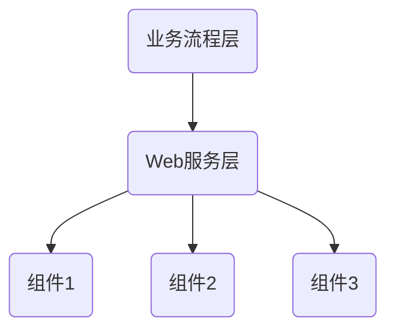

> **SOA和微服务有什么区别**？

[原文](https://blog.csdn.net/zpoison/article/details/80729052)

在[马丁富勒论文](https://martinfowler.com/articles/microservices.html)中也提到了SOA和微服务的区别。

首先SOA和微服务架构一个层面的东西，而对于ESB和微服务网关是一个层面的东西，一个谈到是架构风格和方法，一个谈的是实现工具或组件

`SOA（Service Oriented Architecture）`面向服务的架构：他是一种设计方法，其中包含多个服务， 服务之间通过相互依赖最终提供一系列的功能。一个服务通常以独立的形式存在于操作系统进程中。各个服务之间通过网络调用。

`微服务架构`：其实和 SOA 架构类似，微服务是在 SOA 上做的升华，微服务架构强调的一个重点是“业务需要彻底的组件化和服务化”，原有的单个业务系统会拆分为多个可以独立开发、设计、运行的小应用。这些小应用之间通过服务完成交互和集成。

微服务架构 = 80%的SOA服务架构思想 + 100%的组件化架构思想 + 80%的领域建模思想

## 微服务

[原文](https://www.zhihu.com/question/65502802)

[马丁富勒论文](https://martinfowler.com/articles/microservices.html)

`见《Spring Boot解密》第一章 了解微服务`

`进程间通信（IPC）`是在多任务操作系统或联网的计算机之间运行的程序和进程所用的通信技术。有两种类型的进程间通信。

`本地过程调用（LPC）`用在多任务操作系统中，使得同时运行的任务能互相通话。这些任务共享内存空间使任务同步和互相发送信息。

`远程过程调用（RPC）` 类似于LPC，只是在网上工作。

通过 IPC 和 RPC，程序就能够利用其它程序或计算机处理的进程。Client/Server 模式计算把远程过程调用与其它技术（如消息传递）一道，作为系统间通信的一种机制。`客户机执行自己的任务，但靠服务器提供后端文件服务`。RPC为客户机提供向后端服务器申请服务的通信机制。如果你把 Client/Server 应用程序想象成一个分离的程序，服务器能运行数据访问部分，因为它离数据最近，客户机能运行[数据表示](https://baike.baidu.com/item/数据表示)和与用户交互的前端部分。这样，远程过程调用可看作是一种部件，该部件可以`把分割的程序通过网络进行重组`。LPC有时也称`耦合（Coupling）机制`。

### 什么是微服务？

微服务是一种架构风格，它要求我们在开发一个应用的时候，这个应用必须构建成一系列小服务的组合；可以通过 HTTP 的方式进行互通。

> **单体应用架构**

所谓的单体应用架构（`all in one`）是指，将一个应用中的所有应用服务都封装在一个应用中。

无论是 ERP、CRM 或是其他什么系统，都把数据库访问、Web 访问等等各个功能都放在一个 war 包内。

**优点**：

+ 易于开发和测试
+ 方便部署
+ 方便扩展。当需要扩展时，还需要将 war 复制多份，然后放到多个服务器上，再做个负载均衡即可

**缺点**：

+ 耦合度较高。哪怕是修改一个很小的地方，都需要停掉整个服务，重新打包、部署这个应用 war 包，特别是对于一些大型应用，我们呢不可能把所有内容都放在一个应用中，这就给后期维护、分工合作带来了麻烦。

> **微服务架构**

[Martin论文](https://martinfowler.com/articles/microservices.html)   [译文](https://www.cnblogs.com/liuning8023/p/4493156.html)

在之前的 `all in one` 的架构方式中，将所有的功能单元放在一个应用中，然后将整个应用部署到服务器。如果负载能力不行，再将应用进行水平复制，进行扩展，然后负载均衡。

所谓微服务架构，就是打破之前的 all in one 的架构方式，把每个功能元素独立出来。将独立出来的功能元素进行动态组合，根据需要选择组合的元素。所以微服务架构是对功能元素进行复制，而没有对整个应用进行复制。

**优点**：

+ 节省了调用资源
+ 每个功能元素的服务都是一个可替换的、可独立升级的软件代码
+ 单一职责原则，每个服务足够内聚，足够小，代码容易理解，这样可以聚焦一个指定的业务功能或业务需求
+ 开发简单，开发效率高
+ 微服务能够被 2~5人的小团队单独开发
+ 无论在开发阶段还是部署阶段都是独立的
+ 可以使用不同的语言开发
+ 易于和第三方集成，微服务允许容易且灵活的方式集成自动部署，通过持续集成工具：jenkins\Hudson\bamboo
+ 微服务只是业务逻辑的代码，不会和 HTML、CSS 或其他页面混合
+ 每个微服务都有自己的存储能力，可以有自己的数据库，也可以共同享有同一个数据库

**缺点**：

+ 开发人员要要处理分布式系统的复杂性
+ 多服务运维难度，随着服务的增加，运维的压力也逐渐增大
+ 系统部署依赖
+ 服务间通信成本
+ 数据一致性
+ 系统集成测试
+ 性能监控 


### 微服务技术栈

|      微服务条目      |                           落地技术                           |
| :------------------: | :----------------------------------------------------------: |
|       服务开发       |               Spring Boot、Spring 、SpringMVC                |
|    服务配置与管理    |          Netflix 公司的Archaius、阿里的 Diamond 等           |
|    服务注册与发现    |                 Eureka、Consul、Zookeeper 等                 |
|       服务调用       |                       Rest、RPC、gRPC                        |
|      服务熔断器      |                      Hystrix、Envoy 等                       |
|       负载均衡       |                       Ribbon、Nginx 等                       |
|     服务接口调用     |                           Feign 等                           |
|       消息队列       |                 Kafka、RabbitMQ、ActiveMQ 等                 |
|   服务配置中心管理   |                  SpringCloudConfig、Chef 等                  |
| 服务路由（API 网关） |                           Zuul 等                            |
|       服务监控       |            Zabbix、Nagios、Metrics、Specatator 等            |
|      全链路追踪      |                   Zipkin、Beave、Dapper 等                   |
|       服务部署       |               Docker、OpenStack、Kubernetes 等               |
|   数据流操作开发包   | SpringCloud Stream（封装与 Redis、Rabbit、Kafaka 等发送接收消息） |
|     时间消息总线     |                       SpringCloud Bus                        |


### 如何构建微服务?

一个大型系统的微服务架构，就像一个复杂交织的神经网络，每一个神经元就是一个功能元素，它们各自完成自己的功能，然后通过 `http` 互相调用。比如一个电商系统，查缓存、连接数据库、浏览页面、结账、支付等服务都是一个个独立的功能服务，都被微化了，它们作为一个个微服务共同构建一个庞大的系统。

但是这种庞大的系统架构给部署和运维带来很大的难度，于是Spring为我们带来了构建大型分布式微服务的全套、全称产品：

+ 构建一个个独立的微服务单元，可以使用 `Spring Boot`，帮我们快速搭建一个应用；

+ 大型分布式网络服务的调用，该部分由`Spring Cloud`来完成，实现分布式；
+ 在分布式中间，进行流式计算、批处理，我们用 `Spring Cloud Data Flow`；
+ Spring 为我们提供了从开始构建应用到大型分布式应用的全流程方案。


### 微服务架构4个核心问题？

1. 服务有很多，客户端怎么访问？
2. 服务之间如何通信（Http\RPC）？
3. 这么多服务如何治理（服务注册与发现，注册中心）？
4. 服务挂了怎么办？

**解决方案**：

+ `Spring Cloud NetFlix`：一站式解决方案。

	API 网关

	Zuul 组件

	Feign --- HttpClient --- Http 通信方式、同步、阻塞

	服务注册与发现 Eureka

	熔断机制 Hystrix、Turbine

	链路追踪 Sleuth、ZipKin

+ `Apache Dubbo Zookeeper`：半自动，需要整合别人的

	API 没有，找三方组件，或者自己实现

	Dubbo 专业的 RPC 框架很好

	服务注册与发现用的是 Zookeeper 

	没有熔断机制，借助 Hystrix

+ `Spring Cloud Alibaba`：一站式解决方案，跟`Spring Cloud NetFlix` 相似，但是更简单


### Dubbo VS Spring Cloud NetFlix

**解决的问题域不同**：`Dubbo 的定位是一款 RPC 框架，Spring Cloud 的目标是微服务架构下的一站式解决方案。`

|              |     Dubbo     |              Spring              |
| :----------: | :-----------: | :------------------------------: |
| 服务注册中心 |   Zookeeper   | Spring Cloud Netflix **Eureka**  |
| 服务调用方式 |      RPC      |           **REST API**           |
|   服务监控   | Dubbo-monitor |      Spring Boot **Admin**       |
|    断路器    |    不完善     | Spring Cloud Netflix **Hystrix** |
|   服务网关   |      无       |  Spring Cloud Netflix **Zuul**   |
|  分布式配置  |      无       |     Spring Cloud **Config**      |
|   服务跟踪   |      无       |     Spring Cloud **Sleuth**      |
|   消息总线   |      无       |       Spring Cloud **Bus**       |
|    数据流    |      无       |     Spring Cloud **Stream**      |
|   批量任务   |      无       |      Spring Cloud **Task**       |

**最大的区别**：`Spring Cloud 抛弃了 Dubbo 的 RPC 通信，采用的是基于 HTTP 的 REST 方式`

严格来说，这两种方式各有优劣。虽然从一定程度上来说，Spring Cloud 牺牲了服务调用的性能，但也避免了上面提到的原生 RPC 带来的问题。而且 REST 相比 RPC 更为灵活，服务服务提供方和调用方的依赖只依靠一纸契约，不存在代码级别的强依赖，这在强调快速演化的微服务环境下，显得更加合适。

**组装机与品牌机的区别**

很显然，Spring Cloud 的功能比 Dubbo 更加强大，涵盖面更广，而且作为 Spring 的拳头项目，它也能够与 Spring Framework、Spring Boot、Spring Data、Spring Batch 等其他 Spring 项目完美融合，这些对于微服务而言是至关重要的。使用Dubbo构建的微服务架构就像组装的电脑，各个环节我们的选择的自由度很高，但是最终的结果很有可能因为一条内存质量不行就点不亮了，总是让人不放心，但是如果你是一名高手，那么这些都不是问题；而 Spring Cloud 就像品牌机，在 Spring Boot 的整合下做了大量的兼容性测试，保证了机器拥有更高的稳定性，但是如果要再使用非原装组件外的东西，就需要对其基础有足够的了解（熟悉Spring的源码，做二次开发等）。

**社区支持与更新力度**

最为重要的是，Dubbo 停止了5年左右的更新，虽然2017.7重启了。对于技术发展的新需求，由开发者自行拓展升级（比如当当网自己搞了个DubboX），这对于很多想要采用微服务架构的中小软件组织，显然是不太合适的，中小公司没有强大的技术能力去修改Dubbo源码+周边的一整套解决方案，并不是每一个公司都有阿里的大牛+真实的线上生产环境测试过。

**总结**：

曾风靡国内的开源 RPC 服务框架 Dubbo 在重启维护后，令许多用户为之雀跃，但同时，也迎来了一些质疑的声音。互联网技术发展迅速，Dubbo 是否还能跟上时代？Dubbo 与 Spring Cloud 相比又有何优势和差异？是否会有关举措保证 Dubbo 的后续更新频率？


新概念：服务网络  Server Mesh  istio


## Spring Cloud

> SpringCloud 和 SpringBoot 的关系

`SpringBoot` 专注与快速方便地开发单个个体微服务。

`SpringCloud` 是关注全局的微服务协调整理治理框架，它将 SpringBoot 开发的一个个单体微服务整合并管理起来，为各个微服务之间提供：配置管理、服务发现、断路器、路由、微代理、时间总线、全局锁、决策精选、分布式会话等等继承服务。

Spring Boot 可以离开 Spring Cloud 单独使用，开发项目，但是 Spring Cloud 离不开 Spring Boot。

**总结**：`Spring Boot 专注于快速、方便地开发单个个体微服务，Spring Cloud 关注全局的服务治理框架`。

## Spring Cloud 面试题

什么是微服务?

微服务之间如何独立通信的？

Spring Cloud 和 Dubbo 有哪些区别？

Spring Boot 和 Spring Cloud 谈谈对它们的理解？

什么是服务熔断、什么是服务降级？

微服务的有缺点是什么？说一下你在项目中遇到的坑？

你所知道的微服务技术栈有哪些？

Euraka 和 Zookeeper 都可以提供服务注册与发现的功能，说一下两者的区别？


>微服务之间如何独立通信的？

**微服务通信方式**：

+ 同步：RPC、REST等
+ 异步：消息队列，要考虑消息的可靠传输、高性能，以及编程模型的变化等。


## RPC

[原文](https://www.jianshu.com/p/7d6853140e13)

### 概念

RPC（Remote Procedure Call）远程过程调用，简单的理解是一个节点请求另一个节点提供的服务。

+ 这里解释一个`Procedure`这个单词的含义：在许多编程语言中，会将Java中`带返回值`的方法的称为函数（Function），不带返回值的称为过程（Procedure）。所以Procedure说白了就是方法。

远程过程调用其实对标的是`本地过程调用`。简单的说本机上内部的方法调用都可以称为本地过程调用，而远程过程调用实际上就指的是`本地调用了远程机子上的某个方法`，这就是远程过程调用。


至于 RPC 要如何调用远程的方法可以走 HTTP，也可以是基于 TCP 自定义协议。

而 RPC 框架就是要实现像小助手一样的东西，目的就是让我们使用远程调用像本地调用一样简单方便，并且解决一些远程调用会发生的一些问题，使用户用的无感知、舒心、放心、顺心，它好我也好，快乐没烦恼。


### 如何设计一个 RPC 框架

在明确了什么是 RPC，以及 RPC 框架的目的之后，咱们想想如果让你做一款 RPC 框架你该如何设计？

<font color=DarkOrchid>**如何设计一个 RPC 框架？**</font>

> 大致上一个 RPC 框架需要做的就是要约定通信协议，序列化的格式、一些容错机制、负载均衡策略、监控运维和一个注册中心！

<center>服务消费者</center>

我们先从消费者方（即调用方）来看需要些什么，首先消费者面向接口编程，所以需要得知**有哪些接口可以调用**，可以通过**公用 jar 包**的方式来维护接口。

现在知道有哪些接口可以调用了，但是只有接口啊，具体的实现怎么来？这事必须框架给处理了！所以还**需要来个代理类**，让消费者只管调，啥事都别管了，我**代理帮你搞定**。

对了，还需要告诉代理，你调用的是**哪个方法**，并且**参数的值**是什么。

虽说代理帮你搞定但是代理也需要知道它到底要调哪个机子上的远程方法，所以**需要有个注册中心**，这样调用方从注册中心可以知晓能够调用哪些服务提供方，一般而言提供方不止一个，毕竟只有一个挂了那不就没了。

所以提供方一般都是**集群部署**，那调用方需要通过**负载均衡**来选择一个来调用，可以通过**某些策略**例如同机房优先调用等。

当然还需要有**容错机制**，毕竟这是远程调用，网络是不可靠的，所以可能需要重试什么的。

还要和服务提供方**约定一个协议**，例如我们就用 HTTP 来通信就好啦，也就是大家要讲一样的话，不然可能听不懂了。

当然序列化必不可少，毕竟我们本地的结构是“立体”的，需要序列化之后才能传输，因此还需要**约定序列化格式**。

并且这过程中间可能还需要掺入一些 **Filter**，来作一波统一的处理，例如调用计数等等。

这些都是框架需要做的，让消费者像在调用本地方法一样，无感知。

<center>服务提供者</center>

服务提供者需要**实现对应的接口**。

然后需要把自己的接口暴露出去，向**注册中心注册自己**，暴露自己所能提供的服务。

然后有消费者请求过来需要处理，提供者需要用和消费者**协商好的协议**来处理这个请求，然后做**反序列化**。

序列化完的请求应该**扔到线程池里面做处理**，某个线程接受到这个请求之后找到对应的实现调用，然后再**将结果原路返回**。

<center>注册中心</center>

上面其实我们都提到了注册中心，这东西就相当于一个平台，大家在上面暴露自己的服务，也在上面得知自己能调用哪些服务。

当然还能做配置中心，将配置集中化处理，动态变更通知订阅者。

<center>监控运维</center>

面对众多的服务，精细化的监控和方便的运维必不可少。

这点很多开发者在开发的时候察觉不到，到你真正上线开始运行维护的时候，如果没有良好的监控措施，快速的运维手段，到时候就是睁眼瞎！

<font color=DarkOrchid>**简单实现一个 RPC 框架**</font>

> 这里通过一个简单的 Demo 来实现一个基本的 RPC，除了核心的功能之外没有过多的功能，删除了一些保护性和约束性的代码，来更加直观的看出一个 RPC框架 核心功能实现的基本过程。

首先定义一个接口和一个简单实现

```java
public interface Service {  
    String hello(String name);  
} 

public class ServiceImpl implements Service {  
    public String hello(String name) {  
        return "Yo man Hello，I am" + name;  
    }  
}  
```

然后再来实现**服务提供者**暴露服务的功能

```java
public class RpcFramework { 
  
     public static void export(Object service, int port) throws Exception { 
          ServerSocket server = new ServerSocket(port);
          while(true) {
              Socket socket = server.accept();
              new Thread(new Runnable() {
                  //反序列化
                  ObjectInputStream input = new ObjectInputStream(socket.getInputStream()); 
                  String methodName = input.read(); //读取方法名
                  Class<?>[] parameterTypes = (Class<?>[]) input.readObject(); //参数类型
                  Object[] arguments = (Object[]) input.readObject(); //参数
                  Method method = service.getClass().getMethod(methodName, parameterTypes);  //找到方法
                  Object result = method.invoke(service, arguments); //调用方法
                  // 返回结果
                  ObjectOutputStream output = new ObjectOutputStream(socket.getOutputStream());
                  output.writeObject(result);
              }).start();
          }
     }
  
    public static <T> T refer (Class<T> interfaceClass, String host, int port) throws Exception {
       return  (T) Proxy.newProxyInstance(interfaceClass.getClassLoader(), new Class<?>[] {interfaceClass}, 
            new InvocationHandler() {  
                public Object invoke(Object proxy, Method method, Object[] arguments) throws Throwable {  
                    Socket socket = new Socket(host, port);  //指定 provider 的 ip 和端口
                    ObjectOutputStream output = new ObjectOutputStream(socket.getOutputStream()); 
                    output.write(method.getName());  //传方法名
                    output.writeObject(method.getParameterTypes());  //传参数类型
                    output.writeObject(arguments);  //传参数值
                    ObjectInputStream input = new ObjectInputStream(socket.getInputStream());  
                    Object result = input.readObject();  //读取结果
                    return result;  
               }
        });  
    }  
}
```

好了，这个 RPC 框架就这样好了，是不是很简单？就是**调用者传递了方法名、参数类型和参数值，提供者接收到这样参数之后调用对于的方法返回结果就好了**！这就是远程过程调用。

使用：

```java
//服务提供者只需要暴露出接口
Service service = new ServiceImpl ();  
RpcFramework.export(service, 2333);  

//服务调用者只需要设置依赖
Service service = RpcFramework.refer(Service.class, "127.0.0.1", 2333);  
service.hello(); 
```


## Dubbo

[Dubbo官方文档](http://dubbo.apache.org/en-us/docs/user/quick-start.html)

[敖丙Dubbo系列](https://mp.weixin.qq.com/s/FPbu8rFOHyTGROIV8XJeTA)

### Dubbo 简介

Dubbo 是阿里巴巴 2011年开源的一个基于 Java 的 RPC 框架，中间沉寂了一段时间，不过其他一些企业还在用 Dubbo 并自己做了扩展，比如当当网的 Dubbox，还有网易考拉的 Dubbok。

但是在 2017 年阿里巴巴又重启了对 Dubbo 维护。在 2017 年荣获了开源中国 2017 最受欢迎的中国开源软件 Top 3。

在 2018 年和 Dubbox 进行了合并，并且进入 Apache 孵化器，在 2019 年毕业正式成为 Apache 顶级项目。

目前 Dubbo 社区主力维护的是 2.6.x 和 2.7.x 两大版本，2.6.x 版本主要是 bug 修复和少量功能增强为准，是稳定版本。

而 2.7.x 是主要开发版本，更新和新增新的 feature 和优化，并且 2.7.5 版本的发布被 Dubbo 认为是里程碑式的版本发布。

它实现了面向接口的代理 RPC 调用，并且可以配合 ZooKeeper 等组件实现服务注册和发现功能，并且拥有负载均衡、容错机制等。


### Dubbo 总体架构


说明

|   节点    |           角色说明           |
| :-------: | :--------------------------: |
| Consumer  | 需要调用远程服务的服务消费方 |
| Registry  |           注册中心           |
| Provider  |          服务提供方          |
| Container |        服务运行的容器        |
|  Monitor  |           监控中心           |

**大致流程：**

首先服务提供者 **Provider 启动然后向注册中心注册** 自己所能提供的服务。

服务消费者 **Consumer 启动向注册中心订阅**自己所需的服务。然后注册中心将提供者元信息通知给 Consumer， 之后 Consumer 因为已经从注册中心获取提供者的地址，因此可以**通过负载均衡选择一个 Provider 直接调用** 。

之后服务提供方元数据变更的话**注册中心会把变更推送给服务消费者**。

服务提供者和消费者都会在内存中记录着调用的次数和时间，然后**定时的发送统计数据到监控中心**。

**注意**：

首先**注册中心和监控中心是可选的**，可以不要监控，也可以不要注册中心，直接在配置文件里面写然后提供方和消费方直连。

然后注册中心、提供方和消费方之间都是长连接，和监控方不是长连接，并且**消费方是直接调用提供方，不经过注册中心**。

就算**注册中心和监控中心宕机了也不会影响到已经正常运行的提供者和消费者**，因为消费者有本地缓存提供者的信息。


### Dubbo 分层架构

Dubbo 分为三层，细分共有十层。


大的三层分别为 Business（业务层）、RPC 层、Remoting，并且还分为 API 层和 SPI 层。

分为大三层其实就是和我们知道的网络分层一样的意思，**只有层次分明，职责边界清晰才能更好的扩展**。

而分 API 层和 SPI 层这是 Dubbo 成功的一点，**采用微内核设计+SPI扩展**，使得有特殊需求的接入方可以自定义扩展，做定制的二次开发。

- Service 业务层：就是咱们开发的业务逻辑层。
- Config 配置层，主要围绕 ServiceConfig 和 ReferenceConfig，初始化配置信息。
- Proxy 代理层：服务提供者还是消费者都会生成一个代理类，使得服务接口透明化，代理层做远程调用和返回结果。
- Register 注册层，封装了服务注册和发现。
- Cluster 路由和集群容错层：负责选取具体调用的节点，处理特殊的调用要求和负责远程调用失败的容错措施。
- Monitor 监控层，负责监控统计调用时间和次数。
- Portocol 远程调用层：主要是封装 RPC 调用，主要负责管理 Invoker，Invoker代表一个抽象封装了的执行体，之后再做详解。
- Exchange 信息交换层：用来封装请求响应模型，同步转异步。
- Transport 网络传输层：抽象了网络传输的统一接口，这样用户想用 Netty 就用 Netty，想用 Mina 就用 Mina。
- Serialize 序列化层，将数据序列化成二进制流，当然也做反序列化。


### SPI

SPI（Service Provider Interface），是 JDK 内置的一个服务发现机制，**它使得接口和具体实现完全解耦**。我们只声明接口，具体的实现类在配置中选择。

具体的就是你定义了一个接口，然后在`META-INF/services`目录下**放置一个与接口同名的文本文件**，文件的内容为**接口的实现类**，多个实现类用换行符分隔。

这样就通过配置来决定具体用哪个实现！

而 Dubbo SPI 还做了一些改进，篇幅有限留在之后再谈。


### Dubbo 调用过程

<font color=DarkOrchid>**服务提供者**</font>


<font color=DarkOrchid>**服务暴露过程**</font>

首先 Provider 启动，通过 Proxy 组件根据具体的协议 Protocol 将需要暴露出去的接口封装成 Invoker，Invoker 是 Dubbo 一个很核心的组件，代表一个可执行体。

然后再通过 Exporter 包装一下，这是为了在注册中心暴露自己套的一层，然后将 Exporter 通过 Registry 注册到注册中心。这就是整体服务暴露过程。

<font color=DarkOrchid>**消费过程**</font>

接着我们来看消费者调用流程（把服务者暴露的过程也在图里展示出来了，这个图其实算一个挺完整的流程图了）。


首先消费者启动会向注册中心拉取服务提供者的元信息，然后调用流程也是从 Proxy 开始，毕竟都需要代理才能无感知。

Proxy 持有一个 Invoker 对象，调用 invoke 之后需要通过 Cluster 先从 Directory 获取所有可调用的远程服务的 Invoker 列表，如果配置了某些路由规则，比如某个接口只能调用某个节点的那就再过滤一遍 Invoker 列表。

剩下的 Invoker 再通过 LoadBalance 做负载均衡选取一个。然后再经过 Filter 做一些统计什么的，再通过 Client 做数据传输，比如用 Netty 来传输。

传输需要经过 Codec 接口做协议构造，再序列化。最终发往对应的服务提供者。

服务提供者接收到之后也会进行 Codec 协议处理，然后反序列化后将请求扔到线程池处理。某个线程会根据请求找到对应的 Exporter ，而找到 Exporter 其实就是找到了 Invoker，但是还会有一层层 Filter，经过一层层过滤链之后最终调用实现类然后原路返回结果。

完成整个调用过程！


## Eureka ->

`Eureka 服务注册与发现`

> 什么是 Eureka ？

Netflix 在设计 Eureka 时，遵循的就是 AP 原则。

Eureka 是  Netflix 的一个子模块，也是核心模块之一。Eureka 是一个基于 REST 的服务，用于定位服务，以实现云端中间层服务发现和故障转移，服务注册与发现对于微服务来说是至关重要的，`有了服务发现与注册，只需使用服务端的标识符，就可以访问到服务，而不需要修改服务调用的配置文件了`，功能类似于Dubbo的注册中心，比如 Zookeeper。


> 原理

**Eureka 的基础架构**

+ Spring Cloud 封装了 Netflix 公司开发的 Eureka 模块来实现服务注册与发现（对比Zookeeper）

+ Eureka 采用了 C/S 的架构设计，EurekaServer 作为服务注册功能的服务器，它是服务注册中心。

+ 而系统中的其他微服务，使用 Eureka 的客户端连接到 EurekaServer 并维持心跳连接。这样系统的维护人员就可以通过 EurekaServer 来监控系统中各个微服务是否正常运行，Spring Cloud 的一些其他模块（比如Zuul）就可以通过 EurekaServer 发现系统中的其他微服务，并执行相关的逻辑

**Eureka VS Dubbo **


## Consul

### 服务注册与发现

>**Consul简介**

Consul是微服务的一个框架，是服务注册与发现的一个解决方案。在说Consul之前先来看看什么是`服务注册与发现`。

微服务体系中，服务注册与服务发现是两个最核心的模块。服务A调用服务B时，需要通过服务发现模块找到服务B的`IP和端口列表`，而服务B的实例在启动时需要把提供服务的IP和端口注册到服务注册中心。一个典型的结构如下图：

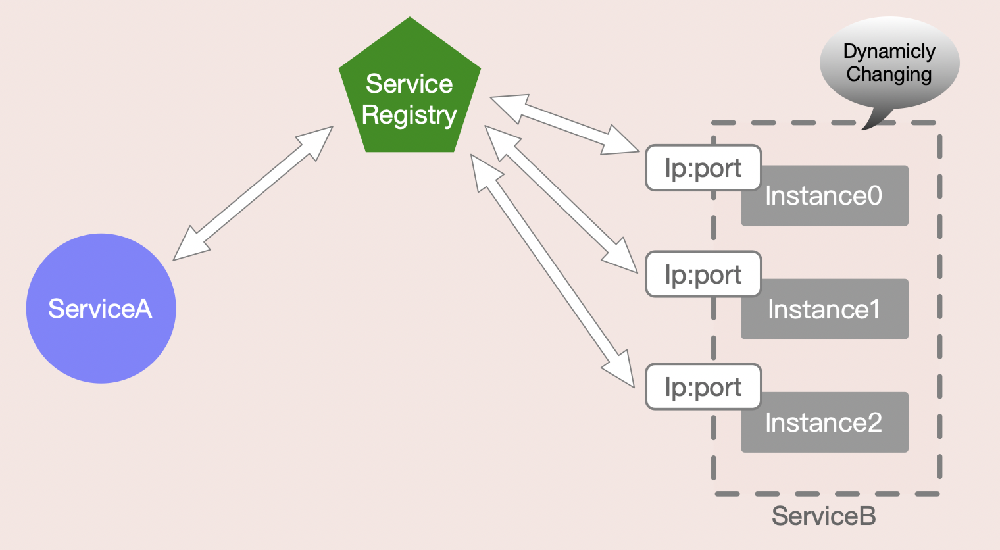

也即是说，ServiceA需要通过查找ServiceRegistry来`“发现”`ServiceB，而ServiceB则需要通过每次启动时向ServiceRegistry发送自己服务的`ip+port`来`“注册”`ServiceB。

> **为什么需要注册中心**？

几乎所有分布式系统中，都有类似注册中心的概念（ or 组件），注册中心解决了 服务发现的问题。

+ 服务发现中的“服务”含义非常广泛，数据库实例、缓存实例、RPC provider、微服务、网络设备等等，都可被视为服务。

在云计算之前，服务部署在物理机器上，IP 地址不变，因此即使没有服务发现，通过 `硬编码` 服务的地址，也能满足需求。

云计算时代，尤其是 Docker 的快速发展，使得 `硬编码` 几乎无用武之地，因为服务不再部署在物理机上，每次新创建的实例，其 IP 很可能与上次不同，因此需要更加灵活的服务发现机制。


> 服务注册

目前，流行的注册中心比较多，常见的有`zookeeper`、`ectd`、`consul`、`eureka`等。

服务注册通常有三种：`自注册`、`第三方注册`、`注册中心主动同步`。

- **自注册**
	自注册，顾名思义，就是`服务提供方`在启动服务时自己将提供服务的IP和端口发送到注册中心，并通过`心跳方式`维持健康状态；服务下线时，自己将相应的数据删除。典型的比如使用`eureka`客户端发布微服务。
- **第三方注册**
	第三方注册是指，存在一个第三方的系统负责在服务启动或停止时向注册中心增加或删除服务数据。典型的用法是`devops`系统或容器调度系统主动调注册中心接口注册服务。
- **注册中心主动同步**
	与第三方注册方式类似，主动注册方式是指注册中心和调度或发布系统打通，主动同步最新的服务IP列表；一个例子是`kubernetes`体系中，`coredns`订阅`api server`数据。

> 服务发现

服务发现是 SOA 架构（service oriented architecture）、微服务架构的核心组件，必须提供以下 3 个功能：

- 服务注册（Registration）
- 服务目录（Directory）
- 服务查找（Lookup）

复杂系统中，服务的元数据非常复杂，因此 lookup 非常重要，这里的查找不仅仅指查找到服务的元数据（地址、配置等），还包括服务的部署状态，并提供集中管理服务实例的能力。

复杂系统中，服务的元数据非常复杂，因此 lookup 非常重要，这里的查找不仅仅指查找到服务的元数据（地址、配置等），还包括服务的部署状态，并提供集中管理服务实例的能力。

**实现方式**：

- Zookeeper
	- 提供配置管理、leader 选举、分布式锁等；
	- 缺点：复杂
- etcd
	- 与 Zookeeper 类似，在 Docker 相关设施中使用广泛
- Consul
	- 服务发现、节点健康检查、K/V 存储、配置管理
	- 支持 DNS/HTTP 两种 API，而 Zookeeper 需要单独的客户端
- Eureka

在真正发起服务调用前，调用方需要从注册中心拿到相应服务可用的`IP和端口列表`，即`服务发现`。服务发现从对应用的侵入性上可以分为两大类：

- **SDK-Based**
	这类的服务发现方式，需要调用方依赖相应的SDK，显式调用SDK代码才可以实现服务调用，即对业务有侵入性，典型例子如`eureka`、`zookeeper`等。
- **DNS-Based**
	DNS本身是一种域名解析系统，可以满足简单的服务发现场景，如双方约定好端口、序列化协议等等。但是，这远远不能满足真正的微服务场景需求。近几年，基于DNS的服务发现被业界提了出来。

> 服务发现交互协议

微服务架构中，服务注册与发现的通信协议大致可以分为两类：

+ 一类是`“私有”协议`，如`dubbo` +` zk`及`eureka`；
+ 另一类是通用的`DNS协议`，如`k8s` + `coredns`。

1. **“私有”协议**

“私有”协议具有很高的定制性，可以和具体产品一起实现更高级的功能，如zk + dubbo，可以支持推送和长连接。但是，“私有”协议也带来了另外一个问题，就是开放性很差，第三方接入需要使用特定的SDK，跨语言特性不好。而在微服务或云环境下，跨语言服务注册和发现是非常常见的一个场景。

2. **DNS协议**

DNS协议是一个“古老”的协议，也是最基本、最通用的协议之一。基于DNS协议的服务发现具备很好的通用性，几乎所有语言都可以无缝接入。与“私有”协议的服务发现相比，基于DNS协议的服务发现还有一些问题需要解决，如端口问题、语言框架的缓存问题。

### Consul

Consul是HashiCorp公司推出的开源工具，用于实现分布式系统的服务发现与配置。与其他分布式服务注册与发现的方案相比，Consul的方案更“一站式”，内置了`服务注册与发现框架`、`分布一致性协议实现`、`健康检查`、`Key/Value存储`、`多数据中心方案`，不再需要依赖其他工具（比如ZooKeeper等），使用起来也较为简单。

Consul使用Go语言编写，因此具有天然可移植性（支持`Linux`、`Windows`和`Mac OS X`）；安装包仅包含一个可执行文件，方便部署，与`Docker`等轻量级容器可无缝配合。

> Consul 安装

访问Consul官网，根据操作系统类型，选择下载Consul的最新版本。下载地址为https://www.consul.io/downloads.html。

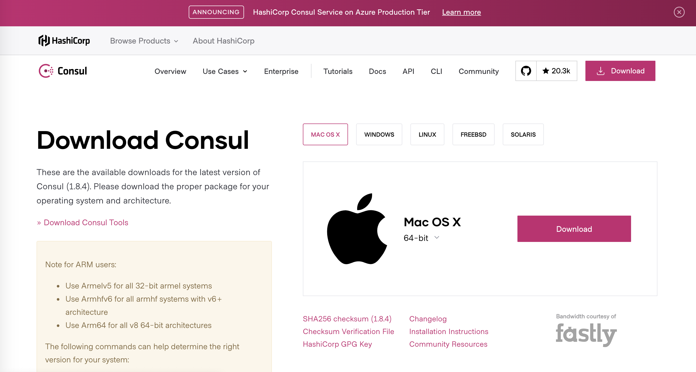

下载下来是一个`zip`压缩包，解压之后，是一个`exe`可执行文件。

>Consul启动

终端进入`consul`可执行性文件所在文件夹，然后执行下面命令即可启动：

```bash
consul agent -dev
```

启动过程信息如下：

```bash
[superfarr@19:20:59]:~->cd /Users/superfarr/Documents/iCollections/casaba/consul[superfarr@19:21:08]:~/Documents/iCollections/casaba/consul->consul agent -dev
==> Starting Consul agent...
           Version: '1.8.2'
           Node ID: 'f011f480-5d47-e343-c26a-6bbd32675721'
         Node name: 'superfarrdeMacBook-Pro.local'
        Datacenter: 'dc1' (Segment: '<all>')
            Server: true (Bootstrap: false)
       Client Addr: [127.0.0.1] (HTTP: 8500, HTTPS: -1, gRPC: 8502, DNS: 8600)
      Cluster Addr: 127.0.0.1 (LAN: 8301, WAN: 8302)
           Encrypt: Gossip: false, TLS-Outgoing: false, TLS-Incoming: false, Auto-Encrypt-TLS: false

==> Log data will now stream in as it occurs:

    2020-10-11T19:21:18.633+0800 [DEBUG] agent: Using random ID as node ID: id=f011f480-5d47-e343-c26a-6bbd32675721
    2020-10-11T19:21:18.638+0800 [WARN]  agent: Node name will not be discoverable via DNS due to invalid characters. Valid characters include all alpha-numerics and dashes.: node_name=superfarrdeMacBook-Pro.local
    2020-10-11T19:21:18.650+0800 [INFO]  agent.server.raft: initial configuration: index=1 servers="[{Suffrage:Voter ID:f011f480-5d47-e343-c26a-6bbd32675721 Address:127.0.0.1:8300}]"
...
```

启动成功之后，访问http://localhost:8500，如果可以看到如图下图所示的Consul服务管理界面，就说明注册中心服务端可以正常提供服务了。

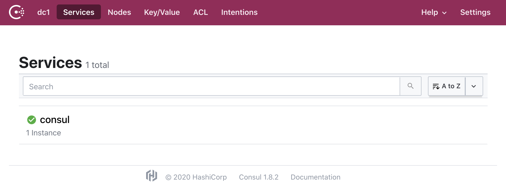

> 项目实例：SpringBoot 配置服务注册与发现

1. **新建Maven项目`serviceA`**

2. **添加依赖**

在`pom.xml`中添加`Spring Cloud`、`Consul`注册中心及Spring Boot相关依赖。

+ 注：Spring Boot 2.1后的版本会出现Consul服务注册上的问题，可能是因为配置变更或者支持方式发生改变，所以这里把SpringBoot版本调整为`2.0.4`，Spring Cloud版本使用`Finchley.RELEASE`。

```xml
<?xml version="1.0" encoding="UTF-8"?>
<project xmlns="http://maven.apache.org/POM/4.0.0"
         xmlns:xsi="http://www.w3.org/2001/XMLSchema-instance"
         xsi:schemaLocation="http://maven.apache.org/POM/4.0.0 http://maven.apache.org/xsd/maven-4.0.0.xsd">
    <modelVersion>4.0.0</modelVersion>

    <groupId>com.hory</groupId>
    <artifactId>service</artifactId>
    <version>1.0-SNAPSHOT</version>

    <parent>
        <groupId>org.springframework.boot</groupId>
        <artifactId>spring-boot-starter-parent</artifactId>
        <version>2.0.4.RELEASE</version>
        <relativePath/> <!-- lookup parent from repository -->
    </parent>

    <dependencies>
        <!-- spring boot -->
        <dependency>
            <groupId>org.springframework.boot</groupId>
            <artifactId>spring-boot-starter</artifactId>
        </dependency>
        <!-- spring-boot-admin -->
        <dependency>
            <groupId>de.codecentric</groupId>
            <artifactId>spring-boot-admin-server</artifactId>
            <version>2.0.4</version>
        </dependency>
        <dependency>
            <groupId>de.codecentric</groupId>
            <artifactId>spring-boot-admin-server-ui</artifactId>
            <version>2.0.4</version>
        </dependency>

        <!--consul-->
        <dependency>
            <groupId>org.springframework.cloud</groupId>
            <artifactId>spring-cloud-starter-consul-discovery</artifactId>
        </dependency>
    </dependencies>

    <!--spring cloud-->
    <dependencyManagement>
        <dependencies>
            <dependency>
                <groupId>org.springframework.cloud</groupId>
                <artifactId>spring-cloud-dependencies</artifactId>
                <version>Finchley.RELEASE</version>
                <type>pom</type>
                <scope>import</scope>
            </dependency>
        </dependencies>
    </dependencyManagement>

    <build>
        <plugins>
            <plugin>
                <groupId>org.springframework.boot</groupId>
                <artifactId>spring-boot-maven-plugin</artifactId>
            </plugin>
        </plugins>
    </build>
</project>
```

3. **添加配置文件**

在`resources`下新建`application.yml`配置文件，添加服务注册配置：

```yml
server:
  port: 8000
spring:
  application:
    name: serviceA
  cloud:
    consul:
      host: localhost
      port: 8500
      discovery:
        serviceName: ${spring.application.name}	# 注册到consul的服务名称
```

4. **启动类**

在java目录下新建包`com.hory.serviceA`，在包中新建一个启动类`ServiceApplication`:

添加`@EnableDiscoveryClient`注解，开启服务发现支持。

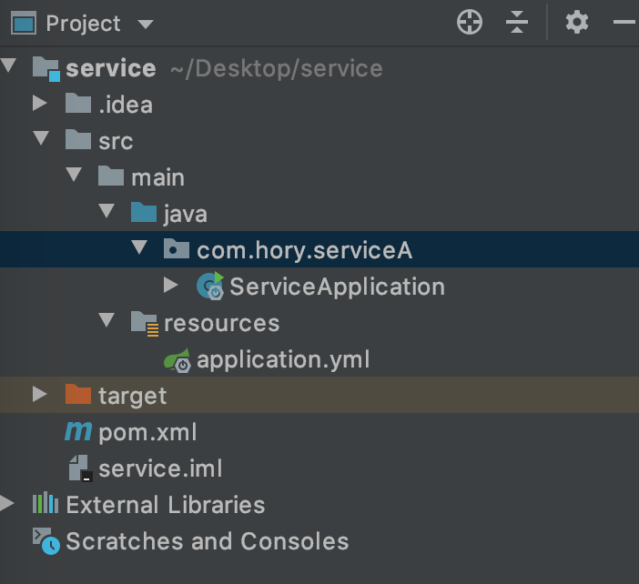

```java
import de.codecentric.boot.admin.server.config.EnableAdminServer;
import org.springframework.boot.SpringApplication;
import org.springframework.boot.autoconfigure.SpringBootApplication;
import org.springframework.cloud.client.discovery.EnableDiscoveryClient;

/**
 * @Author Hory
 * @Date 2020/10/11
 */
@EnableAdminServer
@EnableDiscoveryClient  //开启服务发现
@SpringBootApplication
public class ServiceApplication {
    public static void main(String[] args) {
        SpringApplication.run(ServiceApplication.class, args);
    }
}
```

> 测试

启动服务监控服务器，访问http://localhost:8500，发现服务已经成功注册到注册中心

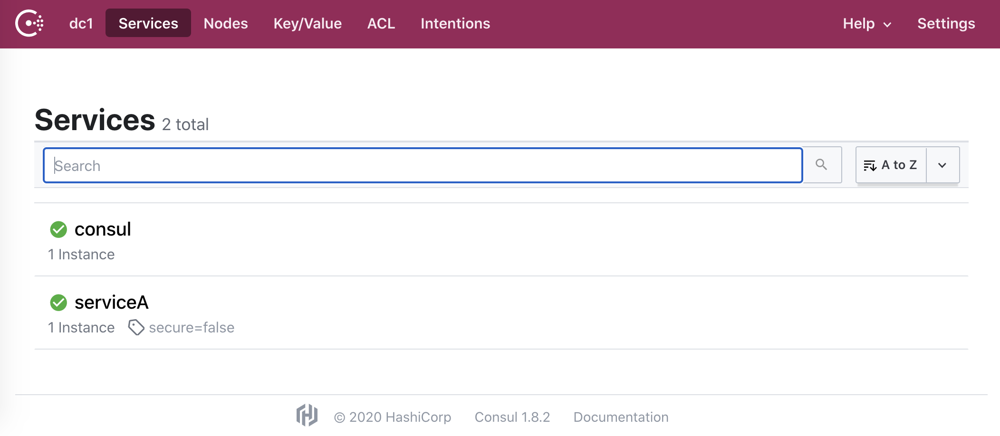

测试完之后，不要忘记将Consul关掉（终端`Ctrl+C`关闭Consul）


## Ribbon

[原文](https://www.jianshu.com/p/1bd66db5dc46)

### 简介

Spring Cloud Ribbon是一个基于 HTTP 和 TCP 的`客户端负载均衡`工具，它基于 Netflix Ribbon 实现。通过Spring Cloud 的封装，可以让我们轻松地将面向服务的 REST 模版请求自动转换成客户端负载均衡的服务调用。Spring Cloud Ribbon 虽然只是一个工具类框架，它不像服务注册中心、配置中心、API网关那样需要独立部署，但是它几乎存在于每一个 Spring Cloud 构建的微服务和基础设施中。因为微服务间的调用，API 网关的请求转发等内容，实际上都是通过 Ribbon 来实现的，包括后续我们将要介绍的 Feign，它也是基于 Ribbon 实现的工具。所以，对 Spring Cloud Ribbon 的理解和使用，对于我们使用 Spring Cloud 来构建微服务非常重要。

​    在这一章中，我们将具体介绍如何使用 Ribbon 来实现客户端的负载均衡，并且通过源码分析来了解 Ribbon 实现客户端负载均衡的基本原理。

> Ribbon内置负载均衡策略

如下表：

|          策略名           |                           策略声明                           |                           策略描述                           |                           实现说明                           |
| :-----------------------: | :----------------------------------------------------------: | :----------------------------------------------------------: | :----------------------------------------------------------: |
|     BestAvailableRule     | public class BestAvailableRule extends ClientConfigEnabledRoundRobinRule |                选择一个最小的并发请求的server                | 逐个考察Server，如果Server被tripped了，则忽略，在选择其中ActiveRequestsCount最小的server |
| AvailabilityFilteringRule | public class AvailabilityFilteringRule extends PredicateBasedRule | 过滤掉那些因为一直连接失败的被标记为circuit tripped的后端server，并过滤掉那些高并发的的后端server（active connections 超过配置的阈值） | 使用一个AvailabilityPredicate来包含过滤server的逻辑，其实就就是检查status里记录的各个server的运行状态 |
| WeightedResponseTimeRule  | public class WeightedResponseTimeRule extends RoundRobinRule | 根据相应时间分配一个weight，相应时间越长，weight越小，被选中的可能性越低。 | 一个后台线程定期的从status里面读取评价响应时间，为每个server计算一个weight。Weight的计算也比较简单responsetime 减去每个server自己平均的responsetime是server的权重。当刚开始运行，没有形成statas时，使用roubine策略选择server。 |
|         RetryRule         |   public class RetryRule extends AbstractLoadBalancerRule    |              对选定的负载均衡策略机上重试机制。              | 在一个配置时间段内当选择server不成功，则一直尝试使用subRule的方式选择一个可用的server |
|      RoundRobinRule       | public class RoundRobinRule extends AbstractLoadBalancerRule |                 roundRobin方式轮询选择server                 |             轮询index，选择index对应位置的server             |
|        RandomRule         |   public class RandomRule extends AbstractLoadBalancerRule   |                      随机选择一个server                      |           在index上随机，选择index对应位置的server           |
|     ZoneAvoidanceRule     |  public class ZoneAvoidanceRule extends PredicateBasedRule   |    复合判断server所在区域的性能和server的可用性选择server    | 使用ZoneAvoidancePredicate和AvailabilityPredicate来判断是否选择某个server，前一个判断判定一个zone的运行性能是否可用，剔除不可用的zone（的所有server），AvailabilityPredicate用于过滤掉连接数过多的Server。 |

**包**：

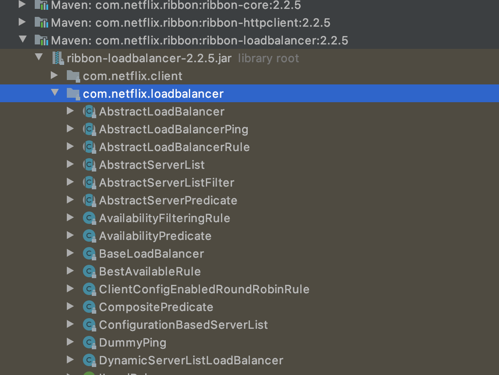


**Ribbon架构图**：

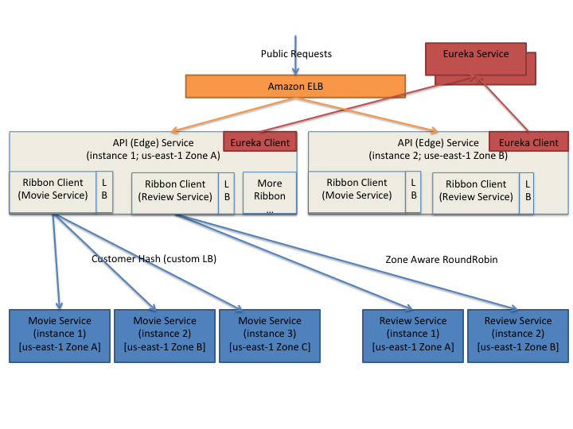

### 客户端负载均衡

负载均衡在系统架构中是一个非常重要，并且是不得不去实施的内容。因为负载均衡是对系统的高可用、网络压力的缓解和处理能力扩容的重要手段之一。我们通常所说的负载均衡都指的是服务端负载均衡，其中分为`硬件负载均衡`和`软件负载均衡`。硬件负载均衡主要通过在服务器节点之间按照专门用于负载均衡的设备，比如 `F5` 等；而软件负载均衡则是通过在服务器上安装一些用于负载均衡功能或模块等软件来完成请求分发工作，比如 `Nginx` 等。不论采用硬件负载均衡还是软件负载均衡，只要是服务端都能以类似下图的架构方式构建起来：

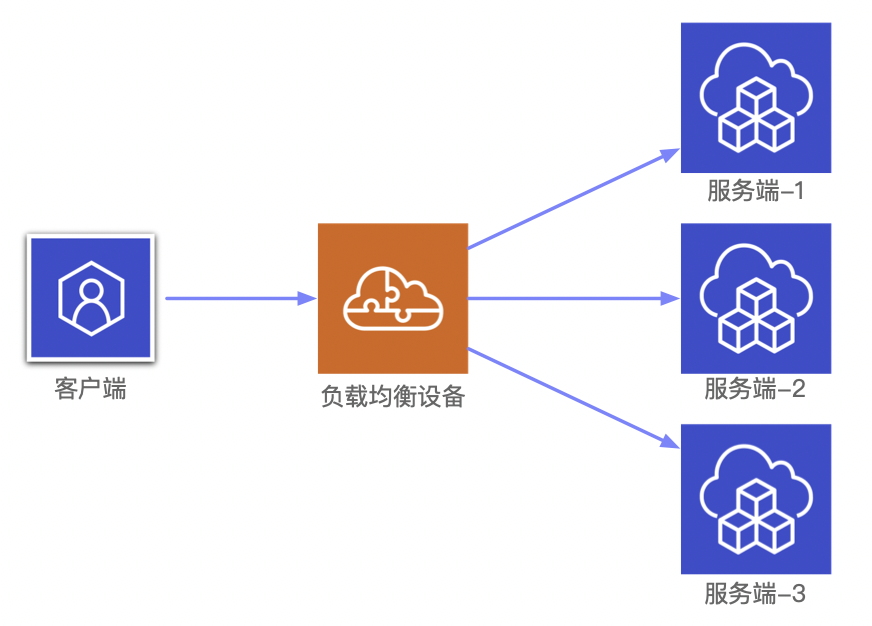

硬件负载均衡的设备或是软件负载均衡的软件模块都会维护一个下挂可用的服务端清单，通过`心跳检测`来剔除故障的服务端节点以保证清单中都是可以正常访问的服务端节点。当客户端发送请求到负载均衡设备的时候，该设备按某种算法（比如`线性轮询`、按`权重负载`、按`流量负载`等）从维护的可用服务端清单中取出一台服务端端地址，然后进行转发。

​    而`客户端`负载均衡和`服务端`负载均衡最大的`不同点`在于上面所提到`服务清单所存储的位置`。在客户端负载均衡中，所有客户端节点都维护着自己要访问的服务端清单，而这些服务端清单来自于`服务注册中心`，比如上一章我们介绍的Eureka服务端。同服务端负载均衡的架构类似，在客户端负载均衡中也需要心跳去维护服务端清单的健康性，默认会创建针对各个服务治理框架的Ribbon自动化整合配置，比如Eureka中的`org.springframework.cloud.netflix.ribbon.eureka.RibbonEurekaAutoConfiguration`，Consul中的`org.springframework.cloud.consul.discovery.RibbonConsulAutoConfiguration`。在实际使用的时候，我们可以通过查看这两个类的实现，以找到它们的配置详情来帮助我们更好地使用它。

通过Spring Cloud Ribbon的封装，我们在微服务架构中使用客户端负载均衡调用非常简单，只需要如下两步：

1. 服务提供者只需要启动多个服务实例并注册到一个注册中心或是多个相关联的服务注册中心。
2. 服务消费者直接通过调用被`@LoadBalanced` 注解修饰过的`RestTemplate`来实现面向服务的接口调用。

这样，我们就可以将服务提供者的高可用以及服务消费者的负载均衡调用一起实现了。

### 前情提要

在上一章中，我们已经通过引入Ribbon实现了服务消费者的客户端负载均衡功能，读者可用通过查看第3章中的“服务发现与消费”一节来获取实验示例。其中，我们使用了非常有用的对象RestTemplate。该对象会使用Ribbon的自动化配置，同时通过配置@LoadBalanced还能够开启客户端负载均衡。之前我们演示了通过RestTemplate实现了最简单的服务访问，下面我们将详细介绍RestTemplate针对几种不同请求类型和参数类型的服务调用实现。


## Hystrix & Turbine

**服务熔断（Hystrix、Turbine）**

### 雪崩效应

在微服务架构中，服务众多，通常会涉及多个服务层级的调用，一旦基础服务发生故障，很可能会导致级联故障，进而造成整个系统不可用，这种现象被称为服务雪崩效应。服务雪崩效应是一种因“服务提供者”的不可用导致“服务消费者”的不可用并将这种不可用逐渐放大的过程。

比如在一个系统中，A是服务提供者，B是A的服务消费者，C和D又是B的服务消费者。如果此时A发生故障，则会引起B的不可用，而B的不可用又将导致C和D的不可用，当这种不可用像滚雪球一样逐渐放大的时候，雪崩效应就形成了。

### 熔断器 CircuitBreaker

熔断器的原理很简单，如同电力过载保护器。它可以实现快速失败，如果它在一段时间内侦测到许多类似的错误，就会强迫其以后的多个调用快速失败，不再访问远程服务器，从而防止应用程序不断地尝试执行可能会失败的操作，使得应用程序继续执行而不用等待修正错误，或者浪费CPU时间去等到长时间的超时产生。

熔断器也可以使应用程序能够诊断错误是否已经修正，如果已经修正，应用程序会再次尝试调用操作。

熔断器模式就像是那些容易导致错误操作的一种代理。这种代理能够记录最近调用发生错误的次数，然后决定使用允许操作继续，或者立即返回错误。熔断器是保护服务高可用的最后一道防线。

### Hystrix特性

> 断路器机制

断路器很好理解，当`Hystrix Command`请求后端服务失败数量超过一定比例（默认为50%），断路器会切换到开路状态（Open）。这时所有请求会直接失败而不会发送到后端服务。断路器保持在开路状态一段时间后（默认为5秒），自动切换到半开路状态（HALF-OPEN）。这时会判断下一次请求的返回情况，如果请求成功，断路器切回闭路状态（CLOSED），否则重新切换到开路状态（OPEN）。Hystrix的断路器就像我们家庭电路中的保险丝，一旦后端服务不可用，断路器就会直接切断请求链，避免发送大量无效请求，从而影响系统吞吐量，并且断路器有自我检测并恢复的能力。

> fallback

fallback相当于降级操作。对于查询操作，我们可以实现一个fallback方法，当请求后端服务出现异常的时候，可以使用fallback方法返回的值。fallback方法的返回值一般是设置的默认值或者来自缓存。

> 资源隔离

在Hystrix中，主要通过`线程池`来实现资源隔离。通常在使用的时候我们会根据调用的远程服务划分出多个线程池。例如，调用产品服务的Command放入A线程池，调用账户服务的Command放入B线程池。

这样做的主要优点是`运行环境被隔离开了`。这样就算调用服务的代码存在bug或者由于其他原因导致自己所在线程池被耗尽，也不会对系统的其他服务造成影响，但是带来的代价就是维护多个线程池会对系统带来额外的性能开销。如果是对性能有严格要求而且确信自己调用服务的客户端代码不会出问题，就可以使用Hystrix的`信号模式（Semaphores）`来隔离资源。

### Feign Hystrix

因为Feign中已经依赖了Hystrix，所以在Maven配置上不用做任何改动就可以使用了，我们可以在`mango-consumer`项目中直接改造。

### Hystrix Dashboard

Hystrix-dashboard是一款针对Hystrix进行实时监控的工具，通过Hystrix Dashboard我们可以直观地看到各Hystrix Command的请求响应时间、请求成功率等数据。

### Spring Cloud Turbine

上面我们集成了Hystrix Dashboard，使用Hystrix Dashboard可以看到单个应用内的服务信息。显然这是不够的，我们还需要一个工具能让我们汇总系统内多个服务的数据并显示到HystrixDashboard上，这个工具就是Turbine。


## Zuul

**服务网关Zuul**

https://www.cnblogs.com/jay-wu/p/9923702.html

### 技术背景

前面我们通过Ribbon或Feign实现了微服务之间的调用和负载均衡，那我们的各种微服务又要如何提供给外部应用调用呢？因为是REST API接口，所以外部客户端直接调用各个微服务是没有问题的，但是出于种种原因，这并不是一个好的选择。

> 让客户端直接与各个微服务通信，会有以下几个问题：

+ 客户端会多次请求不同的微服务，增加客户端的复杂性。
+ 存在跨域请求，在一定场景下处理会变得相对比较复杂。
+ 实现认证复杂，每个微服务都需要独立认证。
+ 难以重构，项目迭代可能导致微服务重新划分。
+ 如果客户端直接与微服务通信，那么重构将会很难实施。
+ 如果某些微服务使用了防火墙/浏览器不友好的协议，直接访问会有一定困难。

面对类似上面的问题，我们要如何解决呢？

答案就是：`服务网关`！

> 使用服务网关具有以下几个优点：

+ 易于监控。可在微服务网关收集监控数据并将其推送到外部系统进行分析。
+ 易于认证。可在服务网关上进行认证，然后转发请求到微服务，无须在每个微服务中进行认证。
+ 客户端只跟服务网关打交道，减少了客户端与各个微服务之间的交互次数。
+ 多渠道支持，可以根据不同客户端（Web端、移动端、桌面端等）提供不同的API服务网关。

### Spring Cloud Zuul

服务网关是微服务架构中一个不可或缺的部分。在通过服务网关统一向外系统提供REST API的过程中，除了具备`服务路由`、`均衡负载`功能之外，它还具备了`权限控制`等功能。

Spring Cloud Netflix中的Zuul就担任了这样的一个角色，为微服务架构提供了前门保护的作用，同时将权限控制这些较重的非业务逻辑内容迁移到服务路由层面，使得服务集群主体能够具备更高的可复用性和可测试性。

在Spring Cloud体系中， Spring Cloud Zuul封装了Zuul组件，作为一个API网关，负责提供`负载均衡`、`反向代理`和`权限认证`。

### Zuul工作机制

> 过滤器机制

Zuul的核心是一系列的`filters`，其作用类似Servlet框架的Filter，Zuul把客户端请求路由到业务处理逻辑的过程中，这些filter在路由的特定时期参与了一些过滤处理，比如`实现鉴权`、`流量转发`、`请求统计`等功能。Zuul的整个运行机制可以用下图来描述：

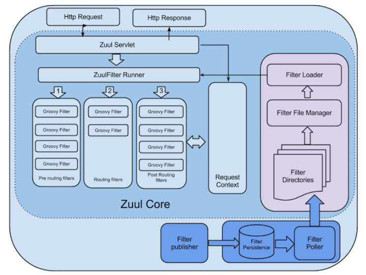

> 过滤器的生命周期

Filter的生命周期有4个，分别是`PRE、ROUTING、POST、ERROR`，整个生命周期可以用下图来表示：

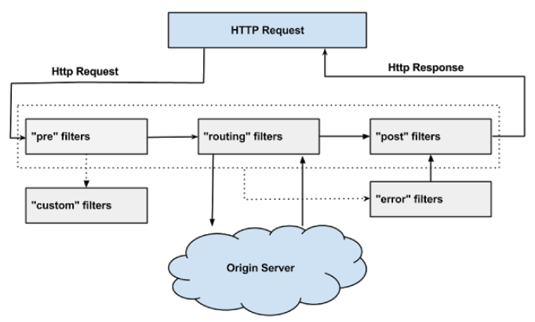

基于Zuul的这些过滤器可以实现各种丰富的功能，而这些过滤器类型则对应于请求的典型生命周期。

**PRE**：这种过滤器在请求被路由之前调用。我们可利用这种过滤器实现身份验证、在集群中选择请求的微服务、记录调试信息等。

**ROUTING**：这种过滤器将请求路由到微服务。这种过滤器用于构建发送给微服务的请求，并使用Apache HttpClient或Netfilx Ribbon请求微服务。

**POST**：这种过滤器在路由到微服务以后执行。这种过滤器可用来为响应添加标准的HTTP Header、收集统计信息和指标、将响应从微服务发送给客户端等。

**ERROR**：在其他阶段发生错误时执行该过滤器。

除了默认的过滤器类型，Zuul还允许我们创建自定义的过滤器类型。例如，我们可以定制一种STATIC类型的过滤器，直接在Zuul中生成响应，而不将请求转发到后端的微服务。Zuul默认实现了很多Filter，如下表所示：

| 类型  | 顺序 | 过滤器                  | 功能                       |
| ----- | ---- | ----------------------- | -------------------------- |
| pre   | -3   | ServletDetectionFilter  | 标记处理Servlet的类型      |
| pre   | -2   | Servlet30WrapperFilter  | 包装HttpServletRequest请求 |
| pre   | -1   | FormBodyWrapperFilter   | 包装请求体                 |
| route | 1    | DebugFilter             | 标记调试标志               |
| route | 5    | PreDecorationFilter     | 处理请求上下文供后续使用   |
| route | 10   | RibbonRoutingFilter     | serviceId请求转发          |
| route | 100  | SimpleHostRoutingFilter | url请求转发                |
| route | 500  | SendForwardFilter       | forward请求转发            |
| post  | 0    | SendErrorFilter         | 处理有错误的请求响应       |
| post  | 1000 | SendResponseFilter      | 处理正常的请求响应         |

> 禁用指定的Filter

可以在application.yml中配置需要禁用的filter，格式为：

`zuul.<SimpleClassName>.<filterType>.disable=true`

比如要禁用`org.springframework.cloud.netflix.zuul.filters.post.SendResponseFilter`，进行如下设置即可：

```yml
zuul:
  SendResponseFilter:
    post:
      disable: true
```

自定义Filter。实现自定义滤器需要继承ZuulFilter，并实现ZuulFilter中的抽象方法。

```java
public class MyFilter extends ZuulFilter {
    @Override
    String filterType() {
        return "pre"; // 定义filter的类型，有pre、route、post、error四种
    }

    @Override
    int filterOrder() {
        return 5; // 定义filter的顺序，数字越小表示顺序越高，越先执行
    }

    @Override
    boolean shouldFilter() {
        return true; // 表示是否需要执行该filter，true表示执行，false表示不执行
    }

    @Override
    Object run() {
        return null; // filter需要执行的具体操作
    }
}
```


## Config & Bus

### 技术背景

如今微服务架构盛行，在分布式系统中，项目日益庞大，子项目日益增多，每个项目都散落着各种配置文件，且随着服务的增加而不断增多。此时，往往某一个基础服务信息变更都会导致一系列服务的更新和重启，运维也是苦不堪言，而且还很容易出错。配置中心便由此应运而生了。

目前市面上开源的配置中心很多，像：

+ Spring 家族的 `Spring Cloud Config`
+ Apache 的 `Apache Commons Configuration`
+ 淘宝的 `diamond`
+ 百度的 `disconf`
+ 360的 `QConf`

都是为了解决这类问题。当下Spring体系大行其道，我们也优先选择了Spring Cloud Config。

### Spring Cloud Config

Spring Cloud Config 是一套为分布式系统中的`基础设施`和`微服务应用`提供`集中化配置`的管理方案，分为`服务端`与`客户端`两个部分。

服务端也称为分布式配置中心，是一个独立的微服务应用，用来连接配置仓库并为客户端提供获取配置信息。

客户端是微服务架构中的各个微服务应用或基础设施，它们通过指定的配置中心来管理服务相关的配置内容，并在启动的时候从配置中心获取和加载配置信息。

Spring Cloud Config 对服务端和客户端中的环境变量和属性配置实现了`抽象映射`，所以除了适用于Spring应用，也是可以在任何其他语言应用中使用的。

Spring Cloud Config 实现的配置中心默认采用Git来存储配置信息，所以使用Spring Cloud Config构建的配置服务器天然就支持对微服务应用配置信息的版本管理，并且可以通过Git客户端工具非常方便地管理和访问配置内容。当然它也提供了对其他存储方式的支持，比如SVN仓库、本地化文件系统等。


> 项目实战

https://blog.csdn.net/qazwsxpcm/article/details/88578076

https://blog.csdn.net/qazwsxpcm/article/details/88803428


