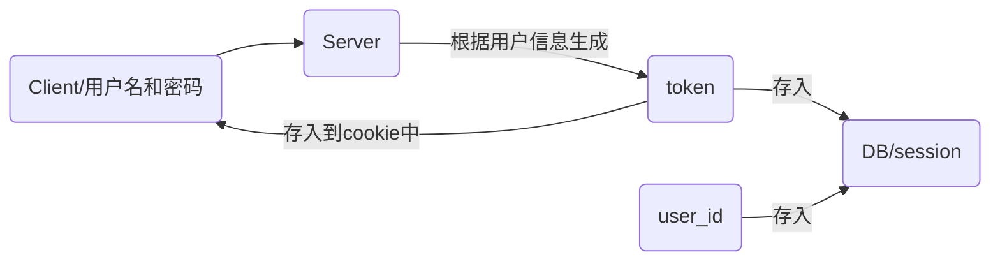

## Spring Security

[官网](https://spring.io/projects/spring-security)


> 关于Spring Security更多详情见笔记——SpringSecurity.md


## kaptcha

> 生成验证码并保存到session


```java
@GetMapping("captcha.jpg")
public void captcha(HttpServletResponse response, HttpServletRequest request){}
```


其中就用到`BufferedImage`

Image 是一个抽象类，BufferedImage 是 Image 的实现。

Image 和 BufferedImage 的主要作用就是将一副图片加载到内存中。

Java将一副图片加载到内存中的方法是：

```java
String imgPath = "绝对路径";
BufferedImage image = ImageIO.read(new FileInputStream(imgPath));
//该方法可以获得图片的详细信息，例如：获得图片的宽度：
//图片只有加载到内存中才能对图片进行进一步的处理
image.getWidth(null);
```


## Salt

> **一般密码加密方式**

在用户注册时就已经将密码哈希（MD5、SHA-1，不可逆，不冲突）后保存在数据库中，登录时验证密码仅仅是验证用户提交的 密码哈希值 是否与保存在数据库中的密码哈希值一致，即服务器不会保存密码原文。

破解 MD5 后密码的方法——彩虹表：收集尽可能多的明文密码和对应的 MD5 值，然后通过 MD5 值反查到该 MD5值对应的密码原文。

防御方法：加盐，即 MD5( username + password + salt )，其中 Salt 为一个固定的随机字符串，应该保存在服务器端的配置文件中，妥善保管。

> **加盐加密 Salt encryption**

[原文](https://baike.baidu.com/item/%E5%8A%A0%E7%9B%90%E5%8A%A0%E5%AF%86/12806823?fr=aladdin)

加盐加密是一种对系统登录口令的加密方式，它实现的方式是将每一个口令同一个叫做”盐“（salt）的n位随机数相关联。无论何时只要口令改变，随机数就改变。

随机数以未加密的方式存放在口令文件中，这样每个人都可以读。

不再只是保存加密过的口令，而是先将口令和随机数连接起来然后一同加密，加密后的结果放在口令文件中。

ps：

+ 这里的口令应该指的就是`password`

+ 这里 salt 的生成应该是设置一次新的密码时更新，而不是每次登陆时更新

> **加密盐的意义和用途**

[原文](https://www.cnblogs.com/zhangmingcheng/p/7356410.html)

如果不加盐，由于相同的密码经过哈希之后的密文是相同的，当存储用户密码的数据库泄露后，攻击者会很容易便能找到相同密码的用户，从而降低了破解密码的难度。

加盐之后，即 `hash(PS) = 密文`，这样的话，就算两个密文是相同的，由于 S（盐）是不同的，所以 P（密码） 也就不同，所以就算攻击者得到密文也无法轻易得出P，那么是不是一定无法得到呢？也不是，攻击者可以这么做：

+ `hash(P1S1) = hash(P2S2)`
+ 在知道S1、P2、S2的情况下如何求得P1
+ 即`hash(?S1) = hash(P2S2)`，如何求问号
+ 遍历就行了，只不过这样的话，攻击者准备的密码表量会很大，这样一来就得不偿失了

因此，在对用户密码进行加密时，需要考虑对密码进行掩饰，即使是相同的密码，也应该要保存为不同的密文，即使用户输入的是弱密码，也需要考虑进行增强，从而增加密码被攻破的难度，而使用带盐的加密hash值便能满足该需求。

> **实现方式**

可以将 salt 放到 passWord 前面作为`前缀`或放到 passWord 后面作为`后缀`得到新的字符串PS，即 PS = password 和 salt 的组合串；

密码密文passWordHash = Hash加密函数(PS )；

将用户名、密码密文 passWordHash 和盐值 salt 一起保存到数据库中。

这样，因为 salt 是随机生成的，所以就算两个完全相同的password所产生的salt也是不同的。

> **密码校验**

+ 从数据库中取出当前用户密码当初加密时使用的盐值`salt`

+ 得到本次输入的密码`passWordCur`和盐值`salt`的组合字符串`PS`

+ 得出本次输入密码的密文`passWordHashCur= hash(PS)`

比较 `passWordHashCur` 和用户最初设置的密码密文 `passWordHash` 是否一致，如果一致，则校验成功，否则校验失败。

> **常用的密码攻击方式**

常用的密码攻击方式有`字典攻击、暴力破解、查表法、反向查表法、彩虹表`等。

对字典攻击和暴力破解，攻击者均采用逐密码尝试的方式，目前没有很好的手段来阻止字典攻击和暴力破解攻击，只能是想办法让这两种攻击方式变得相对低效一些，而相同的密码产生不同的hash值便能让攻击者针对每一个hash值都需要从头进行尝试，从而使攻击变得更加低效。

对查表法、反向查表法和彩虹表攻击方式，攻击者需要提前准备好包含密码和密码hash值的密码表，然后根据该表和用户密码数据库进行批量匹配，从而达到攻破密码的目的；`而如果我们在加密时，给每个密码附加了不同的随机值，这样每个密码对应的hash值也会不同，这样攻击者在准备密码表时，就必须要将最基本的密码和用户密码数据库中的盐值进行笛卡尔积后再计算hash值，盐值越多，攻击者需要准备的表量越大，这样对于攻击而言，就变得有些得不偿失了`。

由此可见，如果想要完全杜绝密码破解是不可能的，但是通过加盐可以使得 `password + salt` 的长度变长，这样攻击者需要准备的`表量越大`，当表特别大的时候，攻击者在有限的时间内无法破解，而得不偿失。其实好多加密的方法的本质就是复杂化，目的只是`阻止`，而无法做到真正的`杜绝`。

> **加密盐的注意事项**

加盐的目的是为了增加攻击者破解的难度，那么在加盐的时候要注意以下几点，否则加盐的意义也不会太大。

**盐值不能太短**。如果盐值只有少数两三位甚至一两位的话，攻击者完全可以穷举所有可能的盐值；关于盐值长度的一个经验值是长度至少要和hash加密函数的返回值长度保持一致。

**盐值不能固定**。如果系统使用了固定的盐值，那么和不加盐相当于是一回事了，攻击者完全可以使用该固定的盐值提前准备密码表；另外，相同密码对应的hash值仍然是一样的，仍然无法对密码相同这一事实进行掩饰。

**不要使用能提前预知的值作为盐值**。如果盐值能提前得知或提前推断出，攻击者也完全可以根据提前预知的盐值准备密码表，从而对破解的难度也增加不了多少。

**每一次修改密码重新计算hash值时，要重新生成新的盐值，不要使用上次密码对应的盐值**。因为如果用户密码泄露之后，盐值相应的也就泄露了，用户修改密码时，如果还沿用原来的盐值，攻击者也仍然可以根据上次的盐值提前准备密码表，从而使攻破可能性变得更高了。


## AA

> **登录认证及授权  Authentication &  Access-control**

[原文](https://www.cnblogs.com/shilxfly/p/6851843.html)


## SSO

[百度-单点登录](https://baike.baidu.com/item/%E5%8D%95%E7%82%B9%E7%99%BB%E5%BD%95/4940767)

Single Sign On，简称为 SSO

SSO的定义是在多个应用系统中，用户只需要登录一次就可以访问所有相互信任的应用系统

> **单点登录的实现原理**：

**客户端持有ID，服务端持有session，两者一起用来保持登录状态。客户端需要用ID来作为凭证，而服务端需要用session来验证ID的有效性**（ID可能过期、可能根本就是伪造的找不到对应的信息、ID下对应的客户端还没有进行登录验证等）。但是Session一开始是每server自己独有的，豆瓣FM有自己的session、豆瓣读书有自己的session，而记录ID的cookie又是不能跨域的。所以，我们要实现一次登录一次退出，只需要想办法**让各个server共用一个session信息，让客户端在各个域名下都能持有这个ID**。再进一步讲，只要各个server拿到同一个ID，都能有办法检验出ID的有效性、并且能得到ID对应的用户信息就行了，也就是能检验ID 。

+ **Server端session共享方式：**SSO-Token方式因为共享session的方式不安全，所以我们不再以session-id作为身份的标识。我们另外生成一种标识，把它取名**SSO-Token(或Ticket)，这种标识是整个server群唯一的，并且所有server群都能验证这个token，同时能拿到token背后代表的用户的信息**。

+ **浏览器端session共享方式：**用户登录成功拿到token(或者是session-id)后怎么让浏览器存储和分享到其它域名下？同域名很简单，把token存在cookie里，把cookie的路径设置成顶级域名下，这样所有子域都能读取cookie中的token。这就是共享cookie的方式（这才叫共享Cookie嘛，上面那个应该叫共享session）。比如：谷歌公司，google.com是他的顶级域名，邮箱服务的mail.google.com和地图服务的map.google.com都是它的子域。


## JWT

[JWT官网](https://jwt.io/introduction/)

[一文读懂JWT](https://baijiahao.baidu.com/s?id=1645628469934418895&wfr=spider&for=pc)     [使用JWT实现Token认证](https://www.jianshu.com/p/fe67b4bb6f2c)    [JWT认证原理及使用](https://www.cnblogs.com/fiona-zhong/p/9951054.html)

### 简介

JWT 英文名是 Json Web Token，是一种用于通信双方之间传递安全信息的简洁的、URL安全的表述性声明规范，经常用于跨域身份验证。

JWT 以 JSON 对象的形式安全地传递信息。因为存在数字签名，因此所传递的信息是安全的。

### WHY JWT

> **传统方式的局限性**

传统的登录方式：用户端输入用户名密码，服务器端校验通过，根据用户信息生成一个 token，将 token 和 user_id 存到数据库或 session会话 中，并将 token 返回给前端，存入cookie，浏览器每次请求都会带上 cookie，服务端根据cookie中的 token 查询用户(如user_id)，验证用户有效性。



传统方式存在以下弊端：

① 如果出现XSS（Cross Site Scripting 跨站脚本）攻击，由于 cookie 可以被 js 读取，XSS 漏洞会导致用户 token 被泄露。解决方案：

+ 设置 httpOnly。这样的话 cookie 将不会被 js 读取，浏览器会自动将它加到请求头信息中，但是带来了新的问题，很容易被XSRF（跨站请求伪造）攻击，因为只要当前浏览器开着，另一个界面可以很容易地跨站请求这个界面的内容，因为cookie会被默认发送出去。
+ 设置 secure。这样 cookie 就只能通过 https 传输，可以过滤掉一些使用 http 协议请求的 XSS 注入。

② 将验证信息存到数据库中，每次验证的时候，都需要去数据库中查询，增加了数据库的查询和存储开销。

③ 如果将 token 存到 session 中，也会增加服务器的存储压力。

④ 无法横向扩展。在服务器集群或者面向服务且跨域的结构中，需要数据库来保存 Session 会话，实现多个服务器之间的会话数据共享。在单点登录中为了解决共享 Session 问题，其中一种方法是持久化 Session 数据，但是缺点也非常明显，就是架构修改很困难，验证逻辑需要重写，并且整体依赖于数据库，如果存储 Session 会话的数据库挂掉那么整个身份认证就无法使用，进而导致系统无法登录。

> **JWT的优势**

① 可以通过 URL POST 参数或者 http header 中发送，数据量小，传输速度快。

② 自包含：负载中包含了用户所需要的所有信息，避免多次查询数据库。即原来是先拿着 token 去找 user_id；现在是，JWT 的有效载荷中就包含了 user_id 等信息，这样就不需要服务器端存储 Session 信息。

> **JWT组成**


JWT 是由三段字符串和两个 . 组成，类似于这样：xxxxxx.yyyyyy.zzzzzz，每个字符串代表了不同的功能。

① **JWT 头 Header**

JWT 头描述了 JWT 元数据，是一个 JSON 对象，它的格式如下：

```json
json{"alg":"HS256",
     "typ":"JWT"}
```

+ "alg" 属性表示签名所使用的算法，JWT 签名默认的算法为 HMAC SHA256 ，

+ “typ” 属性表示令牌类型，这里就是 JWT。

② **有效载荷Payload**

有效载荷是 JWT 的主体，也是个 JSON 对象。有效载荷包含三个部分：

+ **标准注册声明**。它一般包括以下内容：

	iss：jwt的签发者/发行人

	sub：主题

	aud：接收方

	nbf：jwt 生效时间

	exp：jwt 过期时间

	iat：签发时间

	jti：jwt唯一身份标识，可以避免重放攻击

+ **公共声明**

	可以在公共声明添加任何信息，我们一般会在里面添加用户信息和业务信息，但是不建议添加敏感信息，因为公共声明部分可以在客户端解密。

+ **私有声明**

	私有声明是服务器和客户端共同定义的声明，同样这里不建议添加敏感信息。

下面这个代码段就是定义了一个有效载荷：

```json
json{"exp":"201909181230",
     "role":"admin",
     "isShow":false}
```

③ **哈希签名 Signature**

哈希签名的算法主要是确保数据不会被篡改。它主要是对前面所讲的两个部分进行编码，通过 JWT 头定义的算法（"alg":"HS256"）生成哈希。

```
③Signature = HMACSHA256(
		base64UrlEncode(①Header) +
		"." +
		base64UrlEncode(②Payload),
		password
)
```

+ base64 编码是可以解码的，所以不要放敏感信息。

最终

```
JWT = Header.Payload.Signature
```

>**JWT 使用过程** 

① Client 通过账号密码登录，Server 验证通过后，将用户的 id 及其他非敏感信息作为JWT Payload，将其与头部分别进行 base64 编码后签名，生成 JWT，然后将 JWT 生成的 Token令牌返回给 Client。

② Client 将收到的 JWT（Token） 保存到 localStorage 或者 sessionStorage 中，跳转到登录页或请求 API，将 Token 发送给 Server；退出登录时，Client 删除保存的 JWT 信息即可。

③ Server 端进行过滤器拦截请求（验证JWT的有效性），若通过，则进行业务逻辑操作并向客户端返回数据，若不通过，则返回错误信息， Client 提示错误，跳转回登录页面。

>**服务端验证 JWT**

服务端验证 JWT 的过程就是签名的过程，如何判断客户端发送的 JWT 就是我刚才给你的那个？关键就在于存储在服务端的密码。

JWT 最终是由 Header、Payload、Signature 三部分组成，其中签名又是由 Header 和 Payload 的编码以及密码组成，当客户端发送 JWT 过来，服务端将 Header 和 Payload 以及存储在服务端的密码（一般是加密过的，而不是明文）重新进行签名，然后将此签名与客户端发送的 JWT 中的签名进行比对，如果相同则认为客户端发送过来的这个 JWT 就是我刚才给你发送的那个，从而验证客户端身份。

这里的关键就在于存储在服务端的密码，因为密码只有服务端有，因此就保证了签名的唯一性。而从客户端发送过来的 JWT 中是无法得到的密码的，因为密码通过哈希被包含在了签名中，而哈希是不可逆的，这就避免了JWT 在传输过程中的密码泄漏问题。

当然，这个密码也不是密码原文，而是原始密码加盐后得到的，即服务端不会保存密码原文。

> **JWT 应用场景** 

JWT 通常用来设计用户认证和授权系统，还有我们通常说的单点登录等。

> **JWT 注意事项**

在使用 JWT 时需要注意以下事项：

+ JWT 默认不加密，如果要写入敏感信息必须加密，可以用生成的原始令牌再次对内容进行加密；

JWT只适合向 web 端传递一些非敏感信息，因为 base64 编码是可逆的，很容易被破解；

JWT 无法使服务器保存会话状态，当令牌生成后在有效期内无法取消也不能更改；

JWT 包含认证信息，如果泄露了，任何人都可以获得令牌所有的权限；因此 JWT 有效期不能太长，对于重要操作每次请求都必须进行身份验证。

JWT本质只能是能够避免了服务端进行存储token的弊端，服务端通过采用数字签名的方式避免只进行验证而不存储，但是JWT本身的明文传输仍然是不安全，JWT可以在SSL的安全通道下进行传输。JWT最大的作用也是认证。


## OAuth2.0

http://www.ruanyifeng.com/blog/2014/05/oauth_2_0.html

OAuth2.0 是 OAuth 协议的延续版本，但不向前兼容 OAuth 1.0(即完全废止了OAuth1.0)。 OAuth 2.0 关注客户端开发者的简易性。要么通过组织在资源拥有者和 HTTP 服务商之间的被批准的交互动作代表用户，要么允许第三方应用代表用户获得访问的权限。同时为 Web 应用，桌面应用和手机，和起居室设备提供专门的认证流程。

