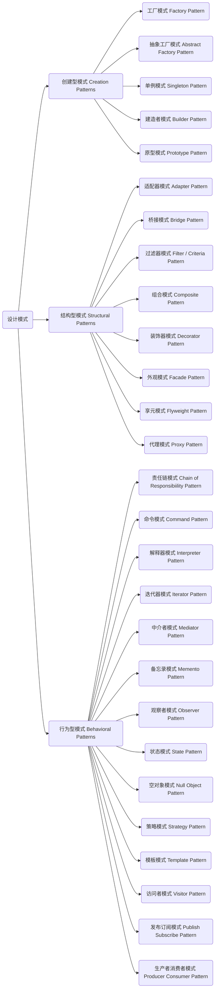
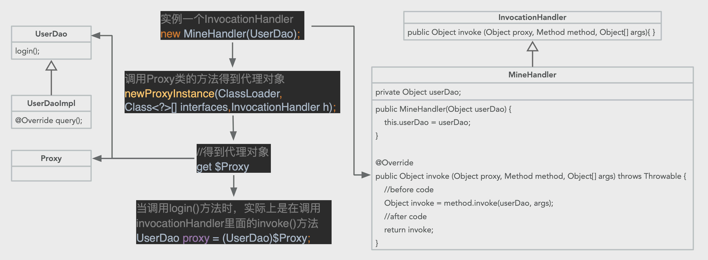

[设计模式_菜鸟鸟教程](https://www.runoob.com/design-pattern/design-pattern-tutorial.html)

[微信读书《Offer来了》设计模式专题](https://weread.qq.com/web/reader/d0c3212071a74c21d0c04fdk14b3246024514bfa6bb1534)

# 简介

## 设计模式思维导图




## 设计模式UML图

[23种设计模式UML图and简例](https://blog.csdn.net/wodengniya_/article/details/20798361?utm_medium=distribute.pc_relevant.none-task-blog-BlogCommendFromMachineLearnPai2-1.control&depth_1-utm_source=distribute.pc_relevant.none-task-blog-BlogCommendFromMachineLearnPai2-1.control)


# 创建型模式

## 单例模式

> **单例模式简介**

即单实例，只实例出来一个对象。

一般在创建一些`管理器类`、`工具类`的时候，需要用到单例模式，比如之前的 JDBCUtil 类，我们只需要一个实例即可（多个实例也可以实现功能，但是增加了代码量且降低了性能）。

**如何实现单例**：

+ 将构造方法私有化
+ 提供一个全局唯一获取该类实例的方法帮助用户获取类的实例

**应用场景**：

主要被用于一个全局类的对象在多个地方被使用并且对象的状态是全局变化的场景下。

**单例模式的优点**：

+ 单例模式为系统资源的优化提供了很好的思路，频繁创建和销毁对象都会增加系统的资源消耗，而单例模式保障了整个系统只有一个对象能被使用，很好地节约了资源。

**单例模式的写法**：

+ 懒汉模式（线程安全）
+ 饿汉模式
+ 静态内部类
+ 双重校验锁

>**懒汉模式**

懒汉模式很简单：

定义一个私有的静态对象`instance`，之所以定义`instance`为静态，是因为静态属性或方法是属于类的，能够很好地保障单例对象的唯一性；

然后定义一个加锁的静态方法获取该对象，如果该对象为`null`，则定义一个对象实例并将其赋值给`instance`，这样下次再获取该对象时便能够直接获取了。

懒汉模式在获取对象实例时做了`加锁操作`，因此是线程安全的。

代码如下：

```java
public class LazySingleton {
  
  	private static LazySingleton instance;
  
  	private LazySingleton(){}
  	
  	public static synchronized LazySingleton getInstance(){
      	if(instance == null){
          	instance = new LazySingleton();
        }
      	return instance;
    }
}
```


> **饿汉模式**

饿汉模式指在类中直接定义全局的静态对象的实例并初始化，然后提供一个方法获取该实例对象。

**懒汉模式和饿汉模式的最大不同在于**：

懒汉模式在类中定义了单例但是并未实例化，实例化的过程是在获取单例对象的方法中实现的，也就是说，在第一次调用懒汉模式时，该对象一定为空，然后去实例化对象并赋值，这样下次就能直接获取对象了；

而饿汉模式是在定义单例对象的同时将其实例化的，直接使用便可。也就是说，在饿汉模式下，在`Class Loader`完成后该类的实例便已经存在于JVM中了。

代码如下：

```java
public class HungrySingleton {
  
  	private static HungrySingleton instance = new HungrySingleton();
  	
  	private static HungrySingleton getInstannce(){
      	return instance;
    }
}
```


> **静态内部类**

静态内部类通过在类中定义一个静态内部类，将对象实例的定义和初始化放在内部类中完成，我们在获取对象时要通过静态内部类调用其单例对象。

之所以这样设计，是因为`类的静态内部类在JVM中是唯一的`，这很好地保障了单例对象的唯一性。

代码如下：

```java
public class Singleton {
  
  	private static class SingletonHolder {
      	private static final Singleton INSTANCE = new Singleton();
    }
  
  	private Singleton(){}
  
  	public static final Singleton getInstance(){
      	return SingletonHolder.INSTANCE;
    }
}
```


> **双重构校验锁**

在说双重构校验锁之前我们先来看看普通的实现方式：

```java
public class Singleton {
  
  	private static Singleton instance;
  
  	private Singleton(){}
  	
  	public static Singleton getInstance(){   // 这里没有加锁
      	if(instance == null){
          	instance = new Singleton();
        }
      	return instance;
    }
}
```

这段代码在多线程的情况下无法正常工作，在多个线程同时调用`getInstance()`时，由于没有锁，这些线程可能同时去创建对象，或者某个线程会得到一个未完全初始化的对象。

所以要对`getInstance()`加锁：

```java
public class Singleton {
  
  	private static Singleton instance;
  
  	private Singleton(){}
  	
  	public static synchronized Singleton getInstance(){  // 加锁
      	if(instance == null){
          	instance = new Singleton();
        }
      	return instance;
    }
}
```

加锁之后发现，这不就是懒汉模式的写法吗！但是这里有一个问题，懒汉模式虽然能够实现多线程下的单例，但是粗暴地将`getInstance()`锁住了，这样代价很大，为什么呢？

因为，只有当第一次调用`getInstance()`时才需要同步创建对象，创建之后再次调用`getInstance()`时就只是简单的返回成员变量，而这里是无需同步的，所以没必要对整个方法加锁。

由于同步一个方法会降低100倍或更高的性能， 每次调用获取和释放锁的开销似乎是可以避免的：一旦初始化完成，获取和释放锁就显得很不必要。

所以就有了双重校验锁的方式：

+ 双锁模式指在懒汉模式的基础上做进一步优化，给静态对象的定义加上`volatile锁`来保障初始化时对象的唯一性，在获取对象时通过`synchronized (Singleton.class)`给单例类加锁来保障操作的唯一性。

代码如下：

```java
public class Lock2Singleton {
  	
  	private volatile static Lock2Singleton singleton;  // 1. 对象锁
  
  	private Lock2Singleton(){}
  
  	public static Lock2Singleton getSingleton(){
      	if(singleton == null){
          	synchronized(Lock2Singleton.class){        // 2. synchronized 方法锁
              	if(singleton == null){
                  	singleton = new Lock2Singleton();
                }
            }
        }
      	return singleton;
    }
}
```

这个过程就是：

1. 检查变量是否被初始化（不去获得锁），如果已被初始化立即返回这个变量；
2. 获取锁；
3. 第二次检查变量是否已经被初始化：如果其他线程曾获取过锁，那么变量已被初始化，返回初始化的变量；
4. 否则，初始化并返回变量。

> **为什么是双重校验？**

这里发现有两个`if`判断，即`双重校验`。

第一次校验：也就是第一个`if(singleton==null)`，前面说过，这个是为了代码提高代码执行效率，由于单例模式只需要创建一次实例即可，所以当创建了一个实例之后，再次调用`getSingleton()`就不必要进入同步代码块，不用竞争锁，直接返回前面创建的实例即可。

第二次校验：也就是第二个`if(singleton==null)`，这个校验是防止再次创建实例，假如有一种情况，当`singleton`还未被创建时，线程T1调用`getSingleton()`，由于第一次判断`singleton==null`，此时线程T1准备继续执行，但是由于资源被线程T2抢占了，此时T2调用`getSingleton()`，同样地，由于`singleton`并没有实例化，T2同样可以通过第一个`if`，然后继续往下执行，同步代码块，第二个`if`也通过，然后线程T2创建了一个实例`singleton`。此时线程T2完成任务，资源又回到线程T1，T1此时也进入同步代码块，如果没有这个第二个`if`，那么，T1也会创建一个`singleton`实例，那么，就会出现创建多个实例的情况，但是加上第二个`if`，就可以完全避免这个多线程导致多次创建实例的问题。

所以说：**两次校验都必不可少!**

> **为什么给静态对象的定义加上`volatile锁`？**

可以先了解一下[关于Java的volatile关键字](https://blog.csdn.net/weixin_44471490/article/details/107543731)

这里的`volatile`也是必不可少的，它有两个作用。


**第一个作用：防止JVM指令重排，从而保证在多线程下也能正常执行**

`singleton = new Lock2Singleton()` 这句话可以分为三步：

1. 为`singleton`分配内存空间；
2. 初始化`singleton`；
3. 将`singleton`指向分配的内存空间。

但是由于JVM具有指令重排的特性，执行顺序有可能变成 1→3→2。 指令重排在单线程下不会出现问题，但是在多线程下会导致一个线程获得一个未初始化的实例。

例如：线程T1执行了1和3，此时T2调用`getSingleton()`后发现`singleton`不为空，因此返回`singleton`， 但是此时的`singleton`还没有被初始化。


**第二个作用：保证变量在多线程运行时的可见性**

在 JDK1.2 之前，Java的内存模型实现总是从主存（即共享内存）读取变量，是不需要进行特别的注意的。而在当前 的 Java 内存模型下，线程可以把变量保存到本地内存（比如机器的寄存器）中，而不是直接在主存中进行读写。

这就可能造成，一个线程在主存中修改了一个变量的值，而另外一个线程还继续使用它在寄存器中的变量值的拷贝，造成数据的不一致。 要解决这个问题，就需要把变量声明为`volatile`，这就指示 JVM，这个变量是不稳定的，每次使用它都到主存中进行读取。


## 工厂模式

[菜鸟教程](https://www.runoob.com/w3cnote/factory-pattern.html)

### 概念

工厂方法模式是一种**创建对象的模式**，它被广泛应用在jdk中以及Spring和Struts框架中；

其中 Spring的 BeanFactory 的实现类XmlBeanFactory用来读取 Bean 的配置文件 applicationContext.xml ，这里的 BeanFactory 采用的就是工厂设计模式

工厂方法模式基于"输入"，应用在超类和多个子类之间的情况，这种模式将创建对象的责任转移到工厂类

超类可以是接口、抽象类、父类，本例中选择接口

菜鸟教程用一个例子来具体说明了什么是工厂设计模式

+ 在这个例子中，有一个接口Computer，两个类 PC 和 Server 皆实现此接口，且有各自的构造器
+ 另外有一个工程类，工厂类中除了可传入 PC 和 Server 的构造器参数外，还有一个参数type用于判断是 PC 还是 Server 
+ 传入相应参数，在工厂类内部实现返回创建的PC和Server 实例的方法getComputer()，这样当我们想创建 PC 或 Server ，我们只需通过工厂类的 getComputer() 方法即可创建
+ 就好像我们直接从工厂中取一样

当我们传不同的参数给getComputer()时，得到的是不同子类的对象，这有点多态的意思，多态是父类引用指向子类对象，两者还是有区别的

### Java代码实现

<font color=DarkOrchid>**Computer接口**</font>

```java
public interface Computer {
    public abstract String getRAM();
    public abstract String getHDD();
    public abstract String getCPU();
}
```

<font color=DarkOrchid>**子类 PC 和 Server 实现 Computer**</font>

```java
public class PC implements Computer {
    private String ram;
    private String hdd;
    private String cpu;

    public PC(String ram, String hdd, String cpu){
        this.ram=ram;
        this.hdd=hdd;
        this.cpu=cpu;
    }

    @Override
    public String getRAM() {
        return this.ram;
    }

    @Override
    public String getHDD() {
        return this.hdd;
    }

    @Override
    public String getCPU() {
        return this.cpu;
    }

    @Override
    public String toString(){
        return "RAM= "+this.getRAM()+", HDD="+this.getHDD()+", CPU="+this.getCPU();
    }
}
```

```java
public class Server implements Computer {
    private String ram;
    private String hdd;
    private String cpu;

    public Server(String ram, String hdd, String cpu){
        this.ram=ram;
        this.hdd=hdd;
        this.cpu=cpu;
    }

    @Override
    public String getRAM() {
        return this.ram;
    }

    @Override
    public String getHDD() {
        return this.hdd;
    }

    @Override

    public String getCPU() {
        return this.cpu;
    }

    @Override
    public String toString(){
        return "RAM= "+this.getRAM()+", HDD="+this.getHDD()+", CPU="+this.getCPU();
    }
}
```

<font color=DarkOrchid>**工厂类 ComputerFactory**</font>

```java
public class ComputerFactory {
    public static Computer getComputer(String type, String ram, String hdd, String cpu){
        if("PC".equalsIgnoreCase(type)) {
            return new PC(ram, hdd, cpu);
        }
        else if("Server".equalsIgnoreCase(type)){
            return new Server(ram, hdd, cpu);
        }
        return null;
    }
}
```

<font color=DarkOrchid>**测试**</font>

```java
public class Test {
    public static void main(String[] args) {
        Computer pc = ComputerFactory.getComputer("pc","2 GB","500 GB","2.4 GHz");
        Computer server = ComputerFactory.getComputer("server","16 GB","1 TB","2.9 GHz");

        System.out.println("Factory PC Config::"+pc);
        System.out.println("Factory Server Config::"+server);
    }
}
```

<font color=DarkOrchid>**结果**</font>

```java
Factory PC Config::RAM= 2 GB, HDD=500 GB, CPU=2.4 GHz
Factory Server Config::RAM= 16 GB, HDD=1 TB, CPU=2.9 GHz
```

### JDK 中的工厂模式

> JDK 中的工厂设计模式实例

` Java.util.Calendar`，`ResourceBundle and NumberFormat getInstance()` 使用了工厂方法模式

valueOf() 在包装类中，如Boolean \  Integer 也使用了工厂方法模式

### 工厂设计模式优点

面向接口编程，体现了面向对象的思想

将创建对象的工作转移到了工厂类

### Why 工厂模式

> 为什么使用工厂模式？

1. **解耦**

将对象的创建和使用的过程分开。

2. **提高代码重用性**

工厂模式可以降低代码重复。如果创建对象的过程都很复杂，需要一定的代码量，而且很多地方都要用到，那么就会有很多的重复代码。我们可以将这些创建对象的代码放到工厂里统一管理。既减少了重复代码，也方便以后对的创建过程的修改维护。

>  当然，你可能说也可以把这些创建过程的代码放到类的构造函数里，同样可以降低重复率，而且构造函数本身的作用也是初始化对象。但是，这样也会导致构造函数过于复杂，做的事太多，不符合 Java 的设计原则。）

由于创建过程都由工厂统一管理，所以发生业务逻辑变化，不需要找到所有需要创建B的地方去逐个修正，只需要在工厂里修改即可，降低维护成本。

同理，想把所有调用 B 的地方改成 B 的子类 B1，只需要在对应生产 B 的工厂中或者工厂的方法中修改其生产的对象为 B1 即可，而不需要找到所有的 new B() 改为 new B1()。

另外，因为工厂管理了对象的创建逻辑，使用者并不需要知道具体的创建过程，只管使用即可，减少了使用者因为创建逻辑导致的错误。

例如：

一个数据库工厂，可以返回一个数据库实例，可以是 mysql、oracle 等。

这个工厂就可以把数据库连接需要的用户名、地址、密码等封装好，直接返回对应的数据库对象就好。不需要调用者自己初始化，减少了写错密码等等这些错误。调用者只负责使用，不需要管怎么去创建、初始化对象。

还有，如果一个类有多个构造方法（构造的重写），我们也可以将它抽出来，放到工厂中，一个构造方法对应一个工厂方法并命名一个友好的名字，这样我们就不再只是根据参数的不同来判断，而是可以根据工厂的方法名来直观判断将要创建的对象的特点。这对于使用者来说，体验比较好。


### 应用场景

> 不限于以下场景

对象的创建过程/实例化准备工作很复杂，需要初始化很多参数、查询数据库等。

类本身有好多子类，这些类的创建过程在业务中容易发生改变，或者对类的调用容易发生改变。


# 结构型模式

## 过滤器模式


## 装饰器模式

装饰者模式（Decorator Pattern）指在无须改变原有类及类的继承关系的情况下，动态扩展一个类的功能。它通过装饰者来包裹真实的对象，并动态地向对象添加或者撤销功能。

装饰者模式包括Source和Decorator两种角色，Source是被装饰者，Decorator是装饰者。

装饰者模式通过装饰者可以为被装饰者Source动态添加一些功能。

**定义Sourceable接口**：

```java
public interface Sourceable {
    public void createComputer();
}
```

**定义Sourceable接口的实现类Source**：

```java
public class Source implements Sourceable {
    @Override
    public void createComputer() {
        System.out.println("create computer by Source");
    }
}
```

**定义装饰者类Decorator**：

```java
public class Decorator implements Sourceable {
    //装饰者类通过构造函数将 Sourceable 实例初始化到其内部
  	//并在其方法createComputer()调用原方法后加上了「装饰者逻辑」（即"make system"）
    private Sourceable source;

    public Decorator(Sourceable source) {
        this.source = source;
    }

    @Override
    public void createComputer(){
        source.createComputer();
        System.out.println("make system");
    }
}
```

**测试**：

```java
public class testDemo {
  	public static void main(String[] args) {
      	//在使用装饰者模式时，需要先定义一个待装饰的Source类的source对象
      	//然后初始化构造器Decorator并在构造函数中传入source对象
      	//最后调用createComputer()，程序在创建完电脑后还为电脑安装了系统。
        Sourceable source = new Source();
        Sourceable obj = new Decorator(source);
        obj.createComputer();
    }
}
```


## 代理模式

代理模式指，通过代理的方式，为对象提供一种**访问并控制**该对象行为的方法。

在客户端不适合或者不能够直接引用一个对象时，可以通过该对象的代理对象来实现对该对象的访问。

可以将代理对象理解为客户端和目标对象之间的中介者。


比如企业在招人时，不用自己去市场上找，可以通过代理（猎头公司）去找，代理（猎头公司）有候选人池，可根据企业的需求筛选出合适的候选人返回给企业。

**定义Company接口**：

```java
public interface Company {
    void findWorker(String title);
}
```

**定义Company接口的实现类HR**：

```java
public class HR implements Company{
    @Override
    public void findWorker(String title){
        System.out.println("I need find a worker,title is:" + title);
    }
}
```

**定义代理类Proxy**：

```java
public class Proxy implements Company {

    private HR hr;

    public Proxy(){
        this.hr = new HR();
    }

    @Override
    public void findWorker(String title){
        hr.findWorker(title);

        String worker = getWorker(title);
        System.out.println("find a worker by proxy,worker name is:" + worker);
    }

    private String getWorker(String title){
        Map<String,String> workerList = new HashMap<String,String>(){
            {
                put("Java","张三");
                put("Python","李四");
                put("PHP","王五");
            }
        };

        return workerList.get(title);
    }
}
```

**测试**：

```java
public class testDemo {
    public static void main(String[] args) {
        Company company = new Proxy();
        company.findWorker("Java");
    }
}
```


## 装饰器模式 vs 代理模式

> 装饰器模式和代理模式的区别？

通俗地讲：

+ 为让自己的能力增强，使得增强后的自己能够使用更多的方法，拓展在自己基础之上的功能的，叫**装饰器模式**
+ 让别人帮助你做你并不关心的事情，叫**代理模式**

从概念上讲：

+ 装饰器模式强调的是增强自身，在被装饰之后你能够在被增强的类上使用增强后的功能。增强后你还是你，只不过能力更强了而已；
+ 代理模式强调要让别人帮你去做一些本身与你业务没有太多关系的职责（记录日志、设置缓存）。代理模式是**为了实现对象的控制**，因为**被代理的对象往往难以直接获得**或者是**其内部不想暴露出来**。

从代码中可以看出：

+ 装饰器的构造函数中需要传入原型对象source；

+ 而代理模式是空参构造函数，在创建Proxy对象时，其内部创建了一个被代理对象作为其成员变量。


## JDK动态代理

[彻底掌握JDK动态代理,Java架构师面试精讲【鲁班学院】](https://www.bilibili.com/video/BV1kg4y1b7tk?from=search&seid=18117403242675023043)

[原文](https://www.jianshu.com/p/1a76e516aa53)

### Why 代理

> 为什么使用代理？

简单地说，除了当前类能够提供的功能外，我们还需要补充一些其他功能。

最容易想到的情况就是`权限过滤`**，**比如有一个类可以用来做某项业务，但是由于安全原因只有某些用户才可以调用这个类，此时我们就可以做一个该类的代理类，要求所有请求必须通过该代理类，由该代理类做权限判断，如果安全则调用`实际类`的业务开始处理。

可能有人说为什么我要多加个代理类？我只需要在原来类的方法里面加上权限过滤不就完了吗？

+ 在类的设计中有一个`类的单一性原则`问题，就是每个类的功能尽可能单一，因为只有功能单一这个类被改动的可能性才会更小。

### 静态代理

+ 静态代理的实现方式有：`继承`与`聚合`

> **继承**

比如现在有个类`UserDaoImpl`，里面有个查询的方法`query(String name)`，我们想在查询之前添加其他业务逻辑，比如日志，为了不破坏原有代码的完整性，我们用一个代理类去继承这个`UserDaoImpl`，然后在代理类内部添加其他的业务逻辑代码，然后重写`query(String name)`

代码如下：

定义需要被代理的类UserDaoImpl

```java
public class UserDaoImpl {
    public void query(String name){
        System.out.println("query name = " + name);
    }
}
```

定义代理类LogUserProxy，且继承UserDaoImpl：

```java
public class LogUserProxy extends UserDaoImpl {
  	@Override
    public void query(String name){
        //新加入的代码
        System.out.println("log...");

        System.out.println("query name = " + name);
    }
}
```

测试：

```java
public class Test {
    public static void main(String[] args) {
        UserDaoImpl userDao = new LogUserProxy();
        userDao.query("Daley");
    }
}
```

运行结果：

```java
log...
query name = Daley
```

但是这个模式有一个缺陷，如果现在又来了一个需求，之前只是输出日志，现在又要添加一个记录执行时间的功能，那么现在又要给它加一个代理，相应地，我们需要新增加一个处理时间的代理类 TimerUserProxy，那么问题来了，LogUserProxy 和 TimerUserProxy都继承了UserDaoImpl，那么你是通过new LogUserProxy()去代理还是通过new TimerUserProxy()去实现呢？结果是只能实现一个功能。

而`接口`就可以实现这个功能。

> **聚合**

用代理对象实现目标对象接口这种方式叫做静态代理中的`「聚合」`

目标对象和代理对象实现同一个接口，并且代理对象中包含抽象对象

定义一个接口UserDao：

```java
public interface UserDao {
  	public void query(String name);
}
```

定义接口实现类 UserDaoImpl：

```java
public class UserDaoImpl implements UserDao{
  	@Override
    public void query(String name){
        System.out.println("query name = " + name);
    }
}
```

定义代理类 LogUserProxy：

```java
public class LogUserProxy implements UserDao {
    private UserDao userDao;

    public LogUserProxy(UserDao userDao){
        this.userDao = userDao;
    }

    @Override
    public void query(String name){
        System.out.println("log...");
        userDao.query(name);
    }
}
```

定义代理类 TimerUserProxy:

```java
public class TimerUserProxy implements UserDao {
    private UserDao userDao;

    public TimerUserProxy(UserDao userDao){
        this.userDao = userDao;
    }

    @Override
    public void query(String name){
        System.out.println("Timer...");
        userDao.query(name);
    }
}
```

测试：

```java
public class Test {
    public static void main(String[] args) {
        UserDao userDao = new UserDaoImpl();
        UserDao proxy1 = new LogUserProxy(userDao);
        UserDao proxy2 = new TimerUserProxy(proxy1);
        
        proxy2.query("Daley");
    }
}
```

运行结果：

```java
Timer...
log...
query name = Daley
```


### 动态代理

> **静态代理的缺陷以及为什么使用动态代理？**

① 代理类依赖于真实类，因为代理类最根本的业务功能是需要通过调用真实类来实现的。那么如果事先不知道真实类，该如何使用代理模式呢？

② 一个真实类必须对应一个代理类，即当有多个真实类RealA、RealB、RealC...的时候，就需要多个代理类ProxyA、ProxyB、ProxyC...，这样的话如果大量使用静态代理，容易导致类的急剧膨胀。

为了解决① ②，`JAVA动态代理`应运而生。

> **动态代理的优点**

动态代理的好处是在程序运行的过程中自动生成代理类`字节码文件`，存到磁盘中（这样不会占用项目空间），`用完之后自动删除`，这样既完成了任务，又不占内存。

试想，如果是我们自己来做这件事，一个可行的方法就是我们编写一个个ProxyUtil功能类，里面编写代码，用于我们想要生成的代理完成自动拼接，比如上面的 `LogUserProxy` 类里面的内容我们用 `ProxyUtil` 来动态地生成。

思路：

+ .java文件（一个类的.java文件本质上就是一个文本文件，即字符串）
+ 编译成为一个.class文件
+ 通过反射得到一个对象（代理对象）


### 动态代理 DIY

+ 自己动手实践一个动态代理，通过自己实现的这个过程来加深对JDK动态代理的理解

LogUserProxy类完整内容：

```java
package com.zhr.proxy;
import com.zhr.dao.UserDao; 

public class LogUserProxy implements UserDao {
    private UserDao userDao;

    public LogUserProxy(UserDao userDao){
        this.userDao = userDao;
    }

    @Override
    public void query(String name){
        System.out.println("log...");
        userDao.query(name);
    }
}
```

通过`聚合`的方式把这个类(比如LogUserProxy)`“拼接”`出来，然后在里面进行一些动态处理。

+ 通过调用`ProxyUtil`类的`newProxyInstance(Object target)`方法，方法中传入需要被代理的类实例作为参数，就可以创建一个代理类实例。

+ 有一部分要把它写死，有一部分要把它写活

```java
import java.io.File;
import java.io.FileWriter;
import java.io.IOException;
import java.lang.reflect.Method;

public class ProxyUtil {
  	
    public static Object newProxyInstance(Object target) throws IOException { // target 是需要被代理的类
        String content = "";
        String packageContent = "package com.zhr;";

        Class targetInfo = target.getClass().getInterfaces()[0];     //获取目标类接口
        String targetInfoName = targetInfo.getSimpleName();          //获取目标类名UserDao
        String importContent = "import " + targetInfo.getName() + ";"; //导包

        String classContent = "public class $Proxy implements " + targetInfoName + "{";
        String fieldContent = "private " + targetInfoName + " target;";       //对应private UserDao userDao;
        String constructerContent = "public $Proxy(" + targetInfoName + " target){" + "this.target = target;}";

        //当类中有多个方法时，用循环来实现，比如上面除了query()还有其他方法
        String methodsContent = "";
        Method[] methods = targetInfo.getDeclaredMethods();
        for(Method method : methods) {
            String methodName = method.getName();
            Class returnType = method.getReturnType();
            Class<?>[] parameterTypes = method.getParameterTypes();  //参数类型
            String argsContent = "";
            String argsNames = "";
            int i = 0;
            for(Class<?> parameterType : parameterTypes){
                String simpleName = parameterType.getSimpleName();
                argsContent += simpleName + " p" + i + ",";               //pi为参数名
                argsNames += "p" + i + ",";
                i++;
            }
            if(argsContent.length() > 0){
                argsContent = argsContent.substring(0,argsContent.lastIndexOf(",")-1);
                argsNames = argsNames.substring(0,argsNames.lastIndexOf(",")-1);
            }
            methodsContent = "public "+returnType+" "+methodName+"("+argsContent+"){"
                    +"System.out.println(\"log...\");"
                    +"target."+methodName+"("+argsNames+");}";
        }
        content += packageContent+importContent+classContent+fieldContent+constructerContent+methodsContent+"}";
        //写出到磁盘
        File file = new File("/Users/superfarr/Desktop/$Proxy.java");
        if(!file.exists()){
            file.createNewFile();
        }
        FileWriter fileWriter = new FileWriter(file);
        fileWriter.write(content);
        fileWriter.flush();
        fileWriter.close();
        return null;
    }
}
```

测试：

```java
import com.zhr.dao.UserDao;
import com.zhr.dao.UserDaoImpl;
import com.zhr.proxy.LogUserProxy;
import com.zhr.proxy.TimerUserProxy;
import com.zhr.utils.ProxyUtil;

import java.io.IOException;

public class Test {
    public static void main(String[] args) throws IOException {
      
        UserDao userDao = new UserDaoImpl();
        UserDao proxy1 = new LogUserProxy(userDao);
        UserDao proxy2 = new TimerUserProxy(proxy1);
        proxy2.query("Daley");

        ProxyUtil.newProxyInstance(userDao);

    }
}
```

最终生成一个`$Proxy.java`，为了查看`$Proxy.java`中的内容，我们将桌面生成的`$Proxy.java`文件放到项目文件夹下，格式化之后可得如下内容：

```java
package com.zhr.test;import com.zhr.dao.UserDao;
public class $Proxy implements UserDao{
    private UserDao target;
    public $Proxy(UserDao target){
        this.target = target;
    }
    public void query(String p){
        System.out.println("log...");
        target.query(p);
    }
}
```

那么如何用呢？

这个`$Proxy.java`文件是在磁盘上的，通过编译成`.class`文件

这里只能用JDK的一个工具 JavaCompiler  

```java
public class ProxyUtil {
    public static Object newProxyInstance(Object target) throws IOException {
        ...
        //编译
        JavaCompiler compiler = ToolProvider.getSystemJavaCompiler();
        StandardJavaFileManager fileManager = compiler.getStandardFileManager(null,null,null);
        Iterable units = fileManager.getJavaFileObjects(file);
        JavaCompiler.CompilationTask task = compiler.getTask(null,fileManager,null,null,null,units);
        task.call();
        fileManager.close();

        //编译完之后要怎么加载磁盘上的.class文件到进程中
        URL[] urls = new URL[]{new URL("file:/Users/superfarr/Desktop/")};
        URLClassLoader urlClassLoader = new URLClassLoader(urls);
        Class clazz = urlClassLoader.loadClass("com.zhr.$Proxy");
        Constructor constructor = clazz.getConstructor(targetInfo);
        Object proxy = constructor.newInstance(target);
        return proxy;
    }
}
```

测试：

```java
public class Test {
    public static void main(String[] args) throws IOException, ClassNotFoundException, NoSuchMethodException, InvocationTargetException, InstantiationException, IllegalAccessException {
        UserDao userDao = new UserDaoImpl();
//        UserDao proxy1 = new LogUserProxy(userDao);
//        UserDao proxy2 = new TimerUserProxy(proxy1);
//        proxy2.query("Daley");

        UserDao proxy = (UserDao) ProxyUtil.newProxyInstance(userDao);
        proxy.query("Daley");
    }
}
```

运行结果：

```java
log...
query name = Daley
```


### JDK动态代理

静态代理是在编译期就已经确定代理类和真实类的关系，并且生成代理类的。而动态代理是在运行期利用JVM的`反射机制`生成代理类，这里是直接生成类的`字节码`，然后通过类加载器载入JAVA虚拟机执行。

现在主流的JAVA动态代理技术的实现有两种：一种是JDK自带的，就是我们所说的`JDK动态代理`，另一种是开源社区的一个开源项目`CGLIB`。这里主要讲JDK动态代理。

JDK动态代理的实现是在运行时，根据`一组`接口定义，使用`Proxy`、`InvocationHandler`等工具类去生成一个`代理类`以及`代理类实例`。

+ 刚才是我们自己实现的一个动态代理，现在不用了，我们用JDK的工具类就可以实现，而且更好，上面的过程只是帮助我们更好地理解JDK动态代理的原理

JDK动态代理的类关系模型和静态代理看起来差不多，也是需要一个或一组接口来定义行为规范，需要一个代理类来实现接口**。**区别是`没有真实类`，因为动态代理就是要解决在不知道真实类的情况下依然能够使用代理模式的问题。

JDK动态代理技术生成的代理类，类名的生成规则是前缀"`$Proxy`"加上一个序列数（就是我们上面做的）。


### JDK动态代理原理

有了前面的基础之后，现在再来看JDK动态代理的源码就比较好理解了

+ `Proxy`是个工具类，用于为`接口`生成动态代理类

+ 注入`InvocationHandler`实例来生成代理类实例

> **样例分析**

定义一个接口，在接口中定义一个方法：

```java
public interface UserDao {
    public void query(String name);
}
```

`UserDaoImpl`类实现`UserDao`接口：

```java
public class UserDaoImpl implements UserDao {
    @Override
    public void query(String name){
        System.out.println("query name = " + name);
    }
}
```

编写一个我们自己的`调用处理类`，这个类需要实现`InvocationHandler`接口：

```java
public class MineHandler implements InvocationHandler {

    private Object userDao;

    // 把目标对象接口传进来
    public MineHandler(Object userDao){
        this.userDao = userDao;
    }

    @Override
    public Object invoke(Object proxy, Method method, Object[] args) throws Throwable{

        System.out.println("Timer...");  // before code

        Object invoke = method.invoke(userDao, args);

        System.out.println("log...");    // after code

        return invoke;
    }
}
```

+ `InvocationHandler`接口只有一个待实现的`invoke`方法
+ `proxy`表示动态代理类实例
+ `method`表示调用的方法

测试：

```java
public class Test {
    public static void main(String[] args) {
      
        UserDao userDao = new UserDaoImpl();
        MineHandler mineHandler = new MineHandler(userDao);

        UserDao proxy = (UserDao)Proxy.newProxyInstance(
                UserDao.class.getClassLoader(),     // 类加载器(用于加载该代理类)
                new Class[]{UserDao.class},         // Class数组(用于存储待实现的接口信息)
                mineHandler                         // 传入InvocationHandler实例
        );

        proxy.query("hory");
    }
}
```

运行结果：

```
Timer...
query name = hory
log...
```

+ 可以发现，这里把业务逻辑分派给了`MineHandler`去实现，然后将MineHandler实例传入`Proxy.newProxyInstance()`去生成代理类实例

+ 这里的Proxy类就相当于上面我们自己定义的ProxyUtil，Proxy类的`newProxyInstance()`方法就相当于ProxyUtil的`newProxyInstance()`方法。

+ `Proxy.newProxyInstance( )`返回的是Object类型，然后转为代理类接口类型，让代理类实例 proxy 指向此接口，最后执行 `proxy.query("hory");`



动态代理实际上是`「程序在运行过程中，根据被代理的接口来动态生成代理类的.class文件，并加载.class文件运行」`的过程。


### 面向接口

> JDK 动态代理为什么只能针对接口？

因为 Java 的单继承，动态生成的代理类已经继承了Proxy类，就不能再继承其他的类，所以只能靠实现「被代理类的接口」的形式，故JDK的动态代理必须有接口。

动态字节码的生成。ASM、CGLib

[ASM](https://blog.csdn.net/ljz2016/article/details/81354362?utm_medium=distribute.pc_feed_404.none-task-blog-BlogCommendFromBaidu-1.nonecase&depth_1-utm_source=distribute.pc_feed_404.none-task-blog-BlogCommendFromBaidu-1.nonecas)


# 行为型模式

## 观察者模式


## 反应器模式

[Reactor设计模式基础知识](https://blog.csdn.net/jxnu_xiaobing/article/details/44945623?ops_request_misc=%25257B%252522request%25255Fid%252522%25253A%252522161015976916780264639113%252522%25252C%252522scm%252522%25253A%25252220140713.130102334..%252522%25257D&request_id=161015976916780264639113&biz_id=0&utm_medium=distribute.pc_search_result.none-task-blog-2~all~baidu_landing_v2~default-1-44945623.first_rank_v2_pc_rank_v29&utm_term=%E8%AE%BE%E8%AE%A1%E6%A8%A1%E5%BC%8Freactor%E6%A8%A1%E5%BC%8F)


## 发布订阅模式

[设计模式之发布订阅模式(1) 一文搞懂发布订阅模式](https://www.jianshu.com/p/c391c77a8771)


## 生产者消费者模式


