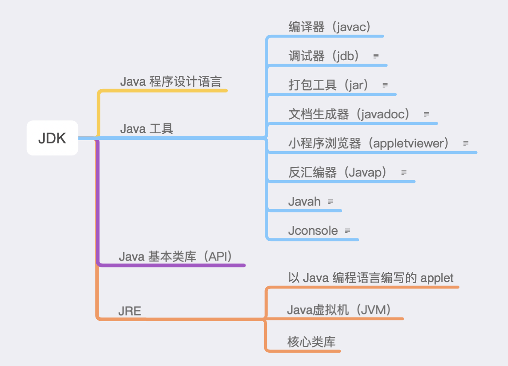
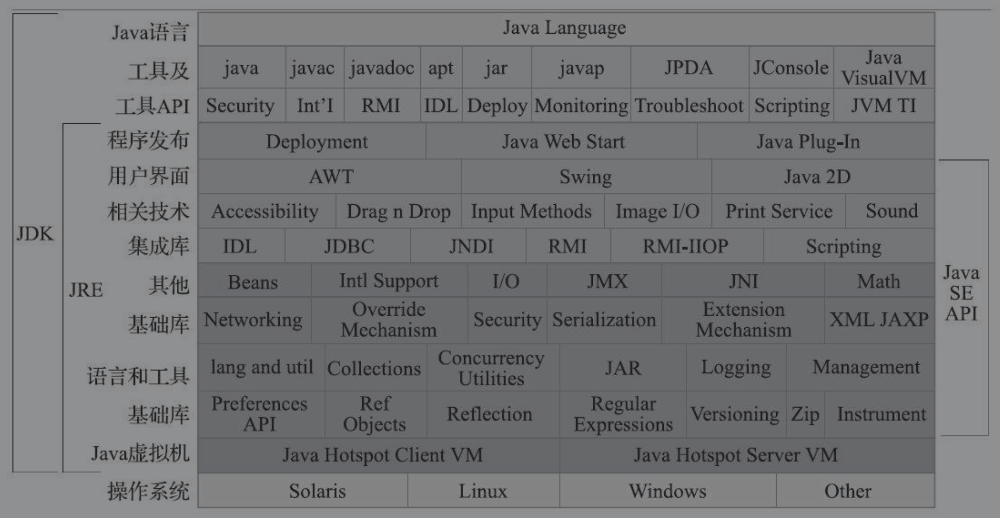
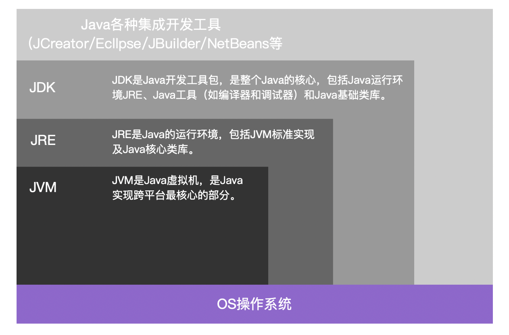
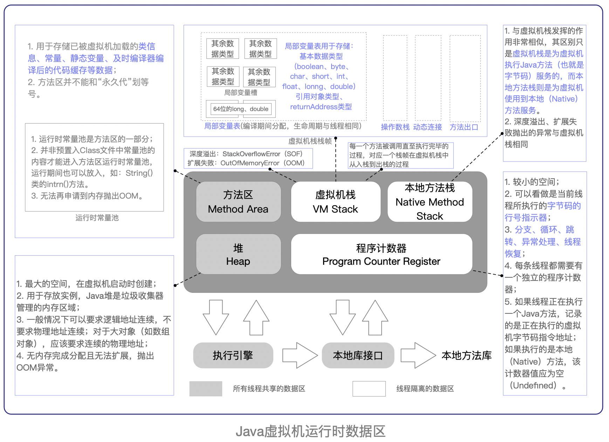
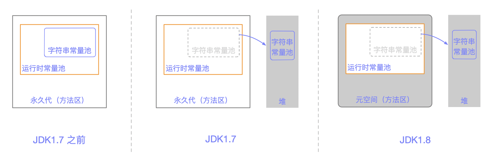
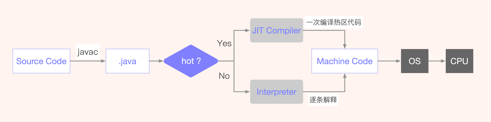
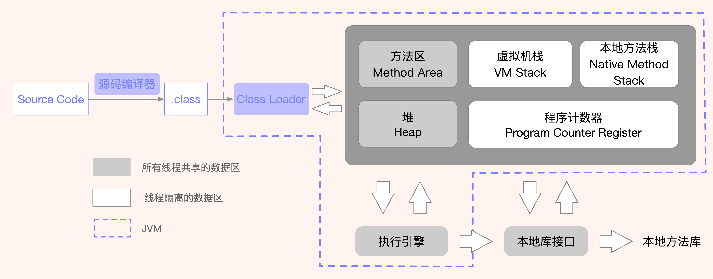
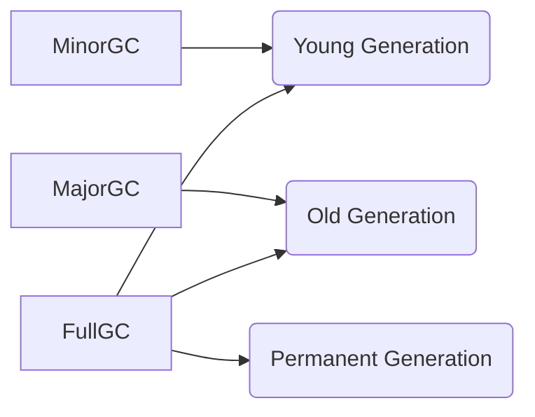
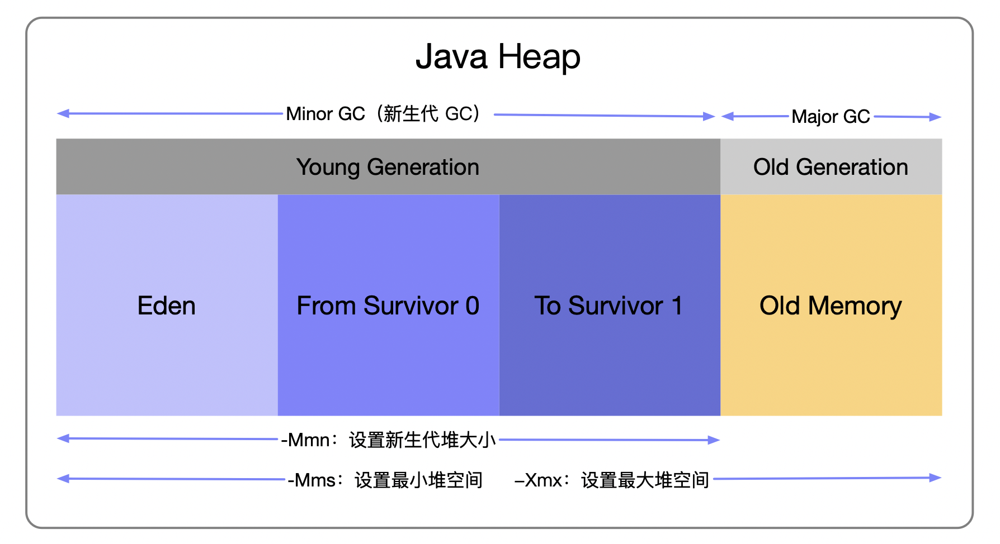
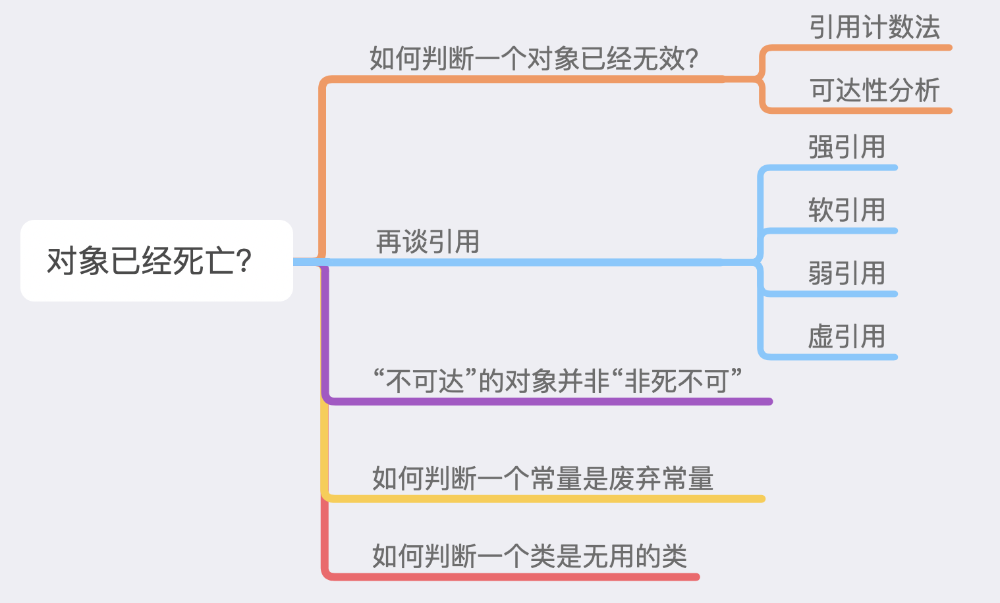

# Java 技术体系

从广义上讲，Kotlin、Clojure、JRuby、Groovy等运行于Java虚拟机上的编程语言及其相关的程序都属于Java技术体系中的一员。如果仅从传统意义上来看，JCP官方所定义的Java技术体系包括了以下几个组成部分：

+ Java程序设计语言
+ 各种硬件平台上的Java虚拟机实现
+ Java类库API
+ Class文件格式
+ 来自商业机构和开源社区的第三方Java类库

我们可以把`Java程序设计语言`、`Java虚拟机`、`Java类库`这三部分统称为`JDK（Java Development Kit）`，JDK是用于支持Java程序开发的最小环境。

可以把`Java类库API中的Java SE API子集`和`Java虚拟机`这两部分统称为`JRE（Java Runtime Environment）`，JRE是支持Java程序运行的标准环境。



**Java技术体系所包括的内容**：







> Java 核心类库

Java自带很多实用的包，这些包中定义了很多类库，可以很方便地进行代码重用。
常用的Java核心包及其功能是：

| 包名            | 主要功能                                                   |
| --------------- | ---------------------------------------------------------- |
| java.applet     | 提供了创建applet需要的所有类                               |
| java.awt.*      | 提供了创建用户界面以及绘制和管理图形、图像的类             |
| java.beans.*    | 提供了开发Java Beans需要的所有类                           |
| java.io         | 提供了通过数据流、对象序列以及文件系统实现的系统输入、输出 |
| java.lang.*     | Java编程语言的基本类库                                     |
| java.math.*     | 提供了简明的整数算术以及十进制算术的基本函数               |
| java.rmi        | 提供了与远程方法调用相关的所有类                           |
| java.net        | 提供了用于实现网络通讯应用的所有类                         |
| java.security.* | 提供了设计网络安全方案需要的一些类                         |
| java.sql        | 提供了访问和处理来自于Java标准数据源数据的类               |
| java.util.*     | 包括集合类、时间处理模式、日期时间工具等各类常用工具包     |

除此之外，还有Java 的扩展包，其包名及主要功能是:

| 包名                | 主要功能                                                   |
| ------------------- | ---------------------------------------------------------- |
| javax.accessibility | 定义了用户界面组件之间相互访问的一种机制                   |
| javax.naming.*      | 为命名服务提供了一系列类和接口                             |
| javax.swing.*       | 提供了很多轻量级的用户界面组件，是目前Java用户界面常用的包 |

**java.lang.***

这是 Java 最为基础和常用的包，是唯一可以不用 import 直接导入的包，其在编译的过程中会自动加载。在该包中定义了Object类，类型包容器，字符串类，System类，Runtime类等相关核心部分。后续部分将主要详解java.lang包内的一些关键类及其实现思想和JDK代码。


> Java SE & Java EE

**Java SE（Standard Edition）**：支持面向桌面级应用（如Windows下的应用程序）的Java平台，提供了完整的Java核心API，这条产品线在JDK 6以前被称为J2SE。

**Java EE（Enterprise Edition）**：支持使用多层架构的企业应用（如ERP、MIS、CRM应用）的Java平台，除了提供Java SE API外，还对其做了大量有针对性的扩充[插图]，并提供了相关的部署支持，这条产品线在JDK 6以前被称为J2EE，在JDK 10以后被Oracle放弃，捐献给Eclipse基金会管理，此后被称为JakartaEE。


# JVM 简介

> [**JVM**](https://baike.baidu.com/item/JVM/2902369?fr=aladdin) 是Java Virtual Machine（Java虚拟机）的缩写

引入Java语言虚拟机后，Java 语言在不同平台上运行时不需要重新编译。Java语言使用Java虚拟机屏蔽了与具体平台相关的信息，使得 Java 语言编译程序只需生成在 Java 虚拟机上运行的目标代码（字节码），就可以在多种平台上不加修改地运行。

Java虚拟机可以看做是一台抽象的计算机，如同真实的计算机那样，它有自己的`指令集`以及各种`运行时内存区域`，它与Java语言没有必然的联系，只与`特定的二进制文件——class 文件`格式关联（`字节码文件`），可以通过`Java语言或者其他语言`编写的程序编译成class文件，然后在Java虚拟机上运行。

Java虚拟机本质上就是一个`程序`，当它在命令行上启动的时候，就开始执行保存在某字节码文件中的指令。Java语言的可移植性正是建立在 Java 虚拟机的基础上。`任何平台只要装有针对于该平台的Java虚拟机，字节码文件（.class）就可以在该平台上运行。`这就是“一次编译，多次运行”。

Java 虚拟机不仅是一种跨平台的软件，而且`是一种新的网络计算平台`。该平台包括许多相关的技术，如符合开放接口标准的各种API、优化技术等。Java技术使同一种应用可以运行在不同的平台上。

> JVM 特点

1. **语言无关**。Java虚拟机只和 .class文件有关，所以只要你编写程序的语言能够编译成  .class文件，那么就能够在 Java 虚拟机上运行。

2. **平台无关**。不同的系统实现不同的Java虚拟机。

> JVM & JRE & JDK

**JVM**

Java 虚拟机是运行 Java 字节码的虚拟机，针对不同的系统有特定的实现，目的是使用相同的字节码，运行出相同的结果。

什么是字节码：JVM 可以理解的代码就叫字节码，它不面向任何特定的处理器，只跟虚拟机有关。Java 语言通过字节码的方式，在一定程度上解决了传统解释型语言执行效率低的问题，同时又保留了解释型语言可移植的特点。

Java 程序从源代码到运行一般有下面 3 步骤：

+ .java 文件（源代码）`--JDK中的Javac编译-->`   .class文件（字节码） `--JVM-->`  二进制机器码

注意：.class文件（字节码） `--JVM-->`  二进制机器码这一步，在这一步JVM 类加载器首先加载字节码文件，然后通过解释器逐行解释执行，这种方式的执行速度会相对较慢。而且有些方法和代码块是经常需要被调用的（`热点代码`），所以后面引进了 JIT 编译器，而 JIT 属于`运行时`编译。

当 JIT 编译器完成第一次编译后，会将字节码对应的机器码保存下来，方便下次直接使用。HotSpot 采用了`惰性评估（Lazy Evalution）`的做法：根据二八定律，消耗大部分资源的只有那一小部分代码（热点代码），而这也就是JIT 所需要编译的部分。JVM 会根据代码每次执行的情况收集信息并相应地作出优化，因此，执行次数越多，速度越快。

JDK 9 引入了一种新的编译模式 `AOT（Ahead of Time Compilation）`，它是直接将字节码编译成机器码，这样就避免了 JIT 预热等方面的开销。JDK 支持分层编译和 AOT 协作使用，但是 AOT 编译器的编译质量是肯定比不上 JIT 编译器的。


# JVM内存区域

Java 虚拟机的内存可以分为三个区域`堆 heap、栈 stack、方法区 method area`

> 栈的特点

1. 栈描述的是方法执行的内存模型。每个方法被`调用`都会创建一个`栈帧`(存储`局部变量、操作数栈 、方法出口`等)
2. JVM为每个线程创建一个栈，用于存放该线程执行方法的信息(实际参数、局部变量等)
3. 栈属于线程私有，不能实现线程间的共享
4. 栈是由系统自动分配，是一个`连续的内存空间`，速度快

> 栈帧包括哪些东西？

 **每个栈帧中包括**：

+ 局部变量表(Local Variables)
+ 操作数栈(Opreand Stack) 或称表达式栈(Expression Stack)
+ 动态链接 (Dynamic Linking) （或指向运行时常量的方法引用）
+ 动态返回地址(Return Address) （或方法正常退出或者异常退出的引用的定义）
+ 一些附加信息

**操作数栈(Opreand Stack)**：

- 它是由数组实现的，保存数据的一个栈
- 操作数栈，在方法执行过程中，根据字节码指令，往栈中写入数据或是提取数据，即入栈(push)和出栈(pop)
- 操作数栈`主要用于保存计算过程中的中间结果，同时作为计算过程中变量临时的存储空间`

**动态链接 (Dynamic Linking)**：

详情看后面的<a href="#JVM中方法调用">JVM中方法调用</a>

JVM 的堆里面存放对象，每个对象是通过一个类来生成的，此时对象本身是没有信息的，只能通过绑定一个类来获得信息，也就是获得类的属性，那么对象和类是如何绑定信息的呢？也就是说怎么确定它们的一对一关系呢？

通过方法区里的`类元信息`动态链接到 Class文件，以获取类信息，此时对象就拥有了class中的信息了嘛。

总结下来就是`堆中的对象`是指向`方法区中的一个类元信息`的，类元信息指向`具体的类`，通过`动态链接`，就可以让对象直接指向类。

Class 文件中存放了大量的符号引用，字节码中的方法调用指令就是以常量池中指向方法的符号引用作为参数。这些符号引用一部分会在类加载阶段或第一次使用时转化为直接引用，这种转化称为`静态解析`。另一部分将在每一次运行期间转化为直接引用，这部分称为`动态链接`。


> 堆的特点

1. 堆用于存储创建好的对象和数组(数组也是对象)
2. JVM只有一个堆，被所有线程共享


> 方法区(又叫静态区)特点如下：

1. JVM只有一个方法区，被所有线程共享

2. `方法区实际也是堆`，只是用于存储`类`、`常量`相关的信息

3. 用来存放程序中永远不变或唯一的内容。(类信息「Class对象」、静态变量、字符串常量等)

虚拟机可以分为两种：`系统虚拟机`和`程序虚拟机`。

下图是Java1.7的内存结构：




# 虚拟机栈

与程序计数器一样，Java 虚拟机栈也是线程私有的，它的生命周期和线程相同，描述的是 Java 方法执行的内存模型，每次方法调用的数据都是通过栈传递的。

Java 内存可以粗糙的区分为`堆内存（Heap）`和`栈内存 (Stack)`，其中栈就是现在说的`虚拟机栈`，或者说是虚拟机栈中`局部变量表`部分。 实际上，Java 虚拟机栈是由一个个`栈帧`组成，而每个栈帧中都拥有：`局部变量表`、`操作数栈`、`动态链接`、`方法出口`信息。

`局部变量表`主要存放了编译期可知的各种数据类型（基本数据类型：boolean、byte、char、short、int、float、long、double）、`对象引用`（reference 类型，它不同于对象本身，可能是一个指向对象起始地址的引用指针，也可能是指向一个代表对象的句柄或其他与此对象相关的位置）。

**Java 虚拟机栈会出现两种错误**：`SOF（StackOverFlowError）` 和 `OOM（OutOfMemoryError）`。

- `StackOverFlowError`： 若 Java 虚拟机栈的内存大小不允许动态扩展，那么当线程请求栈的深度超过当前 Java 虚拟机栈的最大深度的时候，就抛出 StackOverFlowError 错误。
- `OutOfMemoryError`： 若 Java 虚拟机堆中没有空闲内存，并且垃圾回收器也无法提供更多内存的话。就会抛出 OutOfMemoryError 错误。

Java 虚拟机栈也是线程私有的，每个线程都有各自的 Java 虚拟机栈，而且随着线程的创建而创建，随着线程的死亡而死亡。

**扩展：那么方法/函数如何调用？**

Java 栈可用类比数据结构中的栈，Java 栈中保存的主要内容是`栈帧`，每一次函数调用都会有一个对应的栈帧被压入 Java 栈，每一个函数调用结束后，都会有一个栈帧被弹出。

Java 方法有两种返回方式：

1. return 语句
2. 抛出异常

不管哪种返回方式都会导致栈帧被弹出。


# 本地方法栈

> 什么是本地方法？

用 `native` 修饰的，不能和 `abstract` 共用的，不显示方法体却是用非Java语言实现方法体的方法。

关键字 `native` 可以与其他所有的关键字共用，但是 `abstract` 除外。

在定义一个`native method` 时，并不提供实现体（有些像定义一个Java接口），因为其实现体是由非Java语言在外部实现的。

简单地说，一个`Native Method` 就是一个Java调用非Java代码的接口。

本地接口的作用是融合不同的编程语言为 Java 所用，它的初衷是融合 C/C++程序。

> 为什么使用本地方法？

Java使用起来非常方便，然而有些层次的任务用 Java 实现起来并不容易，或者我们对程序的效率很在意时，那么问题就来了。

**与Java外环境交互：**有时Java应用需要与Java外面的环境交互，这是本地方法存在的主要原因。你可以想象，Java需要与一些底层系统，如操作系统或某些硬件交换信息时的情况，本地方法正是这样一种交流机制：它为我们提供了一个非常简洁的接口，而且我们无需去了解 Java 应用之外的繁琐细节。

**与操作系统交互：**JVM支撑着Java语言本身和运行时库，它是Java程序赖以生存的平台，它由一个解释器(解释字节码)和一些连接到本地代码的库组成。然而不管怎样，它毕竟不是一个完整的系统，它经常依赖于一些底层系统的支持。这些底层系统常常是强大的操作系统。通过使用本地方法，我们得以用 Java 实现 JRE 与底层系统的交互，甚至 JVM 的一部分就是用 C 写的。此外，如果我们要使用一些 Java 语言本身没有提供封装的操作系统的特性时，我们也需要使用本地方法。

> 本地方法栈

`Java 虚拟机栈用于管理 Java 方法的调用，为虚拟机执行 Java 方法（即字节码服务）服务，而本地方法栈用于管理本地方法的调用，为虚拟机使用到的 Native 方法服务。`

本地方法被执行的时候，在本地方法栈也会创建一个栈帧，用于存放该本地方法的`局部变量表`、`操作数栈`、`动态链接`、`出口信息`。

方法执行完毕后相应的栈帧也会出栈并释放内存空间，也会出现 `StackOverFlowError`和 `OutOfMemoryError `两种错误。

本地方法栈，也是`线程私有`的，允许被实现成固定或者是可动态扩展的内存大小。

它的具体做法是Native Method Stack中 登记native方法，在Execution Engine执行时加载本地方法库。

当某个线程调用一个本地方法时，它就进入了一个全新的并且不再受虚拟机限制的世界。它和虚拟机拥有同样的权限。本地方法可以通过本地方法接口来访问虚拟机内部的运行时数据区。它甚至可以直接使用本地处理器中的寄存器直接从本地内存的堆中分配任意数量的内存。并不是所有的JVM都支持本地方法。因为Java虚拟机规范并没有明确要求本地方法栈的使用语言、具体实现方式、数据结构等。如果JVM产品不打算支持native方法，也可以无需实现本地方法栈。`在Hotspot JVM中，直接将本地方法栈和虚拟机栈合二为一。`

> 本地变量

函数的每次运行，都产生了一个独立的变量空间，在这个空间中的变量，是函数这次运行所独有的，称为`本地变量`。

定义在函数内部的变量就是本地变量。

每一次的调用，都会进入一个新的空间，在那个空间里面，a 和 b 具有不同的地方，具有不同的值。

参数也是本地变量。

> 静态方法和非静态方法

静态方法(前面带static)随着类的加载而加载，然后存到内存的公用方法区

非静态方法是要先实例化后才能生成


# 程序计数器

程序计数器是一块较小的内存空间，可以看作是当前线程所执行的字节码的行号指示器。`字节码解释器`工作时通过改变这个计数器的值来选取下一条需要执行的字节码指令，`分支`、`循环`、`跳转`、`异常处理`、`线程恢复`等功能都需要依赖这个计数器来完成。

另外，为了线程切换后能恢复到正确的执行位置，每条线程都需要有一个独立的程序计数器，各线程之间计数器互不影响，独立存储，我们称这类内存区域为`线程私有`的内存。

**从上面的介绍中我们知道程序计数器主要有两个作用：**

1. 字节码解释器通过改变程序计数器来依次读取指令，从而实现代码的流程控制，如：顺序执行、选择、循环、异常处理。
2. 在多线程的情况下，程序计数器用于记录当前线程执行的位置，从而当线程被切换回来的时候能够知道该线程上次运行到哪。

**注意**：程序计数器是唯一一个不会出现 `OOM（Out Of Memory Error）` 的内存区域，它的生命周期随着线程的创建而创建，随着线程的结束而死亡。


# 堆

Java 虚拟机所管理的内存中最大的一块，Java 堆是所有线程共享的一块内存区域，在虚拟机启动时创建。`此内存区域的唯一目的就是存放对象实例，几乎所有的对象实例以及数组都在这里分配内存。`

Java世界中`“几乎”`所有的对象都在堆中分配，但是，随着JIT编译期的发展与逃逸分析技术逐渐成熟，栈上分配、标量替换优化技术将会导致一些微妙的变化，所有的对象都分配到堆上也渐渐变得不那么“绝对”了。从 JDK 1.7 开始已经默认开启`逃逸分析`：`如果某些方法中的对象引用没有被返回或者未被外面使用（也就是未逃逸出去），那么对象可以直接在栈上分配内存`。

Java 堆是垃圾收集器管理的主要区域，因此也被称作`GC 堆（Garbage Collected Heap）`。从垃圾回收的角度，由于现在收集器基本都采用`分代垃圾收集算法`，所以 Java 堆还可以细分为：`新生代`和`老年代`，再细致一点有：`Eden 空间`、`From Survivor空间`、`To Survivor 空间`等。进一步划分的目的是更好地回收内存，或者更快地分配内存。

在 JDK 7 版本及JDK 7 版本之前，堆内存被通常被分为下面三部分：

+ 新生代内存 (Young Generation)

+ 老生代 (Old Generation)

+ 永生代 (Permanent Generation)


JDK 8 版本之后方法区（HotSpot 的永久代）被彻底移除了（JDK1.7 就已经开始了），取而代之是元空间，元空间使用的是直接内存。


上图所示的 Eden 区、两个 Survivor 区都属于`新生代`（为了区分，这两个 Survivor 区域按照顺序被命名为 from 和 to），中间一层属于老年代。

大部分情况，对象都会首先在 `Eden` 区域分配，在一次新生代垃圾回收后，如果对象还存活，则会进入 s0 或者 s1，并且对象的年龄还会加 1 (Eden 区->Survivor 区后，对象的初始年龄变为 1)，当它的年龄增加到一定程度（默认为 15 岁），就会被晋升到老年代中。对象晋升到老年代的年龄阈值，可以通过参数 `-XX:MaxTenuringThreshold` 来设置。

> 修正（[issue552](https://github.com/Snailclimb/JavaGuide/issues/552)）：“Hotspot 遍历所有对象时，按照年龄从小到大对其所占用的大小进行累积，当累积的某个年龄大小超过了survivor区的一半时，取这个年龄和MaxTenuringThreshold中更小的一个值，作为新的晋升年龄阈值”。

**动态年龄计算的代码如下**：

```java
uint ageTable::compute_tenuring_threshold(size_t survivor_capacity) {
    //survivor_capacity是survivor空间的大小
    size_t desired_survivor_size = (size_t)((((double) 			  survivor_capacity)*TargetSurvivorRatio)/100);
    size_t total = 0;
    uint age = 1;
    while (age < table_size) {
        total += sizes[age];//sizes数组是每个年龄段对象大小
        if (total > desired_survivor_size) break;
        age++;
    }
    uint result = age < MaxTenuringThreshold ? age : MaxTenuringThreshold;
      	...
}

```

堆这里最容易出现的就是 OOM（OutOfMemoryError）错误，并且出现这种错误之后的表现形式还会有几种，比如：

1. `OutOfMemoryError: GC Overhead Limit Exceeded` ：当JVM花太多时间执行垃圾回收并且只能回收很少的堆空间时，就会发生此错误。
2. `java.lang.OutOfMemoryError: Java heap space`：假如在创建新的对象时, 堆内存中的空间不足以存放新创建的对象, 就会引发`java.lang.OutOfMemoryError: Java heap space` 错误。(和本机物理内存无关，和你配置的内存大小有关！)
3. ......


# 方法区

方法区与 Java 堆一样，是各个线程共享的内存区域，它用于存储已被虚拟机加载的`类信息`、`常量`、`静态变量`、`即时编译器编译后的代码`等数据。虽然 Java 虚拟机规范把方法区描述为堆的一个逻辑部分，但是它却有一个别名叫做 `Non-Heap（非堆）`，目的应该是与 Java 堆区分开来。

方法区也被称为`永久代`。

> **方法区和永久代的关系？**

《Java 虚拟机规范》只是规定了有方法区这么个概念和它的作用，并没有规定如何去实现它。那么，在不同的 JVM 上方法区的实现肯定是不同的了。 

`方法区和永久代的关系很像 Java 中接口和类的关系，类实现了接口，而永久代就是 HotSpot 虚拟机对虚拟机规范中方法区的一种实现方式。`也就是说，永久代是 HotSpot 的概念，方法区是 Java 虚拟机规范中的定义，是一种规范，而永久代是一种实现，一个是标准一个是实现，`其他的虚拟机实现并没有永久代这一说法`。

> **常用参数**

JDK 1.8 之前永久代还没被彻底移除的时候，通常通过下面这些参数来调节方法区大小：

+ `-XX:PermSize=N`   方法区 (永久代) 初始大小
+ `-XX:MaxPermSize=N`   方法区 (永久代) 最大值，超过这个值将会抛出 OutOfMemoryError 异常:java.lang.OutOfMemoryError: PermGen

相对而言，垃圾收集行为是很少出现在这个区域的，但并非数据进入方法区后就「永久存在」了。

JDK 1.8 的时候，方法区（HotSpot 的永久代）被彻底移除了（JDK1.7 就已经开始了），取而代之是`元空间`，元空间使用的是`直接内存`。

下面是一些常用参数：

+ `-XX:MetaspaceSize=N`   设置 Metaspace 的初始值（和最小大小），如果未指定此标志，则 Metaspace 将根据运行时的应用程序需求动态地重新调整大小。
+ `-XX:MaxMetaspaceSize=N`   设置 Metaspace 的最大值，默认值为 unlimited，这意味着它只受系统内存的限制。

当元空间溢出时会得到如下错误： `java.lang.OutOfMemoryError: MetaSpace`

`与永久代很大的不同就是，如果不指定大小的话，随着更多类的创建，虚拟机会耗尽所有可用的系统内存。`


[JVM学习——元空间（Metaspace）](https://www.jianshu.com/p/a6f19189ec62)

> **JDK1.8 中的 JVM 元空间是不是方法区？**

严格来说，不是。
1. 首先，方法区是 JVM 规范的一个概念定义，并不是一个具体的实现，每一个 JVM 的实现都可以有各自的实现；
2. 然后，在 Java 官方的HotSpot 虚拟机中，Java8 版本以后，是用元空间来实现的方法区；在Java8之前的版本，则是用永久代实现的方法区；
3. 也就是说，「方法区」 和 「元空间」 ，一个是 JVM 规范的抽象定义，一个是HotSpot 的具体实现技术；

所以，并不能说「JVM的元空间是方法区」，但是可以说在 Java8 以后的HotSpot 中「元空间用来实现了方法区」。

此外，元空间是使用`本地内存（Native Memory）`实现的，也就是说它的内存是不在虚拟机内的，所以理论上物理机器还有多少内存就可以分配多少，而不用再受限于JVM本身被分配的内存了。


> **为什么要将永久代（PermGen）替换为元空间（MetaSpace）？**

整个永久代有一个 JVM 本身设置固定大小上限，无法进行调整，而元空间使用的是`直接内存`，受本机可用内存的限制，虽然元空间仍旧可能溢出，但是比原来出现的几率会更小。

1. 元空间里面存放的是`类的元数据`，这样加载多少类的元数据就不由 `MaxPermSize` 控制了, 而由系统的实际可用空间来控制，这样能加载的类就更多了。
2. 在 JDK1.8，合并 HotSpot 和 JRockit 的代码时，JRockit 从来没有一个叫永久代的东西，合并之后就没有必要额外地设置这么一个永久代的地方了。


# 运行时常量池

运行时常量池是方法区的一部分。Class 文件中除了有类的`版本`、`字段`、`方法`、`接口`等描述信息外，还有常量池表（用于存放编译期生成的各种字面量和符号引用）。

既然运行时常量池是方法区的一部分，自然受到方法区内存的限制，当常量池无法再申请到内存时会抛出 `OutOfMemoryError` 错误。

1. JDK1.7 之前运行时常量池（包含字符串常量池）存放在方法区，此时 HotSpot 虚拟机对方法区的实现为永久代；
2. JDK1.7 字符串常量池被从方法区拿到了堆中，这里没有提到运行时常量池，也就是说字符串常量池被单独拿到堆中，运行时常量池剩下的东西还在方法区，也就是 HotSpot 中的永久代。
3. JDK1.8 HotSpot 移除了永久代用元空间 (Metaspace)取而代之，这时候字符串常量池还在堆中，运行时常量池还在方法区，只不过方法区的实现从永久代变成了元空间 (Metaspace)。

如下图所示：




# 直接内存

直接内存并不是虚拟机运行时数据区的一部分，也不是虚拟机规范中定义的内存区域，但是这部分内存也被频繁地使用。而且也可能导致 `OutOfMemoryError` 错误出现。

JDK1.4 中新加入的 `NIO(New Input/Output) 类`，引入了一种基于`通道（Channel）`与`缓存区（Buffer）`的 I/O 方式，它可以直接使用 native 函数库直接分配堆外内存，然后通过一个存储在 Java 堆中的 `DirectByteBuffer` 对象作为这块内存的引用进行操作。这样就能在一些场景中显著提高性能，因为`避免了在 Java 堆和 Native 堆之间来回复制数据`。

本机直接内存的分配不会受到 Java 堆的限制，但是，既然是内存就会受到本机总内存大小以及处理器寻址空间的限制。


# JVM内存溢出

## 什么是内存溢出？

当程序需要申请内存的时候，由于没有足够的内存，此时就会抛出OutOfMemoryError，这就是内存溢出。

## 内存泄漏 vs 内存溢出

内存泄漏：系统分配的内存没有被回收。就好像泄漏了一样。

内存溢出：分配的内存空间超过系统内存。

## 内存泄漏的原因

内存泄漏是由于使用不当，把一部分内存“丢掉了”，导致这部分内存不可用。

当在堆中创建了对象，后来没有使用这个对象了，又没有把整个对象的相关引用设为null。此时垃圾收集器会认为这个对象是需要的，就不会清理这部分内存。这就会导致这部分内存不可用。

所以内存泄漏会导致可用的内存减少，进而会导致内存溢出。

## 内存溢出的原因分析

内存溢出是由于没被引用的对象（垃圾）过多造成JVM没有及时回收，造成的内存溢出。如果出现这种现象可行代码排查：

1. 是否App中的类中的引用变量过多使用了Static修饰，如public staitc Student s；在类中的属性中使用
	static修饰的最好只用基本类型或字符串，如public static int i = 0; 

2. 是否App中使用了大量的递归或无限递归（递归中用到了大量建新的对象）

3. 是否App中使用了大量循环或死循环（循环中用到了大量新建的对象）

4. 检查App中是否使用了向数据库查询所有记录的方法。即一次性全部查询的方法，如果数据量超过10万多条了，就可能会造成内存溢出。所以在查询时应采用“分页查询”。

5. 检查是否有数组、List、Map中存放的是对象的引用而不是对象，因为这些引用会让对应的对象不能被释放。会大量存储在内存中。

6. 检查是否使用了“非字面量字符串进行+”的操作。因为String类的内容是不可变的，每次运行"+"就会产生新的对象，如果过多会造成新String对象过多，从而导致JVM没有及时回收而出现内存溢出。

	如：

```java
String s1 = "My name";
String s2 = "is";
String s3 = "xiaomanong";
String str = s1 + s2 + s3 +.........;
```

这是会容易造成内存溢出的。

但是 String str = "My name" + " is " + " xuwei" + " nice " + " to " + " meet you"; 这种就不会造成内存溢出。因为这是“字面量字符串”，在运行"+"时就会在编译期间运行好，不会按照JVM来执行的。

在使用String、StringBuffer、StringBuilder时，如果是字面量字符串进行"+"时，应选用String性能更好；如果是String类进行"+"时，在不考虑线程安全时，应选用StringBuilder性能更好。

## 常见的四种内存溢出情况

1. 堆溢出（OutOfMemoryError: java heap space）
2. 栈溢出（StackOverflowError）
3. 永久代溢出（OutOfMemoryError: PermGen space）
4. OutOfMemoryError:unable to create native thread （程序创建的线程数量已达到上限值）

>**堆溢出**

JVM在启动的时候会自动设置JVM Heap的值， 可以利用JVM提供的-Xmn -Xms -Xmx等选项进行设置。Heap的大小是Young Generation 和 Tenured Generaion（即Old Generaion） 之和。在JVM中如果98%的时间是用于GC，且可用的Heap size 不足2%的时候将抛出此异常信息。

**解决方法** ：手动设置JVM Heap的大小。

>**栈溢出**

调用构造函数的 “层”太多了，以致于栈区溢出。 通常来讲，一般栈区是远远小于堆区的，因为函数调用过程往往不会多于上千层，而即便每个函数调用需要 1K 的空间（这个大约相当于在一个C函数内声明了256个int类型的变量），那么栈区也不过是需要1MB的空间。通常栈的大小是1-2MB的。通俗点讲就是单线程的程序需要的内存太大了。 通常递归也不要递归的层次过多，很容易溢出。

**解决方法** ：1：修改程序。2：通过 -Xss: 来设置每个线程的Stack大小即可。

> **永久代溢出**

PermGen space的全称是Permanent Generation space,是指内存的永久保存区域。为什么会内存溢出，这是由于这块内存主要是被JVM存放Class和Meta信息的，Class在被Load的时候被放入PermGen space区域，它和存放Instance的Heap区域不同，sun的 GC不会在主程序运行期对PermGen space进行清理，所以如果APP会载入很多class的话，就很可能出现PermGen space溢出。一般发生在程序的启动阶段。

**解决方法** ： 通过-XX:PermSize 和 -XX:MaxPermSize设置永久代大小即可。

> **OutOfMemoryError:unable to create native thread**

https://blog.csdn.net/liuxiao723846/article/details/79552503

出现这种情况的原因基本下面2点：

- 程序创建的线程数超过操作系统的限制。
- JVM占用的内存太多，导致创建线程的内存空间太小。

我们都知道操作系统对每个进程的内存是有限制的，我们启动Jvm，相当于启动了一个进程，假如我们一个进程占用了4G的内存，那么通过下面的公式计算出来的剩余内存就是建立线程栈的时候可以用的内存。 

线程栈总可用内存 = 4G - (-Xmx的值) - (-XX:MaxPermSize的值) - 程序计数器占用的内存

通过上面的公式我们可以看出，-Xmx 和 MaxPermSize的值越大，那么留给线程栈可用的空间就越小，在-Xss参数配置的栈容量不变的情况下，可以创建的线程数也就越小。

**解决方法**：1：增大进程所占用的总内存。2：减少-Xmx 或者 -Xss来达到创建更多线程的目的。

## 总结

栈内存溢出：程序所要求的栈深度过大导致。
堆内存溢出： 分清内存泄露还是内存容量不足。

+ 内存泄露则看对象如何被 GC Root 引用。
+ 内存容量不足则通过 调大 -Xms，-Xmx参数。

永久代内存溢出：Class对象未被释放，Class对象占用信息过多，有过多的Class对象。
无法创建本地线程：总容量不变，堆内存，非堆内存设置过大，会导致能给线程的内存不足。

>补充一道Ali面试题：

下面哪种情况会导致持久区JVM堆内存溢出（）：

A. 循环上万次的字符串处理

B. 在一段代码内申请上百M甚至上G的内存

C. 使用CGLib技术直接操作字节码运行，生成大量的动态类

D. 不断创建对象

解答：AC

解析：AC是永久代，B直接内存也就是堆外内存，D堆内存。


# JIT 编译器

[深入浅出JIT编译器](https://developer.ibm.com/zh/articles/j-lo-just-in-time/)

> **JIT 编译器简介**

JIT编译器，全称`Just-In-Time Compiler`即时编译器。使用即时编译器技术，能够加速 Java 程序的执行速度。

首先，我们都知道，通常通过 javac 将程序源代码编译，转换成 java 字节码，JVM 通过解释字节码将其翻译成对应的机器指令，逐条读入，逐条解释翻译。很显然，经过解释执行，其执行速度必然会比可执行的二进制字节码程序慢很多。为了提高执行速度，引入了 JIT 技术。

在运行时，JIT 会把翻译过的机器码保存（缓存）起来，以备下次使用，因此从理论上来说，采用 JIT 技术可以接近以前的纯编译技术。

JIT编译除了具有`缓存`的功能外，还会对代码做各种优化，比如：`逃逸分析`、 `锁消除`、 `锁膨胀`、 `方法内联`、 `空值检查消除`、 `类型检测消除`、` 公共子表达式消除`等。

> **JIT 编译过程**

当 JIT 编译启用时（默认是启用的），JVM 读入.class 文件解释后，将其发给 JIT 编译器。JIT 编译器将字节码编译成本机机器代码，如下图所示：



> **HotSpot 编译**

当 JVM 执行代码时，它并不立即开始编译代码。这主要有两个原因：

首先，如果这段代码本身在将来只会被执行一次，那么从本质上看，编译（即将字节码编译成机器码）就是在浪费精力。因为将代码翻译成 java 字节码相对于编译这段代码并执行代码来说，要快很多。

当然，如果一段代码频繁地调用方法，或是一个循环，也就是这段代码被多次执行，那么编译就非常值得了。因此，编译器具有的这种权衡能力会首先执行解释后的代码，然后再去分辨哪些方法会被频繁调用来保证其本身的编译。其实说简单点，就是 JIT 在起作用，我们知道，对于 Java 代码，刚开始都是被编译器编译成字节码文件，然后字节码文件会被交由 JVM 解释执行，所以可以说 Java 本身是一种半编译半解释执行的语言。Hot Spot VM 采用了 JIT compile 技术，`将运行频率很高的字节码直接编译为机器指令执行以提高性能`，所以当字节码被 JIT 编译为机器码的时候，要说它是编译执行的也可以。也就是说，运行时，部分代码可能由 JIT 翻译为目标机器指令（以 method 为翻译单位，还会保存起来，第二次执行就不用翻译了）直接执行。

第二个原因是`最优化`，当 JVM 执行某一方法或遍历循环的次数越多，就会更加了解代码结构，那么 JVM 在编译代码的时候就做出相应的优化。

我们将在后面再讲解这些优化策略，这里，先举一个简单的例子：我们知道 `equals()` 这个方法存在于每一个 Java Object 中（因为是从 Object class 继承而来）而且经常被覆写。当解释器遇到 `b = obj1.equals(obj2)` 这样一句代码，它则会查询 `obj1` 的类型从而得知到底运行哪一个 `equals()` 方法。而这个动态查询的过程从某种程度上说是很耗时的。

> **寄存器和主存**

其中一个最重要的优化策略是编译器可以决定何时从主存取值，何时向寄存器存值。考虑下面这段代码：

```java
public class RegisterTest {
  
    private int sum;

    public void calculateSum(int n) {
        for (int i = 0; i < n; ++i) {
        		sum += i;
        }
    }
}
```

在某些时刻，`sum` 变量居于主存之中，但是从主存中检索值是开销很大的操作，需要多次循环才可以完成操作。正如上面的例子，如果循环的每一次都是从主存取值，性能是非常低的。相反，编译器加载一个寄存器给 `sum` 并赋予其初始值，利用寄存器里的值来执行循环，并将最终的结果从寄存器返回给主存。这样的优化策略则是非常高效的。但是线程的同步对于这种操作来说是至关重要的，因为一个线程无法得知另一个线程所使用的寄存器里变量的值，线程同步可以很好的解决这一问题。

寄存器的使用是编译器的一个非常普遍的优化。

回到之前的例子，JVM 注意到每次运行代码时，obj1 都是 java.lang.String 这种类型，那么 JVM 生成的被编译后的代码则是直接调用 String.equals() 方法。这样代码的执行将变得非常快，因为它不仅是被编译过的，而且它会跳过查找该调用哪个方法的步骤。

当然过程并不是上面所述这样简单，如果下次执行代码时，obj1 不再是 String 类型了，JVM 将不得不再生成新的字节码。尽管如此，之后执行的过程中，还是会变的更快，因为同样会跳过查找该调用哪个方法的步骤。这种优化只会在代码被运行和观察一段时间之后发生。这也就是为什么 JIT 编译器不会立即编译代码而是选择等待然后再去编译某些代码片段的第二个原因。


# 逃逸分析

[对象和数组并不都是在堆上分配内存的](http://www.hollischuang.com/archives/2398)

> **前言**

通过前面的学习，我们知道：

+ 栈中存放一些基本类型的变量数据（int/short/long/byte/float/double/Boolean/char）和对象引用。
+ 堆中主要存放对象，即通过new关键字创建的对象。

但是在《深入理解Java虚拟机》中关于Java堆内存有这样一段描述：

+ 随着JIT编译器的发展与逃逸分析技术逐渐成熟，`栈上分配`、`标量替换优化技术`将会导致一些微妙的变化，所有的对象都分配到堆上也渐渐变得不那么“绝对”了。

在编译期间，JIT 会对代码做很多优化。其中有一部分优化的目的就是`减少内存堆分配压力`，其中一种重要的技术叫做`逃逸分析`。

`逃逸分析(Escape Analysis)`是目前Java虚拟机中比较前沿的优化技术。这是一种可以有效减少Java 程序中`同步负载`和`内存堆分配压力`的`跨函数全局数据流`分析算法。通过逃逸分析，Java Hotspot 编译器能够分析出`一个新对象的引用的使用范围从而决定是否要将这个对象分配到堆上`。

逃逸分析的基本行为就是分析`对象动态作用域`：当一个对象在方法中被定义后，它有可能被外部方法所引用，例如，作为调用参数传递到其他地方中，称为`方法逃逸`。

例如下面的`方法返回值逃逸`：

```java
public static StringBuffer craeteStringBuffer(String s1, String s2) {
    StringBuffer sb = new StringBuffer();
    sb.append(s1);
    sb.append(s2);
    return sb;
}
```

`StringBuffer sb`是一个方法内部变量，上述代码中直接将`sb`返回，那么这个`StringBuffer`有可能被其他方法所改变，这样它的作用域就不只是在方法内部，虽然它是一个局部变量，但称其逃逸到了方法外部。甚至还有可能被外部线程访问到，譬如赋值给类变量或可以在其他线程中访问的实例变量，称为`线程逃逸`。

上述代码如果想要`StringBuffer sb`不逃出方法，可以这样写：

```java
public static String createStringBuffer(String s1, String s2) {
    StringBuffer sb = new StringBuffer();
    sb.append(s1);
    sb.append(s2);
    return sb.toString();
}
```

不直接返回 `StringBuffer`，那么`StringBuffer`将不会逃逸出方法。

>**逃逸分析包括：**

+ 全局变量赋值逃逸
+ 方法返回值逃逸
+ 实例引用发生逃逸
+ 线程逃逸：赋值给类变量或可以在其他线程中访问的实例变量

如下：

```java
public class EscapeAnalysis {
 
     public static Object object;
     
     public void globalVariableEscape(){   //全局变量赋值逃逸  
         object =new Object();  
      }  
     
     public Object methodEscape(){    //方法返回值逃逸
         return new Object();
     }
     
     public void instancePassEscape(){   //实例引用发生逃逸
        this.speak(this);
     }
     
     public void speak(EscapeAnalysis escapeAnalysis){
         System.out.println("Escape Hello");
     }
}
```

> **使用逃逸分析，编译器可以对代码做如下优化：**

1. **同步省略**。如果一个对象被发现只能从一个线程被访问到，那么对于这个对象的操作可以不考虑同步。
+ 同步省略在《[深入理解多线程（五）—— Java虚拟机的锁优化技术](http://47.103.216.138/archives/2344)》中有介绍过，即`锁优化`中的`锁消除`技术，依赖的也是逃逸分析技术。 
2. **将堆分配转化为栈分配**。如果一个对象在子程序中被分配，要使指向该对象的指针永远不会逃逸，对象可能是栈分配的候选，而不是堆分配。
3. **分离对象或标量替换**。有的对象可能不需要作为一个连续的内存结构存在也可以被访问到，那么对象的部分（或全部）可以不存储在内存，而是存储在CPU寄存器中。

在Java代码运行时，通过JVM参数可指定是否开启逃逸分析：

+ `-XX:+DoEscapeAnalysis` ： 表示开启逃逸分析

+ `-XX:-DoEscapeAnalysis` ： 表示关闭逃逸分析 

从 JDK 1.7 开始已经默认开启逃逸分析，如需关闭，需要指定`-XX:-DoEscapeAnalysis`

> **下面，主要来介绍逃逸分析的第二个用途：将堆分配转化为栈分配**

# 栈上分配

我们通过JVM内存分配可以知道JAVA中的对象都是在堆上进行分配，当对象没有被引用的时候，需要依靠GC进行回收内存，如果对象数量较多的时候，会给GC带来较大压力，也间接影响了应用的性能。

`为了减少临时对象在堆内分配的数量，JVM通过逃逸分析确定如果该对象不会被外部访问`，那就通过`标量替换`将该对象在栈上分配内存，这样该对象所占用的内存空间就可以随栈帧出栈而销毁，就减轻了垃圾回收的压力。


# 标量替换

> **标量（scalar）和聚合量（aggregate）**

`标量`即不可被进一步分解的量，而JAVA的基本数据类型就是标量（如：int，long等基本数据类型以及reference类型等）。

标量的对立面就是可以被进一步分解的量，而这种量称之为`聚合量`。在JAVA中，对象就是可以被进一步分解的聚合量。

> **标量替换的过程**

通过`逃逸分析`确定该对象不会被外部访问，并且对象可以被进一步分解时，JVM 则不会创建该对象，而是会将该对象的`成员变量`分解成若干个被这个方法使用的成员变量所代替。这些代替的成员变量在`栈帧`或`寄存器`上分配空间。

如果把一个Java对象拆散，将其成员变量恢复为分散的变量，这就叫做`标量替换`。拆散后的变量便可以被单独分析与优化，可以分别在活动记录（栈帧或寄存器）上分配空间，原本的对象就无需整体分配空间了。


# 同步消除

同步消除是 Java 虚拟机提供的一种优化技术。通过逃逸分析，可以确定一个对象是否会被其他线程所访问。

如果一个类的方法上有`同步锁`，但在运行时，却只有一个线程在访问，此时逃逸分析后的`机器码`，会去掉同步锁运行，这就是没有出现`线程逃逸`的情况。那么该对象的读写就不会存在资源的竞争，则可以消除对该对象的同步锁。

通过`-XX:+EliminateLocks`可以开启同步消除，进行测试执行的效率

```java
public static void main(String[] args) {
    long start = System.currentTimeMillis();
    EscapeAnalysis escapeAnalysis = new EscapeAnalysis();
    for (int i = 0; i < 1000000; i++) {
      	escapeAnalysis.createString("Escape", "Hello");
    }
    long bufferCost = System.currentTimeMillis() - start;
    System.out.println("craeteString: " + bufferCost + " ms");
}

public String createString(String ... values){
    StringBuffer stringBuffer = new StringBuffer(); 
    for (String str : values) {
      	stringBuffer.append(str + " ");
    }
    return stringBuffer.toString();
}   
```

```java
-server -XX:+DoEscapeAnalysis -XX:-EliminateLocks
craeteString: 202 ms
 
-server -XX:+DoEscapeAnalysis -XX:+EliminateLocks
craeteString: 173 ms
```

通过测试结果可以看出，如果开启了同步消除，在开启同步消除的执行效率比没有开启同步消除的高。


# Java的编译期/运行期

[原文](https://www.cnblogs.com/wyc1994666/p/11366802.html)

> 文中以「当我们使用IDE写了一个Demo类，并执行main函数打印 hello world时都经历了哪些流程么？」为例来解释Java的执行流程

+ **编译期 (compile)**
	+ Java源码(.java文件) —> java编译器(如javac) —> java字节码(.class文件)
+ **运行期 (load and execute)**
	+ JVM { 类加载器 —> 字节码验证器 —> ①② }—> OS —> Hardware 
		+ ① Java解释器
		+ ② JIT编译器 —> 本地机器码

Tips:

+ 这里的编译器即 jdk 里的 javac 编译器，javac 编译器位于 jdk/bin/javac
+ 编译器（compiler）是一种计算机程序，它会将某种编程语言写成的源代码（原始语言）转换成另一种编程语言（目标语言）
+ 在编译期间仍有许多步骤：
	+ .java文件 —> 解析与填充符号表  —> 注解处理器  —>  语义分析  —> 解语法糖  —> 字节码生成  —> 输出.class文件
+ Java的运行期主要是处理编译器产生的字节码，包括加载与执行
+ 类加载器与类验证器：java提供**类加载器**把虚拟机外部的字节码资源载入到**虚拟机的运行时环境**(主要是指虚拟机的**方法区**)，并提供字节码验证器来保证载入的字节码是安全合法的，对程序没有危害的。
	+ 当字节码还没被类加载器加载之前它目前还处于虚拟机**外部存储空间**里，要想执行它需要通过类加载器来加载到虚拟机的运行时**内存空间**里。
	+ 当类加载器将新加载的字节码呈现给虚拟机时，首先由验证器来检查验证这些字节码。验证程序检查指令是否无法执行明显有害的操作。除系统类之外的所有类都需要经过验证。也可以使用命令-noverify选项来停用验证。

+ 解释器（interpreter）：是一种计算机程序，能够把高级编程语言**一行一行**解释 **运行**。它不会一次把整段代码翻译出来，而是每翻译一行程序叙述就立刻运行，然后再翻译下一行，再运行，如此不停地进行下去。

+ JIT编译器：即时编译（Just-in-time compilation）是一种提高程序运行效率的方法。通常，程序在执行前全部被翻译为机器码。Java最初的版本没有JIT编译器，完全靠解释器来运行的，但是为了提升性能便引入了JIT编译器
	+ 重点说明：当我们说编译的时候基本上指的是上面的从源码到字节码的编译过程，而不是指JIT编译器
	+ JIT编译器工作阶段基本是java程序运行期的最后阶段了，它的工作是将加载的字节码转换为机器码。
	+ 当使用JIT编译器时，硬件可以执行JIT编译器生成的机器码，而不是让JVM**重复解释执行**相同的字节码导致相对冗长的翻译过程。 这样可以带来执行速度的性能提升。

+ 什么时候触发即时编译？
	+ 被多次调用的方法
	+ 被多次执行的循环体
+ 上面两个条件又叫做**热点代码**，至于如何界定这个多次或者热点，Java提供了两种策略：
	+ 热点探测: 虚拟机定期检查线程的栈顶，如果某个方法经常出现在栈顶 则推断为热点代码
	+ 计数器: 统计方法的调用次数，维护一个计数器列表（HotSpot虚拟机采用的策略）

+ 通常情况下，解释器和JIT编译器混合配合工作，而不是单独工作，这样可以做到互补提升整体性能。


# 类加载机制

[Java类加载机制，你理解了吗？](https://baijiahao.baidu.com/s?id=1636309817155065432&wfr=spider&for=pc)

看原文即可，这里再简化一下

## 什么是类的加载

在介绍类的加载机制之前，先来看看，类的加载机制在整个java程序运行期间处于一个什么环节，如下图所示：



从上图可以看，java文件通过编译器变成了.class文件，接下来类加载器又将这些.class文件加载到JVM中。其中类装载器的作用其实就是`类的加载`。

类的加载指的是将类的.class文件中的二进制数据读入到内存中，将其放在运行时数据区的`方法区`内，然后在堆区创建一个 `java.lang.Class `对象，用来封装类在方法区内的数据结构。


## 什么时候启动类加载器

其实，类加载器并不需要等到某个类被 “首次主动使用” 时再加载它，JVM 规范允许类加载器在预料某个类将要被使用时就`预先加载`它，如果在`预先加载`的过程中遇到了`.class`文件缺失或存在错误，类加载器必须在程序首次主动使用该类时才报告错误（LinkageError错误），如果这个类一直没有被程序主动使用，那么类加载器就不会报告错误。


## 从哪加载 .class文件

在这里进行一个简单的分类，列举了5个来源：

1. 本地磁盘

2. 从网上加载 .class 文件（Applet）

3. 从数据库中

4. 压缩文件中（zar、jar等）

5. 从其他文件生成的（JSP应用）

有了这个认识之后，下面就开始讲讲，类加载机制了。

## 类加载的过程

**类加载的过程**：加载（Load）、链接（Link）、初始化（Initialize）

|                         加载（Load）                         |        链接（Link）         | 初始化（Initialize）  |
| :----------------------------------------------------------: | :-------------------------: | :-------------------: |
|                                                              |      验证、准备、解析       |                       |
| 将类的`.class`文件读入内存，并为之创建一个`java.lang.Class`对象，此过程由类加载器完成。 | 将类的二进制数据合并到JRE中 | JVM负责对类进行初始化 |

所以总的分为：`加载`、`验证`、`准备`、**解析**、`初始化`

注意：加载、验证、准备、初始化这四个阶段发生的顺序是固定的，而解析阶段在某些情况下位于初始化之后。此外，因为这些阶段通常都是互相交叉地混合进行的，通常在一个阶段执行的过程中调用或激活另一个阶段。

> **加载**

**在此阶段，虚拟机主要完成三件事**：

+ 通过一个类的全限定名来获取其定义的`二进制字节流`；
+ 将这个字节流所代表的`静态存储结构`转化为方法区的`运行时数据结构`；
+ 在堆中生成一个代表这个类的`java.lang.Class对象`，作为方法区中这些数据的访问入口。

相对于类加载的其他阶段而言，加载阶段是可控性最强的阶段，因为程序员可以使用系统的类加载器加载，也可以使用自己的类加载器加载。

> 验证

验证的主要作用就是确保被加载的类的`正确性`。说白了也就是之前加载好的`.class`文件不能对虚拟机有危害，所以先检测验证一下。主要是完成四个阶段的验证：

+ **`文件格式`的验证**：验证.class文件字节流是否符合class文件的`格式规范`，并且能够被当前版本的虚拟机处理。这里主要对魔数、主版本号、常量池等的校验。（魔数、主版本号都是.class文件里面包含的数据信息，在这里可以不用理解）。
+ **`元数据`验证**：主要是对字节码描述的信息进行`语义分析`，以保证其描述的信息符合 Java `语言规范`的要求。比如说验证这个类是不是有父类，类中的字段方法是不是和父类冲突等等。
+ **`字节码`验证**：这是整个验证过程最复杂的阶段，主要是通过数据流和控制流分析，确保`程序语义是合法的、符合逻辑`的。在元数据验证阶段对数据类型做出验证后，这个阶段主要对`类的方法`做出分析，保证类的方法在运行时不会做出危害虚拟机安全的事。
+ **`符号引用`验证**：它是验证的最后一个阶段，发生在虚拟机将`符号引用`转化为`直接引用`的时候。主要是对类自身以外的信息进行校验，目的是确保`解析`动作能够完成。

对整个类加载机制而言，验证阶段是一个很重要但是非必需的阶段，如果我们的代码能够确保没有问题，那么我们就没有必要去验证，毕竟验证需要花费一定的的时间。当然我们可以使用`-Xverfity:none`来关闭大部分的验证。

> 准备

准备阶段主要是`为类变量（static修饰的变量）分配内存并设置初始值`，这些内存都在`方法区`分配。

+ 类变量会分配内存，但是实例变量不会，实例变量主要随着对象的实例化一块分配到 Java 堆中；

+ 这里的初始值指的是数据类型默认值，而不是代码中被显示赋予的值。比如：

+ ```java
  public static int value = 1; 
  ```

+ 在这里准备阶段过后的 value 值为默认值0，而不是1。赋值为1的动作在`初始化阶段`。

+ 但是如果被`static` 和 `final` 同时修饰，那么准备阶段过后 value 的值则为1。可以理解为，`static final` 在编译期就将结果放入调用这个类的常量池中了。

> 解析

解析阶段主要是虚拟机将`常量池`中的`符号引用`转化为`直接引用`的过程。什么是`符号引用`和`直接引用`呢？

+ **符号引用**：以一组符号来描述所引用的目标，可以是任何形式的字面量（整数、字符串等），只要是能无歧义地定位到目标就好。
+ **直接引用**：即可以指向目标的指针、相对偏移量或者是一个能直接或间接定位到目标的句柄。它和虚拟机实现的内存有关，不同的虚拟机直接引用一般不同。

解析动作主要针对`类或接口、字段（成员变量/常量）、类方法、接口方法、方法类型、方法句柄和调用点限定符`7类符号引用进行。

> **初始化**

这是类加载机制的最后一步，在这个阶段，Java 程序代码才开始`真正执行`。

一句话描述这个阶段就是`执行类构造器 <clinit>()方法的过程`。类构造器`<clinit>()`方法是由编译器自动收集类中所有类变量的赋值动作和静态代码块中的语句合并产生的。（类构造器是构造类信息的，不是构造该类对象的构造器）

在初始化阶段，主要为类的静态变量（static）赋予正确的初始值，JVM 负责对类进行初始化，主要对类变量进行初始化。

虚拟机会保证一个类的`<clinit>()`方法在多线程环境中被正确加锁和同步。

在Java中对类变量进行初始值设定有两种方式：

+ ① 声明`类变量`为指定初始值
+ ② 使用`静态代码块`为类变量指定初始值

**JVM 初始化步骤：**

+ 如果该类还没有被加载和连接，则程序先加载并连接该类；
+ 如果该类的直接父类还没有被初始化，则先初始化其直接父类；
+ 如果类中有初始化语句，则系统依次执行这些初始化语句。

**什么时候进行初始化？**

*类的主动引用（一定会发生类的初始化）*：

+ 当虚拟机启动，先初始化`main`方法所在的类
+ new一个类的对象
+ 调用类或接口的静态变量（除了final常量），或者对该静态变量赋值
+ 调用类的静态方法
+ 使用`java.lang.reflect`包的方法对类进行反射调用，如 `Class.forName(“com.hory.Test”)`
+ 初始化某个类的子类，则其父类也会被初始化
+ JVM 启动时被标明为`启动类的类`（ JavaTest），直接使用 `java.exe`命令来运行某个主类

*类的被动引用（不会发生类的初始化）*：

+ 当访问一个静态域时，只有真正声明这个域的类才会被初始化。如：当通过子类引用父类的静态变量，不会导致子类初始化
+ 通过数组定义类引用，不会触发此类的初始化
+ 引用常量不会触发此类的初始化（常量在链接阶段就存入调用类的常量池中了）

测试，类什么时候会初始化：

```java
package classLoad;

/**
 * @Author Hory
 * @Date 2020/11/2
 */
public class testInitialize {
  
  	static{
        System.out.println("Main类被加载");
    }
  
    public static void main(String[] args) throws ClassNotFoundException {
        /**
         * 主动引用
         */
        Son son = new Son();             // ① new一个类的对象
        Class.forName("classLoad.Son");  // ② 反射
        Son.f();                         // ③ 调用类的静态方法
        System.out.println(Son.age);     // ④ 调用类的静态变量

        /**
         * 被动引用
         */
      	System.out.println(Son.weight);  // 通过子类引用父类的静态变量
        System.out.println(Son.height);  // 引用常量
        Son[] array = new Son[5];        // 通过数组定义类引用
    }
}

class Father{
    static{
       System.out.println("父类被加载");
    }

    static int height = 0;
}

class Son extends Father{
    static{
        System.out.println("子类被加载");
        age = 0;
    }
    static int age = 23;
    static final int height = 120;
    public static void f(){};
}
```


# 类加载器

[原文](https://www.jianshu.com/p/1e4011617650)

虚拟机设计团队把加载动作放到 JVM 外部实现，以便让应用程序决定如何获取所需的类。

## **类加载器的作用**

将.class文件字节码内容加载到内存中，并将这些静态数据转化为方法区的运行时数据结构，然后在堆中生成一个代表这个类的`java.lang.Class`对象，作为方法区中类数据的访问入口。


## **类缓存**

标准的JavaSE类加载器可以按要求查找类，但是一旦某个类被加载到类加载器中，它将维持加载（缓存）一段时间。不过JVM垃圾回收机制可以回收这些Class对象。


## Java的三个类加载器

> **Java语言系统自带有三个类加载器**

1. **`Bootstrap` ClassLoader** ：引导类加载器。用C++编写的，最顶层的加载器，是JVM自带的，主要加载`核心类库`，也就是我们环境变量`%JRE_HOME%\lib`下的 `rt.jar`、`resources.jar`、`charsets.jar` 和 `class` 等。该 加载器无法直接获取。

2. **`Extension` ClassLoader**：扩展类加载器。加载`%JRE_HOME%\lib\ext`目录下的 `jar` 包或`-D java.ext.dirs` 指定目录下的jar包装入工作库。

3. **`Appclass` Loader**：也称为 SystemAppClass，系统加载器。加载当前应用的 `classpath` 的所有类，负责`java -classpath` 或 `-D java.class.path` 所指的目录下的类与jar包装入工作，是最常用的加载器。

我们看到 Java 为我们提供了三个类加载器，应用程序都是由这三种类加载器互相配合进行加载的，如果有必要，我们还可以加入自定义的类加载器。

这三种类加载器的加载顺序如下:

`Bootstrap ClassLoader > Extention ClassLoader > Appclass Loader` 

```java
public class TestClassLoader {
    public static void main(String[] args) {
        // 获取系统类加载器
        ClassLoader systemClassLoader = ClassLoader.getSystemClassLoader();
        System.out.println(systemClassLoader);

        // 获取系统类加载器的父类加载器——扩展类加载器
        ClassLoader extensionClassLoader = systemClassLoader.getParent();
        System.out.println(extensionClassLoader);

        // 获取扩展类加载器的父类加载器——引导类加载器
        ClassLoader bootstrapClassLoader = extensionClassLoader.getParent();
        System.out.println(bootstrapClassLoader);
    }
}
```

运行：

```java
sun.misc.Launcher$AppClassLoader@18b4aac2
sun.misc.Launcher$ExtClassLoader@3764951d
null
```

获取类加载器可以加载的路径：

```java
System.out.println(System.getProperty("java.class.path"));
```


> **类加载的三种方式**

1. 通过命令行启动应用时由JVM初始化加载含有`main()`方法的主类。

2. 通过`Class.forName()`方法动态加载，会默认执行初始化块（`static{}`），但是`Class.forName(name,initialize,loader)`中的`initialze`可指定是否要执行初始化块。

3. 通过`ClassLoader.loadClass()`方法动态加载，不会执行初始化块。


> **双亲委派的机制**

https://blog.csdn.net/codeyanbao/article/details/82875064

当某个类加载器需要加载某个`.class`文件时，它首先把这个任务委托给他的上级类加载器，递归这个操作，因此最终加载任务都会传递到顶层的启动类加载器（Bootstrap ClassLoader），如果上级的类加载器没有加载，自己才会去加载这个类。

原文中的流程图比较形象了，通俗点来说就是这么个过程，一个.class来了，先由CustomClassLoader判断是否加载过，若加载过，则不需要再次加载，如果没有被加载过，则分配给其上层类加载器AppClassLoader，依次往上分派，直到其上层类加载器无法加载时，则再依次往下层分派。总的过程就是一个**自底向上再自上向下**的过程。

采用双亲委派的一个好处是，比如加载位于`rt.jar`包中的类`java.lang.Object`，不管是哪个类加载器加载这个类，最终都会委托给顶层的启动类加载器进行加载，这样就保证了，使用不同的类加载器最终得到的都是同样一个`Object`对象。

**双亲委派的机制的作用**：

+ **防止重复加载同一个`.class`**。通过委托去向上级请求，上级加载过了，自己就不用再加载一遍；
+ **保证核心`.class`不能被篡改**。通过委托方式，不会去篡改核心`.class`，即使篡改也不会去加载，即使加载也不会是同一个`.class`对象了，很好地解决了各个类加载器的基础类的统一问题。不同的类加载器加载同一个`.class`也不是同一个`Class`对象，这样保证了`Class`执行安全。如果不使用这种方式，那么用户可以随意定义类加载器来加载核心`api`，会带来相关隐患。


> **自定义类加载器**

上面提到了 Java 系统提供的三种类加载器，还给出了它们的层次关系图，最下面是自定义类加载器，那么我们如何自己定义类加载器呢？**主要有两种方式**：

1. **遵守双亲委派模型**：继承`ClassLoader`，重写`findClass()`方法
2. **破坏双亲委派模型**：继承`ClassLoader`，重写`loadClass()`方法。 

通常我们推荐采用第一种方法自定义类加载器，最大程度上地遵守双亲委派模型。


> 测试

如下：

```java
/**
 * @Author Hory
 * @Date 2020/11/1
 */
public class testClassLoad {
    public static void main(String[] args) {
        Person hory = new Person();
        System.out.println(hory.age);
    }
}

class Person {
    static {
        System.out.println("Person类静态代码块初始化");
        age = 0;
    }
    static int age = 25;
    public Person() {
        System.out.println("Person类无参构造初始化");
    }
}
```


# String 类和常量池

创建的字符串的两种方式以及两者的比较在 <a href="./Java基础/#String/new String()**">『Java基础』</a>笔记「字符串标题」中有。


# JVM中方法调用

**JVM中方法调用的内部实现原理**

>符号引用和直接引用

首先来了解一下`符号引用`和`直接引用`的概念：

Java类从加载到虚拟机内存开始，到卸载出内存为止，它的整个生命周期包括：`加载、验证、准备、解析、初始化、使用、卸载`，共七个阶段。

+ 注意：加载、验证、准备、初始化这四个阶段发生的顺序是固定的，而解析阶段在某些情况下位于初始化之后。此外，因为这些阶段通常都是互相交叉地混合进行的，通常在一个阶段执行的过程中调用或激活另一个阶段。

其中`解析阶段`主要是虚拟机将`常量池`中的`符号引用`转化为`直接引用`的过程。那么什么是符号引用和直接引用呢？

**符号引用**：以一组符号来描述所引用的目标，可以是任何形式的`字面量`（整数、字符串等），只要是能无歧义的定位到目标就好。符号引用与虚拟机的布局无关。

**直接引用**：即可以指向目标的指针、相对偏移量或者是一个能直接或间接定位到目标的句柄。直接引用与虚拟机的布局相关，不同的虚拟机对于相同的符号引用所翻译出来的直接引用一般是不同的。如果有了直接引用，那么直接引用的目标一定是被加载到了内存中。

>解析和分派

说完了符号引用和直接引用我们回归正题！

方法调用并不等同于方法中的代码被执行，方法调用阶段唯一的任务就是`确定被调用方法的版本`（即调用哪个方法），暂时还未涉及方法内部的具体运行过程。一切方法调用在.claa文件中存储的都只是`符号引用`，而不是方法在实际运行时内存布局中的`入口地址`（即`直接引用`）。

方法调用形式有：`解析`和`分派`。且两者之间的关系并不是二选一的排他关系，他们是在`不同层次`上去筛选、确定目标方法的过程。

<font color=DarkOrchid>**解析（Resolution）**</font>

调用目标在程序写好、编译器进行编译那一刻就已经确定下来。这类方法的调用被称为解析。

调用不同类型的方法，字节码指令集里设计了不同的指令。JVM支持以下5条方法调用字节码指令，分别是：

+ **invokestatic**。用于调用`静态`方法。
+ **invokespecial**。用于调用`实例构造器<init>()`方法、`私有`方法和`父类中的方法`。
+ **invokevirtual**。用于调用所有`虚`方法。
+ **invokeinterface**。用于调用`接口`方法，会在运行时再确定一个实现该接口的对象。
+ **invokedynamic**。先在运行时动态解析出调用点限定符所引用的方法，然后再执行该方法。

前面 4 条调用指令，分派逻辑都固化在 JVM 内部，而 `invokedynamic` 指令的分派逻辑是由用户设定的引导方法来决定的。

只要能被` invokestatic` 和 `invokespecial` 指令调用的方法，都可以在解析阶段中确定唯一的调用版本，Java中符合这个条件的方法有静态方法、私有方法、实例构造器、父类方法 4 种，再加上被 `final` 修饰的方法（尽管它使用invokevirtual 调用），这5种方法调用会在类加载时就可以把符号引用解析为该方法的直接引用。这些方法统称为「`非虚方法（Non-Virtual Method）`」，与此相反，其他方法则被称为「`虚方法（Virtual Method）`」。

解析调用一定是个静态的过程，在编译期就完全确定，在类加载的解析阶段就会把涉及的符号引用全部变为明确的直接引用，不必延迟到运行期再去完成。

<font color=DarkOrchid>**分派（Dispactch）**</font>

分派调用相对于解析调用要复杂得多，按照状态来分可分为`静态分派`和`动态分派`

众所周知，Java是一门面向对象的程序语言，Java 具备面向对象的 3 个基本特征：`继承`、`封装`和`多态`。分派调用过程将会揭示多态特性的一些最基本的体现，如「`重载（Overload）*`」和「`覆盖（Override）`」在 JVM 中是如何实现的，这里的实现当然不是语法上该如何实现，而是 JVM 如何根据相关信息定位到应该执行的方法版本。

1. **静态分派**

首先来看下面的这个例子：

```java
public class StaticDispatch {
    
    static abstract class OperatingSystem {}

    static class Linux extends OperatingSystem {}

    static class MacOS extends OperatingSystem {}

    public void run(OperatingSystem OS){
        System.out.println("hello，OS");
    }

    public void run(Linux linux){
        System.out.println("hello，Linux");
    }

    public void run(MacOS macOS){
        System.out.println("hello，MacOS");
    }
  
    public static void main(String[] args) {
      	
        StaticDispatch sr = new StaticDispatch();
        OperatingSystem linux = new Linux();  
        OperatingSystem macOS = new MacOS();

        sr.run(linux);
        sr.run(macOS);
    }
}
```

运行结果：

```java
hello，OS
hello，OS
```

StaticDispatch类中有多个重载`run()`方法，传入的参数类型分别为父类OperatingSystem、子类Linux和子类MacOS，main()方法中的代码为「父类引用指向子类对象」。

之所以运行结果为“hello，OS”，是因为 JVM 选择执行的是参数类型为 OperatingSystem 的重载版本。在解决这个问题之前，我们先通过以下代码来定义两个关键概念：`静态类型`、`实际类型`。

```java
OperatingSystem linux = new Linux();
```

这里的 “OperatingSystem” 称为变量的 `静态类型（Static Type）`，或者叫`外观类型（Apparent Type）`，后面的 “Linux” 则被称为变量的 `实际类型（Actual Type）`或者叫`运行时类型（Runtime Type）`。

>  静态类型和实际类型在程序中都可能会发生变化，区别是静态类型的变化仅仅在使用时发生，变量本身的静态类型不会被改变，并且最终的静态类型是在编译期就可知的；而实际类型变化的结果在运行期才能确定，编译器在编译程序的时候并不知道一个对象的实际类型是什么。
>
>  下面通过一个例子来帮助大家对上面这段话进行理解：
>
>  ```java
>  // 实际类型的变化
>  OperatingSystem os = (new Random()).nextBoolean() ? new Linux() : new MacOS();
>  
>  // 静态类型的变化
>  sr.run((linux) os)
>  sr.run((macOS) os)
>  ```
>
>  `对象os的实际类型是可变的，编译期间它是不确定的，到底是Linux还是MacOS，必须等到程序运行到这一行的时候才能够确定`。而 os 的静态类型是OperatingSystem，也可以在使用时（如下面run()方法中的强转）临时改变这个类型，但是这个改变在编译期仍然是可知的，两次run()方法的调用，在编译期完全可以明确转型的是linux还是macOS。

解释清楚了静态类型与实际类型的概念，我们接着言归正传。在最初的`StaticDispatch`类中，main()方法里面的两次run()方法调用，在接收者已经确实是对象 “sr” 的前提下，使用哪个重载版本，完全取决于传入参数的数量和数据类型。而 `JVM （或者准确地说是编译器）在重载时是通过参数的静态类型而不是实际类型作为判断依据的`。

有静态类型在编译期可知，所以在编译阶段，Javac编译器就根据参数的静态类型决定会使用哪个重载版本，因此选择了run(OperatingSystem) 作为调用目标，并把这个方法的符号引用写到main()方法里的两条`invokevirtual`指令中。

`所有依赖静态类型来决定方法执行版本的分派，都称为「静态分派」。静态分派最典型的应用表现就是方法的重载。`

静态分派发生在编译阶段，因此确定静态分派的动作实际上不是由虚拟机来执行的，这点也是为何一些资料把它归入「解析」而不是「分派」的原因。

需要注意的是，Javac编译器虽然能确定出方法的重载版本，但是很多情况下这个重载版本并不是“唯一”的，往往只能确定一个“相对更加合适的”版本。


2. **动态分派**

动态分派的实现过程与`重写（Override）`有着很密切的关系。

同样采用上面的例子：

```java
public class StaticDispatch {
    
    static abstract class OperatingSystem {
      	protected abstract void run();
    }

    static class Linux extends OperatingSystem {
      	@Override
      	protected void run(){
          	System.out.println("hello，Linux");
        }
    }
  
  	static class MacOS extends OperatingSystem {
      	@Override
      	protected void run(){
          	System.out.println("hello，MacOS");
        }
    }

    public static void main(String[] args) {
        OperatingSystem linux = new Linux();
        OperatingSystem macOS = new MacOS();

        linux.run(); // ①
        macOS.run(); // ②
      
      	linux = new MacOS();
      	linux.run(); // ③
    }
}
```

运行结果：

```java
hello，Linux // ①
hello，MacOS // ②
hello，MacOS // ③
```

仔细思考，不难发现，这里选择调用的方法版本`不再是根据静态类型决定的`，而是实际类型。这也就是平时我们所说的`多态`—同样的静态类型，调用同样的方法名，却产生了不同的效果。

那么，JVM 是如何根据实际类型来分派方法执行版本的呢？

因为`invokevirtual 指令执行的第一步就是在运行期确定接受者的实际类型`，所以两次调用中的`invokevirtual `指令并不是把常量池中方法的符号引用解析到直接引用上就结束了，还会根据方法接受者的实际类型来选择方法版本，这个过程就是Java语言中重载的本质。

`我们把这种在运行期根据实际类型确定方法执行版本的分派过程称为动态分派。`

**另外有个问题是：字段会不会产生多态？**

+ 答案是：不会！

+ 因为这种多态性的根源在于虚方法调用指令 invokevirtual 的执行逻辑，那么，就可以得出结论：其只对方法有效，对字段是无效的，因为字段不使用这条指令。

+ 事实上，在Java里面存在虚方法，而字段永远不可能是虚的，换句话说，字段永远不参与多态，哪个类的方法访问某个名字的字段时，该名字指的就是这个类能看到的那个字段。当子类声明了与父类同名的字段时，虽然在子类内存中两个字段都会存在，但是子类的字段会掩盖父类的同名字段。

为了加深理解，请看如下代码：

```java
public class DynamicDispatch {

    static abstract class Father {
        public int money = 1;
        public Father(){
            money = 2;
            showMeTheMoney();
        }
        public void showMeTheMoney(){
            System.out.println("I am Father,I have $" + money);
        }
    }

    static class Son extends Father {
        public int money = 3;
        public Son(){
            money = 4;
            showMeTheMoney();
        }

        public void showMeTheMoney(){
            System.out.println("I am Son,I have $" + money);
            System.out.println("---");
        }
    }

    public static void main(String[] args) {
        Father gay = new Son();
        System.out.println("This gay has $" + gay.money);
    }
}
```

运行结果：

```java
I am Son,I have $0
---
I am Son,I have $4
---
This gay has $2
```

小盆友，你是否有很多问号？？？

这是因为Son类在创建的时候，首先隐式地调用了Father的构造函数，而Father构造函数中对showMeTheMoney()的调用是一次虚方法调用，实际执行的版本是Son:: showMeTheMoney()方法，所以输出的是"I am Son"。而这时候虽然父类的money字段已经被初始化为 2 了，但Son:: showMeTheMoney()方法中访问的却是子类的money字段，这时，结果自然还是 0（因为它要到子类的构造函数执行时才会被初始化），main() 的最后一句话通过静态类型访问到了父类的money，输出了2。


# 垃圾回收机制

[JVM调优 分代垃圾回收详述](https://mp.weixin.qq.com/s/gHlJmV1R1oVw4m1p-jNrjg)

## 前言

[垃圾回收详解—敖丙](https://mp.weixin.qq.com/s/_AKQs-xXDHlk84HbwKUzOw)

[原文](https://baijiahao.baidu.com/s?id=1636852721632353675&wfr=spider&for=pc)

+ 为什么要了解 JVM 的垃圾回收机制，在大多数情况下不了解 GC 也没啥大问题，不过如果涉及到一些性能调优，问题排查等，深入地了解 GC 还是必不可少的。曾经美团通过调整 JVM 相关 GC 参数让服务响应时间 TP90、TP99都下降了10ms+，服务可用性得到了很大的提升！

+ 当需要排查各种内存溢出问题、当垃圾收集成为系统达到更高并发的瓶颈时，我们就需要对这些“自动化”的技术实施必要的监控和调节。

**类的生命周期**：`加载 —> 验证 —> 准备 —> 解析 —> 初始化 —>  使用 —> 卸载 `

>本文导火索

`内存是如何分配和回收的(How)` —> `哪些垃圾需要回收(What)` —> `什么时候回收(When)` 

## GC 常见面试题

问题答案在文中都有提到

- 如何判断`对象`是否死亡（两种方法）
- 简单的介绍一下`强引用、软引用、弱引用、虚引用`（虚引用与软引用和弱引用的区别、使用软引用能带来的好处）。
- 如何判断一个`常量`是废弃常量？
- 如何判断一个`类`是无用的类？
- 垃圾收集有哪些`算法`，各自的特点？
- HotSpot 为什么要分为新生代和老年代？
- 常见的垃圾回收器有哪些？
- 介绍一下 CMS/G1 收集器
- Minor Gc 和 Full GC 有什么不同呢？

## JVM 内存分配与回收

Java 的自动内存管理主要是针对`对象内存的分配与回收`。同时，Java 自动内存管理最核心的功能是 `堆` 内存中对象的分配与回收。

`Java 堆`是垃圾收集器管理的主要区域，因此也被称作`GC 堆（Garbage Collected Heap）`。从垃圾回收的角度，由于现在收集器基本都采用`分代垃圾收集算法`，所以 Java 堆还可以细分为：`新生代`和`老年代`，新生代再细致分为：`Eden空间`、`From Survivor`、`To Survivor` 空间等。

进一步划分的目的是`更好地回收内存，或者更快地分配内存`。




> **为何说Java堆是垃圾收集器管理的内存区域？**

`PC寄存器、Java虚拟机栈、本地方法栈` 这3个区域是线程独有的一块区域，随线程而生，随线程而灭。栈中的栈帧随着方法的进入和退出有条不紊地执行着入栈和出栈操作。每一个栈帧中分配多少内存基本上是在`类结构确定下来时`就已知的，因此这几个区域的内存分配和回收都具备`确定性`，在这几个区域内就不需要过多考虑回收的问题，因为方法结束或者线程结束，内存自然就跟随着被回收了。

而 `Java堆`和`方法区`则不一样，一个接口中的多个实现类需要的内存可能不一样，一个方法中的多个分支需要的内存可能也不一样，只有在程序处于运行期间时才能知道会创建哪些对象，这部分内存的分配和回收是`动态`的，所以垃圾收集关注的是这些部分的内存。

**堆内存的基本结构**：



大部分情况下，对象都会首先在 Eden 区域分配，在一次新生代垃圾回收后，如果对象还存活，则会进入 s0 或 s1，并且对象的年龄还会加 1 (Eden 区->Survivor 区后对象的初始年龄变为 1)，当它的年龄增加到一定程度（默认为 `15 岁`），就会被晋升到老年代中。对象晋升到老年代的年龄阈值，可以通过参数。

 `-XX:MaxTenuringThreshold` 来设置。

**动态对象年龄判定**：这个阈值是死的，为了适应不同的场景，虚拟机并不会永远地要求对象的年龄都必须达到`MaxTenuringThreshold`才能晋升老年代，比如Hotspot 遍历所有对象时，按照年龄从小到大对其所占用的大小进行累积，当累积的某个年龄大小超过了survivor区的一半时，取这个年龄和`MaxTenuringThreshold`中更小的一个值，作为新的晋升年龄阈值。

**动态年龄计算的代码如下**

```c++
uint ageTable::compute_tenuring_threshold(size_t survivor_capacity) {
    //survivor_capacity是survivor空间的大小
size_t desired_survivor_size = (size_t)((((double) survivor_capacity)*TargetSurvivorRatio)/100);
size_t total = 0;
uint age = 1;
while (age < table_size) {
 total += sizes[age];//sizes数组是每个年龄段对象大小
 if (total > desired_survivor_size) break;
 age++;
}
uint result = age < MaxTenuringThreshold ? age : MaxTenuringThreshold;
    ...
}
```

经过这次 GC 后，Eden区和"From"区已经被清空。此时，"From"和"To"会交换它们的角色，也就是新的"To"就是上次GC前的“From”，新的"From"就是上次GC前的"To"。不管怎样，都会保证名为To的Survivor区域是空的。Minor GC会一直重复这样的过程，直到“To”区被填满，"To"区被填满之后，会将所有对象移动到老年代中。

> 堆内存常见的分配策略

+ 对象优先在 eden 区分配
+ 大对象直接进入老年代
+ 长期存活的对象将进入老年代

> 对象优先在 eden 区分配

目前主流的垃圾收集器都会采用分代回收算法，因此需要将堆内存分为新生代和老年代，这样我们就可以`根据各个年代的特点选择合适的垃圾收集算法`。

大多数情况下，对象在新生代的 eden 区分配。当 eden 区没有足够空间进行分配时，虚拟机将发起一次 Minor GC。

**测试：**

```java
public class GCTest {
    public static void main(String[] args) {
        byte[] allocation1, allocation2;
        allocation1 = new byte[30900*1024];
        //allocation2 = new byte[900*1024];
    }
}
```

```
PSYounngGen   
	eden space 33280k 100% used
	from space 5120k 0% used
	to   space 5120k 0% used
ParOldGen  
	object space 87552k 0% used
Metaspace
	...
```

运行之后发现 eden 区内存几乎已经被分配完全（即使程序什么也不做，新生代也会使用 2000 多 k 内存）。假如我们再为 allocation2 分配内存会出现什么情况呢？

```
PSYounngGen   
	eden space 33280k 3% used
	from space 5120k 15% used
	to   space 5120k 0% used
ParOldGen  
	object space 87552k 35% used
Metaspace
	...
```

**简单解释一下为什么会出现这种情况：**

+ 因为给 allocation2 分配内存的时候 eden 区内存几乎已经被分配完了，我们刚刚讲了当 Eden 区没有足够空间进行分配时，虚拟机将发起一次 Minor GC。GC 期间虚拟机又发现 allocation1 无法存入 Survivor 空间，所以只好通过 `分配担保机制` 把新生代的对象提前转移到老年代中去，老年代上的空间足够存放 allocation1，所以不会出现 Full GC。执行 Minor GC 后，后面分配的对象如果能够存在 eden 区的话，还是会在 eden 区分配内存。可以执行如下代码验证：

```java
public class GCTest {
    public static void main(String[] args) {
        byte[] allocation1, allocation2,allocation3,allocation4,allocation5;
        allocation1 = new byte[32000*1024];
        allocation2 = new byte[1000*1024];
        allocation3 = new byte[1000*1024];
        allocation4 = new byte[1000*1024];
        allocation5 = new byte[1000*1024];
    }
}
```

**分配担保机制**

在现实社会中，借款会指定担保人，就是当借款人还不起钱，就由担保人来还钱。

在JVM的内存分配时，也有这样的`内存分配担保机制`。就是当在新生代无法分配内存的时候，把新生代的对象转移到老年代，然后把新对象放入腾空的新生代。

在发生`Minor GC`之前，虚拟机会检查`老年代最大可用的连续空间`是否大于新生代所有对象的总空间，如果大于，则此次`Minor GC是安全的`，如果小于，则虚拟机会查看`HandlePromotionFailure`设置值是否允许担保失败。如果`HandlePromotionFailure = true`，那么会继续检查老年代最大可用连续空间是否大于`历次晋升到老年代的对象的平均大小`，如果大于，则尝试进行一次Minor GC，但这次Minor GC依然是有风险的；如果小于或者`HandlePromotionFailure = false`，则改为进行一次Full GC。

**为什么要进行空间担保？**

因为新生代采用`复制收集算法`，假如大量对象在 Minor GC 后仍然存活（最极端情况为内存回收后新生代中所有对象均存活），而 Survivor 空间是比较小的，这时就需要老年代进行分配担保，把 Survivor 无法容纳的对象放到老年代。`老年代要进行空间分配担保，前提是老年代得有足够空间来容纳这些对象`，但一共有多少对象在内存回收后存活下来是不可预知的，`因此只好取之前每次垃圾回收后晋升到老年代的对象大小的平均值作为参考`。使用这个平均值与老年代剩余空间进行比较，来决定是否进行Full GC来让老年代腾出更多空间。

> 大对象直接进入老年代

大对象就是需要大量连续内存空间的对象（比如：字符串、数组）。

**为什么要这样呢？**

为了避免为大对象分配内存时由于`分配担保机制`带来的复制而降低效率。

> 长期存活的对象将进入老年代

既然虚拟机采用了分代收集的思想来管理内存，那么内存回收时就必须能识别哪些对象应放在新生代，哪些对象应放在老年代中。为了做到这一点，虚拟机给每个对象分配一个年龄（Age）计数器。

如果对象在 Eden 出生并经过第一次 Minor GC 后仍然能够存活，并且能被 Survivor 容纳的话，将被移动到 Survivor 空间中，并将对象年龄设为 1。对象在 Survivor 中每熬过一次 MinorGC，年龄就增加 1 岁，当它的年龄增加到一定程度（默认为 15 岁），就会被晋升到老年代中。对象晋升到老年代的年龄阈值，可以通过参数 `-XX:MaxTenuringThreshold` 来设置。

> 动态对象年龄的判定

大部分情况，对象都会首先在 Eden 区域分配，在一次新生代垃圾回收后，如果对象还存活，则会进入 s0 或者 s1，并且对象的年龄还会加 1(Eden 区->Survivor 区后对象的初始年龄变为 1)，当它的年龄增加到一定程度（默认为 15 岁），就会被晋升到老年代中。对象晋升到老年代的年龄阈值，可以通过参数 `-XX:MaxTenuringThreshold` 来设置。

修正（[issue552](https://github.com/Snailclimb/JavaGuide/issues/552)）：“Hotspot遍历所有对象时，按照年龄从小到大对其所占用的大小进行累积，当累积的某个年龄大小超过了survivor区的一半时，取这个年龄和MaxTenuringThreshold中更小的一个值，作为新的晋升年龄阈值”。

**动态年龄计算的代码如下**

```c++
uint ageTable::compute_tenuring_threshold(size_t survivor_capacity) {
    //survivor_capacity是survivor空间的大小
size_t desired_survivor_size = (size_t)((((double) survivor_capacity)*TargetSurvivorRatio)/100);
size_t total = 0;
uint age = 1;
while (age < table_size) {
 total += sizes[age];//sizes数组是每个年龄段对象大小
 if (total > desired_survivor_size) break;
 age++;
}
uint result = age < MaxTenuringThreshold ? age : MaxTenuringThreshold;
    ...
}
```

额外补充说明([issue672](https://github.com/Snailclimb/JavaGuide/issues/672))：**关于默认的晋升年龄是15，这个说法的来源大部分都是《深入理解Java虚拟机》这本书。** 如果你去Oracle的官网阅读[相关的虚拟机参数](https://docs.oracle.com/javase/8/docs/technotes/tools/unix/java.html)，你会发现`-XX:MaxTenuringThreshold=threshold`这里有个说明：

`Sets the maximum tenuring threshold for use in adaptive GC sizing. The largest value is 15. The default value is 15 for the parallel (throughput) collector, and 6 for the CMS collector.默认晋升年龄并不都是15，这个是要区分垃圾收集器的，CMS就是6.`

> 主要进行 gc 的区域

针对热点虚拟机的实现，它里面的 GC 其实准确的分类只有两大类：

+ Partial GC：并不收集整个 GC 堆的模式
	+ Young GC：只收集 young gen 的 GC
	+ Old GC：只收集 old gen 的 GC。只有 CMS 的concurrent collection 是这个模式
	+ Mixed：收集整个 young gen 以及部分 old gen 的 GC。只有G1有这个模式
+ Full GC：收集整个堆，包括young gen、old gen、perm gen（如果 存在的话）等所有部分的模式

Major GC 通常是跟 full GC 等价的，收集整个 GC 堆。但是因为 HotSpot VM 发展了这么多年，外界对各种名词的解读已经完全混乱了，当有人说“major GC”的时候一定要问清楚他指的是上面的 full GC 还是 old GC。

最简单的分代式 GC 策略，按 HotSpot VM 的 serial GC 的实现来看，触发条件是：

+ young GC：当 young gen 中的 eden 区分配满的时候触发。注意 young GC 中有部分存活对象会晋升到 old gen，所以 young  GC 后 old gen 的占用量通常会有所提高。
+ full GC：当准备要触发一次 young GC 时，如果发现 统计数据说之前 young GC 的平均晋升大小比目前 old gen 剩余的空间大，则不会触发 young GC 而是转为触发 full GC（因为 HotSpot VM 的 GC 里，除了CMS的concurrent collection之外，其他收集 old gen 的 GC 都会同时 收集整个 GC 堆，包括 young gen，所以不需要实现触发一次单独的 young GC）；或者，如果有 perm gen 的话，要在  perm gen 分配空间但 已经没有足够空间时，也要触发一次 full GC；或者 System.gc()、heap dump带GC，默认也是触发 full GC。

HotSpot VM 里其他并非GC的触发条件复杂一些 ，不过大致的原理与上面说的其实一样。

当然也总有意外。Parallel Scavenge (-XX:+UseParallelGC)框架下，默认是在要触发 full GC 前先执行一次 young GC，并且两次 GC 之间能让应用程序稍微运行一小下，以期降低 full GC 的暂停时间（因为 young GC 会尽量清理 young gen 的死对象，减少了 full GC 的工作量）。控制这个行为的 VM 参数是 -XX:ScavengeBeforeFullGC。这是 HotSpot VM 里的奇葩。

并发 GC 的触发条件不太一样。以 CMS GC 为例，它主要是定时去检查 old gen 的使用量，当使用量超过了触发比例就会启动一次 CMS GC，对 old gen 做并发收集。


**总结：**

针对 HotSpot VM 的实现，它里面的GC其实准确分类只有两大种：

① **部分收集 (Partial GC)**：

- 新生代收集（Minor GC / Young GC）：只对新生代进行垃圾收集；
- 老年代收集（Major GC / Old GC）：只对老年代进行垃圾收集。需要注意的是 Major GC 在有的语境中也用于指代整堆收集；
- 混合收集（Mixed GC）：对`整个`新生代和`部分`老年代进行垃圾收集。

② **整堆收集 (Full GC)**：收集整个 `Java 堆`和`方法区`。


## 对象的死亡

堆中几乎放着所有的对象实例，对堆垃圾回收前的第一步就是要判断哪些对象已经死亡（即不能再被任何途径使用的对象）。




<font color=DarkOrchid>**垃圾分析算法**</font>

> 引用计数法

给对象中添加一个引用计数器，每当有一个地方引用它，计数器就加 1；当引用失效，计数器就减 1；任何时候计数器为 0 的对象就是不可能再被使用的。

**缺陷**：无法检测「`循环引用`」，当两个对象互相引用，它俩的计数都不为零，因此永远不会被回收，而实际上对于开发者而言，这两个对象已经完全没有用处了。比如我们都曾经遇到过：两个类相互是对方的成员变量，`toString`的时候，相互调用，造成循环引用。因此，Java 里没有采用「引用计数法」来判定对象的“存活性”。

所谓对象之间的相互引用问题，如下面代码所示：除了对象 `objA` 和 `objB` 相互引用着对方之外，这两个对象之间再无任何引用。但是他们因为互相引用对方，导致它们的引用计数器都不为 0，于是引用计数算法无法通知 GC 回收器回收他们。

```java
public class ReferenceCountingGc {
    Object instance = null;
    public static void main(String[] args) {
        ReferenceCountingGc objA = new ReferenceCountingGc();
        ReferenceCountingGc objB = new ReferenceCountingGc();
        objA.instance = objB;
        objB.instance = objA;
        objA = null;
        objB = null;
    }
}
```

> 可达性分析算法

可达性分析基本思路是把所有引用的对象想象成一棵树，从树的根结点 GC Roots 出发，持续遍历找出所有连接的树枝对象，这些对象则被称为“可达”对象，或称“存活”对象。不能到达的则为可回收对象。

这个算法的基本思想就是通过一系列的称为 `“GC Roots”` 的对象作为起点，从这些节点开始向下搜索，节点所走过的路径称为`引用链`，当一个对象到 GC Roots 没有任何引用链相连的话，则证明此对象是不可用的。

可作为 GC Roots 的对象包括下面几种:

- 虚拟机栈（栈帧中的本地变量表）中引用的对象
- 本地方法栈（Native方法）中引用的对象
- 方法区中类静态属性（static）引用的对象
- 方法区中常量（final）引用的对象

> 再谈引用

无论是通过引用计数法判断对象引用数量，还是通过可达性分析法判断对象的引用链是否可达，判定对象的存活都与“`引用`”有关。

JDK1.2 之前，Java 中引用的定义很传统：如果 `reference` 类型的数据存储的数值代表的是另一块内存的起始地址，就称这块内存代表一个引用。

JDK1.2 以后，Java 对引用的概念进行了扩充，将引用分为`强引用、软引用、弱引用、虚引用`四种（引用强度逐渐减弱）

**1．强引用（StrongReference）**

以前我们使用的大部分引用实际上都是强引用，这是使用最普遍的引用。如果一个对象具有强引用，那就类似于`必不可少`的生活用品，垃圾回收器绝不会回收它。当内存空间不足，Java 虚拟机宁愿抛出 OutOfMemoryError 错误，使程序异常终止，也不会靠随意回收具有强引用的对象来解决内存不足问题。

**2．软引用（SoftReference）**

如果一个对象只具有软引用，那就类似于`可有可无`的生活用品。如果内存空间足够，垃圾回收器就不会回收它，如果内存空间不足了，就会回收这些对象的内存。只要垃圾回收器没有回收它，该对象就可以被程序使用。软引用可用来实现内存敏感的高速缓存。

软引用可以和一个引用队列（ReferenceQueue）联合使用，如果软引用所引用的对象被垃圾回收，JAVA 虚拟机就会把这个软引用加入到与之关联的引用队列中。

**3．弱引用（WeakReference）**

如果一个对象只具有弱引用，那就类似于`可有可无`的生活用品。`弱引用与软引用的区别在于：只具有弱引用的对象拥有更短暂的生命周期。`在垃圾回收器线程扫描它所管辖的内存区域的过程中，一旦发现了只具有弱引用的对象，不管当前内存空间足够与否，都会回收它的内存。不过，由于`垃圾回收器是一个优先级很低的线程`， 因此不一定会很快发现那些只具有弱引用的对象。

弱引用可以和一个引用队列（ReferenceQueue）联合使用，如果弱引用所引用的对象被垃圾回收，Java 虚拟机就会把这个弱引用加入到与之关联的引用队列中。

**4．虚引用（PhantomReference）**

"虚引用"顾名思义，就是`形同虚设`，与其他几种引用都不同，虚引用并不会决定对象的生命周期。如果一个对象仅持有虚引用，那么它就和没有任何引用一样，在任何时候都可能被垃圾回收。

虚引用主要用来跟踪对象被垃圾回收的活动。

`虚引用与软引用和弱引用的一个区别在于`： 虚引用`必须`和引用队列（ReferenceQueue）联合使用。当垃圾回收器准备回收一个对象时，如果发现它还有虚引用，就会在回收对象的内存之前，把这个虚引用加入到与之关联的引用队列中。程序可以通过判断引用队列中是否已经加入了虚引用，来了解被引用的对象是否将要被垃圾回收。程序如果发现某个虚引用已经被加入到引用队列，那么就可以在所引用的对象的内存被回收之前采取必要的行动。

特别注意，在程序设计中一般很少使用弱引用与虚引用，使用软引用的情况较多，这是因为`软引用可以加速 JVM 对垃圾内存的回收速度，可以维护系统的运行安全，防止内存溢出（OutOfMemory）等问题的产生`。

> 不可达的对象并非“非死不可”

即使在可达性分析法中不可达的对象，也并非是“非死不可”的，这时候它们暂时处于“缓刑阶段”，要真正宣告一个对象死亡，至少要经历两次标记过程；可达性分析法中不可达的对象被第一次标记并且进行一次筛选，筛选的条件是此对象是否有必要执行 `finalize` 方法。当对象没有覆盖 `finalize` 方法，或 `finalize` 方法已经被虚拟机调用过时，虚拟机将这两种情况视为没有必要执行。

被判定为需要执行的对象将会被放在一个队列中进行第二次标记，除非这个对象与引用链上的任何一个对象建立关联，否则就会被真的回收。

> 如何判断一个常量是废弃常量 ？

`运行时常量池`主要回收的是废弃的常量。那么，我们如何判断一个常量是废弃常量呢？

假如在常量池中存在字符串 "abc"，如果当前没有任何 String 对象引用该字符串常量的话，就说明常量 "abc" 就是废弃常量，如果这时发生内存回收的话而且有必要的话，"abc" 就会被系统清理出常量池。

> 如何判断一个类是无用的类

`方法区`主要回收的是无用的类，那么如何判断一个类是无用的类的呢？

判定一个常量是否是“废弃常量”比较简单，而要判定一个类是否是“无用的类”的条件则相对苛刻许多。类需要同时满足下面 3 个条件才能算是 `“无用的类”` ：

- 该类所有的实例都已经被回收，也就是 Java 堆中不存在该类的任何实例。
- 加载该类的 `ClassLoader` 已经被回收。
- 该类对应的 `java.lang.Class` 对象没有在任何地方被引用，无法在任何地方通过反射访问该类的方法。

虚拟机可以对满足上述 3 个条件的无用类进行回收，这里说的仅仅是“可以”，而并不是和对象一样不使用了就会必然被回收。


## 垃圾收集算法

`标记-清除`算法、`标记-复制`算法、`标记整理`算法、`分代收集`算法

> **`标记-清除`算法**

该算法分为`“标记”`和`“清除”`两个阶段：首先标记出所有不需要回收的对象，在标记完成后统一回收掉所有没有被标记的对象。

它是最基础的收集算法，后续的算法都是对其不足进行改进得到。这种垃圾收集算法会带来两个明显的问题：

1. 效率问题
2. 空间问题（标记清除后会产生大量不连续的碎片）


> `标记-复制`算法

为了解决标记-清除算法面对大量可回收对象时执行效率低的问题，“复制”算法出现了。它可以将内存分为大小相同的两块，每次使用其中的一块。当这一块的内存使用完后，就将还存活的对象复制到另一块去，然后再把使用的空间一次清理掉。这样就使每次的内存回收都是对内存区间的一半进行回收。

如果内存中多数对象都是存活的，这种算法将会产生大量的内存间复制的开销，但对于多数对象都是可回收的情况，算法需要复制的就是占少数的存活对象，而且每次都是针对整个半区进行内存回收，分配内存时也就不用考虑有空间碎片的复杂情况，只要移动堆顶指针，按顺序分配即可。这样实现简单，运行高效，不过其缺陷也显而易见，这种复制回收算法的代价是将可用内存缩小为了原来的一半，空间浪费未免太多了一点。

标记-复制算法的执行过程如下图所示：


> `标记-整理`算法

标记-复制算法在对象存活率较高时就要进行较多的复制操作，效率将会降低。更关键的是，如果不想浪费50%的空间，就需要有额外的空间进行分配担保，以应对被使用的内存中所有对象都100%存活的极端情况，所以在老年代一般不能直接选用这种算法。

根据老年代的特点提出的一种标记算法，标记过程仍然与“标记-清除”算法一样，但后续步骤不是直接对可回收对象回收，而是让所有存活的对象向一端移动，然后直接清理掉端边界以外的内存。


>`分代收集`算法

当前虚拟机的垃圾收集都采用分代收集算法，这种算法没有什么新的思想，只是根据对象存活周期的不同将内存分为几块。一般将 `Java堆`分为新生代和老年代，这样我们就可以根据各个年代的特点选择合适的垃圾收集算法。

比如在新生代中，每次收集都会有大量对象死去，所以可以选择“标记-复制”算法，只需要付出少量对象的复制成本就可以完成每次垃圾收集。而老年代的对象存活几率是比较高的，而且没有额外的空间对它进行分配担保，所以我们必须选择“标记-清除”或“标记-整理”算法进行垃圾收集。

**延伸面试问题：** HotSpot 为什么要分为新生代和老年代？

根据上面的对分代收集算法的介绍回答。


## 垃圾收集器

`Serial` 收集器、`ParNew` 收集器、`Parallel Scavenge` 收集器、`CMS` 收集器、`G1` 收集器

如果说收集算法是内存回收的方法论，那么垃圾收集器就是内存回收的`具体实现`。

虽然我们对各个收集器进行比较，但并非要挑选出一个最好的收集器。因为直到现在为止还没有最好的垃圾收集器出现，更加没有万能的垃圾收集器，我们能做的就是`根据具体应用场景选择适合自己的垃圾收集器`。试想一下：如果有一种四海之内、任何场景下都适用的完美收集器存在，那么我们的 HotSpot 虚拟机就不会实现那么多不同的垃圾收集器了。

>`Serial` 收集器

`Serial（串行）收集器`是最基本、历史最悠久的垃圾收集器了。大家看名字就知道这个收集器是一个单线程收集器了。它的 `“单线程”` 的意义不仅仅意味着它只会使用一条垃圾收集线程去完成垃圾收集工作，更重要的是它在进行垃圾收集工作的时候必须暂停其他所有的工作线程（ `"Stop The World"`），直到它收集结束。


新生代采用`标记-复制`算法，老年代采用`标记-整理`算法。

虚拟机的设计者们当然知道 Stop The World 带来的不良用户体验，所以在后续的垃圾收集器设计中停顿时间在不断缩短（仍然还有停顿，寻找最优秀的垃圾收集器的过程仍然在继续）。

但是 Serial 收集器有没有优于其他垃圾收集器的地方呢？当然有，它`简单而高效（与其他收集器的单线程相比）`。Serial 收集器由于没有线程交互的开销，自然可以获得很高的单线程收集效率。Serial 收集器对于运行在 Client 模式下的虚拟机来说是个不错的选择。

>`ParNew` 收集器

`ParNew 收集器`其实就是 Serial 收集器的`多线程版本`，除了使用多线程进行垃圾收集外，其余行为（控制参数、收集算法、回收策略等等）和 Serial 收集器完全一样。

它也是在进行垃圾收集工作的时候必须暂停其他所有的工作线程（ `"Stop The World"`），直到它收集结束。


新生代采用`标记-复制算`法，老年代采用`标记-整理`算法。

它是许多运行在 Server 模式下的虚拟机的首要选择，除了 Serial 收集器外，只有它能与 CMS 收集器（真正意义上的并发收集器，后面会介绍到）配合工作。

**并行和并发概念补充：**

更多详情请看 <a href="../操作系统/操作系统知识点">操作系统知识点 #并行&并发</a>

- **并行（Parallel）** ：指多条垃圾收集线程并行工作，但此时用户线程仍然处于等待状态。
- **并发（Concurrent）**：指用户线程与垃圾收集线程同时执行（但不一定是并行，可能会交替执行），用户程序在继续运行，而垃圾收集器运行在另一个 CPU 上。

>`Parallel Scavenge` 收集器

Parallel Scavenge 收集器也是使用`标记-复制算法`的`多线程`收集器，它看上去几乎和 ParNew 都一样。

**那么它有什么特别之处呢？**

```
-XX:+UseParallelGC 

    使用 Parallel 收集器+ 老年代串行

-XX:+UseParallelOldGC

    使用 Parallel 收集器+ 老年代并行

```

Parallel Scavenge 收集器关注点是`吞吐量（高效率的利用 CPU）`。CMS 等垃圾收集器的关注点更多的是用户线程的`停顿时间（提高用户体验）`。所谓吞吐量就是 CPU 中用于运行用户代码的时间与 CPU 总消耗时间的比值。 Parallel Scavenge 收集器提供了很多参数供用户找到最合适的停顿时间或最大吞吐量，如果对于收集器运作不太了解，手工优化存在困难的话，选择把内存管理优化交给虚拟机去完成也是一个不错的选择。


新生代采用`标记-复制`算法，老年代采用`标记-整理`算法。

**它是 JDK1.8 的默认收集器**
使用`java -XX:+PrintCommandLineFlags -version`命令查看

```
-XX:InitialHeapSize=262921408 -XX:MaxHeapSize=4206742528 -XX:+PrintCommandLineFlags -XX:+UseCompressedClassPointers -XX:+UseCompressedOops -XX:+UseParallelGC 
java version "1.8.0_211"
Java(TM) SE Runtime Environment (build 1.8.0_211-b12)
Java HotSpot(TM) 64-Bit Server VM (build 25.211-b12, mixed mode)
```

JDK1.8 默认使用的是`Parallel Scavenge + Parallel Old`，如果指定了`-XX:+UseParallelGC`参数，则默认指定了`-XX:+UseParallelOldGC`，可以使用`-XX:-UseParallelOldGC`来禁用该功能。

> `Serial Old` 收集器

它是 `Serial 收集器的老年代版本`，它同样是一个`单线程`收集器。它主要有两大用途：一种用途是在 JDK1.5 以及以前的版本中与 Parallel Scavenge 收集器搭配使用，另一种用途是作为 CMS 收集器的后备方案。

> `Parallel Old` 收集器

它是 `Parallel Scavenge 收集器的老年代版本`。使用`多线程`和`标记-整理`算法。在注重吞吐量以及 CPU 资源的场合，都可以优先考虑 Parallel Scavenge 收集器和 Parallel Old 收集器。

>`CMS` 收集器

CMS（Concurrent Mark Sweep）收集器是一种`以获取最短回收停顿时间为目标`的收集器。它非常符合在注重用户体验的应用上使用。

CMS（Concurrent Mark Sweep）收集器是 HotSpot 虚拟机第一款真正意义上的并发收集器，它第一次实现了让垃圾收集线程与用户线程（基本上）同时工作。

从名字中的`Mark Sweep`这两个词可以看出，CMS 收集器是一种 `标记-清除`算法实现的，它的运作过程相比于前面几种垃圾收集器来说更加复杂一些。整个过程分为四个步骤：

- **初始标记：** 暂停所有的其他线程，并记录下直接与 root 相连的对象，速度很快 ；
- **并发标记：** 同时开启 GC 和用户线程，用一个闭包结构去记录可达对象。但在这个阶段结束，这个闭包结构并不能保证包含当前所有的可达对象。因为用户线程可能会不断的更新引用域，所以 GC 线程无法保证可达性分析的实时性。所以这个算法里会跟踪记录这些发生引用更新的地方。
- **重新标记：** 重新标记阶段就是为了修正并发标记期间因为用户程序继续运行而导致标记产生变动的那一部分对象的标记记录，这个阶段的停顿时间一般会比初始标记阶段的时间稍长，远远比并发标记阶段时间短
- **并发清除：** 开启用户线程，同时 GC 线程开始对未标记的区域做清扫。


从它的名字就可以看出它是一款优秀的垃圾收集器，主要优点：`并发收集、低停顿`。但是它有下面三个明显的缺点：

- **对 CPU 资源敏感；**
- **无法处理浮动垃圾；**
- **它使用的回收算法-“标记-清除”算法会导致收集结束时会有大量空间碎片产生。**

>`G1` 收集器

G1 (Garbage-First) 是一款`面向服务器`的垃圾收集器，主要针对`配备多颗处理器`及`大容量内存`的机器。以极高概率满足 GC 停顿时间要求的同时，还具备高吞吐量性能特征。

被视为 JDK1.7 中 HotSpot 虚拟机的一个重要进化特征。它具备以下特点：

- **并行与并发**：G1 能充分利用 CPU、多核环境下的硬件优势，使用多个 CPU（CPU 或者 CPU 核心）来缩短 Stop-The-World 停顿时间。部分其他收集器原本需要停顿 Java 线程执行的 GC 动作，G1 收集器仍然可以通过并发的方式让 java 程序继续执行。
- **分代收集**：虽然 G1 可以不需要其他收集器配合就能独立管理整个 GC 堆，但是还是保留了分代的概念。
- **空间整合**：与 CMS 的“标记--清理”算法不同，G1 从整体来看是基于“标记整理”算法实现的收集器；从局部上来看是基于“复制”算法实现的。
- **可预测的停顿**：这是 G1 相对于 CMS 的另一个大优势，降低停顿时间是 G1 和 CMS 共同的关注点，但 G1 除了追求低停顿外，还能建立可预测的停顿时间模型，能让使用者明确指定在一个长度为 M 毫秒的时间片段内。

G1 收集器的运作大致分为以下几个步骤：

- **初始标记**
- **并发标记**
- **最终标记**
- **筛选回收**

G1 收集器在后台维护了一个优先列表，每次根据允许的收集时间，优先选择回收价值最大的 Region(这也就是它的名字 Garbage-First 的由来)。这种使用 Region 划分内存空间以及有优先级的区域回收方式，保证了 G1 收集器在有限时间内可以尽可能高的收集效率（把内存化整为零）。


# HotSpot 对象

下面来详细地了解一下 `HotSpot虚拟机 `在Java堆中对象的`分配、布局和访问`的全过程。

## 对象的创建

下面是 Java 对象的创建过程，建议最好是能默写出来，并且要掌握每一步在做什么。

1. **类加载检查**
2. **分配内存**
3. **初始化零值**
4. **设置对象头**
5. **执行`init`方法**

>**1. 类加载检查**

当虚拟机拿到一条新的指令时，首先会去检查该指令的参数是否能在`常量池`中定位到这个类的符号引用，并且检查这个符号引用代表的类是否已被`加载、解析和初始化`过。如果没有，那就必须先执行相应的类加载过程。

> **2. 分配内存**

在`类加载检查`通过后，虚拟机将会为新生对象分配内存。对象所需的内存大小在类加载完成后重新确定，为对象分配空间的任务相同于把一块确定大小的内存从`Java堆`中划分出来。分配方式有`“指针冲突”`和`“长度列表”`两种，选择`替换分配`方式由Java堆是否`规整（即没有内存碎片)`决定，而Java堆是否规整又由所采用的`垃圾收集器`是否带有`压缩整理功能`决定。

**内存分配的两种方式（需要掌握）**

选择以上两种方式中的哪一种，取决于Java堆内存是否规整。而Java堆内存是否规整，则由垃圾收集器的算法是“标记-清除”，还是“标记-整理”（也可以“标记-压缩”），某些的复制算法内存也是规整的。

**指针碰撞**

+ 适用场合：堆内存规整的情况下
+ 原理：用过的内存全部整合到一边，没有用过的内存放在另一边，中间有一个分界值指针，只需要向着没有用过的内存方向将该指针移动对象内存大小位置即可。
+ 垃圾收集器：`Serial`、`ParNew`

**空闲列表**

+ 适用场合：堆内存`不`规整的情况下
+ 原理：虚拟机会维护一个列表，该列表中会记录哪些内存块是可用的，在分配的时候，找一块足够大的内存块划分给对象实例，最后更新列表记录。
+ 垃圾收集器：`CMS`

**内存分配并发问题（需要掌握）**

在创建对象的时候有一个很重要的问题，就是`线程安全`，因为在实际开发过程中，创建对象是很容易发生的事情，作为虚拟机来说，必须要保证线程是安全的，通常，虚拟机采用两种方式来保证线程安全：

- **CAS +失败重试：**CAS是乐观锁的一种实现方式所谓乐观锁就是，每次不加锁而是假设没有冲突而去完成某项操作，如果因为冲突失败就重试，成功直到为止虚拟机采用CAS配上失败重试的方式保证更新操作的原子性。
- **TLAB：**为每一个线程预先在Eden区分配一块儿内存，JVM在给线程中的对象分配内存时，首先在TLAB分配，当对象大于TLAB中的剩余内存或TLAB的内存已用用尽时，再采用上述的CAS进行内存分配。

> **3. 初始化零值**

内存分配完成后，虚拟机需要将分配到的内存空间都初始化为零值（不包括对象头），此步操作保证了对象的实例在Java代码中可以不赋初始值就直接使用，程序能访问到这些基线的数据类型所对应的零值。

> **4. 设置对象头**

初始化零值完成之后，虚拟机要对对象进行必要的设置，例如这个对象是哪个类的实例，如何才能找到类的元数据信息，对象的哈希码，对象的GC分代年龄等信息。

另外，根据虚拟机当前运行状态的不同，如，是否启用`偏向锁`等，对象头会有不同的设置方式。

> **5. 执行init方法**

在上面的工作都完成之后，从虚拟机的角度来看，一个新的对象已经产生了，但从Java程序的角度来看，对象创建才刚开始，`<init>`方法还没有执行，所有的细分都还为零。所以一般来说，执行新指令之后会接着执行`<init>`方法，把对象按照程序员的意图进行初始化，这样一个真正可用的对象才算完全创建出来。


## 对象的内存布局

在Hotspot虚拟机中，对象在内存中的布局可以分为3块区域：`对象头`、`实例数据`和`对齐填充`。

热点虚拟机的对象头包括两部分信息，第一部分用于存储对象自身的运行时数据（哈希码，GC分代年龄，锁状态标志等等），另一部分是类型指针，即对象指向它的类元数据的指针，虚拟机通过这个指针来确定这个对象是哪个类的实例。

实例数据部分是对象真正存储的有效信息，也是在程序中所定义的各种类型的细分内容。

对齐填充部分不是必然存在的，也没有什么特别的含义，仅仅起`占位`作用。因为热点虚拟机的自动内存管理系统要求对象起始地址必须是8字节的整数倍，换句话说就是对象的大小必须是8字节的整数倍。而对象头部分正好是8字节的倍数（1倍或2倍），因此，当对象实例数据部分没有拆分时，就需要通过拆分填充来补全。


## 对象的访问定位

建立对象就是为了使用对象，Java程序通过栈上的参考数据来操作堆上的具体对象。对象的访问方式由虚拟机实现而定，目前主流的访问方式有`①使用句柄`和`②直接指针`两种：

1. **句柄：**如果使用句柄的话，那么Java堆中将会划分出一块内存来作为句柄池，引用中存储的就是对象的句柄地址，而句柄中包含了对象实例数据与类型数据各自的特定地址信息；

	

2. **直接指针：** 如果使用直接指针访问，那么Java堆对象的布局中就必须考虑如何放置访问类型数据的相关信息，而参考中存储的直接就是对象的地址。

这两种对象访问方式各有优势。使用句柄来访问的最大好处是参考。中存储的是稳定的句柄地址，在对象被移动时只会改变句柄中的实例数据指针，而参考却无需修改。使用直接指针访问方式最大的好处就是速度快，它节省了一次指针定位的时间消耗。


