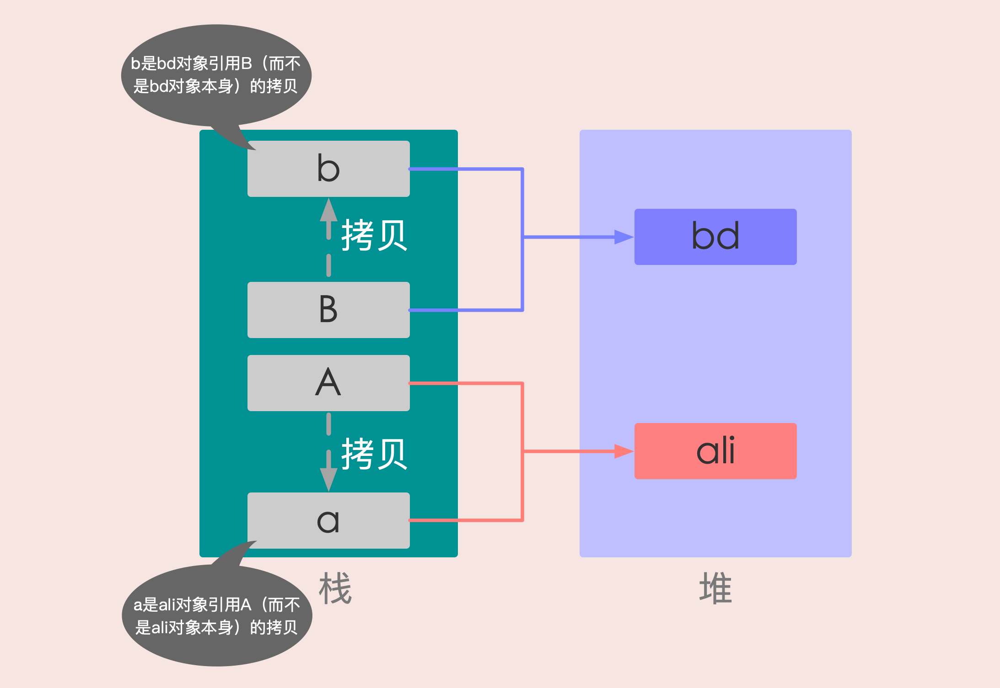
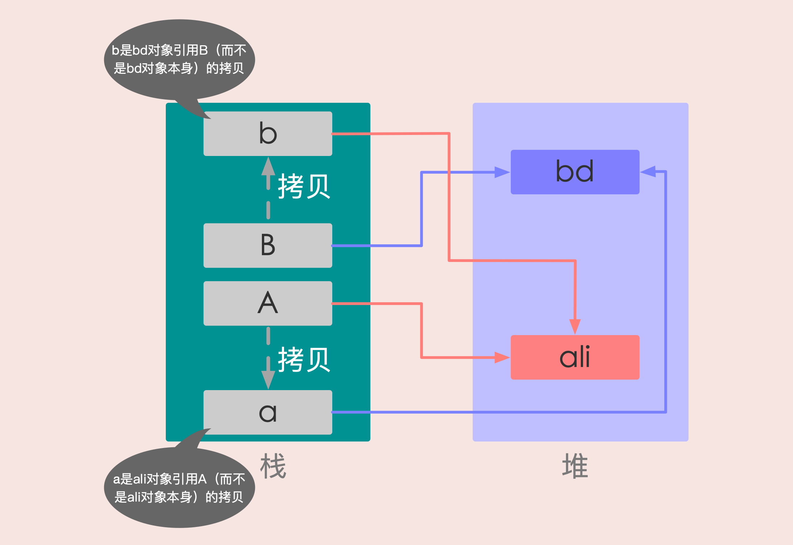
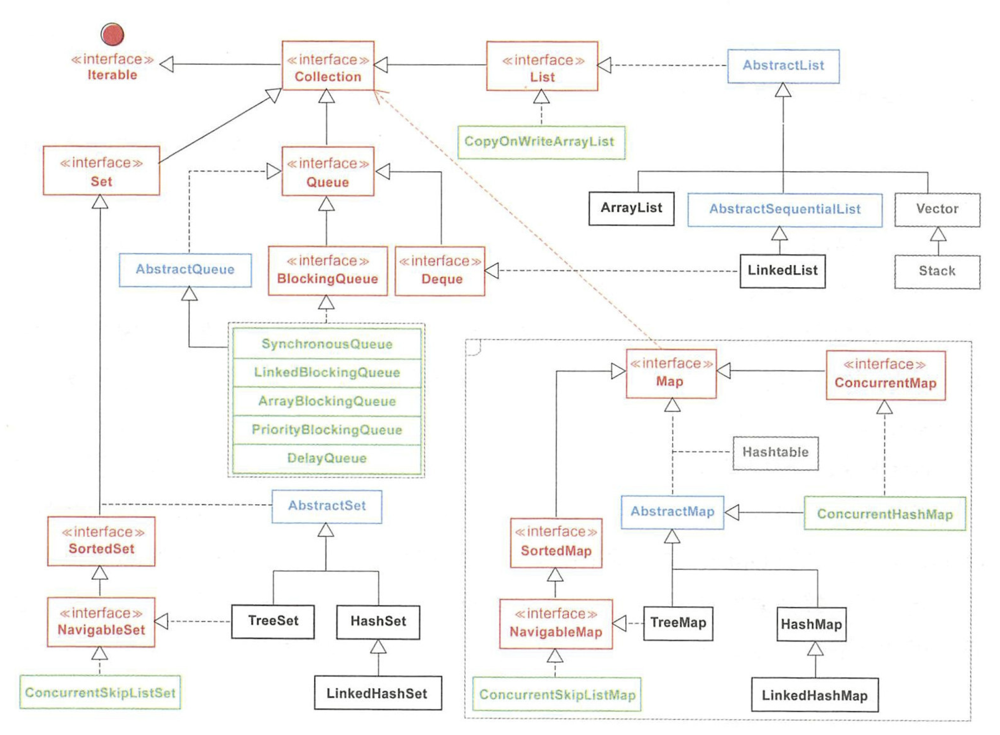

# 资源链接

[菜鸟教程](https://www.runoob.com/)   [Java教程｜菜鸟教程](https://www.runoob.com/java/java-tutorial.html)

[Java高淇300集视频](https://www.bilibili.com/video/av59814573)     [Java高淇300集课件](https://www.sxt.cn/Java_jQuery_in_action/thirteen-animation-effects.html)     [速学堂](www.sxt.cn)      [百战6000级官网](www.bz6000.cn)

[JAVA SE & JDK](https://docs.oracle.com/javase/9/docs/api/overview-summary.html)


# Java简介

## Java语言的特点

[Java的核心优势](https://baijiahao.baidu.com/s?id=1653044957181691658&wfr=spider&for=pc&isFailFlag=1)

1. 简单易学
2. 面向对象（封装、继承、多态）
3. 跨平台（JVM实现跨平台）
4. 可靠性
5. 安全性
	+ GC（Garbage Collection）使得电脑不容易出现[内存泄露](https://baike.baidu.com/item/%E5%86%85%E5%AD%98%E6%B3%84%E6%BC%8F/6181425?fr=aladdin)问题
	+ 异常处理（Exception）使得Java程序具有很好的容错性，使得程序更加健壮。Java 程序不可能造成计算机崩溃，如果出现某种出乎意料之事，程序也不会崩溃，而是把该异常抛出，再通过异常处理机制加以处理。
	+ Java中没有指针，防止用户恶意或者无意去access不该access的内存
6. 健壮性
	+ Java 是一种健壮的语言，吸收了C/C++ 语言的优点，但去掉了其影响程序健壮性的部分（如：指针、内存的申请与释放等）。

7. 支持多线程
	+ C++ 语言没有内置的多线程机制，因此必须通过调用操作系统的多编程功能来进行多线程程序设计
	+ C++11 开始引入了多线程库，在Windows、Linux、MacOS都可以使用`std::thread`和`std::async`来创建线程

8. 支持网络编程且很方便
	+ Java 就是为简化网络编程设计而诞生的

9. 编译与解释并存


## 声明式编程/命令式编程

- **命令式编程**：命令“机器”*如何*去做事情*(how)*，这样不管你想要的*是什么(what)*，它都会按照你的命令实现。
- **声明式编程**：告诉“机器”你想要的*是什么(what)*，让机器想出*如何*去做*(how)。*

计算机系统是分层的，也就是下层做一些支持的工作，暴露接口给上层用。注意：语言的本质是一种接口。

计算机的最下层是CPU指令，其本质就是用“变量定义+顺序执行+分支判断+循环”所表达的逻辑过程。计算机应用的最上层是实现人类社会的某种功能。所以所有计算机编码的过程，就是用逻辑表达现实的过程。层与层之间定义的接口，越接近现实的表达就叫越“声明式”（declarative），越接近计算机的执行过程就叫越“命令式”（imperative）。注意这不是绝对的概念，而是相对的概念。

当接口越是在表达“要什么”，就是越声明式；越是在表达“要怎样”，就是越命令式。SQL就是在表达要什么（数据），而不是表达怎么弄出我要的数据，所以它就很“声明式”。C++就比C更声明式，因为面向对象本身就是一种声明式的体现。HTML也很声明式，它只描述我要一张什么样的表，并不表达怎么弄出一张表。

简单的说，接口的表述方式越接近人类语言——词汇的串行连接（一个词汇实际上是一个概念）——就越“声明式”；越接近计算机语言——“顺序+分支+循环”的操作流程——就越“命令式”。

越是声明式，意味着下层要做更多的东西，或者说能力越强。也意味着效率的损失。越是命令式，意味着上层对下层有更多的操作空间，可以按照自己特定的需求要求下层按照某种方式来处理。

实际上，这对概念应该叫做“声明式接口”和“命令式接口”。可能是因为它大部分时候是在谈论“语言”这种接口方式时才会用到，所以会叫做“声明式编程”和“命令式编程”。

当然，你也可以把它当成一种编程思想，也就是说，在构建自己的代码时，为了结构的清晰可读，把代码分层，层之间的接口尽量声明式。这样你的代码自然在一层上主要描述从人的角度需要什么；另一层上用计算机逻辑实现人的需要。

另外，这组概念总让人迷惑，可能一个原因是翻译问题。如果翻译成”说明式“和”指令式“应该容易理解的多。


## Java VS C++

> Java和C++的区别？

1. 都是`面向对象`的语言，都支持封装、继承、多态
2. Java 不提供`指针`来直接访问内存，程序内存更加安全
3. Java的类是`单继承`的，接口支持多继承；C++支持类的多继承
4. Java有自动`内存管理`机制（GC），不需要程序员手动释放无用内存
5. 在C语言中，字符串或者字符数组最后都会有一个额外的字符`'\0'`来表示结束，而在Java中没有这一概念（具体原因可以看这篇文章：[Java与C语言在字符串结束符上的区别](https://blog.csdn.net/sszgg2006/article/details/49148189)）


## Java程序

> 什么是Java程序的主类？应用程序和小程序的主类有何不同？

一个程序中可以有多个类，但只能有一个主类。

在Java应用程序中，包含`main()`方法的类就是主类。

而在Java小程序（[Java applet](https://blog.csdn.net/ftell/article/details/82017460)）中，这个主类是一个继承自系统类 `JApplet` 或` Applet` 的子类。

应用程序的主类不一定要求是 public 类，但小程序的主类要求必须是 public 类。主类是 Java 程序执行的入口点。

> Java 应用程序与小程序之间有哪些差别?

简单说应用程序是从主线程启动，也就是 `main()` 方法。

applet 小程序没有 `main()` 方法，主要是嵌在浏览器页面上运行，通过调用`init()`或者`run()`来启动，嵌入浏览器这点跟 flash 的小游戏类似。

> 为什么说 Java 语言“`编译与解释并存`”？

高级编程语言按照程序的执行方式分为`编译型`和`解释型`两种。简单来说，编译型语言是指编译器针对`特定的操作系统`将源代码一次性翻译成可被该平台执行的机器码；解释型语言是指解释器对源程序逐行解释成`特定平台`的机器码并立即执行。

Java 语言既具有编译型语言的特征，也具有解释型语言的特征，因为 Java 程序要经过`先编译`，`后解释`两个步骤，由 Java 编写的程序需要先经过编译步骤，生成字节码（*.class 文件），这种字节码必须由 Java 解释器来解释执行。

因此，我们可以认为 Java 语言编译与解释并存。


## OracleJDK / OpenJDK

> **Sun/Oraclejdk 和 Openjdk 的区别**

使用过LINUX的人都应该知道，在大多数LINUX发行版本里，内置或者通过软件源安装JDK的话，都是安装的OpenJDK，那么到底什么是OpenJDK，它与Sun JDK有什么关系和区别呢？

历史上的原因是，OpenJDK是JDK的开放原始码版本，以GPL协议的形式放出。在JDK7的时候，OpenJDK已经成为JDK7的主干开发，Sun JDK7是在OpenJDK7的基础上发布的，其大部分原始码都相同，只有少部分原始码被替换掉。使用JRL（JavaResearch License，Java研究授权协议）发布。

至于OpenJDK6则更是有其复杂的一面，首先是OpenJDK6是JDK7的一个分支，并且尽量去除Java SE7的新特性，使其尽量的符合Java6的标准。

**关于JDK和OpenJDK的区别，可以归纳为以下几点：**

1. **授权协议的不同：**

OpenJDK采用GPL V2协议放出，而JDK则采用JRL放出。两者协议虽然都是开放源代码的，但是在使用上的不同在于GPL V2允许在商业上使用，而JRL只允许个人研究使用。

2. **OpenJDK不包含Deployment（部署）功能：**

部署的功能包括：Browser Plugin、Java Web Start、以及Java控制面板，这些功能在OpenJDK中是找不到的。

3. **OpenJDK源代码不完整：**

这个很容易想到，在采用GPL协议的OpenJDK中，Sun JDK的一部分源代码因为产权的问题无法开放OpenJDK使用，其中最主要的部份就是JMX中的可选元件SNMP部份的代码。因此这些不能开放的源代码将它作成plugin，以供OpenJDK编译时使用，你也可以选择不要使用plugin。而Icedtea则为这些不完整的部分开发了相同功能的源代码(OpenJDK6)，促使OpenJDK更加完整。

4. **部分源代码用开源代码替换：**

由于产权的问题，很多产权不是SUN的源代码被替换成一些功能相同的开源代码，比如说字体栅格化引擎，使用Free Type代替。

5. **OpenJDK只包含最精简的JDK：**

OpenJDK不包含其他的软件包，比如 Rhino Java DB JAXP……，并且可以分离的软件包也都是尽量的分离，但是这大多数都是自由软件，你可以自己下载加入。

6. **不能使用Java商标：**

这个很容易理解，在安装OpenJDK的机器上，输入“java -version”显示的是OpenJDK，但是如果是使用Icedtea补丁的OpenJDK，显示的是java。（未验证）

总之，在Java体系中，还是有很多不自由的成分，源代码的开发不够彻底，希望Oracle能够让JCP更自由开放一些，这也是所有Java社区所希望的。

**以下内容引用知乎的内容[https://www.zhihu.com/question/19646618/answer/40621705](https://link.jianshu.com?t=https://www.zhihu.com/question/19646618/answer/40621705)对上面的回答进行补充：**

Sun JDK能用于商业用途的license是SCSL（Sun Community Source License）。JRL（Java Research License）是2004年开始用的，伴随Sun JDK6发布而开始使用，远比JDK7早。

从代码完整性来说：

Sun JDK > SCSL > JRL > OpenJDK

Sun JDK有少量代码是完全不开发的，即便在SCSL版里也没有。但这种代码非常非常少。

SCSL代码比JRL多一些closed目录里的内容。

JRL比OpenJDK多一些受license影响而无法以GPLv2开放的内容。

但从Oracle JDK7/OpenJDK7开始，闭源和开源版的实质差异实在是非常非常小。与其说OpenJDK7是“不完整的JDK”，还不如说Oracle JDK7在OpenJDK7的基础上带了一些value-add，其中很多还没啥用（例如browser plugin）。

**此外**：

JDK有两种叫法，早期叫做Sun JDK，现在是Oracle JDK，其实都是同一个东西。但这种说法也不一定准确，因为OpenJDK也叫做Oracle OpenJDK。

> **如何看本地是 `Sun/Oraclejdk` 还是 `Openjdk`**

在命令行输入`java -version`

+ 如果是`Openjdk`，显示的版本信息为

```bash
openjdk version "1.8.0_144"
OpenJDK Runtime Environment (build 1.8.0_144-b01)
OpenJDK 64-Bit Server VM (build 25.144-b01, mixed mode)
```

+ 如果是`Sun/Oraclejdk`，显示的版本信息为

```bash
java version "1.8.0_221"
Java(TM) SE Runtime Environment (build 1.8.0_221-b11)
Java HotSpot(TM) 64-Bit Server VM (build 25.221-b11, mixed mode)
```

注意：

+ `Java HotSpot(TM) 64-Bit` 是说用的是64位的hotspot虚拟机
+ `Server` 是说虚拟机运行在server模式下（虚拟机有 Server 和 Client 两种模式）


# 数据类型

## 值类型 / 引用类型

> JAVA程序中的数据类型分为哪两种？

+ `值类型`
+ `引用类型`

一般情况下，我们声明一个变量：

```java
Object obj = new Object();
```

实际上是创建了一个引用 `Object obj` 和一个对像 `new Object()` 

Java 的内存模型中有堆和栈两个空间，将引用放入栈，将对象放入堆。「引用」的值是「对像」在堆中的地址，而「对象」的值才是真正的数据。

此外，Java中还有8种特殊的数据类型（基本数据类型）：byte、short、int、long、char、boolean、float、double

**这几种类型不是对象，为了节省空间，其值直接存到了栈里**。如：

```java
int i = 1;
```

`i` 放到了栈中，其值是1，而不是对象在堆中的地址，这就是`值类型`。


## 基本数据类型

>Java基本数据类型分为四大类

+ 整数类型：`byte、short、int、long`
+ 浮点类型：`float、double`
+ 字符类型：`char`
+ 布尔类型：`boolean`

**对应字节数**：

| 数据类型  |     字节数      |                       取值范围                       |
| :-------: | :-------------: | :--------------------------------------------------: |
|  `byte`   | 1个字节（8位）  |                  $$-128$$ ~ $$127$$                  |
|  `short`  | 2个字节（16位） | $$-2^{15}$$ ~ $$2^{15}-1$$      ( -32,768 ~ 32,767 ) |
|   `int`   | 4个字节（32位） |      $$-2^{31}$$ ~ $$2^{31}-1$$      ( 约21亿 )      |
|  `long`   | 8个字节（64位） |              $$-2^{63}$$ ~ $$2^{63}-1$$              |
|  `float`  | 4个字节（32位） |                                                      |
| `double`  | 8个字节（64位） |                                                      |
|  `char`   | 2个字节（16位） |                                                      |
| `boolean` | 1个字节（8位）  |                                                      |

> **float 和 double 的区别**?

**float** 为单精度浮点数，在机内占4个字节，用32位二进制描述。

**double** 为双精度浮点数，在机内占8个字节，用64位二进制描述。

浮点数在机内用指数形式表示，分解为：数符、尾数、指数符、指数四部分。指数占多少位，尾数占多少位，由计算机系统决定。

+ 数符占1位二进制，表示数的正负；
+ 指数符占1位二进制，表示指数的正负；
+ 尾数表示浮点数有效数字，0.xxxxxxx，但不存开头的0和点；
+ 指数存指数的有效数字。

对编程人员来说，double 和 float 的区别是double精度高，有效数字16位，float精度7位。但double消耗内存是float的两倍，double的运算速度比float慢得多，Java语言中数学函数名称double 和 float不同，能用单精度时不要用双精度（以节省内存，加快运算速度）

> **Java 语言整型常量的四种表示形式**：

`十进制整数`，如：99, -500, 0

`二进制数`，要求`0b或0B`开头，如：0b01110011

`八进制整数`，要求以 `0` 开头，如：015

`十六进制数`，要求 `0x 或 0X` 开头，如：0x15

**Tips:**

Java语言的整型常数默认为int型，声明long型常量可以后加`‘ l ’或‘ L ’`， float类型的数值有一个后缀 **F** 或者 **f** ，没有后缀 F/f 的浮点数值默认为double类型。

也可以在浮点数值后添加后缀 **D** 或者 **d**， 以明确其为double类型。

由于字长有限，浮点数能够精确表示的数是有限的，因而也是离散的。

浮点数一般都存在舍入误差，很多数字无法精确表示(例如0.1)，其结果只能是接近， 但不等于。

浮点类型 float，double 的数据不适合在不容许舍入误差的金融计算领域。

如果需要进行不产生舍入误差的精确数字计算，需要使用BigDecimal类。

`java.math`包下面的两个有用的类：**BigInteger** 和 **BigDecimal**，这两个类可以处理任意长度的数值。BigInteger实现了任意精度的整数运算；BigDecimal实现了任意精度的浮点运算。使用BigDecimal进行浮点数的比较：

```java
import  java.math.BigDecimal;
BigDecimal bd = BigDecimal.valueOf(1.0);
bd = bd.subtract(BigDecimal.valueOf(0.1));  //减0.1
```

> **`int` 和 `Integer`的区别？**

1. `Integer`是`int`的`包装类`，`int` 是Java的`基本数据类型`；
2. `Integer`变量必须实例化后才能使用，而`int`变量不需要；
3. `Integer`实际是对象的引用，当new一个Integer时，实际上是生成一个指针指向此对象，而`int`则是直接存储数据值；
4. `Integer`的默认值是`null`，`int`的默认值是`0`
5. `Integer`是`final`类，终态类存储在常量池（常量池在方法区中）
6. `Integer`提供了多个与整数相关的操作方法，例如，将一个字符串转换成整数，Integer中还定义了表示整数的最大值和最小值的常量。

**关于`Integer`和`int`的比较 :**

1. 由于`Integer`变量实际上是对一个Integer对象的引用，所以两个通过new生成的Integer变量永远是不相等的，因为new生成的是两个对象，其内存地址不同；
2. `Integer`变量和`int`变量比较时，只要两个变量的值是向等的，则结果为true
	
	+ 包装类Integer和基本数据类型int比较时，java会自动`拆包`为int，然后进行比较，实际上就变为两个int变量的比较
3. `非new`生成的Integer变量和`new Integer()`生成的变量比较时，结果为false
	+ ① 当变量值在`-128~127`之间时，非new生成的Integer变量指向的是Java`常量池`中的对象，而new Integer()生成的变量指向`堆`中新建的对象，两者在内存中的地址不同
	+ ② 当变量值不在`-128~127之`间时，非new生成Integer变量时，java API中最终会按照new Integer(i)进行处理，最终两个Interger的地址同样是不相同的）

4. 对于两个非new生成的Integer对象，进行比较时，如果两个变量的值在区间-128到127之间，则比较结果为true，如果两个变量的值不在此区间，则比较结果为false

	+ Java在编译`Integer i = 100;`时，会翻译成为`Integer i = Integer.valueOf(100);`

	+ ```java
		public static Integer valueOf(int i){
		    assert IntegerCache.high >= 127;
		    if (i >= IntegerCache.low && i <= IntegerCache.high){
		        return IntegerCache.cache[i + (-IntegerCache.low)];
		    }
		    return new Integer(i);
		}
		```

	+ Java对于`-128~127`之间的数，会进行缓存，`Integer i = 127`时，会将127进行缓存，下次再写`Integer j = 127`时，就会直接从缓存中取，就不会new了


>  byte 和 char

byte 是`字节`数据类型 ，是`有符号`型的，占 1 个字节；大小范围为`-128—127` 。

char 是`字符`数据类型 ，是`无符号`型的，占 2 字节(Unicode码 ），大小范围是`0—65535` ，char 是一个 16 位二进制的Unicode字符，Java 用 char 来表示一个字符 ，此外 char 是可以表示中文的。


## 变量和常量命名规范

类成员变量：首字母小写和驼峰原则: monthSalary

局部变量：首字母小写和驼峰原则

方法名：首字母小写和驼峰原则: run(), runRun()

常量：大写字母和下划线：MAX_VALUE

类名：首字母大写和驼峰原则: Man, GoodMan


# 值传递 / 引用传递

## 值传递 / 引用传递

**值传递**：就是在方法调用的时候，`实参`是将自己的一份拷贝赋给`形参`，在方法内，对该参数值的修改不影响原来的实参。

**引用传递**：是在方法调用的时候，`实参`将自己的`地址`传递给`形参`，此时方法内对该参数值的改变，就是对该实参的实际操作。


## Java中只有值传递

首先回顾一下在程序设计语言中有关将参数传递给方法（或函数）的一些专业术语。

**按值调用（call by value）**：表示方法接收的是调用者提供的值。

**按引用调用（call by reference）**：表示方法接收的是调用者提供的变量地址。

它用来描述各种程序设计语言（不只是 Java)中方法参数传递方式。

Java 程序设计语言总是采用`按值调用`。也就是说，方法得到的是所有参数值的一个拷贝，即，方法不能修改传递给它的任何参数变量的内容。


## swap( ) 场景

> 要求写一个函数交换`int`类型的`a`和`b`的值

在 `swap()` 方法中，a、b 的值进行交换，并不会影响到 A、B。因为，a、b 中的值，只是从 A、B 复制过来的。也就是说，a、b 相当于 A、B 的副本，副本的内容无论怎么修改，都不会影响到原件本身。

如果我们这么写：

```java
public class test{
  
    public static void main(String[] args) {
      	int A = 2;
      	int B = 3;
      	swap(A, B);
        System.out.println(A);
        System.out.println(B);
    }
    
  	public static void swap(int a, int b){
        int tmp = a;
        a = b;
        b = tmp;
		}
}
```

运行结果为：

```
2
3
```

发现A和B的值并没有交换，为什么呢?

因为Java中采用的是`值传递`，也就是说执行`swap(int a, int b)`时，这里的参数`a`和`b`，只是`A`和`B`的副本，函数的运行结果并没有改变原来`A`和`B`的值。

> 那么采用`Integer`呢？

如果将上面的`int`类型转变为`Integer`，`swap(Integer a, Integer b)`会不会实现交换功能呢?

```java
public class test{
  
    public static void main(String[] args) {
      	Integer A = 2;
      	Integer B = 3;
      	swap(A, B);
        System.out.println(A);
        System.out.println(B);
    }
    
  	public static void swap(Integer a, Integer b){
        Integer tmp = a;
        a = b;
        b = tmp;
		}
}
```

运行结果为：

```java
2
3
```

可见还是没有完成交换！

去查看`Integer`的源码：

```java
public final class Integer extends Number implements Comparable<Integer> {}
```

可以看到`Integer`使用`final`修饰的`int`进行存储。`final`修饰的变量不能被重新赋值，所以操作参数传递变量时，实际上是操作`变量对象的副本`（Java中的包装类型都是默认使用这种方式实现的，使用拷贝副本的方式提升效率和减少内存消耗）。

> 如果换作是数组呢？

```java
public static void main(String[] args) {
    int[] arr = { 1, 2, 3, 4, 5 };
    System.out.println(arr[0]);
    change(arr);
    System.out.println(arr[0]);
}

public static void change(int[] array) {
    // 将数组的第一个元素变为0
    array[0] = 0;
}
```

运行结果为：

```java
1
0
```

这里方法`array`是对象的引用`arr`的拷贝，而不是对象本身的拷贝，因此， `array` 和 `arr` 指向的是同一个数组对象。

> 如果换做是一般对象呢？

很多程序设计语言（特别是 C++ 和 Pascal)提供了两种参数传递的方式：值调用和引用调用。

有些程序员（甚至本书的作者）认为 Java 程序设计语言对`对象`采用的是引用调用，实际上，这种理解是不对的。由于这种误解具有一定的普遍性，所以下面给出一个反例来详细地阐述一下这个问题。

```java
class User {
    private String name;

    public User(String name) {
        this.name = name;
    }

    public String getName() {
        return name;
    }

    public void setName(String name) {
        this.name = name;
    }

    @Override
    public String toString() {
        return name;
    }
}
```

测试：

```java
public class test{
		public static void main(String[] args) {
        User A = new User("ali");
        User B = new User("bd");
        System.out.println("交换前name：" + A + "-->" + B);
        swap(a,b);
        System.out.println("交换后name：" + A + "-->" + B);
    }

    private static void swap(User a, User b) {
        User tmp = a;
        a = b;
        b = tmp;
    }
}
```

运行结果为：

```java
交换前name：ali-->bd
交换后name：ali-->bd
```

发现还是没有交换！

所以到底有没有交换，主要是看它修改的是`变量（引用）`还是修改的`堆里面的对象`。

交换前：



交换后：



通过上面两张图可以很清晰的看出： 方法并没有改变存储在变量 A 和 B 中的对象引用。swap() 方法的参数 a 和 b 被初始化为两个对象引用的拷贝，这个方法交换的是这两个拷贝。


> 那么到底该如何实现交换两个变量的值呢？

1. 用容器（或者数组）

例如：

```java
public class test{

    public static void main(String[] args) {
        int[] arr = {2, 3};
        int A = arr[0];
        int B = arr[1];
        swap(arr, 0, 1);
        A = arr[0];
        B = arr[1];
        System.out.println(A);
        System.out.println(B);
    }

    public static void swap(int[] arr, int a, int b){
        int tmp = arr[a];
        arr[a] = arr[b];
        arr[b] = tmp;
    }
}
```

运行结果为：

```
3
2
```

2. 用反射

```java
public static void swap(Integer a, Integer b) throws Exception {
    Field field = Integer.class.getDeclaredField("value");
    field.setAccessible(true);   //设置可以访问成员的私有不可变的变量
    Integer tmp =new Integer(a.intValue());
    field.set(a, b.intValue());
    field.set(b, tmp);
}
```

> 如何不通过申请第三个变量来交换两个变量的值？

如果我们想交换两个变量值，通常会通过下列的方式：

```java
public class test{
    public static void main(String[] args) {
      	int A = 2;
      	int B = 3;
      
        int tmp = A;
      	A = B;
      	B = tmp;
      
      	System.out.println(A);
        System.out.println(B);
    }
}
```

那么如果我不想通过这种方式呢？有两种方式可以实现：

1. 异或

```java
public class test{
    public static void main(String[] args) {
      	int A = 2;
      	int B = 3;
      
        A = A^B;
      	B = A^B; // B = A^B^B = A^0 = A;
      	A = A^B; // A = A^B^A = B;
      	
        System.out.println(A);
        System.out.println(B);
    }
}
```

3. 加减

```java
public class test{
    public static void main(String[] args) {
      	int A = 2;
      	int B = 3;
      
        A = A + B;
      	B = A - B; // B = A + B - B = A;
      	A = A - B; // A = A + B - A = B;
      	
        System.out.println(A);
        System.out.println(B);
    }
}
```

以上两种方式均是利用了`抵消的思想`。

当然在实际生产中我们并不选择这么做，因为这种做法并不会提高代码的运行效率，淡出利用第三个变量`tmp`来实现反而更快，因为它并不涉及到运算，只有等号。

此外，这几种方式放到swap中还是不行，因为Java采用的是`值传递`。


# 运算符

## 自增自减**

> `a++(a--)`与`++a(--a)`的区别?

`a++(a--)` 先自增/减，再赋值

`++a(--a)` 先赋值，再自增/减

例如：

```java
public class test{
  	public static void main(String[] args) {
      	int a = 1;
      	int b = a++;   // 先将a的值赋给b，a再自增
      	System.out.println("a = " + a);
        System.out.println("b = " + b);
    }
}
```

结果为：

```java
a = 2
b = 1
```

例如：

```java

public class test{
  	public static void main(String[] args) {
      	int a = 1;
      	int b = ++a;   // a先自增，再将自增后的a赋值给b
      	System.out.println("a = " + a);
        System.out.println("b = " + b);
    }
}
```

结果为：

```java
a = 2
b = 2
```


## 左移 & 右移

`<<` 左移运算符，左移1位相当于乘 2

`>>` 右移运算符，右移1位相当于除 2 取商

```java
int a = 3*2*2;
int b = 3<<2;    //相当于：3*2*2
int c = 12/2/2;
int d = 12>>2;  //相当于12/2/2
int e = 12>>1;  //相当于12/2
```


## 条件运算符(三元运算符)

```java
x ? y : z
```

其中 x 为 boolean 类型表达式，先计算 x 的值，若为true，则整个运算的结果为表达式y 的值，否则整个运算结果为表达式 z 的值。

```java
int score = 80;
int x = -100;
String type = score<60 ? "不及格" : "及格" ;
int flag = x>0 ? 1 : (x==0? 0 : -1);
```


# 字符串

## 字符型常量 vs 字符串常量**

> 字符型常量和字符串常量的区别?

1. **形式上**：字符常量是单引号引起的`一个`字符；字符串常量是双引号引起的`0个或若干个`字符
2. **含义上**：字符常量相当于一个整型值( ASCII 值)，可以参加`表达式`运算；字符串常量代表一个`地址值`(该字符串在内存中存放位置)
3. **占内存大小**：字符常量只占 2 个字节；字符串常量占若干个字节 (注意： char 在 Java 中占两个字节)

> 《Java编程思想》(第四版)：2.2.2节

Java要确定每种基本类型所占存储空间的大小，它们的大小并不像其他大多数语言那样随机器硬件架构的变化而变化。这种所占存储空间大小的不变性是用Java程序比用其他大多数语言编写的程序更具可移植性的原因之一。


## String/new String()**

**使用new关键字**与**字符串常量** 这两种方式获得字符串对象的区别：

```java
String s7 = new String("Hello"); ①
String s8 = new String("Hello"); ②
String s9 = "Hello"; ③
String s10 = "Hello"; ④
System.out.printf("s7 == s8 : %b%n", s7 == s8);
System.out.printf("s9 == s10: %b%n", s9 == s10);
System.out.printf("s7 == s9 : %b%n", s7 == s9);
System.out.printf("s8 == s9 : %b%n", s8 == s9);
```

输出结果：

```java
s7 == s8 : false
s9 == s10: true
s7 == s9 : false
s8 == s9 : false
```

可见，s7和s8指的是不同对象，s9和s10指向的是相同对象。

**为什么？**

+ Java中的不可变字符串String常量，采用**字符串池（String Pool）**管理技术，字符串池是一种字符串驻留技术。采用字符串常量赋值时（见代码③），会在字符串池中查找“Hello”字符串常量，如果已经存在则把引用赋值给s9，如果不存在则创建“Hello”字符串对象，并放到池中。根据此原理，可以推定s10与s9是相同的引用，指向同一个对象。
+ 但此原理并不适用于new所创建的字符串对象，而它并没有放到字符串池中。代码第②行又创建了一个新的“Hello”字符串对象，s7和s8是不同的引用，指向不同的对象。

> String s1 = new String("abc"); 这句话创建了几个字符串对象？

将创建 1 或 2 个字符串。

+  如果`池`中已存在字符串常量“abc”，则只会在`堆空间`创建一个字符串常量“abc”。
+ 如果池中没有字符串常量“abc”，那么它将首先在池中创建，然后在堆空间中创建，因此将创建总共 2 个字符串对象。


## 字符串比较**

[如何判断字符串是否相等以及比较字符串的大小](https://blog.csdn.net/Searchin_R/article/details/82865361)

<font color=DarkOrchid>**判断字符串是否相等**</font>

字符串的初始化有两种方式：直接等号赋值与用new初始化，直接等号赋值放入常量池，其它变量也可以引用；new 初始化分配内存空间，不可引用。

法一：

```java
//①直接等号赋值
String s1="Hello";
String s2="Hello";
System.out.println(s1==s2);//结果为true
//直接等号赋值的另一种写法
String s3="Hello";
String s4=s3;
System.out.println(s3==s4);//结果为true
```

法二：

```java
//②用new初始化
String s5=new String("Hello");
String s6=new String("Hello");
System.out.println(s5==s6); //结果为false
```

> JDK1.8版本中，**String常量池**已经从**方法区**中的**运行时常量池**分离到**堆**中了

采用 ① 创建一个字符串时，JVM首先会去字符串池中查找是否存在 "Hello" 这个对象，如果不存在，则在字符串池中创建 "Hello" 这个对象，然后将池中 "Hello" 这个对象的引用地址返回给 "Hello" 对象的引用s1，这样s1会指向池中 "Hello" 这个字符串对象；如果存在，则不创建任何对象，直接将池中 "Hello" 这个对象的地址返回，赋给引用s2。因为s1、s2都是指向同一个字符串池中的 "Hello" 对象，所以结果为true。

② 是 Java 中标准的对象创建方式，JVM首先在字符串池中查找有没有 "Hello" 这个字符串对象，如果有，则不在**池**中再去创建 "Hello" 这个对象了，直接在**堆**中创建一个 "Hello" 字符串对象，然后将**堆**中的这个 "Hello" 对象的地址返回赋给引用 s5，这样，s5就指向了堆中创建的这个 "Hello" 字符串对象；如果没有，则首先在**字符串池**中创建一个 "Hello" 字符串对象，然后再在**堆**中创建一个 "Hello" 字符串对象，然后将**堆**中这个 "Hello" 字符串对象的地址返回赋给 s5 引用，这样，s5指向了**堆**中创建的这个 "Hello" 字符串对象。s6 则指向了堆中创建的另一个 "Hello" 字符串对象。s5、s6是两个指向不同对象的引用，结果当然是false。

那么想要毫无顾虑地判断引用类型是否相等该怎么办呢？这时候 equals() 方法就派上用场了。

这和equals()方法的重写有关。**equals() 方法存在于Object类中**，因为 Object 类是所有类的直接或间接父类，也就是说所有的类中的 equals() 方法都继承自Object类，而通过源码我们发现，Object类中 equals() 方法底层依赖的是 \==，那么，在所有没有重写equals()方法的类中，调用equals() 方法其实和使用 \== 的效果一样，也是比较的地址值，然而，Java提供的所有类中，绝大多数类都重写了equals() 方法，重写后的 equals() 方法一般都是比较两个对象的值（对象的内容）。

```java
String s5=new String("Hello");
String s6=new String("Hello");
System.out.println(s5==s6);//结果为false
System.out.println(s5.equals(s6)); //结果为true
```

**利用工具重写equals()**：右键 - Source - Generate hashCode() and equals() methods()


<font color=DarkOrchid>**比较字符串的大小**</font>

在Java中，我们用 **compareTo()** 方法来比较字符串的大小。该方法属于`java.lang.String`包下，是 Java 提供的一个字符串比较的方法。

compareTo() 返回值： int

它是先比较对应字符的大小（ASCII码顺序），返回值类型分别有三种，小于0，等于0，大于0

① 如果字符串相等返回值0；

② 如果第一个字符和参数的第一个字符不等，结束比较，返回他们之间的差值（ASCII码值），负值前字符串的值小于后字符串，正值前字符串大于后字符串；

③ 如果第一个字符和参数的第一个字符相等，则以第二个字符和参数的第二个字符做比较，以此类推，直至比较的字符或被比较的有一方全比较完，这时就比较字符的长度。

```java
String s1 = "abc"; 
String s2 = "abcd"; 
String s3 = "abcdf"; 
String s4 = "1bcdf"; 
String s5 = "c"; 
System.out.println( s1.compareTo(s2) ); // -1 (前面相等,此时比较字符串的长度，s1长度小1，因此输出-1) 
System.out.println( s1.compareTo(s3) ); // -2(前面相等,此时比较字符串的长度，s1长度小2，因此输出-2) 
System.out.println( s1.compareTo(s4) ); // 48 (第一个字符不相等，此时比较第一个字符的ASCII码，"a"的ASCII码是97,"1"的的ASCII码是49,所以返回48) 
System.out.println( s1.compareTo(s5) ); // -2 (第一个字符不相等，此时比较第一个字符的ASCII码，"a"的ASCII码是97,"c"的ASCII码是99,所以返回-2)
```


## StringBuffer/Builder**

[原文1](https://blog.csdn.net/u011702479/article/details/82262823)

> StringBuffer和StringBuilder的区别

```java
//创建一个StringBuilder对象
StringBuilder sb = new StringBuilder();
 
//往对象里添加a-z 26个字母
for(i = 0; i < 26; i++){
    Char temp = (char)(‘a’ + i);
    sb.append(temp);
}
 
//反转对象,倒序
sb.reverse();

//在指定位置替换字节
sb.setCharAt(3,’高’);   //将3位置的字节替换为’高’

//在指定位置插入字节
sb.insert(0,’我’);

//也可以这样
//这样称为链式调用。核心就是：该方法调用了return this ,把自己返回了。
sb.insert(0,’我’).insert(1,’爱’);  

//删除的时候也可以采用链式删除
sb.delete(20,23);  //删除一个区间
```

例如：

```java
从 String  str = "hello";
到 str = str + "world";
发什么了什么？
```

实际上原来str指向的"hello"对象已经丢弃了，当执行 str = str + "world"; 的时候，会在内存中重新开辟空间用来存储新的对象"world"，最终得到"hello world"也是要开辟一个新的空间，然后让 str 指向最终的"hello world"，在这个过程中，一共开辟了**三次空间**！

如果多次执行这种操作，会导致大量副本字符串对象存留在内存中，降低效率。

当对字符串进行修改的时候，需要使用 StringBuffer、StringBuilder 类

StringBuilder 类在 Java 5 中被提出，它和 StringBuffer 之间的最大不同在于 StringBuilder 的方法不是线程安全的（不能同步访问）。

由于 StringBuilder 相较于 StringBuffer 有速度优势，**所以多数情况下建议使用 StringBuilder 类**。而在应用程序要求线程安全的情况下，则**必须**使用 StringBuffer 类。


# 正则表达式

[菜鸟教程Java正则表达式](https://www.runoob.com/java/java-regular-expressions.html)

正则表达式(regular expression)描述了一种字符串匹配的模式（pattern），可以用来检查一个串是否含有某种子串、将匹配的子串替换或者从某个串中取出符合某个条件的子串等。

> 注意

Rex是区分大小写的


> **ReGex语法**

`+` 代表前面的字符必须至少出现一次（1次或多次）

`*` 代表前面的字符可以不出现，也可以出现一次或者多次（0次、或1次、或多次，即有或没有）

+ `.*` 表示有或者没有`.`
+ `.*runoob.*` 用于查找字符串中是否包了 runoob 子串

`\s` 匹配空格（space）

+ `\s+` 匹配一个或多个空格

`\d` 匹配数字（digit）

+ `\d+` 匹配一个或多个数字

`^`  以什么开始

`?`  代表前面的字符最多只可以出现一次（0次、或1次）

+ `()?` 设置括号内的选项是可选的

> **Java中ReGex语法**

在其他语言中，`\`表示：我想要在正则表达式中插入一个普通的（字面上的）反斜杠，请不要给它任何特殊的意义。

在 Java 中，`\`表示：我要插入一个正则表达式的反斜线，所以其后的字符具有特殊的意义。

所以，在其他的语言中（如 Perl），一个反斜杠 `\`就足以具有转义的作用，而在 Java 中正则表达式中则需要有两个反斜杠才能被解析为其他语言中的转义作用。也可以简单的理解在 Java 的正则表达式中，两个 `\\` 代表其他语言中的一个 `\`，这也就是为什么 Java 中表示一位数字的正则表达式是 `\\d`，而表示一个普通的反斜杠是 `\\\\`。

| 字符          | 说明                                                         |
| :------------ | :----------------------------------------------------------- |
| \             | 将下一字符标记为特殊字符、文本、反向引用或八进制转义符。例如，"n"匹配字符"n"。"\n"匹配换行符。序列"\\\\"匹配"\\"，"\\("匹配"("。 |
| ^             | 匹配输入字符串开始的位置（`以什么开头`）。如果设置了 **RegExp** 对象的 **Multiline** 属性，^ 还会与"\n"或"\r"之后的位置匹配。 |
| $             | 匹配输入字符串结尾的位置（`以什么结尾`）。如果设置了 **RegExp** 对象的 **Multiline** 属性，$ 还会与"\n"或"\r"之前的位置匹配。 |
| *             | `零次`或`多次(包括一次)`匹配前面的字符或子表达式。例如，zo* 匹配"z"和"zoo"。* 等效于 {0,}。 |
| +             | `一次`或`多次`匹配前面的字符或子表达式。例如，"zo+"与"zo"和"zoo"匹配，但与"z"不匹配。+ 等效于 {1,}。 |
| ?             | `零次`或`一次`匹配前面的字符或子表达式。例如，"do(es)?"匹配"do"或"does"中的"do"。? 等效于 {0,1}。 |
| {*n*}         | *n* 是非负整数。`正好`匹配 *n* 次。例如，"o{2}"与"Bob"中的"o"不匹配，但与"food"中的两个"o"匹配。 |
| {*n*,}        | *n* 是非负整数。`至少`匹配 *n* 次。例如，"o{2,}"不匹配"Bob"中的"o"，而匹配"foooood"中的所有 o。"o{1,}"等效于"o+"。"o{0,}"等效于"o*"。 |
| {*n*,*m*}     | *m* 和 *n* 是非负整数，其中 *n* <= *m*。匹配`至少 *n* 次，至多 *m* 次`。例如，"o{1,3}"匹配"fooooood"中的头三个 o。'o{0,1}' 等效于 'o?'。注意：您不能将空格插入逗号和数字之间。 |
| ?             | 代表前面的字符`最多只可以出现一次（0次、或1次）`。当此字符紧随任何其他限定符（*、+、?、{*n*}、{*n*,}、{*n*,*m*}）之后时，匹配模式是`"非贪心的"`。"非贪心的"模式匹配搜索到的、尽可能短的字符串，而默认的"贪心的"模式匹配搜索到的、尽可能长的字符串。例如，在字符串"oooo"中，"o+?"只匹配单个"o"，而"o+"匹配所有"o"。 |
| .             | `匹配除"\r\n"之外的任何单个字符`。若要匹配包括"\r\n"在内的任意字符，请使用诸如"[\s\S]"之类的模式。 |
| (*pattern*)   | 匹配 *pattern* 并捕获该匹配的子表达式。可以使用 `$0…$9` 属性从结果"匹配"集合中检索捕获的匹配。若要匹配括号字符 ( )，请使用`"\("`或者`"\)"`。 |
| (?:*pattern*) | 匹配 *pattern* 但不捕获该匹配的子表达式，即它是一个非捕获匹配，不存储供以后使用的匹配。这对于用"or"字符 (\|) 组合模式部件的情况很有用。例如，'industr(?:y\|ies) 是比 'industry\|industries' 更经济的表达式。 |
| (?=*pattern*) | 执行正向预测先行搜索的子表达式，该表达式匹配处于匹配 *pattern* 的字符串的起始点的字符串。它是一个非捕获匹配，即不能捕获供以后使用的匹配。例如，'Windows (?=95\|98\|NT\|2000)' 匹配"Windows 2000"中的"Windows"，但不匹配"Windows 3.1"中的"Windows"。预测先行不占用字符，即发生匹配后，下一匹配的搜索紧随上一匹配之后，而不是在组成预测先行的字符后。 |
| (?!*pattern*) | 执行反向预测先行搜索的子表达式，该表达式匹配不处于匹配 *pattern* 的字符串的起始点的搜索字符串。它是一个非捕获匹配，即不能捕获供以后使用的匹配。例如，'Windows (?!95\|98\|NT\|2000)' 匹配"Windows 3.1"中的 "Windows"，但不匹配"Windows 2000"中的"Windows"。预测先行不占用字符，即发生匹配后，下一匹配的搜索紧随上一匹配之后，而不是在组成预测先行的字符后。 |
| *x*\|*y*      | 匹配 *x* 或 *y*。例如，'z\|food' 匹配"z"或"food"。'(z\|f)ood' 匹配"zood"或"food"。 |
| [*xyz*]       | 字符集。匹配包含的任一字符。例如，"[abc]"匹配"plain"中的"a"。 |
| [^*xyz*]      | 反向字符集。匹配未包含的任何字符。例如，`"[^abc]"`匹配"plain"中"p"，"l"，"i"，"n"。 |
| [*a-z*]       | 字符范围。匹配指定范围内的任何字符。例如，"[a-z]"匹配"a"到"z"范围内的任何小写字母。 |
| [^*a-z*]      | 反向范围字符。匹配不在指定的范围内的任何字符。例如，`"[^a-z]"`匹配任何不在"a"到"z"范围内的任何字符。 |
| \b            | `匹配一个字边界（bound），即字与空格间的位置`。例如，"er\b"匹配"never"中的"er"，但不匹配"verb"中的"er"。 |
| \B            | `非字边界匹配`。"er\B"匹配"verb"中的"er"，但不匹配"never"中的"er"。 |
| \c*x*         | 匹配 *x* 指示的控制字符。例如，\cM 匹配 Control-M 或回车符。*x* 的值必须在 A-Z 或 a-z 之间。如果不是这样，则假定 c 就是"c"字符本身。 |
| \d            | `数字（digit）字符匹配`。等效于 `[0-9]`。                    |
| \D            | `非`数字字符匹配。等效于 `[^0-9]`。                          |
| \f            | `换页符`匹配（form feed）。等效于 \x0c 和 \cL。              |
| \n            | `换行符`匹配（new line）。等效于 \x0a 和 \cJ。               |
| \r            | 匹配一个`回车`符（carriage-`r`eturn）。等效于 \x0d 和 \cM。  |
| \s            | 匹配任何`空白`字符（blank），包括空格、制表符、换页符等。与 [ \f\n\r\t\v] 等效。 |
| \S            | 匹配任何`非空白`字符。与 `[^ \f\n\r\t\v]` 等效。             |
| \t            | `制表符`匹配（table）。与 \x09 和 \cI 等效。                 |
| \v            | 垂直制表符匹配。与 \x0b 和 \cK 等效。                        |
| \w            | 匹配`任何`字类字符（whatever），包括下划线。与"[A-Za-z0-9_]"等效。 |
| \W            | 与`任何非单词`字符匹配。与`"[^A-Za-z0-9_]"`等效。            |
| \x*n*         | 匹配 *n*，此处的 *n* 是一个十六进制转义码。十六进制转义码必须正好是两位数长。例如，"\x41"匹配"A"。"\x041"与"\x04"&"1"等效。允许在正则表达式中使用 ASCII 代码。 |
| \*num*        | 匹配 *num*，此处的 *num* 是一个正整数。到捕获匹配的反向引用。例如，"(.)\1"匹配两个连续的相同字符。 |
| \*n*          | 标识一个八进制转义码或反向引用。如果 \*n* 前面至少有 *n* 个捕获子表达式，那么 *n* 是反向引用。否则，如果 *n* 是八进制数 (0-7)，那么 *n* 是八进制转义码。 |
| \*nm*         | 标识一个八进制转义码或反向引用。如果 \*nm* 前面至少有 *nm* 个捕获子表达式，那么 *nm* 是反向引用。如果 \*nm* 前面至少有 *n* 个捕获，则 *n* 是反向引用，后面跟有字符 *m*。如果两种前面的情况都不存在，则 \*nm* 匹配八进制值 *nm*，其中 *n* 和 *m* 是八进制数字 (0-7)。 |
| \nml          | 当 *n* 是八进制数 (0-3)，*m* 和 *l* 是八进制数 (0-7) 时，匹配八进制转义码 *nml*。 |
| \u*n*         | 匹配 *n*，其中 *n* 是以四位十六进制数表示的 Unicode 字符。例如，\u00A9 匹配版权符号 (©)。 |


> **`java.util.regex` 包主要包括以下三个类：**

- **Pattern 类**：

	pattern 对象是一个正则表达式的编译表示。Pattern 类没有公共构造方法。要创建一个 Pattern 对象，你必须首先调用其公共静态编译方法，它返回一个 Pattern 对象。该方法接受一个正则表达式作为它的第一个参数。

- **Matcher 类**：

	Matcher 对象是对输入字符串进行解释和匹配操作的引擎。与Pattern 类一样，Matcher 也没有公共构造方法。你需要调用 Pattern 对象的 matcher 方法来获得一个 Matcher 对象。

- **PatternSyntaxException**：

	PatternSyntaxException 是一个非强制异常类，它表示一个正则表达式模式中的语法错误。

以下实例中使用了正则表达式 `".*James.*"` 用于查找字符串中是否包了 `James` 子串：

```java
import java.util.regex.Pattern;
/**
 * @Author Hory
 * @Date 2020/10/8
 */
public class testRex {
    public static void main(String[] args) {
        String name = "I am LeBron James" + "," + "I'm the King";
        String pattern = ".*James.*";
        boolean isMatch = Pattern.matches(pattern,name);
        System.out.println(isMatch);
    }
}
```

结果为：ture


> 捕获组

捕获组就是把多个字符当一个单独单元进行处理的方法，它通过对括号内的字符分组来创建。

例如，正则表达式 `(casaba)` 创建了单一分组，组里包含`"c"，"a"，"s"，"a"，"b"，"a"`

捕获组是通过从左至右计算其开括号来编号。例如，在表达式`((A)(B(c)))`有四个这样的组：

1. ((A)(B(C)))
2. (A)
3. (B(C))
4. (C)

可以通过调用 `matcher` 对象的 `groupCount `方法来查看表达式有多少个分组。`groupCount` 方法返回一个 `int` 值，表示`matcher`对象当前有多个捕获组。

还有一个特殊的组`(group(0))`，它总是代表整个表达式。该组不包含在 groupCount 的返回值中。


> 实例

[剑指Offer「表示数值的字符串」](https://www.nowcoder.com/practice/6f8c901d091949a5837e24bb82a731f2?tpId=13&&tqId=11206&rp=1&ru=/ta/coding-interviews&qru=/ta/coding-interviews/question-ranking)

请实现一个函数用来判断字符串是否表示数值（包括整数和小数）。例如，字符串`"+100","5e2","-123","3.1416"和"-1E-16","+10.5E-3"`都表示数值。 但是`"12e","1a3.14","1.2.3","+-5"和"12e+4.3"`都不是。

使用正则表达式就很容易：

```java
import java.util.regex.Pattern;
public class Solution{
  	public static boolean isNumeric(char[] str){
      	String s = new String(str);
      	String pattern = "^[+-]?\\d*(?:\\.\\d*)?(?:[Ee][+-]?\\d+)?$";
    }
}
```

`^` 和 `$`框定正则表达式，它指引这个正则表达式对文本中的所有字符都进行匹配。如果省略这些标识，那么只要一个字符串中包含一个数字这个正则表达式就会进行匹配。如果仅包含 `^` ，它将匹配以一个数字开头的字符串。如果仅包含 `$` ，则匹配以一个数字结尾的字符串。

**`[-+]?`** 

+ 正负号后面的`?`后缀表示这个负号是可选的，表示有0到1个负号或者正号

**`\\d*`** 

+ `\\d`的含义和[0-9]一样。它匹配一个数字。后缀 `*` 指引它可匹配零个或者多个数字。

**`(?:\\.\\d*)?`**

+ `(?:…)?`表示一个可选的非捕获型分组。`*` 指引这个分组会匹配后面跟随的0个或者多个数字的小数点。

**`(?:[eE][+\\-]?\d+)?`**

+ 这是另外一个可选的非捕获型分组。它会匹配一个`e(或E)`、一个可选的正负号以及一个或多个数字。


# 数组

## 数组初始化

> 数组的三种初始化方式

<font color=DarkOrchid>**① 默认初始化**</font>

默认给数组元素赋值，赋值的规则和成员变量赋值规则相同

```java
int[] b = new int[3];  //默认值   0 , 0
boolean c = new boolean[2];  //默认值 false , false
String d = new String[2];   //默认值 nul , null
int[][] array = new int[5][5];
```

<font color=DarkOrchid>**② 静态初始化**</font>

```java
int[] a = { 2，4，6 };
User b = { new User(1001,”张三”),new User(1001,”李四”)
};
int[][] array = {
    { 2，4，6 },
    { 3，5，7 },
};
```

<font color=DarkOrchid>**③ 动态初始化**</font>

数组定义与数组元素分配空间并赋值的操作分开进行

```java
int[] a1 = new int[2];
a1[0] = 1;
A1[1] = 2; 

int[][] array = new int[5][5];
array[1][2] = 5;
 
int[][] a = new int[3][];
a[0] = new int[]{20,30};
a[1] = new int[]{50,60,90};
a[2] = new int[]{10,60,40};
```

```java
Arrays.sort(list);  //排序
Arrays.binarySearch(list, 6); //查找某个元素所在位置 
Arrays.toString(list); //打印数组中的元素
```

创建一个二维数组

```java
static Object[] emp1 ={1001,"Tony",25,"Student",293479};
static Object[] emp2 = {1002,"马云",25,"Boss",3462};
static Object[] emp3 = {1003,"乔布斯",25,"Boss",979};
Object[][] tableData = new Object[3][];
tableData[0] = emp1;
tableData[1] = emp2;
tableData[2] = emp3;
//打印二维数组中的元素
for(Object[] temp:tableData) {
System.out.println(Arrays.deepToString(temp));
        }

int[ ][ ] mat= {
    {1,2,3};
    {4,5,6};
    {7,8,9}
}
//打印
for(a:mat){
    System.out.println(Arrays.toString(a));
}
```


## 数组拷贝/插入/删除

**从数组中删除某个元素，本质上还是数组的拷贝**。

在已有的数组中添加新的数组本质上是：先定义一个更大的数组，然后将原数组的内容原封不动地拷贝到新数组中。


## 二维数组内部实现

[原文](https://blog.csdn.net/weixin_42947972/article/details/101177033)

文中另外介绍了**不规则数组**

动态初始化不规则数组比较麻烦，不能使用 **new   int \[4][3]** 语句，而是先初始化高维数组，然后再分别逐

个初始化低维数组。代码如下：

```java
int intArray[][] = new int[4][]; //先初始化高维数组为4
//逐一初始化低维数组
intArray[0] = new int[2];
intArray[1] = new int[1];
intArray[2] = new int[3];
intArray[3] = new int[3];
```


# 面向对象

## Object中的九大方法

1. `clone()` 创建并返回此对象的一个副本

2. `equals()` 判断一个对象是否与此对象相等

3. `finalize()` 当垃圾回收器确定不存在该对象的更多引用时，该对象的垃圾回收器调用此方法 

4. `hashCode()`返回该对象的哈希码值

5. `notify()`唤醒此对象监视器上等待的单个线程

6. `notifyAll()` 唤醒此对象监视器上等待的所有线程

7. `toString()` 返回此对象的字符串表示

8. `wait()` 导致当前线程的等待，直到其他线程调用此对象的`notify()`或者`notifyAll()`

9. `Class<? extendsObject> getClass()` 返回一个对象的运行时类。


## 面向对象 vs 面向过程*

> 面向过程 VS 面向对象

**⾯向过程**性能⽐⾯向对象⾼。因为类调用时候需要`实例化`，开销比较大，比较消耗资源，所以考虑性能为主要因素时，比如`单片机`、`嵌入式开发`、`Linux/Unix` 等一般采用面向过程开发，但是面向过程没有面向过程易维护、易复用、易拓展。

**面向对象**有`封装、继承、多态`的特性，`易维护、易复用、易拓展`，可以设计出`低耦合`系统，使系统更加灵活易于维护。

**面向过程比面向对象性能高，所以Java性能差？**

这个并不是根本原因，面向过程也需要分配内存，计算内存偏移量，Java性能差的主要原因并不是因为它是面向对象语言，而是因为Java是`半编译`语言，最终执行的代码并不是可以直接被CPU执行的二进制机器码。

而面向过程语言大多都是编译成机器码直接在电脑上运行，况且其他一些面向过程的脚本语言性能也不一定比Java好。


## 抽象类与接口

使用抽象类和接口是实现「可复用性」和「可扩展性」重要的设计手段。

>抽象类和抽象方法

**抽象方法**

* 使用abstract修饰的方法，没有方法体，只有声明。定义的是一种「规范」，就是告诉子类必须要给抽象方法提供具体的实现。

**抽象类**

* 包含抽象方法的类就是抽象类。通过abstract方法定义规范，然后要求子类必须定义具体实现。通过抽象类，我们就可以做到严格限制子类的设计，使子类之间更加通用。

**抽象类的使用要点:**

1. 有抽象方法的类只能定义成抽象类，但是抽象类不一定有抽象方法
2. 抽象类不能实例化，即不能用new来实例化抽象类
3. 抽象类可以包含属性、方法、构造方法。但是构造方法不能用来new实例，只能用来被子类调用
4. 抽象类只能用来被继承
5. 抽象方法必须**全部**被子类实现
6. 子类中的抽象方法不能与父类的抽象方法同名
7. abstract不能与final并列修饰同一个类。abstract 不能与private、static、final或native并列修饰同一个方法。

**如果一个类继承了一个抽象类，又没有去实现所有的抽象方法，那么这个类自己就成为一个新的抽象类，它也不能去制造对象出来**

两种抽象：

1. 与具体相对，表示一种概念而非实体。

2. 与细节相对，表示在一定程度上忽略细节而非着眼大局。


>接口

接口是比“抽象类”还抽象的“抽象类”，可以更加规范得对子类进行约束，全面地专业地实现了：`规范和具体实现的分离`。抽象类还提供某些具体的实现，接口不提供任何实现，接口中所有方法都是抽象方法。`接口是完全面向规范的，规定了一批类具有的公共方法规范`。

接口定义了可以向外部提供的服务

接口和实现类不是父子关系，是实现规则的关系，比如，我定义一个接口Runnable， Car实现它就能在地上跑，Train实现它也能在地上跑，Plane实现它也能在地上跑。就是说，如果它是交通工具，就一定能跑，但一定要实现Runnable接口。

java中只有单继承，接口有多继承。

接口是纯抽象类：

* 接口中的所有方法皆是抽象方法
* 实现接口的非抽象类必须要实现该接口的所有方法（要不为啥说接口是规范呢，既然是规范就都要实现）。抽象类可以不用全部实现。
* 所有的成员变量都是public static final （公共静态常量）
* 在Java程序设计中，先定义接口，再实现类，需要在函数之间传入传出的是接口，而不是具体的类。
* 这样做的好处，使得很多人同时做一个程序变得更加容易了，因为每个人，只需要提出，我对别人写的程序有什么样的要求，我提出一个接口就好了，然后，别人再根据这个接口的要求去做他自己的事。

**接口的本质探讨**

+ 接口就是规范，定义的是一组规则，体现了现实世界中“如果你是…则必须能…”的思想。

+ 接口的本质是契约，就像我们人间的法律一样，制定好之后大家必须遵守。

+ 面向对象的精髓，是对对象的抽象，最能体现这一点的就是接口。为什么我们讨论设计模式，都只针对具备了抽象能力的语言(比如C++、Java、C#等)，就是因为设计模式所研究的，实际上就是如何合理地去抽象。

在视频中，讲了一个具体的例子，很好诠释了接口与父类的区别:

* 定义了几个接口：

* ```java
	interfance Volant{}
	interfance Honest{}
	interfance Fly{}
	```

每个接口有若干个方法

* 然后定义了几个类 Angel、Dadman、Birdman
* 每个类可以继承多个属性，但是继承类就只能继承一个父类
* 比如
* class Angel implements Fly, Honest{}
* 在创建对象时，可以有以下几种形式
* Angel a = new Angel();
* Fly f = new Angel(); 该对象只能实现接口Fly中的方法
* Honest h = new Angel(); 该对象只能实现接口Honest中的方法

**接口的继承**：实际上在接口中覆盖抽象方法并没有实际意义，因为它们都是抽象的，都是留给子类实现的。

> Java8中接口的改进

Java8之前的接口还有一些缺陷，比如：

+ 不能可选实现方法，接口的方法全部是抽象的，实现接口时必须全部实现接口中方法，哪怕是有些方法并不需要，也必须实现。
+ 没有静态方法。

针对这些问题，Java 8在接口中提供了声明**默认方法**和**静态方法**的能力。接口示例代码如下：

```java
public interface InterfaceA {
  	//抽象方法
  	void methodA();
  	//默认方法
  	default int methodB(){
      	return 0;
    }
  	//静态方法
  	static double methodC(){
      	return 0.0;
    }
}
```

接口中默认方法类似于类中的具体方法，给出了具体实现，只是方法修饰符是default

接口中静态方法类似于类中静态方法


实现类实现接口时，原有的抽象方法在实现类中必须实现

默认方法可以根据需要选择实现（覆盖）

静态方法不需要实现，实现类中不能拥有接口中的静态方法

接口中的静态方法只能通过接口名调用，不可通过实现类调用（可以这么理解：接口中的静态方法与其实现类没有任何关系）


> 有了接口为什么还需要抽象类？即什么时候需要用抽象类而不是接口？

先来了解以下概念

用一句话来形容接口与抽象类的区别就是：`抽象类就好像is it，接口好像has it`

类是继承，接口是实现，另外为什么说接口就是规范，接口中的所有`抽象方法`其实现类都必须要实现，意思就是，一旦你实现了一个接口，那么这个接口的所有属性你都必须要有。

类方法（也就是静态方法）是属于整个类的，实例方法是属于类的某个对象的，类方法有如下限制：

+ 类方法中不能引用对象变量
+ 类方法中，不能调用类的对象方法
+ 类方法中不能使用super、this关键字
+ 类方法不能被覆盖（覆写）


1. 如果一个类没有足够的信息来描述一个具体的对象，而需要其他具体的类来支撑它，那么这样的类我们称它为`抽象类`。比如`new Animal()`，我们都知道这个是产生一个动物Animal对象，但是这个Animal具体长成什么样子我们并不知道，它没有一个具体动物的概念，所以它就是一个`抽象类`，需要一个具体的动物，如狗、猫来对它进行特定的描述，我们才知道它长成啥样。

2. 虽然Java8接口静态方法和默认方法的新特性，但是并不能取代抽象类，例如：

当需要维护一个对象的信息和状态时只能使用抽象类，而接口不行，因为维护一个对象的信息和状态需要存储在实例成员变量中，而`接口不能声明实例成员变量`。

3. 另外有下面这种场景：

当多个类实现同一个接口时，如果有共同的操作，那么怎么封装，接口里面是不能有实例方法的。比如说，有接口A ，类B1、类B2和类B3实现A，但是B1、B2和B3里面都有一个共同的操作（可以理解为方法体也一样），就比如是查询所有用户保存到一个map中，然后判断当前新增的用户是否存在map中，我们是不能把这个方法写在接口A里面的，因为接口A不能有实例方法（而实现这个操作就需要方法体，这样才能实现代码复用的目的）。要么我们在B1、B2、B3中都写这个方法，但是这种做法明显不符合代码重用的规则。正确的做法是，另写一个抽象类C ，将查询数据写在C中，然后让 B1、B2和B3实现A的同时继承C。B1 extends C implements A 这样就做到了封装。


## 包的作用

在Java中为了防止类、接口、枚举和注释等命名冲突引用了包（package）的概念，包本质上就是**命名空间（namespace）**。

命名空间（namespace）：也称名字空间、名称空间等，它表示着一个标识符（identifier）的可见范围。一个标识符可在多个命名空间中定义，这样，在一个新的命名空间中可定义任意标识符，它不会与已有的标识符发生冲突，因为已有的定义已处于其他命名空间中。


## 有/无构造器

**有构造器**：通过构造器直接new一个对象

**无构造器**：两种情况

+ 工具类。没有对象，比如math；

+ 静态方法。有对象，但是不能通过new来创造一个对象，它有一些具体的或者某一些静态方法返回这个类的对象，比如runtime类。


## 对象类型判断

[Java对象类型的判断](https://blog.csdn.net/u014532217/article/details/79254854)

<font color=DarkOrchid>**instanceof**</font>

instanceof是二元运算符，左边是对象，右边是类；当对象是右面类或子类所创建对象时，返回true；否则，返回false。比如：

```java
System.out.println(p instanceof Person);
```

判断某个对象是否是某个类的实例或者某个类的子类的实例。它的判断方式大概是这样的：

```java
public<T> boolean function(Object obj, Class<T> calzz) {
    if (obj == null) {
      return false;
    }
    try {
      T t = (T) obj;
      return true;
    } catch (ClassCastException e) {
      return false;
    }
} 
```

<font color=DarkOrchid>**ClassA.equals(ClassB)**</font>

这种方式比较的类型，一定是本身才返回true，子类或者父类都返回false

```java
// B是A的子类，C是B的子类
B b = new B(); 
System.out.println(b.getClass().equals(A.class)); // false             
System.out.println(b.getClass().equals(B.class)); // true                      
System.out.println(b.getClass().equals(C.class)); // false
//PS：b.getClass().equals(A.class)等同于b.getClass() == A.class
```

<font color=DarkOrchid>**Class.isInstance()**</font>

这个方法跟 instanceof 完全等价

```java
// B是A的子类，C是B的子类
B b = new B(); 
System.out.println(A.class.isInstance(b));// true
System.out.println(B.class.isInstance(b));// true
System.out.println(C.class.isInstance(b));// false
```

<font color=DarkOrchid>**Class.isAssignableFrom**</font>

判断某个类是否是另一个类和其子类

```java
// B是A的子类，C是B的子类
System.out.println(B.class.isAssignableFrom(A.class));// false
System.out.println(B.class.isAssignableFrom(B.class));// true
System.out.println(B.class.isAssignableFrom(C.class));// true
```


## 继承**

通过一个例子来进行理解：

**父类**

```java
public class Person {

    private String name;
    private int age;
    private Date birthDate;

    public Person() {}

    public Person(String name, int age) {
        //调用下面的三参构造函数
        this(name, age, new Date());
    }

    //三参构造函数
    public Person(String name, int age, Date birthDate) {
        this.name = name;
        this.age = age;
        this.birthDate = birthDate;
    }
}
```

**子类**

```java
public class Student extends Person {

    private String school;

    public Student(){
//        super();
    }

    public Student(String name, int age, String school) {
//        super(name, age);
        this.school = school;
    }

    public Student(String name, int age, Date d, String school) {
//        super(name, age, d);
        this.school = school;
    }

    public Student(String name, String school) {
        this.school = school;
    }
```

测试类

```java
public class Test {
  	public static void main(String[] args) {
      	//通过以下方式创建Student的实例都是可以的
      	Student a = new Student("a","s");
        Student b = new Student("a",20,"s");
    }
}
```


> **this\super**

**关于对this、super以及多态的相关认识**

+ 当成员变量和局部变量重名时，由于局部变量会覆盖全局变量（成员变量），但是我们又想用成员变量（全局变量），此时，只需要在方法中使用this，表示的便是该方法所在类的成员变量。

`this的本质就是"创建好的对象的地址”`。

this. 和super. 大部分情况下都是可以省略的

this.什么时候不能省略？

+ 区分局部变量和成员变量时不能省略

super.什么时候不能省略?

+ **父中有，子中又有，如果想要在子类中访问“父的特征”，super.不能省略**
+ java中是怎么来区分子类和父类的同名属性的？
	+ this.name :当前对象的name属性；super.name:当前对象的父类型特征中的name属性

1. 子类继承父类的方法属性，并重写父类的方法，**子类修饰符不能比父类方法的修饰符的范围狭窄**。

2. **子类必须在构造函数中使用super()来调用父类的构造函数**

父类没有无参构造器

+ 子类中也不能有无参构造器
	子类的有参构造器的第一行必须显示调用父类有参构造器，即super(参数)
	父类有无参构造器
	子类可以有无参构造器
	且子类的所有构造器中不需显式调用父类构造器无参构造器，因为系统会自动隐式地调用父类构造器无参构造器
	注意:就算子类是有参构造器，也是隐式地调用父类的无参构造器


JAVA中规定，构造子类前必须完成父类的构造，在子类构造器的第一行会隐式的调用 super()，即调用父类的构造器，**如果父类中没有定义空参构造器，则必须在子类的构造器的第一行显示的调用super(参数)**，以调用父类中构造器。如果子类中构造器的第一行写了this()，则就隐式调用super()，因为super() 和 this()都只能在构造器的第一行定义。即：

父类没有无参构造器

+ 子类中也不能有无参构造器
	子类的有参构造器的第一行必须显示调用父类有参构造器，即super(参数)
	父类有无参构造器
+ 子类可以有无参构造器
	且子类的所有构造器中不需显式调用父类构造器无参构造器，因为系统会自动隐式地调用父类构造器无参构造器
	注意:就算子类是有参构造器，也是隐式地调用父类的无参构造器


+ 父类没有构造函数（系统默认有一个无参构造函数），子类可以不写构造函数（可以理解为：子类的系统默认构造函数，默认调用了super()）；

+ 如果父类有「无参构造函数」，子类可以不写构造函数（同上理解）；

+ 如果父类有「有参构造函数」，则子类必须在自己的构造函数中显示的调用父类的构造函数即super(参数名)；

+ 如果父类的构造函数只有一个，且修饰符是private，则不可以被继承。


<font color=DarkOrchid>**方法的重写需要符合三个要点：**</font>

“==”： 方法名、形参列表相同。

“≤”：返回值类型和声明异常类型，子类小于等于父类。

“≥”： 访问权限，子类大于等于父类。

“==” 代表比较双方是否相同。如果是基本数据类型则表示值相等，如果是引用数据类型则表示地址相等即是同一个对象。

Object类中定义有：public boolean equals(Objeci obj),提供定义“对象内容相等”的逻辑。


## 多态**

<font color=DarkOrchid>**多态的要点：**</font>

多态（Polymorphism）按字面的意思就是“多种状态”。在面向对象语言中，接口的多种不同的实现方式即为多态。

**多态的定义**：指允许不同类的对象对同一消息做出响应。即同一消息可以根据发送对象的不同而采用多种不同的行为方式。（发送消息就是函数调用），实现多态的技术称为：动态绑定（dynamic binding），是指在执行期间判断所引用对象的实际类型，根据其实际的类型调用其相应的方法。

> 引用Charlie Calverts对多态的描述——多态性是允许你将父对象设置成为一个或多个其子对象相等的技术，赋值之后，父对象就可以根据当前赋值给它的子对象的特性以不同的方式运作。

**多态的作用**：消除类型之间的耦合关系。多态性包括参数化多态性和包含多态性。多态性语言具有灵活、抽象、行为共享、代码共享的优势，很好的解决了应用程序函数同名问题。

多态是方法的多态，不是属性的多态，多态与属性无关

父类引用指向子类对象后，用该父类引用调用子类重写的方法，此时多态就出现了。

**多态的存在要有3个必要条件**：继承、覆写、父类引用指向子类对象

**多态有两种表现形式**：重载和覆盖

* 首先说重载（overload），是发生在同一类中。与什么父类子类、继承毫无关系。标识一个函数除了函数名外，还有函数的参数（个数和类型）。也就是说，一个类中可以有两个或更多的函数，叫同一个名字而他们的参数不同。他们之间毫无关系，是不同的函数，只是可能他们的功能类似，所以才命名一样，增加可读性，仅此而已！

* 覆盖override。子类和父类中存在名称和参数完全相同的函数，这一对函数构成覆盖关系。覆盖(override),是发生在子类中！也就是说必须有继承的情况下才有覆盖发生。

现实中，关于多态的例子不胜枚举。比方说按下 F1 键这个动作，如果当前在 Flash 界面下弹出的就是 AS 3 的帮助文档；如果当前在 Word 下弹出的就是 Word 帮助；在 Windows 下弹出的就是 Windows 帮助和支持。同一个事件发生在不同的对象上会产生不同的结果。

**多态变量**：JAVA的对象变量是多态的，它们能保存不止一种类型的对象。它们可以保存声明类型的对象，或声明类型的子类的对象。当把子类的对象赋给父类的变量的时候，就发生了向上造型。子类的对象可以赋值给父类的变量（JAVA中不存在对象 对 对象的赋值），父类的对象不能赋值给子类的对象

```java
Vehicle v;
Car c = new Car();
v = c;   //可以把子类的对象赋给父类的变量
c = v;   //编译错误
//可以用造型
c = (Car)v;     //只有当v这个变量实际管理的是Car才行
int i = int(10.2);   //是类型转换
//与类型转换不同的是，造型不是转换类型，是把它当作另外一个类型来看待
```

向上造型：拿一个子类的对象当作父类的对象来用，向上造型是默认的，不需要运算符，向上造型总是安全的。

```java
Customer v = new Vip("张三");
```

"张三"是动态创建了一个子类对象，Customer v是一个创建了一个父类引用对象。

这种方法创建的对象只能调用父类，或者子类重写的父类的方法，不能调用子类独有的方法。

Customer v = new Vip("张三");就是将父类引用指向子类对象，这时候如果用 father 调用方法 father.method() ；如果method()方法只有父类有，子类里没有写。那么就调用父类里那个方法体。如果在子类里有对method()进行了重写(注意是重写不是重载)， 那么就调用子类里的那个方法体。很显然，我们刚才重写了dosome,所以，调用的是子类的dosome方法。

但是这个v是一个父类的引用，就是说它是一个父类的类型，所以不能调用子类的shopping()，因为父类没有shopping(),如果想调用，就要向下转型 ( (Vip) v ).shopping();


<font color=DarkOrchid>**多态实例**</font>

> 多态是同一个行为具有多个不同表现形式或形态的能力。

> 多态就是同一个接口，使用不同的实例而执行不同的操作。

先来看个例子：

假设有基础类 Animal，两个Animal的派生类Cat和Dog

现在有块广告牌，想要输入什么动物就放什么动物的照片，**如果没有多态，就需要不断地进行判断**

有了多态之后就可以如下实现：

```java
public class Animal {

    protected String name; //可被子类访问

    public Animal(){
        this.name = "Animal";
    }

    public String getName(){
        return this.name;
    }
}
```

```java
public class Cat extends Animal{

    public Cat(){
        name = "Cat";
    }
}
```

```java
public class Dog extends Animal{

    public Dog(){
        name = "Dog";
    }
}
```

测试：

```java
public class TestPolymorphic {
    public static void main(String[] args) {
        Animal animal = new Animal();
        Animal cat = new Cat();
        Animal dog = new Dog();
        //三块广告牌
        board(animal);
        board(cat);
        board(dog);
    }

    public static void board(Animal animal){
        System.out.println(animal.getName());
    }
}
```

运行结果：

```
Animal
Cat
Dog
```


## 重载 & 覆盖**

> 重载和覆盖的区别

1. **定义不同**

	重载是指不同的函数使用相同的函数名，但是函数的参数个数或类型不同。调用的时候根据参数来区分不同的函数。

	覆盖（也叫重写）是指在派生类中重新对基类中的虚函数（注意是虚函数）重新实现。即函数名或参数不一样，只是函数实现体不一样。

2. **类的关系不同**

	重载是同一个类中方法之间的关系，是水平关系；

	覆盖是子类和父类之间的关系，是垂直关系。

3. **产生方法不同**

	重载是多个方法之间的关系；

	覆盖只能由一个方法或一对方法产生关系。

4. **参数列表要求不同**

	重载要求参数列表不同；

	覆盖要求参数列表相同。

5. **调用方法区别**

	重载关系是根据调用时的实参表与形参表来选择方法体的。

	覆盖关系中，调用方法是根据**对象**的类型来决定。

> 返回值不同可以重载吗？为什么？

两个方法的方法名相同，返回值类型不同是不构成重载的。

**原因：**

可以这么理解，构成重载的一个必要条件是参数必须不同，这样，系统才能根据传入的参数调用相应的方法体（即，系统根据参数来判断该将哪个方法的入口调入栈中）。

函数的返回值只能作为函数运行之后的一个“状态”，并不能作为某个方法的“标识” 。如果只是返回值不同，系统是无法根据返回值的不同来决定调用哪个方法体的。

> Java重载和覆盖 JVM 实现原理

用一句话来说，就是对于重载，JVM是通过参数的静态类型作为依据来判断该调用哪个重载方法的；对于覆盖，JVM是通过方法接受者（即调用方法的实例）的实际类型来选择调用哪个方法。

即重载属于方法调用中分派调用的静态分派，静态分派依据的是静态类型；而覆盖属于方法调用中分派调用的动态分派，动态分派依据的是动态类型。

这个问题涉及到 JVM 的方法调用，如果您不理解上面的话或者想更加深刻地了解重载和覆盖，请看这篇文章：[JVM中方法调用的内部实现原理]()。

提示：由于篇幅略长，如果您想比较深刻地了解重载和覆盖的实现原理，请从头开始阅读本文，如果您对一些基本的概念有比较深刻的了解，可直接空降到「**分派**」部分。


## 引用类型转换

引用类型可以进行转换，但并不是所有的引用类型都能互相转换，**只有属于同一棵继承层次树中的引用类型才可以转换**。

向下转型需强转，即 Person per = (Person) stu;

向下转型是自动的，不需要在前面加(Student)，即 Student stu = per;

> **Cast(转型)**

```java
Animal a = new Dog(); //自动向上转型，此时a变为Animal
//若想a变回来，需要重新向下转型
Dog a1 = (Dog)a; //强制向下转型，将a再次转型为Dog
```


## 自动装箱/拆箱**

>包装类

在Java中8种基本数据类型不属于，不具备“对象”的特征，没有成员变量和方法，不方便进行面向对象的操作。为此，Java提供包装类（Wrapper Class）来将基本数据类型包装成类，每个Java基本数据类型在java.lang包中都有一个相应的包装类，每个包装类对象封装一个基本数据类型数值。

包装类都是finnal的，不能被继承

包装类都是不可变类，类似于String类，一旦创建了对象，其内容就不可以修改

包装类可以分为三大类：数值包装类（Byte、Short、Integer、Long、Float和Double）、Character和Boolean。

>自动装箱/拆箱

Java 之后，提供了自动装箱/拆箱功能

自动装箱，能够自动地将基本数据类型的数值自动转换为包装类对象，而不需要使用构造方法。。

自动拆箱，能够对包装类对象进行算数运算。

如下：

```java
public class HelloWorld {
  	public static void main(String[] args) {
      	Integer objInt = new Integer(80);
      	Double objDouble = new Double(12.0);
        
        //自动拆箱
        double sum = objInt + objDouble;
        
        //自动装箱
        Character objChar = 'C';
        Boolean objBoolean = true;
        Float objFloat = 80.0f;
    }
}
```

在自动装箱和拆箱时，要避免空对象，即要避免以下情况：

```java
Integer obj = null;
int intVar = obj;  //①
```

代码第①行会发生运行期NullPointerException异常，这是因为**拆箱**的过程本质上是调用**intValue()方法**实现的，试图访问空对象

的方法和成员变量，就会抛出运行期NullPointerException异常。


## 封装性与访问限制（修饰符）

[Java关键字](https://blog.csdn.net/Myuhua/article/details/81411707)       [菜鸟教程—Java修饰符]( https://www.runoob.com/java/java-modifier-types.html)

> private、「default」、protected、public关键字

+ 默认级别没有关键字，定位到同一个包下
+ 保护级别：“保护”就是保护某个类的子类都能继承该类的变量和方法。

| 控制登记\可否直接访问 | 同一个类 | 同一个包 | 不同包的子类 | 不同包非子类 | 描述                                                         |
| :-------------------: | :------: | :------: | :----------: | :----------: | ------------------------------------------------------------ |
|      **private**      |  **√**   |          |              |              | 表示私有，只有自己类能访问                                   |
|    「**default**」    |  **√**   |  **√**   |              |              | 表示没有修饰符修饰，只有同一个包的类能访问                   |
|     **protected**     |  **√**   |  **√**   |    **√**     |              | 自己类\同一个包内的其他类\其他包中的子类可以访问。使用对象：变量、方法。 **注意：不能修饰类（外部类）**。 |
|      **public**       |  **√**   |  **√**   |    **√**     |    **√**     | 表示可以被该**项目**的所有包中的所有类访问。                 |

提示：访问成员（成员变量、成员函数）有两种方式。

① **调用**，即通过类或对象调用它的成员 ；

② **继承**，即子类继承父类的成员变量和方法。

+ **公有访问**级别任何情况下这两种都可以；

+ **默认访问**级别在**同一包中**两种访问方式都可以，不能在包之外访问；

+ **保护访问**级别在同一包中与默认访问级别一样，两种访问方式都可以。但是在不同包之外

	只能继承访问；

+ **私有访问**级别只能在本类中通过调用方法访问，**不能继承访问**。

**通过以上阐述，总结如下**：

+ public作用域是整个**项目**
+ 「默认」作用于是**包**
+ protect作用域是**子类**
+ private作用域是**类**

在子类中的方法如果重载了父类的方法，那么该方法的可见级别应更高或者相同，如父类中的方法是protected，那么子类中方法可以是public或者protected，但不能是private。

> **final**

final关键字的作用：

① 修饰变量：

+ final 修饰的变量即为常量，不管是**成员变量**还是**局部变量**都只能被赋值一次。
+ final 修饰的成员变量在声明时没有被赋值的叫“空白final变量”。空白final变量必须在**构造方法**或**静态代码块**中初始化。
+ final修饰的局部变量必须在使用之前被赋值一次才可以使用（其实局部常量最好是在声明的同时初始化）。

② 修饰方法：该方法不可被子类重写（覆盖），但是可以被重载！

③ 修饰类：修饰的类不能被继承。比如：Math、String等。

> **transient**

我们都知道一个对象只要实现了Serilizable接口，这个对象就可以被序列化，Java 的这种序列化模式为开发者提供了很多便利，我们可以不必关心具体序列化的过程，只要这个类实现了Serilizable接口，这个类的所有属性和方法都会自动序列化。

然而在实际开发过程中，我们常常会遇到这样的问题，这个类的有些属性需要序列化，而其他属性不需要被序列化，打个比方，如果一个用户有一些敏感信息（如密码，银行卡号等），为了安全起见，不希望在网络操作（主要涉及到序列化操作，本地序列化缓存也适用）中被传输，这些信息对应的变量就可以加上transient关键字。换句话说，这个字段的生命周期仅存于调用者的内存中而不会写到磁盘里持久化。

   总之，java 的transient关键字为我们提供了便利，你只需要实现Serilizable接口，将不需要序列化的属性前添加关键字transient，序列化对象的时候，这个属性就不会序列化到指定的目的地中。

**transient 使用小结**：

+ 一旦变量被transient修饰，变量将不再是对象持久化的一部分，该变量内容在序列化后无法获得访问。
+ transient 关键字只能修饰变量，而不能修饰方法和类。
	+ 注意，本地变量是不能被transient关键字修饰的。
	+ 变量如果是用户自定义类变量，则该类需要实现Serializable接口。
+ 被transient关键字修饰的变量不再能被序列化，一个静态变量不管是否被transient修饰，均不能被序列化。


## 静态变量和静态方法

静态方法可以访问静态变量和其他静态方法，**但是不能访问实例变量和实例方法**

实例方法可以访问静态变量、静态方法、实例变量和其他实例方法

**静态代码块：**

如果初始化静态变量不是简单常量，需要进行计算才能初始化，可以使用静态代码块，静态代码块在类第一次加载时执行，并只执行一次

```java
public class Account {
  
  	//静态变量利率
  	static double interestRate;
  
  	//静态代码块
  	static {
      	//初始化静态变量
      	interestRate = 0.0668;
    }
}
```


## 内部类

[内部类](https://www.cnblogs.com/dolphin0520/p/3811445.html)

1. 成员内部类
2. 局部内部类
3. 匿名内部类（时间监听）
4. 静态内部类


## 包装类

<font color=DarkOrchid>**包装类的基本知识**</font>

包装类均位于` java.lang` 包，除了 Character 和 Boolean 之外，其他都是“数字型”，“数字型”都是`java.lang.Number` 的子类。Number 类是抽象类，因此它的抽象方法，所有子类都需要提供实现。Number类提供了抽象方法：intValue()、longValue()、floatValue()、doubleValue()，意味着所有的“数字型”包装类都可以互相转型。

<font color=DarkOrchid>**基本数据类型转换成包装类对象**</font>

```java
Integer a = new Integer(3); //通过内部构造器
Integer b = Integer.valueOf(30);
```

<font color=DarkOrchid>**把包装类对象转换成基本数据类型**</font>

```java
int c = b.intValue();
Double d = b.doubleValue();
```

<font color=DarkOrchid>**把字符串转换成包装类对象**</font>

```java
Integer e = new Integer(“999”);
Integer f = Integer.parseInt(“999888”);
```

<font color=DarkOrchid>**把包装类对象转换成字符串**</font>

```java
String str = f.toString();
```

<font color=DarkOrchid>**常见的常量**</font>

**Integer.MAX_VALUE**     2147483647  约为21亿


8.1.3 （TestAutoBox）自动装箱和拆箱

8.1.4 包装类的缓存问题

所谓缓存其实就是一个数组

常量区和方法区？

* 缓存[-128，127]之间的数字，实际上就是系统初始的时候，创建了[-128，127]之间的一个缓存数组

* 当我们在调用valueOf()的时候，首先检查是否在[-128，127]之间，如果在这个范围则直接从缓存数组中拿出已经建好的对象，如果不在这个范围，则创建新的Integer对象.


## Object... args

跟`Object[] args`是一个意思吗？为什么用三个点代替呢？

后来查阅了下文档，原来这是JDK1.5新增语法，新特性，动态参数或者是可变参数的意思，就是这个位置可以传入 `0～任意个`该类型参数。

在方法内部使用这个参数时，与 Object[] args 无任何区别。

但在调用时，有所不同。


## 引用/浅/深拷贝

[什么是Java深浅拷贝？](https://mp.weixin.qq.com/s/2CQH29jzwOqq16TVfbxGtw)

>**浅拷贝、深拷贝**

浅拷贝：只是调用子对象的 set 方法，并没有将所有属性拷贝。也就是说，引用的一个内存地址。

+ 浅拷贝，也是创建了一个对象，但是这个对象的某些内容（比如A）依然是被拷贝对象的，即通过这两个对象中任意一个修改A，两个对象的A都会受到影响，等同与新创建一个对象，然后使用=，将原对象的属性赋值给新对象的属性需要实现Cloneable接口。

深拷贝：将子对象的属性也拷贝过去。

+ 深拷贝，相当于创建了一个新的对象，只是这个对象的所有内容，都和被拷贝的对象一模一样而已，即两者的修改是隔离的，相互之间没有影响

> **对象拷贝的两种方法**

1. 通过反射方式实现对象拷贝，主要原理就是通过反射获取所有的属性，然后反射更改属性的内容。

2. 通过代理实现对象拷贝将原SourceA拷贝到目标DestB，创建一个代理 copyProxy。在代理中，依次调用 SourceA的get方法获取属性值，然后调用DestB的set方法进行赋值。

>**BeanUtils.copyProperties()**

org.springframework.beans.BeanUtils.copyProperties 中的拷贝属于浅拷贝。

**简介**：

BeanUtils提供对Java反射和自省API的包装。其主要目的是利用`反射机制`对JavaBean的属性进行处理。我们知道，一个JavaBean通常包含了大量的属性，很多情况下，对JavaBean的处理导致大量get/set代码堆积，增加了代码长度和阅读代码的难度。

**用法**：

```java
BeanUtils.copyProperties(blog, simpleBlogList);
```

将 blog 中的属性拷贝到 simpleBlogList

+ 注意：
+ 只对两个对象的名字相同的字段进行拷贝
+ 如果 blog 和 simpleBlogList 间存在名称不相同的属性，则 BeanUtils 不对这些属性进行处理，需要手动处理。

**应用场景**：

如果有两个具有很多相同属性的JavaBean，一个很常见的情景就是Struts里的PO对象（持久对象）和对应的ActionForm。例如：一个用户注册页面，有一个User实体类和一个UserActionForm，我们一般会在Action里从ActionForm构造一个PO对象，传统的方式是使用类似下面的语句对属性逐个赋值：

```java
// 获取 ActionForm 表单数据    
UserActionForm uForm = (UserActionForm) form;   

// 构造一个User对象   
User user = new User();   

// 逐一赋值   
user.setUsername(uForm.getUsername);   
  
user.setPassword(uForm.getPassword);   
  
user.setAge(uForm.getAge);    
...
// 然后调用JDBC、或操作Hibernate 持久化对象User到数据库   
...  
```

```java
// 获取 ActionForm 表单数据
UserActionForm uForm = (UserActionForm) form;
 
// 构造一个User对象
User user = new User();
 
// 逐一赋值
user.setUsername(uForm.getUsername);
 
user.setPassword(uForm.getPassword);
 
user.setAge(uForm.getAge);
...
// 然后调用JDBC、或操作Hibernate 持久化对象User到数据库
...
```

使用 BeanUtils.copyProperties() 方法后，代码量大大减少，而且整体程序看着也简洁，代码如下：

```java
// 获取 ActionForm 表单数据    
UserActionForm uForm = (UserActionForm) form;   

// 构造一个User对象   
User user = new User();   
  
// 赋值   
BeanUtils.copyProperties(user, uForm);   
  
// 然后调用JDBC、或操作Hibernate 持久化对象User到数据库   
...
```

```java
UserActionForm uForm = (UserActionForm) form;

// 构造一个User对象
User user = new User();

// 赋值
BeanUtils.copyProperties(user, uForm);

// 然后调用JDBC、或操作Hibernate 持久化对象User到数据库
...
```


## 序列化/编码

[为什么Java需要对象的序列化](https://blog.csdn.net/qq_40657528/article/details/88550646)

[序列化和编码的不同点](https://blog.csdn.net/qq_40657528/article/details/88552004)

[JAVA基础4---序列化和反序列化深入整理（JDK序列化）](https://www.cnblogs.com/jackion5/p/11819393.html)


# 比较器 Compararor< >

对于int[] 我们可以利用Java提供的API直接进行排序，但是如果我们想要对按照我们自己定义的规则进行排序，就要借助比较器 Compararor<>，比如**对 int[ ] 进行逆排序，对一个 List<Student> 按照成绩进行排序**。

用比较器对 int[ ] 逆排序

```java
import java.util.Arrays;
import java.util.Comparator;

public class TestCoparator{
  	public static void main(String[] args) {
      	Integer[] A = {1,2,3,6,5};
      	//从小到大排序可以直接利用Java提供的API
      	Arrays.sort(A);
      	//逆排序就需要传入比较器
      	Arrays.sort(A, new Comparator<Integer>() {
            @Override
            public int compare(Integer o1, Integer o2) {
                return o2-o1;
            }
        });
      	//为了简单起见，对于一些不需要多次调用的类这里直接用了匿名内部类
      	//也可以用 Lambda 表达式
      	Arrays.sort(A, (o1, o2)->(o2-o1) );
    }
}
```

对一个 List<Student> 按照成绩进行排序

```java
import java.util.*;

public class TestCoparator{
  	public static void main(String[] args) {
      	Student a = new Student(23);
        Student b = new Student(21);
        Student c = new Student(22);
        //b、c、a

        List<Student> students = new ArrayList<>();
        students.add(a);
        students.add(b);
        students.add(c);

        CompareByAge compareByAge = new CompareByAge();

        Collections.sort(students,compareByAge);
      
      	//同样利用 Lambda 表达式也可以
        //Collections.sort(students,(stu1,stu2)->(stu2.age-stu1.age));

        for(Student s:students){
            System.out.println(s.age);
        }
    }
}
```


```java
public class Student {
    Integer age;
    public Student(int age) {
        this.age = age;
    }
}
```

```java
public class CompareByAge implements Comparator<Student> {
    public int compare(Student stu1, Student stu2){
        return (int)(stu1.age-stu2.age);
    }
}
```

**如果用Lambda表达式，也就是引用匿名内部类，不需要在外部实现Comparator<>接口**


## Comparable与Comparator的区别

[原文](https://blog.51cto.com/6949410/1869032)


# Lambda表达式

[Java 8 Lambda 表达式](https://www.runoob.com/java/java8-lambda-expressions.html)

+ Lambda 表达式，也可称为**闭包**，它是推动 Java 8 发布的最重要新特性
+ Lambda 允许把函数作为一个方法的参数

[`闭包`](https://www.oschina.net/question/3127795_2310736)

+ 闭包的本质就是代码片断。如果一个变量代表的是一段文字，一个数字。数学、字符串可以用变量来存载；而代码用的则是闭包，所以闭包可以理解成一个代码片断的引用。
+ 最早的代码片段出现在c语言里，也就是函数指针，变量指针如 char  代表字符串。而函数的指针则是代表的一个函数或者说一段代码。
+ 大家都知道函数的参数有int型，char型这些。但**如果传的是一个方法为参数，这时这个参数的类型就是函数指针，而传的具体的方法，我们就把它叫做闭包**。
+ **java在jdk8以前不支持函数指针所以使用内部类加外部接口的反向实现**。

Lambda表达式本质上是一个匿名方法

```java
public int add(int x,int y){
  	return x + y;
}

//转为Lambda表达式是这样的：
(int x, int y) -> x + y;

//参数类型也可以省略，Java编译器会根据上下文推断出来：
(x, y) -> x + y;
//或者
(x, y) -> { return x + y; } //显式指明返回值
```

Lambda表达式和函数式接口结合


# JavaBean

[菜鸟 教程——JSP JavaBean](https://www.runoob.com/jsp/jsp-javabean.html)

JavaBean其实就是特殊的Java类，是一种规范，也可称为一种技术。

与其它 Java 类相比JavaBean需满足以下条件：

1. 必须提供无参构造方法
2. 类中属性都必须私有化（`private`）
3. 需要被序列化且实现 `Serializable` 接口
4. 可能有一系列 `setter` 或 `getter` 方法

Sun 公司推出 `jsp` 技术后，同时也推荐了两种 web 应用程序的开发模式，一种是`jsp + javabean` 模式，一种是 `Servlet + jsp + javabean` 模式

+ **jsp + javabean** 模式适合开发业务逻辑不太复杂的web应用程序，在这种模式下，`javabean`用于封装业务数据，`jsp`既负责处理用户请求又显示数据
+ **Servlet +jsp+javabean(MVC )**模式适合开发复杂的web 应用，在这种模式下，`servlet（Controler）`负责处理用户请求，`jsp（View）`负责 数据显示，`javabean （Model）`负责封装数据

简言之，`javabean` 就是一种规范语言，用来规范、存储、封装、保存数据库的一种特殊的Java类。


# 异常

>**Error 和 Exception 的区别 ？**

**Error** 是程序无法恢复的严重错误，程序员根本无能为力，只能让程序终止。

+ 例如：JVM内部错误、内存溢出、资源耗尽等情况。

**Exception** 是程序可以恢复的异常，它是程序员所能掌控的。

异常就是可预测但是又没办法消除的一种错误。所以程序员为了在程序当中不发生这样的错误会将`容易发生异常`的代码用`try catch`进行处理，或者通过`throws`将异常向上抛出，由上一级进行接收并处理。
如果发生异常而不去处理，会导致程序中断，也就是程序无法继续运行！

+ 例如：除零异常、空指针访问、网络连接中断、读取不存在的文件等。


# 集合

<a href="./JavaCollection">『JavaCollection』</a>

[源码解析](https://www.cnblogs.com/ysocean/category/1149707.html)

[Java 集合框架看这一篇就够了——Java3y](https://mp.weixin.qq.com/s/TW3cRsFZwqUiOPC5cbSRRQ)

Java 集合框架图：




> **Array  和 ArrayList() 有什么区别**？

**Array**（即 [ ] ）

+ 最高效，但是容量无法改变；
+ 可作为函数的返回值；
+ 对数组的一些基本操作，像排序、搜索、比较等是很常见的，因此在Java中提供了`Arrays`类协助这几个操作：
	+ `sort() / binarySearch() / equals() / fill() / asList()`
	+ 不过Arrays类没有提供删除方法，而ArrayList中有`remove()`方法

**ArrayList**

+ 容量可动态增长，但会牺牲效率；

+ 相当于是 `Array([])`的封装，可以提供更加丰富的功能。


# 泛型

[**泛型**](https://www.cnblogs.com/coprince/p/8603492.html)

## 泛型简介

Java 泛型（generics）是 JDK 5 中引入的一个新特性，泛型提供了`编译时类型安全检测机制`，该机制允许程序员在编译时检测到非法的类型。

泛型的本质是`参数化类型`，也就是说，所操作的数据类型被指定为一个`参数`。在创建对象或调用方法的时候才明确具体的类型。

## 类型擦除**

正确理解泛型概念的首要前提是理解`类型擦除`。

更多关于类型擦除的问题，可以查看这篇文章：[《Java泛型类型擦除以及类型擦除带来的问题》](https://www.cnblogs.com/wuqinglong/p/9456193.html) 

> 什么是`类型擦除`？

Java的泛型是`伪泛型`，这是因为Java在编译期间，所有的泛型信息都会被擦除。Java的泛型基本上都是在编译器这个层次上实现的，在生成的字节码中是不包含泛型中的类型信息的。

+ 使用泛型的时候加上类型参数，在编译器编译的时候参数会被去掉，这个过程称为`类型擦除`。

如在代码中定义`List<String>`等类型，在编译后都会变成`List`，由泛型附加的类型信息对JVM是看不到的，JVM看到的只是List。Java编译器会在编译时尽可能的发现可能出错的地方，但是仍然无法识别在运行时刻出现的类型转换异常的情况，类型擦除也是Java的泛型与C++`模板机制`实现方式之间的重要区别。

> 为什么Java的泛型要用"擦除"实现？

https://blog.csdn.net/u014674862/article/details/105676880


## 通配符**

更多关于Java 泛型中的通配符可以查看这篇文章：[《聊一聊-JAVA 泛型中的通配符 T，E，K，V，？》](https://juejin.im/post/5d5789d26fb9a06ad0056bd9)

常用的通配符为： T、E、K、V、？

- `?` 表示不确定的 Java 类型
- `T`  表示具体的一个Java类型(Type)
- `K`、`V` 分别代表 Java 键值中的 Key Value
- `E` 代表Element

## 泛型的三种使用方式**

泛型一般有三种使用方式：`泛型类`、`泛型接口`、`泛型方法`。

> **泛型类**

此处`T`可以随便写为任意标识，常见的如T、E、K、V等形式的参数常用于表示泛型。

在实例化泛型类时，必须指定T的具体类型。

```java
public class Generic<T>{ 

    private T key;

    public Generic(T key) { 
        this.key = key;
    }

    public T getKey(){ 
        return key;
    }
}
```

实例化泛型类：

```java
Generic<Integer> genericInteger = new Generic<Integer>(123456);
```


> **泛型接口**

```java
public interface Generator<T> {
    public T method();
}
```

1. 实现泛型接口，不指定类型：

```java
class GeneratorImpl<T> implements Generator<T>{
    @Override
    public T method() {
        return null;
    }
}
```

2. 实现泛型接口，指定类型：

```java
class GeneratorImpl<T> implements Generator<String>{
    @Override
    public String method() {
        return "hello";
    }
}
```


> 泛型方法

```java
public static <E> void printArray(E[] inputArray){         
    for(E element : inputArray){        
      	System.out.printf( "%s ", element );
    }
    System.out.println();
}
```

使用：

```java
// 创建不同类型数组： Integer, Double 和 Character
Integer[] intArray = { 1, 2, 3 };
String[] stringArray = { "Hello", "World" };
printArray(intArray); 
printArray(stringArray); 
```

## 泛型的优点

使用泛型的好处就是：

1. 代码更加简洁，不再需要强制类型转换；

2. 程序更加健壮，在编译期间没有警告，在运行期就不会出现`ClassCastException`异常

3. 提高代码的复用性，比如：在动态代理中，通过泛型可以代理任何需要被代理的类

```java
public class ServiceProxy<T> implements InvocationHandler {
  	private T target;
  	public ServiceProxy(T target) {
        this.target = target;
    }
}
```

## 泛型的应用

1. **操作集合时**

容器中之所以可以存储各种类型的对象，就是因为引入了泛型

```java
List lists = new ArrayList<String>();
```

2. **用于基础组件时**

因为组件的要求是需要做到一定的通用性，需要支持不同的类型，而泛型的特点是：在创建对象或调用方法的时候才明确具体的类型。可以参考`SpringData JPA`的`JpaRepository`的写法：

```java
public interface JpaRepository<T, ID> extends 
  PagingAndSortingRepository<T, ID>, QueryExampleExecutor<T> {
  	List<T> findAll();
  	List<T> findAll(Sort sort);
  	List<T> findAllById(Iterable<ID> ids);
  	<S extends T> List<S> saveAll(Iterable<S> entities);
  	void flush();
   	<S extends T> S saveAndFlush(S entity);
   	void deleteInBatch(Iterable<T> entities);
   	void deleteAllInBatch();
   	T getOne(ID id);
  
   	@Override
   	<S extends T> List<S> findAll(Example<S> example);
  
   	@Override
   	<S extends T> List<S> findAll(Example<S> example, Sort sort);
}
```

此外，在组件中，还离不开Java的`反射机制`，一般是`反射+泛型`

> **再举个实际的例子**

比如有个需求是将某些数据库表的某些字段进行聚合，SQL语句就是

```mysql
select sum(column1),sum(column2) from table group by field1,field2
```

需要`sum`和`group by` 的列是由业务方自己传入，而SQL表其实就是我们的POJO，传入的字段肯定也是POJO的属性，单个业务实际可以在参数上将POJO写死，但是如果参数设置为泛型，便可以提高代码的复用性。

拿到参数后，通过反射获取其字段具体的值，就可以做累加了。具体代码示例如下：

```java
// 传入需要 group by 和 sum 的字段名
public cacheMap(List<String> groupByKeys, List<String> sumValues) {
  	this.groupByKeys = groupByKeys;
  	this.sumValues = sumValues;
}

private void excute(T e) {
  
    // 从pojo 取出需要group by 的字段 list
    List<Object> key = buildPrimaryKey(e);

    // primaryMap 是存储结果的Map
    T value = primaryMap.get(key);

    // 如果从存储结果找到有相应记录
    if (value != null) {
        for (String elem : sumValues) {
          // 反射获取对应的字段，做累加处理
            Field field = getDeclaredField(elem, e);
            if (field.get(e) instanceof Integer) {
                field.set(value, (Integer) field.get(e) + (Integer) field.get(value));
            } else if (field.get(e) instanceof Long) {
                field.set(value, (Long) field.get(e) + (Long) field.get(value));
            } else {
                throw new RuntimeException("类型异常,请处理异常");
            }
      	}
        // 处理时间记录
        Field field = getDeclaredField("updated", value);
        if (null != field) {
            field.set(value, DateTimeUtils.getCurrentTime());
        }
    } else {
      	// group by 字段 第一次进来
        try {
            primaryMap.put(key, Tclone(e));
            createdMap.put(key, DateTimeUtils.getCurrentTime());
        }catch (Exception ex) {
         	 	log.info("first put value error {}" , e);
        }
    }
}
```


## 泛型、反射、动态代理、注解

> 泛型 + 反射

RPC框架中

```java
public class ServiceGetter {
  	
  	private static Map<Class, Object> serviceMap = new HashMap<>();
  
  	public static <T> T getServiceByClazz(Class<T> clazz) {
      	try{
          	if(serviceMap.containsKey(clazz)){
              	return (T) serviceMap.get(clazz);
            } else {
              	T bean = clazz.newInstance();
              	serviceMap.put(clazz, bean);   // clazz是T类对象，bean 是类T的对象
              	return bean;
            }
        } catch (Exception ex) {
          	ex.printStackTrace();
          	return null;
        }
    }
}
```


# 注解

[注解和反射—狂神](https://www.bilibili.com/video/BV1p4411P7V3)

Java注解（Annotation）又称Java标注，是JDK5.0引入的一种注释机制。

和Javadoc（注释）不同，Java标注可以通过反射获取标注内容。在编译器生成类文件时，标注可以被嵌入到字节码中。 Java虚拟机可以保留注释内容，在运行时可以获取到注释内容。当然它也支持自定义Java注释。

我按照自己的思路，对Annotation进行了整理。理解Annotation的关键，是理解Annotation的语法和用法，对这些内容，我都进行了详细说明；理解Annotation的语法和用法之后，再看Annotation的框架图，可能有更深刻的体会。

> **内置注解**

Java定义了一套注解，共有7个，3个在`java.lang`中，剩下4个在`java.lang.annotation`中。

- **@Override** 检查该方法是否是重写方法。如果发现其父类，或者是引用的接口中并没有该方法时，会报编译错误。
- **@Deprecated** 不推荐使用，标记过时方法。如果使用该方法，会报编译警告。
- **@SuppressWarnings** 警告镇压，指示编译器去忽略注释解中声明的警告。

> **元注解**

元注解的作用就是负责注解其他的注解，Java定义了4个标准的meta-annotation类型，它们被用来提供对其他annotation类型作说明。

- **@Retention** 标识这个注解怎么保存，是只在代码中，还是编入类文件中，或者是在运行时可以通过反射访问。
- **@Documented** 标记这些注解是否包含在用户文档中。
- **@Target** 标记这个注解应该是一名Java成员。
- **@Inherited** 标记这个注解是继承于该注解类（替代注解并没有继承于任何子类）

**从Java 7开始，额外添加了3个注解**：

- **@SafeVarargs** Java 7开始支持，忽略任何使用参数为泛型变量的方法或构造函数调用产生的警告。
- **@FunctionalInterface **Java 8开始支持，标识一个匿名函数或函数式接口。
- **@Repeatable **Java 8开始支持，标识某注解可以在同一个声明上使用多次。

**通过4个元注解我们可以自定义一个注解**：

```java
public class Test01{
}

// 自定义一个注解
@Target(value = {ElementType.METHOD, ElementType.TYPE})  
@Retention(value = RetentionPolicy.RUNTIME)  
@Documented
@Inherited
@interface MyAnnotation{}
```

+ **@Target** 表示我们的注解可以用在哪些地方
+ **@Retention** 表示我们的注解在什么地方还有效，RUNTIME表示在所有地方都有效，RUNTIME > CLASS > SOURCES
+ **@Documented** 表示是否将我们的注解生成在JAVAdoc中
+ **@Inherited** 表示子类可以继承父类的注解

> **自定义注解**

使用`@interface`自定义注解时，自动继承了`java.lang.annotation.Annotation`接口。

@interface用来声明一个注解，格式：`@interface注解名{定义内容}`


```java
public class Test02{
  	
  	@MyAnnotation(name = "hory", schools = {"QH","BD"}) // 如果参数没有默认值，就必须传入值
  	public void test(){}
}

// 自定义一个注解
@Target(value = {ElementType.METHOD, ElementType.TYPE})  
@Retention(value = RetentionPolicy.RUNTIME)  
@interface MyAnnotation{
  	String name();   // name()是注解的参数；String是注解的类型
  	int age() default 23;   // 有默认值的参数，可以不在上面添加参数值
  	String[] schools();  	
}
```


# 反射

[3y—Java反射和泛型](https://mp.weixin.qq.com/s/hPZkeneJjBCHB2SW3jXFaQ)

[链接1](https://www.jianshu.com/p/9be58ee20dee)     [链接2](http://blog.qiji.tech/archives/4374)     [基本反射技术](https://blog.csdn.net/huangliniqng/article/details/88554510)

## 静态语言 & 动态语言

**在讲反射之前先来了解一下什么是静态语言和动态语言**

> 动态语言

是一类在运行时可以改变其结构的语言，例如新的函数、对象、甚至代码都可以被引进，已有的函数可以被删除，或是其他结构上的变化， 通俗地讲就是在运行时代码可以根据某些条件改变自身结构。

主要动态语言：`Object-C、C#、JavaScript、PHP、Python`等。

> 静态语言

与动态语言相对应，运行时结构不可变的语言是静态语言，如`Java、C、C++`。

Java不是动态语言，但Java可以称之为“准动态语言”。即Java有一定的动态性，我们可以利用`反射`机制获得类似动态语言的特性，这可以让Java程序的编写变得更加灵活。

## 反射机制介绍

JAVA 反射机制是在`运行状态`中，对于任意一个类，都能够获取这个类的`所有属性和方法`；对于任意一个对象，都能够调用它的任意一个方法和属性；这种`动态`获取信息以及动态调用对象方法的功能称为 Java 语言的`反射机制`。

Reflection 是Java 被视为动态语言的关键，反射机制允许程序在执行期借助于Reflection API取得任何类的内部信息，并能直接操作任意对象的内部属性及方法。

```java
Class c = Class.forName("java.lang.String")
```

加载完类之后，在堆内存的`方法区`中就产生了一个Class类型的对象（一个类只有一个Class对象），这个对象就包含了完整的类的结构信息。我们可以通过一个类的Class对象获取该类的结构。这个对象就像一面镜子，透过这个镜子看到类的结构，所以我们形象地称之为：`反射`。

+ `Class`类是理解反射机制的关键，这个后面会重点讲解。

> **一般方式获取一类的对象 vs 通过反射获取一个对象的类信息**

**正常方式**：`import package 包名` -> 通过`new`实例化 -> 取得实例化对象

**反射方式**：实例化对象 -> `getClass()`方法 -> 得到完整的“包类”名称

## Java反射机制提供的功能

> 这些功能可能一时难以理解，但是首先得知道反射能干什么

在运行时 判断任意一个对象所属的类；

在运行时 构造任意一个类的对象；

在运行时 `判断`任意一个`类`所具有的成员变量和方法；

在运行时 `调用`任意一个`对象`的成员变量和方法；

在运行时 获取泛型信息；

在运行时 处理注解；

生成动态代理。

## 为什么要有反射？

[原文](https://blog.csdn.net/qq_40406704/article/details/98060936?utm_source=app)

假如有段代码：`Object o = new Object();`

当JVM启动，代码会编译成一个`.class`文件，然后被类加载器加载到JVM的内存中，类Object加载到方法区中，创建了Object类的Class对象到堆中，注意这个不是new出来的对象，而是类的类型对象，每个类只有一个Class对象，作为方法区类的数据结构的接口。JVM创建对象前，会先检查类是否加载，寻找类对应的Class对象，若加载好，则为对象分配内存，初始化也就是代码：`new Object()`。

为什么要讲这个呢？因为要理解反射必须知道它在什么场景下使用。

上面的程序对象是自己new的，程序相当于写死了给JVM去跑。假如一个服务器上突然遇到某个请求要用到某个类，但没加载进JVM，是不是要停下来自己写段代码，new一下，启动一下服务器。。。

有了反射之后...

当程序在`运行`时，需要动态地加载一些类，这些类可能之前用不到所以不用加载到JVM，而是在运行时根据需要才加载，这样的好处对于服务器来说不言而喻，下面举几个例子来说明反射的作用：

1. 我们的项目底层有时是用MySQL，有时用Oracle，需要动态地根据实际情况加载驱动类，这个时候反射就有用了，假设我们要用`com.java.dbtest.MyqlConnection`以及`com.java.dbtest.OracleConnection`这两个类，这时候我们的程序就写得比较动态化，`Class tc = Class.forName("com.java.dbtest.TestConnection");`通过类的全类名让JVM在服务器中找到并加载这个类，而如果是Oracle则传入的参数就变成另一个了。这时候就可以看到反射的好处了，这个动态性就体现出Java的特性了！
2. 在Spring中配置各种各样的bean时，是以配置文件的形式配置的，需要用到哪些bean就配哪些，Spring容器就会根据我们的需求去动态加载，我们的程序就能健壮地运行。
3. Java的反射机制就是增加程序的灵活性，避免将程序写死到代码里， 例如： 实例化一个 Person()对象， 不使用反射就是 new Person(); 如果想变成实例化其他类， 那么必须修改源代码，并重新编译。 使用反射就是 `class.forName("Person").newInstance();` 而且这个类描述可以写到配置文件中，如 `.xml`，这样如果想实例化其他类，只要修改配置文件的`"类描述"`就可以了，不需要重新修改代码并编译。

> **下面的话很重要 ！**

**方法区存储的是类的信息，不是类对象，建议看一下JVM内存分配，类加载器加载类是通过方法区上类的信息在堆上创建一个类的Class对象，这个Class对象是唯一的（由JVM保证唯一），之后对这个类的创建都是根据这个Class对象来操作的。**

**可以理解成，某个类存在于方法区中，该类的Class对象存在于堆中，这个Class对象会作为运行时创建该类对象的模版。这个Class对象是唯一对应该类的，要区分所谓的实例和Class对象。为什么需要Class对象，想象一下，如果一个加载进方法区的类，在JVM运行时是动态加载进来的，如果没有这个Class对象，该如何访问一个未知的类并创建对象呢？没错，就是这个Class作为访问接口。**

> **那么什么是Java的反射呢？**

要让Java程序能够运行，那么就得让Java类被Java虚拟机加载。Java类如果不被Java虚拟机加载，是不能正常运行的。现在我们运行的所有的程序都是在编译期的时候就已经知道了所需要的那个类已经被加载了。

Java的反射机制就是，在编译并不确定是哪个类被加载了，而是在程序运行的时候才去加载、探知、自审。使用在编译期并不知道的类，这样的特点就是反射。


## Java反射优点及缺点

> **优点**

可以实现动态创建对象和编译，具有很大的灵活性。

> **缺点**

对性能有影响。

使用反射基本上是一种`解释操作`，我们可以告诉JVM，希望做什么并且它满足我们的要求。这些操作总是慢于直接执行相同的操作。


## 反射相关的API

`java.lang.Class` 代表一个类

`java.lang.reflect.Method` 代表类的方法

`java.lang.reflect.Field` 代表类的成员变量

`java.lang.reflect.Construct` 代表类的构造器


## Class类

> 前言

在Java中一切皆对象，描述任何事物（不管是具体还是抽象），我们都可以用一个类来描述，同样，对于任何一个类，都有相同的特征，比如所有的类一般都包含属性、构造方法、一般方法、该类所继承的接口，该类所实现的接口等等，这些都是这个类所具备的信息，那么如何去描述这些信息，我们就用Class这个类的实例来描述，每个类对应一个Class类的实例。这样，我们可以通过这个实例，将该类复现出来。

> **Class类简介**

Class类是描述类的类。

一个类被加载后，类的整个结构都会被封装在Class对象中。

一个类在内存中只有一个Class对象。

在Object类中定义了下面这个方法 ，此方法将被所有子类继承：

```java
public final class getClass()
```

以上的方法返回值类型是一个Class类，此类是Java反射的源头。

实际上，所谓反射，从程序的运行结果来看也很好理解，即：`可以通过对象反射求出类的名称`。

对象照镜子后可以得到的信息：某个类的属性、方法和构造器、某个类到底实现了哪些接口。

对于每个类，JRE 都为其保留一个不变的Class类型的对象，一个Class对象包含了特定的某个结构（`class/interface/enum/annotation/primitive type/void/[]`）的有关信息。

Class本身也是一个类；

Class对象只能由系统建立；

一个加载的类在JVM中只会有一个Class实例；

一个Class对象对应的是一个加载到JVM中的.class文件；

每个类的实例都会记得自己是由哪个Class实例所生成；

通过Class可以完整地得到一个类中的所有被加载的结构；

Class类是Reflection的根源，针对任何你想动态加载、运行的类，唯有先获得相应的Class对象。

> **Class类常用的方法**

如下表：

| 方法名                                    |                                                             |
| ----------------------------------------- | ----------------------------------------------------------- |
| `static ClassforName(String name)`        | 返回指定类名name的Class对象                                 |
| `Object newInstance()`                    | 调用缺省构造函数，返回Class对象的一个实例                   |
| `getName()`                               | 返回此Class对象所表示的实体（类、接口、数组类或void）的名称 |
| `Class getSuperclass()`                   | 返回当前Class 对象的父类的Class对象                         |
| `Class[] getinterfaces()`                 | 获取当前Class对象的接口                                     |
| `ClassLoader getClassLoader()`            | 返回该类的类加载器                                          |
| `Constructor[] getConstructors()`         | 返回一个数组，该数组包含某些Constructor对象                 |
| `Method getMethod(String name, Class..T)` | 返回一个Method对象，此对象的形参类型为paramType             |
| `Field[] getDeclaredFields()`             | 返回Field对象的一个数组                                     |


## 获取 Class 对象的三种方式

当类中方法定义为私有的时候我们能调用吗？不能！当变量是私有的时候我们能获取吗？不能！但是反射可以，比如源码中有你需要用到的方法，但是那个方法是私有的，这个时候你就可以通过反射去执行这个私有方法，并且获取私有变量。

如果我们想动态获取到这些信息，我们需要依靠 Class 对象。Class 类对象将一个类的方法、变量等信息告诉运行的程序。

Java 提供了三种方式获取 Class 对象:

1. **已知具体类，通过`类的class属性`获取，该方法最为安全可靠，程序性能最高:**

```java
Class clazz1 = Person.class;  
```

但是我们一般是不知道具体类的，基本都是通过遍历包下面的类来获取 Class 对象。

2. **通过 `Class.forName()`传入类的路径获取：**

```java
Class clazz2 = Class.forName("cn.hory.Person");
```

3. **通过`对象实例`获取：**

```java
Class clazz3 = p.getClass();  // p为Person类的实例
```

**注意**：以上通过不同方式多次获得一个类的Class对象都是同一个。

> 此外，还有其他方式

1. **基本内置类型的包装类都有一个`TYPE`属性，所以我们可以通过`TYPE`属性获得基本内置类型的Class对象：**

```java
Class clazz4 = Integer.TYPE;
```

2. **知道其子类，获取其父类类型：**

```java
Class clazz5 = c1.getSuperclass();
```

> **测试1**：

```java
package com.hory.testReflect;

import java.lang.reflect.Field;
import java.lang.reflect.InvocationTargetException;
import java.lang.reflect.Method;

/**
 * @Author Hory
 * @Date 2020/9/20
 */
public class Person {
    private String name;
  	private int age;

    public Person() {
        name = "Hory";
    }
  
  	public Person(String name, int age){
      	this.name = name;
      	this.age = age;
    }

    public void publicMethod(String s) {
        System.out.println("public:" + s);
    }

    private void privateMethod() {
        System.out.println("name is " + name);
    }

    public static void main(String[] args) throws ClassNotFoundException,
            IllegalAccessException, InstantiationException, NoSuchMethodException,
            InvocationTargetException, NoSuchFieldException {

        /**
         * 获取 Person 类的 Class 对象并且创建Person类实例
         */
        Class<?> personClass = Class.forName("com.hory.testReflect.Person");
        Person personObject = (Person) personClass.newInstance(); //本质上是调用了类的无参构造器
              
        // 也可以通过构造器创建对象
        Constructor constructor = personClass.getDeclaredConstructor(String.class, int.class);
        Person personObject01 = (Person) constructor.newInstance("hory", 25);

        /**
         * 获取所有类中所有定义的方法
         */
        Method[] methods = personClass.getDeclaredMethods();
        for(Method method : methods) {
            System.out.println(method.getName());
        }

        /**
         * 获取指定方法并调用
         */
        Method publicMethod = personClass.getDeclaredMethod("publicMethod", String.class);
        publicMethod.invoke(personObject,"this is a public method ");

        /**
         * 获取指定参数并对参数进行修改
         */
        Field field = personClass.getDeclaredField("name");
        // 不能直接操作私有属性，为了对类中的参数进行修改，需要取消安全检测
        field.setAccessible(true);
        field.set(personObject,"HoryChang");

        /**
         * 调用 private 方法
         */
        Method privateMethod = personClass.getDeclaredMethod("privateMethod");
        // 为了调用private方法我们取消安全检查
        privateMethod.setAccessible(true);
        privateMethod.invoke(personObject);

    }
}
```

输出：

```
publicMethod
privateMethod
main
public:this is a public method 
name is HoryChang
```

**注意** : 有读者提到上面代码运行会抛出 `ClassNotFoundException` 异常，具体原因是你没有下面把这段代码的包名替换成自己创建的 `TargetObject` 所在的包 。

```java
Class<?> personClass = Class.forName("com.hory.testReflect.Person");
```

**区别**：

|         方法         |                   说明                   |
| :------------------: | :--------------------------------------: |
|     `getFields`      |        只能找到`public`属性的方法        |
| `getDeclaredFields`  |            可以找到全部的属性            |
|     `getMethods`     | 获得本类及其父类的全部`public`属性的方法 |
| `getDeclaredMethods` |             获得本类全部方法             |

**setAccessible**：

+ Method、Field、Constructor对象都有`setAccessible()`方法
+ `setAccessible()`作用是启动或者禁用访问安全检查的开关
+ 参数为`true`的时候则指示反射的对象在使用时应该取消Java语言访问检查
	+ 提高反射的效率。如果代码中必须用反射，而该方法需要频繁被调用，那么请设置为`true`
	+ 是的原本无法访问的私有成员也可以被访问
+ 参数为`false`则指示反射的对象应该实施Java语言访问检查


> **测试2：**

```java
package testReflect;

public class Person {
    private String name;
    private int age;

    public Person() {
    }

    public Person(String name, int age) {
        this.name = name;
        this.age = age;
    }

    public static void main(String[] args) throws ClassNotFoundException {
        Person person = new Person();
        System.out.println("包名: " + person.getClass().getPackage().getName() );
        System.out.println("完整类名: " + person.getClass().getName());

        Integer list = new Integer(2);
        System.out.println(list);

        //java中三种class获取方式
      
        //方式一：利用对象调用getClass()方法获取该对象的Class实例
        Class<? extends Person> personClazz01 = person.getClass();
      
        //方式二：使用Class类的静态方法forName()，用类的名字获取一个Class实例
        Class<?> personClazz02 = Class.forName("Person");
      
        //方式三：运用.class的方式来获取Class实例，对于基本数据类型的封装类，
        // 还可以采用.TYPE来获取相对应的基本数据类型的Class实例
        Class<? extends Person> personClazz03 = Person.class;
        Class<? extends Integer> listClazz = Integer.TYPE;
    }
}
```

```java
package test;

import java.lang.reflect.Constructor;
import java.lang.reflect.Modifier;

public class Test {
    private int age;
    private String name;
    private int testint;

    //Test类中我们定义是三个私有变量，生成两个公有的含参构造方法和一个私有的含参构造方法以及一个公有的无参构造方法
    //下面我们通过反射获取这些构造方法
    private Test(String name){
        this.name = name;
    }

    public Test(int age){
        this.age = age;
    }
    public Test(int age,String name){
        this.age = age;
        this.name = name;
    }
    public Test(){
    }

    public static void main(String[] args) {
//        根据一个字符串得到一个类
//        String name = "ZHR";
//        Class c1 = name.getClass();
//        System.out.println(c1);

//        //获取java.lang.String的类名
//        String name  = "java.lang.String";
//        Class c1 = null;
//        try{
//            c1 = Class.forName(name);
//            System.out.println(c1.getName());
//        }catch (ClassNotFoundException e){
//        }
//        //我们还可以通过c2.getSuperclass()获取到他的父类
//        Class c2 = null;
//        try{
//            c2 = Class.forName(name);
//            System.out.println(c2.getSuperclass());
//        }catch (ClassNotFoundException e){
//        }

        //获取类的所有构造方法
        Test test = new Test();
        Class c3 = test.getClass();
        Constructor[] constructors;
        constructors = c3.getDeclaredConstructors();
        //通过 getDeclaredConstructors 可以返回类的所有构造方法，返回的是一个数组,因为构造方法可能不止一个，
        //通过 getModifiers 可以得到构造方法的类型，
        //通过 getParameterTypes 可以得到构造方法的所有参数，返回的是一个Class数组，
        //所以我们如果想获取所有构造方法以及每个构造方法的参数类型，可以有如下代码
        for(int i=0;i<constructors.length;i++){
            System.out.print( Modifier.toString(constructors[i].getModifiers()) + "参数：");
            Class[] parametertypes = constructors[i].getParameterTypes();
            for(int j=0;j<parametertypes.length;j++){
                System.out.print(parametertypes[j].getName() + " ");
            }
            System.out.println(""); //换行
        }
    }
}
```

> 有哪些类型可以有Class对象？

`class`：外部类、成员（成员内部类、静态内部类）、局部内部类、匿名内部类

`interface`：接口

`[]`：数组（二维数组也有）

`enum`：枚举

`annotation`：注解@interface

`primitive type`：基本数据类型

`void`

## 反射的原理

JAVA语言编译之后会生成一个.class文件，反射就是通过字节码文件找到某一个类、类中的方法以及属性等。

反射的实现主要借助以下四个类：

Class：类的对象

Constructor：类的构造方法

Field：类中的属性对象

Method：类中的方法对象

## 静态编译 & 动态编译

**静态编译：** 在编译时确定类型，绑定对象

**动态编译：** 运行时确定类型，绑定对象

## 反射机制的优缺点

**优点：** 运行期类型的判断，动态加载类，提高代码灵活度。

**缺点：**

1. 性能瓶颈：反射相当于一系列解释操作，通知 JVM 要做的事情，性能比直接的 Java 代码要慢很多。
2. 安全问题：让我们可以动态操作改变类的属性同时也增加了类的安全隐患。

## 应用场景

**反射是框架设计的灵魂。**

在我们平时的项目开发过程中，基本上很少会直接使用到反射机制，但这不能说明反射机制没有用，实际上有很多设计、开发都与反射机制有关，例如`模块化的开发，通过反射去调用对应的字节码`；`动态代理设计模式也采用了反射机制`，还有我们日常使用的 `Spring／Hibernate` 等框架也大量使用到了反射机制。

举例：

1. 我们在使用 JDBC 连接数据库时使用 `Class.forName()`通过反射加载数据库的驱动程序；
2. Spring 框架的 `IOC（动态加载管理 Bean）创建对象`以及 `AOP（动态代理）`功能都和反射有联系；
3. 动态配置实例的属性；
4. ......


## 反射操作泛型

Java采用泛型擦除的机制引入泛型，Java中的泛型仅仅是给编译器`javac`使用的，确保数据的安全性和免去强制类型转换问题，但是，一旦编译完成，所有和泛型有关的类型全部被擦除。

为了通过反射操作这些泛型，Java 新增了`ParameterizedType / GennericArrayType / TypeVariable / WildcardType` 这几种类型来代表不能被归一到Class类中的类型但是又和原始类型齐名的类型。

| 表头                | 表头                                                 |
| ------------------- | ---------------------------------------------------- |
| `ParameterizedType` | 表示一种参数化类型，比如`Collection<String>`         |
| `GenericArrayType`  | 表示一种元素类型，是参数化类型或者类型变量的数组类型 |
| `TypeVariable`      | 是各种类型变量的公共父接口                           |
| `WildcardType`      | 代表一种通配符类型表达式                             |

**测试**：

```java
package classLoad;

import java.lang.reflect.Method;
import java.lang.reflect.ParameterizedType;
import java.lang.reflect.Type;
import java.util.List;
import java.util.Map;

/**
 * @Author Hory
 * @Date 2020/11/2
 */
public class TestGen {
    public static void main(String[] args) throws NoSuchMethodException {

        /**
         * 获取方法的参数类型
         */
        Method method = TestGen.class.getMethod("f", Map.class, List.class);
        Type[] genericParameterTypes = method.getGenericParameterTypes();  // 获得泛型的参数类型Map、List

        for(Type genericParameterType:genericParameterTypes){
            System.out.println("#" + genericParameterType);

            if(genericParameterType instanceof ParameterizedType){
                //获取Map中的 Integer、String 类型，List 中的 Integer类型
                Type[] actualTypeArguments = ((ParameterizedType)genericParameterType).getActualTypeArguments();
                for(Type actualTypeArgument:actualTypeArguments){
                    System.out.println(actualTypeArgument);
                }
            }
        }

        System.out.println("---------------------");

        /**
         * 获取方法的返回值类型
         */
        method = TestGen.class.getMethod("p", null);
        Type genericReturnType = method.getGenericReturnType();
        if(genericReturnType instanceof ParameterizedType){
            Type[] actualTypeArguments = ((ParameterizedType)genericReturnType).getActualTypeArguments();
            for(Type actualTypeArgument:actualTypeArguments){
                System.out.println(actualTypeArgument);
            }
        }
    }

    public void f(Map<Integer, String> map, List<Integer> list){
        System.out.println("f");
    }

    public Map<Integer, String> p(){
        System.out.println("p");
        return null;
    }
}
```

运行：

```java
#java.util.Map<java.lang.Integer, java.lang.String>
class java.lang.Integer
class java.lang.String
#java.util.List<java.lang.Integer>
class java.lang.Integer
---------------------
class java.lang.Integer
class java.lang.String
```


## 反射操作注解

https://www.bilibili.com/video/BV1p4411P7V3?p=16


## Reflection Utils

[利用反射调用方法，以及绕过泛型检查](https://blog.csdn.net/qq_33802316/article/details/76301811)

使用 Spring 提供的 Reflection Utils 简化项目中反射代码的复杂性。

在项目中有时候我们会使用到反射的功能，如果使用最原始的方法来开发反射的功能的话肯能会比较复杂，需要处理一大堆异常以及访问权限等问题。spring中提供了 ReflectionUtils 这个反射的工具类，如果项目使用spring框架的话，使用这个工具可以简化反射的开发工作。


