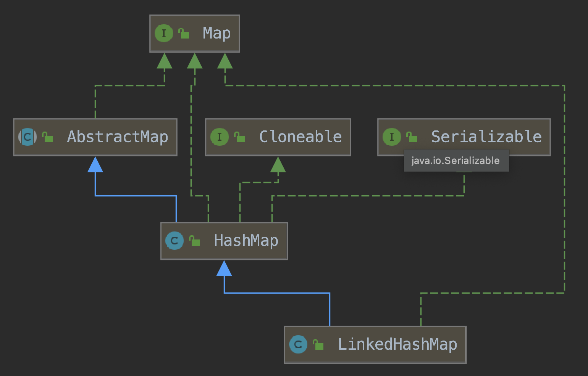
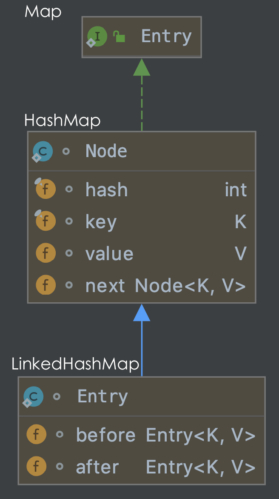
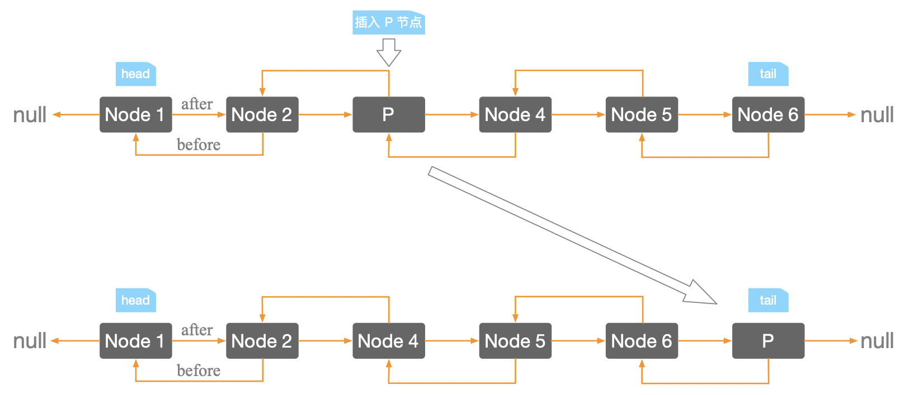

## Comparator

 * 使用Comparable排序ArrayList
 * Comparable 是带有单一 compareTo()方法的接口。
 * 一个实现了 Comparable 接口的类的对象可以与其它同类型的对象进行比较，实现 Comparable 接口的类需要重写 compareTo()方法，
 * 这个方法接收一个同类型的对象，并实现这个对象和传递给方法的另一个对象比较的逻辑。
 * compareTo()方法返回Int类型的比较结果，分别代表下面的含义：
 * 正值表示当前对象比传递给 comPareTo()的对象大
 * 负值表示当前对象比传递给 comPareTo()的对象小
 * 零表示两个对象相等
 * 举一个例子，JobCandidate 类的对象保存在 ArrayList 中并准备对其进行排序。JobCandidate 类有三个成员变量：字符串类型的姓名和性别、整型的年龄。我们想要对保存在 ArrayList 中的 JobCandidate 对象按照年龄进行排序。因此我们要让 JobCandidate 类实现 Comparable 接口并重写 compareTo()方法。
 * The code of the JobCandidate class is this.
 * JobCandidate类的代码如下

```java
import java.util.ArrayList;
import java.util.Comparator;

public class JobCandidate implements Comparable {
    private String name;
    private String gender;
    private int age;
    public JobCandidate(String name, String gender, int age) {
        this.name = name;
        this.gender = gender;
        this.age = age;
    }
    public String getName() {
        return name;
    }
    public String getGender() {
        return gender;
    }
    public int getAge() {
        return age;
    }
    @Override
    public int compareTo(JobCandidate candidate) {
        return (this.getAge() < candidate.getAge() ? -1 :
                (this.getAge() == candidate.getAge() ? 0 : 1));
    }
    @Override
    public String toString() {
    return " Name: " + this.name + ", " +
            "Gender: " + this.gender + ", " +
            "age:" + this.age;
    }
}
```


**HashTable的内部存储结构**

HashTable和HashMap采用相同的存储机制，二者的实现基本一致，不同的是：

+ HashMap是非线程安全的，HashTable是线程安全的，内部的方法基本都是`synchronized`。

+ `HashTable不允许有null值的存在`。在HashTable中调用put方法时，如果key为null，直接抛出NullPointerException。

+ 效率低下。HashTable容器使用`synchronized`来保证线程安全，但在线程竞争激烈的情况下HashTable的效率非常低下。`因为当一个线程访问HashTable的同步方法时，其他线程访问HashTable的同步方法，可能会进入阻塞或轮询状态`。如线程1使用put进行添加元素，线程2不但不能使用put方法添加元素，并且也不能使用get方法来获取元素，所以竞争越激烈效率越低。


**HashTable和ConcurrentHashMap的比较**

> [HashMap、HashTable、ConcurrentHashMap三者区别](https://www.cnblogs.com/wang-meng/p/5808006.html)

[**ConcurrentHashMap**](https://www.jianshu.com/p/5dbaa6707017)

是Java 5中支持`高并发、高吞吐量的线程安全`HashMap实现。

+ ConcurrentHashMap是如何实现线程安全的？

+ 其中抛弃了原有的**Segment 分段锁，而采用了 CAS + synchronized 来保证并发安全性**。

+ 在put的时候，如果tab中索引为i的位置的元素为null，则直接使用CAS将值插入即可

+ ```java
	else if ((f = tabAt(tab, i = (n - 1) & hash)) == null) {
	  if (casTabAt(tab, i, null,new Node<K,V>(hash, key, value, null))) break;// no lock when adding to empty bin
	}
	```

+ 如果f！=null，则**使用synchronized锁住**f元素（链表/红黑树的头元素）。

+ ```java
	synchronized(f){
	  if (tabAt(tab, i) == f) {
	    if (fh >= 0) {
	      //当前为链表，在链表中插入新的键值对
	    }else if (f instanceof TreeBin) {
	      //当前为红黑树，将新的键值对插入到红黑树中
	     }
	  }
	}
	```

+ `使用CAS添加（链表的头结点）？`

+ tabAt()的作用就是寻找指定数组在内存中i位置的数据。

+ ```java
	static final <K,V> Node<K,V> tabAt(Node<K,V>[] tab, int i) {
	    return (Node<K,V>)U.getObjectVolatile(tab, ((long)i << ASHIFT) + ABASE);
	}
	```

+ 我们以ConcurrentHashMap来说一下`分段锁`的含义以及设计思想，ConcurrentHashMap中的分段锁称为`Segment`，类似于HashMap（JDK1.7与JDK1.8中HashMap的实现）的结构，即内部拥有一个Entry数组，数组中的每个元素又是一个链表；同时又是一个`ReentrantLock`（Segment继承了ReentrantLock)。

+ 当需要put元素的时候，并不是对整个hashmap进行加锁，而是先通过hashcode()来知道他要放在哪一个分段中，然后对这个分段进行加锁，所以当多线程put的时候，只要不是放在一个分段中，就实现了真正的并行的插入。

+ 但是，在统计`size`的时候，可就是获取HashMap全局信息的时候，就需要获取所有的分段锁才能统计。

+ `分段锁的设计目的是细化锁的粒度`，当操作不需要更新`整个数组`的时候，就仅仅针对数组中的一项进行加锁操作。


## ----------------------------

## Arraylist

[官方文档](https://docs.oracle.com/javase/8/docs/api/java/util/ArrayList.html#)

### 简介

List 是一个接口，ArrayList是实现List接口的实现类，内部是一个大小可变的数组

ArrayList<E> extends AbstractList<E>

ArrayList 的好处是可以不用限定容器的大小，它会根据元素的增加而扩容。但是存储进去的数据类型都会变成`Object`类型，虽然每个元素有自己的`index`，但不像数组的下标可以更加方便的操作

### 类定义

**`ArrayList`定义如下**：

```java
public class ArrayList<E> extends AbstractList<E>
        implements List<E>, RandomAccess, Cloneable, java.io.Serializable
```

1. **实现 RandomAccess 接口**

这是一个标记接口，一般此标记接口用于 `List `实现，以表明它们支持快速（通常是恒定时间）的随机访问。该接口的主要目的是允许通过算法改变其行为，以便在应用于随机或顺序访问列表时提供良好的性能。

比如在工具类`Collections`中，应用二分查找方法时判断是否实现了`RandomAccess`接口。

2. **实现 Cloneable 接口**

这个类是 `java.lang.Cloneable`，前面我们讲解[深拷贝和浅拷贝](http://www.cnblogs.com/ysocean/p/8482979.html)的原理时，我们介绍了浅拷贝可以通过调用 `Object.clone()` 方法来实现，但是调用该方法的对象必须要实现 Cloneable 接口，否则会抛出 `CloneNoSupportException`异常。

Cloneable 和 RandomAccess 接口一样也是一个标记接口，接口内无任何方法体和常量的声明，也就是说如果想克隆对象，必须要实现 Cloneable 接口，表明该类是可以被克隆的。

3. **实现 Serializable 接口**

也是标记接口，表示能被序列化。

4. **实现 List 接口**

这个接口是 List 类集合的上层接口，定义了实现该接口的类都必须要实现的一组方法，如下所示，下面我们会对这一系列方法的实现做详细介绍。

```java
public interface List<E> extends Collection<E> {
    int size();
    boolean isEmpty();
    boolean contains(Object o);
    Iterator<E> iterator();
    Object[] toArray();
    <T> T[] toArray(T[] a);
    boolean add(E e);
    boolean remove(Object o);
    boolean containsAll(Collection<?> c);
    boolean addAll(Collection<? extends E> c);
    boolean addAll(int index, Collection<? extends E> c);
    boolean removeAll(Collection<?> c);
    boolean retainAll(Collection<?> c);
  
    default void replaceAll(UnaryOperator<E> operator) {
        Objects.requireNonNull(operator);
        final ListIterator<E> li = this.listIterator();
        while (li.hasNext()) {
            li.set(operator.apply(li.next()));
        }
    }

    @SuppressWarnings({"unchecked", "rawtypes"})
    default void sort(Comparator<? super E> c) {
        Object[] a = this.toArray();
        Arrays.sort(a, (Comparator) c);
        ListIterator<E> i = this.listIterator();
        for (Object e : a) {
            i.next();
            i.set((E) e);
        }
    }

    void clear();
    boolean equals(Object o);
    int hashCode();
    E get(int index);
    E set(int index, E element);
    void add(int index, E element);
    E remove(int index);
    int indexOf(Object o);
    int lastIndexOf(Object o);
    ListIterator<E> listIterator();
    ListIterator<E> listIterator(int index);
    List<E> subList(int fromIndex, int toIndex);

    @Override
    default Spliterator<E> spliterator() {
        return Spliterators.spliterator(this, Spliterator.ORDERED);
    }
}
```

### 字段属性

```java
private static final long serialVersionUID = 8683452581122892189L;

// 集合默认大小
private static final int DEFAULT_CAPACITY = 10;  

// Object类型的空数组实例
private static final Object[] EMPTY_ELEMENTDATA = {};

// 这也是一个空的数组实例，和EMPTY_ELEMENTDATA空数组相比是用于了解添加元素时数组膨胀多少
private static final Object[] DEFAULTCAPACITY_EMPTY_ELEMENTDATA = {};

// 用来存储 ArrayList 集合的元素，集合的长度即这个数组的长度
transient Object[] elementData;

private int size;
```

### 构造函数

> **无参构造函数**

```java
public ArrayList() {
  	this.elementData = DEFAULTCAPACITY_EMPTY_ELEMENTDATA;
}
```

此无参构造函数将创建一个 `DEFAULTCAPACITY_EMPTY_ELEMENTDATA` 声明的数组，注意此时初始容量是`0`，而不是 `10`。

+ 注意：根据默认构造函数创建的集合，`ArrayList list = new ArrayList();`此时集合长度是0。

> **初始化集合大小构造函数**

当大于0时，给定多少那就创建多大的数组；当等于0时，创建一个空数组；当小于0时，抛出异常。

```java
public ArrayList(int initialCapacity) {
    if (initialCapacity > 0) {
      	this.elementData = new Object[initialCapacity];
    } else if (initialCapacity == 0) {
      	this.elementData = EMPTY_ELEMENTDATA;
    } else {
      	throw new IllegalArgumentException("Illegal Capacity: "+
                                         initialCapacity);
    }
}
```

> **传入一个集合的构造函数**

当我们想将一个集合转化为`ArraList`中，可用此构造函数：

+ 将已有的集合复制到 ArrayList 集合中去

```java
public ArrayList(Collection<? extends E> c) {
    elementData = c.toArray();   // Object[] toArray();
    if ((size = elementData.length) != 0) {
    		if (elementData.getClass() != Object[].class)
          	elementData = Arrays.copyOf(elementData, size, Object[].class);
    } else {
        this.elementData = EMPTY_ELEMENTDATA;
    }
}
```

### 添加元素

> **源码分析**

ArrayList 集合是由数组构成的，那么向 ArrayList 中添加元素，也就是向数组赋值。

扩容的核心方法就是调用`Arrays.copyOf`方法，创建一个更大的数组，然后将原数组元素拷贝过去即可。

```java
public boolean add(E e) {
    ensureCapacityInternal(size + 1);  // 确定集合的大小，如果集合满了，则要进行扩容操作
    elementData[size++] = e;
    return true;
}

private void ensureCapacityInternal(int minCapacity) {
  	ensureExplicitCapacity(calculateCapacity(elementData, minCapacity));
}
private void ensureExplicitCapacity(int minCapacity) {
    modCount++;
    if (minCapacity - elementData.length > 0)
      	grow(minCapacity);
}
private static int calculateCapacity(Object[] elementData, int minCapacity) {
    if (elementData == DEFAULTCAPACITY_EMPTY_ELEMENTDATA) {
      	return Math.max(DEFAULT_CAPACITY, minCapacity);
    }
  	return minCapacity;
}
```

在 `ensureExplicitCapacity` 方法中，首先对修改次数`modCount`加1，这里的modCount给ArrayList的迭代器使用的，在并发操作被修改时，提供快速失败行为（保证modCount在迭代期间不变，否则抛出ConcurrentModificationException异常，可以查看源码865行）

接着判断`minCapacity`是否大于当前ArrayList内部数组长度，大于的话调用`grow`方法对内部数组elementData扩容，grow方法代码如下：

```java
private void grow(int minCapacity) {
    int oldCapacity = elementData.length;
    int newCapacity = oldCapacity + (oldCapacity >> 1); // 扩容1.5倍
    if (newCapacity - minCapacity < 0)
      	newCapacity = minCapacity;
    if (newCapacity - MAX_ARRAY_SIZE > 0)
      	newCapacity = hugeCapacity(minCapacity);
    elementData = Arrays.copyOf(elementData, newCapacity);
}

private static int hugeCapacity(int minCapacity) {
    if (minCapacity < 0) // overflow
      	throw new OutOfMemoryError();
    return (minCapacity > MAX_ARRAY_SIZE) ?
      	Integer.MAX_VALUE :
    MAX_ARRAY_SIZE;
}
```

> **总结**

1. 当通过 ArrayList() 构造一个空集合，初始长度是为0的，第 1 次添加元素，会创建一个长度为10的数组，并将该元素赋值到数组的第一个位置。
2. 第 2 次添加元素，集合不为空，而且由于集合的长度size+1是小于数组的长度10，所以直接添加元素到数组的第二个位置，不用扩容。
3. 第 11 次添加元素，此时 size+1 = 11，而数组长度是10，这时候创建一个长度为10+10\*0.5 = 15 的数组（扩容1.5倍），然后将原数组元素引用拷贝到新数组。并将第 11 次添加的元素赋值到新数组下标为10的位置。
4. 第 Integer.MAX_VALUE - 8 = 2147483639，然后 2147483639%1.5=1431655759（这个数是要进行扩容） 次添加元素，为了防止溢出，此时会直接创建一个 1431655759+1 大小的数组，这样一直，每次添加一个元素，都只扩大一个范围。
5. 第 Integer.MAX_VALUE - 7 次添加元素时，创建一个大小为 Integer.MAX_VALUE 的数组，再进行元素添加。
6. 第 Integer.MAX_VALUE + 1 次添加元素时，抛出 OutOfMemoryError 异常。

**注意**：是可以向集合中添加 null 的，因为数组可以有 null 值存在。

```java
Object[] obj = {null,1};

ArrayList list = new ArrayList();
list.add(null);
list.add(1);
System.out.println(list.size()); // 2
```

### 删除元素

> **根据索引删除元素**

`remove(int index)` 方法表示删除索引`index`处的元素，首先通过 `rangeCheck(index)` 方法判断给定索引的范围，超过集合大小则抛出异常；接着通过 `System.arraycopy` 方法对数组进行自身`拷贝`。

源码如下：

```java
public E remove(int index) {
    rangeCheck(index);

    modCount++;
    E oldValue = elementData(index);

    int numMoved = size - index - 1;
    if (numMoved > 0)
        System.arraycopy(elementData, index+1, elementData, index,
                       numMoved);
    elementData[--size] = null; // clear to let GC do its work

    return oldValue;
}
```

> **直接删除指定元素**

`remove(Object o)`方法是删除数组中从前往后第一次出现的该元素。然后通过`System.arraycopy`进行数组自身拷贝。

源码如下：

```java
public boolean remove(Object o) {
    if (o == null) {
        for (int index = 0; index < size; index++)
            if (elementData[index] == null) {
                fastRemove(index);
                return true;
            }
    } else {
        for (int index = 0; index < size; index++)
            if (o.equals(elementData[index])) {
                fastRemove(index);
                return true;
            }
    }
    return false;
}
```

### 修改元素

通过调用 `set(int index, E element)` 方法在指定索引 index 处的元素替换为 element。并返回原数组的元素。

```java
public void set(E e) {
    if (lastRet < 0)
      	throw new IllegalStateException();
    checkForComodification();

    try {
      	ArrayList.this.set(lastRet, e);
    } catch (IndexOutOfBoundsException ex) {
      	throw new ConcurrentModificationException();
    }
}
```

通过调用 `rangeCheck(index)` 来检查索引合法性。

当索引为负数时，会抛出 `java.lang.ArrayIndexOutOfBoundsException` 异常。当索引大于集合长度时，会抛出 `IndexOutOfBoundsException` 异常。

```java
private void rangeCheck(int index) {
  	if (index < 0 || index >= this.size)
    		throw new IndexOutOfBoundsException(outOfBoundsMsg(index));
}
```

### 查找元素

> **根据索引查找元素**

源码：

```java
public E get(int index) {
  	rangeCheck(index);
  	return elementData(index);
}
```

> **根据元素查找索引**

返回索引是通过遍历整个数组实现的，且返回第一次出现该元素的下标，如果没有则返回 -1

源码：

```java
public int lastIndexOf(Object o) {
    if (o == null) {
        for (int i = size-1; i >= 0; i--)
          	if (elementData[i]==null)
            		return i;
    } else {
      		for (int i = size-1; i >= 0; i--)
        			if (o.equals(elementData[i]))
          				return i;
    }
    return -1;
}
```

此外， `lastIndexOf(Object o)` 方法是返回最后一次出现该元素的下标。

```java
public int lastIndexOf(Object o) {
    if (o == null) {
        for (int i = size-1; i >= 0; i--)
            if (elementData[i]==null)
              	return i;
    } else {
        for (int i = size-1; i >= 0; i--)
          	if (o.equals(elementData[i]))
            		return i;
    }
    return -1;
}
```

可见`lastIndexOf(Object o)` 方法是从后往前遍历的。

### 遍历集合

+ 内容有点多，见[原文](https://www.cnblogs.com/ysocean/p/8622264.html)

1. 通过`get(int index)`

```java
for(int i = 0 ; i < list.size() ; i++){
    System.out.print(list.get(i)+" ");
}
```

2. 迭代器 `iterator`

```java
ArrayList<String> list = new ArrayList<>();
// 添加元素的步骤省略...
Iterator<String> it = list.iterator();
while(it.hasNext()){
  	String str = it.next();
  	System.out.print(str+" ");
}
```

### SubList

在 ArrayList 中有这样一个方法：

```java
public List<E> subList(int fromIndex, int toIndex) {
  	subListRangeCheck(fromIndex, toIndex, size);
  	return new SubList(this, 0, fromIndex, toIndex);
}
```

作用是返回从 `fromIndex(包括)` 开始的下标，到 `toIndex(不包括)` 结束的下标之间的元素`视图`。如下：

```java
ArrayList<String> list = new ArrayList<>();
list.add("a");
list.add("b");
list.add("c");
list.add("d");

List<String> subList = list.subList(0, 1);
for(String str : subList){
    System.out.print(str + " "); // a b
}
```

+ `SubList` 类是 ArrayList 中的一个内部类。

注意：返回的是`原集合`的视图，也就是说，如果对 subList 出来的集合进行修改或新增操作，那么原始集合也会发生同样的操作。想要独立出来一个集合，解决办法如下：

```java
List<String> subList = new ArrayList<>(list.subList(0, 2));
```

### trimToSize()

该方法用于回收多余的内存。也就是说一旦我们确定集合不再添加多余的元素之后，调用 `trimToSize()` 方法会将实现集合的数组大小刚好调整为集合元素的大小。

```java
public void trimToSize() {
  	modCount++;
    if (size < elementData.length) {
      	elementData = Arrays.copyOf(elementData, size);
    }
}
```

**注意**：该方法会花时间来复制数组元素，所以应该在确定不会添加元素之后在调用。


### 使用

```java
// Arraylist

import java.util.ArrayList;
import java.util.Iterator;
import java.util.List;

public class Main {
    public static void main(String[] args) {
        List<String> staffs = new ArrayList<String>();
        List<String> corporation = new ArrayList<String>();
        //添加数据
        staffs.add("A");
        staffs.add("B");
        staffs.add("C");
        corporation.add("Boss");

        //在某个位置插入元素，此位置后的元素后移
        staffs.add(1,"a");

        staffs.set(1,"2");
        staffs.get(1);     //获取某位置的元素

        staffs.indexOf("A");

        staffs.size();
        staffs.isEmpty();

        corporation.addAll(staffs);//将staffs中的元素全部添加到corporation
        corporation.addAll(0,staffs); //添加到指定位置

        corporation.remove(" "); //直接删除元素
        corporation.remove(2);  //表示把下标为2对应的值删掉，后面的值向前移动

        corporation.clear();  //清除所有数据

        System.out.println(staffs.toString());

        for(int i=0;i<staffs.size();i++) {
            System.out.println(staffs.get(i)); //打印所有元素
        }

        System.out.println("----");
        //另一种遍历方法：用迭代器方法。
        //staffs.iterator()把数组中的值放到了迭代器中，然后在迭代器中遍历
        Iterator<String> iterator = staffs.iterator();
        while(iterator.hasNext()) {
            System.out.println(iterator.next());  //下标后移，并且判断是否有数据了   iterator.next()就是值
        }
    }
}

```


### Arraylist_sort

```java
 // Arraylist_sort

import java.util.ArrayList;
import java.util.Collections;
import java.util.Scanner;

public class Arraylist_sort {
    public static void main(String[] args) {
        Scanner scan = new Scanner(System.in);
        int n;
        ArrayList al = new ArrayList();
        System.out.println("请输入需要的个数");
        n = scan.nextInt();
        System.out.println("请逐一输入");
        for (int i = 0; i < n; i++) {
            al.add(i, scan.nextInt());
        }
        System.out.println("你输入的数字是：");
        for (int i = 0; i < al.size(); i++) {
            int temp = (int) al.get(i);
            System.out.print(temp + " ");
        }
        Collections.sort(al);  // 针对一个ArrayList内部的数据排序,默认从小到大排序
        // Collections.sort(al,Collections.reverseOrder());  //从大到小
        System.out.println();
        System.out.println("经过排序后：");
        for (int i = 0; i < al.size(); i++) {
            int temp = (int) al.get(i);
            System.out.print(temp + " ");
        }

        //Collections.sort() 方法对 ArrayList 的元素或者任何其他 List 的实现提供的可比较的元素进行排序，
        //这意味着这些元素的类需要实现 java.lang 包中的 Comparable 接口。
    }
}
```


## LinkedList ?


## ----------------------------

## HashMap

+ [JDK源码解析](https://www.cnblogs.com/ysocean/category/1149707.html)
+ [敖丙-面试必问：HashMap](https://www.bilibili.com/read/cv5227300)
+ [HashMap、HashTable、ConcurrentHashMap之关联](https://www.cnblogs.com/wang-meng/p/5808006.html)

### 简介

HashMap 继承 AbstractMap 抽象类，实现Map接口、Cloneable接口、Serializable接口。称为“链表的数组”，一个数组中，每个元素存储的是一个链表的头结点。

它是数组加链表组成的数据结构，数组中每个地方都存了Key-Value这样的实例，在Java7叫Entry，Java8中叫Node。每一个节点都会保存自身的hash、key、value、以及下个节点，Node的源码如下：

```java
static class Node<K,V> implements Map.Entry<K,V> {
    final int hash;
    final K key;
    V value;
    Node<K,V> next;
  	...
}
```


### 哈希

> **常见的求哈希值的函数：**

1. **直接定址法**

+ 取关键字的某个线性函数为散列地址

+ Hash(Key) = A * Key + B

+ 适合查找比较小且连续的情况

2. **除留余数法**

+ 设散列表中允许的地址数为m，取一个不大于m，但最接近或者等于m的`质数`，按照哈希函数：Hash( key ) = key % p ( p <= m) ，将关键码转换成哈希地址。

3. **平方取中法**

4. **折叠法**

5. **随机数法**

6. **数学分析法**

> **那么这些元素是按照什么样的规则存储到数组中呢？为什么数组长度设置为$2^n$？**

一般情况是通过 hash(key)%len 获得，也就是元素的key的哈希值对数组长度取模得到。

哈希算法是指把任意长度的二进制映射为固定长度的较小的二进制值，这个较小的二进制值叫做哈希值。

Hash 值的范围值 -2147483648 到 2147483647，前后加起来大概40亿的映射空间。只要哈希函数映射得比较均匀松散，一般是很难出现碰撞的。但问题是一个40亿长度的数组，内存是放不下的。所以这个散列值是不能直接拿来用的，用之前还要先做对数组的长度取模运算。这个数组下标的计算方法是“ hash &  (n - 1)”（n代表数组长度）。

本来模质数可以减少碰撞的几率（至于为什么模质数可以减少碰撞的几率，有个数学推导，比较复杂，感兴趣的话可以了解一下），但是取余(%)操作中如果除数是2的幂次则等价于与其除数减一的与(&)操作

+ 也就是说 hash%length == hash&(length-1) 的前提是：length 是 2 的 n 次方
+ 且采用二进制位操作 &，相对于%能够提高运算效率，这就解释了 HashMap 的长度为什么是2的幂次方。

+ length = $2^n$ ，则length-1 = $2^n$ -1，都是11111结尾的，只有1&1才等于1，所以碰撞几率小。

>为啥我们重写equals方法的时候需要重写hashCode方法呢？能用HashMap给我举个例子么？

因为在Java中，所有的对象都是继承于Object类。Object类中有两个方法equals、hashCode，这两个方法都是用来比较两个对象是否相等的。

在未重写equals方法我们是继承了object的equals方法，那里的 equals是比较两个对象的内存地址，显然我们new了2个对象内存地址肯定不一样

- 对于值对象，==比较的是两个对象的值
- 对于引用对象，比较的是两个对象的地址

大家是否还记得我说的HashMap是通过key的hashCode去寻找index的，那index一样就形成链表了。

我们去get的时候，他就是根据key去hash然后计算出index，找到了2，那我怎么找到具体的”帅丙“还是”丙帅“呢？

**equals**！是的，所以如果我们对equals方法进行了重写，建议一定要对hashCode方法重写，以保证相同的对象返回相同的hash值，不同的对象返回不同的hash值。

不然一个链表的对象，你哪里知道你要找的是哪个，到时候发现hashCode都一样，这不是完犊子嘛。

### 初始化

```java
DEFAULT_INITIAL_CAPACITY = 16; 
MAXIMUM_CAPACITY = 1 << 30;   // 最大容量：2的30次方：1073741824
DEFAULT_LOAD_FACTOR = 0.75f;
```

其中传参构造方法：

```java
public HashMap(int initialCapacity, float loadFactor){ 
  //···
  int capacity = 1;
  while (capacity < initialCapacity)  
          capacity <<= 1;
  //···
}
```

+ 该代码的意思是，实际的开辟的空间要大于传入的第一个参数的值。

> 为什么默认初始化长度是16

**在JDK1.8的 236 行有1<<4就是16**，为啥用位运算呢？直接写16不好么？

```java
static final int DEFAULT_INITIAL_CAPACITY = 1 << 4;
```


### 扩容机制

JDK1.7使用数组+链表；JDK1.8使用数组+链表+红黑树。

链表长度大于8转为红黑树，红黑树的节点数小于6转化为链表。

> **装载因子**

loadFactor装载因子：用来衡量 HashMap 满的程度。
+ loadFactor = size/capacity
+ threshold = capacity * loadFactor

当元素个数达到threshold就会触发扩容（resize）

装载因子非常重要，应严格限制在 0.7~0.8 以下，默认的装载因子为0.75， 是对空间和时间效率的一个平衡选择。超过 0.8 ，查表时的CPU缓存按照指数曲线上升。

如果内存空间很多而又对时间效率要求很高，可以降低 loadFactor 的值；相反，如果内存空间紧张而对时间效率要求不高，可以增加负载因子 loadFactor 的值，这个值可以大于1。

装载因子调小，这样比较容易触发扩容机制，扩容机制触发，占用更多的内存空间，但是可以减少桶内部的链表化和树形化，从而增加查找效率，也就是以空间换时间。

> **扩容分为两步：**

1. 扩容：创建一个新的Entry空数组，长度是原数组的2倍。
2. ReHash：遍历原Entry数组，把所有的Entry重新Hash到新数组。

> **为什么是重哈希而不是直接复制过去？**

因为长度扩大以后，Hash的规则也随之改变。

+ Hash的公式：index = HashCode(Key) & (Length - 1)

> **JDK1.8中扩容机制改进**

上面讲的是JDK1.8之前的版本，如果扩容前capasity = $2^n$ ，扩容后capasity = $2^{n+1}$，扩容涉及到rehash、复制数据等操作，所以非常耗能。

相比于JDK1.7，JDK1.8使用的是2次幂的扩展（指长度扩为原来2倍），所以，元素的位置要么是在原位置，要么是在原位置再移动  $2^n$ 的位置。

+ resize() 1.7传参自定义newcap，1.8自动扩容2倍

JDK1.8在扩充HashMap的时候，不需要像JDK1.7的实现那样重新计算hash，只需要看原来的hash值新增的那个bit是1还是0就好了，是0的话索引没变，是1的话索引变成“原索引+oldCap”。（[JDK1.8HashMap扩容优化](https://www.cnblogs.com/twoheads/p/10682275.html)）

这个设计确实非常的巧妙，既省去了重新计算hash值的时间，而且同时，由于新增的1bit是0还是1可以认为是随机的，因此resize的过程，均匀的把之前的冲突的节点分散到新的bucket了。这一块就是JDK1.8新增的优化点。

 ```java
// 该语句判断是否落在“原索引”，还是落在“原索引+oldCap”
if ((e.hash & oldCap) == 0){} //原索引
else{} //原索引+oldCap
 ```

此外，JDK1.7中rehash的时候，旧链表迁移新链表的时候，如果在新表的数组索引位置相同，则链表元素会倒置（采用头插法），但JDK1.8不会倒置（采用尾插法）。

+ 采用头插法，高并发容易引起循环链表，所以采用尾插法。

> **JDK1.8中hash()改进**

在 JDK1.8 中还有个高位参与运算，hashCode() 得到的是一个32位 int 类型的值，通过hashCode()的高16位 异或 低16位（将高16位渗透到低16位中）实现的：`(h = k.hashCode()) ^ (h >>> 16)`，主要是从速度、功效、质量来考虑的，`这么做可以在数组table的length比较小的时候，也能保证考虑到高低Bit都参与到Hash的计算中，同时不会有太大的开销`。

+ key.hashCode()是固定的，JDK1.8的hash()是优化后的key.hashCode()，而JDK1.7的hash()是直接用的 key.hashCode()。

* 优化过程([原文](https://www.cnblogs.com/ysocean/p/8711071.html)) ：key.hashCode() ^ (h >>> 16) 

+ 加工后，key.hashCode() 的低16位有更好的性能，减少碰撞率

```java
static final int hash(Object key) {
   int h;
   return (key == null) ? 0 : (h = key.hashCode()) ^ (h >>> 16);
}     
i = (table.length - 1) & hash;  //这一步是在后面添加元素putVal()方法中进行位置的确定
```

### 插入元素

Java8之前是头插法，因为写这个代码的作者认为后来的值被查找的可能性更大一点，可以提升查找的效率。Java8之后，都是采用尾插法。

> **为什么改用尾插法？**

并发情况下，HashMap在扩容时使用头插法可能出现循环链表，后果就是调用get()方法时可能陷入死循环。

> **为什么采用头插法会出现循环链表？**

https://blog.csdn.net/littlehaes/article/details/105241194

JDK1.7的rsize()内部会调用transfer()，JDK1.8的rsize()内部没有了transfer()方法，而是直接将transfer()写在了rsize()内部。 

```java
void transfer(Entry[] newTable){
    Entry[] src=table;
    int newCapacity=newTable.length;
    for(int j=0;j<src.length;j++){
        Entry<K, V> e=src[j];
        if(e!=null){
            src[j]=null;
            do{
                Entry<K, V> next=e.next; //保存下一次循环的Entry
                //在新的table 中求得适合插入的位置
                int i=indexFor(e.hash, newCapacity);
                e.next=newTable[i];//  如果I位置原来没有值，则直接插入；有值，采用链头插入法
                newTable[i]=e;

                //轮替，下一次循环
                e=next;
            }while(e!=null);
        }
    }
}
```

+ [并发HashMap的put操作引起死循环](https://www.cnblogs.com/wfq9330/p/9023892.html)
+ 因为多线程会导致HashMap的Entry链表形成环形数据结构，查找时会陷入死循环。
+ 扩容后，内部调用`transfer`方法（把旧表中的元素添加到新表中），这就是HashMap并发时，会引起死循环的根本原因所在。

JDK1.8在同样的并发场景下并不会引起死循环，原因是扩容转移后前后链表顺序不变，保持之前节点的引用关系。

> 那是不是意味着Java8就可以把HashMap用在多线程中呢？

即使不会出现死循环，但是通过源码看到put/get方法都没有加同步锁，多线程情况最容易出现的就是：无法保证上一秒put的值，下一秒get的时候还是原值，所以线程安全还是无法保证。

### 碰撞

> **处理碰撞的两种方法：**

1. 开放地址法

2. 链地址法

###  遍历元素

四种方法：

1. 分别获取 key 集合和 value 集合；
2. 获取 key 集合，然后遍历key集合，根据key分别得到相应value；
3. 得到 Entry 集合，然后遍历 Entry；
4. 迭代。

基本上使用方法3性能是最好的，且在遍历的过程（方法3）中我们可以对集合中的元素进行删除；方法2效率很低，不推荐使用；方法4效率也挺好。

## LinkedHashMap

[原文](https://www.cnblogs.com/ysocean/p/9839173.html)

### 简介

> 先来回顾一下 `HashMap` 的特性：

① 基于 JDK1.8 的 HashMap 是由数组 + 链表 + 红黑树组成，相对于早期版本的 JDK HashMap 实现，新增了红黑树作为底层数据结构，在数据量较大且哈希碰撞较多时，能够极大的增加检索的效率。

② 允许 key 和 value 都为 null。key 重复会被覆盖，value 允许重复。

③ 非线程安全。

④ 无序（遍历 HashMap 得到元素的顺序不是按照插入的顺序）。

LinkedHashMap 是基于 HashMap 实现的一种集合，具有 HashMap 集合上面所说的所有特点，除了 HashMap 无序的特点，LinkedHashMap 是有序的，因为 LinkedHashMap 在 HashMap 的基础上单独维护了一个具有所有数据的`双向链表`，该链表保证了元素迭代的顺序。

所以我们可以直接这样说：`LinkedHashMap = HashMap + LinkedList`。LinkedHashMap 就是在 HashMap 的基础上多维护了一个双向链表，用来保证元素迭代顺序。

```java
public class LinkedHashMap<K,V> extends HashMap<K,V> implements Map<K,V>
```




### 字段属性

> **`Entry<K,V>`**

```java
static class Entry<K,V> extends HashMap.Node<K,V> {
    Entry<K,V> before, after;
    Entry(int hash, K key, V value, Node<K,V> next) {
      	super(hash, key, value, next);
		}
}
```

LinkedHashMap 的每个元素都是一个 Entry，我们看到对于 Entry 继承自 HashMap 的 Node 结构，相对于 Node 结构，LinkedHashMap 多了 before 和 after 结构。

> **下面是Map类集合基本元素的实现演变：**



LinkedHashMap 中 Entry 相对于 HashMap 多出的 `before` 和 `after` 便是用来维护 LinkedHashMap 插入 Entry 的先后顺序的。


> **其它属性**

用来指向双向链表的头节点：

```java
transient LinkedHashMap.Entry<K,V> head;
```

用来指向双向链表的尾节点：

```java
transient LinkedHashMap.Entry<K,V> tail;
```

用来指定LinkedHashMap的迭代顺序：

```java
final boolean accessOrder;
```

+ `true` 表示按照`访问`顺序，会把访问过的元素放在链表后面，放置顺序是访问的顺序；

+ `false` 表示按照`插入`顺序遍历。

**注意**：这里有五个属性别搞混淆：

+ 对于 `Node next` 属性，是用来维护整个集合中 Entry 的顺序；
+ 对于 `Entry before`，`Entry after `，以及 `Entry head`，`Entry tail`，这四个属性都是用来维护保证集合顺序的链表。其中前两个 before 和 after 表示某个节点的上一个节点和下一个节点，这是一个双向链表。后两个属性 head 和 tail 分别表示这个链表的头节点和尾节点。


### 构造函数

> **无参构造函数**

```java
public LinkedHashMap() {
  	super();
  	accessOrder = false;  //默认按照插入的顺序
}
```


> **指定初始容量**

```java
public LinkedHashMap(int initialCapacity) {
  	super(initialCapacity);
		accessOrder = false;
}
```


> **指定初始容量、装载因子**

```java
public LinkedHashMap(int initialCapacity, float loadFactor) {
  	super(initialCapacity, loadFactor);
  	accessOrder = false;
}
```


> **指定初始容量、加载因子、迭代规则**

```java
public LinkedHashMap(int initialCapacity, float loadFactor, boolean accessOrder) {
  	super(initialCapacity, loadFactor);
  	this.accessOrder = accessOrder;
}
```


> **构造包含指定集合中的元素**

```java
public LinkedHashMap(Map<? extends K, ? extends V> m) {
		super();
		accessOrder = false;
		putMapEntries(m, false);
}
```

上面所有的构造函数默认 `accessOrder = false`，除了第四个构造函数能够指定 accessOrder 的值。


### 添加元素

LinkedHashMap 中是没有 put 方法的，而是直接调用父类 HashMap 的 put 方法。关于 HashMap 的 put 方法，可以参看[ HashMap 的介绍](https://www.cnblogs.com/ysocean/p/8711071.html#_label6)

`LinkedHashMap`

```java
public V put(K key, V value) {
		return putVal(hash(key), key, value, false, true);
}
```

`HashMap`

```java
public V put(K key, V value) {
		return putVal(hash(key), key, value, false, true);
}

/**
 * @param hash         索引的位置
 * @param key          键
 * @param value        值
 * @param onlyIfAbsent true 表示不要更改现有值
 * @param evict        false 表示table处于创建模式
 * @return
 */
final V putVal(int hash, K key, V value, boolean onlyIfAbsent, boolean evict) {
    Node<K,V>[] tab; 
  	Node<K,V> p; 
  	int n, i;
  	//如果table为null或者长度为0，则进行初始化
		//resize()方法本来是用于扩容，由于初始化没有实际分配空间，这里用该方法进行空间分配，后面会详细讲解该方法
    if ((tab = table) == null || (n = tab.length) == 0)
      	n = (tab = resize()).length;
  	//注意：这里用到了前面讲解获得key的hash码的第三步，取模运算，下面的if-else分别是 tab[i] 为null和不为null
    if ((p = tab[i = (n - 1) & hash]) == null)
      	tab[i] = newNode(hash, key, value, null); //tab[i] 为null，直接将新的key-value插入到计算的索引i位置   ①
    else {  //tab[i] 不为null，表示该位置已经有值了
      	Node<K,V> e; K k;
        if (p.hash == hash &&
            ((k = p.key) == key || (key != null && key.equals(k))))
          	e = p;   //节点key已经有值了，直接用新值覆盖
        //该链是红黑树
      	else if (p instanceof TreeNode)
          	e = ((TreeNode<K,V>)p).putTreeVal(this, tab, hash, key, value);  // ②
        //该链是链表
      	else {
            for (int binCount = 0; ; ++binCount) {
                if ((e = p.next) == null) {
                    p.next = newNode(hash, key, value, null);
                    //链表长度大于8，转换成红黑树
                  	if (binCount >= TREEIFY_THRESHOLD - 1) // -1 for 1st
                      	treeifyBin(tab, hash);
                  	break;
                }
              	//key已经存在直接覆盖value
                if (e.hash == hash &&
                    ((k = e.key) == key || (key != null && key.equals(k))))
                  	break;
                p = e;
            }
        }
        if (e != null) { // existing mapping for key
            V oldValue = e.value;
            if (!onlyIfAbsent || oldValue == null)
              	e.value = value;
            afterNodeAccess(e);  // ③ 
            return oldValue;
        }
    }
    ++modCount; //用作修改和新增快速失败
    if (++size > threshold) resize(); //超过最大容量，进行扩容
    afterNodeInsertion(evict);   // ④ 
    return null;
}
```

这里主要介绍上面方法中，为了保证 LinkedHashMap 的迭代顺序，在添加元素时重写了的4个方法，分别位于① ② ③ ④ 处

```java
newNode(hash, key, value, null);  // ①
putTreeVal(this, tab, hash, key, value)  // ② newTreeNode(h, k, v, xpn)  
afterNodeAccess(e);  // ③ 
afterNodeInsertion(evict);  // ④ 
```

> ① 对于 `newNode(hash, key, value, null)` 方法

```java
HashMap.Node<K,V> newNode(int hash, K key, V value, HashMap.Node<K,V> e) {
		LinkedHashMap.Entry<K,V> p = new LinkedHashMap.Entry<K,V>(hash, key, value, e);
		linkNodeLast(p);
		return p;
}

private void linkNodeLast(LinkedHashMap.Entry<K,V> p) {
    //用临时变量last记录尾节点tail
    LinkedHashMap.Entry<K,V> last = tail;
    //将尾节点设为当前插入的节点p
    tail = p;
    //如果原先尾节点为null，表示当前链表为空
    if (last == null)
        //头结点也为当前插入节点
        head = p;
    else {
        //原始链表不为空，那么将当前节点的上节点指向原始尾节点
        p.before = last;
        //原始尾节点的下一个节点指向当前插入节点
        last.after = p;
    }
}
```


> ② 对于 `putTreeVal` 方法

是在添加红黑树节点时的操作，LinkedHashMap 也重写了该方法的 newTreeNode 方法：

```java
TreeNode<K,V> newTreeNode(int hash, K key, V value, Node<K,V> next) {
		TreeNode<K,V> p = new TreeNode<K,V>(hash, key, value, next);
		linkNodeLast(p);
		return p;
}
```

也就是说上面两个方法都是在将新添加的元素放置到链表的尾端，并维护链表节点之间的关系。　


> ③ 对于 `afterNodeAccess(e)` 方法

在 putVal 方法中，是当添加数据键值对的 key 存在时，会对 value 进行替换。然后调用 afterNodeAccess(e) 方法：

```java
//把当前节点放到双向链表的尾部
void afterNodeAccess(HashMap.Node<K,V> e) { // move node to last
    LinkedHashMap.Entry<K,V> last;
    //当 accessOrder = true 并且当前节点不等于尾节点tail。这里将last节点赋值为tail节点
    if (accessOrder && (last = tail) != e) {
        //记录当前节点的上一个节点b和下一个节点a
       LinkedHashMap.Entry<K,V> p =
               (LinkedHashMap.Entry<K,V>)e, b = p.before, a = p.after;
       //释放当前节点和后一个节点的关系
       p.after = null;
       //如果当前节点的前一个节点为null
       if (b == null)
           //头节点=当前节点的下一个节点
           head = a;
       else
           //否则b的后节点指向a
           b.after = a;
       //如果a != null
       if (a != null)
           //a的前一个节点指向b
           a.before = b;
       else
           //b设为尾节点
           last = b;
       //如果尾节点为null
       if (last == null)
           //头节点设为p
           head = p;
       else {
           //否则将p放到双向链表的最后
           p.before = last;
           last.after = p;
       }
       //将尾节点设为p
       tail = p;
       //LinkedHashMap对象操作次数+1，用于快速失败校验
       ++modCount;
		}
}
```

该方法是在 accessOrder = true 并且插入的当前节点不等于尾节点时，该方法才会生效。并且该方法的作用是将插入的节点变为尾节点，后面在 get 方法中也会调用。代码实现可能有点绕，可以借助下图来理解：




④ 再看 `afterNodeInsertion(evict)` 方法

```java
void afterNodeInsertion(boolean evict) { // possibly remove eldest
    LinkedHashMap.Entry<K,V> first;
    if (evict && (first = head) != null && removeEldestEntry(first)) {
        K key = first.key;
        removeNode(hash(key), key, null, false, true);
    }
}
```

该方法用来移除最老的首节点，首先方法要能执行到`if`语句里面，必须 `evict = true`，且头节点不为null，并且 `removeEldestEntry(first)` 返回true，这三个条件必须同时满足，前面两个好理解，我们看最后这个方法条件：

```java
protected boolean removeEldestEntry(Map.Entry<K,V> eldest) {
    return false;
}
```

这就奇怪了，该方法直接返回的是 false，也就是说怎么都不会进入到 if 方法体内了，那这是这么回事呢？

这其实是用来实现 LRU（Least Recently Used，最近最少使用）Cache 时，重写的一个方法。比如在 mybatis-connector 包中，有这样一个类：

```java
package com.mysql.jdbc.util;

import java.util.LinkedHashMap;
import java.util.Map.Entry;

public class LRUCache<K, V> extends LinkedHashMap<K, V> {
    private static final long serialVersionUID = 1L;
    protected int maxElements;

    public LRUCache(int maxSize) {
        super(maxSize, 0.75F, true);
        this.maxElements = maxSize;
    }

    protected boolean removeEldestEntry(Entry<K, V> eldest) {
        return this.size() > this.maxElements;
    }
}
```

可以看到，它重写了 removeEldestEntry(Entry<K,V> eldest) 方法，当元素的个数大于设定的最大个数，便移除首元素。


### 删除元素

同理也是调用 HashMap 的remove 方法，这里不作过多的讲解，着重看 LinkedHashMap 重写的 ① 方法。

```java
final Node<K,V> removeNode(int hash, Object key, Object value,
                           boolean matchValue, boolean movable) {
    Node<K,V>[] tab; Node<K,V> p; int n, index;
  	//(n - 1) & hash找到桶的位置
    if ((tab = table) != null && (n = tab.length) > 0 &&
        (p = tab[index = (n - 1) & hash]) != null) {
        Node<K,V> node = null, e; K k; V v;
      	
      	//如果键的值与链表第一个节点相等，则将 node 指向该节点
        if (p.hash == hash &&
            ((k = p.key) == key || (key != null && key.equals(k))))
            node = p;
      	//如果桶节点存在下一个节点
        else if ((e = p.next) != null) {
          	//节点为红黑树
            if (p instanceof TreeNode)
                node = ((TreeNode<K,V>)p).getTreeNode(hash, key); //找到需要删除的红黑树节点
            else {
                do {  //遍历链表，找到待删除的节点
                    if (e.hash == hash &&
                        ((k = e.key) == key ||
                         (key != null && key.equals(k)))) {
                        node = e;
                        break;
                    }
                    p = e;
                } while ((e = e.next) != null);
            }
        }
      	
      	//删除节点，并进行调节红黑树平衡
        if (node != null && (!matchValue || (v = node.value) == value ||
                             (value != null && value.equals(v)))) {
            if (node instanceof TreeNode)
                ((TreeNode<K,V>)node).removeTreeNode(this, tab, movable);
            else if (node == p)
                tab[index] = node.next;
            else
                p.next = node.next;
            ++modCount;
            --size;
            afterNodeRemoval(node); // ①
            return node;
        }
    }
    return null;
}
```

我们看 ① 代码实现：

```java
void afterNodeRemoval(HashMap.Node<K,V> e) { // unlink
    LinkedHashMap.Entry<K,V> p =
            (LinkedHashMap.Entry<K,V>)e, b = p.before, a = p.after;
    p.before = p.after = null;
    if (b == null)
        head = a;
    else
        b.after = a;
    if (a == null)
        tail = b;
    else
        a.before = b;
}
```

该方法其实很好理解，就是当我们删除某个节点时，为了保证链表还是有序的，那么必须维护其前后节点。而该方法的作用就是维护删除节点的前后节点关系。

 

### 查找元素

```java
public V get(Object key) {
    Node<K,V> e;
    if ((e = getNode(hash(key), key)) == null)
        return null;
    if (accessOrder)
        afterNodeAccess(e);
    return e.value;
}
```

相比于 HashMap 的 get 方法，这里多出了第 5,6行代码，当 accessOrder = true 时，即表示按照最近访问的迭代顺序，会将访问过的元素放在链表后面。

对于 afterNodeAccess(e) 方法，在前面第 4 小节 添加元素已经介绍过了，这就不再介绍。


### 遍历元素

在介绍 HashMap 时，我们介绍了 4 中遍历方式，同理，对于 LinkedHashMap 也有 4 种，这里我们介绍效率较高的两种遍历方式：

1. 得到 Entry 集合，然后遍历 Entry

```java
LinkedHashMap<String,String> map = new LinkedHashMap<>();
map.put("A","1");
map.put("B","2");
map.put("C","3");
map.get("B");
Set<Map.Entry<String,String>> entrySet = map.entrySet();
for(Map.Entry<String,String> entry : entrySet ){
    System.out.println(entry.getKey()+"---"+entry.getValue());
}
```

2. 迭代

```java
Iterator<Map.Entry<String,String>> iterator = map.entrySet().iterator();
while(iterator.hasNext()){
    Map.Entry<String,String> entry = iterator.next();
    System.out.println(entry.getKey()+"----"+entry.getValue());
}
```

这两种效率都还不错，通过迭代的方式可以对一边遍历一边删除元素，而第一种删除元素会报错。

打印结果：

```
A---1
B---2
C---3
A---1
B---2
C---3
```


### 迭代器

我们把上面遍历的LinkedHashMap 构造函数改成下面的：

```java
LinkedHashMap<String,String> map = new LinkedHashMap<>(16,0.75F,true);
```

也就是说将 accessOrder = true，表示按照访问顺序来遍历，注意看上面的 第 5 行代码：`map.get("B")`。也就是说设置 accessOrder = true 之后，那么 B---2 应该是最后输出，我们看一下打印结果：

```
A---1
C---3
B---2
```

结果跟预期一致。那么在遍历的过程中，LinkedHashMap 是如何进行的呢？

我们追溯源码：首先进入到 map.entrySet() 方法里面：

```java
public Set<Map.Entry<K,V>> entrySet() {
    Set<Map.Entry<K,V>> es;
    return (es = entrySet) == null ? (entrySet = new LinkedEntrySet()) : es;
}
```

发现 entrySet = new LinkedEntrySet() ，接下来我们查看 LinkedEntrySet 类。

```java
final class LinkedEntrySet extends AbstractSet<Map.Entry<K,V>> {
    public final int size()                 { return size; }
    public final void clear()               { LinkedHashMap.this.clear(); }
    public final Iterator<Map.Entry<K,V>> iterator() {
        return new LinkedEntryIterator();
    }
  ...
}
```

这是一个内部类，我们查看其 iterator() 方法，发现又new 了一个新对象 LinkedEntryIterator，接着看这个类：

```java
final class LinkedEntryIterator extends LinkedHashIterator
    implements Iterator<Map.Entry<K,V>> {
    public final Map.Entry<K,V> next() { return nextNode(); }
}
```

这个类继承 LinkedHashIterator。

```java
abstract class LinkedHashIterator {
    LinkedHashMap.Entry<K,V> next;
    LinkedHashMap.Entry<K,V> current;
    int expectedModCount;

    LinkedHashIterator() {
        next = head;
        expectedModCount = modCount;
        current = null;
    }

    public final boolean hasNext() {
        return next != null;
    }

    final LinkedHashMap.Entry<K,V> nextNode() {
        LinkedHashMap.Entry<K,V> e = next;
        if (modCount != expectedModCount)
            throw new ConcurrentModificationException();
        if (e == null)
            throw new NoSuchElementException();
        current = e;
        next = e.after;
        return e;
    }

    public final void remove() {
        Node<K,V> p = current;
        if (p == null)
            throw new IllegalStateException();
        if (modCount != expectedModCount)
            throw new ConcurrentModificationException();
        current = null;
        K key = p.key;
        removeNode(hash(key), key, null, false, false);
        expectedModCount = modCount;
    }
}
```

看到 nextNode() 方法，很显然是通过遍历链表的方式来遍历整个 LinkedHashMap 。


## ConcurrentHashMap ？

 


## TreeMap ？


## ----------------------------

##  HashSet ？


## LinkedHashSet ?


## TreeSet ?


