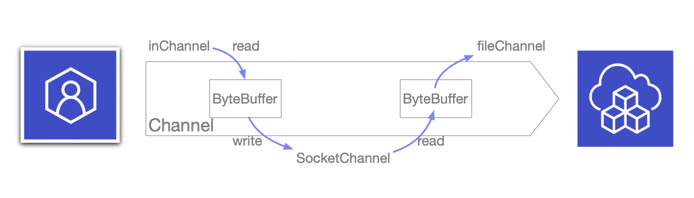

[NIO是什么](http://www.moguit.cn/#/info?blogUid=f06ce24299bfcf17ce889182ea85875f)   [IO到NIO的演变](http://www.moguit.cn/#/info?blogUid=3f6a94823d2c586f7d5b1756312164f2)  [NIO与IO的区别](http://www.moguit.cn/#/info?blogUid=28d61ec002594fc5a9c441ec8560f3ad)

[尚硅谷视频](https://www.bilibili.com/video/BV14W411u7ro?from=search&seid=12598989081545424869)


## 概念

Java NIO（New IO），No Blocking IO 非阻塞IO，是从 Java1.4 版本开始引入的一个新的IO API，可以替代标准的 Java IO API。NIO 与原来的 IO 有同样的作用和目的，但是使用的方式完全不同，NIO支持面向缓冲区的，基于通道的IO操作。NIO将以更加高效的方式进行文件读写操作。


## IO 和 NIO 的区别

|                              IO                              |                   NIO                    |
| :----------------------------------------------------------: | :--------------------------------------: |
|                 面向`流`（Stream Oriented）                  |     面向`缓冲区`（Buffer Oriented）      |
|                   `阻塞`IO（Blocking IO）                    |      `非阻塞`IO（Non Blocking IO）       |
|                              无                              |          `选择器`（Selectors）           |
|      `输入流`（InputStream）和 `输出流`（OutputStream）      |  `通道`（Channel）和`缓冲区`（Buffer）   |
| `单向`的（即需要建立输入流和输出流两个管道，数据的流动只能是单向的） | `双向`的（里面的缓冲区是可以双向传输的） |

> 面向流与面向缓冲区

面向流意味着每次从流中读一个或多个字节，直至读取所有字节，它们没有被缓存在任何地方。此外，它不能前后移动流中的数据。如果需要前后移动从流中读取的数据，需要先将它缓存到一个缓冲区。

面向缓冲区的方法，数据读取到一个它稍后处理的缓冲区，需要时可在缓冲区中前后移动。这就增加了处理过程中的灵活性。但是，还需要检查是否该缓冲区中包含所有您需要处理的数据。而且，需确保当更多的数据读入缓冲区时，不要覆盖缓冲区里尚未处理的数据。


## 通道 / 缓冲区

> **Java NIO 系统的核心在于：通道（Channel）和缓冲区（Buffer）**

**通道**表示打开到IO设备（例如：文件、套接字）的连接。若需要使用NIO系统，需要获取用于连接IO设备的通道以及用于容纳数据的缓冲区。然后操作缓冲区，对数据进行处理。

+ 通道可以理解为我们生活中的铁路，它是用于源地址和目的地址的连接，如果需要实际传输的话，那么需要依赖里面的缓冲区。

- 通道负责连接和传输，缓冲区负责存储。

**缓冲区**负责数据的存取。缓冲区就是`数组`，根据数据类型的不同（boolean除外），提供相应类型的缓冲区。对于Java中的基本类型，基本都有一个具体Buffer类型与之相对应：

+ `Byte`Buffer：字节缓冲区（最常用）
+ `Char`Buffer
+ `Int`Buffer
+ `Short`Buffer
+ `Long`Buffer
+ `Float`Buffer
+ `Double`Buffer

上述缓冲区皆继承自Buffer。

> **缓冲区中的方法**

上述缓冲区的管理方式几乎一致，通过 `allocate()` 获取缓冲区。

```java
ByteBuffer byt = ByteBuffer.allocate(1024);
```

为什么没用`new`关键字，看一下 `allocate()` 的源码：

```java
public static ByteBuffer allocate(int capacity) {
    if (capacity < 0) throw new IllegalArgumentException();
    return new HeapByteBuffer(capacity, capacity);
}
```

可见，是通过调用 `HeapByteBuffer`类（该类继承自`ByteBuffer`）的构造器来实现的，而该类的构造器内部又是通过调用其父类（`ByteBuffer`）的构造器来实现的。

**缓冲区存取数据的两个核心方法：**

+ **put()**：存入数据到缓冲区中

```java
public final ByteBuffer put(byte[] src) {
 	 return put(src, 0, src.length);
}
```

+ **get()**：获取缓冲区中的数据

```java
public ByteBuffer get(byte[] dst) {
  	return get(dst, 0, dst.length);
}
```

> **缓冲区中的四个核心属性：**

`Buffer` 的几个字段必须要掌握：

```java
public abstract class Buffer {
    // Invariants: mark <= position <= limit <= capacity
    private int position = 0;
    private int limit;
    private int capacity;
  	private int mark = -1;
...
}
```

+ **capacity**：容量，表示缓冲区中最大存储数据的容量，一旦声明不可改变。
+ **limit**：界限，表示缓冲区中可以操作的数据大小。
	+ limit 后面的数据不能进行读写
	+ 写模式的时候limit可以和capacity相同
	+ 但是读模式的limit一般是位于当前空数据的头部，limit前面是已经写进的数据，后面是剩余的空间
+ **position**：位置，表示缓冲区中正在操作的位置
+ **mark**：标记，表示记录当前 position 的位置，可以通过reset() 恢复到 mark的位置

最后它们之间的关系是：0 <= mark <= position <= limit <= capacity

但是我们无法直接访问字段，只能通过 Buffer 类的`capacity()`、`limit()`、 `position()`等方法返回字段属性。

> **相关操作**

写操作：

```java
String name = "hory";
ByteBuffer buf = ByteBuffer.allocate(1024);
buf.put(name.getBytes());  
```

+ getBytes() 返回的是一个字节数组，将字节数组中的数据存入到缓冲区中

读操作：

```java
buf.flip();  // 读数据之前，需要使用flip()切换到读数据模式
byte[] dst = new byte[buf.limit()];
buf.get(dst); // 取出数据放在字节数组 dst 中
String result = new String(dst,0,dst.length);
```

读操作之后，position 将指向 buf 中数据的末尾，如果我们想重复读，可以用 `rewind()` 将 position 重置为开头位置：

```java
buf.rewind();  //可重复读
```

清空缓冲区，但是缓冲区中的数据依然存在，只是处于“被遗忘”状态

```java
buf.clear();
```


```java
public final Buffer clear() {
    position = 0;
    limit = capacity;
    mark = -1;
    return this;
}
```

**mark() 的用法**：

上述的`get()`也可用这么用：

```java
buf.get(dst,0,3); //表示从0位置开始往后读取三个位置的数据，那么position最终也会指向读取后的位置，即 0+3
buf.mark();  //标记当前的位置
buf.get(dst,3,2);   //然后从上次标记的位置开始继续往后读取两个

buf.reset();  //回到刚才标记的position的位置
```


## 直接缓冲区 / 非直接缓冲区

>**非直接缓冲区（传统IO）**：

通过`allocate()`方法分配缓冲区，将缓冲区建立在`JVM`中。


> **直接缓冲区**：

通过`allocateDirect()`方法分配直接缓冲区，将缓冲区建立在`物理内存`中，可以提高效率。


写入物理内存中的数据，已经不归JVM来管辖了，因此JVM不会自动收集物理内存中的数据。

字节缓冲区要么直接的，要么非直接的，如果为字节缓冲区，则Java虚拟机会尽最大努力直接在此缓冲区上执行本机I/O操作。也就是说，在每次调用基础操作系统的一个本机I/O操作之前，虚拟机都会尽量避免将缓冲区的内容复制到中间缓冲区（或从中间缓冲区中复制内容）。

```java
ByteBuffer buf = ByteBuffer.allocateDirect(1024);
```

通过源码可以看到，`allocate()`的底层是通过数组来实现的，而 `allocateDirect()` 底层是直接调用`本地方法`的（不是Java实现的了）。

通过下面判断是直接缓冲区还是非直接缓冲区：

```java
boolean b = buf.isDirect();
```


## 通道Channle

由`java.nio.channels`包定义的。Channel 表示IO源与目标打开的连接。Channel类似于传统的流，只不过Channel本身不能直接访问数据，Channel只能与Buffer进行交互。

> **通道的由来**

刚开始的时候，CPU是直接提供IO接口来进行处理应用程序的IO请求的，但是因为IO请求会占用CPU的时间。

后来在内存中，又提供了一条DMA（直接内存存取）线路，直接和IO接口进行交互，但是DMA在进行操作时候，需要首先向CPU申请权限，获得权限后即可进行IO操作，CPU就可以进行其他的操作了。

但是当应用程序发送大量的IO请求时，内存会向CPU申请多条DMA总线，当DMA连线多时候，又会出现其它的问题，因此后面提出了Channel 通道的方式。Channel 是一个完全独立的处理器，专门用于处理IO操作，这样可以省去向CPU请求的时间。

其实：通道和原来的流也没有本质的区别，只是原来的DMA改成了通道。

通道（Channel），用于源节点与目标节点的连接，在Java NIO中负责缓冲区中的数据传输。Channel本身不存储数据，因此需要配合缓冲区进行传输。

> **通道的主要实现类**

`java.nio.channels.Channels`下：

+ `File`Channel：文件通道
+ `Socket`Channel：套接字通道
+ `ServerSocket`Channel：套接字通道
+ `Datagram`Channel：用于网络

> **获取通道的三种方式**

1. Java 针对支持通道的类，提供了一个`getChannel()`方法

本地 IO

+ FileInputStream
+ FileOutputStream
+ RandomAccessFile

网络 IO

+ Socket
+ ServerSocket
+ DatagramSocket

2. 在JDK 1.7 中NIO.2 针对各通道提供了静态方法：` open()`

3. 在JDK 1.7 中NIO.2 的Files工具类提供了一个静态方法：`newByteChannel()`

> **利用非直接缓冲区完成文件的复制**

将本地图片1.png复制到项目中

```java
public class FileCopyDemo {
    public static void main(String[] args) {

        FileInputStream fis = null;
        FileOutputStream fos = null;
        FileChannel inChannel = null;
        FileChannel outChannel = null;
        try {
            fis = new FileInputStream("/Users/superfarr/Desktop/1.png");
            fos = new FileOutputStream("2.jpg");

            // 获取通道
            inChannel = fis.getChannel();  
            outChannel = fos.getChannel();

            // 分配一个指定大小的缓冲区
            ByteBuffer buf = ByteBuffer.allocate(1024);

            // 利用while循环一边读一边写
            while (inChannel.read(buf) != -1) { // 将通道中的数据，读到缓冲区
                buf.flip();   // 切换成读取数据的模式                
                outChannel.write(buf); // 将缓冲区中的数据写入通道
                buf.clear();  // 清空缓冲区
            }
        } catch (Exception e) {
            e.printStackTrace();
        } finally {
            try {
                // 关闭流
                if(fis != null) {
                    fis.close();
                }
                if(fos != null) {
                    fos.close();
                }
                // 关闭通道
                if(outChannel != null) {
                    outChannel.close();
                }
                if(inChannel != null) {
                    inChannel.close();
                }
            } catch (Exception e) {
                e.printStackTrace();
            } finally {
              
            }
        }
    }
}
```

`inChannel.read(buf)`：表示将通道中的数据读入到缓冲区

`outChannel.write(buf)` ：表示将缓冲区中的数据写出到通道

如下图：


> **利用直接缓冲区完成文件的复制**

使用内存映射文件的方式

```java
public class FileCopyByDirectDemo {
    public static void main(String[] args) throws IOException {

        // 获取通道
        FileChannel inChannel = FileChannel.open(Paths.get("1.jpg"), StandardOpenOption.READ);
        FileChannel outChannel = FileChannel.open(Paths.get("2.jpg"), StandardOpenOption.WRITE, StandardOpenOption.READ, StandardOpenOption.CREATE_NEW);

        // 得到的一个内存映射文件
        // 这个的好处是，直接将文件存储在物理内存中了
        MappedByteBuffer inMappedBuf = inChannel.map(FileChannel.MapMode.READ_ONLY, 0, inChannel.size());
        MappedByteBuffer outMappedBuf = outChannel.map(FileChannel.MapMode.READ_WRITE, 0, inChannel.size());

        // 直接对缓冲区进行数据的读写操作
        byte[] dst = new byte[inMappedBuf.limit()];
        inMappedBuf.get(dst);
        outMappedBuf.put(dst);

        inChannel.close();
        outChannel.close();
    }
}
```

> **通道之间的数据传输**

利用通道直接进行数据传输

```java
public class FileCopyByChannelDemo {
    public static void main(String[] args) throws IOException {

        // 获取通道
        FileChannel inChannel = FileChannel.open(Paths.get("1.jpg"), StandardOpenOption.READ);
        FileChannel outChannel = FileChannel.open(Paths.get("2.jpg"), StandardOpenOption.WRITE, StandardOpenOption.READ, StandardOpenOption.CREATE_NEW);

        // 从inChannel通道到outChannel通道
        inChannel.transferTo(0, inChannel.size(), outChannel);

        inChannel.close();
        outChannel.close();
    }
}
```


## 分散Scatter / 聚集Gather

> **分散读取（Scatter）：将通道中的数据分散到多个缓冲区中**

注意：按照缓冲区的顺序，写入`position`和`limit`之间的数据到 Channel

下面我们定义了两个缓冲区，然后通过通道将我们的内容分别读取到两个缓冲区中，这就实现了分散读取

```java
private static void Scatteer() throws IOException {
    RandomAccessFile raf1 = new RandomAccessFile("1.txt", "rw");

    FileChannel channel = raf1.getChannel();

    ByteBuffer buf1 = ByteBuffer.allocate(10);
    ByteBuffer buf2 = ByteBuffer.allocate(1024);

    // 分散读取
    ByteBuffer[] bufs = {buf1, buf2};
    channel.read(bufs);

    for (ByteBuffer byteBuffer: bufs) {
      byteBuffer.flip();   // 切换成读模式
    }

    System.out.println(new String(bufs[0].array(), 0, bufs[0].limit()));
    System.out.println(new String(bufs[1].array(), 0, bufs[1].limit()));
}
```

> **聚集写入（Gather）：将多个缓冲区中的数据都聚集到通道中**

```java
private static void Gather() throws IOException {
    RandomAccessFile raf2 = new RandomAccessFile("2.txt", "rw");
    FileChannel channel2 = raf2.getChannel();

    // 分配指定大小的缓冲区
    ByteBuffer buf1 = ByteBuffer.allocate(10);
    ByteBuffer buf2 = ByteBuffer.allocate(1024);
    ByteBuffer[] bufs = {buf1, buf2};

    // 聚集写入
    channel2.write(bufs);
}
```


## 字符集

**编码**：字符串转换成字节数组

**解码**：字节数组转换成字符串

```java
/**
 * 通道字符集编码
 */
public class ChannelCharsetDemo {
    public static void main(String[] args) throws CharacterCodingException {

        Charset cs1 = Charset.forName("GBK");

        // 获取编码器
        CharsetEncoder ce = cs1.newEncoder();

        // 获取解码器
        CharsetDecoder cd = cs1.newDecoder();

        CharBuffer cBuf = CharBuffer.allocate(1024);
        cBuf.put("今天天气不错");
        cBuf.flip();

        // 编码 Char -> Byte
        ByteBuffer bBuf = ce.encode(cBuf);

        for(int i = 0; i < 12; i++) {
            System.out.println(bBuf.get());
        }

        // 解码 Byte -> Char
        bBuf.flip();
        CharBuffer cBuf2 = cd.decode(bBuf);
        System.out.println(cBuf2.toString());
    }
}
```


## NIO 的非阻塞式网络通信

### 传统IO的局限性

Server 包括内核地址空间和用户地址空间。

传统的阻塞式 IO 必须等待内容获取完毕后，才能够继续往下执行

什么是阻塞式呢？

+ 当 Client 发送一个读/写请求给 Server 以后，如果 Server 不能确定这个请求真实有效时，此时，该线程会一直处于阻塞状态。
+ Client发送一些数据，会先到达Server的内核地址空间中，如果内核地址空间没有数据，该线程就会一直等待，什么时候内核地址空间有数据了，就将数据copy到用户地址空间中，然后读到程序中。
+ 在阻塞的过程中，线程是不会做任何其他的事情的，会一直等待。
+ 这就导致，当Client 向Server发送大量的请求时，前面的完成不了，后面的也无法完成。就形成一个排队的现象。
+ 这就造成CPU的性能急剧下降

解决方法：多线程

+ 为每一个发送过来的请求独立创建一个线程，就可以尽可能地利用CPU
+ 但是当多个线程发生阻塞时，仍然无法保证较好的利用率


### NIO非阻塞

在NIO中，引入了选择器的概念，它会把每个通道都注册到选择器中，选择器的作用就是监控通道上的IO状态，当某个通道上，某个IO请求已经准备就绪时，那么选择器才会将该客户端的通道分配到服务端的一个或多个线程上。

Selector是NIO中实现I/O多路复用的关键类。Selector实现了通过一个线程管理多个Channel，从而管理多个网络连接的目的。 

Channel代表着一个网络连接通道，我们可以将Channel注册到Selector中以实现Selector对其的管理。

一个Channel 可以注册到多个不同的Selector中。 当Channel注册到Selector后会返回一个`SelectionKey`对象，该SelectionKey对象则代表着这个Channel和它注册的Selector间的关系。并且SelectionKey中维护着两个很重要的属性：`interestOps`、`readyOps`

+ interestOps是我们希望Selector监听Channel的哪些事件。我们将我们感兴趣的事件设置到该字段，这样在selection操作时，当发现该Channel有我们所感兴趣的事件发生时，就会将我们感兴趣的事件再设置到readyOps中，这样我们就能得知是哪些事件发生了以做相应处理。

> 使用NIO完成网络通信的三个核心：

**通道**：负责连接。  位于` java.nio.channels.Channel`包下

+ SelectableChannel
+ SocketChannel
  + ServerSocketChannel：TCP
  + DatagramChannel：UDP
+ Pipe.SinkChannel
	+ Pipe.SourceChannel

**缓冲区**：负责数据存取。

**选择器**：是SelectableChannel的多路复用器，用于监控SelectableChannel的IO状况。


### 使用阻塞式IO完成网络通信

我们首先需要创建一个服务端，用于接收客户端请求

**服务端**

```java
public static void server() throws IOException {
    // 获取通道
    ServerSocketChannel ssChannel = ServerSocketChannel.open();
    FileChannel fileChannel = FileChannel.open(Paths.get("D:\\2.jpg"), StandardOpenOption.WRITE, StandardOpenOption.CREATE);

    // 绑定端口号
    ssChannel.bind(new InetSocketAddress(9898));

    // 获取客户端连接的通道
    SocketChannel socketChannel = ssChannel.accept();

    // 分配指定大小的缓冲区
    ByteBuffer buf = ByteBuffer.allocate(1024);

    // 读取客户端的数据，并保存到本地
    while(socketChannel.read(buf) != -1) {  //将客户端（套接字管道）数据读到缓冲区
      // 切换成读模式
      buf.flip();

      // 将缓冲区数据写到文件管道
      fileChannel.write(buf);  

      // 清空缓冲区
      buf.clear();
    }

    // 关闭通道
    ssChannel.close();
    socketChannel.close();
    fileChannel.close();
}
```

然后在创建客户端，发送文件

**客户端**

```java
public static void client() throws IOException {
    // 获取通道
    SocketChannel sChannel = SocketChannel.open(new InetSocketAddress("127.0.0.1", 9898));

    FileChannel inChannel = FileChannel.open(Paths.get("D:\\1.jpg"), StandardOpenOption.READ);
    // 分配指定大小的缓冲区
    ByteBuffer buf = ByteBuffer.allocate(1024);

    // 读取本地文件，并发送到服务端
    while (inChannel.read(buf) != -1) {
      // 切换到读数据模式
      buf.flip();

      // 将缓冲区的数据写入socket管道
      sChannel.write(buf);

      // 清空缓冲区
      buf.clear();
    }

    //关闭通道
    inChannel.close();
    sChannel.close();
}
```

测试：

```java
public static void main(String[] args) {
    new Thread(() -> {
        try {
          	server();
        } catch (IOException e) {
         	 e.printStackTrace();
        }
    }, "t1").start();

    try {
      	TimeUnit.SECONDS.sleep(5);
    } catch (InterruptedException e) {
      	e.printStackTrace();
    }

    new Thread(() -> {
        try {
          	client();
        } catch (IOException e) {
         	 e.printStackTrace();
        }
    }, "t2").start();
}
```

如图：




### 使用非阻塞式IO完成网络通信

> 主要看服务器端

客户端：

```java
/**
 * 客户端
*/
public static void client() throws IOException {

    // 获取通道
    SocketChannel sChannel = SocketChannel.open(new InetSocketAddress("127.0.0.1", 9898));

    // 切换成非阻塞模式
    sChannel.configureBlocking(false);

    // 分配指定大小的缓冲区
    ByteBuffer buf = ByteBuffer.allocate(1024);

    // 将数据（date）放进缓冲区
    buf.put(new Date().toString().getBytes());

    // 切换成写模式
    buf.flip();

    // 将缓冲区中的数据写入通道
    sChannel.write(buf);

    // 关闭通道
    sChannel.close();
}
```

服务端：

```java
public static void server() throws IOException {

    // 获取通道
    ServerSocketChannel ssChannel = ServerSocketChannel.open();

    // 切换成非阻塞模式
    ssChannel.configureBlocking(false);

    // 绑定连接
    ssChannel.bind(new InetSocketAddress(9898));

    // 获取选择器
    Selector selector = Selector.open();

    // 将通道注册到选择器上，第二个参数代表选择器监控通道的什么状态
    // 用选择器监听接收状态，也就是说客户端什么时候发送了，我这边才开始获取连接
    ssChannel.register(selector, SelectionKey.OP_ACCEPT);

    // 轮询式的获取选择器上已经准备就绪的事件
    while(selector.select() > 0) {

        // 获取当前选择器中所有注册的选择键（已就绪的监听事件）
        Iterator<SelectionKey> it = selector.selectedKeys().iterator();

        while(it.hasNext()) {
            // 获取准备就绪的事件
            SelectionKey sk = it.next();

            // 判断是具体什么事件准备就绪

            // 接收事件就绪
            if(sk.isAcceptable()) {
                // 若 接收就绪，获取客户端连接
                SocketChannel sChannel = ssChannel.accept();

                // 切换非阻塞模式
                sChannel.configureBlocking(false);

                // 将该通道注册到选择器上，并监听读就绪状态
                sChannel.register(selector, SelectionKey.OP_READ);

            } else if(sk.isReadable()) {
                // 读就绪状态就绪

                // 获取当前选择器上 读就绪 状态的通道
                SocketChannel sChannel = (SocketChannel) sk.channel();

                // 读取数据
                ByteBuffer buf = ByteBuffer.allocate(1024);

                int len = 0;
                while((len = sChannel.read(buf)) > 0) {
                    // 切换成读取模式
                    buf.flip();
                    // 打印客户端的发送
                    System.out.println(Thread.currentThread().getName() + "\t  " + new String(buf.array(), 0, len));
                    // 清空缓存
                    buf.clear();
              }
          }
      }

      // 操作执行完成后，需要将 选择键给取消 SelectionKey
      it.remove();

    }
}
```

测试：

```java
public static void main(String[] args) {
  new Thread(() -> {
      try {
        	server();
      } catch (IOException e) {
        	e.printStackTrace();
      }
  }, "t1").start();

  // 十个客户端发送数据过去
  for (int i = 0; i < 10; i++) {
      new Thread(() -> {
          try {
              client();
              try {
                  TimeUnit.SECONDS.sleep(1);
              } catch (InterruptedException e) {
                  e.printStackTrace();
              }
          } catch (IOException e) {
              e.printStackTrace();
          }
      }, String.valueOf(i)).start();
 	 }
}
```


## 管道Pipe

Java NIO 管道是两个线程之间的单向数据连接。

Pipe 有一个`source`通道和一个`sink`通道，数据会被写入到`sink`通道，从`source`通道读取。


代码：

```java
/**
 * 管道
 */
public class PipeDemo {
    public static void main(String[] args) throws IOException {
        // 获取管道
        Pipe pipe = Pipe.open();

        // 将缓冲区的数据写入管道
        ByteBuffer buf = ByteBuffer.allocate(1024);

        // 发送数据（使用sink发送）
        Pipe.SinkChannel sinkChannel = pipe.sink();
        buf.put("通过单向管道发送数据".getBytes());

        buf.flip();
        sinkChannel.write(buf);

        // 读取缓冲区中的数据（使用source接收）
        Pipe.SourceChannel sourceChannel = pipe.source();
        buf.flip();
        int len = sourceChannel.read(buf);
        System.out.println(new String(buf.array(), 0, len));

        sourceChannel.close();
        sinkChannel.close();
    }
}
```


### 使用非阻塞IO制作聊天室

客户端：

```java
public class ChatClientDemo {
    
    public static void main(String[] args) throws IOException {
        client();
    }

    /**
     * 客户端
     */
    public static void client() throws IOException {

        // 获取通道
        SocketChannel sChannel = SocketChannel.open(new InetSocketAddress("127.0.0.1", 9898));

        // 切换成非阻塞模式
        sChannel.configureBlocking(false);

        // 分配指定大小的缓冲区
        ByteBuffer buf = ByteBuffer.allocate(1024);

        // 使用输入流
        Scanner sc = new Scanner(System.in);

        while(sc.hasNext()) {
            String str = sc.next();

            // 获取输入内容
            buf.put((new Date().toString() + "\n" +str).getBytes());
            // 切换成写模式
            buf.flip();
            // 将缓冲区中的内容写入通道
            sChannel.write(buf);
            // 清空缓冲区
            buf.clear();
        }

        // 关闭通道
        sChannel.close();
    }
}
```

服务端：

```java
public class ChatServerDemo {

    public static void main(String[] args) throws IOException {
        server();
    }

    /**
     * 服务端
     */
    public static void server() throws IOException {

        // 获取通道
        ServerSocketChannel ssChannel = ServerSocketChannel.open();

        // 切换成非阻塞模式
        ssChannel.configureBlocking(false);

        // 绑定连接
        ssChannel.bind(new InetSocketAddress(9898));

        // 获取选择器
        Selector selector = Selector.open();

        // 将通道注册到选择器上，第二个参数代表选择器监控通道的什么状态
        // 用选择器监听 接收状态，也就是说客户端什么时候发送了，我才会开始获取连接
        ssChannel.register(selector, SelectionKey.OP_ACCEPT);

        // 轮询式的获取选择器上已经准备就绪的事件
        while(selector.select() > 0) {

            // 获取当前选择器中 所有注册的选择键（已就绪的监听事件）
            Iterator<SelectionKey> it;
            it = selector.selectedKeys().iterator();

            while(it.hasNext()) {
                // 获取准备就绪的事件
                SelectionKey sk = it.next();

                // 判断是具体什么事件准备就绪

                // 接收事件就绪
                if(sk.isAcceptable()) {
                    // 若 接收就绪，获取客户端连接
                    SocketChannel sChannel = ssChannel.accept();

                    // 切换非阻塞模式
                    sChannel.configureBlocking(false);

                    // 将该通道注册到选择器上，并监听读就绪状态
                    sChannel.register(selector, SelectionKey.OP_READ);

                } else if(sk.isReadable()) {
                    // 读就绪状态就绪

                    // 获取当前选择器上 读就绪 状态的通道
                    SocketChannel sChannel = (SocketChannel) sk.channel();

                    // 读取数据
                    ByteBuffer buf = ByteBuffer.allocate(1024);

                    int len = 0;
                    while((len = sChannel.read(buf)) > 0) {
                        // 切换成读取模式
                        buf.flip();
                        // 打印客户端的发送
                        System.out.println(Thread.currentThread().getName() + "\t  " + new String(buf.array(), 0, len));
                        // 清空缓存
                        buf.clear();
                    }
                }
            }

            // 操作执行完成后，需要将 选择键给取消 SelectionKey
            it.remove();
        }
    }
}
```

演示：


