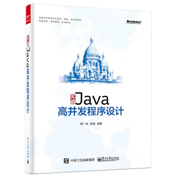
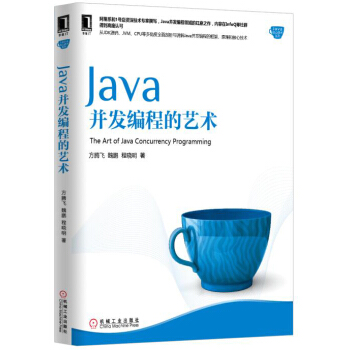
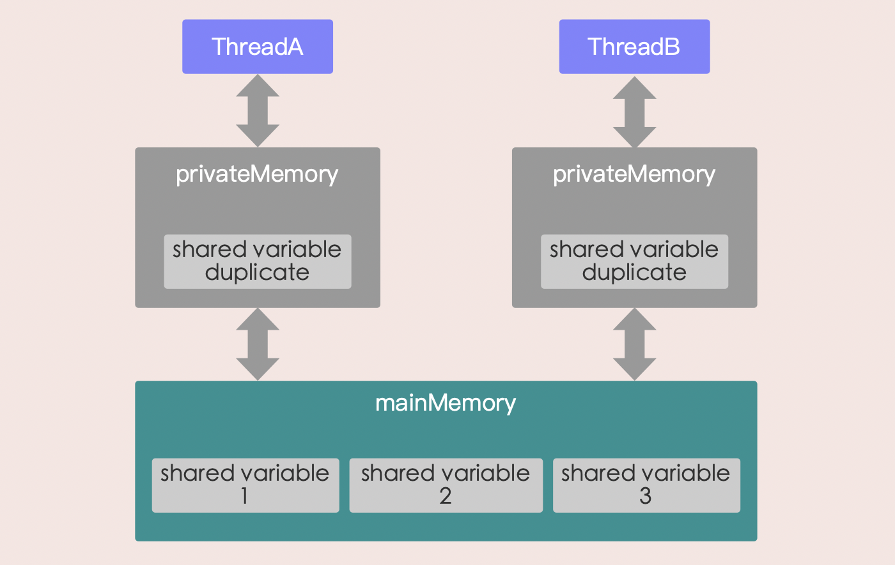
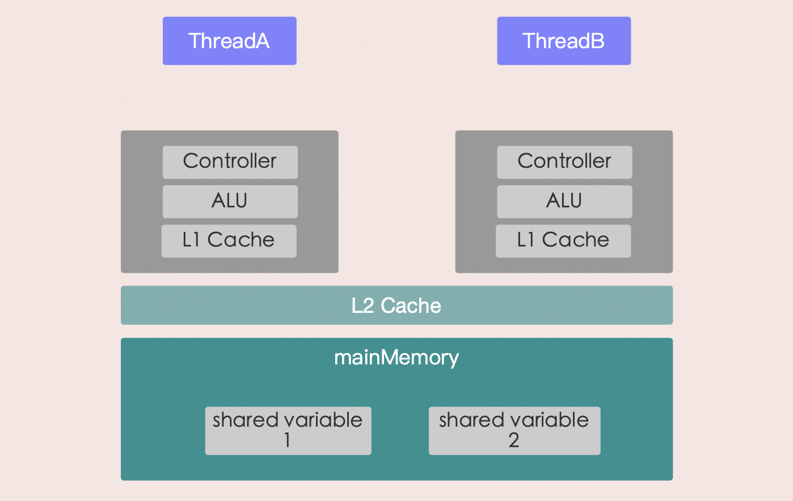
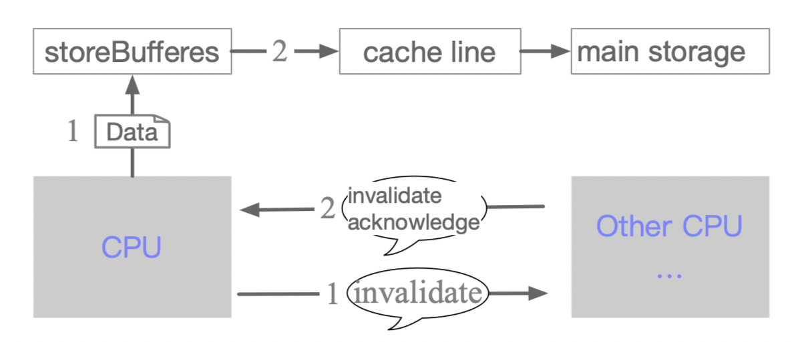

## 多线程学习指南

[如果把线程当作一个人来对待，所有问题都瞬间明白了——敖丙](https://mp.weixin.qq.com/s/PrUa0tFyu3UZllP2FRDyVA)

leetcode 有一个练习多线程的类别： https://leetcode-cn.com/problemset/concurrency 

> 多线程基础

1. 什么是线程和进程？线程与进程的关系，区别及优缺点？
2. 说说并发与并行的区别？
3. 为什么要使用多线程呢？
4. 使用多线程可能带来什么问题？（内存泄漏，死锁，线程不安全等等）
5. （a。继承线程类； b。实现Runnable接口； c。创建线程有哪一种方式。使用Executor框架； d。使用FutureTask）
6. 说说螺纹的生命周期和状态？
7. 什么是某些切换？
8. 什么是螺纹死锁？如何避免死锁？
9. 说说sleep()方法和wait()方法区别和共同点？
10. 为什么我们调用start（）方法时会执行run（）方法，为什么我们不能直接调用run（）方法？

> 多线程进阶

**挥发性关键字**

1. Java内存模型（**JMM**）；
2. 重排序与发生-原则了解吗之前？
3. volatile关键字的作用;
4. 说说synced关键字和volatile关键字的区别;

**线程本地**

1. 有啥用（解决了什么问题）？怎么用？
2. 原理了解吗？
3. 内存不足问题了解吗？

**螺纹池**

1. 为什么要用螺纹池？
2. 你会使用螺纹池吗？
3. 如何创建线程池比较好？（推荐使用`ThreadPoolExecutor`构造函数创建线程池）
4. `ThreadPoolExecutor`类的重要参数`ThreadPoolExecutor`了解吗？
5. 线程池原理了解吗？
6. 几种常见的线程池了解吗？为什么不推荐使用`FixedThreadPool`？
7. 如何设置螺纹池的大小？

**质量管理体系**

1. 简介
2. 原理
3. AQS通用组件。
	- **Semaphore（信号量）** -支持多个线程同时访问
	- **CountDownLatch（**倒数计时器**）** -CountDownLatch允许count个线程中断在一个地方，直到所有线程的任务都执行完毕。
	- **CyclicBarrier（循环栅栏）** -CyclicBarrier和CountDownLatch非常类似，它也可以实现线程间的技术等待，但是它的功能比CountDownLatch更加复杂和强大。主要应用场景和CountDownLatch类似。
	- **ReentrantLock和ReentrantReadWriteLock**

**锁**

锁的常见分类：

1. 可重入锁和非可重重锁
2. 公平锁与非公平锁
3. 读写锁和排它锁

**同步关键字**

1. 说一说自己对于synced关键字的了解；
2. 说说自己是怎么使用synced关键字，在项目中用到了吗;
3. 讲一下synced关键字的暂时原理；
4. 说说JDK1.6之后的synced同步进行关键字优化和最佳化，可以详细介绍一下这些优化吗；
5. 谈谈sync和ReentrantLock的区别；
6. ReentrantLock 和 ReentrantReadWriteLock
7. 读锁
8. 印花锁（JDK8）

**原子与CAS**

CAS 介绍、原理

**原子原子类**

1. 介绍一下 Atomic 原子类；
2. JUC 包中的原子类是哪 4 类  ？
3. 讲讲 AtomicInteger 的使用；
4. 能不能给我简单介绍一下 AtomicInteger 类的原理。

**并发容器**

JDK提供的这些容器大部分在`java.util.concurrent`包中。

- ConcurrentHashMap：线程安全的HashMap
- CopyOnWriteArrayList：线程安全的List，在读多写少的场合性能非常好，远远好于Vector。
- ConcurrentLinkedQueue：高效的并发层次，使用链表实现。可以看做一个线程安全的LinkedList，这是一个非嵌段共聚物。
- BlockingQueue：这是一个接口，JDK内部通过链表，数组等方式实现了这个接口。表示分段，非常适合用作数据共享的通道。
- 这是一个Map，使用跳表的数据结构进行快速查找。ConcurrentSkipListMap **：**跳表的实现。

> 推荐书籍

[《 Java并发编程之美》](https://snailclimb.gitee.io/javaguide/#/./docs/java/Multithread/多线程学习指南?id=《java-并发编程之美》)

这本书还是非常适合用来学习 Java 多线程的。这本书的讲解非常通俗易懂，作者从并发编程基础到实战都是信手拈来。结合代码讲解，非常有说服力！


[《实战Java高并发程序设计》](https://snailclimb.gitee.io/javaguide/#/./docs/java/Multithread/多线程学习指南?id=《实战-java-高并发程序设计》)

这本书内容同样是理论结合实战，对于每个知识点的讲解也比较通俗易懂，整体结构也比较清晰。



[《深入浅出Java多线程》](https://snailclimb.gitee.io/javaguide/#/./docs/java/Multithread/多线程学习指南?id=《深入浅出-java-多线程》)

这本书是几位大厂（如阿里）的大佬开源的，Github地址：[https](https://github.com/RedSpider1/concurrent) : [//github.com/RedSpider1/concurrent](https://github.com/RedSpider1/concurrent)


[《 Java并发编程的艺术》](https://snailclimb.gitee.io/javaguide/#/./docs/java/Multithread/多线程学习指南?id=《java-并发编程的艺术》)

这本书不适合 Java 多线程入门，不需要把这本书的每一章节都看一遍，建议选择自己想要的详细了解的知识点来看。




## 程序计数器

> **程序计数器为什么是私有的？**

程序计数器主要有下面两个作用：

1. 字节码解释器通过改变程序计数器来依次读取指令，从而实现代码的流程控制，如：顺序执行、选择、循环、异常处理。
2. 在多线程的情况下，程序计数器用于记录当前线程执行的位置，从而当线程被切换回来的时候能够知道该线程上次运行到哪。

需要注意的是，如果执行的是 native 方法，那么程序计数器记录的是 undefined 地址，只有执行的是 Java 代码时程序计数器记录的才是下一条指令的地址。

所以，程序计数器私有主要是为了线程切换后能恢复到正确的执行位置。


## 并行&并发

[并行与并发](https://www.jianshu.com/p/cbf9588b2afb)

|                           并行                           |                 并发                 |
| :------------------------------------------------------: | :----------------------------------: |
|            指两个或者多个事件在`同一时刻`发生            | 指两个或多个事件在同一`时间间隔`发生 |
|                是在`不同实体`上的多个事件                |      是在`同一实体`上的多个事件      |
| 是在`多台处理器`上同时处理多个任务，如 Hadoop 分布式集群 | 是在`一台处理器`上“同时”处理多个任务 |

所以并发编程的目标是充分的利用处理器的每一个核，以达到最高的处理性能。


## 上下文切换

> 什么是上下文切换？

相信大家在面试的时候，都经常会被问到这个问题 – `“多线程的速度一定比单线程快吗”`。这么问也就说明答案是否定的，而这道题的精髓就在于你能不能说出上下文切换这几个字。

那什么是上下文切换呢？

**定义一**：CPU 通过时间片分配算法来循环执行任务，当前任务执行一个时间片后切换到下一个任务。但是，在切换前会保存上一个任务的状态，以便下次切换回这个任务时，可以在这个任务上次保留的状态之后继续执行。所以`任务从保存到再加载的过程就是一次上下文切换`。

**定义二**：多线程环境中，当一个线程的状态由`Runnable`转换为`非Runnable（Blocked、Waiting、Timed_Waiting）`时，相应线程的上下文信息（包括 CPU 的`寄存器`和`程序计数器`在某一时间点的内容等）需要被保存，以便相应线程稍后再次进入 Runnable 状态时能够在之前的执行进度的基础上继续前进。而一个线程从非 Runnable 状态进入 Runnable 状态可能涉及恢复之前保存的上下文信息。`这个对线程的上下文进行保存和恢复的过程就被称为上下文切换`。


## 线程创建与运行

**Java中有三种线程创建方式，分别为**：

+ 继承`Thread`类并重写`run()`方法

+ 实现`Runnable`接口的`run()`方法
+ 使用`FutureTask`方式


>继承`Thread`类并重写`run()`方法

```java
/**
 * @Author Hory
 * @Date 2020/10/5
 */
public class ThreadTest {
    public static void main(String[] args) {
        MyThread thread = new MyThread();
        thread.start();
    }
    public static class MyThread extends Thread {
        @Override
        public void run(){
            System.out.println("I am a child Thread");
          	System.out.println(this);
        }
    }
}
```

运行结果：

```
I am a child Thread
Thread[Thread-0,5,main]
```

当创建完`thread`对象后该线程并没有被启动执行，直到调用了`start()`方法后才真正启动了线程。

其实调用`start()`方法后线程并没有马上执行而是处于`就绪状态`，这个就绪状态是指该线程已经获取了除CPU资源外的其他资源，等待获取CPU资源后才会真正处于运行状态。

一旦`run()`方法执行完毕，该线程就处于终止状态。

**使用继承方式的优点**：

使用继承方式的好处是，在`run()`方法内获取当前线程直接使用`this`就可以了，无须使用`Thread.currentThread()`方法

**使用继承方式的缺点**：

不好的地方是Java不支持多继承，如果继承了`Thread`类，那么就不能再继承其他类。

另外任务与代码没有分离，当多个线程执行一样的任务时需要多份任务代码，而`Runable`则没有这个限制。

下面看实现`Runnable`接口的`run()`方法方式。

>实现`Runnable`接口的`run()`方法

```java
/**
 * @Author Hory
 * @Date 2020/10/5
 */
public class RunnableTask implements Runnable {

    public static void main(String[] args) {
        RunnableTask task = new RunnableTask();
        new Thread(task).start();
        new Thread(task).start();
    }

    @Override
    public void run(){
        System.out.println("I am a child Thread");
        System.out.println(this);
    }
}
```

如上面代码所示，两个线程共用一个`task`代码逻辑，如果需要，可以给RunableTask添加参数进行任务区分。

另外，RunableTask可以继承其他类。

但是上面介绍的两种方式都有一个缺点，就是任务没有返回值。

下面看最后一种，即使用FutureTask的方式。

>使用`FutureTask`方式

```java
import java.util.concurrent.Callable;
import java.util.concurrent.ExecutionException;
import java.util.concurrent.FutureTask;

/**
 * @Author Hory
 * @Date 2020/10/5
 */
public class CallerTask implements Callable<String> {

    public static void main(String[] args) throws InterruptedException{
        // 创建异步任务
        FutureTask<String> futureTask = new FutureTask<>(new CallerTask());
        new Thread(futureTask).start();
        try{
            // 等待任务执行完毕，并返回结果
            String result = futureTask.get();
            System.out.println(result);
        }catch (ExecutionException e){
            e.printStackTrace();
        }
    }

    @Override
    public String call() throws Exception {
        return "hello";
    }
}
```

如上代码中的`CallerTask`类实现了`Callable`接口的`call()`方法。

在`main`函数内首先创建了一个`FutrueTask`对象（构造函数为`CallerTask`的实例），然后使用创建的`FutrueTask`对象作为任务创建了一个线程并且启动它，最后通过`futureTask.get()`等待任务执行完毕并返回结果。

> 总结

使用继承方式的好处是方便传参，我们可以在子类里面添加成员变量，通过`set`方法设置参数或者通过构造函数进行传递，而如果使用`Runnable`方式，则只能使用主线程里面被声明为`final`的变量。

不好的地方是Java不支持多继承，如果继承了`Thread`类，那么子类不能再继承其他类，而`Runable`则没有这个限制。

前两种方式都没办法拿到任务的返回结果，但是`Futuretask`方式可以。


## 线程通知与等待

Java中的Object类是所有类的父类，鉴于继承机制，Java把所有类都需要的方法放到了Object类里面，其中就包含本节要讲的通知与等待系列函数。

> **`wait()`函数**

当一个线程调用一个共享变量的`wait()`方法时，该调用线程会被阻塞挂起，直到发生下面几件事情之一才返回:

1. 其他线程调用了`该共享对象`的`notify()`或者`notifyAll()`方法；
2. 其他线程调用了`该线程`的`interrupt()`方法，该线程抛出`InterruptedException`异常返回。

另外需要注意的是，如果调用`wait()`方法的线程没有事先获取该对象的监视器锁，则调用`wait()`方法时调用线程会抛出`IllegalMonitorStateException`异常。

那么一个线程如何才能获取一个共享变量的监视器锁呢？

1. 执行`synchronized`同步代码块时，使用该共享变量作为参数。

	```java
	synchronized(共享变量){
	  	// doSomething
	}
	```

2. 调用该共享变量的方法，并且该方法使用了`synchronized`修饰。

	```java
	synchronized void add(int a, int b){
	  	// doSomething
	}
	```

	

**虚假唤醒**

一个线程可以从`挂起`状态变为`可运行`状态（也就是被唤醒），即使该线程没有被其他线程调用notify()、notifyAll()方法进行通知，或者被中断，或者等待超时，这就是所谓的`虚假唤醒`。

虽然虚假唤醒在应用实践中很少发生，但要防患于未然，做法就是不停地去测试该线程被唤醒的条件是否满足，不满足则继续等待，也就是说在一个循环中调用`wait()`方法进行防范。退出循环的条件是满足了唤醒该线程的条件。

```java
// obj为共享变量
synchronized(obj){
  	while(该线程被唤醒的条件不满足){
      	obj.wait();
    }
}
```

下面从一个简单的生产者和消费者例子来加深理解。如下面代码所示，其中`queue`为共享变量，生产者线程在调用`queue`的`wait()`方法前，使用`synchronized`关键字拿到了该共享变量`queue`的监视器锁，所以调用`wait()`方法才不会抛出`IllegalMonitorStateException`异常。

如果当前队列没有空闲容量则会调用`queued`的`wait()`方法挂起当前线程，这里使用循环就是为了避免上面说的`虚假唤醒`问题。假如当前线程被虚假唤醒了，但是队列还是没有空余容量，那么当前线程还是会调用`wait()`方法把自己挂起。

```java
synchronized(queue){
  	while(queue.size() == MAX_SIZE){ // 这个就是唤醒的条件，当满的时候就是不满足
      	try{
          	// 挂起当前线程，并释放通过同步块获取的queue上的锁，让消费者线程可以获取该锁，然后获取队列中的元素
          	queue.wait();
        }catch(Exception ex){
          	ex.printStackTrace();
        }
    }
  	// 空闲则生成元素，并通知消费者线程
  	queue.add(element);
  	queue.notifyAll();
}

synchronized(queue){
  	while(queue.size() == 0){
      	try{
          	// 挂起当前线程，并释放通过同步块获取的queue上的锁，让生产者线程可以获取该锁，将生产元素放入队列
          	queue.wait();
        }catch(Exception ex){
          	ex.printStackTrace();
        }
    }
  	// 消费元素，并通知唤醒生产者线程
  	queue.take();
    queue.notifyAll();
}
```

在如上代码中假如生产者线程A首先通过`synchronized`获取到了`queue`上的锁，那么后续所有企图生产元素的线程和消费线程将会在获取该监视器锁的地方被阻塞挂起。线程A获取锁后发现当前队列已满会调用`queue.wait()`方法阻塞自己，然后释放获取的`queue`上的锁。

这里考虑下为何要释放该锁？

如果不释放，由于其他生产者线程和所有消费者线程都已经被阻塞挂起，而线程A也被挂起，这就处于了`死锁状态`。这里线程A挂起自己后释放共享变量上的锁，就是为了打破死锁必要条件之一的`持有并等待原则`。线程A释放锁后，其他生产者线程和所有消费者线程中会有一个线程获取`queue`上的锁进而进入同步块，这就打破了死锁状态。

另外需要注意的是，当前线程调用共享变量的`wait()`方法后`只会释放当前共享变量上的锁`，如果当前线程还持有其他共享变量的锁，则这些锁是不会被释放的。下面来看一个例子：

```java
/**
 * @Author Hory
 * @Date 2020/10/6
 */
public class testResource {
    // 创建资源
    private static volatile Object resourceA = new Object();
    private static volatile Object resourceB = new Object();


    public static void main(String[] args) throws InterruptedException{
        // 创建线程
        Thread threadA = new Thread(new Runnable(){
            public void run(){
                try{
                    // 获取共享资源resourceA的监视器锁
                    synchronized(resourceA){
                        System.out.println("threadA get resourceA lock");

                        // 获取共享资源resourceB的监视器锁
                        synchronized(resourceB){
                            System.out.println("threadA get resourceB lock");
                            // 线程A阻塞，并释放获取到的resourceA的锁
                            System.out.println("threadA release resourceA lock");
                            resourceA.wait();
                        }
                    }
                }catch(InterruptedException e){
                    e.printStackTrace();
                }
            }
        });

        // 创建线程
        Thread threadB = new Thread(new Runnable(){
            public void run(){
                try{
                    // 休眠1s
                    Thread.sleep(1000);
                    // 获取共享资源resourceA的监视器锁
                    synchronized(resourceA){
                        System.out.println("threadB get resourceA lock");
                        System.out.println("threadB try get resourceA lock");

                        // 获取共享资源resourceB的监视器锁
                        synchronized(resourceB){
                            System.out.println("threadA get resourceB lock");
                            // 线程B阻塞，并释放获取到的resourceA的锁
                            System.out.println("threadB release resourceB lock");
                            resourceA.wait();
                        }
                    }
                }catch(InterruptedException e){
                    e.printStackTrace();
                }
            }
        });

        // 启动线程
        threadA.start();
        threadB.start();
        // 等待两个线程结束
        threadA.join();
        threadB.join();
        System.out.println("main over");
    }
}
```

运行结果：

```
threadA get resourceA lock
threadA get resourceB lock
threadA release resourceA lock
threadB get resourceA lock
threadB try get resourceA lock
```

如上代码中，在`main`函数里面启动了线程A和线程B，为了让线程A先获取到锁，这里让线程B先休眠了1s，线程A先后获取到共享变量resourceA和共享变量resourceB上的锁，然后调用了resourceA的`wait()`方法阻塞自己，阻塞自己后线程A释放掉获取的resourceA上的锁。

线程B休眠结束后会首先尝试获取resourceA上的锁，如果当时线程A还没有调用`wait()`方法释放该锁，那么线程B会被阻塞，当线程A释放了resourceA上的锁后，线程B就会获取到resourceA上的锁，然后尝试获取resourceB上的锁。由于线程A调用的是resourceA上的`wait()`方法，所以线程A挂起自己后并没有释放获取到的resourceB上的锁，所以线程B尝试获取resourceB上的锁时会被阻塞。

这就证明了当线程调用共享对象的`wait()`方法时，当前线程只会释放当前共享对象的锁，当前线程持有的其他共享对象的监视器锁并不会被释放。


## ThreadLocal

本篇为《Java并发编程 之美》的学习笔记。

>**ThreadLocal 简介**

多线程访问同一个共享变量时特别容易出现并发问题，特别是在多个线程需要对一个共享变量进行写入时。为了保证线程安全，一般使用者在访问共享变量时需要进行适当的同步。 

同步的措施一般是`加锁`，这就需要使用者对锁有一定的了解，这显然加重了使用者的负担。那么有没有一种方式可以做到，`当创建一个变量后，每个线程对其进行访问的时候访问的是自己线程的变量`呢？其实`ThreadLocal`就实现，虽然ThreadLocal并不是为了解决这个问题而出现的。

ThreadLocal是JDK包提供的，它提供了线程本地变量，也就是如果你创建了一个ThreadLocal变量，那么访问这个变量的每个线程都会有这个变量的一个本地副本。当多个线程操作这个变量时，实际操作的是自己本地内存里面的变量，从而避免了线程安全问题。创建一个ThreadLocal变量后，每个线程都会复制一个变量到自己的本地内存。

>**测试示例**

```java
/**
 * @Author Hory
 * @Date 2020/10/12
 */
public class ThreadLocalTest {

    public static void main(String[] args) {
        Thread threadA = new Thread(
                new Runnable(){
                    public void run(){
                        localVariable.set("threadA local variable");
                        print("threadA");
                        System.out.println("after threadA remove" + ":" + localVariable.get());
                    }
                }
        );

        Thread threadB = new Thread(
                new Runnable(){
                    public void run(){
                        localVariable.set("threadB local variable");
                        print("threadB");
                        System.out.println("after threadB remove" + ":" + localVariable.get());
                    }
                }
        );

        threadA.start();
        threadB.start();
    }

    // 创建ThreadLocal变量
    static ThreadLocal<String> localVariable = new ThreadLocal<>();

    static void print(String str){
        System.out.println(str + ":" + localVariable.get());
        localVariable.remove(); // ①
    }
}
```

运行结果为：

```
threadB:threadB local variable
threadA:threadA local variable
after threadB remove:null
after threadA remove:null
```

将代码①注释掉，运行结果为：

```java
threadB:threadB local variable
threadA:threadA local variable
after threadB remove:threadB local variable
after threadA remove:threadA local variable
```


> **ThreadLocal 实现原理**


```java
public class ThreadLocal<T> {
  
  	static class ThreadLocalMap {
      	
    }
  
}
```


```java
public class Thread implements Runnable {
  	ThreadLocal.ThreadLocalMap threadLocals = null;
  	ThreadLocal.ThreadLocalMap inheritableThreadLocals = null;
}
```


## 获取线程名称

```java
Thread.currentThread().getName()
```

判断当前线程是否存活 ( 准备开始运行也被认为是“存活”的 ) 

```java
isAlive()
```


## 多线程接口实现的好处

**为什么尽量使用接口实现？**

> 一般情况下，使用继承Thread类和实现Runnable接口没有太大的区别，当涉及到多继承，使用实现Runnable接口的方式是很有必要的。

如果想创建的线程类已经有一个父类了，就不能再 继承自Thread类，因为Java不支持多继承，

比如：

```java
public class BServer extends AServer,Thread{
    public void save(){
      	System.out.println("保存");
    }
}
```

不支持！！

应该改为：

```java
public class BServer extends AServer implements Runnable{
  
    public void save(){
      	System.out.println("保存");
    }

    @Override
    public void run(){
     	 save();
    }
}
```


**非线程安全问题** 主要指，多个线程对同一个对象中的同一个实例变量进行操作时会出现值被更改、值不同步的情况，进而影响程序执行流程。


## 数据私有实现方式

数据私有实现方式：

```java
public class MyThread extends Thread{
    private int amounnt =5;

      //用下面的方式给线程赋名
      public MyThread(String name){
        	super();
        	this.setName(name);//设置线程名称
      }
      @Override
      public void run(){
          super.run();
          while(amout>0){
            	count--;
            	System.out.println("由"+this.currentThread().getName()+"计算counnt="+count);
          }
      }
}
```


```java
public class ThreadMain {
    public static void main(String[] args) {
      MyThread a = new MyThread("A");
      MyThread b = new MyThread("B");
      MyThread c = new MyThread("C");
      //这里数据之所以是私有的，是因为a、b、c均是MyThread的对象，有各自独有的变量amount，调用的是各自地run()方法

      a.start();
      b.start();
      c.start();
    }
}
```


## 数据共享实现方式

数据共享实现方式：                                                                                                                                                                                                                                                                                                                                                                                                                                                                                                                                                                                                                                                                                                                                                                                                                                                                                                                                                                                        

```java
public class MyThread extends Thread{
    int count = 5;

    @Override
    //通过在run()方法前加入synchronized关键字，使多个线程在执行run()方法时，以排队的方式进行处理。
    synchronized public void run(){
      	super.run();
      	count--;
      	System.out.println("由"+this.currentThread().getName()+"计算counnt="+count);
    }
}
```


```java
public class ThreadMain {
    public static void main(String[] args) {
        MyThread mythread = new MyThread();

      	//Thread.java类也实现了Runnable接口，这意味着构造函数Threa不仅可以传入Runnable接口的对象，还可以传入一个Thread对象，这样完全可以将一个Thread子类对象（mythread）中的run()方法交由其他线程进行调用
        Thread a = new Thread(mythread,"A");
        Thread b = new Thread(mythread,"B");
        Thread c = new Thread(mythread,"C");
        Thread d = new Thread(mythread,"D");
        Thread e = new Thread(mythread,"E");
        //这里a、b、c、d、e调用的都是mythread对象的run()方法，所以变量amount共享

        a.start();
        b.start();
        c.start();
        d.start();
        e.start();
    }
}
```


## run() & start()

> 执行`run()`与`start()`方法的区别：

```java
public class MyThread extends Thread{
    public MyThread(){
      	System.out.println("MyThread构造方法："+ Thread.currentThread().getName());
    }

    @Override
    public void run(){
      	System.out.println("run方法："+ Thread.currentThread().getName());
    }
}
```

```java
public class ThreadMain {
    public static void main(String[] args) {
        MyThread mythread = new MyThread();

        //看一下执行run()和start()的区别
        mythread.run(); 
        //mythread.start();
    }
}
```

`run()`：立即执行`run()`方法，不启动新的线程，执行结果为：

```
MyThread构造方法：main
run方法：main
```

`start()`：执行`run()`方法时机不确定，启动新的线程，执行结果为：

```
MyThread构造方法：main
run方法：Thread-0
```

可见，MyThread.java 类的构造函数是被 `main` 线程调用的，而 `run()` 方法是被 `Thread-0`线程调用的，`run()`方法是自动调用的方法。


## sleep()

**sleep(long millis)**

如果调用sleep()方法所在的类是Thread，则执行下面代码效果是一样的

```java
Thread.sleep();
```

```java
this.sleep();
```


如果调用sleep()方法所在的类不是Thread，则必须使用代码：

```java
Thread.slaap();
```

在 main 中执行 Thread.sleep(1000) 方法会使 main 主线程停止 1s ，而不是将 mythread 线程停止 1s


**sleep(long millis, int nanos)**

在指定的毫秒数加指定的纳秒数内让当前正在执行的线程休眠（暂停执行），此操作受到系统计时器和调度程序的精度和准确性的影响。


## sleep(0)

[Thread.sleep(0) 有什么用？—Java基基](https://mp.weixin.qq.com/s/SN5GaALrg_3FiyP94CY0pQ)

> 操作系统前置知识

在讲两者的区别前，先回顾一下操作系统的知识。

操作系统中，CPU竞争有很多种策略：

+ Unix系统使用的是`时间片算法`
+ Windows 则属于`抢占式`的

在时间片算法中，所有的进程排成一个队列。操作系统按照他们的顺序，给每个进程分配一段时间，即该进程允许运行的时间。如果在时间片结束时进程还在运行，则CPU将被剥夺并分配给另一个进程。如果进程在时间片结束前阻塞或结束，则CPU当即进行切换。调度程序所要做的就是维护一张就绪进程列表，当进程用完它的时间片后，它被移到队列的末尾。

所谓抢占式操作系统，就是说如果一个进程得到了 CPU 时间，除非它自己放弃使用 CPU ，否则将完全霸占 CPU 。

在抢占式操作系统中，假设有若干进程，操作系统会根据它们的`优先级`、`饥饿时间`等算出一 个总的优先级来。操作系统就会把 CPU 交给总优先级最高的这个进程。当进程执行完毕或者自己主动挂起后，操作系统就会重新计算一 次所有进程的总优先级，然后再挑一个优先级最高的把 CPU 控制权交给他。

如果是Unix操作系统，每个线程被分配固定的时间片。

如果是Windows 操作系统，由于是根据优先级来决定执行哪个线程，因此可能会出现这种情况，一个优先级高的线程正在执行，在某一时刻，该线程根据自己的“意愿”选择挂起，此时会重新计算优先级，而刚刚选择挂起的那个线程由于之前优先级太高，且刚才执行的时间很短，导致就算该线程主动挂起，再次参与CPU竞争的时候其优先级仍是最高的，那么该线程仍然会被入选，但是其优先级也可能不是最高的。

> `Thread.Sleep(0)`

那么，`Thread.Sleep` 函数是干吗的呢？

比如当一个线程执行`Thread.Sleep(10000)`时，该线程选择挂起10秒，那么操作系统在随后的1秒里重新计算所有线程总优先级的时候，就会忽略该线程。即告诉操作系统`“在未来的多少毫秒内我不参与CPU竞争”`。

**那么现在有两个问题**：

1. 假设现在的时间是12:00:00.000，如果调用 `Thread.Sleep(10000)` ，即让该线程挂起10秒，那么在12:00:10.000 的时候，这个线程会不会被唤醒？

	答案：不一定

	因为你只是告诉操作系统：在未来的10秒内我不参与CPU竞争。那么10秒过去之后，这时候也许另外一个线程正在使用CPU，那么这时候操作系统是不会重新分配CPU的，直到那个线程挂起或结束；况且，即使这个时候恰巧轮到操作系统进行CPU 分配，那么当前线程也不一定就是总优先级最高的那个，CPU还是可能被其他线程抢占。

	与此相似的，Thread有个`Resume`函数，是用来唤醒挂起的线程的。跟上面所说的一样，这个函数只是“告诉操作系统我从现在起开始参与CPU竞争了”，这个函数的调用并不能马上使得这个线程获得CPU控制权。

2. `Thread.Sleep(0)`调用与否的区别？

	答案：有，而且区别很明显。

	`Thread.Sleep(0)`的作用，就是`“触发操作系统立刻重新进行一次CPU竞争”`。竞争的结果也许是当前线程仍然获得CPU控制权，也许会换成别的线程获得CPU控制权。这也是我们在大循环里面经常会写一句`Thread.Sleep(0)`，因为这样就给了其他线程比如`Paint`线程获得CPU控制权的权力，这样界面就不会假死在那里。

	此外，虽然上面提到说“除非它自己放弃使用 CPU ，否则将完全霸占 CPU”，但这个行为仍然是受到制约的——操作系统会监控你霸占CPU的情况，如果发现某个线程长时间霸占CPU，会强制使这个线程挂起，因此在实际上不会出现“一个线程一直霸占着 CPU 不放”的情况。至于我们的大循环造成程序假死，并不是因为这个线程一直在霸占着CPU。实际上在这段时间操作系统已经进行过多次CPU竞争了，只不过其他线程在获得CPU控制权之后很短时间内马上就退出了，于是就又轮到了这个线程继续执行循环，于是就又用了很久才被操作系统强制挂起。因此反应到界面上，看起来就好像这个线程一直在霸占着CPU一样。


**此外**：

+ `sleep()`  运行态—>阻塞，是不释放锁的（锁就是资源，说某个线程持有某个锁也就是持有某个资源）
+ `yield()`  运行态—>就绪，释放锁


## sleep()

Thread 类中有一个静态的sleep方法，当一个执行中的线程调用了Thread的sleep方法后，调用sleep的线程会暂时让出指定时间的执行权，也就是在这期间不参与CPU的调度，但是该线程所拥有的监视器资源，比如`锁`还是持有不让出的。

指定的睡眠时间到了后该函数会正常返回，线程就处于`就绪状态`，然后参与CPU的调度，获取到CPU资源后就可以继续运行了。

如果在`睡眠期间`其他线程调用了该线程的`interrupt()`方法中断了该线程，则该线程会在调用sleep方法的地方抛出InterruptedException异常而返回。

**下面举一个例子来说明，线程在睡眠时拥有的监视器资源不会被释放：**

```java
/**
 * @Author Hory
 * @Date 2020/10/19
 */
public class SleepTest {

    private static final Lock lock = new ReentrantLock();

    public static void main(String[] args) throws InterruptedException {
        Thread threadA = new Thread(new Runnable(){
            public void run(){
                lock.lock(); // 获取独占锁
                try{
                    System.out.println("child threadA is in sleep");
                    Thread.sleep(2000);
                    System.out.println("child threadA is awaked");
                }catch (InterruptedException e) {
                    e.printStackTrace();
                }finally {
                    lock.unlock(); // 释放锁
                }
            }
        });

        Thread threadB = new Thread(new Runnable(){
            public void run(){
                lock.lock(); // 获取独占锁
                try{
                    System.out.println("child threadB is in sleep");
                    Thread.sleep(2000);
                    System.out.println("child threadB is awaked");
                }catch (InterruptedException e) {
                    e.printStackTrace();
                }finally {
                    lock.unlock(); // 释放锁
                }
            }
        });

        // 启动线程
        threadA.start();
        threadB.start();
    }
}
```

运行结果：

```java
child threadA is in sleep
child threadA is awaked
child threadB is in sleep
child threadB is awaked
```

如上代码首先创建了一个`独占锁`，然后创建了两个线程，每个线程在内部先获取锁，然后睡眠，睡眠结束后会释放锁。无论执行多少遍上面的代码都是线程A先输出或者线程B先输出，不会出现线程A和线程B交叉输出的情况。

从执行结果来看，这里线程A先获取了锁，那么线程A会先输出一行，然后调用sleep方法让自己睡眠2s，在线程A睡眠的这2s内那个独占锁lock还是线程A自己持有，线程B会一直阻塞直到线程A醒来后执行unlock释放锁。

**下面再来看一下，当一个线程处于睡眠状态时，如果另外一个线程中断了它，会不会在调用sleep方法处抛出异常：**

```java
/**
 * @Author Hory
 * @Date 2020/10/19
 */
public class SleepTest1 {
    public static void main(String[] args) throws InterruptedException {
        Thread thread = new Thread(new Runnable(){
            public void run(){
                try{
                    System.out.println("child thread is in sleep");
                    Thread.sleep(10000);
                    System.out.println("child thread is awaked");
                }catch (InterruptedException e) {
                    e.printStackTrace();
                }finally {

                }
            }
        });

        thread.start();
        Thread.sleep(2000); // 主线程睡眠2秒
        thread.interrupt(); // 在主线程内调用子线程的interrupt()终端子线程
    }
}
```

运行结果：

```java
child thread is in sleep
java.lang.InterruptedException: sleep interrupted
	at java.lang.Thread.sleep(Native Method)
	at testThread.SleepTest1$1.run(SleepTest1.java:13)
	at java.lang.Thread.run(Thread.java:748)
```

如上所示，主线程睡眠2秒，让子线程先运行，子线程在睡眠期间，主线程中断了它，所以子线程在调用sleep方法处抛出了`InterruptedException`异常。另外需要注意的是，如果在调用`Thread.sleep(long millis)`时为millis参数传递了一个负数，则会抛出`IllegalArgumentException`异常，如下所示：

```java
Exception in thread "main" java.lang.IllegalArgumentException: timeout value is negative
	at java.lang.Thread.sleep(Native Method)
	at testThread.SleepTest1.main(SleepTest1.java:24)
```

## wait()/ notify() / notifyAll()

> **`wait(long timeout)` / `notify()` / `notifyAll()`** 

网上好多解释不是不全面就是有偏差，还是直接看官方解释

**先来看一下源码：**

```java
public class Object {
  	public final native void notify();
  	public final native void notifyAll();
  	public final native void wait(long timeout) throws InterruptedException;
}
```

可见，三个方法皆是属于Object类的被`final`修饰的本地方法。

**API中对`wait(long timeout)`的解释：**

```
This method causes the current thread (call it <var>T</var>) to place itself in the wait set for this object and then to relinquish any and all synchronization claims on this object. Thread <var>T</var> becomes disabled for thread scheduling purposes and lies dormant until one of four things happens:
Some other thread invokes the {@code notify} method for this object and thread <var>T</var> happens to be arbitrarily chosen as the thread to be awakened.
Some other thread invokes the {@code notifyAll} method for this object.
Some other thread {@linkplain Thread#interrupt() interrupts} thread <var>T</var>.
The specified amount of real time has elapsed, more or less.  If {@code timeout} is zero, however, then real time is not taken into consideration and the thread simply waits until notified.
```

该方法导致当前线程(调用它<var>T</var>)将自己置于该对象的等待集中，然后放弃该对象上的任何和所有同步声明。为了线程调度的目的，线程<var>T</var>被禁用，处于休眠状态，直到发生以下四种情况之一：

+ 其他一些线程为该对象调用{@code notify}方法，而线程<var>T</var>碰巧被任意选择为要被唤醒的线程
+ 其他一些线程调用该对象的{@code notifyAll}方法
+ 其他线程{@linkplain thread #interrupt()中断}线程<var>T</var>
+ 指定的实时时间已经流逝，或多或少。但是，如果{@code timeout}为0，则不考虑实时，线程只是等待，直到收到通知。

**API中对`notify()`的解释：**

```
Wakes up a single thread that is waiting on this object's monitor. If any threads are waiting on this object, one of them is chosen to be awakened. The choice is arbitrary and occurs at the discretion of the implementation. A thread waits on an object's monitor by calling one of the {@code wait} methods.
The awakened thread will not be able to proceed until the current thread relinquishes the lock on this object. The awakened thread will compete in the usual manner with any other threads that might be actively competing to synchronize on this object; for example, the awakened thread enjoys no reliable privilege or disadvantage in being the next thread to lock this object.
```

唤醒在该对象监视器上等待的单个线程。如果有任何线程在等待该对象，则选择其中一个被唤醒。选择是任意的，由实现自行决定。线程通过调用一个{@code wait}方法来等待对象的监视器。

被唤醒的线程将无法继续执行，直到当前线程放弃该对象上的锁。被唤醒的线程将以通常的方式与其他可能在此对象上积极竞争同步的线程竞争;例如，被唤醒的线程在成为下一个锁定该对象的线程方面没有可靠的特权或缺点。

**API中对`notify()`的解释：**

```
Wakes up all threads that are waiting on this object's monitor. A thread waits on an object's monitor by calling one of the {@code wait} methods.
The awakened threads will not be able to proceed until the current thread relinquishes the lock on this object. The awakened threads will compete in the usual manner with any other threads that might be actively competing to synchronize on this object; for example, the awakened threads enjoy no reliable privilege or disadvantage in being the next thread to lock this object.
```

唤醒在该对象监视器上等待的所有线程。线程通过调用一个{@code wait}方法来等待对象的监视器。

被唤醒的线程将无法继续操作，直到当前线程放弃该对象上的锁。被唤醒的线程将以通常的方式与其他可能在此对象上积极竞争同步的线程竞争;例如，被唤醒的线程在成为下一个锁定该对象的线程时没有可靠的特权或缺点。


> **`wait(long timeout)` / `notify()` / `notifyAll()` 的使用**

`wait()`使当前线程阻塞，前提是必须先获得锁，一般配合 `synchronized` 关键字使用，即，一般在`synchronized` 同步代码块里使用 `wait()、notify/notifyAll()` 方法。

由于 wait()、notify/notifyAll() 在 synchronized 代码块执行，说明当前线程一定是获取了锁的

+ 当线程执行wait()方法时，会释放当前的锁，然后让出CPU，进入等待状态；
+ 只有当 notify/notifyAll() 被执行时候，才会唤醒一个或多个正处于等待状态的线程，然后继续往下执行，直到执行完synchronized 代码块的代码或是中途遇到wait() ，再次释放锁。

**下面举个在生产者和消费者场景中的例子：**

```java
import java.util.LinkedList;
import java.util.Queue;

/**
 * @Author Hory
 * @Date 2020/10/19
 */
public class WaitTest {

    private static int maxsize = 2;
    private static Queue<Integer> queue = new LinkedList<>();

    public static void main(String[] args) {
        Thread producer = new Thread(new Runnable(){
            public void run(){
                while(true){
                    synchronized (queue) {
                        try {
                            Thread.sleep(2000);
                        } catch (InterruptedException e) {
                            e.printStackTrace();
                        }

//                        System.out.println("producer " + this + ": get queue lock");
                        System.out.println("producer: get queue lock");

                        // 条件的判断一定要使用while而不是if
                        while(queue.size() == maxsize){
//                            System.out.println("queue is full, producer " + this + "wait");
                            System.out.println("queue is full, producer wait");
                            try {
                                queue.wait();
                            } catch (InterruptedException e) {
                                e.printStackTrace();
                            }
                        }
                        int num = (int) (Math.random()*100);
                        queue.offer(num);
//                        System.out.println("producer" + this + ": produce a element:" + num);
                        System.out.println("producer: produce a element:" + num);
                        queue.notifyAll();
//                        System.out.println("producer" + this + ": exit a production process");
                        System.out.println("producer: exit a production process");
                    }
                }
            }
        });

        Thread consumer1 = new Thread(new Runnable(){
            public void run(){
                while(true){
                    synchronized (queue) {
                        try {
                            Thread.sleep(2000);
                        } catch (InterruptedException e) {
                            e.printStackTrace();
                        }

//                        System.out.println("consumer1 " + this + ": get queue lock");
                        System.out.println("consumer1: get queue lock");

                        // 条件的判断一定要使用while而不是if
                        while(queue.isEmpty()){
//                            System.out.println("queue is empty, consumer1 " + this + "wait");
                            System.out.println("queue is empty, consumer1 wait");
                            try {
                                queue.wait();
                            } catch (InterruptedException e) {
                                e.printStackTrace();
                            }
                        }
                        int num = queue.poll();
//                        System.out.println("consumer1" + this + ": consumer a element:" + num);
                        System.out.println("consumer1: consumer a element:" + num);
                        queue.notifyAll();
//                        System.out.println("consumer1" + this + ": exit a consumption process");
                        System.out.println("consumer1: exit a consumption process");
                    }
                }
            }
        });

        Thread consumer2 = new Thread(new Runnable(){
            public void run(){
                while(true){
                    synchronized (queue) {
                        try {
                            Thread.sleep(2000);
                        } catch (InterruptedException e) {
                            e.printStackTrace();
                        }

//                        System.out.println("consumer2 " + this + ": get queue lock");
                        System.out.println("consumer2: get queue lock");


                        while(queue.isEmpty()){
//                            System.out.println("queue is empty, consumer2 " + this + "wait");
                            System.out.println("queue is empty, consumer2 wait");
                            try {
                                queue.wait();
                            } catch (InterruptedException e) {
                                e.printStackTrace();
                            }
                        }
                        int num = queue.poll();
//                        System.out.println("consumer2" + this + ": consumer a element:" + num);
                        System.out.println("consumer2: consumer a element:" + num);
                        queue.notifyAll();
//                        System.out.println("consumer2" + this + ": exit a consumption process");
                        System.out.println("consumer2: exit a consumption process");
                    }
                }
            }
        });

        producer.start();
        consumer1.start();
        consumer2.start();
    }
}
```

运行如下：

```
producer: get queue lock
producer: produce a element:40
producer: exit a production process

producer: get queue lock
producer: produce a element:84
producer: exit a production process

producer: get queue lock  
queue is full, producer wait  

consumer2: get queue lock
consumer2: consumer a element:40
consumer2: exit a consumption process

consumer2: get queue lock
consumer2: consumer a element:84
consumer2: exit a consumption process

consumer2: get queue lock
queue is empty, consumer2 wait

consumer1: get queue lock
queue is empty, consumer1 wait

producer: produce a element:66
producer: exit a production process
```

如上，创建了一个生产者线程`producer`和两个消费者线程`consumer1、consumer2`，生产者负责向队列中offer元素，消费者负责poll元素，当生产者获得锁后，会先进行判断，如果queue满了，则执行wait()后进入阻塞队列并让出锁，如果queue没满，则不会进入while循环，也就不会执行while中的wait()（没有执行wait()就不会让出锁），则会一直向queue中offer元素，且每次添加之后都会调用`queue.notifyAll();`来唤醒所有等待的线程，重新参与锁的竞争。

消费者的运行过程同上。


## sleep() & wait()

> `sleep()`和`wait()`的区别？

如下：

|                 `sleep()`                 |                    `wait()`                    |
| :---------------------------------------: | :--------------------------------------------: |
|              Thread 类的方法              |                Object 类的方法                 |
|      调用`sleep()`的线程是不释放锁的      | 调用`wait()`的线程会释放锁，且加入到等待队列中 |
| `sleep()`方法不依赖于同步器 synchronized  |      `wait()`需要依赖 synchronized 关键字      |
| `sleep()`不需要被唤醒（休眠之后退出阻塞） |    `wait()`需要（不指定时间需要被别人中断）    |


## 停止线程

**停止线程**

```java
Thread.innterrupt()
```

但这个方法不会终止一个正在运行到线程，还需加入一个判断才可以完成线程的终止。


## 死锁

[原文](https://blog.csdn.net/wljliujuan/article/details/79614019)

[死锁面试题（什么是死锁，产生死锁的原因及必要条件）](https://blog.csdn.net/hd12370/article/details/82814348)

>**什么是死锁**

死锁是指两个或两个以上的进程（线程）在运行过程中因`争夺资源`而造成的一种僵局（Deadly-Embrace），若无外力作用，这些进程（线程）都将无法向前推进。

>**死锁与饥饿**

饥饿（Starvation）指一个进程一直得不到资源。

死锁和饥饿都是由于进程竞争资源而引起的。

饥饿一般不占有资源，死锁进程一定占有资源。

>**资源的类型**

> 可重用资源和消耗性资源

**可重用资源（永久性资源）**：可被多个进程多次使用，如所有硬件

+ 只能分配给一个进程使用，不允许多个进程共享
+ 进程在对可重用资源的使用时，须按照**请求**资源、**使用**资源、**释放**资源这样的顺序
+ 系统中每一类可重用资源中的单元数目是相对固定的，进程在运行期间，既不能创建，也不能删除

**消耗性资源（临时性资源）**:由进程在运行期间动态地创建和消耗

+ 消耗性资源在进程运行期间是可以不断变化的，有时可能为0
+ 可消耗资源通常是由生产者进程创建，由消费者进程消耗。最典型的可消耗资源是用于进程间通信的消息

> 可抢占资源和不可抢占资源

**可抢占资源**

+ 某进程在获得这类资源后，该资源可以再被其他进程或系统抢占
+ 对于这类资源是不会引起死锁的
+ CPU 和主存均属于可抢占性资源

**不可抢占资源**

+ 一旦系统把某资源分配给该进程后，就不能将它强行收回，只能等进程用完后自行释放
+ 磁带机、打印机等属于不可抢占性资源

>死锁产生的原因

竞争`不可抢占资源`引起死锁

+ 如：共享文件时引起死锁
+ 系统中拥有两个进程P1和P2，它们都准备写两个文件F1和F2。而这两者都属于**可重用**且**不可抢占性**资源。如果进程P1在打开F1的同时，P2进程打开F2文件，当P1想打开F2时由于F2已经被占用而阻塞，当P2想打开F1时由于F1已结被占用而阻塞，此时就会无线等待下去，形成死锁。

竞争`可消耗资源`引起死锁

+ 如：进程通信时引起死锁
+ 系统中拥有三个进程P1、P2和P3，m1、m2、m3是消耗性资源。
+ 进程P1一方面产生消息m1，将其发送给P2，另一方面要从P3接收消息m3。而进程P2一方面产生消息m2，将其发送给P3，另一方面要从P1接收消息m1。类似的，进程P3一方面产生消息m3，将其发送给P1，另一方面要从P2接收消息m2。
+ 如果三个进程都先发送自己产生的消息后接收别人发来的消息，则可以顺利的运行下去不会产生死锁，但要是三个进程都先接收别人的消息而不产生消息则会永远等待下去，产生死锁。

进程`推进顺序不当`引起死锁

+ 例如，并发进程 P1、P2分别保持了资源R1、R2，而进程P1申请资源R2，进程P2申请资源R1时，两者都会因为所需资源被占用而阻塞。

>**产生死锁的四个必要条件**

+ 以下这四个条件是死锁的必要条件，只要系统发生死锁，这些条件必然成立，而只要下面条件之一不满足，就不会发生死锁。

**互斥条件**

进程要求对所分配的资源（如打印机）进行`排他性`控制，即在一段时间内某资源仅为一个进程所占有。此时若有其他进程请求该资源，则请求进程只能等待。

**不可剥夺条件**

进程所获得的资源在未使用完毕之前，不能被其他进程强行夺走，即只能由获得该资源的进程自己来释放（只能是主动释放)。

**保持与请求条件**

进程已经保持了至少一个资源，但又提出了新的资源请求，而该资源已被其他进程占有，此时请求进程被阻塞，但对自己已获得的资源保持不放。

**循环等待条件**

存在一种进程资源的循环等待链，链中每一个进程已获得的资源同时被链中下一个进程所请求。

即存在一个处于等待状态的进程集合{Pl, P2, …, pn}，其中Pi等 待的资源被P(i+1)占有（i=0, 1, …, n-1)，Pn等待的资源被P0占有。

> 互斥条件和不可剥夺条件的区别

这两个概念比较容易混淆，下面谈谈个人对`互斥`和`不可剥夺`的理解。

**互斥**：从字面上理解，比如磁铁的正负极互斥，不存在一个中间极，要么就是正极，要么就是负极。这里的互斥也是类似，即一个资源同时只能被一个线程占有，这就好比有个铁快在两个正负极磁铁之间，不管你如何操作，当你松手时，它肯定会向其中一方靠拢，不可能位于中间的位置。互斥是站在资源的角度。

**不可剥夺**：不可剥夺的就是一个线程持有一个资源，在它释放该资源之前，别的线程只能等待。不可剥夺是站在资源持有者的角度。

1. 互斥是站在资源的角度上，不可剥夺是站在线程的角度上。

2. 互斥强调的是个数，不可剥夺强调的是时间。

3. 两者强调的发生时刻不同
	+ 互斥强调的是当一个资源同时被多个线程竞争时
	+ 不可剥夺强调的是，一个资源已经被某线程抢占成功，它发生在持有期间。

如果一个资源，只能被一个线程持有，这叫互斥，但是当另外一个资源过来抢夺时，如果能抢，说明不是不可剥夺。所以互斥和不可剥夺不是一个概念。

>**处理死锁的方法**

+ 详情请看原文

**预防死锁**：通过设置某些限制条件，去破坏产生死锁的四个必要条件中的一个或多个，来防止死锁的发生。

+ 可剥夺资源：即当某进程获得了部分资源，但得不到其它资源，则释放已占有的资源（破坏不可剥夺条件）
+ 资源一次性分配：一次性分配所有资源，这样就不会再有请求了：（破坏请求条件）
+ 只要有一个资源得不到释放，也不给这个进程分配其他的资源：（破坏请保持条件）
+ 资源有序分配法：系统给每类资源赋予一个编号，每一个进程按编号递增的顺序请求资源，释放则相反（破坏环路等待条件）

**避免死锁**：在资源的动态分配过程中，用某种方法去防止系统进入不安全状态，从而避免死锁的发生。

**检测死锁**：允许系统在运行过程中发生死锁，但可设置检测机构及时检测死锁的发生，并采取适当措施加以清除。

**解除死锁**：当检测出死锁后，便采取适当措施将进程从死锁状态中解脱出来。


## 函数调用的绑定

>什么叫函数调用的绑定？

当通过对象变量调用函数的时候，调用哪个函数这件事叫做`绑定`

`静态绑定`：根据函数的声明类型来决定

`动态绑定`：根据变量的动态类型来决定

在成员函数中调用其他成员函数也是通过this这个对象变量来调用的


## 分布式锁

[分布式锁之Zookeeper](https://mp.weixin.qq.com/s/ZqQHWLfVD1Rz1agmH3LWrg)

> Zookeeper 是个数据库、文件存储系统，并且有监听通知机制（观察者模式）

**分布式锁的三种实现方式**：`Zookeeper`、`Redis`、`MySQL`


**正常线程进程同步的机制有哪些？**

`互斥`：互斥的机制，保证同一时间只有一个线程可以操作共享资源，如 synchronized、Lock等。

`临界值`：让多线程串行化去访问资源。

`事件通知`：通过事件的通知去保证大家都有序访问共享资源。

`信号量`：多个任务同时访问，同时限制数量，比如发令枪 CDL，Semaphore 等。


**Zookeeper应用场景**

+ 服务注册与订阅（共用节点）

+ 分布式通知（监听znode）

+ 服务命名（znode特性）

+ 数据订阅、发布（watcher）

+ 分布式锁（临时节点）


## CAS算法

> **CAS 概念**

`CAS` 是英文单词`CompareAndSwap`的缩写，即`比较并替换`，是一种有名的`无锁`算法。无锁编程，即不使用锁的情况下实现多线程之间的变量同步，也就是在没有线程被阻塞的情况下实现变量的同步，所以也叫非阻塞同步（Non-blocking Synchronization）。

CAS 操作中包含三个操作数：

+ 需要读写的内存位置(V)
+ 进行比较的预期原值(A)
+ 拟写入的新值(B)

CAS指令执行时，当且仅当内存地址 V 的值与预期值 A 相等时，将内存地址 V 的值修改为B，否则就什么都不做。整个比较并替换的操作是一个`原子操作`。

+ CAS 有效地说明了`我认为位置 V 应该包含值 A；如果包含该值，则将 B 放到这个位置；否则，不要更改该位置，只告诉我这个位置现在的值即可。`这其实和乐观锁的`冲突检查+数据更新`的原理是一样的。

当多个线程尝试使用 CAS 同时更新同一个变量时，只有其中一个线程能更新变量的值，而其它线程都失败，失败的线程`并不会被挂起`，而是被告知这次竞争中失败，并可以再次尝试（一般情况下是一个`自旋`操作）。

> [CAS的缺点](https://www.cnblogs.com/qjjazry/p/6581568.html)、CAS与Synchronized的应用情景、concurrent 包的实现、JVM 中的 CAS（堆中对象的分配）

会造成三个问题：

+ ① ABA问题（如果是只涉及到 V 的地址，一般不会引起ABA，如果牵扯到与 V 相关联的地址，就会引发 ABA问题）
+ ② 循环时间长开销大
+ ③ 只能保证一个共享变量的原子操作


## 悲观锁 / 乐观锁

[链接1](https://www.cnblogs.com/qjjazry/p/6581568.html) [链接2](https://www.cnblogs.com/renhui/p/9755789.html)

### 悲观锁

总是假设最坏的情况，每次去拿数据的时候都认为别人会修改，所以每次在拿数据的时候都会上锁，这样别人想拿这个数据就会发生阻塞，直到它拿到锁（共享资源每次只给一个线程使用，其它线程阻塞，一个线程用完后再把资源转让给其它线程）。悲观锁适用于`多写`的应用场景。

传统的关系型数据库里边就用到了很多这种锁机制，比如`行锁`、`表锁`、`读锁`、`写锁`等，都是在做操作之前先上锁。

MySQL中通过在sql语句后面加“for update”添加悲观锁，如：

```mysql
select * from table where id=5 for update;
```

Java中`synchronized`和`ReentrantLock`等`独占锁`就是`悲观锁`思想的实现。

悲观锁机制存在以下问题：
+ 在多线程竞争下，`加锁、释放锁会导致比较多的上下文切换和调度延时，引起性能问题`。
+ 一个线程持有锁会导致所有其他需要此锁的线程`挂起`。
+ 如果一个优先级高的线程等待一个优先级低的线程释放锁会导致优先级倒置，引起性能风险。

### 乐观锁

总是假设最好的情况，每次去拿数据的时候都认为别人不会修改，所以不会上锁，但是在更新的时候会判断一下在此期间别人有没有去更新这个数据。

乐观锁不是数据库自带的，需要我们自己去实现。

乐观锁适用于`多读`的应用类型，这样可以提高吞吐量。

像数据库提供的类似于`write_condition`机制，其实都是提供的乐观锁。

在 Java 中`java.util.concurrent.atomic`包下面的原子变量类就是使用了乐观锁的一种实现方式`CAS`实现的。

> 乐观锁实现机制：

1. **版本号（version）机制**

在数据表中加上一个数据版本号`version`字段，表示数据被修改的次数，当数据被修改时，version 值会加一。当线程 A 要更新数据时，在读取数据的同时也会读取 version 值，在提交更新时（在读取与提交的这段时间内可能有其他线程修改了这个数据），满足 `提交数据版本号大于数据库记录当前版本`的乐观锁策略，数据才会被更新，否则重试更新操作，直到更新成功。

2. **CAS 算法**


> 乐观锁实现秒杀


## 公平锁 / 非公平锁

[**面试官：说一下公平锁和非公平锁的区别？**](https://www.imooc.com/article/302143)

根据线程获取锁的抢占机制，锁可以分为`公平锁`和`非公平锁`。

> 公平锁

多个线程按照申请锁的时间顺序去获得锁，线程会直接进入队列去排队，永远都是队列的第一位才能得到锁。

**优点**：所有的线程都能得到资源，不会饿死在队列中。

**缺点**：吞吐量会下降很多，队列里面除了第一个线程，其他的线程都会阻塞，CPU 唤醒阻塞线程的开销会很大。

> 非公平锁

多个线程去获取锁的时候，会直接去尝试获取，获取不到，再去进入等待队列，如果能获取到，就直接获取到锁。

**优点**：可以减少 CPU 唤醒线程的开销，整体的吞吐效率会高点，CPU也不必取唤醒所有线程，会减少唤起线程的数量。

**缺点**：可能导致队列中有的线程长时间获取不到锁甚至一直获取不到锁，导致`饿死`。

> 示例

现在有这样一个应用场景：

假设线程A已经持有了锁，这时候线程B请求该锁其将会被`挂起`。当线程A释放锁后，假如当前又有线程C也需要获取该锁

+ 如果使用`公平锁`，则需要将C挂起，让B获取当前锁（因为是B先申请的锁）
+ 如果采用`非公平锁`方式，则根据线程调度策略，线程B和线程C两者之一可能获取锁，这时候不需要任何其他干涉

> ReentrantLock

`ReentrantLock`提供了公平锁和非公平锁的实现

公平锁：

```java
ReentrantLock pairLock = new ReentrantLock(true);
```

非公平锁：

```java
ReentrantLock pairLock = new ReentrantLock(false);
```

如果构造函数不传参，则默认是非公平锁。


## 独占锁 / 共享锁

根据锁只能被单个线程持有还是被多个线程共同持有，可以分为`独占锁`和`共享锁`。

独占锁保证任何时候都只有一个线程能得到锁，`ReentrantLock` 就是以独占方式实现的。

共享锁则可以同时由多个线程持有，例如`ReadWriteLock`读写锁，它允许一个资源可以被多线程同时进行读操作。

独占锁属于`悲观锁`，由于每次访问资源都先加上互斥锁，这限制了并发性，因为读操作并不会影响数据的一致性，而独占锁只允许在同一时间由一个线程读取数据，其他线程必须等待当前线程释放锁才能进行读取。

共享锁则是一种`乐观锁`，它放宽了加锁的条件，允许多个线程同时进行读操作。


## 可重入锁

当一个线程要获取一个被其他线程持有的独占锁时，该线程会被阻塞。

那么当一个线程再次获取它自己已经获取的锁时是否会被阻塞呢？如果不被阻塞，那么我们说该锁是`可重入的`，也就是只要该线程获取了该锁，那么可以无限次数（严格来说是有限次数）地进入被该锁锁住的代码。下面看一个例子，看看在什么情况下会使用可重入锁。

```java
public class Hello {
  
  	public synchronized void helloA(){
      	System.out.println("hello A");
    }
  	
  	public synchronized void helloB(){
      	System.out.println("hello B");
      	helloA();
    }
}
```

在如上代码中，调用`helloB()`方法前会先获取内置锁，然后打印输出。之后调用`helloA()`方法，在调用前会先去获取内置锁，如果内置锁不是可重入的，那么调用线程将会一直被阻塞。

实际上，`synchronized`内部锁是可重入锁。`可重入锁的原理是在锁内部维护一个线程标示，用来标示该锁目前被哪个线程占用，然后关联一个计数器`。

一开始计数器值为0，说明该锁没有被任何线程占用。当一个线程获取了该锁时，计数器的值会变成1，这时其他线程再来获取该锁时会发现锁的所有者不是自己而被阻塞挂起。但是当获取了该锁的线程再次获取锁时发现锁拥有者是自己，就会把计数器值加+1，当释放锁后计数器值-1。当计数器值为0时，锁里面的线程标示被重置为null，这时候被阻塞的线程会被唤醒来竞争获取该锁。

## 自旋锁

> **概念**

[自旋锁](https://blog.csdn.net/qq_34337272/article/details/81252853)

自旋锁（spinlock）则是，当前线程在获取锁时，如果发现锁已经被其他线程占有，它不马上阻塞自己，在不放弃 CPU 使用权的情况下，该线程将循环等待，然后不停地判断锁是否被释放（默认次数是10，可以使用`-XX:PreBlockSpinsh`参数设置该值）。如果尝试指定的次数后仍没有获取到锁则当前线程才会被`阻塞挂起`。

获取锁的线程一直处于`活跃状态`，但是并没有执行任何有效的任务，使用这种锁会造成 `busy-waiting`。

由此看来自旋锁是使用CPU时间换取线程阻塞与调度的开销，但是很有可能这些CPU时间白白浪费了。

由于Java中的线程是与操作系统中的线程一一对应的，所以当一个线程在获取锁（比如独占锁）失败后，会被切换到内核态而被挂起。当该线程获取到锁时又需要将其切换到内核态而唤醒该线程。而从用户状态切换到内核状态的开销是比较大的，在一定程度上会影响并发性能。

> **自旋锁通常会出现哪些问题？**

如果某个线程一直持有该锁，则其他线程无法获取锁，只能进入循环等待状态，而`等待不是睡眠`，还是会消耗CPU，等待时间过长会引起CPU使用率过高。

> **自旋锁与互斥锁的区别**

从线程状态来看，自旋锁的状态是`运行-运行-运行`。而非自旋锁的状态是`运行---阻塞---运行`，所以自旋锁会更高效。

无论是互斥锁，还是自旋锁，在任何时刻，最多只能有一个保持者，也就说，在任何时刻最多只能有一个执行单元获得锁。但是两者在调度机制上略有不同。

+ 对于`互斥锁`，如果资源已经被占用，资源申请者只能进入`睡眠状态`。
+ 但是自旋锁不会引起调用者睡眠，如果自旋锁已经被别的执行单元保持，调用者就一直循环在那里看是否该自旋锁的保持者已经释放了锁，“自旋”一词因此而得名。

> **在Java中实现一个自旋锁**

```java
public class SpinLock {
  
  	private AtomicReference<Thread> cas = new AtomicReference<Thread>();
  
  	public void lock(){
      	Thread current = Thread.currentThread();
      	// 利用CAS
      	while(!cas.compareAndSet(null, current)){  
          	// Do
        }
    }
  	public void unlock(){
      	Thread current = Thread.currentThread();
      	cas.compareAndSet(current, null);
    }
}
```

上段代码中，方法`lock()`利用的`CAS`，当线程A获取锁的时候，成功获取后`cas.compareAndSet(null, current)`为true，则不会进入while循环。如果此时线程A没有释放锁，当线程B来获取锁的时候，由于不满足CAS，就会进入while循环，不断判断是否满足CAS，直到线程A调用`unlock()`释放锁。

> **自旋锁有哪些优点？**

非自旋锁在没有获取锁的情况下会进入`阻塞状态`，从而进入内核态，此时就需要线程的上下文切换，因为阻塞后进入内核调度状态，会导致用户态和内核态之间的切换，影响锁的性能。

自旋锁因为一直运行在用户态，没有上下文的`线程状态切换`，线程一直处于`active`，减少了不必要的上下文切换，从而执行速度较快。

> 可重入的自旋锁和不可重入的自旋锁


## Java中锁分类

[Java中锁分类](https://www.cnblogs.com/linjiqin/p/9709927.html)


## synchronized

>**Java中共享变量的内存可见性问题**

在讲`synchronized`之前先来讲一下Java中共享变量的内存可见性问题。

先来看看在多线程下处理共享变量时Java的内存模型：



Java内存模型规定，将所有的变量都存放在`主内存`中，当线程使用变量时，会把主内存里面的变量复制到自己的工作空间或者叫作`工作内存`，线程读写变量时操作的是自己工作内存中的变量。Java内存模型是一个抽象的概念，那么在实际实现中线程的工作内存是什么呢?

实际上的内存模型：



图中所示是一个双核CPU系统架构，每个核有自己的`控制器（Controller）`和`运算器（ALU）`，其中控制器包含一组`寄存器`和`操作控制器`，运算器执行算术逻辑运算。每个核都有自己的一级缓存，在有些架构里面还有一个所有CPU都共享的二级缓存。那么Java内存模型里面的工作内存，就对应这里的L1或者L2缓存或者CPU的寄存器。

当一个线程操作共享变量时，它首先从主内存复制共享变量到自己的工作内存，然后对工作内存里的变量进行处理，处理完后将变量值更新到主内存。那么假如线程A和线程B同时处理一个共享变量，会出现什么情况？我们使用上面实际的CPU架构图，假设线程A和线程B使用不同CPU执行，并且当前两级Cache都为空，那么这时候由于Cache的存在，将会导致内存不可见问题，具体看下面的分析。

+ 线程A首先获取共享变量X的值，由于两级Cache都没有命中，所以加载主内存中X的值，假如为0。然后把X=0的值缓存到两级缓存，线程A修改X的值为1，然后将其写入两级Cache，并且刷新到主内存。线程A操作完毕后，线程A所在的CPU的两级Cache内和主内存里面的X的值都是1。
+ 线程B获取X的值，首先一级缓存没有命中，然后看二级缓存，二级缓存命中了，所以返回X= 1；到这里一切都是正常的，因为这时候主内存中也是X=1。然后线程B修改X的值为2，并将其存放到线程2所在的一级Cache和共享二级Cache中，最后更新主内存中X的值为2；到这里一切都是好的。
+ 线程A这次又需要修改X的值，获取时一级缓存命中，并且X=1，到这里问题就出现了，明明线程B已经把X的值修改为了2，为何线程A获取的还是1呢？这就是`共享变量的内存不可见问题`，也就是线程B写入的值对线程A不可见。

那么如何解决共享变量内存不可见问题？使用Java中的`synchronized`关键字就可以解决这个问题。

> **`synchronized关键字`简介**

`synchronized` 块是Java提供的一种`原子性内置锁`，Java 中的每个对象都可以把它当作一个`同步锁`来使用，这些Java 内置的使用者看不到的锁被称为`内部锁`，也叫作`监视器锁`。

线程的执行代码在进入`synchronized`代码块前会自动获取内部锁，这时候其他线程访问该同步代码块时会被阻塞挂起。

拿到内部锁的线程出现以下几种情况之一会释放该内置锁：

+ 正常退出同步代码块；
+ 抛出异常后；
+ 在同步块内调用了该内置锁资源的`wait`系列方法

内置锁是`排它锁`，也就是当一个线程获取这个锁后，其他线程必须等待该线程释放锁后才能获取该锁。

此外，由于Java中的线程是与操作系统的原生线程一一对应的，所以当阻塞一个线程时，需要从用户态切换到内核态执行阻塞操作，这是很耗时的操作，而`synchronized`的使用就会导致上下文切换。

> **`synchronized`的内存语义**

前面介绍了共享变量内存可见性问题主要是由于线程的工作内存导致的，下面我们来讲解`synchronized`的一个内存语义，这个内存语义就可以解决共享变量内存可见性问题。

进入`synchronized`块的内存语义是把在`synchronized`块内使用到的变量从线程的工作内存中`清除`，这样在`synchronized`块内使用到该变量时就不会从线程的工作内存中获取，而是`直接从主内存中获取`。退出`synchronized`块的内存语义是把在`synchronized`块内对共享变量的修改刷新到主内存。

其实这也是`加锁`和`释放锁`的语义，当获取锁后会清空锁块内本地内存中将会被用到的共享变量，在使用这些共享变量时从主内存进行加载，在释放锁时将本地内存中修改的共享变量刷新到主内存。除可以解决共享变量内存可见性问题外，`synchronized`经常被用来实现原子性操作。

另外请注意，`synchronized`关键字会引起线程上下文切换并带来线程调度开销。

## volatile

[原文](https://blog.csdn.net/strivenoend/article/details/80440884)

原文先讲了缓存一致性问题（这里的缓存指的是CPU高速缓存）

<font color=DarkOrchid>**缓存一致性**</font>

为了提升计算性能，CPU 从单核升级到了多核甚至用到了超线程技术最大化提高 CPU 的处理性能。CPU增加了高速缓存，操作系统增加了进程、线程，通过CPU时间片的切换最大化的提升CPU的使用率。 通过高速缓存的存储交互很好的解决了处理器与内存的速度矛盾，但是也为计算机系统带来了更高的复杂度，因为它引入了一个新的问题，缓存一致性。

同一份数据可能会被缓存到多个 CPU 中，如果在不同 CPU 中运行的不同线程看到同一份内存的缓存值不一样就会存在缓存不一致的问题。

为了达到数据访问的一致，需要各个处理器在访问缓存时遵循一些协议，在读写时根据协议来操作，常见的协议有MSI，MESI，MOSI 等。最常见的就是 MESI 协议。简单介绍下MESI协议，MESI 表示缓存行的四种状态，分别是：

- M(Modify) 表示共享数据只缓存在当前 CPU 缓存中， 并且是被修改状态，也就是缓存的数据和主内存中的数 据不一致
- E(Exclusive) 表示缓存的独占状态，数据只缓存在当前 CPU 缓存中，并且没有被修改
- S(Shared) 表示数据可能被多个 CPU 缓存，并且各个缓存中的数据和主内存数据一致
- I(Invalid) 表示缓存已经失效

对于 MESI 协议，从 CPU 读写角度来说会遵循以下原则：

- CPU 读请求：缓存处于 M、E、S 状态都可以被读取，I 状态 CPU 只能从主存中读取数据
- CPU 写请求：缓存处于 M、E 状态才可以被写。对于 S 状态的写，需要将其他 CPU 中缓存行置为无效才可写


**解决缓存一致性的两个方法**

> 这两种方式都是硬件层面上提供的方式

① 通过在**总线加 LOCK 锁**的方式。该方式会导致CPU效率低下问题

② 通过**缓存一致性协议**（最出名的就是 Intel 的MESI协议）。该方式的原理：当一个 CPU 写数据时，如果发现操作的变量是共享变量，即在其他 CPU 中也存在该变量的副本，会发出信号通知其他 CPU 将该变量的[缓存行](##缓存行)置为「无效状态」，因此当其他 CPU 需要读取这个变量时，发现自己缓存中该变量的缓存行是无效的，那么它就会从内存重新读取。


<font color=DarkOrchid>**volatile关键字**</font>

volatile的英文是挥发性的；不稳定的；爆炸性的；反复无常的

当使用 volatile 去修饰一个变量时，就等于告诉了 JVM 这个变量极有可能会被某些程序或者线程修改。为了确保这个变量被修改后，应用程序中的其他的线程都可以看到这个改动，虚拟机就必须采用一些特殊的手段，保证这个变量的可见性等特点。

想要理解 volatile 为什么能确保可见性，就要先理解 Java 中的内存模型是什么样的。

<font color=DarkOrchid>**请讲述一下 volatile 关键字？**</font>

它是`轻量级的 synchronized`

在多处理器开发中保证了共享变量的`可见性`。可见性就是当一个线程进行修改一个共享变量的时候，另外一个线程能读到这个修改的值。保证将变量的更新操作通知到其他线程。

volatile 关键字能保证内存的可见性，但是`不能保证原子性`。

如果该关键字使用恰当，那么效率会比 synchronized 好，因为不会引起线程的上下文切换和调度。

<font color=DarkOrchid>**为什么使用 volatile 关键字？**</font>

> 下面从一个具体的案例说明一下

```java
import java.util.concurrent.ArrayBlockingQueue;
import java.util.concurrent.ThreadPoolExecutor;
import java.util.concurrent.TimeUnit;

public class Test {
    private static ThreadPoolExecutor pool = new ThreadPoolExecutor(5,5,1,
            TimeUnit.SECONDS,new ArrayBlockingQueue<>(200));
    static {
        pool.allowCoreThreadTimeOut(true);
    }

    private volatile static boolean b = false;   //开关。volatile关键字
    static void f(){
        //任务处理
    }

    public static void main(String[] args) throws InterruptedException{

        pool.execute(new Runnable() {
            @Override
            public void run() {
                int i=0;
                while(!b){   // ②
                    i++;
                    f();
                }
                System.out.println("thread over");
            }
        });

        Thread.sleep(500);  // 时间到，开关关闭
        b = Boolean.TRUE;         // ①
        System.out.println("main over");
    }
}
```

可以看到：

- 共享变量 b 初始为 false，主线程 ① 和线程 ② 同时从主存中拿到 b
- 主线程拿到 b 后，将 b 改为 true，如果不加 volatile，线程 ② 将看不到b的变化
- 那么，线程 ② 的 b 还是初始的 false，while(!b)将会进入死循环，也就执行不了 System.out.println(“thread over”);


> 在讲解 volatile 关键字之前我们需要具备一些基础知识

<font color=DarkOrchid>**上下文切换**</font>

多线程会共同使用一组计算机上的 CPU，而线程数大于给程序分配的CPU数量时，为了让各个线程都有执行的机会，就需要轮流使用 CPU。利用时间片轮转的方式，CPU 给每个任务都服务一定的时间，然后把当前任务的状态保存下来，在加载下一个任务后，继续服务下一个任务，这个过程叫做上下文切换。即对于单核 CPU，CPU 在一个时刻只能运行一个线程，当在运行一个线程的过程中转去运行另外一个线程，这个叫做线程上下文切换。

<font color=DarkOrchid>**指令重排序**</font>

> 从虚拟机和硬件两个层面解释

**虚拟机层面**。为了尽可能减少内存操作速度远慢于 CPU 运行速度所带来的 CPU 空置的影响，虚拟机会按照自己的一些规则（这规则后面再叙述）将程序编写顺序打乱——即写在后面的代码在时间顺序上可能会先执行，而写在前面的代码可能会后执行，以尽可能充分地利用 CPU。

**硬件层面**。同样是出于以上目的，CPU 会将接收到的一批指令按照其规则重排序，只是硬件处理的话，每次只能在接收到的有限指令范围内重排序，而虚拟机可以在更大层面、更多指令范围内重排序。

**指令重排序的分类**

+ 编译器优化的重排序。编译器在不改变单线程程序语义的前提下，可以重新安排语句的执行顺序。

+ 指令级并行的重排序。现代处理器采用了指令级并行技术（Instruction-LevelParallelism，ILP）来将多条指令重叠执行。如果不存在数据依赖性，处理器可以改变语句对应机器指令的执行顺序。
+ 内存系统的重排序。由于处理器使用缓存和读/写缓冲区，这使得加载和存储操作看上去可能是在乱序执行。

**指令重排序的场景**

```java
class ResortDemo {
    int a = 0;
    boolean flag = false;

    public void writer() {
        a = 1;                   // ①
        flag = true;             // ②
    }

    Public void reader() {
        if (flag) {              // ③
            int i =  a * a;      // ④
            ……
        }
    }
}  
```

当两个线程 A 和 B，A 首先执行 writer() 方法，随后 B 线程接着执行 reader() 方法。线程 B 在执行操作 ④ 时，能否看到线程 A 在操作 ① 对共享变量 a 的写入？

答案是：不一定能看到。
+ 由于操作 ① 和操作 ② 没有数据依赖关系，编译器和处理器可能对这两个操作重排序；
+ 同样，操作 ③ 和操作 ④ 没有数据依赖关系，编译器和处理器也可以对这两个操作重排序。

**导致重排序的原因：**

虽然 MESI 可以保证缓存一致性，但是也是会存在一定的问题。基于上面的原因，CPU 又引入了 storeBuffers 的缓冲区。CPU 只需要在写入共享数据时，直接把数据写入到 storeBufferes 中，同时发送 invalidate 消息，然后继续去处理其他指令。当收到其他所有 CPU 发送的 invalidate acknowledge 消息时，再将 storeBufferes 中的数据存储至 cache line 中。最后再从缓存行同步到主内存。



重新看上面的代码: 当执行 ① 操作时，a 的状态从 S->M，此时，线程 A 会先把变更写入到 storeBuffers，然后发送invalidate 去异步通知其他 CPU 线程，紧接着就执行了下面的 ② 操作。 此时，可能 ① 的变更还在 storebuffers中，并未提交到主内存。什么时候会提交到主内存，也不确定。 所以，线程 B 调用 read() 方法可能会出现，看到了 flag 的变更，但是看不到 a 的变更，就出现了重排序的现象。

<font color=DarkOrchid>**volatile 和 synchronized 是如何实现阻止指令重排序的**</font>

Java 提供了两个关键字 volatile 和 synchronized 来保证多线程之间操作的有序性，volatile 关键字本身通过加入内存屏障来禁止指令的重排序，而 synchronized 关键字通过一个变量在同一时间只允许有一个线程对其进行加锁的规则来实现。在单线程程序中，不会发生「指令重排」和「工作内存和主内存同步延迟」现象。

<font color=DarkOrchid>**volatile是如何通过内存屏障来禁止指令重排序**</font>

被 volatile 修饰的变量在编译成字节码文件时会多个 **lock 指令**，该指令在执行过程中会生成相应的**内存屏障**，以此来解决可见性和重排序的问题。

内存屏障的作用：

1. 在有内存屏障的地方，会禁止指令重排序，即屏障下面的代码不能跟屏障上面的代码交换执行顺序。
2. 在有内存屏障的地方，线程修改完共享变量以后会马上把该变量从本地内存写回到主内存，并且让其他线程本地内存中该变量副本失效（使用MESI协议）。

Lock前缀，Lock不是一种内存屏障，但是它能完成类似内存屏障的功能。Lock会对CPU总线和高速缓存加锁，可以理解为CPU指令级的一种锁。类似于Lock指令。具体的执行上，它先对总线和缓存加锁，然后执行后面的指令，在Lock锁住总线的时候，其他CPU的读写请求都会被阻塞，直到锁释放。最后释放锁后会把高速缓存中的脏数据全部刷新回主内存，且这个写回内存的操作会使在其他CPU里缓存了该地址的数据无效。


从操作系统的角度来理解[指令重排序](https://blog.csdn.net/weixin_30652879/article/details/101596931)

[什么是指令重排序](https://blog.csdn.net/chao430/article/details/90105165)(从虚拟机和硬件两个层面解释)：

+ 虚拟机层面。为了尽可能减少内存操作速度远慢于CPU运行速度所带来的CPU空置的影响，虚拟机会按照自己的一些规则(这规则后面再叙述)将程序编写顺序打乱——即写在后面的代码在时间顺序上可能会先执行，而写在前面的代码会后执行——以尽可能充分地利用CPU。
+ 硬件层面。同样是出于以上目的，CPU会将接收到的一批指令按照其规则重排序，只是硬件处理的话，每次只能在接收到的有限指令范围内重排序，而虚拟机可以在更大层面、更多指令范围内重排序。
+ 在单线程程序中，不会发生“指令重排”和“工作内存和主内存同步延迟”现象，只在多线程程序中出现。

Java提供了两个关键字volatile和synchronized来保证多线程之间操作的有序性，volatile关键字本身通过加入内存屏障来禁止指令的重排序，而synchronized关键字通过一个变量在同一时间只允许有一个线程对其进行加锁的规则来实现。

什么时候使用volatile关键字？

+ 我们都知道volatile修饰的变量，保证了数据内存的可见性。
+ 强迫每个线程在读取volatile修饰的变量值时，需要从主内存中读取。保证数据一经改变，其它线程立即感知。

+ 先来看一个应用场景
+ 在这个场景中，我们希望通过一个开关来执行线程②的操作

```java
import java.util.concurrent.ArrayBlockingQueue;
import java.util.concurrent.ThreadPoolExecutor;
import java.util.concurrent.TimeUnit;

public class Test {
    private static ThreadPoolExecutor pool = new ThreadPoolExecutor(5,5,1,
            TimeUnit.SECONDS,new ArrayBlockingQueue<>(200));
    static {
        pool.allowCoreThreadTimeOut(true);
    }

    private volatile static boolean b = false;   //开关。volatile关键字
    static void f(){
        //任务处理
    }

    public static void main(String[] args) throws InterruptedException{

        pool.execute(new Runnable() {
            @Override
            public void run() {
                int i=0;
                while(!b){   // ②
                    i++;
                    f();
                }
                System.out.println("thread over");
            }
        });

        Thread.sleep(500);  // 时间到，开关关闭
        b = Boolean.TRUE;         // ①
        System.out.println("main over");
    }
}
```

+ b 初始为false，主线程①和线程②同时从主存中拿到 b，主线程拿到b后，将b改为true，如果不加volatile，线程②将看不到b的变化，那么，线程②的b还是初始的false，while(!b)将会进入死循环，也就执行不了 System.out.println("thread over");


<font color=DarkOrchid>**缓存行**</font>

[原文](https://blog.csdn.net/aBOUNTWINTER/article/details/78652754)

CPU和主内存之间有好几层缓存（文中有个图很好地说明了CPU与多层缓存的关系），多核CPU有各自地缓存，主存位于缓存最底端，被单个插槽上的所有 CPU 核共享。

为什么需要多层缓存？

+ 当CPU执行运算的时候，它先去L1查找所需的数据，再去L2，然后是L3，最后如果这些缓存中都没有，所需的数据就要去主内存拿。走得越远，运算耗费的时间就越长。
+ 如果多次对一块数据做相同的运算，那么在执行运算的时候把它加载到离CPU很近的地方就有了意义

为了简化与RAM(主存)之间的通信，高速缓存控制块只针对数据块，而不是字节进行操作的。

从程序设计的角度讲，高速缓存其实就是`一组`称之为`缓存行(cache line)` 的固定大小的`数据块`，其大小是以突发读或突发写周期的大小为基础的。

每个高速缓存行完全是在一个突发读操作周期中进行填充或者下载的。


## synchronized和volatile区别

https://www.cnblogs.com/kaleidoscope/p/9506018.html


