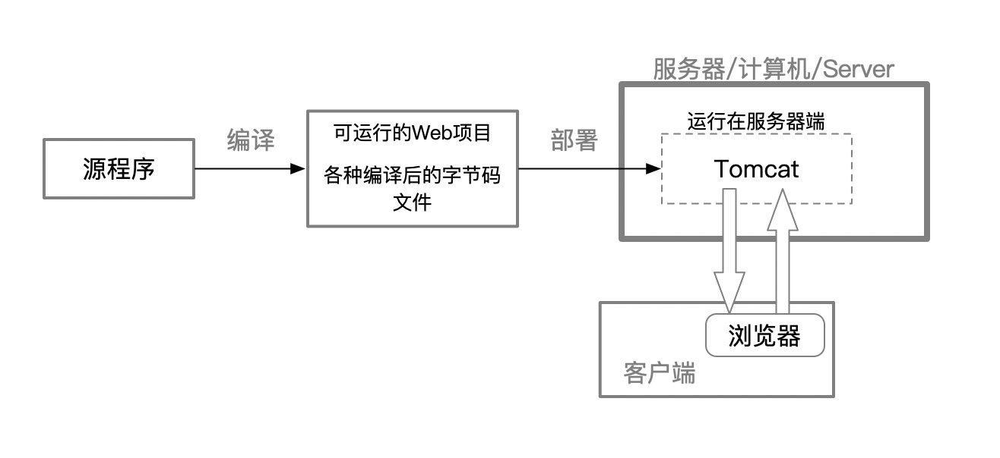
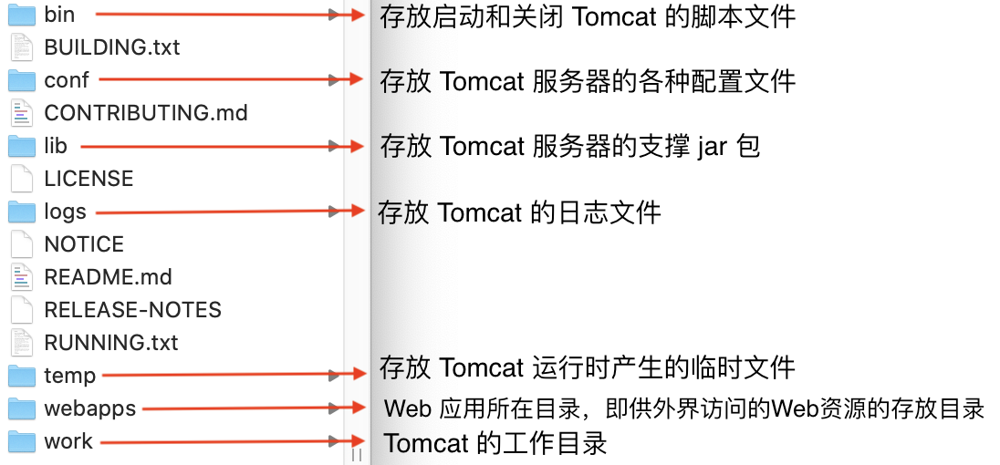
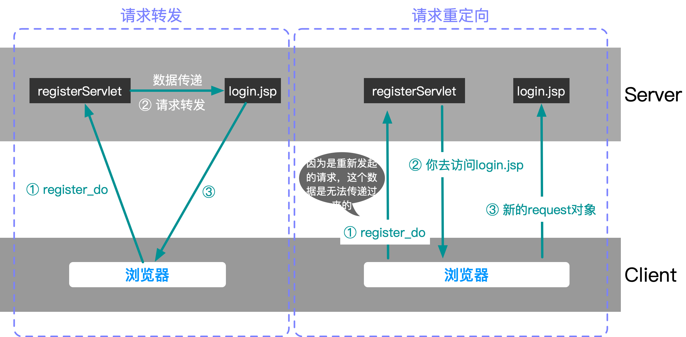
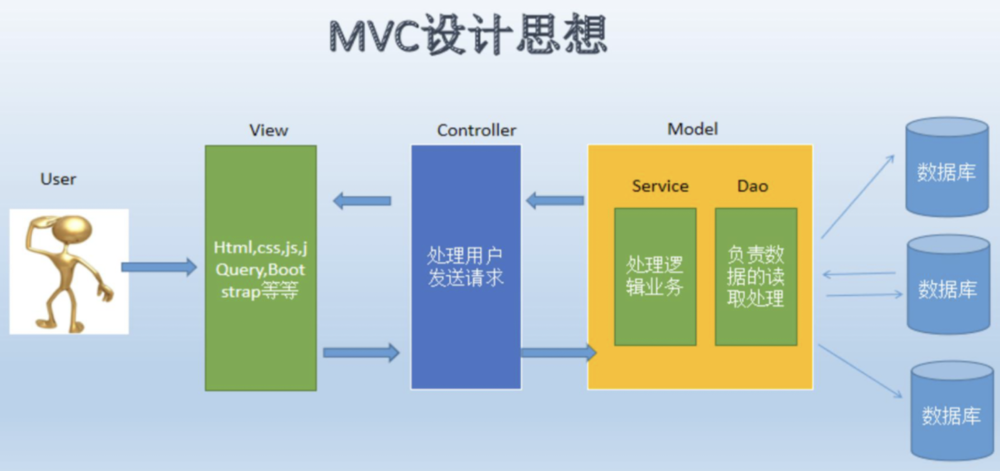
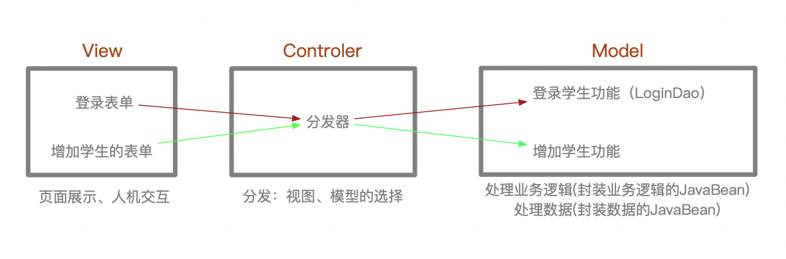
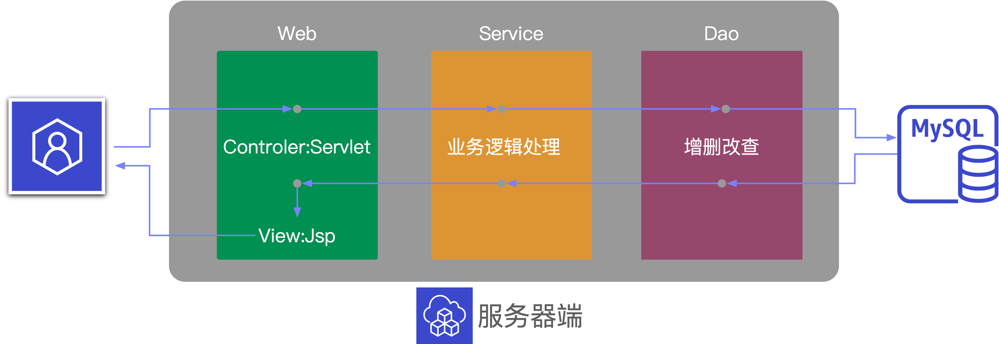

[Tomcat+Servlet面试题都在这里(修订版)——Java3y](https://mp.weixin.qq.com/s/4KPninCIfMoggB9Ak-79BQ)

## XML

XML（Extensible Markup Language 可扩展标记语言）

Extensible Markup Language 可扩展标记语言，标准通用标记语言的子集，简称XML。是一种用于标记电子文件使其具有`结构性的标记语言`。

XML 有两个先驱：SGML和HTML，但是都有一些与生俱来的缺陷。XML正是为了解决它们的不足而诞生的。

SGML：Standard Generalized Markup Language，标准通用标记语言，SGML具有非常复杂的文档结构。但是它不适用于Web数据描述，

HTML：它抛弃了SGML复杂庞大的缺点，继承了[SGML](https://baike.baidu.com/item/SGML/2901416)的很多优点。HTML是一种界面技术，它只使用了SGML中很少的一部分标记，例如HTML 4.0中只定义了70余种标记。为了便于在计算机上实现，HTML规定的标记是固定的，即HTML语法是不可扩展的。

XML：随着Web应用的不断发展，HTML的局限性也越来越明显地显现了出来，如HTML无法描述数据、可读性差、搜索时间长等。

**用处**：

+ 用来编写配置文件
+ 用来做数据传输

**语法**：

+ 大小写敏感
+ 命名一般不能使用空格、冒号

```XMl
<?xml version="1.0" encoding="UTF-8"?>
<goodslist>
  <good id="1001" birthday="2020-5-1">
    <price>12</price>
    <name>香蕉</name>
    <place>广州</place>
  </good>
  <good>
    <price>12</price>
    <name>苹果</name>
    <place>山东</place>
  </good>
</goodslist>
```

约束

+ 当使用别人的框架时候，需要提供一个配置文件，该配置文件就需要相应的约束（按照该框架的要求，有哪些标签、属性等）

约束文档

+ 约束规则可以通过两种文档格式来表示，DTD、Schema
+ 一般约束文档不需要我们自己开发，比如使用Strus框架会提供相应的约束文档，我们只需遵守即可

遵守 DTD 的 XML 文档实例：

```DTD
<?xml version="1.0"?>
<!DOCTYPE note [
	<!ELEMENT note (to,from,heading,body)>
	<!ELEMENT to (#PCDATA)>
	<!ELEMENT from (#PCDATA)>
	<!ELEMENT heading (#PCDATA)>
	<!ELEMENT body (#PCDATA)>
]>
```

```XML
<!--上面是对XML文档的约束，下面是XML文档内容-->
<!DOCTYPE note SYSTEM "note.dtd">
<!--note.dtd表示遵守的DTD文档路径，这里是相对路径举例-->
<note>
	<to>Tove</to>
	<from>Jani</from>
	<heading>Reminder</heading>
	<body>Don't forget me this weekend</body>
</note>
```

`DTD`约束

+ [DTD菜鸟教程](https://www.runoob.com/dtd/dtd-intro.html)

+ 通过DTD文件来定义约束

`Schema`约束

+ [Schema菜鸟教程](https://www.runoob.com/schema/schema-summary.html)

+ Schema约束文档本身也是一个XML文档，后缀为xsd
+ 里面有命名空间，有多个约束文档，可以通过命名空间进行区分
  + 命名空间用来指定该xml文件需要遵循的规范。

+ 通过 XML Schema，发送方可以用一种接受方能够明白的方式来描述数据。

```xml
<?xml version="1.0" encoding="UTF-8"?>
<note
xmlns="http://www.w3school.com.cn"   <!--命名空间-->
xmlns：w3="http://www.w3school.com.cn"    <!--给命名空间起个别名-->
xmlns:xsi="http://www.w3.org/2001/XMLSchema-instance"
xsi:schemaLocation="http://www.w3school.com.cn  note.xsd
http://www.sikiedu.com.cn  http://www.sikiedu.com/xx/xx/xx.xsd">
<!--引入多个规则-->
```


XML解析方式：DOM方式

DOM文档对象模型（树形结构）

+ DOM解析就是把xml文档加载到内存形成树形结构，可以进行增删改查的操作。

+ xml里面的dom和html里面的dom差不多，都是用来解析标签的，形成一个树，并得到一个document对象。

[dom4j](https://dom4j.github.io/#xslt)

+ dom4j是一个开源xml解析软件包（可以在GitHub上下载，然后导入到项目中），可以使用dom4j进行dom方式的解析。

```java
import java.net.URL;

import org.dom4j.Document;
import org.dom4j.DocumentException;
import org.dom4j.io.SAXReader;

public class Foo {
    public Document parse(URL url) throws DocumentException {
        SAXReader reader = new SAXReader();
        Document document = reader.read(url); //url是XML文档路径
        return document;
    }
}
```

```java
public void bar(Document document) throws DocumentException {

    Element root = document.getRootElement();

    // iterate through child elements of root
    for (Iterator<Element> it = root.elementIterator(); it.hasNext();) {
        Element element = it.next();
    }

    // iterate through child elements of root with element name "foo"
    for (Iterator<Element> it = root.elementIterator("foo"); it.hasNext();) {
        Element foo = it.next();
    }

    // iterate through attributes of root
    for (Iterator<Attribute> it = root.attributeIterator(); it.hasNext();) {
        Attribute attribute = it.next();
    }
 }
```

还可以使用dom4j生成一个XML文档

```java
import org.dom4j.Document;
import org.dom4j.DocumentHelper;
import org.dom4j.Element;

public class Foo {

    public Document createDocument() {
        Document document = DocumentHelper.createDocument();
        Element root = document.addElement("root");

        Element author1 = root.addElement("author")
            .addAttribute("name", "James")
            .addAttribute("location", "UK")
            .addText("James Strachan");

        Element author2 = root.addElement("author")
            .addAttribute("name", "Bob")
            .addAttribute("location", "US")
            .addText("Bob McWhirter");

        return document;
    }
}
```


## HTTP

HTTP是一个面向文本（text-oriented）的应用层协议，所使用的服务端口是TCP的`80端口`（这就是HTTP服务的传输层地址），通信双方就是在这个端口上进行通信的。每个Web服务器都有一个应用进程，时刻监听着 80端口的用户访问请求。

HTTP 规定了Web客户端与Web服务器之间的报文交互方式，其报文中的每个字段都是一些ASCII字符串，而且各个字段的长度都是不固定的。

客户端与服务端通信时传递的内容我们称之为`报文`。

例如：在浏览器点击一个链接，浏览器就为我打开这个链接的网页。

当在浏览器中点击这个链接的时候，浏览器会向服务器发送一段文本，告诉服务器请求打开的是哪一个网页。服务器收到请求后，就返回一段文本给浏览器，浏览器会将该文本解析，然后显示出来。这段「文本」就是遵循HTTP协议规范的。

> 总体来说，HTTP 具有以下几方面的特性：

（1）**客户端/服务器（C/S）模式**

C/S模式是所有网络应用服务采用的通用模式。Web客户只需要使用支持HTTP的客户端程序（各种浏览器），就可以访问由不同Web服务器程序开发的Web网站。

（2）**无连接**

这里所说的“无连接”是指在进行Web应用前无须建立专门的HTTP应用层会话连接，仅需要直接利用传输层已为它建立好的TCP传输连接即可，而像Telnet、SMTP、POP3这类应用协议，是面向连接的，除了需要传输层的TCP连接外，它们自己还要建立会话连接。

（3）**高可靠性**

虽然 HTTP 本身是不可靠的无连接协议，但它使用了可靠的TCP传输层协议，在进行HTTP传输之前，已建立了可靠的TCP连接，因此，从数据传输角度来讲，HTTP的报文传输仍是可靠的。

（4）**无状态**

这里所说“无状态”是指同一客户第二次访问同一Web服务器上的同一页面时，服务器给客户端的响应与第一次是一样的（当然，这是假设Web服务器上的对应页面没有更新），Web服务器不会记住这个客户端曾经访问过这个页面，而做出任何其他响应。

（5）**简单快速**

客户端通过HTTP访问Web服务器时，只需传送请求方法和路径。请求方法常用的有GET、HEAD、POST等（具体内容将在本章后面介绍），每种方法规定了客户端与服务器之间进行的事务处理和消息类型。由于HTTP简单，使得HTTP服务器的程序规模小，因而通信速度可以很快。


> 常用的头信息（请求头和响应头）

**请求报文格式**

报文格式：报文首行、空行（CR+LF）、报文主体
+ 报文首行：服务器端或客户端需处理的请求或响应的内容及属性
+ 空行（CR+LF）：CR（Carriage Return，回车符：16进制 0x0d）和 LF（Line Feed，回车符：16进制 0x0a）
+ 报文主体：应被发送的数据

鼠标右键「检查」—> network —> ALL —>  Headers

get 请求没有请求空行和请求体

post 提交有请求空行和请求体

**响应报文格式**

报文格式：响应首行、响应头信息、空行、响应体

+ 响应体：服务器传递给客户端要使用的html页面等数据


> **Http请求**

以访问百度为例

General（请求行）

```java
Request URL: https://www.baidu.com/    // 请求地址
Request Method: GET   // 请求方法 GET/POST
Status Code: 200 OK   // 状态码 
Remote Address: 61.135.169.121:443    // 远程地址
Referrer Policy: strict-origin-when-cross-origin
```

Response Headers（消息头）

```java
Cache-Control: no-cache   // 缓存控制
Connection: keep-alive    // 连接
Content-Encoding: gzip    // 编码
Content-Type: text/html;charset=utf-8
Coremonitorno: 0
Date: Fri, 16 Oct 2020 08:06:35 GMT
Server: apache
Set-Cookie: H_WISE_SIDS=154770_156157_158340_149355_150968_152056_156816_156287_150776_154259_148867_156089_154606_153716_151533_150772_151017_156388_156515_127969_153143_154174_158527_150346_155802_146732_158745_155789_131424_155885_114551_158283_107314_158055_158828_154189_155344_155255_158024_158333_157790_144966_156161_154213_157814_139882_158642_156847_156725_157188_147551_157028_158368_158504_158126_157696_154639_154360_158686_110085_157006; path=/; expires=Sat, 16-Oct-21 08:06:34 GMT; domain=.baidu.com
Set-Cookie: bd_traffictrace=161606; expires=Thu, 08-Jan-1970 00:00:00 GMT
Set-Cookie: rsv_i=09aesYLN2uDGT8AuNWA48jXyv8RWW1JFm7USjHvwQWK8H5mnHek2ccRJabxafuF0kLLG9iWW0C31grDHGGC7xgyLpDPKA5I; path=/; domain=.baidu.com
Set-Cookie: BDSVRTM=642; path=/
Set-Cookie: eqid=deleted; path=/; domain=.baidu.com; expires=Thu, 01 Jan 1970 00:00:00 GMT
Set-Cookie: __bsi=; max-age=3600; domain=m.baidu.com; path=/
Strict-Transport-Security: max-age=172800
Tracecode: 03954512991003698698101616
Tracecode: 03948273370734238218101616
Traceid: 160283559510206643309238506239870491417
Transfer-Encoding: chunked
Vary: Accept-Encoding    
```

 Request Headers（请求头）

```java
Accept:
//text/html,application/xhtml+xml,application/xml;q=0.9,image/avif,image/webp,image/apng,*/*;q=0.8,application/signed-exchange;v=b3;q=0.9 //告诉浏览器，它所支持的数据类型
Accept-Encoding: gzip, deflate, br  // 支持哪种编码格式 GBK UTF-8 GB2312 ISO8859-1
Accept-Language: zh-CN,zh;q=0.9     // 告诉浏览器它的语言环境
Cache-Control: max-age=0            // 缓存控制
Connection: keep-alive              // 连接，告诉浏览器请求完成之后是断开还是保持连接
Cookie: PSTM=1583464708; BAIDUID=F6D5BAF74D60C1D58B997704A9E4B305:FG=1; BD_UPN=123253; BIDUPSID=20DB63C59AE5ADBA611EC3CDB290C062; BDSFRCVID=a8_OJeC624RRJujrVbPRu70dCeM7uivTH6q2qZUtr5ifvFpCxDufEG0P_f8g0Ku-jgOsogKK0eOTHkAF_2uxOjjg8UtVJeC6EG0Ptf8g0M5; H_BDCLCKID_SF=JRu8oCPbJIv0f5rNhPjt-P6H-UnLqMotX2OZ0l8KtqjohKojhn54qJ0N5HtjKUJyBTnRKhcmWIQHDn31DJ3f2J-kXRJW0UrIWgb4KKJxXhCWeIJoLDcieM_VhUJiB5O-Ban7BhjIXKohJh7FM4tW3J0ZyxomtfQxtNRJ0DnjtpChbC_6jjtMjTbM-UTJeJT3KCOjBRu8Kb7VbpRuLUnkbfJBDGr70xJHK5rpslF-bC02ehON2foN0bK7yajK2-At5JTPLq5XB430sPLwQ4opQT8rhPFOK5Oib4jB0h7bab3vOIJNXpO1MU_zBN5thURB2DkO-4bCWJ5TMl5jDh3Mb6ksD-FtqjLHfRCOoK-QMt-_eJ7Ib4b_q4tehHR30hO9WDTm_DopaKtKOMb4345NbRQWDMOmKxJx-Dc9-pPKKR7Khp59qJ6N0tFYMPOuQxvg3mkjbU7zfn02OPKzW57N-44syP4jKxRnWI3CKfA-b4ncjRcTehoM3xI8LNj405OTbIFO0KJzJCFKMIK6j5tbePtH52TEaPoy-I5XsJOOaCvHbM7Oy4oTj6j30R5Z-4THQDrTbtK5tnbTeqC65tr-3MvBKH5DXqQJ-JT00tQI-pOWs-5IQft20h4EeMtjBbLL2Dv9Qb7jWhk2eq72y-RNQlRX5q79atTMfNTJ-qcH0KQpsIJM5-DWbT8IjH62btt_tJPHoK5P; BDUSS=5hM1FMb2J2a1VCblVxSVZmS1hmM2hOS29CYWNkYXJLYzYzMXpRbk1rNUpnNnRmRVFBQUFBJCQAAAAAAAAAAAEAAACvKrToU3VwZXJmYXJyAAAAAAAAAAAAAAAAAAAAAAAAAAAAAAAAAAAAAAAAAAAAAAAAAAAAAAAAAAAAAAAAAAAAAAAAAEn2g19J9oNfR2; BDUSS_BFESS=5hM1FMb2J2a1VCblVxSVZmS1hmM2hOS29CYWNkYXJLYzYzMXpRbk1rNUpnNnRmRVFBQUFBJCQAAAAAAAAAAAEAAACvKrToU3VwZXJmYXJyAAAAAAAAAAAAAAAAAAAAAAAAAAAAAAAAAAAAAAAAAAAAAAAAAAAAAAAAAAAAAAAAAAAAAAAAAEn2g19J9oNfR2; BDORZ=FFFB88E999055A3F8A630C64834BD6D0; delPer=0; BD_CK_SAM=1; PSINO=2; BDRCVFR[tiixOo0cjw_]=mk3SLVN4HKm; H_PS_645EC=4e13o1LIxxHQPOFOxhR3rLLWch9YtJV%2BvpBCwa1V3tYoOB0meYFjzlLMgwapLClJE%2FrgK8MbXsm5; BA_HECTOR=2g212la00ka1ah81u21foil400j; BD_HOME=1; H_PS_PSSID=7506_1452_7567_31254_32723_32231_7517_7605_32115_26350
Host: www.baidu.com        // 主机
Sec-Fetch-Dest: document
Sec-Fetch-Mode: navigate
Sec-Fetch-Site: none
Sec-Fetch-User: ?1
Upgrade-Insecure-Requests: 1
User-Agent: Mozilla/5.0 (Linux; Android 6.0; Nexus 5 Build/MRA58N) AppleWebKit/537.36 (KHTML, like Gecko) Chrome/86.0.4240.80 Mobile Safari/537.36
```


## JSP

[Tomcat+Servlet面试题都在这里(修订版)](https://mp.weixin.qq.com/s/4KPninCIfMoggB9Ak-79BQ)

[浅谈JSP/Servlet前世今生](https://zhuanlan.zhihu.com/p/42343690)

[Servlet的本质是什么，它是如何工作的？ - 知乎](https://www.zhihu.com/question/21416727)

[jsp为什么被淘汰了？ - 知乎](https://www.zhihu.com/question/328713931/answer/711014242)

[Tomcat+Servlet面试题都在这里(修订版)](https://mp.weixin.qq.com/s/4KPninCIfMoggB9Ak-79BQ)


> 关于 JSP（Java Server Page）

Java Server Page 直译就是「运行在服务器上的页面」。

是内嵌 html  和 Java 代码的的 JSP 文件。

JSP 中 HTML/CSS/JS 等的写法和 HTML  文件中的写法是一模一样的。

`当有人请求JSP时，服务器内部会经历一次`动态资源`（JSP）到`静态资源`（HTML）的转化`，服务器会自动帮我们把 JSP 中的 HTML 片段和数据拼接成静态资源响应给浏览器。

也就是说 JSP 是运行在服务器端，但最终发给客户端的都已经是转换好的 HTML 静态页面（在响应体里）。

现在一般用「模板」或者「完全静态 + AJAX + JSON」了。


**记住：**

JSP是服务器端用来将动态页面转化为静态页面的。

浏览器只能解析静态页面：
+ “静态HTML文档”与“静态HTML元素” 是两个不同的概念：在静态HTML文档中可以有像文本、图片之类的静态网页元素以及图像、动画、音/视频这类动态网页元素。
+ 动态HTML文档不是由管理员事先制作好的网页，而是即时由服务器应用程序或者脚本程序，根据当前应用和用户提交的表单数据自动生成的，其显示的内容是在不断变化的。

JSP本质是一个Java类——Servlet，是运行在服务器端的，只不过它输出结果是HTML。

[JSP中EL表达式的用法详解(必看篇)](https://blog.csdn.net/JavaNotes/article/details/80722153)

[关于Servlet](https://zhuanlan.zhihu.com/p/42343690)

浏览器能通过解析html语句渲染出页面，浏览器通过http请求某个页面，然后服务器根据浏览器的请求，通过http响应对应页面的html语句回去。而服务器端是我们用Java开发的，它用什么响应这一大堆html语句？答案就是：Servlet！


## Servlet

> Servlet是什么？

1. 一个 `Java` 类，运行在 Servlet 容器(比如Tomcat) 中

2. 负责接收请求

3. 调用 Service 处理数据

4. 负责响应数据

5. Servlet是`单例`的

6. 访问任何资源其实都是在访问 Servlet ( 即便是访问图片资源，Tomcat都有默认Servlet处理 )


> JSP 和 Servlet 的关系

Web 容器（Tomcat）接收到以 `.jsp` 为扩展名的 URL 的访问请求时，它将把该请求交给 `JSP引擎` 去处理。Tomcat 中的 JSP引擎就是一个 Servlet 程序，它负责解释和执行JSP页面。

每个 JSP 页面在第一次被访问时，JSP引擎将它翻译成一个 Servlet 源程序，接着再把这个Servlet源程序编译成Servlet 的 class类文件，然后再由 Web容器（Tomcat）像调用普通 Servlet程序一样的方式来装载和解释执行这个由 JSP 页面翻译成的 Servlet程序。

`JSP` —> `Servlet.java` —> `Servlet.class`

Servlet 处理完之后，一般会把请求转发给某个 jsp，jsp 在`服务器端`转化为html，然后把 html 返回给客户端。


> 为什么要学 Servlet ?

Struts 2 或 SpringMVC 都离不开 Servlet

Struts2 的核心用的是 `Filter(过滤器)`，而 SpringMVC 的核心用的就是 `Servlet`

> 如何开发一个Severlet程序？

我们将实现了Severlet接口的Java程序叫做 `Severlet`

开发一个Severlet程序只需要完成两个小步骤：

+ 编写一个类，实现Severlet接口
+ 将开发好的Java类部署到web服务器中

> Severlet源码

HelloServlet `extends` HttpServlet `extends` GenericServlet `implements` Servlet, ServletConfig, Serializable

我们自己的类只需要继承`HttpServlet`即可。


```java
public class HelloServlet extends HttpServlet {
    @Override
    protected void doGet(HttpServletRequest req, HttpServletResponse resp) throws ServletException, IOException {
        req.setCharacterEncoding("UTF-8");//设置请求的字符集类型
        resp.setContentType("text/html;charset=utf-8");//设置响应的字符集类型

        PrintWriter out=resp.getWriter();//设置输出流
        out.println("Hello，我要学习JSP了，请多多关照");//打印一段话在网页上
        JdbcWeb res = new JdbcWeb();
//        String password = res.conn();
//        req.getParameter()
//        out.println(password);//打印一段话在网页上
    }
}
```


```java
public abstract class HttpServlet extends GenericServlet implements Serializable {
    private static final String METHOD_DELETE = "DELETE";
    private static final String METHOD_HEAD = "HEAD";
    private static final String METHOD_GET = "GET";
    private static final String METHOD_OPTIONS = "OPTIONS";
    private static final String METHOD_POST = "POST";
    private static final String METHOD_PUT = "PUT";
    private static final String METHOD_TRACE = "TRACE";
    private static final String HEADER_IFMODSINCE = "If-Modified-Since";
    private static final String HEADER_LASTMOD = "Last-Modified";
    private static final String LSTRING_FILE = "javax.servlet.http.LocalStrings";
    private static ResourceBundle lStrings = ResourceBundle.getBundle("javax.servlet.http.LocalStrings");

    public HttpServlet() {
    }
  	...
      
    // 这里实现了 service 的具体内容
    protected void service(HttpServletRequest req, HttpServletResponse resp) throws ServletException, IOException {
        String method = req.getMethod();
        long lastModified;
        if (method.equals("GET")) {
            lastModified = this.getLastModified(req);
            if (lastModified == -1L) {
                this.doGet(req, resp);
            } else {
                long ifModifiedSince = req.getDateHeader("If-Modified-Since");
                if (ifModifiedSince < lastModified) {
                    this.maybeSetLastModified(resp, lastModified);
                    this.doGet(req, resp);
                } else {
                    resp.setStatus(304);
                }
            }
        } else if (method.equals("HEAD")) {
            lastModified = this.getLastModified(req);
            this.maybeSetLastModified(resp, lastModified);
            this.doHead(req, resp);
        } else if (method.equals("POST")) {
            this.doPost(req, resp);
        } else if (method.equals("PUT")) {
            this.doPut(req, resp);
        } else if (method.equals("DELETE")) {
            this.doDelete(req, resp);
        } else if (method.equals("OPTIONS")) {
            this.doOptions(req, resp);
        } else if (method.equals("TRACE")) {
            this.doTrace(req, resp);
        } else {
            String errMsg = lStrings.getString("http.method_not_implemented");
            Object[] errArgs = new Object[]{method};
            errMsg = MessageFormat.format(errMsg, errArgs);
            resp.sendError(501, errMsg);
        }

    }
}
```


```java
public abstract class GenericServlet implements Servlet, ServletConfig, Serializable {
    private static final String LSTRING_FILE = "javax.servlet.LocalStrings";
    private static ResourceBundle lStrings = ResourceBundle.getBundle("javax.servlet.LocalStrings");
    private transient ServletConfig config;

    public GenericServlet() {
    }

    public void destroy() {
    }
  	...
    // 这里并没有对 service 进行重写
    public abstract void service(ServletRequest var1, ServletResponse var2) throws ServletException, IOException;
}
```


```java
public interface Servlet {
    void init(ServletConfig var1) throws ServletException;

    ServletConfig getServletConfig();

    void service(ServletRequest var1, ServletResponse var2) throws ServletException, IOException;

    String getServletInfo();

    void destroy();
}
```


>Servlet 几个重要的对象

1. **ServletConfig 和 ServerContext  对象**：

**ServletConfig**：通过此对象可以读取`web.xml`中配置的初始化参数，不写硬编码，将配置写在配置文件中。

**ServletContext**：这个对象是在 Tomcat 启动的时候就会创建，代表着当前整个应用。我们一般用来获取整个应用的配置信息（ServletConfig 是单个的，而 ServletContext 是整个应用的），还可以用这个对象来读取资源文件。

2. **request 和 response 对象**

一句话总结：`request对象`主要用于`接收`请求的各种信息，`response对`象主要用户`返回`给请求各种的信息。围绕着请求、响应我们分别有request和response对象供我们操作。

当我们学完HTTP的请求头和响应头以后，再看到这两个对象，我们就应该知道：`request 其实就是封装了HTTP的请求头，而 response 就是封装了 HTTP响应头`。

这两个对象是Servlet中最重要的，因为我们跟外接的交互都是通过request和response对象来进行的。

通过 response 对象，我们可以尝试写一些Demo，比如：
+ 给浏览器输出一些简单的内容
+ 实现文件下载的功能
+ 实现页面自动刷新的功能
+ 实现对数据的压缩
+ 生成验证码图片
+ 重定向跳转
+ …..

通过 request 对象，我们也可以尝试做些 Demo，比如：
+ 得到浏览器的传递过来的各类信息（请求参数、请求头等）
+ 实现防盗链
+ 通过request对象来转发
+ 解决请求参数中文乱码的问题
+ ….


> **Servlet 容器**

通俗点说，所bai谓容器，就是放东西的地方。Servlet容器自然就是放Servlet的地方。J2EE开发，是有分工的。一般的程序员，写的都是应用开发，我们会按照一定的规则，开发我们的系统，比如用Servlet开发，我们就要按照Servlet的规则写代码。 那么我们写的代码就是在Servlet容器中运行。容器会按照规则加载类，并运行它。 有一部份程序员就是写容器的，如Tomcate就是web容器。tomcat就是一个Servlet容器。

**Servlet容器基本概念**：

1. Tomcat是Servlet的运行环境，即一个Servlet容器。
2. Servlet容器的作用是负责处理客户请求，当客户请求来到时，Servlet容器获取请求，然后调用某个Servlet，并把Servlet的执行结果返回给客户。
3. Servlet 容器的工作过程是：当客户请求某个资源时，Servlet容器使用`ServletRequest`对象把客户的请求信息封装起来，然后调用 java Servlet API中定义的Servlet的一些生命周期方法，完成Servlet的执行，接着把Servlet执行的要返回给客户的结果封装到 ServletResponse 对象中，最后Servlet容器把客户的请求发送给客户，完成为客户的一次服务过程。每一个Servlet的类都执行` init()`、`service()`、`destory()`三个函数的自动调用，在启动时调用一次`init()`函数用以进行参数的初始化，在服务期间每当接收到对该Servlet的请求时都会调用`Service()`函数执行该Servlet的服务操作，当容器销毁时调用一次`destory()`函数。
4. 典型的 Servlet 应用是`监听器`、`过滤器`的实现。
5. JSP运行原理：当Web服务器上的JSP页面第一次被请求执行时，JSP引擎先将JSP页面文件转译成一个Java文件，即Servlet，Java Servlet是基于服务器端编程的API，用Java Servlet编写的Java程序称为servlet，servlet通过HTML与客户交互。服务器将前面转译成的Java文件编译成字节码文件，再执行这个字节码文件来响应客户的请求。当这个JSP页面再次被请求时，只要该JSP文件没有被改动，JSP引擎就直接调用已装载的Servlet。


## Tomcat

### Tomcat入门

> **关于Tomcat**

[服务器到底帮我们做了一件什么事（比如说 Tomcat）](https://blog.csdn.net/weixin_42765975/article/details/102711244)

<font color=DarkOrchid>**在 Java 中为什么要安装TomCat，有什么用途？**</font>

Tomcat 是 Java 程序运行的服务器平台，如果只是编译运行 Java 文件，安装 JDK 就可以。

Tomcat是网站的服务器，每个网站在后面都有一个服务器来解释那个网页，因为网站本身多数是动态计算的，即跟一些编程语言有关系，不光有一些固定的文本内容，多数情况下文本内容是根据填写的参数计算出来的，这是关于这计算这部分。

Tomcat 对于 Java 来说它就是一个 Servlet 处理器，支持运行基于 Servlet 的 Java 程序，同时 JSP 本身也是基于 Servlet 技术，所以 Tomcat 也是支持 JSP 的，另外，Spring、Struts、 JSF 都是基于 Servlet 的，都可以在 Tomcat 上跑起来。

另外作为一个 J2EE 中的 Web 服务器，它也需要`处理事务`、`资源管理`、`角色认证与授权`这些 J2EE  规范中要求达到的标准。

像处理客户端请求的网络连接，并发负载分派到不同的服务器，这些网络服务器的基本功能基本上也是这些 Tomcat 之类的服务器需要处理的。

开发一个网络程序时就需要用到类似 Tomcat 之类的服务器，将写好的 JSP 网站程序打包成 war 文件（其实就是一个 zip 格式的文件）放到服务器上指定的位置就可以跑了。当然除了 Tomcat 之外，还有很多其他服务器可以用，比如 `WebSphere、Weblogic、Resin、 Jetty `等，其中 WebSphere、Weblogic 是完整的 J2EE 服务器，除了支持 Web 之外还支持 EJB，但Resin、 Jetty、Tomcat 只支持 Web 这块。


Tomcat 是一个 Web 服务器（同时也是 Servlet 容器），我们可以在 Tomcat 上部署多个 Web 项目（网站）。

通过 Tomcat 我们可以很方便地`接收和返回`请求（如果不用Tomcat，那我们需要自己写`Socket`来接收和返回请求）。

说得粗略点，JVM 就是运行Java的，tomcat 就是一个Java程序，Servlet 就是写在容器（如Tomcat）里的动态资源，远程客户端点击或者一个url请求会封装成一个http请求，到你的服务端后由容器（Tomcat）解析`http`请求，并封装为`java servlet`请求和响应，最后放进servlet的`service`方法根据请求作出服务。



> **Tomcat需要学什么**？

Tomcat其实我们并不需要学太多的知识，只要学会`安装`和`启动`以及了解一下`各个目录的含义`就差不多了。




**本地 Tomcat 安装路径**

+ /Library/apache-tomcat-9.0.31/

**配置Tomcat**

Tomcat是 Java  编写的，依赖 Java 环境

+ ① 配置 JAVA_HOME 环境变量
+ ② 解压 Tomcat 软件到需要安装的位置

**Tomcat 端口修改**

+ Tomcat 的 `conf` 目录下的 `server.xml` 文件中修改
+ 顺便提一下端口号范围 `0-65535`

**request 和 respons**

+ `request` 负责处理客户端向服务器发起请求的时候所发送一些信息。
+ `respons` 是服务器端向客户端发送响应。
+ request 和 respons  二者的生命周期是一样的。

**request 和 respons 的生命周期**

+ 每次请求都会向服务器发送一个 http 数据包，每次请求服务器端都会单独创建一个 request 对象（同时创建 respons 对象），该 request 对象就封装了本次请求的一些信息，当一次请求访问完了之后，该 request 对象和respons 对象就会被销毁。

+ 即使两次访问同一个页面，也是不同的请求。


> **`conf\server.xml`** 

```xml
<?xml version="1.0" encoding="UTF-8"?>
<!--
  Licensed to the Apache Software Foundation (ASF) under one or more
  contributor license agreements.  See the NOTICE file distributed with
  this work for additional information regarding copyright ownership.
  The ASF licenses this file to You under the Apache License, Version 2.0
  (the "License"); you may not use this file except in compliance with
  the License.  You may obtain a copy of the License at

      http://www.apache.org/licenses/LICENSE-2.0

  Unless required by applicable law or agreed to in writing, software
  distributed under the License is distributed on an "AS IS" BASIS,
  WITHOUT WARRANTIES OR CONDITIONS OF ANY KIND, either express or implied.
  See the License for the specific language governing permissions and
  limitations under the License.
-->
<!-- Note:  A "Server" is not itself a "Container", so you may not
     define subcomponents such as "Valves" at this level.
     Documentation at /docs/config/server.html
 -->
<Server port="8005" shutdown="SHUTDOWN">
  <Listener className="org.apache.catalina.startup.VersionLoggerListener" />
  <!-- Security listener. Documentation at /docs/config/listeners.html
  <Listener className="org.apache.catalina.security.SecurityListener" />
  -->
  <!--APR library loader. Documentation at /docs/apr.html -->
  <Listener className="org.apache.catalina.core.AprLifecycleListener" SSLEngine="on" />
  <!-- Prevent memory leaks due to use of particular java/javax APIs-->
  <Listener className="org.apache.catalina.core.JreMemoryLeakPreventionListener" />
  <Listener className="org.apache.catalina.mbeans.GlobalResourcesLifecycleListener" />
  <Listener className="org.apache.catalina.core.ThreadLocalLeakPreventionListener" />

  <!-- Global JNDI resources
       Documentation at /docs/jndi-resources-howto.html
  -->
  <GlobalNamingResources>
    <!-- Editable user database that can also be used by
         UserDatabaseRealm to authenticate users
    -->
    <Resource name="UserDatabase" auth="Container"
              type="org.apache.catalina.UserDatabase"
              description="User database that can be updated and saved"
              factory="org.apache.catalina.users.MemoryUserDatabaseFactory"
              pathname="conf/tomcat-users.xml" />
  </GlobalNamingResources>

  <!-- A "Service" is a collection of one or more "Connectors" that share
       a single "Container" Note:  A "Service" is not itself a "Container",
       so you may not define subcomponents such as "Valves" at this level.
       Documentation at /docs/config/service.html
   -->
  <Service name="Catalina">

    <!--The connectors can use a shared executor, you can define one or more named thread pools-->
    <!--
    <Executor name="tomcatThreadPool" namePrefix="catalina-exec-"
        maxThreads="150" minSpareThreads="4"/>
    -->


    <!-- A "Connector" represents an endpoint by which requests are received
         and responses are returned. Documentation at :
         Java HTTP Connector: /docs/config/http.html
         Java AJP  Connector: /docs/config/ajp.html
         APR (HTTP/AJP) Connector: /docs/apr.html
         Define a non-SSL/TLS HTTP/1.1 Connector on port 8080
    -->
    <Connector port="8080" protocol="HTTP/1.1"
               connectionTimeout="20000"
               redirectPort="8443" />
    <!-- A "Connector" using the shared thread pool-->
    <!--
    <Connector executor="tomcatThreadPool"
               port="8080" protocol="HTTP/1.1"
               connectionTimeout="20000"
               redirectPort="8443" />
    -->
    <!-- Define an SSL/TLS HTTP/1.1 Connector on port 8443
         This connector uses the NIO implementation. The default
         SSLImplementation will depend on the presence of the APR/native
         library and the useOpenSSL attribute of the
         AprLifecycleListener.
         Either JSSE or OpenSSL style configuration may be used regardless of
         the SSLImplementation selected. JSSE style configuration is used below.
    -->
    <!--
    <Connector port="8443" protocol="org.apache.coyote.http11.Http11NioProtocol"
               maxThreads="150" SSLEnabled="true">
        <SSLHostConfig>
            <Certificate certificateKeystoreFile="conf/localhost-rsa.jks"
                         type="RSA" />
        </SSLHostConfig>
    </Connector>
    -->
    <!-- Define an SSL/TLS HTTP/1.1 Connector on port 8443 with HTTP/2
         This connector uses the APR/native implementation which always uses
         OpenSSL for TLS.
         Either JSSE or OpenSSL style configuration may be used. OpenSSL style
         configuration is used below.
    -->
    <!--
    <Connector port="8443" protocol="org.apache.coyote.http11.Http11AprProtocol"
               maxThreads="150" SSLEnabled="true" >
        <UpgradeProtocol className="org.apache.coyote.http2.Http2Protocol" />
        <SSLHostConfig>
            <Certificate certificateKeyFile="conf/localhost-rsa-key.pem"
                         certificateFile="conf/localhost-rsa-cert.pem"
                         certificateChainFile="conf/localhost-rsa-chain.pem"
                         type="RSA" />
        </SSLHostConfig>
    </Connector>
    -->
    
    <!-- Define an AJP 1.3 Connector on port 8009 -->
    <!--
    <Connector protocol="AJP/1.3"
               address="::1"
               port="8009"
               redirectPort="8443" />
    -->
    
    <!-- An Engine represents the entry point (within Catalina) that processes
         every request.  The Engine implementation for Tomcat stand alone
         analyzes the HTTP headers included with the request, and passes them
         on to the appropriate Host (virtual host).
         Documentation at /docs/config/engine.html -->
    
    <!-- You should set jvmRoute to support load-balancing via AJP ie :
    <Engine name="Catalina" defaultHost="localhost" jvmRoute="jvm1">
    -->
    <Engine name="Catalina" defaultHost="localhost">
    
      <!--For clustering, please take a look at documentation at:
          /docs/cluster-howto.html  (simple how to)
          /docs/config/cluster.html (reference documentation) -->
      <!--
      <Cluster className="org.apache.catalina.ha.tcp.SimpleTcpCluster"/>
      -->
    
      <!-- Use the LockOutRealm to prevent attempts to guess user passwords
           via a brute-force attack -->
      <Realm className="org.apache.catalina.realm.LockOutRealm">
        <!-- This Realm uses the UserDatabase configured in the global JNDI
             resources under the key "UserDatabase".  Any edits
             that are performed against this UserDatabase are immediately
             available for use by the Realm.  -->
        <Realm className="org.apache.catalina.realm.UserDatabaseRealm"
               resourceName="UserDatabase"/>
      </Realm>
    
      <Host name="localhost"  appBase="webapps"
            unpackWARs="true" autoDeploy="true">
    
        <!-- SingleSignOn valve, share authentication between web applications
             Documentation at: /docs/config/valve.html -->
        <!--
        <Valve className="org.apache.catalina.authenticator.SingleSignOn" />
        -->
    
        <!-- Access log processes all example.
             Documentation at: /docs/config/valve.html
             Note: The pattern used is equivalent to using pattern="common" -->
        <Valve className="org.apache.catalina.valves.AccessLogValve" directory="logs"
               prefix="localhost_access_log" suffix=".txt"
               pattern="%h %l %u %t &quot;%r&quot; %s %b" />
    
      </Host>
    </Engine>

  </Service>
</Server>
```

其中152行：

```xml
<Host name="localhost"  appBase="webapps"
            unpackWARs="true" autoDeploy="true">
```

+ 默认的主机名称为：`localhost`，等价于`127.0.0.1`

+ 默认网站应用存放的位置：`webapps`

> **关于`hosts`文件**

`hosts`文件位置：

+ Mac 的`hosts`文件在`/private/etc/hosts`；
+ Window 的`hosts`文件在`C:\Windows\System32\drivers\etc\hosts`

其中Mac 的`hosts`文件内容为：

```
# localhost is used to configure the loopback interface

# when the system is booting.  Do not change this entry.

##
127.0.0.1	localhost
255.255.255.255	broadcasthost
::1             localhost

127.0.0.1xmind.net
127.0.0.1www.xmind.net
```

这里的`localhost`对应的就是`127.0.0.1`，这个

> **相关面试题：网站是如何进行访问的?**

1. 输入一个域名，回车；
2. 检查本机的`/private/etc/hosts`配置文件下有没有这个域名的映射；
	+ `有`：就直接返回对应的`ip`地址
	+ `没有`：就去DNS服务器上找

> 发布一个web网站

+ 将自己写的网站（如 `index.html`），放到服务器（Tomcat）中指定的web应用的文件夹（webapps）下，就可以

网站应有的结构：

```java
--webapps  // Tomcat服务器的web目录
  	-ROOT
  	-hory  // 网站的目录名
  			-WEB-INF
  					-classes  // Java程序
  					-lib      // web应用所依赖的jar包
  					-web.xml
  			-index.html   // 默认的首页
  			-static 
  					-css
  							-style.css 
  					-js
  					-img
```


> 请求转发

+ 比如有两个界面：register_do.jsp 和 login.jsp

+ ```java
	request.getRequestDispatcher("login.jsp").forward(request,response);
	```

+ 当我们将好信息的注册表单发送给服务器时（即request），当注册成功时，服务器端发送过来一个登录界面（但是，我们并没有请求登录页面），这就相当于服务器端转发我们的request 给登录页面。

+ 所以说这个request并没有重新 创建，而是转发给了login.jsp，转发的时候，数据也会传递过去

+ 所以说最后虽然是登录界面，但URL里面显示的还是register_do.jsp


> 请求重定向

```java
response.sendRedirect("login.jsp");
```


> 转发和重定向区别

如下图：



重定向会请求`两次`，第一次的request中是有数据的，但是第二次没有，所以不会提示信息。


> Jsp内置对象之Session (会话)

+ 当我们登录成功之后，如何在每个页面显示当前登录的用户？
+ 当我们打开一个网站到关闭一个网站（在这期间，可能会有多次request请求 ），这就是一个session (会话) 请求。
+ 当打开一个网站，服务器端就会给客户端创建一个session对象，当然，在任意一个 jsp 页面上都可以访问这个session对象。
+ 不同的客户端对应不同的session。当使用不同的浏览器，也相当于不同的客户端。


> session 的销毁

+ 关闭网站或者关机。
+ 去干别的事，长时间不访问这个页面也会别销毁（因为服务器有个监听session活跃的时间，每次访问服务器此活跃时间就会更新），这个时间间隔在Tomcat中可以设置。


> 页面四大域对象：page、request、session、application

+ 作用域依次增大
+ page只在当前页面有效
+ request涉及到请求转发的话，在多个页面同时有效
+ session在整个会话周期内有效（前面有讲过）
+ application是针对整个web应用，所有的页面、所有的客户端访问的是同一个application


### Tomcat源码

[Tomcat架构](https://mp.weixin.qq.com/s/wh2MEJa0VjfG2FWjUmsElA)


## MVC

MVC分层架构（Model、View、Controler）

简言之就是将不同功能的代码放到不同的文件夹里，方便后期的维护。

Model 层就是数据模型，可以把每个类当做一个模型，类对象就代表一个完整的数据模型。（类比汽车模型，包括哪些零件）比如一个账号类，它需要用到很多类型的数据，比如用户名、密码、年龄等。

View 层用于展示页面，比如 jsp 就属于View层。

Controler 层就是控制层，Servlet就属于控制层，当我们发起请求时，是用 Servlet 来处理客户端发过来的数据，根据数据显示相应的 jsp 页面。

在实际的开发中，jsp 只负责视图的展示，不负责逻辑的处理。（什么是逻辑的处理：比如注册用户的账号，要去得到用户的用户名密码，取得用户输入的数据，插入到数据库中。）





企业级应用中：

值得注意的是，Model 层又可以细分为两层，分别是dao层、service层。

dao层：dao层叫数据访问层，全称为data access object，属于一种比较底层，比较基础的操作，具体到对于某个表、某个实体的增删改查。负责访问数据库进行数据的操作，取得结果集，将结果集中的数据去除封装到Bean类对象，返回给service层。

Service层 :相比之下比较高层次的一层结构，相当于将几种操作封装起来。主要负责业务处理，比如取得数据库连接，关闭数据库连接，事务回滚，一些复杂的逻辑业务处理。

至于为什么 service 层要使用接口来定义有以下几点好处： ① 在java中接口是多继承的，而类是单继承的，如果你需要一个类实现多个service，你用接口可以实现，用类定义 service 就没那么灵活； ② 要提供不同的数据库的服务时，我们只需要面对接口用不同的类实现即可，而不用重复地定义类。

所以在企业级应用中一般是下面的结构

也是分为三层：Web层（包括Jsp、Servlet）、Service层、Dao层



## Controller / Service / Dao

分层的目的：高内聚，低耦合。

**Dao** 提供了对单个数据库表对象的增删改查。

**Service** 可以理解为对Dao层的封装，因为实际业务中前端发送过来的一个请求可能涉及到对多个表的操作，因此，在Service内部，就涉及到对多个表的操作以及对同一个表的多个操作（那么就用到了事务），此外还包括一些其他的业务逻辑。也就是说，一个Service方法中通常会调用多个Dao

**Controller** 用于接收前端发送过来的请求，调用业务层Service的同时处理简单的逻辑结果返回给前端。同样，Controller层也会对应多个Service


## EL表达式

**EL表达式**

+ 方便jsp开发，使得代码更加优雅

+ 用来从域对象中取得数据

+ 域对象就是page、request、session、application

+ ```jsp
  session.serAttribute("user","www.sikiedu.com");
  ${sessionScope.counnt};
  ```

+ 它只能用来取值，并不能做一些逻辑判断

JSTL

+ 需要引入，是一个轻量级的插件，需要下载


## JSON

[JSON](https://www.json.org/json-en.html)

讲JSON之前先说一下js对象

 ```html
<head>
</head>
<body>
  <script type="text/javascript">
    //一个复杂的js对象
    var student = {
      lastName:"Micheal",
      age:23,
      car:{
        pp:"宝马"，
        price:"49000$"
      },
      infos:[
        {boohName:"西游记",price:23.5},
        14,true
      ]
    };
  </script>
</body>
 ```


什么是 JSON？

+ JavaScript Object Notation (js对象表示法)

+ 和XML一样（比XML轻量），都是一种数据格式，都是主要用来做数据传输的

+ json基本数据类型

  + ”字符串“     234   true   false   null

+ 这些基本数据类型组成两种复杂的数据类型

  + **对象** 和 **数组**    

  + 对象格式(键值对)      

  + ```json
    {"name": "Micheal", "age": 20, "sex": "男"};
    ```

  + 数组格式(也可以包括 对象)         

  + ```json
    [100, 200,300]     
    ```

+ json的key必须是字符串，js对象在声明的时候key是否加双引号可以选择


json的使用

+ 用于数据的传输，如果服务器返回给浏览器的数据是 js对象这种格式，浏览器使用 Js 解析就会很方便，所以就有了JSON（HTTP只能传输文本）

+ 比如客户端向服务器端发送了 一段json格式的数据，在服务器 端就需要用 Java 代码对这份json格式的数据进行解析。同样，服务器端也可以向客户端发送json数据，客户端一般用 Js 进行解析。

 ```html
<head>
</head>
<body>
  <script type="text/javascript">
    //一个复杂的js对象
    var student = {
      lastName:"Micheal",
      age:23,
      car:{
        pp:"宝马"，
        price:"49000$"
      },
      infos:[
        {boohName:"西游记",price:23.5},
        14,true
      ]
    };
    //js对象，属性操作特别方便
    alert(student.cra.pp);

    //下面的JSON是js的内置对象，将js对象转换为JSON字符串
    var strJson = JSON.stringify(student);
    //将json字符串转为js对象
    var stu = Json.parse(strJson);
  </script>
</body>
 ```

+ 关于用 Java 解析的插件有好多 ，我们可以关注 阿里的[**fastjson**](https://mvnrepository.com/artifact/com.alibaba/fastjson) 和  谷歌的 **google-gjson**

+ fastjson 可以解析 JSON 格式的字符串 ，支持将 JavaBean 序列化为 JSON 字符串，也可以从 JSON 字符串反序列化到 JavaBean。（对象是存储在内存中的，关机会将内存清空 ，如果序列化为字符串，字符串就可以保存为一个文本文件，存在于硬盘上，所以序列化 也叫持久化）

+ ```java
  import com.alibaba.fastjson.JSON;
  import com.sikiedu.model.Goods;
  
  public class JsonTest{
    public static void main(String[] args){
      
      //序列化，把一个对象转化为一个JSON数据
      Goods goods = new Goods("香蕉"，"夏威夷香蕉",100,400);
      String json = JSON.toJSONStrinng(goods);
      
      //反序列化/JSON的解析
      Strig s = "{\"des\":\"夏威夷香蕉\",\"inventory\":400,\"name\":\"香蕉\",\"price\":100}";
      Goods goods = JSON.parseobject(s,Goods.class);
    }
  }
  ```


## AJAX

[菜鸟教程](https://www.runoob.com/ajax/ajax-tutorial.html)

Asynchronous JavaScript and XML（异步的 JavaScript 和 XML）

AJAX 不是新的编程语言，而是一种使用现有标准的新方法。

AJAX 最大的优点是在不重新加载整个页面的情况下，可以与服务器交换数据并更新部分网页内容。

是一种无刷新页面与服务器的交互技术（页面不刷新就可以接收到服务器发送的信息），Ajax 用于向服务器发起请求，不过是在不进行页面跳转和刷新的情况下向服务器发起请求的，并且取得服务器相应数据。

比如一个注册表单，有用户名（要求不能重复）、密码等选项，当所有信息填完之后，直到最后点击登录时，才显示用户名不合格等情况，反映比较慢，这时候用 Ajax ，在每填完一个信息时，即可提示用户名等是否符合要求，则提高了用户体验。

**XmlHttpRequest （XHR）是 AJAX 的基础**

+ 以前是，浏览器收到数据，整个页面清除准备显示新的数据（页面刷新）
+ 现在，XmlHttpRequest 对象帮我们发送请求、接收数据（浏览器就感受不到这个数据，就不会反复刷新页面）
+ 就可以通过 jquery 的 dom  增删改查，改变局部页面的内容

原生的 XmlHttpRequest 编程比较麻烦，所以使用 jquery 包装后的AJAX

**jquery-AJAX 操作**

+ $get()
+ $post()
+ $ajax()    (掌握)


## Filter

[三歪这次搞一波「过滤器和监听器」总结](https://mp.weixin.qq.com/s?__biz=MzI4Njg5MDA5NA==&mid=2247487054&idx=1&sn=25f92798050d092027931e2ae0379e90&chksm=ebd74f4fdca0c6595bc795fd00354cf683d4593550cdd38ba7103893dd622606fc8f55fe6631&token=306734573&lang=zh_CN&scene=21#wechat_redirect)

filter过滤器

+ 用于过滤请求，比如，如果不作权限限制，即使没有登录只要输入地址也是可以访问的

+ 还有中文参数的处理

  + ```java
    request.setCharacterEncoding("utf-8");
    ```

+ 另外还可以过滤一些敏感的词汇，将敏感词汇变为 *

三大组件：Servlet、Filter、Listener，除了 Listener 中的两个（活化钝化监听器、绑定钝化监听器）需要 javaRean 实现，其余都需要在web.xml中进行注册


过滤器的使用步骤：

+ 实现 Filter 接口
+ 去 web.xml 进行配置


过滤器本身也是一个 Java 类，实现 Filter 接口

```java
import java.io.IOException;

  @WebFilter("/login.jsp")   //只有访问 login.jsp 的时候才会过滤请求
  public class Test1Filter implements Filter{
    
      public void doFilter(ServletRequest request, ServletResponse respons, FilterChain chain)throw IOException{
          System.out.print("doFilter");
          //((HttpServletResponse)response).sendRedirect("index.jsp");
          //chain.doFilter(request, response);
      }

      @Override
      public void destroy(){
      }
}
```

+ 在 XML 中配置 Filter

```xml
<!-- <url-pattern> 过滤的路径，/ 为项目目录，/* 就可以过滤所有路径-->
<!-- <dispatcher> 用来配置过滤请求的类型,有FORWARD INCLUDE REQUEST 等 -->
<!--当请求一个不存在的资源的时候会出现404-->
<filter>
    <filter-name>test1Filter</filter-name>
    <filter-class>com.sikiedu.filter.Test1Filter</filter-class> 
    <filter-mapping>
        <filter-name>test1Filter</filter-name>
        <url-pattern>/*</url-pattern>
        <dispatcher>FORWARD</dispatcher>    
    </filter-mapping>

    <error-page>
        <error-code>404</error-code>  
        <location>错误页面.jsp</location>
    </error-page>
</filter>
```

+ `<url-pattern></url-pattern>` 有三种匹配格式（不能搭配使用）：
+ 精确匹配：    /xx/xx.jsp   直接拦截指定路径
  + 路径匹配：   /pics/*     拦截pics下的所有请求
  + 后缀匹配：   *.jsp   拦截所有以.jsp为结尾的请求


Filter原理

```java
doFilter(){
    //放行请求
    chain.doFilter(request,response);
}
```

+ 多个Filter，为方便表述，令 chain.doFilter(request, response);   为 Co

+ 客户端   <——>   filter1  <—Co—>   filter2<—Co—>   filter3  <—Co—>   Jsp/Servlet

  + 一般是对请求做过滤，对相应做过滤的情况极少


## Listener

监听器

+ 监听三个域对象（以下为从小到大）的状态

  + request( **SerletRequest** )（有2个监听器）
  + session( **HttpSession **)（有4个监听器）
  + application( **ServletContext** )（有2个监听器）
  + 以上2个监听器指的是 生命周期监听器、属性变化监听器
  + HttpSession 有4个，除了以上两个，还有**活化钝化监听器、绑定解绑监听器**

+ 需要掌握的监听器：**ServletContextListener**(生命周期监听器)，监听 ServletContext 的创建和销毁（监听服务器的启动停止，服务器启动为当前项目创建 ServletContext 对象，服务器停止则销毁）

+ 什么是 ServletContext ：(面试不要答域对象)答：① 一个Web项目对应一个ServletContext，它代表当前Web项目的信息； ② 还可以作为最大的域对象在整个项目运行期间共享

+ 应用：统计在线人数、web应用启动时做一些初始化工作

+ 那么监听这三个对象的什么呢？

  + 生命周期监听器: 监听其创建和销毁
  + 属性变化监听器: 监听其属性（Attribute、setAttribute、getAttribute等）

+ 创建监听器：

  + ① 创建类（监听器是一个类）

  + ② 实现监听器接口

  + ```java
    //监听销毁和创建
    javax.servlet.ServletContextListener
    HttpSessionListener
    ServletRequestListener
    
    //监听这三个对象的属性
    ServletContextAttributeListener
    HttpSessionAttributeListener
    ServletRequestAttribuleteListener
    ```

  + ③ 配置

  + 注意：有两个 Listener 是 javaBean 需要实现的接口（HttpSessionActivitionListener、HttpSessionBindinngListener）

  + ```xml
    <listener>
      <listener-class></listener-class>
    </listener>
    ```

  + 或注解方式: @WebListener


## ViewResolver

Spring设计这个视图bai解析器的目的就是du提供了这样一层zhi抽象，以便用户dao可以根据自身的情况选择合适zhuan的视图展示，shu比如你可以使用JSP，也可以使用Volocity， Freemark等等，各种视图技术都能使用，一切均由您来决定。

> 视图解析器 ViewResolver 

SpringMVC中的视图解析器的主要作用就是将`逻辑视图`转换成用户可以看到的`物理视图`。

当用户对SpringMVC应用程序发起请求时，这些请求都会被SpringMVC的DispatcherServlet处理，通过处理器找到最为合适的HandlerMapping定义的请求映射中最为合适的映射，然后通过HandlerMapping找到相对应的Handler，然后再通过相对应的HandlerAdapter处理该Handler。返回结果是一个ModelAndView对象，当该ModelAndView对象中不包含真正的视图，而是一个逻辑视图路径的时候，ViewResolver就会把该逻辑视图路径解析为真正的View视图对象，然后通过View的渲染，将最终结果返回给用户。

SpringMVC中处理视图最终要的两个接口就是`ViewResolver`和`View`：

+ ViewResolver的作用是将逻辑视图解析成物理视图
+ View的主要作用是调用其render()方法将物理视图进行渲染。

一般来说，对于SpringMVC控制器中的方法，无论是返回String、View或者是ModelAndView，SpringMVC在内部都会将返回结果封装成ModelAndView对象，然后返回给用户。

**视图解析器需要配置在SpringMVC的配置文件中，如下**：

```xml
<!-- 对转向页面的路径解析。prefix：前缀， suffix：后缀 -->
<bean id="viewResolver"
      class="org.springframework.web.servlet.view.InternalResourceViewResolver">
  	<property name="prefix" value="/page"></property>
  	<property name="suffix" value=".jsp"></property>
</bean>
```

**SpringMVC视图解析器解析流程：**

1. 将SpringMVC控制器中的返回结果封装成一个ModelAndView对象
2. 通过SpringMVC中的视图解析器，使用ViewResolver对控制器返回的ModelAndView对象进行解析，将逻辑视图转换成物理视图。
3. 调用View中的render()方法对物理视图进行渲染。


