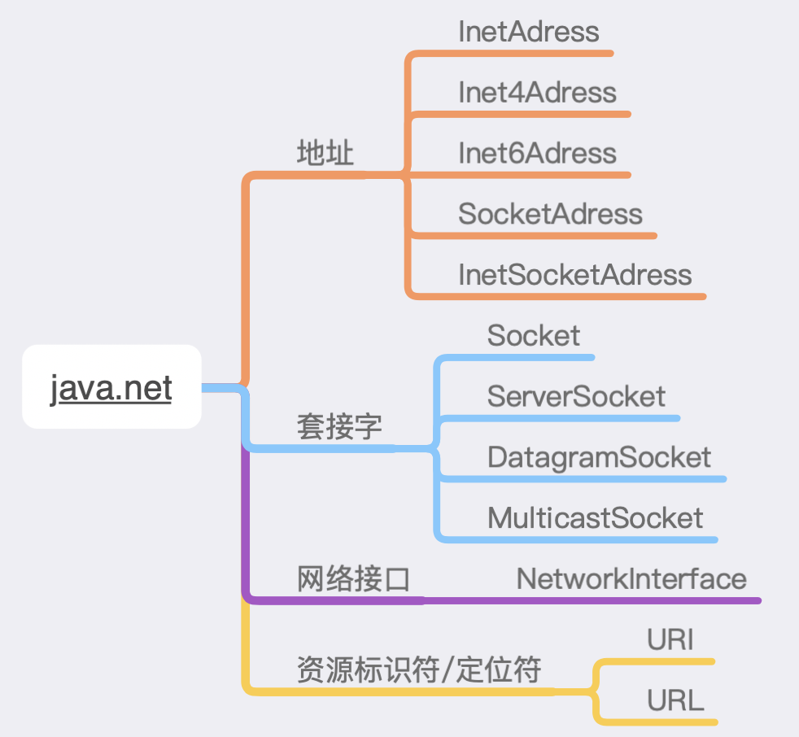

## java.net包分类

`java.net`包下常用的功能大致分为如下几个部分：



## 地址

地址(IP)是指主机地址或者用作主机的标识符或者用作套接字端点标识符。
例如：主机的IP地址为123.123.123.123，主机的Host为“COM12345”。

地址最常用的类是`InetAddress`，它表示Internet协议下IP地址。它的用法如下：

```java
// 获取本机的IP地址和主机名
try {
    InetAddress address = InetAddress.getLocalHost();
    System.out.println("IP地址: " + address.getHostAddress());
    System.out.println("主机名 : " + address.getHostName());
} catch (UnknownHostException e) {
    e.printStackTrace();
}
```

根据IP地址或者主机名获得`InetAddress`：

```java
try {
    InetAddress address = InetAddress.getByName("123.123.123.123");
    System.out.println("IP地址: " + address.getHostAddress());
    System.out.println("主机名 : " + address.getHostName());
} catch (UnknownHostException e) {
    e.printStackTrace();
}
```


## 套接字

在客户机/服务器工作模式中，在Server端，要准备接受多个Client端计算机的通信。为此，除用IP地址标识Internet上的计算机之外，另外还引入端口号，用端口号标识正在Server端后台服务的线程。端口号与IP地址的组合称为`网络套接字（socket）`。

`java.net` 包提供 4 种套接字：

- `Socket`： 是 TCP 客户端 API，通常用于连接远程主机。
- `ServerSocket`： 是 TCP 服务器 API，通常接受源于客户端套接字的连接。
- `DatagramSocket`： 是 UDP 端点 API，用于发送和接收数据包。
- `MulticastSocket` ：是 DatagramSocket 的子类，在处理多播组时使用。

使用 TCP 套接字的发送和接收操作需要借助 InputStream 和 OutputStream 来完成，这两者是通过`Socket.getInputStream()` 和 `Socket.getOutputStream()` 方法获取的。


### Socket

`socket`可以使一个应用从网络中读取及向写入数据，不同计算机上的两个应用可以通过连接发送和接收字节流，当发送消息时，需要知道对方的`ip`和端口，在java中，socket指的是`java.net.Socket`类。 

在`java.net.Socket`中，可以看到socket有多种构造函数：

```java
public Socket()
public Socket(Proxy proxy)
protected Socket(SocketImpl impl)
public Socket(String host, int port)
public Socket(InetAddress address, int port)
public Socket(String host, int port, InetAddress localAddr, int localPort)
public Socket(InetAddress address, int port, InetAddress localAddr, int localPort)
```

以`public Socket(String host, int port)`为例

+ `host`为远程机器名称或`ip`地址
+ `port`为端口号。若连接本地的Server，其端口号为8080，可以写成如下格式 `new Socket(“localhost”, 8080);`

一旦成功创建一个Socket类的实例，可以用它来发送和接收字节流

+ 发送时调用`getOutputStream`方法获取一个`java.io.OutputStream`对象
+ 接收远程对象发送来的信息可以调用`getInputStream`方法来返回一个`java.io.InputStream`对象


### ServerSocket

Socket类代表一个`客户端`套接字，即任何时候连接到一个远程服务器应用时构建所需的socket。现在，要实现一个服务器应用，需要不同的做法。服务器需随时待命，因为不知道客户端什么时候会发来请求，此时，我们需要使用ServerSocket，对应的是`java.net.ServerSocket`类。

ServerSocket与Socket不同，ServerSocket是等待客户端的请求，一旦获得一个连接请求，就创建一个Socket实例来与客户端进行通信。 

ServerSocket的构造函数如下：

```java
ServerSocket(SocketImpl impl)
public ServerSocket()
public ServerSocket(int port)
public ServerSocket(int port, int backlog)
public ServerSocket(int port, int backlog, InetAddress bindAddr)

```

>无参构造方法`public ServerSocket()` 

ServerSocket 有一个不带参数的默认构造方法，通过该方法创建的 ServerSocket 不与任何端口绑定，接下来还需要通过 `bind()`方法与特定端口绑定。

这个默认构造方法的用途是，允许服务器在绑定到特定端口之前，先设置ServerSocket 的一些选项。因为一旦服务器与特定端口绑定，有些选项就不能再改变了。

例如：

```java
ServerSocket serverSocket = new ServerSocket();
serverSocket.setReuseAddress(true);             //设置 ServerSocket 的选项
serverSocket.bind(new InetSocketAddress(8080)); //然后与 8080 端口绑定
```

如果把以上程序改成：

```java
ServerSocket serverSocket = new ServerSocket(8080);
serverSocket.setReuseAddress(true);    //设置 ServerSocket 的选项
```

那么`serverSocket.setReuseAddress(true)` 方法便不再奏效。

我们也可以使用如下构造函数创建一个ServerSocket实例：

```java
ServerSocket serverSocket = new ServerSocket(port, 3); 
```

将连接请求队列的长度设为 3。这意味着当队列中有了 3 个连接请求时，如果 Client 再请求连接，就会被 Server拒绝，因为服务器队列已经满了。我们使用的 `serverSocket.accept()`方法就是从队列中取出连接请求。 


**客户端向服务器发送请求可分为以下步骤**： 

1. 创建一个Socket实例
2. 利用I/O流与服务器进行通信
3. 关闭socket

**服务器接收客户端请求步骤**：

1. 创建一个ServerSocket实例，监听客户端发来的请求
2. 与客户端获取连接后，创建一个Socket实例
3. 利用I/O流与客户端进行通信
4. 完毕后关闭Socket

当然，服务器可以接收多个客户端的请求，所以如果服务器是一个一个顺序响应肯定会带来不好的体验，因此使用多线程来为多个客户端提供服务 

**Client代码**：

```java
package testSocket;

import java.io.BufferedReader;
import java.io.IOException;
import java.io.InputStreamReader;
import java.io.PrintStream;
import java.net.Socket;

/**
 * @Author Hory
 * @Date 2020/11/14
 */
public class Client {

    public static final int port = 8080;
    public static final String host = "localhost";

    public static void main(String[] args) {
        System.out.println("Client Start...");
        while(true){
            Socket socket = null;
            try {
                //创建一个流套接字并将其连接到指定主机上的指定端口号
                socket = new Socket(host, port);

                //读取服务器端数据
                BufferedReader input = new BufferedReader(new InputStreamReader(socket.getInputStream()));

                //向服务器端发送数据
                PrintStream out = new PrintStream(socket.getOutputStream());
                System.out.print("请输入: \t");
                String str = new BufferedReader(new InputStreamReader(System.in)).readLine();
                out.println(str);

                String ret = input.readLine();
                System.out.println("服务器端返回过来的是: " + ret);
                // 如接收到 "OK" 则断开连接
                if ("OK".equals(ret)) {
                    System.out.println("客户端将关闭连接");
                    Thread.sleep(500);
                    break;
                }
                out.close();
                input.close();
            } catch (Exception e) {
                System.out.println("客户端异常:" + e.getMessage());
            } finally {
                if (socket != null) {
                    try {
                        socket.close();
                    } catch (IOException e) {
                        socket = null;
                        System.out.println("客户端 finally 异常:" + e.getMessage());
                    }
                }
            }

        }

    }
}
```

**Server代码**:

```java
package testSocket;

import java.io.BufferedReader;
import java.io.InputStreamReader;
import java.io.PrintStream;
import java.net.ServerSocket;
import java.net.Socket;

/**
 * @Author Hory
 * @Date 2020/11/14
 */
public class Server {
    public static final int port = 8080;//监听的端口号

    public static void main(String[] args) {
        System.out.println("Server...\n");
        Server server = new Server();
        server.init();
    }

    public void init() {
        try {
            //创建一个ServerSocket，这里可以指定连接请求的队列长度
            //new ServerSocket(port,3);意味着当队列中有3个连接请求是，如果Client再请求连接，就会被Server拒绝
            ServerSocket serverSocket = new ServerSocket(port);
            while (true) {
                //从请求队列中取出一个连接
                Socket client = serverSocket.accept();
                // 处理这次连接
                new HandlerThread(client);
            }
        } catch (Exception e) {
            System.out.println("服务器异常: " + e.getMessage());
        }
    }

    private class HandlerThread implements Runnable {
        private Socket socket;
        public HandlerThread(Socket client) {
            socket = client;
            new Thread(this).start();
        }

        public void run() {
            try {
                // 读取客户端数据
                BufferedReader input = new BufferedReader(new InputStreamReader(socket.getInputStream()));
                String clientInputStr = input.readLine();//这里要注意和客户端输出流的写方法对应,否则会抛 EOFException
                // 处理客户端数据
                System.out.println("客户端发过来的内容:" + clientInputStr);

                // 向客户端回复信息
                PrintStream out = new PrintStream(socket.getOutputStream());
                System.out.print("请输入:\t");
                // 发送键盘输入的一行
                String s = new BufferedReader(new InputStreamReader(System.in)).readLine();
                out.println(s);

                out.close();
                input.close();
            } catch (Exception e) {
                System.out.println("服务器 run 异常: " + e.getMessage());
            } finally {
                if (socket != null) {
                    try {
                        socket.close();
                    } catch (Exception e) {
                        socket = null;
                        System.out.println("服务端 finally 异常:" + e.getMessage());
                    }
                }
            }
        }
    }
}
```

结果如下：

Client端：

```
Client Start...
请输入: 	我需要一张图片
服务器端返回过来的是: adsa.jpg
请输入: 	我这边没啥需要了
服务器端返回过来的是: OK
客户端将关闭连接
```

server端：

```
Server...

客户端发过来的内容:我需要一张图片
请输入:	adsa.jpg
客户端发过来的内容:我这边没啥需要了
请输入:	OK
```


## 网络接口

网络接口在`java.net`包中特指`NetworkInterface`类，它提供 API 以浏览和查询本地机器的所有网络接口（例如，以太网连接或 PPP 端点）。只有通过该类才可以检查是否将所有本地接口都配置为支持 IPv6。

一般用它来获取某一个网卡的信息，或者本机所有网卡的信息，用法如下：

```java
try {
    // 通过真实的网卡名获取接口
    NetworkInterface ni = NetworkInterface.getByName("eth4");

    // 通过InetAddress获取接口
    InetAddress address = InetAddress.getLocalHost();
    NetworkInterface ni1 = NetworkInterface.getByInetAddress(address);

    // 获取本机所有网络接口
    Enumeration<NetworkInterface> nis = NetworkInterface.getNetworkInterfaces();
    while (nis.hasMoreElements()) {
        // ...
    }

} catch (SocketException e) {
    e.printStackTrace();
} catch (UnknownHostException e) {
    e.printStackTrace();
}
```


## 资源标识符/定位符

### URI

**URI:** 全称统一资源标识符，它是一种采用特定的语法标识一个资源的字符串表示，简记为它是标识一个资源的字符串。

**它的格式为**：

|     `模式：模式特定部分`      |
| :---------------------------: |
| `scheme:scheme specific part` |

> `scheme`一般格式有:

- `data:`链接中直接包含经过BASE64编码的数据
- `file:`本地磁盘上的文件
- `ftp:`FTP服务器
- `http:`使用超文本传输协议
- `mailto:`电子邮件的地址

> `scheme specific part`没有特别的要求，但一般都遵守同一种结构形式：

+ `授权机构/路径?查询参数`
+ `authority/path?query`

例如：

+ `http://www.baidu.com/s?ie=utf-8`


> URI获取各个模式部分：

```java
URI uri = URI.create("http://www.baidu.com/s?ie=UTF-8");
System.out.println(uri.getScheme()); // http
System.out.println(uri.getAuthority()); // www.baidu.com
System.out.println(uri.getHost()); // www.baidu.com
System.out.println(uri.getPath()); // /s
System.out.println(uri.getPort()); // -1
System.out.println(uri.getRawQuery()); // ie=UTF-8
```


> 解析URI：

```java
URI uri1 = URI.create("http://www.baidu.com:8080/abc.html");
URI uri2 = URI.create("/replace.html");

// 替换URL路径
URI uri = uri1.resolve(uri2);
System.out.println(uri); // http://www.baidu.com:8080/replace.html

URI uri3 = URI.create("http://www.baidu.com:8080/");
// 解析出相对路径
URI uriNew = uri3.relativize(uri1);
System.out.println(uriNew); // abc.html
```


### URL

**URL**：也就是统一资源位置。实际上，URL就是一种特殊的URI，它除了标识一个资源，还会为资源提供一个特定的网络位置，客户端可以通过它来获取URL对应的资源。

它的格式为：

| `protocol://userInfo@host:port/path?query#fragment` |
| :-------------------------------------------------: |
|    `协议://用户信息@主机名:端口/路径?查询#片段`     |

> 创建URL的几种方式：

```java
URL url = new URL("http", "192.168.123.123", 8080, "/index");
System.out.println(url.toString()); // http://192.168.123.123:8080/index

URL url1 = new URL("http://192.168.123.123:8080/index"); 
System.out.println(url1.toString()); // http://192.168.123.123:8080/index

URL url2 = new URL("http", "192.168.123.123", "/index");
System.out.println(url2.toString()); // http://192.168.123.123/index

URL context = new URL("http", "192.168.123.123", "/index");
URL url3 = new URL(context, "/login");
System.out.println(url3.toString()); // http://192.168.123.123/login
```


> URL中常用的方法：

```java
// 输出网络地址的内容
URL url = new URL("https://www.baidu.com");
InputStream stream = url.openStream();
byte[] bytes = new byte[1024];
while (stream.read(bytes, 0, bytes.length) != -1) {
    String str = new String(bytes);
    System.out.println(str);
}
stream.close();


//获取模式(协议)
url.getProtocol()

//获取主机名
url.getHost()

//获取授权机构,一般是host:port的形式
url.getAuthority()

//获取端口号port
url.getPort()

//返回协议的默认端口，如http协议的默认端口号为80，如果没有指定协议的默认端口则返回-1
url.getDefaultPort()

//返回URL字符串中从主机名后的第一个斜杆/一直到片段标识符的#字符之前的所有字符
//https://localhost:8080/search?name=doge#anchor-1
url.getFile() //  /search?name=doge

//返回的值和getFile()相似，但是不包含查询字符串
//https://localhost:8080/search?name=doge#anchor-1
url.getPath() // /search

//返回URL的片段标识符部分
url.getRef()

//返回URL的查询字符串
url.getQuery()

//返回URL中的用户信息,不常用
url.getUserInfo()
```

> URL的编码

URL的编码：URL出现的时候，Unicode没有普及，因此当时规定字符必须是ASCII中的子集。所以，其他字符要使用时，必须经过编码转换成ASCII码后才能识别。

```java
String baseUrl = "http://localhost:9090";
String path = "/index?name=派大星doge";
String encode = URLEncoder.encode(path, "UTF-8");
System.out.println(baseUrl + encode); // http://localhost:9090%2Findex%3Fname%3D%E6%B4%BE%E5%A4%A7%E6%98%9Fdoge

String decode = URLDecoder.decode(encode, "UTF-8");
System.out.println(baseUrl + decode); // http://localhost:9090/index?name=派大星doge
```


