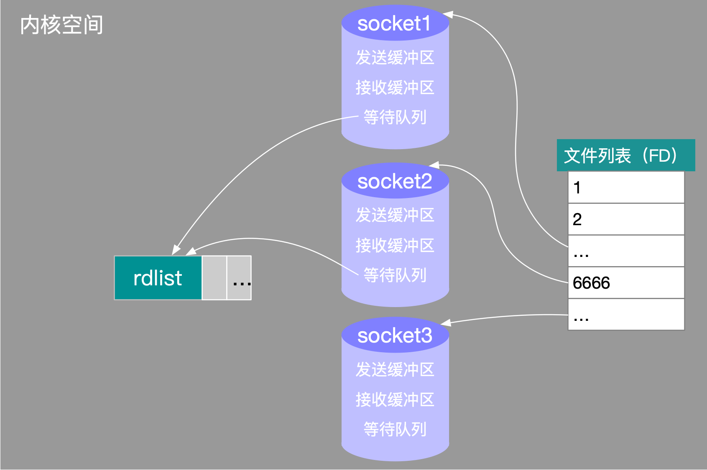

# Mac

> 获取某个进程的PID

获取进程信息及 PID，NAME 为进程名，大多数为程序名(如: python)

```bash
ps -e | grep "NAME"
```

或者

```bash
ps -e | grep "NAME" | awk '{print $1}'
```

杀死进程

```bash
kill -9 PID
```


> Mac 磁盘目录

`Machintosh HD -> Users -> superfarr`

打开终端则处于 ~ 下（即 superfarr）

进入 superfarr 下：

```shell
cd ~
```

进入 Machintosh HD 下：

```shell
cd /
```


> 终端查看 本机 ip

```shell
ifconfig | grep "inet"
```


> 终端换颜色

**⌥ + ⌘ + i**


> 打开环境变量设置文件

```shell
open -e .bash_profile
```


> 终端显示/关闭隐藏目录/文件

**显示**：

```shell
defaults write com.apple.finder AppleShowAllFiles TRUE
```

```shell
killall Finder
```

在终端中输入上面的两行命令之后将允许在 Finder 显示 Mac 上的所有隐藏文件。

第一行告诉 Finder 显示所有文件，无论隐藏标志是如何设置的。第二行停止并重新启动 Finder，因此更改将生效。

**关闭**：

```shell
defaults write com.apple.finder AppleShowAllFiles FALSE
```

```shell
killall Finder
```


> 查看进程列表

在“终端”窗口中键入 `top`，将看到当前正在运行的进程的列表。列表的顶部是对正在运行的进程及其消耗的资源的概述。


> 强行关闭程序

**方法一**：组合键直接关闭

鼠标箭头点到需要被关闭的程序，然后按住`Command + Option + Shift + Esc`键一两秒，直到应用被强制退出。

**方法二**：调出“强制退出应用”窗口。

按下 `Command + Option + Esc` 键，在弹出的“强制退出应用”窗口中点选要退出的应用名称。

**方法三**：终端执行`kill -9 PID`


> 终端报错：-bash: rpm: command not found

原因：Mac 里没有这个命令，所以需要安装

解决方案：

首先执行该命令，等待返回结果，查看是否有 rpm 命令

```shell
brew search rpm
```

发现没有之后，就执行安装，则系统就会安装 homebrew 内置的 rpm 命令

```shell
brew install rpm
```


> 终端报错：-bash: yum: command not found

Yum（全称为 Yellow dog Updater, Modified）是一个在 Fedora 和 RedHat 以及 CentOS 中的 Shell 前端软件包管理器。基于RPM包管理，能够从指定的服务器自动下载 RPM 包并且安装，可以自动处理依赖性关系，并且一次安装所有依赖的软件包，无须繁琐地一次次下载、安装。yum 提供了查找、安装、删除某一个、一组甚至全部软件包的命令，而且命令简洁而又好记。

查看有无 yum安装包：

```shell
rpm -qa |grep yum
```

有的话先卸载：

```shell
rpm -aq|grep yum|xargs rpm -e --nodeps
```

然后去 http://mirrors.163.com/centos/6/os/x86_64/Packages/ 下载如下RPM包：

+ python-iniparse-0.3.1-2.1.el6.noarch.rpm
+ yum-metadata-parser-1.1.2-16.el6.x86_64.rpm
+ yum-3.2.29-81.el6.centos.noarch.rpm
+ yum-plugin-fastestmirror-1.1.30-41.el6.noarch.rpm

安装：

```shell
rpm -ivh --force --nodeps python-iniparse-0.3.1-2.1.el6.noarch.rpm
```

```shell
rpm -ivh --force --nodeps yum-metadata-parser-1.1.2-16.el6.x86_64.rpm
```

```shell
rpm -ivh --force --nodeps python-urlgrabber-3.9.1-11.el6.noarch.rpm
```

最后两个包需一起安装：

```
rpm -ivh --force --nodeps yum-3.2.29-81.el6.centos.noarch.rpm yum-plugin-fastestmirror-1.1.30-41.el6.noarch.rpm
```


到了这一步还是会出现错误：


接着需要到提示的网站：http://yum.baseurl.org/wiki/ 中下载 `yum-3.4.3.tar.gz`

解压命令：

```shell
tar -zxvf yum-3.4.3.tar.gz   
```

解压后进到 yum-3.4.3目录执行：

```shell
./yummain.py update
```

按照提示完成安装后，执行 yum，就可以正常使用了。


# Linux

[菜鸟教程](https://www.runoob.com/linux/linux-tutorial.html)

[看完这篇Linux基本的操作就会了——Java3y](https://zhuanlan.zhihu.com/p/36801617#showWechatShareTip)

## Linux 简介

> **简介**

**类 Unix 系统** ：Linux 是一种自由、开放源码的类似 Unix 的操作系统

**Linux 本质是指 Linux 内核** ：严格来讲，Linux 这个词本身只表示 Linux 内核，单独的 Linux 内核并不能成为一个可以正常工作的操作系统，所以，就有了各种 Linux 发行版。

**Linus Torvalds** ：是 Linux 内核 的最早作者，随后发起了这个开源项目，担任 Linux 内核的首席架构师。他还发起了 Git 这个开源项目，并作为主要的开发者。

> **Linux vs Unix**

1. **开源情况**

UNIX 是商业化的，而 Linux 是开源的。

2. **硬件适用**

UNIX 系统大多是与硬件配套的，意思就是，大多数UNIX系统如AIX、HP-UX等是无法安装在 x86 服务器和个人计算机上的，因为UNIX是商业的嘛。

Linux 则可以运行在多种硬件平台上。

> **常见的 Linux 发行版本有哪些？**

Linux的作者 Linus Torvalds 开源的只是 Linux 的内核。

+ Linux 内核可以理解为相当于汽车的发动机引擎，它提供了操作系统的核心功能
+ 具体地说，内核主要负责系统的`内存管理`、`硬件设备管理`、`文件系统管理`以及`应用程序管理`等

一些组织或厂商将 Linux 内核与各种软件和文档包装起来，并提供系统安装界面和系统配置、设定与管理工具，就构成了 Linux 的发行版本。

+ 这就好比给引擎上了不同的外壳，并提供一些附属功能

**Linux 的发行版本可以大体分为两类**：

1. 商业公司维护的发行版本，以著名的 `Red Hat` 为代表，比较典型的有 `CentOS`

2. 社区组织维护的发行版本，以 `Debian` 为代表，比较典型的有 `Ubuntu`、`Debian`

对于初学者学习 Linux ，推荐选择 CentOS

## Linux 文件

> **简介**

在 Linux 操作系统中，所有被操作系统管理的资源，例如`网络接口卡`、`磁盘驱动器`、`打印机`、`输入输出设备`、`普通文件`或是`目录`都被看作是一个`文件`。 也就是说在 Linux 系统中有一个重要的概念：`一切皆文件`！！。

+ 其实这也是 UNIX 哲学的一个体现，在 UNIX 系统中，把一切资源都看作是文件，Linux 的文件系统也是借鉴了 UNIX 文件系统。

> **inode**

`inode` 是 linux/unix 文件系统的基础。那么，inode 是什么？有什么作用呢？

硬盘的最小存储单位是扇区(Sector)，块(block)由多个扇区组成，文件数据存储在[块](https://www.cnblogs.com/jswang/p/9071847.html)中。块的最常见的大小是 4kb，约为 8 个连续的扇区组成（每个扇区存储 512 字节）。一个文件可能会占用多个块，但是一个块只能存放一个文件。

虽然，我们将文件存储在了块中，但是还需要一个空间来存储文件的`元信息 metadata` ，也称为`“元数据”`

+ 元信息就是描述信息的信息。
+ 比如我们能够记住一个world文件的大概内容以及该文件所在的电脑位置，这样当我们需要的时候就可以直接找到它，这个描述world文件的大概内容及所在位置的信息就是元信息，只不过这个元信息是在我们的大脑中，而在计算机中要存在磁盘里。
+ 再如某个文件被分成几块、每一块所在的地址、文件拥有者、创建时间、权限、大小等。这种 `存储文件元信息的区域就叫 inode`，译为`索引节点`：`i（index）+ node`。每个文件都有一个 inode，存储文件的元信息。
+ 举个`innode`应用的例子：当一个文件从一个目录移到另一个目录中时（前提是两个目录在同一磁盘分区下），在这种情况下，文件在磁盘中的物理位置是没有改变的（这也是为什么移动的速度在瞬间发生，因为物理位置没有改变，也就不会发生不同磁盘之间的文件复制），唯一得到更新的就是文件系统`索引节点（inode）`的元数据信息，例如文件所占存储区块等信息。

**可以使用 `stat` 命令可以查看文件的 inode 信息**。

+ 每个 inode 都有一个号码，Linux/Unix 操作系统不使用文件名来区分文件，而是使用 inode 号码区分不同的文件。

**总结**：

- **inode** ：用来维护某个文件被分成几块、每一块所在的地址、文件拥有者、创建时间、权限、大小等信息，即记录文件的属性信息。可以使用 `stat` 命令查看 `inode` 信息。
- **block** ：实际文件的内容，如果一个文件大于一个块时候，那么将占用多个 block，但是一个块只能存放一个文件。（因为数据是由 inode 指向的，如果有两个文件的数据存放在同一个块中，就会乱套了）

> **文件类型**

Linux 支持很多文件类型: `普通文件`、`目录文件`、`链接文件`、`设备文件`、`管道文件`、`Socket 套接字文件`等。

**普通文件（-）**

+ 用于存储信息和数据， Linux 用户可以根据访问权限对普通文件进行查看、更改和删除。比如：图片、声音、PDF、text、视频、源代码等等。

**目录文件（d / directory file）** 

+ 目录也是文件的一种（比如一个空的文件夹也是一个文件），用于表示和管理系统中的文件，目录文件中包含一些文件名和子目录名，打开目录事实上就是打开目录文件。

**符号链接文件（l / symbolic link）** 

+ 保留了指向文件的地址而不是文件本身。

**字符设备（c / char）** 

+ 用来访问字符设备比如硬盘。

**设备文件（b / block）** 

+ 用来访问块设备比如硬盘、软盘。

**管道文件（p / pipe）** 

+ 一种特殊类型的文件，用于进程之间的通信。

**套接字（s / socket）**

+ 用于进程间的网络通信，也可以用于本机之间的非网络通信。

> **Linux 目录树**

所有可操作的计算机资源都存在于目录树这个结构中，对计算资源的访问，可以看做是对这棵目录树的访问。

Linux 的目录结构如下：


**常见目录说明：**

+ **/root：** 超级用户（系统管理员）的主目录（特权阶级）；
+ **/boot：** 存放用于`系统引导`时使用的各种文件；

- **/bin：** 存放二进制可执行文件(`ls`、`cat`、`mkdir` 等)，常用命令一般都在这里；
- **/sbin：** 存放二进制可执行文件，只有 root 才能访问。这里存放的是系统管理员使用的系统级别的管理命令和程序，如 `ifconfig` 等；
- **/dev：** 用于存放`设备文件`；
- **/etc：** 存放`系统管理`和`配置文件`；
- **/home：** 存放所有用户文件的`根目录`，是用户主目录的基点，比如用户 user 的主目录就是/home/user，可以用~user 表示；
- **/lib ：** 存放和`系统`运行相关的`库`文件 ；
- **/lost+found：** 这个目录平时是空的，系统非正常关机而留下“无家可归”的文件就在这里。
- **/mnt：** 系统管理员安装`临时文件系统`的安装点，系统提供这个目录是让用户临时挂载其他的文件系统；
- **/opt：** 额外安装的`可选`应用程序包所放置的位置，一般情况下，我们可以把 Tomcat 等都安装到这里；
- **/proc：** `虚拟文件系统`目录，是`系统内存`的映射，可直接访问这个目录来获取系统信息；
- **/usr ：** 用于存放`系统`应用程序；
- **/tmp：** 用于存放各种`临时文件`，是公用的临时文件存储点；
- **/var：** 用于存放运行时需要改变数据的文件，也是某些大文件的溢出区，比方说各种服务的日志文件（系统启动日志）等；

## Linux 基本命令

[Linux 命令大全](http://man.linuxde.net/)


### 清屏

```shell
clear
```

或者快捷键  `ctrl + l​`


### 目录操作

> **目录切换**

- **`cd usr`：** 切换到该目录下 usr 目录
- **`cd ..（或cd../）`：** 切换到上一层目录
- **`cd /`：** 切换到系统根目录
- **`cd ~`：** 切换到用户主目录
- **`cd -`：** 切换到上一个操作所在目录

> **目录增删改查**


**`mkdir 目录名称`**

+  创建目录（文件夹）。例如：`mkdir class` 就是创建一个名为 `class` 的文件夹


**`ls / ll`**

+ `ls`全称`List information about the FILEs`，可查看目录信息（只显示该目录下有哪些文件夹和文件名）
+ `ll` 是 `ls -l` 的别名，`ll` 命令可以看到该目录下的所有目录和文件的详细信息


**`find 目录 参数`**

+ 寻找目录。示例：

  ① 列出当前目录及子目录下所有文件和文件夹： `find .`

  ② 例如在`/home`目录下查找以`.txt` 结尾的文件名:`find /home -name "*.txt"` 

  忽略大小写: `find /home -iname "*.txt"`


+ ③ 当前目录及子目录下查找所有以`.txt` 和`.pdf` 结尾的文件：

	`find . \( -name "*.txt" -o -name "*.pdf" \)`或

	`find . -name "\*.txt" -o -name "*.pdf"` 

	其中  `\( `  和   `-name` 之间应有空格，`\)` 前也应有空格


**`mv`**

+ 全称`document move`

+ 使用`mv`命令来为文件或目录改名或将文件由一个目录移入另一个目录中

**`mv 目录名称 新目录名称`**

+ 修改目录的名称，即重命名。

**`mv 目录名称 目录的新位置`**

+ 移动目录的位置（剪切）

+ 例如：将文件 `list.txt` 移动到桌面

+ ```shell
	mv list.txt /Users/superfarr/Desktop
	```


**`cp -r 目录名称 目录拷贝的目标位置`**

+ 拷贝文件或目录，`-r` 全称`recursion`，代表递归拷贝。
+ 注意：`cp` 命令不仅可以拷贝目录还可以拷贝文件，压缩包等，拷贝文件和压缩包时不用写 `-r` 递归。

+ 将目录 `list` 拷贝到桌面

+ ```shell
	cp -r list /Users/superfarr/Desktop
	```

+ 将文件 `list.txt` 复制到桌面

+ ```shell
	cp list.txt /Users/superfarr/Desktop
	```


**`rm 文件/压缩包` **

**`rm -rf 目录/文件/压缩包` **

+ `-rf` 中`r`全称`recursion`代表递归，`f`则是无提示强制删除
+ 注意：`rm` 不可以删除目录，只能删除文件或压缩包。为了增强大家的记忆， 无论删除任何目录或文件，都直接使用`rm -rf` 目录/文件/压缩包。


### 文件操作

> 文件的操作命令(增删改查)

**`touch 文件名称`**

+ 创建文件


**`cat/more/less/tail 文件名称`**

+ 查看文件
+ `cat`全称`concatenate`
+ 
+ 命令 `tail -f 文件` 可以对某个文件进行动态监控，例如 tomcat 的日志文件， 会随着程序的运行，日志会变化，可以使用 `tail -f catalina-2016-11-11.log` 监控 文 件的变化 。

例如：

```shell
cat README.md
```

可以查看文件 README.md 中的内容

**`vim 文件`：** 修改文件的内容（改）。vim 编辑器是 Linux 中的强大组件，是 vi 编辑器的加强版，vim 编辑器的命令和快捷方式有很多，但此处不一一阐述，大家也无需研究的很透彻，使用 vim 编辑修改文件的方式基本会使用就可以了。在实际开发中，使用 vim 编辑器主要作用就是修改配置文件，下面是一般步骤：`vim 文件------>进入文件----->命令模式------>按i进入编辑模式----->编辑文件 ------->按Esc进入底行模式----->输入：wq/q!` （输入 wq 代表写入内容并退出，即保存；输入 q!代表强制退出不保存）。

+ Mac下是 按Esc进入底行模式-----> shift + : ----->输入：wq/q!

此外，`shift + :`  -->  输入 `set nu`      表示显示行号

**`rm -rf 文件`：** 删除文件（删）。


### 压缩文件的操作

<font color=DarkOrchid>**打开并压缩文件**：</font>

Linux 中的打包文件一般是以.tar 结尾的，压缩的命令一般是以.gz 结尾的。而一般情况下打包和压缩是一起进行的，打包并压缩后的文件的后缀名一般.tar.gz。命令：`tar -zcvf 打包压缩后的文件名 要打包压缩的文件` ，其中：

- z：调用 gzip 压缩命令进行压缩
- c：打包文件
- v：显示运行过程
- f：指定文件名

比如：假如 test 目录下有三个文件分别是：aaa.txt      bbb.txt     ccc.txt，如果我们要打包 test 目录并指定压缩后的压缩包名称为 test.tar.gz 可以使用命令：

```shell
tar -zcvf test.tar.gz aaa.txt bbb.txt ccc.txt
```

或者

```shell
tar -zcvf test.tar.gz /test/
```


<font color=DarkOrchid>**解压压缩包**：</font>

命令：

```shell
tar -xvf 压缩文件
```

其中：x：代表解压

示例：

- 将 /test 下的 test.tar.gz 解压到当前目录下可以使用命令：**`tar -xvf test.tar.gz`**
- 将 /test 下的 test.tar.gz 解压到根目录/usr 下:**`tar -xvf test.tar.gz -C /usr`**（-C 代表指定解压的位置）


### Linux 的权限命令

操作系统中的每个文件都拥有特定的权限、所属用户和所属组。权限是操作系统用来限制资源访问的机制，在 Linux 中权限一般分为读(readable)、写(writable)和执行(excutable)，分为三组。分别对应文件的属主(owner)，属组(group)和其他用户(other)，通过这样的机制来限制哪些用户、哪些组可以对特定的文件进行什么样的操作。

通过 **`ls -l`** 命令我们可以 查看某个目录下的文件或目录的权限。

示例：在随意某个目录下`ls -l`


① 文件类型

+ `d` 代表目录
+ `-` 代表文件
+ `|` 代表软链接（可以认为是 window 中的快捷方式）

② 属主权限

+ `r` 代表权限是可读，r 也可以用数字 4 表示
+ `w` 代表权限是可写，w 也可以用数字 2 表示
+ `x` 代表权限是可执行，x 也可以用数字 1 表示

③ 属组权限

④ 其他用户权限

+ `r--` 无操作权限


**文件和目录权限的区别：**

> 对文件和目录而言，读写执行表示不同的意义。

| 权限名称 |       文件可执行操作        |      目录可执行操作      |
| :------: | :-------------------------: | :----------------------: |
|    r     | 可以使用 cat 查看文件的内容 |    可以查看目录下列表    |
|    w     |     可以修改文件的内容      | 可以创建和删除目录下文件 |
|    x     |  可以将其运行为二进制文件   |   可以使用 cd 进入目录   |

需要注意的是：**超级用户可以无视普通用户的权限，即使文件目录权限是 000，依旧可以访问。**

**在 linux 中的每个用户必须属于一个组，不能独立于组外。在 linux 中每个文件有所有者、所在组、其它组的概念。**

- **所有者(u)** ：一般为文件的创建者，谁创建了该文件，就天然的成为该文件的所有者，用 `ls ‐ahl` 命令可以看到文件的所有者 也可以使用 chown 用户名 文件名来修改文件的所有者 。
- **文件所在组(g)** ：当某个用户创建了一个文件后，这个文件的所在组就是该用户所在的组用 `ls ‐ahl`命令可以看到文件的所有组也可以使用 chgrp 组名 文件名来修改文件所在的组。
- **其它组(o)** ：除文件的所有者和所在组的用户外，系统的其它用户都是文件的其它组。

> 我们再来看看如何修改文件/目录的权限。

**修改文件/目录的权限的命令：`chmod`**

示例：修改/test 下的 aaa.txt 的权限为文件所有者有全部权限，文件所有者所在的组有读写权限，其他用户只有读的权限。

```sh
chmod u=rwx,g=rw,o=r aaa.txt
```

或者

```sh
chmod 764 aaa.txt
```

**补充一个比较常用的东西:**

假如我们装了一个 zookeeper，我们每次开机到要求其自动启动该怎么办？

1. 新建一个脚本 zookeeper
2. 为新建的脚本 zookeeper 添加可执行权限，命令是:`chmod + x zookeeper`
3. 把 zookeeper 这个脚本添加到开机启动项里面，命令是：`chkconfig --add zookeeper`
4. 如果想看看是否添加成功，命令是：`chkconfig --list`


### Linux 用户管理

> Linux 系统是一个多用户多任务的分时操作系统，任何一个要使用系统资源的用户，都必须首先向系统管理员申请一个账号，然后以这个账号的身份进入系统。

> 用户的账号一方面可以帮助系统管理员对使用系统的用户进行跟踪，并控制他们对系统资源的访问；另一方面也可以帮助用户组织文件，并为用户提供安全性保护。

<font color=DarkOrchid>**Linux 用户管理相关命令:**</font>

- `useradd 选项 用户名`:添加用户账号
- `userdel 选项 用户名`:删除用户帐号
- `usermod 选项 用户名`:修改帐号
- `passwd 用户名`:更改或创建用户的密码
- `passwd -S 用户名` :显示用户账号密码信息
- `passwd -d 用户名`: 清除用户密码

`useradd` 命令用于 Linux 中创建的新的系统用户。`useradd`可用来建立用户帐号。帐号建好之后，再用`passwd`设定帐号的密码。可用`userdel`删除帐号。使用`useradd`指令所建立的帐号，实际上是保存在 `/etc/passwd`文本文件中。

`passwd`命令用于设置用户的认证信息，包括用户密码、密码过期时间等。系统管理者则能用它管理系统用户的密码。只有管理者可以指定用户名称，一般用户只能变更自己的密码。


### Linux 系统用户组的管理

>每个用户都有一个用户组，系统可以对一个用户组中的所有用户进行集中管理。不同 Linux 系统对用户组的规定有所不同，如 Linux 下的用户属于与它同名的用户组，这个用户组在创建用户时同时创建。

用户组的管理涉及用户组的添加、删除和修改。组的增加、删除和修改实际上就是对`/etc/group`文件的更新。

<font color=DarkOrchid>**Linux 系统用户组的管理相关命令:**</font>

- `groupadd 选项 用户组` :增加一个新的用户组
- `groupdel 用户组`:要删除一个已有的用户组
- `groupmod 选项 用户组` : 修改用户组的属性


### 其他常用命令

**`pwd`：** 显示当前所在位置

**`sudo + 其他命令`** ：以系统管理者的身份执行指令，也就是说，经由 sudo 所执行的指令就好像是 root 亲自执行。

**`grep 要搜索的字符串 要搜索的文件 --color`：** 搜索命令，--color 代表高亮显示

**`ps -ef`/`ps -aux`：** 这两个命令都是查看当前系统正在运行的进程，两者的区别是展示格式不同。如果想要查看特定的进程可以使用这样的格式：**`ps aux|grep redis`** （查看包括 redis 字符串的进程），也可使用 **`pgrep redis -a`**。注意：如果直接用 ps（Process Status）命令，会显示所有进程的状态，通常结合 grep 命令查看某进程的状态。

**`kill -9 进程的pid`：** 杀死进程（-9 表示强制终止。）先用 ps 查找进程，然后用 kill 杀掉


**网络通信命令：**

查看当前系统的网卡信息：ifconfig

查看与某台机器的连接情况：ping

查看当前系统的端口使用：netstat -an


**net-tools 和 iproute2 ：** `net-tools`起源于 BSD 的 TCP/IP 工具箱，后来成为老版本 LinuxLinux 中配置网络功能的工具。但自 2001 年起，Linux 社区已经对其停止维护。同时，一些 Linux 发行版比如 Arch Linux 和 CentOS/RHEL 7 则已经完全抛弃了 net-tools，只支持`iproute2`。linux ip 命令类似于 ifconfig，但功能更强大，旨在替代它。更多详情请阅读如何在 Linux 中使用 IP 命令和示例。

**`shutdown`**：

+  `shutdown -h now`：指定现在立即关机
+  `shutdown +5 "System will shutdown after 5 minutes"`：指定 5 分钟后关机，同时送出警告信息给登入用户

**`reboot`**：

+ **`reboot`**： 重开机
+ **`reboot -w`：** 做个重开机的模拟（只有纪录并不会真的重开机）


# 操作系统简介

> 通过以下四点介绍什么是操作系统：

1. 操作系统（Operating System，简称 OS）是管理计算机硬件与软件资源的程序，是计算机的基石。
2. 操作系统本质上是一个运行在计算机上的软件程序 ，用于管理计算机硬件和软件资源。举例：运行在你电脑上的所有应用程序都通过操作系统来调用系统内存以及磁盘等硬件。
3. 操作系统存在屏蔽了硬件层的复杂性。操作系统就像是硬件使用的负责人，统筹着各种相关事项。
4. 操作系统的内核（Kernel）是操作系统的核心部分，它负责系统的内存管理，硬件设备的管理，文件系统的管理以及应用程序的管理。

常见的操作系统有Windows、Unix、Linux、Mac OS

其中Linux 是一套免费使用、开源的类 Unix 操作系统。Linux 存在许多不同的发行版本，但它们都使用了 **Linux 内核** 。

> 严格来讲，Linux 这个词本身只表示 Linux 内核，在 GNU/Linux 系统中，Linux 实际就是 Linux 内核，而该系统的其余部分主要是由 GNU 工程编写和提供的程序组成。单独的 Linux 内核并不能成为一个可以正常工作的操作系统。
>
> 很多人更倾向使用 “GNU/Linux” 一词来表达人们通常所说的 “Linux”。


# 内核（Kernel）

> 操作系统内核（Kernel）

`内核`（英语：Kernel，又称核心）在计算机科学中是一个用来管理软件发出的数据 I/O（输入与输出）要求的`电脑程序`，将这些要求转译为数据处理的指令并交由中央处理器（CPU）及电脑中其他电子组件进行处理，是现代操作系统中最基本的部分。它是为众多应用程序提供对计算机硬件的安全访问的一部分软件，这种访问是有限的，并由内核决定一个程序在什么时候对某部分硬件操作多长时间。直接对硬件操作是非常复杂的。所以内核通常提供一种硬件抽象的方法，来完成这些操作。有了这个，通过`进程间通信机制`及`系统调用`，应用进程可间接控制所需的硬件资源（特别是处理器及 IO 设备）。

早期计算机系统的设计中，还没有操作系统的内核这个概念。随着计算机系统的发展，操作系统内核的概念才渐渐明晰起来。

**简单概括两点：

① 操作系统的内核（Kernel）是操作系统的核心部分，它负责系统的`内存`管理、`硬件设备`的管理、`文件系统`的管理以及`应用程序`的管理。

② 操作系统的内核是连接应用程序和硬件的桥梁，决定着操作系统的性能和稳定性。


# CPU

> 中央处理器（CPU，Central Processing Unit）

<font color=DarkOrchid>**关于 CPU 简单概括三点：**</font>

1. CPU 是一台计算机的`运算核心`（Core）+ `控制核心`（ Control Unit），可以称得上是计算机的大脑。
2. CPU 主要包括两个部分：`控制器` + `运算器`。
3. CPU 的根本任务就是执行指令，对计算机来说最终都是一串由 “0” 和 “1” 组成的序列。


# 用户态 & 内核态

> **特权级**

熟悉*Unix/Linux*系统的人都知道，*fork*的工作实际上是以系统调用的方式完成相应功能的，具体的工作是由*sys_fork*负责实施。其实对于任何操作系统来说，创建一个新的进程都是属于核心功能，因为它要做很多底层细致的工作，消耗系统的物理资源，比如分配物理内存，从父进程拷贝相关信息，拷贝设置页目录页表等等，这些显然不能随便让哪个程序就能去做，于是就自然引出`特权级别`的概念，显然，最关键性的权力必须由高特权级的程序来执行，这样才可以做到`集中管理`，减少有限资源的访问和使用冲突。

特权级显然是非常有效的管理和控制程序执行的手段，因此在硬件上对特权级做了很多支持，就*Intel x86*架构的*CPU*来说一共有*0~3*个特权级(*0*级最高，*3*级最低)，硬件上在执行每条指令时都会对指令所具有的特权级做相应的检查，相关的概念有*CPL*、*DPL*和*RPL*，这里不再过多阐述。硬件已经提供了一套特权级使用的相关机制，软件自然就是好好利用的问题，这属于操作系统要做的事情，对于*Unix/Linux*来说，只使用了*0*级特权级和*3*级特权级。也就是说在*Unix/Linux*系统中，一条工作在*0*级特权级的指令具有了*CPU*能提供的最高权力，而一条工作在*3*级特权级的指令具有*CPU*提供的最低或者说最基本权力。

> **用户态和系统态**

当程序运行在*3*级特权级上时，就可以称之为运行在`用户态`，因为这是最低特权级，是普通的用户进程运行的特权级，大部分用户直接面对的程序都是运行在用户态；反之，当程序运行在*0*级特权级上时，就可以称之为运行在`内核态`。

虽然在用户态下和内核态下工作的程序有很多区别，但最重要的区别在于`特权级的不同`(即权力的不同)。运行在用户态下的程序不能直接访问操作系统内核数据结构和程序。

+ `用户态(user mode)` : 在用户态运行的进程可以直接读取用户程序的数据。

+ `系统态(kernel mode)`: 可以简单的理解为，系统态运行的进程或程序几乎可以访问计算机的任何资源，不受限制。

当我们在系统中执行一个程序时，大部分时间是运行在用户态下的，在其需要操作系统帮助完成某些它没有权力和能力完成的工作时就会切换到内核态。

> **用户态切换到内核态的 3 种方式**

1. **系统调用**

	这是用户态进程主动要求切换到内核态的一种方式，用户态进程通过系统调用申请使用操作系统提供的服务程序完成工作。而系统调用机制的核心还是使用了操作系统为用户特别开放的一个`中断`来实现，例如*Linux*的*int 80h*中断。

2. **异常**

	当*CPU*在执行运行在用户态下的程序时，发生了某些事先不可知的异常，这时会触发由当前运行进程切换到处理此异常的内核相关程序中，也就转到了内核态，比如缺页异常。

3. **外围设备中断**

	当外围设备完成用户请求的操作后，会向*CPU*发出相应的中断信号，这时*CPU*会暂停执行下一条即将要执行的指令转而去执行与中断信号对应的处理程序，如果先前执行的指令是用户态下的程序，那么这个转换的过程自然也就发生了由用户态到内核态的切换。比如硬盘读写操作完成，系统会切换到硬盘读写的中断处理程序中执行后续操作等。

这三种方式是系统在运行时由用户态转到内核态的最主要方式，其中`系统调用`可以认为是用户进程`主动`发起的，`异常和外围设备中断`则是`被动`的。

内核态程序执行完毕时如果要从内核态返回用户态，可以通过执行指令`iret`来完成，指令`iret`会将先前压栈的进入内核态前的`cs,eip,eflags,ss,esp`信息从栈中弹出，加载到各个对应的寄存器中，重新开始执行用户态的程序，这个过程不再详述。


# 系统调用

定义：Linux 内核中设置了一组用于实现系统功能的子程序，称为`系统调用`。

[JavaGuide释义](https://snailclimb.gitee.io/javaguide/#/docs/operating-system/basis)

> **何时用到系统调用？**

我们运行的程序基本都是运行在用户态，如果想调用操作系统提供的`系统态级别的子功能`，就需要系统调用。

也就是说在我们运行的用户程序中，凡是与系统态级别的资源有关的操作（如`文件管理`、`进程控制`、`内存管理`等)，都必须通过系统调用方式向操作系统提出服务请求，并由操作系统`代为`完成。

> **系统调用按功能分类**

这些系统调用按功能大致可分为以下几类：

- **设备管理** ：完成设备的请求或释放，以及设备启动等功能。
- **内存管理** ：完成内存的分配、回收以及获取作业占用内存区大小及地址等功能。
- **文件管理** ：完成文件的读、写、创建及删除等功能。
- **进程控制** ：完成进程的创建、撤销、阻塞及唤醒等功能。
- **进程通信** ：完成进程之间的消息传递或信号传递等功能。

系统调用和普通库函数调用非常相似，只是系统调用由`操作系统核心`提供，运行于`内核态`，而普通的函数调用由函数库或用户自己提供，运行于`用户态`。

通过下图来说明用户程序、系统调用、内核和硬件之间的关系：


# 进程&线程

## 简介

> 进程

进程是`资源`（CPU、内存）分配的基本单位，它是程序执行时的一个实例，在程序运行时创建，并为它分配资源，然后把该进程放入进程就绪队列，`进程调度器`选中它的时候就会为它分配 CPU 时间，程序开始真正运行。

+ 一个进程无法访问另一个进程的变量和数据结构，如果想要访问，就需要进程间通信，比如`管道`、`信号量`、`共享内存`、`消息队列`、`套接字`等。
+ 在 Java 中，当启动 main 函数时其实就是启动了一个 JVM 的进程，而 main 函数所在的线程就是这个进程中的一个线程，也称主线程。

> 线程

线程与进程相似，但线程是一个比进程更小的执行单位。线程是`任务`调度和执行的基本单位，是程序执行的最小单位，是进程的一个`执行流`，一个进程可由多个线程组成，线程间共享进程的所有资源，每个线程有自己的`堆`、`栈`、`局部变量`和`寄存器`，其他线程可以读写这些栈内存。

## 进程 / 线程区别

**地址空间和其他资源**

+ 进程间相对独立，系统在运行的时候会为每个进程分配不同的内存空间；
+ 对线程而言，除了CPU外，系统不会为线程分配内存（线程所使用的资源来自其所属进程的资源），同一进程的各线程共享；
+ 某进程的线程在其他进程内不可见。

**通信**

+ 进程间通信（IPC）方式有套接字、管道、共享内存、消息队列、信号量等（套管共消信）
+ 线程间可以直接读写数据段（如全局变量）实现线程通信

**调度和切换**

+ 线程上下文切换比进程上下文切换快得多

## JVM进程 / 线程

下图是 Java 内存区域，下面从 JVM 的角度来说一下线程和进程之间的关系


从上图可以看出：一个进程中可以有多个线程，多个线程共享进程的`堆`和`方法区 (JDK1.8 之后的元空间)`资源，但是每个线程有自己的`程序计数器`、`虚拟机栈` 和 `本地方法栈`。

**总结：** 线程是进程划分成的更小的运行单位，一个进程在其执行的过程中可以产生多个线程。线程和进程最大的不同在于基本上各进程是独立的，而各线程则不一定，因为同一进程中的线程极有可能会相互影响。线程执行开销小，但不利于资源的管理和保护，而进程正相反。

Java 程序天生就是多线程程序，我们可以通过 JMX 来看一下一个普通的 Java 程序有哪些线程，代码如下：

```java
public class MultiThread {
    public static void main(String[] args) {
        // 获取 Java 线程管理 MXBean
    ThreadMXBean threadMXBean = ManagementFactory.getThreadMXBean();
        // 不需要获取同步的 monitor 和 synchronizer 信息，仅获取线程和线程堆栈信息
        ThreadInfo[] threadInfos = threadMXBean.dumpAllThreads(false, false);
        // 遍历线程信息，仅打印线程 ID 和线程名称信息
        for (ThreadInfo threadInfo : threadInfos) {
            System.out.println("[" + threadInfo.getThreadId() + "] " + threadInfo.getThreadName());
        }
    }
}
```

上述程序输出如下（输出内容可能不同，不用太纠结下面每个线程的作用，只用知道 main 线程执行 main 方法即可）：

```java
[5] Monitor Ctrl-Break 
[4] Signal Dispatcher    // 分发处理给 JVM 信号的线程
[3] Finalizer  //调用对象 finalize 方法的线程
[2] Reference Handler  //清除 reference 线程
[1] main  //main 线程，程序入口
```


## 进程效率 vs 线程效率

> 哪个效率高，为什么？

产生进程的开销要比线程的开销更大，因为线程的内存是共享的，但是线程切换还是需要时间消耗的，采用一个拥有两个线程的进程执行所需要的时间比一个线程的进程执行两次所需要的时间要多一些。即`采用多线程不会提高程序的执行速度`，反而会降低速度，但是对于用户来说，`可以减少用户的响应时间`。

多线程的目的就是`最大限度地利用CPU资源`，但是另外线程数并不是越多越好，线程的上下文切换需要保存上下文信息，如果线程数过多，就需要保存大量的上下文信息，反而增加了负担。

上述结果只是针对单核CPU，如果对于多核CPU或者CPU采用`超线程`技术的话，采用多线程技术还是会提高程序的执行速度的。因为单线程只会映射到一个CPU上，而多线程会映射到多个CPU上，`超线程技术本质是多线程硬件化`，所以也会加快程序的执行速度。

## 进程和线程的选择

> **进程与线程的选择取决于以下几点：**

需要`频繁创建销毁`时使用线程，因为对进程来说创建和销毁一个进程代价是很大的；

线程的切换速度快，所以在需要大量计算，`切换频繁`时用线程，耗时的操作使用线程可提高应用程序的响应；

因为在CPU的效率使用上线程更占优，所以可能要发展到`多机分布`的用进程，`多核分布`用线程；

并行操作时使用线程，如C/S架构的服务器端并发线程响应用户的请求；

需要更稳定安全时，适合选择进程；需要速度时，选择线程更好。


## 进程的状态

> **进程有哪几种状态？**

我们一般把进程大致分为 5 种状态，这一点和[线程](https://github.com/Snailclimb/JavaGuide/blob/master/docs/java/Multithread/JavaConcurrencyBasicsCommonInterviewQuestionsSummary.md#6-说说线程的生命周期和状态)很像！

- **创建状态(new)** ：进程正在被创建，尚未到就绪状态。
- **就绪状态(ready)** ：进程已处于准备运行状态，即进程获得了除了处理器之外的一切所需资源，一旦得到处理器资源(处理器分配的时间片)即可运行。
- **运行状态(running)** ：进程正在处理器上运行(单核 CPU 下任意时刻只有一个进程处于运行状态)。
- **阻塞状态(waiting)** ：又称为`等待状态`，进程正在等待某一事件而暂停运行，如等待某资源为可用或等待 IO 操作完成。即使处理器空闲，该进程也不能运行。
- **结束状态(terminated)** ：进程正在从系统中消失。可能是进程正常结束或其他原因中断退出运行。


## 线程的状态

> **线程有哪几种状态？**

**一般线程状态**：


**Java线程状态**：

在 Java 中，线程通常有五种状态：创建（new）、就绪（runnable）、运行（running）、阻塞（blocked）和 死亡（dead）。

[线程的5种状态详解](https://www.jianshu.com/p/82a0c5a59094)

1. **新建(NEW)**：新创建了一个线程对象。实现`Runnable`接口和继承`Thread`可以得到一个线程类，new 一个实例出来，线程就进入了初始状态。

2. **可运行(RUNNABLE)**：有的地方也叫`就绪状态`，线程对象创建后，其他线程(比如`main`线程）调用了该对象的`start()`方法。该状态的线程位于可运行线程池中，等待被线程调度选中，获取CPU 的使用权 。

3. **运行(RUNNING)**：可运行状态(runnable)的线程获得了CPU 时间片（timeslice），转变为运行状态，执行程序代码。线程调度程序从可运行池中选择一个线程作为当前线程时线程所处的状态。这也是线程进入运行状态的唯一方式。

4. **阻塞(BLOCKED)**：阻塞状态是指线程因为某种原因放弃了CPU 使用权，也即让出了`cpu timeslice`，暂时停止运行。直到线程进入可运行(runnable)状态，才有机会再次获得cpu timeslice 转到运行(running)状态。阻塞的情况分三种：

	① `等待阻塞`：运行(running)的线程执行`o.wait()`方法，JVM 会把该线程放入等待队列(waitting queue)中。对应下图的`等待队列`

	② `同步阻塞`：运行(running)的线程在获取对象的同步锁时，若该同步锁被别的线程占用，则 JVM 会把该线程放入锁池(lock pool)中。对应下图的`锁池队列`

	+ 简言之，锁池里面放的都是想争夺对象锁的线程。

	+ 当一个线程1被另外一个线程2唤醒时，线程1进入锁池状态，去争夺对象锁。
	+ 锁池是在同步的环境下才有的概念，一个对象对应一个锁池。

	③ `其他阻塞`：当前线程T调用`Thread.sleep(long ms)`方法，当前线程进入阻塞状态。运行在当前线程里的其它线程`t2`调用`join()`方法，当前线程进入阻塞状态。等待用户输入的时候，当前线程进入阻塞状态。当`sleep()`状态超时、`join()`等待线程终止或者超时、或者I/O处理完毕时，线程重新转入可运行(runnable)状态。对应下图的`阻塞`

5. **死亡(DEAD)**：线程`run()`、`main()` 方法执行结束，或者因异常退出了`run()`方法，则该线程结束生命周期。这个线程对象也许是活的，但是，它已经不是一个单独执行的线程。死亡的线程不可再次复生。

	在一个死去的线程上调用`start()`方法，会抛出`java.lang.IllegalThreadStateException`异常。


> **几个方法的比较**：

1. `Thread.sleep(long millis)` 一定是当前线程调用此方法，当前线程进入阻塞，但不释放对象锁，`millis`后线程自动苏醒进入`可运行状态`。作用：给其它线程执行机会的最佳方式。

2. `Thread.yield()` 一定是当前线程调用此方法，当前线程放弃获取的 CPU 时间片，由运行状态变会可运行状态，让OS再次选择线程。作用：让相同优先级的线程轮流执行，但并不保证一定会轮流执行。实际中无法保证`yield()`达到让步目的，因为让步的线程还有可能被线程调度程序再次选中。`Thread.yield()`不会导致阻塞。

3. `t.join() / t.join(long millis)`当前线程里调用其它线程1的`join`方法，当前线程阻塞，但不释放对象锁，直到线程1执行完毕或者`millis`时间到，当前线程进入可运行状态。

4. `obj.wait()`  当前线程调用对象的`wait()`方法，当前线程释放对象锁，进入等待队列。依靠`notify() / notifyAll()`唤醒或者`wait(long timeout) timeout`时间到自动唤醒。

5. `obj.notify()`唤醒在此对象监视器上等待的单个线程，选择是任意性的。`notifyAll()`唤醒在此对象监视器上等待的所有线程。


## 进程间同步

>什么是进程间同步？

+ 见《码出高效》7.3

**概念**：我们把异步环境下的一组并发进程因直接制约而互相发送消息、进行互相合作、互相等待，使得各进程按一定的速度执行的过程称为进程间的同步。

> **临界区（Critical Section）**

每个进程中访问[临界资源](https://baike.baidu.com/item/临界资源)的那段代码称为临界区（临界资源是一次仅允许一个进程使用的共享资源）

+ 例如：A 和 B 两个进程都需要使用打印机，它们必须互斥使用。如果为了保证结果的正确性限制 A、B 两个进程推进序列，规定A 执行好再执行 B，或 B 执行好再执行 A，这样的限制就显得过死，因为它不能保证进程 A、B 并发执行，所以必须把限制减到最小，以尽可能支持并发执行。为此把各进程`代码分解`，把访问临界资源的那段代码（称为临界区）与其它段代码分割开来，只对各进程进入自己的临界区加以限制，即各进程互斥地进入自己的临界区。

通过对多线程的串行化来访问公共资源或一段代码，速度快，适合控制数据访问。

优点：保证在某一时刻只有一个线程能访问数据的简便办法

缺点：虽然临界区同步速度很快，但却只能用来同步本进程内的线程，而不可用来同步多个进程中的线程

> **信号量（Semaphore）**

[信号量](https://baike.baidu.com/item/信号量/9807501?fr=aladdin)：通过一个停车场的例子生动形象地解释了什么是信号量。在这个停车场系统中，车位是公共资源，每辆车好比一个[线程](https://baike.baidu.com/item/线程)，看门人起的就是信号量的作用。

为控制一个具有有限数量用户资源而设计，信号量对象可以说是一种**资源计数器**。

它允许多个线程在同一时刻访问同一资源，但是需要限制在同一时刻访问此资源的最大线程数目。

优点：适用于对Socket（套接字）程序中线程的同步。

缺点：信号量机制必须有公共内存，不能用于分布式操作系统，这是它最大的缺点。

> **互斥量（Mutex）**

互斥量又称互斥锁。互斥量是一个可以处于两态之一的变量：解锁和加锁

为协调共同对一个共享资源的单独访问而设计的。

互斥量是信号量的一种特殊情况，当信号量的最大资源数=1 就是互斥量了。

互斥量跟临界区很相似，比临界区复杂，互斥对象只有一个，只有拥有互斥对象的线程才具有访问资源的权限。

优点：使用互斥不仅仅能够在同一应用程序不同线程中实现资源的安全共享，而且可以在不同应用程序的线程之间实现对资源的安全共享。


## 进程间通信方式

[《进程间通信 IPC (InterProcess Communication)》](https://www.jianshu.com/p/c1015f5ffa74) 

大概有 7 种常见的进程间的通信方式。不同的通信方式实现的原理不同，解决的问题也各不相同，因此应用场景也不同。

> **管道（Pipes）** 

管道是指用于连接读写进程的一个共享文件，又名pipe文件，其实就是在内存中开辟一个大小固定的缓冲区。

管道只能采用`半双工通信`，即某一时间段内只能实现单向的传输，如果要实现双向同时通信，则需要设置两个管道。各进程要互斥地访问管道。

当管道写满时，写进程的 write() 系统调用将被阻塞，等待读进程将数据取走；当读进程将数据全部取走后，管道变空，此时读进程的 read() 系统调用将被阻塞。如果没写满，就不允许读；如果没读空，就不允许写。

匿名管道用于具有亲缘关系的父子进程间或者兄弟进程之间的通信。

**有名管道（Names Pipes）** : 匿名管道由于没有名字，只能用于亲缘关系的进程间通信。为了克服这个缺点，提出了有名管道。有名管道严格遵循先进先出（first in first out）。有名管道以`磁盘文件`的方式存在，可以实现本机任意两个进程间通信。

来看一条 Linux 的语句：

```bash
netstat -tulnp | grep 8080
```

+ [netstat -tulnp](https://www.runoob.com/linux/linux-comm-netstat.html)
+ "|" 是管道的意思，它的作用就是把前一条命令的输出作为后一条命令的输入。在这里就是把 netstat -tulnp 的输出结果作为 grep 8080 这条命令的输入。由于这条竖线是没有名字的，所以把这种通信方式称之为匿名管道。

并且这种通信方式是单向的，只能把第一个命令的输出作为第二个命令的输入，如果进程之间想要互相通信的话，那么需要创建两个管道。

创建一个有名管道：

```bash
mkfifo territory
```

+ 即创建了一个名为 territory 的有名管道。

接下来用一个进程向这个管道里面写数据，然后另外一个进程把里面的数据读出来。

```bash
echo "hello world" > territory
```

这个时候管道的内容没有被读出的话，那么这个命令就会一直停在这里，只有当另外一个进程把 test 里面的内容读出来的时候这条命令才会结束。接下来用另外一个进程来读取

```bash
cat < territory
```

+ cat territory 是取一次；cat < territory 是持续输出

可以看到，territory 里面的数据被读取出来了，上一条命令也执行结束了。

**管道的优点**：

+ 比较简单。能够保证数据已经真的被其他进程拿走。

**管道的缺点**：

+ 效率低。前一个进程向后面的进程传输数据，只能等待后进程取了数据之后 前 进程才能返回。所以管道不适合频繁通信的进程。

**常见的管道命令**：

+ cut、grep、sort、wc、uniq
+ tee：重定向，既能在屏幕输出，又能保存到文件中
+ tr、col、join、paste、expand、split

> **信号（Signal）** 

信号是一种比较复杂的通信方式，用于通知接收进程某个事件已经发生。

> **消息队列（Message Queuing）** 

消息队列是消息的链表，具有特定的格式，存放在`内存`中并由`消息队列标识符`标识。

管道和消息队列的通信数据都是先进先出的原则。

与管道不同的是消息队列存放在`内核`中，只有在`内核重启`（即操作系统重启）或者显示地删除一个消息队列时，该消息队列才会真正被删除。

+ 无名管道：只存在于`内存`中的文件；
+ 有名管道：存在于实际的`磁盘`介质或者文件系统。

**消息队列的优点：**

+ 消息队列可以实现消息的`随机查询`，消息不一定要以先进先出的次序读取，也可以按`消息的类型`读取，比 FIFO 更有优势。

+ 消息队列克服了信号承载信息量少，管道只能承载`无格式字节流`以及缓冲区`大小受限`等缺点。

**消息队列的缺点：**

+ 不适合 数据内存较大 且 进程间通信较频繁 的情况。因为发送的数据很大的话，意味发送消息（拷贝）这个过程需要花很多时间来读内存。共享内存通信方式就可以很好着解决拷贝所消耗的时间。

> **共享内存（Shared memory）** 

使得多个进程可以访问同一块内存空间，不同进程可以及时看到对方进程中对共享内存中数据的更新。这种方式需要依靠某种同步操作，如`互斥锁`和`信号量`等。可以说这是`最有效`的进程间通信方式。

但是每个进程不是有自己的独立内存吗？两个进程怎么就可以共享一块内存了？

+ 系统加载一个进程的时候，分配给进程的内存并不是实际物理内存，而是虚拟内存空间。那么我们可以让两个进程各自拿出一块虚拟地址空间来，然后映射到相同的物理内存中，这样，两个进程虽然有着独立的虚拟内存空间，但有一部分却是映射到相同的物理内存，这就完成了内存共享机制了。

**基于数据结构共享**：比如共享空间里只能放一个长度为10的数组，这种共享方式速度慢、限制多，是一种低级通信方式；

**基于存储区共享**：在内存中划出一块共享存储区，数据的形式、存放的位置都由进程控制，而不是操作系统。相比之下，这种共享方式速度更快，是一种高级通信方式。

> **信号量(Semaphores)** 

共享内存最大的问题就是多进程竞争内存的问题，信号量就可以解决这个问题。

为控制一个具有有限数量用户资源而设计，信号量对象本质是一种`资源计数器`，用来实现进程之间的互斥与同步。它允许多个线程在同一时刻访问同一资源，但是需要限制在同一时刻访问此资源的最大线程数目。

例如信号量的初始值是1，当进程A访问内存1的时候，我们就把信号量的值设为 0，然后进程B也要来访问内存1，看到信号量的值为 0 就知道已经有进程在访问内存1了，这个时候进程B则访问不了内存1。所以，信号量也是进程之间的一种通信方式。

> **套接字（Sockets）** 

上面所说的共享内存、管道、信号量、消息队列都是一台主机的多个进程之间的通信。

Sockets主要用于在客户端和服务器（C/S）之间的网络通信。套接字是支持 TCP/IP 的网络通信的基本操作单元，可以看做是不同主机之间的进程进行双向通信的端点，简而言之就是通信双方的一种约定，用套接字中的相关函数来完成通信过程。

例如通过浏览器发起一个 http 请求，然后服务器给你回对应的数据，这种就是采用 Socket 的通信方式。

> **消息传递**

进程间的数据交换以格式化的消息（Message）为单位。进程通过操作系统提供的「`发送消息/接收消息`」两个原语进行数据交换。

+ 所谓原语，一般是指由若干条指令组成的程序段，用来实现某个特定功能，在执行过程中不可被中断。即原子操作。

消息包含消息头和消息体。

消息头包括：发送进程ID、接收进程ID、消息类型、消息长度等格式化的信息（计算机网络中发送的报文其实就是一种格式化的消息）。

直接通信方式：消息直接挂到接收进程的消息缓冲队列上

间接通信方式：消息要发送到中间实体（信箱）中，因此也称信箱通信方式


## 线程间同步方式

线程同步是两个或多个共享关键资源的线程的并发执行。应该同步线程以避免关键的资源使用冲突。操作系统一般有下面三种线程同步的方式：

1. **互斥量（Mutex）**：采用`互斥对象`机制，只有拥有互斥对象的线程才有访问公共资源的权限。因为互斥对象只有一个，所以可以保证公共资源不会被多个线程同时访问。比如 Java 中的 `synchronized` 关键词和各种 `Lock` 都是这种机制。
2. **信号量（Semphares）** ：它允许同一时刻多个线程访问同一资源，但是需要控制同一时刻访问此资源的最大线程数量。
3. **事件（Event）** :Wait/Notify：通过通知操作的方式来保持多线程同步，还可以方便地实现多线程优先级的比较操作。


## 进程调度算法

<a href="##进程调度算法">进程调度算法</a>


# 协程

https://www.jianshu.com/p/6dde7f92951e

> 协程简介

协程（Coroutines）是一种比线程更加轻量级的存在，正如一个进程可以拥有多个线程一样，一个线程可以拥有多个协程。

协程不是被操作系统内核所管理的，而是完全由程序所控制，也就是在用户态执行。这样带来的好处是性能大幅度的提升，因为不会像线程切换那样消耗资源。

协程不是进程也不是线程，而是一个`特殊的函数`，这个函数可以在某个地方挂起，并且可以重新在挂起处外继续运行。所以说，协程与进程、线程相比并不是一个维度的概念。

一个进程可以包含多个线程，一个线程也可以包含多个协程。简单来说，一个线程内可以由多个这样的特殊函数在运行，但是有一点必须明确的是，`一个线程的多个协程的运行是串行的`。如果是多核CPU，多个进程或一个进程内的多个线程是可以并行运行的，但是`一个线程内协程却绝对是串行的，无论CPU有多少个核`。毕竟协程虽然是一个特殊的函数，但仍然是一个函数。一个线程内可以运行多个函数，但这些函数都是串行运行的。当一个协程运行时，其它协程必须挂起。

> 进程、线程、协程

- 协程既不是进程也不是线程，协程仅仅是一个特殊的函数，协程它进程和进程不是一个维度的。
- 一个进程可以包含多个线程，一个线程可以包含多个协程。
- 一个线程内的多个协程虽然可以切换，但是多个协程是串行执行的，只能在一个线程内运行，没法利用CPU多核能力。
- 协程与进程一样，切换是存在上下文切换问题的。

上下文切换

- 进程的切换者是操作系统，切换时机是根据操作系统自己的切换策略，用户是无感知的。进程的切换内容包括`页全局目录、内核栈、硬件上下文`，切换内容保存在`内存`中。进程切换过程是由`“用户态→内核态→用户态”`的方式，切换效率低。
- 线程的切换者是操作系统，切换时机是根据操作系统自己的切换策略，用户无感知。线程的切换内容包括`内核栈和硬件上下文`。线程切换内容保存在`内核栈`中。线程切换过程是由`“用户态→内核态→用户态”`， 切换效率中等。
- 协程的切换者是用户（编程者或应用程序），切换时机是用户自己的程序所决定的。协程的切换内容是`硬件上下文`，切换内存保存在`用户自己的变量（用户栈或堆）`中。协程的切换过程`只有用户态`，即没有陷入内核态，因此切换效率高。


# 守护线程 

`守护线程 Daemon Thread`

守护线程相对于正常线程来说，是比较特殊的一类线程，那么它特殊在哪里呢？别急，在了解它之前，我们需要知道一个问题，那就是：

> JVM 程序在什么情况下能够正常退出？

`The Java Virtual Machine exits when the only threads running are all daemon threads.`

上面这句话来自 JDK 官方文档，意思是：

`当 JVM 中不存在任何一个正在运行的非守护线程时，则 JVM 进程即会退出。`

理解起来有点抽象，看下面的代码：

```java
public static void main(String[] args) throws InterruptedException {
  	// 在主线程中 new 一个非守护线程
  	Thread thread = new Thread(()->{  // ① 
      	// 模拟非守护线程不退出的情况
      	while(true){                  // ②
          	try{
              	// 睡眠一秒
              	TimeUnit.SECONDS.sleep(1);
              	System.out.println("I am running ...");
            }catch(InterruptedException e){
              	e.printStackTrace();
            }
        }
    });
  
  	// 启动线程
  	thread.start();     // ③
  	TimeUnit.SECONDS.sleep(2);
  
  	// 主线程即将退出
  	System.out.println("the main thread ready to exit ...");  // ④
}
```

- **①：** 创建一个非守护线程；
- **②：** 模拟非守护线程不退出的情况；
- **③：** 启动线程;
- **④：** 主线程即将退出;

运行结果如下：

```
I am running ...
the main thread ready to exit ...
I am running ...
I am running ...
I am running ...
```

可以看到因为有一个非守护线程一直在后台运行着，JVM 无法正常退出。那么，如果说正在运行的是个守护线程，结果又会怎么样呢？

```java
public static void main(String[] args) throws InterruptedException {
  	// 设置一个钩子线程，在 JVM 退出时输出日志
  	Runtime.getRuntime()
    .addShutdownHook(new Thread(()-> System.out.println("The JVM exit success !!!")) );
  
  	// 在主线程中 new 一个非守护线程
  	Thread thread = new Thread(()->{  // ① 
      	// 模拟非守护线程不退出的情况
      	while(true){                  // ②
          	try{
              	// 睡眠一秒
              	TimeUnit.SECONDS.sleep(1);
              	System.out.println("I am running ...");
            }catch(InterruptedException e){
              	e.printStackTrace();
            }
        }
    });
  
  	// 将线程设置为守护线程
    thread.setDaemon(true);
  
  	// 启动线程
  	thread.start();     // ③
  	TimeUnit.SECONDS.sleep(2);
  
  	// 主线程即将退出
  	System.out.println("the main thread ready to exit ...");  // ④
}
```

+ **①：** 添加一个钩子（Hook）线程, 用来监听 JVM 退出，并输出日志；

+ **②：** 通过 `setDaemon(true)`将该线程设置为守护线程；

运行结果：

```
I am running ...
the main thread ready to exit ...
The JVM exit success !!!
```

可以看到，当主线程退出时，JVM 会随之退出运行，守护线程同时也会被回收，即使你里面是个死循环也不碍事。


<font color=DarkOrchid>**守护线程的作用及应用场景**</font>

> 通过上面的示例代码，相信你已经了解了守护线程和普通线程之间的区别，那么，我们来讨论一下为什么需要守护线程，以及何时使用，它的应用场景是什么？

上面，我们已经知道了，如果 JVM 中没有一个正在运行的非守护线程（全是守护线程），这个时候，JVM 会退出。换句话说，守护线程拥有自动结束自己生命周期的特性，而非守护线程不具备这个特点。

JVM 中的`垃圾回收线程`就是典型的守护线程，如果说不具备该特性，会发生什么呢？

当 JVM 要退出时，由于垃圾回收线程还在运行着，导致程序无法退出，这就很尴尬了！！！由此可见，守护线程的重要性了。

通常来说，守护线程经常被用来执行一些后台任务，但是呢，你又希望在程序退出时，或者说 JVM 退出时，线程能够自动关闭，此时，守护线程是你的首选。

**总结**：如果你希望在主线程结束后JVM进程马上结束，那么在创建线程时可以将其设置为守护线程，如果你希望在主线程结束后子线程继续工作，等子线程结束后再让JVM进程结束，那么就将子线程设置为用户线程。


# 内存管理

## 内存管理的作用

> 操作系统的内存管理主要是做什么？

操作系统的内存管理主要负责内存的`分配`与`回收`（malloc 函数：申请内存，free 函数：释放内存），另外`地址转换`也就是`将逻辑地址转换成相应的物理地址`等功能也是操作系统内存管理做的事情。

## 内存管理机制

> 操作系统的内存管理机制了解吗？内存管理有哪几种方式?

简单分为`连续分配管理方式`和`非连续分配管理方式`这两种。

**连续分配**管理方式是指为一个用户程序分配一个连续的内存空间，常见的如 `块式管理`。

**非连续分配**管理方式允许一个程序使用的内存分布在离散或者说不相邻的内存中，常见的如`页式管理` 和 `段式管理`。

1. **块式管理** ：远古时代的计算机操系统的内存管理方式。将内存分为几个固定大小的块，每个块中只包含一个进程。如果程序运行需要内存的话，操作系统就分配给它一块，如果程序运行只需要很小的空间的话，分配的这块内存很大一部分几乎被浪费了。这些在每个块中未被利用的空间，我们称之为碎片。
2. **页式管理** ：把主存分为`大小相等且固定`的一页一页的形式，页较小，相比于块式管理的划分力度更大，提高了内存利用率，减少了碎片。页式管理通过`页表`对应逻辑地址和物理地址。
3. **段式管理** ：页式管理虽然提高了内存利用率，但是页式管理其中的页实际并无任何实际意义。 段式管理把主存分为一段一段的，每一段的空间又要比一页的空间小很多 。但最重要的是，段是有实际意义的，每个段定义了一组逻辑信息，例如，有主程序段 MAIN、子程序段 X、数据段 D 及栈段 S 等。 段式管理通过`段表`对应逻辑地址和物理地址。
4. **段页式管理**：段页式管理机制结合了段式管理和页式管理的优点。简单来说段页式管理机制就是`把主存先分成若干段，每个段又分成若干页`，也就是说段页式管理机制中`段与段之间`以及`段的内部`都是离散的。

> `分页`机制和`分段`机制的共同点和区别

**共同点**：

- 分页机制和分段机制都是为了提高内存利用率，减少内存碎片。
- 页和段都是离散存储的，所以两者都是离散分配内存的方式。但是，每个页和段中的内存是连续的。

**区别：**

- 页的大小是固定的，由操作系统决定；而`段的大小不固定`，取决于我们当前运行的程序。
- 分页仅仅是为了满足操作系统内存管理的需求，而段是逻辑信息的单位，在程序中可以体现为代码段，数据段，能够更好满足用户的需要。

## 快表和多级页表

页表管理机制中有两个很重要的概念：`快表`和`多级页表`，这两个东西分别解决了页表管理中很重要的两个问题。

1. 虚拟地址到物理地址的转换要快。
2. 解决虚拟地址空间大，页表也会很大的问题。

> 快表

为了解决虚拟地址到物理地址的转换速度，操作系统在`页表方案`基础之上引入了`快表`来加速虚拟地址到物理地址的转换。我们可以把快表理解为一种特殊的`高速缓冲存储器`（Cache），其中的内容是页表的一部分或者全部内容。作为页表的 Cache，它的作用与页表相似，但是提高了访问速率。由于采用页表做地址转换，读写内存数据时 CPU 要访问两次主存。有了快表，有时只要访问一次高速缓冲存储器，一次主存，这样可加速查找并提高指令执行速度。

使用快表之后的地址转换流程是这样的：

1. 根据虚拟地址中的页号查快表；
2. 如果该页在快表中，直接从快表中读取相应的物理地址；
3. 如果该页不在快表中，就访问内存中的页表，再从页表中得到物理地址，同时将页表中的该映射表项添加到快表中；
4. 当快表填满后，又要登记新页时，就按照一定的淘汰策略淘汰掉快表中的一个页。

看完了之后你会发现快表和我们平时经常在我们开发的系统使用的缓存（比如 Redis）很像，的确是这样的，操作系统中的很多思想、很多经典的算法，你都可以在我们日常开发使用的各种工具或者框架中找到它们的影子。

> 多级页表

引入多级页表的主要目的是`为了避免把全部页表一直放在内存中占用过多空间`，特别是那些根本就不需要的页表就不需要保留在内存中。多级页表属于时间换空间的典型场景，具体可以查看下面这篇文章

- 多级页表如何节约内存：https://www.polarxiong.com/archives/多级页表如何节约内存.html

> 总结

为了提高内存的空间性能，提出了多级页表的概念；但是提到空间性能是以浪费时间性能为基础的，因此为了补充损失的时间性能，提出了快表（即 TLB）的概念。 不论是快表还是多级页表实际上都利用到了程序的`局部性原理`，局部性原理在后面的虚拟内存这部分会介绍到。

## 缺页中断

`地址映射`过程中，若在页面中发现所要访问的页面不在内存中，则发生`缺页中断` 。

`地址映射`：为了保证 CPU 执行指令时可正确访问存储单元，需将用户程序中的逻辑地址转换为运行时由机器直接寻址的物理地址，这一过程称为地址映射。

`缺页中断` 就是要访问的`页`不在主存，需要操作系统将其调入主存后再进行访问。 在这个时候，被内存映射的文件实际上成了一个分页交换文件。

它与一般中断的主要区别在于：

+ 缺页中断在指令执行「期间」产生和处理中断信号，而一般中断在一条指令执行「完成」后检查和处理中断信号。
+ 缺页中断返回到该指令的开始，重新执行「该指令」，而一般中断返回到该指令的「下一个指令」执行。

我们来看一下缺页中断的处理流程，如下图：


1. 在 CPU 里访问一条 Load M 指令，然后 CPU 会去找 M 所对应的页表项。

2. 如果该页表项的状态位是「有效的」，那 CPU 就可以直接去访问物理内存了，如果状态位是「无效的」，则 CPU 则会发送缺页中断请求。

3. 操作系统收到了缺页中断，则会执行缺页中断处理函数，先查找该页面在磁盘中的页面的位置。

4. 找到磁盘中对应的页面后，把该页面换入到物理内存中，但在换入前，需要在物理内存中找空闲页，如果找到空闲页，就把页面换入到物理内存中。

5. 页面从磁盘换入到物理内存完成后，则把页表项中的状态位修改为「有效的」。

最后，CPU 重新执行导致缺页异常的指令。

上面所说的过程，第 4 步是能在物理内存找到空闲页的情况，那如果找不到呢？

找不到空闲页的话，就说明此时内存已满了，这时候，就需要「页面置换算法」选择一个物理页，如果该物理页有被修改过（脏页），则把它换出到磁盘，然后把该被置换出去的页表项的状态改成「无效的」，最后把正在访问的页面装入到这个物理页中。


这里提一下，页表项通常有如下图的字段：

| `页号` | `物理页号` |               状态位               |            访问字段            |          修改位          |        硬盘地址        |
| :----: | :--------: | :--------------------------------: | :----------------------------: | :----------------------: | :--------------------: |
|        |            | 表示该页是否有效（否在物理内存中） | 记录该页在一段时间被访问的次数 | 调入内存后是否有被修改过 | 指出该页在硬盘上的地址 |

其中：

- **状态位**：用于表示该页是否有效，也就是说是否在物理内存中，供程序访问时参考。
- **访问字段**：用于记录该页在一段时间被访问的次数，供页面置换算法选择出页面时参考。
- **修改位**：表示该页在调入内存后是否有被修改过，由于内存中的每一页都在磁盘上保留一份副本，因此，如果没有修改，在置换该页时就不需要将该页写回到磁盘上，以减少系统的开销；如果已经被修改，则将该页重写到磁盘上，以保证磁盘中所保留的始终是最新的副本。
- **硬盘地址**：用于指出该页在硬盘上的地址，通常是物理块号，供调入该页时使用。


**虚拟内存管理流程**：


所以，页面置换算法的功能是，`当出现缺页异常，需调入新页面而内存已满时，选择被置换的物理页面`，也就是说选择一个物理页面换出到磁盘，然后把需要访问的页面换入到物理页。

那其算法目标则是，尽可能减少页面的换入换出的次数，常见的页面置换算法有如下几种：

- 最佳页面置换算法（*OPT*）
- 先进先出置换算法（*FIFO*）
- 最近最久未使用的置换算法（*LRU*）
- 时钟页面置换算法（*Lock*）
- 最不常用置换算法（*LFU*）

## 逻辑(虚拟)地址 / 物理地址

我们编程一般只有可能和逻辑地址打交道，比如在 C 语言中，指针里面存储的数值就可以理解成为内存里的一个地址，这个地址也就是我们说的逻辑地址，逻辑地址由操作系统决定。物理地址指的是真实物理内存中地址，更具体一点来说就是内存地址寄存器中的地址。物理地址是内存单元真正的地址。

> CPU 寻址了解吗？

现代处理器使用的是一种称为 `虚拟寻址(Virtual Addressing)` 的寻址方式。使用虚拟寻址，CPU 需要将虚拟地址翻译成物理地址，这样才能访问到真实的物理内存。 实际上完成虚拟地址转换为物理地址转换的硬件是 CPU 中含有一个被称为 `内存管理单元（Memory Management Unit, MMU）`的硬件。如下图所示：


**TLB: Translation Lookaside Buffer**

根据功能可以译为`快表`，直译可以翻译为`旁路转换缓冲`，也可以把它理解成`页表缓冲`。里面存放的是一些页表文件（虚拟地址到物理地址的转换表）。CPU寻址时会优先在 TLB 中进行寻址。处理器的性能就和寻址的命中率有很大的关系。

> 为什么需要虚拟地址空间？

没有虚拟地址空间的时候，程序都是直接访问和操作的都是物理内存。但是这样有什么问题呢？

1. 用户程序可以访问任意内存，寻址内存的每个字节，这样就很容易（有意或者无意）破坏操作系统，造成操作系统崩溃。
2. 想要同时运行多个程序特别困难，比如你想同时运行一个微信和一个 QQ 音乐都不行。为什么呢？举个简单的例子：微信在运行的时候给内存地址 1xxx 赋值后，QQ 音乐也同样给内存地址 1xxx 赋值，那么 QQ 音乐对内存的赋值就会覆盖微信之前所赋的值，这就造成了微信这个程序就会崩溃。

**总结来说**：如果直接把物理地址暴露出来的话会带来严重问题，比如可能对操作系统造成伤害以及给同时运行多个程序造成困难。

通过虚拟地址访问内存有以下**优势**：

- 程序可以使用一系列相邻的虚拟地址来访问物理内存中不相邻的内存缓冲区。
- 程序可以使用一系列虚拟地址来访问大于可用物理内存的内存缓冲区。当物理内存的供应量变小时，内存管理器会将物理内存页（通常大小为 4 KB）保存到磁盘文件。数据或代码页会根据需要在物理内存与磁盘之间移动。
- 不同进程使用的虚拟地址彼此隔离。一个进程中的代码无法更改正在由另一进程或操作系统使用的物理内存。

## 内存溢出


# 虚拟内存

## 虚拟内存（Virtual Memory）

维基百科中有几句话是这样介绍虚拟内存的。

> `虚拟内存` 使得应用程序认为它拥有连续的可用的内存（一个连续完整的地址空间），而实际上，它通常是被分隔成多个物理内存碎片，还有部分暂时存储在外部磁盘存储器上，在需要时进行数据交换。与没有使用虚拟内存技术的系统相比，使用这种技术的系统使得大型程序的编写变得更容易，对真正的物理内存（例如 RAM）的使用也更有效率。目前，大多数操作系统都使用了虚拟内存，如 Windows 家族的“虚拟内存”；Linux 的“交换空间”等。

`虚拟内存`是计算机系统内存管理的一种技术，我们可以手动设置自己电脑的虚拟内存。`不要单纯认为虚拟内存只是“使用硬盘空间来扩展内存“的技术`。**虚拟内存的重要意义是**`它定义了一个连续的虚拟地址空间，并且把内存扩展到硬盘空间`。推荐阅读：[《虚拟内存的那点事儿》](https://juejin.im/post/59f8691b51882534af254317)，该文章解释了虚拟内存的原理及实现方法。

这个在我们平时使用电脑特别是 Windows 系统的时候太常见了。很多时候我们使用点开了很多占内存的软件，这些软件占用的内存可能已经远远超出了我们电脑本身具有的物理内存。为什么可以这样呢？正是因为虚拟内存的存在，通过虚拟内存可以让程序拥有超过系统物理内存大小的可用内存空间。另外，`虚拟内存为每个进程提供了一个一致的、私有的地址空间，它让每个进程产生了一种自己在独享主存的错觉（每个进程拥有一片连续完整的虚拟内存空间）`。这样会更加有效地管理内存并减少出错。


## 局部性原理

> 要想更好地理解虚拟内存技术，必须要知道计算机中著名的`局部性原理`。
>
> 另外，局部性原理既适用于程序结构，也适用于数据结构，是非常重要的一个概念。

局部性原理是虚拟内存技术的基础，正是因为程序运行具有局部性原理，才可以只装入部分程序到内存就开始运行。

以下内容摘自《计算机操作系统教程》 第 4 章存储器管理。

早在 1968 年的时候，就有人指出我们的程序在执行的时候往往呈现局部性规律，也就是说在某个较短的时间段内，程序执行局限于某一小部分，程序访问的存储空间也局限于某个区域。

局部性原理表现在以下两个方面：

1. `时间局部性` ：如果程序中的某条`指令`一旦执行，不久以后该指令可能再次执行；如果某`数据`被访问过，不久以后该数据可能再次被访问。产生时间局部性的典型原因，是由于`在程序中存在着大量的循环操作`。
2. `空间局部性` ：一旦程序访问了某个存储单元，在不久之后，其附近的存储单元也将被访问，即程序在一段时间内所访问的地址，可能集中在一定的范围之内，这是因为`指令通常是顺序存放、顺序执行的，数据也一般是以向量、数组、表等形式簇聚存储的`。

时间局部性是通过将近来使用的指令和数据保存到高速缓存存储器中，并使用高速缓存的层次结构实现。空间局部性通常是使用较大的高速缓存，并将预取机制集成到高速缓存控制逻辑中实现。虚拟内存技术实际上就是建立了 “内存一外存”的两级存储器的结构，`利用局部性原理实现髙速缓存`。


## 虚拟存储器

> 这部分内容来自：[王道考研操作系统知识点整理](https://wizardforcel.gitbooks.io/wangdaokaoyan-os/content/13.html)。

基于局部性原理，在程序装入时，可以将程序的一部分装入内存，而将其他部分留在外存（磁盘），就可以启动程序执行。由于外存往往比内存大很多，所以我们运行的软件的内存大小实际上是可以比计算机系统实际的内存大小大的。在程序执行过程中，当所访问的信息不在内存时，由操作系统将所需要的部分调入内存，然后继续执行程序。另一方面，操作系统将内存中暂时不使用的内容换到外存上，从而腾出空间存放将要调入内存的信息。这样，计算机好像为用户提供了一个比实际内存大的多的存储器——`虚拟存储器`。

实际上，我觉得虚拟内存同样是一种时间换空间的策略，你用 CPU 的计算时间，页的调入调出花费的时间，换来了一个虚拟的更大的空间来支持程序的运行。不得不感叹，程序世界几乎不是时间换空间就是空间换时间。


## 虚拟内存的技术实现

`虚拟内存的实现需要建立在离散分配的内存管理方式的基础上`。虚拟内存的实现有以下三种方式：

1. 请求`分页`存储管理 ：建立在分页存储管理之上，为了支持虚拟存储器功能而增加了`请求调页功能`和`页面置换功能`。请求分页是目前最常用的一种实现虚拟存储器的方法。请求分页存储管理系统中，在作业开始运行之前，仅装入当前要执行的部分段即可运行。假如在作业运行的过程中发现要访问的页面不在内存，则由处理器通知操作系统按照对应的页面置换算法将相应的页面调入到主存，同时操作系统也可以将暂时不用的页面置换到外存中。
2. 请求`分段`存储管理 ：建立在分段存储管理之上，增加了请求调段功能、分段置换功能。请求分段储存管理方式就如同请求分页储存管理方式一样，在作业开始运行之前，仅装入当前要执行的部分段即可运行；在执行过程中，可使用请求调入中断动态装入要访问但又不在内存的程序段；当内存空间已满，而又需要装入新的段时，根据置换功能适当调出某个段，以便腾出空间而装入新的段。
3. 请求`段页式`存储管理

**这里多说一下？很多人容易搞混请求分页与分页存储管理，两者有何不同呢？**

请求分页存储管理建立在分页管理之上。他们的根本区别是是否将程序全部所需的全部地址空间都装入主存，这也是请求分页存储管理可以提供虚拟内存的原因，我们在上面已经分析过了。

它们之间的根本区别在于是否将一作业的全部地址空间同时装入主存。请求分页存储管理不要求将作业全部地址空间同时装入主存。基于这一点，请求分页存储管理可以提供虚存，而分页存储管理却不能提供虚存。

不管是上面那种实现方式，我们一般都需要：

1. 一定容量的内存和外存：在载入程序的时候，只需要将程序的一部分装入内存，而将其他部分留在外存，然后程序就可以执行了；
2. `缺页中断`：如果需执行的指令或访问的数据尚未在内存（称为缺页或缺段），则由处理器通知操作系统将相应的页面或段调入到内存，然后继续执行程序；
3. `虚拟地址空间` ：逻辑地址到物理地址的变换。


## 内存页面置换算法

<a href="##页面置换算法">页面置换算法</a>


# 调度算法

[原文](https://mp.weixin.qq.com/s/B9MVq1617YgtgBtwvhVg-Q)

|        ==进程==调度算法        |     ==页面==置换算法     |    ==磁盘==调度算法    |
| :----------------------------: | :----------------------: | :--------------------: |
|      `先来先服务`调度算法      |    `最佳页面`置换算法    |    `先来先服务`算法    |
| `最短作业优先`调度算法（抢占） |    `先进先出`置换算法    | `最短寻道时间优先`算法 |
|     `高响应比优先`调度算法     | `最近最久未使用`置换算法 |       `扫描`算法       |
|  `时间片轮转`调度算法（抢占）  |    `时钟页面`置换算法    |     `循环扫描`算法     |
|  `最高优先级`调度算法（抢占）  |    `最不常用`置换算法    |  `LOOK 与 C-LOOK`算法  |
|     `多级反馈队列`调度算法     |                          |                        |

## 进程调度算法

进程调度算法也称 CPU 调度算法，毕竟进程是由 CPU 调度的。

当 CPU 空闲时，操作系统就选择内存中的某个「就绪状态」的进程，并给其分配 CPU。

分为`抢占式调度`和`非抢占式调度`。

+ 抢占式调度：进程正在运行时，可以被打断，使其把 CPU 让给其他进程。
+ 非抢占式调度：当进程正在运行时，它就会一直运行，直到该进程完成或发生某个事件而被阻塞时，才会把 CPU 让给其他进程。

> `先来先服务`调度算法（非抢占）

**先来先服务（First Come First Severd, FCFS）**

顾名思义，先来后到，每次从就绪队列选择`最先`进入队列的进程，然后一直运行，直到进程退出或被阻塞，才会继续从队列中选择第一个进程接着运行。

这似乎很公平，但是当一个长作业先运行了，那么后面的短作业等待的时间就会很长，不利于短作业。

FCFS 对长作业有利，适用于 CPU 繁忙型作业的系统，而不适用于 I/O 繁忙型作业的系统。

> `最短作业优先`调度算法（抢占）

**最短作业优先（Shortest Job First, SJF）调度算法**

会优先选择`运行时间最短`的进程来运行，这有助于提高系统的吞吐量。

这显然对长作业不利，很容易造成一种极端现象。

比如，一个长作业在就绪队列等待运行，而这个就绪队列有非常多的短作业，那么就会使得长作业不断的往后推，周转时间变长，致使长作业长期不会被运行。

> `高响应比优先`调度算法（非抢占）

**高响应比优先 （Highest Response Ratio Next, HRRN）调度算法**

前面的「先来先服务调度算法」和「最短作业优先调度算法」都没有很好的权衡短作业和长作业。

那么，高响应比优先调度算法主要是权衡了短作业和长作业。

每次进行进程调度时，先计算「响应比优先级」，然后把「响应比优先级」最高的进程投入运行，「响应比优先级」的计算公式：

`优先权 = (等待时间 + 要求服务时间) / 要求服务时间`

从上面的公式，可以发现：

+ 如果两个进程的「等待时间」相同时，「要求的服务时间」越短，「响应比」就越高，这样短作业的进程容易被选中运行；(短作业的要求服务时间短)
+ 如果两个进程「要求的服务时间」相同时，「等待时间」越长，「响应比」就越高，这就兼顾到了长作业进程，因为进程的响应比可以随时间等待的增加而提高，当其等待时间足够长时，其响应比便可以升到很高，从而获得运行的机会；

总结就是：`当等待时间相同优先选短的；当长度相同优先选等待时间长的`

> `时间片轮转`调度算法（抢占）

**时间片轮转（Round Robin, RR）调度算法**

是最古老、最简单、最公平且使用最广的调度算法。

每个进程执行的时间片都一样，一个时间片结束，没有执行完的进程回到队尾部。

如果该进程在时间片结束前阻塞或结束，则 CPU 立即进行切换。

另外，时间片的长度是一个很关键的点：

+ 如果时间片设得太短会导致过多的进程上下文切换，降低 CPU 效率；
+ 如果设得太长又可能引起对短作业进程的响应时间变长。
+ 时间片设为 `20ms~50ms` 通常是一个比较合理的折中值。

> `最高优先级`调度算法（抢占 && 非抢占）

**最高优先级（Highest Priority First，HPF）调度算法**

前面的「时间片轮转算法」做了个假设，即让所有的进程同等重要，也不偏袒谁，大家的运行时间都一样。

但是，对于`多用户`计算机系统就有不同的看法了，它们希望调度是有优先级的，即希望调度程序能`从就绪队列中选择最高优先级的进程`来运行，这就是最高优先级调度算法。

进程的优先级可以分为，`静态优先级`或`动态优先级`：

- **静态优先级**：创建进程时候，就已经确定了优先级了，然后整个运行时间优先级都不会变化；
- **动态优先级**：根据进程的动态变化调整优先级，比如如果进程运行时间增加，则降低其优先级，如果进程等待时间（就绪队列的等待时间）增加，则升高其优先级，也就是随着时间的推移增加等待进程的优先级。

该算法也有两种处理优先级高的方法，`非抢占式`和`抢占式`：

+ **非抢占式**：当就绪队列中出现优先级高的进程（比正在运行的还要高），运行完当前进程，再选择优先级高的进程。
+ **抢占式**：当就绪队列中出现优先级高的进程（比正在运行的还要高），当前进程挂起，调度优先级高的进程运行。

但是依然有缺点，可能会导致低优先级的进程永远不会运行。

> `多级反馈队列`调度算法（抢占 & 非抢占）

**多级反馈队列（Multilevel Feedback Queue）调度算法**

是「时间片轮转算法」和「最高优先级算法」的综合和发展。

+ 「`多级`」表示有多个队列，每个队列优先级从高到低，同时优先级越高时间片越短；

+ 「`反馈`」表示如果有新的进程加入优先级高的队列时，立刻停止当前正在运行的进程，转而去运行优先级高的队列。


来看看，它是如何工作的：

- 设置了多个队列，赋予每个队列不同的优先级，每个`队列优先级从高到低`，同时`优先级越高时间片越短`；
- 新的进程会被放入到`第一级`队列的末尾，按先来先服务的原则排队等待被调度，如果在第一级队列规定的时间片没运行完成，则将其转入到第二级队列的末尾，以此类推，直至完成；
- 当较高优先级的队列为空，才调度较低优先级的队列中的进程运行。如果进程运行时，有新进程进入较高优先级的队列，则停止当前运行的进程并将其移入到原队列末尾，接着让较高优先级的进程运行；

可以发现，对于短作业可能可以在第一级队列很快被处理完。对于长作业，如果在第一级队列处理不完，可以移入下次队列等待被执行，虽然等待的时间变长了，但是运行时间也会更长了，所以该算法很好的`兼顾了长短作业，同时有较好的响应时间`。


## 页面置换算法

[百度](https://baike.baidu.com/item/页面置换算法/7626091)

当发生缺页中断时，如果操作系统内存中没有空闲页面，则操作系统必须在内存选择一个页面将其移出内存，以便为即将调入的页面让出空间。而用来选择淘汰哪一页的规则叫做`页面置换算法`。我们可以把页面置换算法看成是淘汰页面的规则。

> `OPT（Optimal）最佳页面`置换算法

思想：发生缺页时，有些页面在内存中，其中有一页将很快被访问，而其他页面则可能要到10、100或者1000条指令后才会被访问，每个页面都可以用一个指令数（在该页面首次被访问前所要执行的指令数）进行标记。标记最大的页应该被置换（指令数越大，越久被用到，越应该被换掉）。

最佳置换算法所选择的被淘汰页面将是以后永不使用的，或者是在最长时间内不再被访问的页面，这样可以保证获得最低的缺页率。但由于人们目前无法预知进程在内存下的若干页面中哪个是未来最长时间内不再被访问的，因而该算法无法实现。

这是一种理想情况下的页面置换算法，但实际上是不可能实现的。虽然这个算法不可能实现，但可以用于对可实现算法的性能进行衡量比较。

> `FIFO（First In First Out）先进先出页面`置换算法 

思想：总是选择在主存中停留时间最长（即最老）的一页置换，即先进入内存的页，先退出内存。理由是：最早调入内存的页，其不再被使用的可能性比刚调入内存的可能性大。

实现方式：建立一个FIFO队列，收容所有在内存中的页。

> `LRU（Least Recently Used）最近最久未使用页面`置换算法 

[最近最久未使用算法（LRU）](https://baike.baidu.com/item/LRU/1269842?fr=aladdin)

LRU算法赋予每个页面一个访问字段，用来记录一个页面自上次被访问以来所经历的时间 T，当须淘汰一个页面时，选择现有页面中其 T 值最大的，即最近最久未使用的页面予以淘汰。

这种算法近似最优置换算法，最优置换算法是通过「未来」的使用情况来推测要淘汰的页面，而 LRU 则是通过「历史」的使用情况来推测要淘汰的页面。

思想：当需要置换一页时，选择在之前一段时间里最久没有使用过的页面予以置换。也就是说，该算法假设已经很久没有使用的页面很有可能在未来较长的一段时间内仍然不会被使用。LRU算法是与每个页面最后使用的时间有关。

实现的难点在于：`如何确定最后使用时间的顺序？`对此有两种可行方法：

① 计数器。

② 栈。

虽然 LRU 在理论上是可以实现的，但代价很高。为了完全实现 LRU，需要在内存中维护一个所有页面的链表，最近最多使用的页面在表头，最近最少使用的页面在表尾。

困难的是，在每次访问内存时都必须要更新「整个链表」。在链表中找到一个页面，删除它，然后把它移动到表头是一个非常费时的操作。

所以，LRU 虽然看上去不错，但是由于开销比较大，实际应用中比较少使用。

因实现LRU算法必须有大量硬件支持，还需要一定的软件开销。所以实际实现的都是一种简单有效的LRU近似算法。

比如：`Clock 置换`算法、`最少使用（LFU）`置换算法、`工作集`算法、`工作集时钟`算法、`老化`算法（非常类似LRU的有效算法）、`NRU(最近未使用）`算法、`第二次机会`算法。

> `时钟页面`置换算法

它是 LRU 的近似实现，又是对 FIFO 的一种改进。既能优化置换的次数，也能方便实现的算法。

该算法的思路是，把所有的页面都保存在一个类似钟面的「`环形链表`」中，一个表针指向最老的页面。

当发生缺页中断时，算法首先检查表针指向的页面：

+ 如果它的访问位是 0 就淘汰该页面，并把新的页面插入这个位置，然后把表针前移一个位置；
+ 如果访问位是 1 就清除访问位，并把表针前移一个位置，重复这个过程直到找到了一个访问位为 0 的页面为止；


> `LFU（Least Frequently Used）最少使用页面`置换算法

也叫`最不常用`页面置换算法。

该置换算法选择在之前时期使用最少的页面作为淘汰页。最近最久未使用是计算的时间，而这个计算的是被访问的次数。

它的实现方式是，对每个页面设置一个「访问计数器」，每当一个页面被访问时，该页面的访问计数器就累加 1。在发生缺页中断时，淘汰计数器值最小的那个页面。

看起来很简单，每个页面加一个计数器就可以实现了，但是在操作系统中实现的时候，我们需要考虑效率和硬件成本的。

要增加一个计数器来实现，这个硬件成本是比较高的，另外如果要对这个计数器查找哪个页面访问次数最小，查找链表本身，如果链表长度很大，是非常耗时的，效率不高。

但还有个问题，LFU 算法`只考虑了频率问题，没考虑时间`的问题，比如有些页面在过去时间里访问的频率很高，但是现在已经没有访问了，而当前频繁访问的页面由于没有这些页面访问的次数高，在发生缺页中断时，就会可能会误伤当前刚开始频繁访问，但访问次数还不高的页面。

这个问题的解决的办法还是有的，可以定期减少访问的次数，比如当发生时间中断时，把过去时间访问的页面的访问次数除以 2，也就说，随着时间的流失，以前的高访问次数的页面会慢慢减少，相当于加大了被置换的概率。

## 磁盘调度算法

先来看一下磁盘的结构，如下图：


常见的机械磁盘是上图左边的样子，中间圆的部分是磁盘的盘片，一般会有多个盘片，每个盘面都有自己的磁头。右边的图就是一个盘片的结构，盘片中的每一层分为多个磁道，每个磁道分多个扇区，每个扇区是 `512` 字节。那么，多个具有相同编号的磁道形成一个圆柱，称之为磁盘的柱面，如上图里中间的样子。

磁盘调度算法的目的很简单，就是为了提高磁盘的访问性能，一般是通过`优化磁盘的访问请求顺序`来做到的。

寻道的时间是磁盘访问最耗时的部分，如果请求顺序优化得当，必然可以节省一些不必要的寻道时间，从而提高磁盘的访问性能。

假设有下面一个请求序列，每个数字代表磁道的位置：

`98，183，37，122，14，124，65，67`

初始磁头的位置是在第 `53` 磁道。

接下来，分别对以上的序列，作为每个调度算法的例子，那常见的磁盘调度算法有：

- `先来先服务`算法
- `最短寻道时间优先`算法
- `扫描`算法
- `循环扫描`算法
- `LOOK 与 C-LOOK`算法

> `先来先服务`算法

先来先服务（*First-Come，First-Served，FCFS*），顾名思义，先到来的请求，先被服务。

那按照这个序列的话：`98，183，37，122，14，124，65，67`

那么，磁盘的写入顺序是从左到右，如下图：


先来先服务算法总共移动了 `640` 个磁道的距离，这么一看这种算法，比较简单粗暴，但是如果大量进程竞争使用磁盘，请求访问的磁道可能会很分散，那先来先服务算法在性能上就会显得很差，因为寻道时间过长。

> `最短寻道时间优先`算法

最短寻道时间优先（*Shortest Seek First，SSF*）算法的工作方式是，优先选择从当前磁头位置所需寻道时间最短的请求，还是以这个序列为例子：`98，183，37，122，14，124，65，67`

那么，那么根据距离磁头（ 53 位置）最近的请求的算法，具体的请求则会是下列从左到右的顺序：

`65，67，37，14，98，122，124，183`


磁头移动的总距离是 `236` 磁道，相比先来先服务性能提高了不少。

但这个算法可能存在某些请求的`饥饿`，因为本次例子我们是静态的序列，看不出问题，假设是一个动态的请求，如果后续来的请求都是小于 183 磁道的，那么 183 磁道可能永远不会被响应，于是就产生了饥饿现象，这里`产生饥饿的原因是磁头在一小块区域来回移动`。

> `扫描`算法

最短寻道时间优先算法会产生饥饿的原因在于：磁头有可能在一个小区域内来回得移动。

为了防止这个问题，可以规定：`磁头在一个方向上移动，访问所有未完成的请求，直到磁头到达该方向上的最后的磁道，才调换方向，这就是扫描（Scan）算法`。

这种算法也叫做`电梯算法`，比如电梯保持按一个方向移动，直到在那个方向上没有请求为止，然后改变方向。

还是以这个序列为例子，磁头的初始位置是 `53`：

`98，183，37，122，14，124，65，67`

那么，假设扫描调度算先朝磁道号减少的方向移动，具体请求则会是下列从左到右的顺序：

`37，14，`0`，65，67，98，122，124，183`


磁头先响应左边的请求，直到到达最左端（ 0 磁道）后，才开始反向移动，响应右边的请求。

扫描调度算法性能较好，不会产生饥饿现象，但是存在这样的问题：`中间部分的磁道会比较占便宜，中间部分相比其他部分响应的频率会比较多，也就是说每个磁道的响应频率存在差异`。

> `循环扫描`算法

扫描算法使得每个磁道响应的频率存在差异，那么要优化这个问题的话，可以总是按相同的方向进行扫描，使得每个磁道的响应频率基本一致。

循环扫描（*Circular Scan, CSCAN* ）规定：只有磁头朝某个特定方向移动时，才处理磁道访问请求，而返回时直接快速移动至最靠边缘的磁道，也就是复位磁头，这个过程是很快的，并且`返回中途不处理任何请求`，该算法的特点，就是`磁道只响应一个方向上的请求`。

还是以这个序列为例子，磁头的初始位置是 `53`：

`98，183，37，122，14，124，65，67`

那么，假设循环扫描调度算先朝磁道增加的方向移动，具体请求会是下列从左到右的顺序：

`65，67，98，122，124，183，`199，0`，14，37`


磁头先响应了右边的请求，直到碰到了最右端的磁道`199`，就立即回到磁盘的开始处（磁道 `0`），但这个返回的途中是不响应任何请求的，直到到达最开始的磁道后，才继续顺序响应右边的请求。

循环扫描算法相比于扫描算法，对于各个位置磁道响应频率相对比较平均。

> `LOOK 与 C-LOOK`算法

我们前面说到的扫描算法和循环扫描算法，都是磁头移动到磁盘「最始端或最末端」才开始调换方向。

这其实是可以优化的，优化的思路就是`磁头在移动到「最远的请求」位置，然后立即反向移动`。

**LOCK算法**：

针对 SCAN 算法的优化则叫 LOOK 算法，它的工作方式是：`磁头在每个方向上仅仅移动到最远的请求位置，然后立即反向移动，而不需要移动到磁盘的最始端或最末端，反向移动的途中会响应请求`。


**C-LOCK算法**：

而针 C-SCAN 算法的优化则叫 C-LOOK，它的工作方式是：`磁头在每个方向上仅仅移动到最远的请求位置，然后立即反向移动，而不需要移动到磁盘的最始端或最末端，反向移动的途中不会响应请求`。


# 沙箱机制

[百度百科](https://baike.baidu.com/item/%E6%B2%99%E7%AE%B1/393318?fr=aladdin)

[原文](https://m.qukuaiwang.com.cn/news/14003.html)

Sandboxie

> 为什么需要沙箱机制？

默认情况下，一个应用程序是可以访问机器上的所有资源的，比如CPU、内存、文件系统、网络等等。

但是这是不安全的，如果随意操作资源，有可能破坏其他应用程序正在使用的资源，或者造成数据泄漏。为了解决这个问题，一般有下面两种解决方案：

+ 为程序分配一个限定权限的账号：利用操作系统的权限管理机制进行限制
+ 为程序提供一个受限的运行环境：这就是`沙箱机制`

> 什么是沙箱机制？

如上所述，沙箱就是一个「`限制应用程序对系统资源的访问的`」运行环境。

沙箱很多情况下都是在虚拟机（VM）中实现，比如 Java 虚拟机、Javascript 的虚拟机 V8引擎、Android 中的虚拟机 Dalvik/ART，以及以太坊的虚拟机 EVM 等等。具体的实现方式各有不同，本文重点分析一下 JVM 和 EVM 的沙箱机制实现。

> JVM 的沙箱机制

JVM 的沙箱机制大致可以分为三层：


**第一层：类加载器**

采用`双亲委派模型`，低层类加载器在收到类加载请求时，需要先委派给高层类加载器区完成，只有在高层类加载器无法完成该请求时，才会重新委派给低层类加载器。通过这一机制，`确保了系统的核心类不会被篡改，恶意代码无法访问关键资源`。

**第二层：字节码校验器**

类字节码被加载后，需要在字节码层面进行检验，具体包括以下内容：

(1) 变量要在使用之前进行初始化
(2) 方法调用与对象引用类型之前要匹配
(3) 访问私有数据和方法的规则没有被违背
(4) 对本地变量的访问落在运行时堆栈内
(5) 运行时堆栈没有溢出通过这一机制，可以确保字节码符合Java语言规范，避免访问无效访问或越界访问

**第三层：安全管理器**

这一层是交由应用开发者来维护的，开发者可以根据自身需求，制定对应的安全策略。默认的安全策略配置位于以下两个配置文件中：

+ `JAVA_HOME/conf/security/java.security`
+ `JAVA_HOME/conf/security/java.policy`

默认情况下安全管理器是不开启的，可以在命令行增加一个参数来开启它：

```shell
java -Djava.security.manager SandboxTest
```

默认的安全策略配置不允许应用程序对文件的读写操作，所以如果你试图写一个文件，运行时会报如下错误：


# I/O

## I/O的问世

> **什么是 I/O**

在UNIX世界里一切皆文件，而文件是什么呢？文件就是一串二进制流而已，其实不管是Socket，还是FIFO、管道、终端。对计算机来说，一切都是文件，一切都是流。在信息交换的过程中，计算机都是对这些流进行数据的收发操作，简称为`I/O操作（Input and Output）`，包括从流中读数据、系统调用Read、写入数据、系统调用Write。不过计算机里有那么多流，怎么知道要操作哪个流呢？实际上是由操作系统内核创建`文件描述符（File Descriptor，FD）`来标识的，一个FD就是一个非负整数，所以对这个整数的操作就是对这个文件（流）的操作。我们创建一个Socket，通过系统调用会返回一个FD，那么剩下的对Socket的操作就会转化为对这个描述符的操作，这又是一种`分层`和`抽象`的思想。


## 五种I/O通信模型

在网络环境下，通俗地讲，将I/O分为两步：第一步是等待；第二步是数据搬迁。

如果想要提高I/O效率，需要将等待时间降低。因此发展出来五种I/O模型，分别是：阻塞I/O模型、非阻塞I/O模型、多路复用I/O模型、信号驱动I/O模型、异步I/O模型。其中，前四种被称为同步I/O，下面对每一种I/O模型进行详细分析。


## IO 同步/异步/阻塞/非阻塞

由于 CPU 和内存的速度远远高于外设的速度，所以，在 IO 编程中，就存在速度严重不匹配的问题。举个例子来说，比如要把100M的数据写入磁盘，CPU输出100M的数据只需要0.01秒，可是磁盘要接收这100M数据可能需要10秒，怎么办呢？有两种办法：

1. 第一种是 CPU 等着，也就是程序暂停执行后续代码，等100M的数据在10秒后写入磁盘，再接着往下执行，这种模式称为`同步IO`；
2. 另一种方法是 CPU 不等待，只是告诉磁盘，“您老慢慢写，不着急，我接着干别的事去了”，于是，后续代码可以立刻接着执行，这种模式称为`异步IO`。

> **同步和异步**

同步和异步其实是指CPU时间片的利用，主要看请求发起方对消息结果的获取是主动发起的，还是被动通知的。如果是请求方主动发起的，一直在等待应答结果（同步阻塞），或者可以先去处理其他事情，但要不断轮询查看发起的请求是否有应答结果（同步非阻塞），因为不管如何都要发起方主动获取消息结果，所以形式上还是同步操作。如果是由服务方通知的，也就是请求方发出请求后，要么一直等待通知（异步阻塞），要么先去干自己的事（异步非阻塞）。当事情处理完成后，服务方会主动通知请求方，它的请求已经完成，这就是异步。异步通知的方式一般通过状态改变、消息通知或者回调函数来完成，大多数时候采用的都是回调函数。

> **阻塞和非阻塞**

阻塞和非阻塞在计算机的世界里，通常指针对I/O的操作，如网络I/O和磁盘I/O等。那么什么是阻塞和非阻塞呢？简单地说，就是我们调用了一个函数后，在等待这个函数返回结果之前，当前的线程是处于挂起状态还是运行状态。如果是挂起状态，就意味着当前线程什么都不能干，就等着获取结果，这就是同步阻塞；如果仍然是运行状态，就意味着当前线程是可以继续处理其他任务的，但要时不时地看一下是否有结果了，这就是同步非阻塞。

**区别在于：**`是否等待 IO 执行的结果`。
好比你去麦当劳点餐，你说“来个汉堡”，服务员告诉你，对不起，汉堡要现做，需要等5分钟，于是你站在收银台前面等了5分钟，拿到汉堡再去逛商场，这是同步 IO。
你说“来个汉堡”，服务员告诉你，汉堡需要等5分钟，你可以先去逛商场，等做好了，我们再通知你，这样你可以立刻去干别的事情（逛商场），这是异步 IO。

> **优缺点**

很明显，使用异步 IO 来编写程序性能会远远高于同步 IO，但是异步 IO 的缺点是编程模型复杂。想想看，你得知道什么时候通知你“汉堡做好了”，而通知你的方法也各不相同。

+ 如果是服务员跑过来找到你，这是`回调模式`
+ 如果服务员发短信通知你，你就得不停地检查手机，这是`轮询模式`。

总之，异步 IO 的复杂度远远高于同步 IO。

> **监听、轮询、回调的区别**

还以上面的例子为例

**监听**：属于阻塞的一种

**轮询**：是同步的一种方式。

**回调**：是异步的一种方式。


## 内核接收数据网络

[原文](https://mp.weixin.qq.com/s/6VRkbkGHYsEAPvTSd3KXoQ)

网上查询select和epoll的区别一般都是直接举例子，这些生动形象的例子只是帮助我们更好地理解它们之间的区别，但是并没有讲其中的原理，我们需要首先将底层原理搞懂，然后再来看例子中生动的比喻，理解会更加深刻。

> **网卡接收网络数据**

网卡接收数据数据的过程：

1. 网卡接收网线传来的数据
2. 数据在硬件电路中传输后，到达内存的某个地址

这个过程涉及到 DMA 传输、IO 通路选择等硬件有关的知识，但我们只需知道：`网卡会把接收到的数据写入内存`，然后`操作系统`就可以去内存中读取这些数据。

那么操作系统是如何得知内存中有了新的数据到来？

> **中断**

想要回答上面的问题，先来了解一下“`中断`”这个概念，这也是理解 Epoll 本质的关键之一。

计算机执行程序时，会有`优先级`的需求：

+ 比如，当计算机收到断电信号时，它应立即去保存数据，保存数据的程序具有较高的优先级（电容可以保存少许电量，供 CPU 运行很短的一小段时间）。一般而言，由硬件产生的信号需要 CPU 马上做出回应，不然数据可能就丢失了，所以它的优先级很高。所以在这种情况下，CPU 理应`中断`正在执行的用户程序，当 CPU 完成对硬件的响应后，再重新回来执行用户程序。

中断和函数调用差不多，只不过函数调用是事先定好位置，而中断的位置由“信号”决定，即中断程序的调用不像我们的函数一样是写死在某个位置的，它是由“信号”的到来决定的，而信号到来的时间是不确定的。中断的过程如下：


<center/>中断程序调用<center/>

现在可以回答`“操作系统如何得知内存接收了新的数据 ？”`这个问题了：

+ 当网卡将数据写到内存后，网卡即向 CPU 发出一个中断信号，操作系统收到信号便知有新数据到来，再通过网卡中断程序去处理数据。

> **阻塞与进程调度**

**首先提个问题：进程阻塞为什么不占用CPU资源？**

`阻塞`是`进程调度`的关键一环，指的是进程在等待某个事件（如接收到网络数据）发生之前的等待状态，Recv、Select 和 Epoll 都是阻塞方法。

下边分析一下进程阻塞为什么不占用 CPU 资源？为简单起见，我们从普通的 Recv 接收开始分析，先看看下面代码：

```java
int socket = socket(AF_INEF, SOCK_STREAM, 0);

bind(socket, ...);    // 绑定
listen(socket, ...);  // 监听

int connect = accept(socket, ...);   // 接受客户端连接
recv(connect, ...);                  // 接收客户端数据

printf(...)           // 将数据打印出来
```

这是一段最基础的网络编程代码，先新建socket 对象，依次调用 bind、listen 与 accept，最后调 recv 接收数据。

Recv 是个阻塞方法，当程序运行到 Recv 时，它会一直等待，直到接收到数据才往下执行。那么`阻塞的原理是什么`？

**工作队列**

操作系统为了支持多任务，实现了`进程调度`的功能，将进程分为“运行”和“等待”等几种状态。

+ 运行状态是进程获得 CPU 使用权，正在执行代码的状态；
+ 等待状态是阻塞状态，比如上述程序运行到 Recv 时，程序会从运行状态变为等待状态，接收到数据后又变回运行状态。

操作系统会根据时间片执行各个运行状态的进程，由于切换速度很快，看上去就像是同时执行多个任务。

如下图，计算机中运行着 A、B 与 C 三个进程，其中`进程 A 执行着上述基础网络程序`，一开始，这 3 个进程都被操作系统的工作队列所引用，处于运行状态，会分时执行。

**等待队列**

当进程 A 执行到创建 Socket 语句时，操作系统会创建一个由`文件系统管理的 Socket 对象`（如下图）。

+ 该 Socket 对象包含`发送缓冲区`、`接收缓冲区`与`等待队列`等成员。等待队列是个非常重要的结构，它指向所有需要等待该 Socket 事件的进程。

原来有三个进程参与CPU调度，当进程 A 执行到创建 Socket 的语句时，操作系统会创建一个由文件系统管理的 Socket 对象（如下图）。当程序执行到 Recv 时，操作系统会将进程 A 从工作队列移动到该 Socket 的等待队列中（如下图）。

当程序执行到 Recv 时，操作系统会将进程 A 从工作队列移动到该 Socket 的等待队列中，此时刚才参与CPU调度的三个进程只剩下B和C了，CPU 会轮流执行这两个进程的程序，不会执行进程 A 的程序。`所以进程 A 被阻塞，不会往下执行代码，也就不会占用 CPU 资源。`

+ **注：**操作系统添加等待队列只是添加了对这个“等待中”进程的`引用`，以便在接收到数据时获取进程对象、将其唤醒，而非直接将进程管理纳入等待队列之下。


**唤醒进程**

当 Socket 接收到数据后，操作系统便将该 Socket 等待队列上的进程重新召回到工作队列，该进程变成运行状态，继续参与CPU调度执行代码。

同时，由于 Socket 的接收缓冲区已经有了数据，Recv 可以返回接收到的数据。

> **内核接收网络数据全过程**


<center/>内核接收网络数据全过程<center/>

如上图所示，进程在recv阻塞期间：

+ 计算机收到了对端传送的数据（步骤 ①）
+ 数据经由网卡传送到内存（步骤 ②）
+ 然后网卡通过中断信号通知 CPU 有数据到达，CPU 执行中断程序（步骤 ③）

此处的中断程序主要有两个功能，先将网络数据写入到对应 Socket 的接收缓冲区里面（步骤 ⑤），再唤醒进程 A（步骤 ⑥），重新将进程 A 放入工作队列中。唤醒进程的过程如下图所示：


## Select

**以上是内核接收数据全过程，这里我们可能会思考两个问题**：

+ 操作系统如何知道网络数据对应于哪个 Socket？
+ 如何同时监视多个 Socket 的数据？

**第一个问题：**因为一个 Socket 对应一个端口号，而`网络数据包`中包含了 IP 和端口的信息，内核可以通过端口号找到对应的 Socket。当然，为了提高处理速度，操作系统会维护端口号到 Socket 的索引结构，以快速读取。

**第二个问题**是多路复用的重中之重，也正是本文后半部分的重点！

> 同时监视多个 Socket 的简单方法

服务端需要管理多个客户端连接，而 Recv 只能监视单个 Socket，这种矛盾下，人们开始寻找监视多个 Socket 的方法。`Epoll 的要义就是高效地监视多个 Socket`。

从历史发展角度看，必然先出现一种不太高效的方法，人们再加以改进，正如 Select 之于 Epoll。先理解不太高效的 Select，才能够更好地理解 Epoll 的本质。

假如能够预先传入一个 Socket 列表，如果列表中的 Socket 都没有数据，则挂起进程，直到有一个 Socket 收到数据，唤醒进程。这种方法很直接，也是 Select 的设计思想。

为方便理解，我们先复习 Select 的用法。在下边的代码中，先准备一个数组 FDS，让 FDS 存放着所有需要监视的 Socket。

然后调用 Select，如果 FDS 中的所有 Socket 都没有数据，Select 会阻塞，直到有一个 Socket 接收到数据，Select 返回，唤醒进程。用户可以遍历 FDS，通过 FD_ISSET 判断具体哪个 Socket 收到数据，然后做出处理。

```java
int s = socket(AF_INET, SOCK_STREAM, 0);  
bind(s, ...)
listen(s, ...)

int fds[]  // 存放需要监听的socket

while(1){
    int n = select(..., fds, ...)
    for(int i=0; i < fds.count; i++){
        if(FD_ISSET(fds[i], ...)){
            // fds[i]的数据处理
        }
    }
}
```

> select 的流程

Select 的实现思路很直接，假如程序同时监视如下图的 Sock1、Sock2 和 Sock3 三个 Socket，那么在调用 Select 之后，操作系统把进程 A 分别加入这三个 Socket 的等待队列中。


当任何一个 Socket 收到数据后，中断程序将唤醒进程A。

经由这些步骤，当进程 A 被唤醒后，它知道至少有一个 Socket 接收了数据。程序只需遍历一遍 Socket 列表，就可以得到就绪的 Socket。

这种简单方式行之有效，在几乎所有操作系统都有对应的实现。但是简单的方法往往有`缺点`，主要是：

- 每次调用 Select 都需要将进程加入到所有`监视Socket` 的等待队列中，每次唤醒都需要从每个队列中移除。这里涉及了两次遍历，而且每次都要将整个 FDS 列表传递给内核，有一定的开销。

	正是因为遍历操作开销大，出于效率的考量，才会规定 Select 的最大监视数量，默认只能监视 1024 个 Socket。

- 进程被唤醒后，程序并不知道哪些 Socket 收到数据，还需要遍历一次。

那么，① 有没有减少遍历的方法？② 有没有保存就绪 Socket 的方法？这两个问题便是 Epoll 技术要解决的。

**补充说明：**本节只解释了 Select 的一种情形。当程序调用 Select 时，内核会先遍历一遍 Socket，如果有一个以上的 Socket 接收缓冲区有数据，那么 Select 直接返回，不会阻塞。这也是为什么 Select 的返回值有可能大于 1 的原因之一。如果没有 Socket 有数据，进程才会阻塞。

## Epoll

> **Epoll 的设计思路**

Epoll 是在 Select 出现 N 多年后才被发明的，是 Select 和 Poll（Poll 和 Select 基本一样，有少量改进）的增强版本。

Epoll 通过以下一些措施来改进效率：

> **措施一：功能分离**

Select 低效的原因之一是将“`维护等待队列`”和“`阻塞进程`”两个步骤合二为一。

如上图所示，每次调用 Select 都需要这两步操作，然而大多数应用场景中，需要监视的 Socket 相对固定，并不需要每次都修改。

Epoll 将这两个操作分开，先用 `epoll_ctl` 维护等待队列，再调用 `epoll_wait` 阻塞进程。显而易见，效率就能得到提升。

为方便理解后续的内容，我们先了解一下 Epoll 的用法。如下的代码中，先用 `epoll_create` 创建一个 Epoll 对象 Epfd，再通过 `epoll_ctl` 将需要监视的 Socket 添加到 Epfd 中，最后调用 epoll_wait 等待数据：

```java
int s = socket(AF_INET, SOCK_STREAM, 0);   
bind(s, ...)
listen(s, ...)

int epfd = epoll_create(...);
epoll_ctl(epfd, ...);         // 将所有需要监听的socket添加到epfd中

while(1){
    int n = epoll_wait(...)
    for(接收到数据的socket){
        //处理
    }
}
```

功能分离，使得 Epoll 有了优化的可能。

> **措施二：就绪列表**

Select 低效的另一个原因在于程序不知道哪些 Socket 收到数据，只能一个个遍历。如果内核维护一个“就绪列表”，引用收到数据的 Socket，就能避免遍历。



如上图所示，计算机共有三个 Socket，收到数据的 Sock1 和 Sock2 被就绪列表 rdlist 所引用。

当进程被唤醒后，只要获取 rdlist 的内容，就能够知道哪些 Socket 收到数据。

+ 空间换时间，另开辟一个空间用来专门存储收到数据的socket

> **Epoll 的原理与工作流程**

**创建 Epoll 对象**

如下图所示，当某个进程调用 `epoll_create` 方法时，内核会创建一个 `eventpoll 对象`（也就是程序中 Epfd 所代表的对象）。


`eventpoll 对象`也是文件系统中的一员，和 Socket 一样，它也会有等待队列。

创建一个代表该 Epoll 的 eventpoll 对象是必须的，因为内核要维护“就绪列表”等数据，“就绪列表”可以作为 eventpoll 的成员，让eventpoll代替内核来完成。

**维护监视列表**

创建 Epoll 对象后，可以用 `epoll_ctl` 添加或删除所要监听的 Socket。以添加 Socket 为例：

如果通过 epoll_ctl 添加 Sock1、Sock2 和 Sock3 的监视，内核会将 eventpoll 添加到这三个 Socket 的等待队列中。

当 Socket 收到数据后，中断程序会操作 eventpoll 对象，而不是直接操作进程。

**接收数据**

当 Socket 收到数据后，中断程序会给 eventpoll 的“就绪列表”添加 Socket 引用。


**阻塞和唤醒进程**

假设计算机中正在运行进程 A 和进程 B，在某时刻进程 A 运行到了 `epoll_wait` 语句。


如上图所示，内核会将进程 A 放入 eventpoll 的等待队列中，阻塞进程。

当 Socket 接收到数据，中断程序一方面修改 Rdlist，另一方面唤醒 eventpoll 等待队列中的进程，进程 A 再次进入运行状态（如下图）。

也因为 Rdlist 的存在，进程 A 可以知道哪些 Socket 发生了变化。


> Epoll 的实现细节

至此，相信读者对 Epoll 的本质已经有一定的了解。但我们还需要知道 eventpoll 的数据结构是什么样子？

此外，就绪队列应该使用什么数据结构？eventpoll 应使用什么数据结构来管理通过 epoll_ctl 添加或删除的 Socket？

如上图所示，eventpoll 包含了 Lock、MTX、WQ（等待队列）与 Rdlist 等成员，其中 Rdlist 和 RBR 是我们所关心的。

**就绪列表的数据结构**

就绪列表引用着就绪的 Socket，所以它应能够快速的插入数据。程序可能随时调用 epoll_ctl 添加监视 Socket，也可能随时删除。

当删除时，若该 Socket 已经存放在就绪列表中，它也应该被移除。所以`就绪列表应是一种能够快速插入和删除的数据结构`。

`双向链表`就是这样一种数据结构，`Epoll 使用双向链表来实现就绪队列`（对应上图的 Rdlist）。

**索引结构**

既然 Epoll 将“`维护监视队列`”和“`进程阻塞`”分离，也意味着需要有个数据结构来保存监视的 Socket，至少要方便地添加和移除，还要便于搜索，以避免重复添加。

`红黑树`是一种自平衡二叉查找树，搜索、插入和删除时间复杂度都是 O(log(N))，效率较好，Epoll 使用了红黑树作为索引结构（对应上图的 RBR）。

**注：**因为操作系统要兼顾多种功能，以及有更多需要保存的数据，Rdlist 并非直接引用 Socket，而是通过 Epitem `间接引用`，红黑树的节点也是 Epitem 对象。

同样，文件系统也并非直接引用着 Socket。为方便理解，本文中省略了一些间接结构。

> 总结

Epoll 在 Select 和 Poll 的基础上引入了 `eventpoll` 作为中间层，使用了先进的数据结构，是一种高效的多路复用技术。

这里也以表格形式简单对比一下 Select、Poll 与 Epoll：

|                系统调用                |                            select                            |                             poll                             |                            epoll                             |
| :------------------------------------: | :----------------------------------------------------------: | :----------------------------------------------------------: | :----------------------------------------------------------: |
|                事件集合                | 用户通过传入3个参数分别传入感兴趣可读、可写及异常等事件，内核通过对这些参数的在线修改来反馈其中的就绪事件。这使得用户每次调用select都要重置这3个参数 | 统一处理所有事件类型，因此只需一个事件集参数。用户通过pollfd.events传入感兴趣的事件，内核通过修改pollfd.events反馈其中的就绪事件 | 内核通过一个事件表直接管理用户感兴趣的所有事件。因此每次调用epoll_wait时，无需反复传入用户感兴趣的事件。epoll_wait系统调用的参数events仅用来反馈就绪的事件。 |
| 应用程序索引就绪文件描述符的时间复杂度 |                             O(n)                             |                             O(n)                             |                             O(1)                             |
|          最大支持文件描述符数          |                       一般有最大值限制                       |                            65535                             |                            65535                             |
|                工作模式                |                              LT                              |                              LT                              |                        支持ET高效模式                        |
|           内核实现与工作效率           |      采用`轮询`方式来检测就绪事件，算法事件复杂度为O(n)      |      采用`轮询`方式来检测就绪事件，算法事件复杂度为O(n)      |      采用`回调`方式来检测就绪事件，算法时间复杂度为O(1)      |


## I/O多路复用

以Linux为例，Linux通过文件描述符(FD)对文件进行操作。IO复用模型指的就是，通过一个进程来监听多个文件描述符，一旦某个FD准备就绪，就去通知程序作相对应的处理。这种以通知的方式，优势并不是对单个连接能处理得更快，而在于它能处理更多的连接。在Linux下IO复用模型用的函数有select/poll/epoll。

select和epoll的区别：

+ select函数支持的最大连接数是1024和2048，因为在select函数下要传入fd_set参数，这个fd_set的大小为1024或2048（其实就看操作系统的位数）。fd_set的数据结构就是bitmap，可以简单理解为只要位为0，说明数据还没到缓冲区，为1则说明数据到达了缓冲区。而select函数做的就是每次将fd_set遍历，判断标志位与没有发生变化，如果有变化则通知程序作中断处理。
+ epoll 在Linux2.6正式提出，完善了select的一些缺点，它定义了epoll_event结构体来处理，不存在最大连接数的限制。并且它不像select每次把所有的文件描述符都遍历，而是专门维护一块空间(就绪列表)来存放就绪的文件描述符，这样每次从就绪列表中拿即可。


**I/O multiplexing**

[原文1](https://blog.csdn.net/xd_rbt_/article/details/80287959)   [原文2](https://www.zhihu.com/question/28594409/answer/345897182)

「原文2」通过讲述宿舍楼管理员这个例子生动形象地描述了 什么是 IO多路复用。

I/O multiplexing 这里面的 multiplexing 指的其实是，在单个线程通过记录跟踪每一个Sock(I/O流)的状态（对应空管塔里面的Fight progress strip槽）来同时管理多个I/O流.

I/O 多路复用的目的是尽可能多地`提高服务器的吞吐能力`。

I/O 多路复用也被称为「`事件驱动`」

> **什么是 I/O多路复用**</font>

**(fork/thread)**在最开始的时候，为了实现一个服务器可以支持多个客户端连接，人们想出了 fork/thread 等办法，当一个连接来到的时候，就 fork/thread 一个进程/线程去接收并且处理请求。

到了 1980 年代，计算机网络开始成型，越来越多的用户进行网络连接（其实也没多少），但是之前的 fork/thread 模型就就显得捉襟见肘了。

**(select函数发明)**1983年，人们终于意识到了这种问题，所以发明了一种叫做「`IO多路复用`」的模型，这种模型的好处就是「`没必要开那么多条线程和进程了`」，一个线程一个进程就搞定了。随着计算机业务的增长，这种 IO多路复用的模型又有点不够用了（对应小张张找小鹏鹏，必须一间一间地找）。对应的编程模型就是：一个连接来了，就必须遍历所有已经注册的文件描述符，来找到那个需要处理信息的文件描述符，如果已经注册了几万个文件描述符，那会因为遍历这些已经注册的文件描述符，导致 cpu 爆炸。

**(epoll函数发明)**直到2002年，互联网时代爆炸，数以千万计的请求在全世界范围内发来发去，服务器大爆炸，人们通过改进「IO多路复用」模型，进一步的优化，发明了一个叫做`epoll的方法`（这个方法就是小春和小丽故事里聪明的楼妈）。

+ Linux 下的 select、poll 和 epoll 就是干这个的。将用户 Socket 对应的 FD（file descriptor 文件描述符） 注册到 epoll，然后 epoll 帮你监听哪些 Socket 上有消息到达，这样就避免了大量的无用操作。此时的 Socket 应该采用`非阻塞模式`。

+ 具体来说就是操作系统提供了一个功能，当某个 Socket 可读/可写的时候，它可以给你一个通知。这样当配合非阻塞的 Socket 使用时，只有当系统通知我哪个描述符可读了，我才去执行 read 操作，可以保证每次 read 都能读到有效数据而不做纯返回 -1 和 EAGAIN 的无用功（写操作类似）。操作系统的这个功能通过`select/poll/epoll/kqueue`之类的系统调用函数来使用，这些函数都可以同时监视多个描述符的读写就绪状况，这样，多个描述符的 I/O 操作都能在一个线程内并发交替地顺序完成，这就叫`I/O多路复用`，这里的`「复用」指的是复用同一个线程`。

这样，整个过程只在调用 select、poll、epoll 的时候才会阻塞，收发客户消息是不会阻塞的，整个进程或者线程就被充分利用起来，这就是`事件驱动`，所谓的`reactor 模式`。

> **事件驱动的一个缺点**

事件驱动不是无敌的，在事件驱动模型中，处理事件的进程一定是单线程的。

在现代工业中我们会面临两个问题：

1. 单线程模型不能有阻塞，一旦发生任何阻塞（包括计算机计算延迟）都会使得这个模型不如多线程。另外，单线程模型不能很好的利用多核 cpu。
2. 既然不能有阻塞，那我们只有用多线程去做异步 IO，那马上就会面临回调地狱。

为了解决上述所说的两个问题人们做出了一些改进：

1. 利用多进程，每个进程单条线程利用多核CPU。但是这又引入了新的问题：进程间状态共享和通信。但是对于提升的性能来说，可以忽略不计。
2. 发明了协程。

> **协程**

协程的概念是相对多进程或者多线程来说的，他是一种协作式的用户态线程。

1. 与之相对的，线程和进程是以**抢占式执行**的，意思就是系统帮我们自动快速切换线程和进程来让我们感觉同步运行的感觉，这个切换动作由系统自动完成；
2. 协作式执行说的就是，想要切换线程，必须要用户手动来切换。

协程为什么那么快，原因就是，无需系统自动切换（系统自动切换会浪费很多的资源），而协程是我们用户手动切换，而且是在同一个栈上执行，速度就会非常快而且省资源。

但是，协程有它自己的问题：协程只能有一个进程，一个线程在跑，一旦发生IO阻塞，这个程序就会卡住。

所以在使用协程之前，必须要保证所有的**IO都必须是非阻塞的。**

所有的读/写，网络请求接口都要设置成非阻塞式的，当系统内核把这些玩意儿执行完毕以后，再通过回调函数，通知用户处理。在用户空间上来看，我们就一直保持在**一个线程，一个进程之中**，因此，这种速率极高！


## select / poll / epoll

[原文](https://www.cnblogs.com/aspirant/p/9166944.html)

1. **select => 时间复杂度O(n)**

它仅仅知道了，有 I/O 事件发生了，却并不知道是哪几个流（可能有一个，多个，甚至全部），只能无差别轮询所有流，找出读数据的流，或者写入数据的流，对它们进行操作。所以 `select具有O(n)的无差别轮询复杂度`，同时处理的流越多，无差别轮询时间就越长。

2. **poll => 时间复杂度O(n)**

poll 本质上和 select 没有区别，它将用户传入的数组拷贝到内核空间，然后查询每个 FD 对应的设备状态， `但是它没有最大连接数的限制`，原因是它是基于`链表`来存储的。

3. **epoll => 时间复杂度O(1)**

`epoll 可以理解为event poll`，不同于忙轮询和无差别轮询，epoll 会把哪个流发生了怎样的 I/O 事件通知我们。所以我们说 epoll 实际上是`事件驱动（每个事件关联上FD）`的，此时我们对这些流的操作都是有意义的。

select、poll、epoll 都是 I/O 多路复用的机制。I/O 多路复用就通过一种机制，可以监视多个描述符，一旦某个描述符就绪（一般是读就绪或者写就绪），能够通知程序进行相应的读写操作。`但select、poll、epoll 本质上都是同步 I/O，因为他们都需要在读写事件就绪后自己负责进行读写，也就是说这个读写过程是阻塞的`，而异步 I/O 则无需自己负责进行读写，异步 I/O 的实现会负责把数据从内核拷贝到用户空间。 

epoll 跟 select 都能提供多路I/O复用的解决方案。在现在的 Linux 内核中都能够支持，其中 `epoll 是 Linux 所特有`，而 select 则应该是 POSIX 所规定，一般操作系统均有实现。


select、epoll 都是 IO 多路复用的机制。I/O 多路复用就通过一种机制，可以监视多个描述符，一旦某个描述符就绪（一般是读就绪或者写就绪），能够通知程序进行相应的读写操作。但 select、epoll 本质上都是同步I/O，因为它们都需要在读写事件就绪后自己负责进行读写，也就是说这个读写过程是阻塞的，而异步I/O则无需自己负责进行读写，异步I/O的实现会负责把数据从内核拷贝到用户空间。

问题的引出，当需要读两个以上的 I/O 的时候，如果使用阻塞式的 I/O，那么可能长时间阻塞在一个描述符上面，另外的描述符虽然有数据但是不能读，这样实时性不能满足要求，大概的解决方案有以下几种：

1. 使用多进程或者多线程，但是这种方法会造成程序复杂化，而且对进程与线程的创建维护也需要很多的开销。（Apache服务器用的是子进程的方式，优点是可以隔离用户）
2. 用一个进程，但是使用非阻塞的 I/O 读取数据，当一个 I/O 不可读的时候立刻返回，检查下一个是否可读，这种形式的循环为轮询（polling），这种方法比较浪费CPU时间，因为大多数时间是不可读的，但是仍花费时间不断反复执行 read 系统调用。
3. 异步I/O（asynchronous I/O），当一个描述符准备好的时候用一个信号告诉进程，但是由于信号个数有限，多个描述符时不适用。
4. 一种较好的方式为 I/O多路复用（I/O multiplexing），先构造一张有关描述符的列表（epoll 中为队列），然后调用一个函数，直到这些描述符中的一个准备好时才返回，返回时告诉进程哪些I/O就绪。**select 和 epoll 这两个机制都是多路I/O机制的解决方案，select 为 POSIX 标准中的，而 epoll 为 Linux 所特有的**。


## NIO

NIO是JDK1.4开始有的，其目的是为了提高速度。

非阻塞IO模型是一个IO模型，Java的NIO可以说是非阻塞IO的一种实现！

> NIO和传统IO的区别

传统IO是一次一个自己地处理数据，NIO是以快(缓冲区)的形式处理数据，最主要的是，NIO可以实现非阻塞，而传统IO只能是阻塞的。

IO的实际场景是文件IO和网络IO，NIO在网络IO场景下提升尤为明显。

在JavaNIO有三个核心部分组成：Buffer、Channel、Selector

+ Selector 用于检查多个Channel的状态变更情况。

下面提供一个NIO相关的Demo：

+ 服务端接收图片后保存，能够通知客户端已经接收到图片。而客户端发送图片给客户端，并接收服务端的响应。

服务端：

```java
public class NoBlockServer {

    public static void main(String[] args) throws IOException {

        // 1.获取通道
        ServerSocketChannel server = ServerSocketChannel.open();

        // 2.切换成非阻塞模式
        server.configureBlocking(false);

        // 3. 绑定连接
        server.bind(new InetSocketAddress(6666));

        // 4. 获取选择器
        Selector selector = Selector.open();

        // 4.1将通道注册到选择器上，指定接收“监听通道”事件
        server.register(selector, SelectionKey.OP_ACCEPT);

        // 5. 轮训地获取选择器上已“就绪”的事件--->只要select()>0，说明已就绪
        while (selector.select() > 0) {
            // 6. 获取当前选择器所有注册的“选择键”(已就绪的监听事件)
            Iterator<SelectionKey> iterator = selector.selectedKeys().iterator();

            // 7. 获取已“就绪”的事件，(不同的事件做不同的事)
            while (iterator.hasNext()) {

                SelectionKey selectionKey = iterator.next();

                // 接收事件就绪
                if (selectionKey.isAcceptable()) {

                    // 8. 获取客户端的链接
                    SocketChannel client = server.accept();

                    // 8.1 切换成非阻塞状态
                    client.configureBlocking(false);

                    // 8.2 注册到选择器上-->拿到客户端的连接为了读取通道的数据(监听读就绪事件)
                    client.register(selector, SelectionKey.OP_READ);

                } else if (selectionKey.isReadable()) { // 读事件就绪

                    // 9. 获取当前选择器读就绪状态的通道
                    SocketChannel client = (SocketChannel) selectionKey.channel();

                    // 9.1读取数据
                    ByteBuffer buffer = ByteBuffer.allocate(1024);

                    // 9.2得到文件通道，将客户端传递过来的图片写到本地项目下(写模式、没有则创建)
                    FileChannel outChannel = FileChannel.open(Paths.get("2.png"), StandardOpenOption.WRITE, StandardOpenOption.CREATE);

                    while (client.read(buffer) > 0) {
                        // 在读之前都要切换成读模式
                        buffer.flip();

                        outChannel.write(buffer);

                        // 读完切换成写模式，能让管道继续读取文件的数据
                        buffer.clear();
                    }
                }
                // 10. 取消选择键(已经处理过的事件，就应该取消掉了)
                iterator.remove();
            }
        }

    }
}
```

客户端：

```java
public class NoBlockClient {

    public static void main(String[] args) throws IOException {

        // 1. 获取通道
        SocketChannel socketChannel = SocketChannel.open(new InetSocketAddress("127.0.0.1", 6666));

        // 1.1切换成非阻塞模式
        socketChannel.configureBlocking(false);

        // 1.2获取选择器
        Selector selector = Selector.open();

        // 1.3将通道注册到选择器中，获取服务端返回的数据
        socketChannel.register(selector, SelectionKey.OP_READ);

        // 2. 发送一张图片给服务端吧
        FileChannel fileChannel = FileChannel.open(Paths.get("X:\\Users\\ozc\\Desktop\\面试造火箭\\1.png"), StandardOpenOption.READ);

        // 3.要使用NIO，有了Channel，就必然要有Buffer，Buffer是与数据打交道的呢
        ByteBuffer buffer = ByteBuffer.allocate(1024);

        // 4.读取本地文件(图片)，发送到服务器
        while (fileChannel.read(buffer) != -1) {

            // 在读之前都要切换成读模式
            buffer.flip();

            socketChannel.write(buffer);

            // 读完切换成写模式，能让管道继续读取文件的数据
            buffer.clear();
        }


        // 5. 轮训地获取选择器上已“就绪”的事件--->只要select()>0，说明已就绪
        while (selector.select() > 0) {
            // 6. 获取当前选择器所有注册的“选择键”(已就绪的监听事件)
            Iterator<SelectionKey> iterator = selector.selectedKeys().iterator();

            // 7. 获取已“就绪”的事件，(不同的事件做不同的事)
            while (iterator.hasNext()) {

                SelectionKey selectionKey = iterator.next();

                // 8. 读事件就绪
                if (selectionKey.isReadable()) {

                    // 8.1得到对应的通道
                    SocketChannel channel = (SocketChannel) selectionKey.channel();

                    ByteBuffer responseBuffer = ByteBuffer.allocate(1024);

                    // 9. 知道服务端要返回响应的数据给客户端，客户端在这里接收
                    int readBytes = channel.read(responseBuffer);

                    if (readBytes > 0) {
                        // 切换读模式
                        responseBuffer.flip();
                        System.out.println(new String(responseBuffer.array(), 0, readBytes));
                    }
                }

                // 10. 取消选择键(已经处理过的事件，就应该取消掉了)
                iterator.remove();
            }
        }
    }

}
```


# bit & Byte

bit（比特）是表示信息的最小单位，是二进制数的一位包含的信息

一个Byte由8 bit组成，是数据存储的基础单位，1 Byte又称为一个字节，用一个字节（Byte）储存，可区别 256 个数字。


# 批处理文件

批处理，也称为批处理脚本，英文译为BATCH，批处理文件后缀BAT就取的前三个字母。它的构成没有固定格式，只要遵守以下这条就ok了：每一行可视为一个命令，每个命令里可以含多条子命令，从第一行开始执行，直到最后一行结束，它运行的平台是DOS。

bat是dos下的批处理文件，.cmd是nt内核命令行环境的另一种批处理文件从更广义的角度来看，unix 的 shell 脚本以及其它操作系统甚至应用程序中由外壳进行解释执行的文本，都具有与批处理文件十分相似的作用，而且同样是由专用解释器以行为单位解释执行，这种文本形式更通用的称谓是脚本语言。所以从某个程度分析，batch, unix shell, awk, basic, perl 等脚本语言都是一样的，只不过应用的范围和解释的平台各有不同而已。甚至有些应用程序仍然沿用批处理这一称呼，而其内容和扩展名与 dos 的批处理却又完全不同。

作用：

批处理文件是 .bat 文件，可以用文本编辑、建立、修改、打开。把 DOS 命令一个接一个地输进去，保存后，我们将该文件的后缀修改为 .bat，双击此文件，即可执行该文件里的命令。其实它的作用是让你不用一个接一个的输入命令，一批一批地执行命令。但是现在已经不常用了，主要是在 DOS 年代里经常用到，可以将它加到启动里AUTOEXEC.bat，开机时自动执行。


# 脚本（Script）

脚本（Script），是使用一种特定的描述性语言，依据一定的[格式](https://baike.baidu.com/item/格式/3001394)编写的[可执行文件](https://baike.baidu.com/item/可执行文件/2885816)。

当执行脚本时，计算机会执行一连串的操作。这些操作可能只涉及 Illustrator，也可能涉及其他应用程序，如文字处理、电子表格和数据管理程序。Illustrator 可支持多种脚本环境（例如，Microsoft Visual Basic、AppleScript和 JavaScript 等），且内含标准的脚本组合。用户也可使用自己的脚本，并将这些脚本加入“脚本”子菜单中。

脚本程序在执行时候是由系统的解释器将其一条条地翻译成机器可识别的指令，并按照程序顺序执行，因为脚本在执行时多了一道翻译的过程，所以它比二进制程序执行效率要稍低一些。

也正因为脚本的这些特点，往往被一些别有用心的人所利用，如在脚本中加入一些破坏计算机系统的命令，这样当用户浏览网页时，一旦调用这类脚本，便会使用户的系统受到攻击。

脚本语言又被称为扩建的语言，或者动态语言，是一种编程语言，用来控制**软件应用程序**，脚本通常以文本（如ASCII）的方式保存，只在被调用时进行解释或编译。

是一种**批处理文件**的延伸，一种纯文本保存的程序，一般来说，计算机脚本程序是确定的一系列控制计算机进行运算操作动作的组合，在其中可以实现一定的逻辑分支等。

<font color=DarkOrchid>**客户端脚本**</font>

客户端脚本即运行在客户端的脚本程序。一般是不经过数据库，不经过其他编译软件编译，直接写在网站代码里的，比如 JavaScript 语言就是客户端脚本语言。而 asp、php 等，就是服务器端语言，需要经过IIS等软件的编译才能在网页中显示。

脚本通常可以由应用程序临时调用并执行，各类脚本被广泛地应用于网页设计中，因为脚本不仅可以减小网页的规模和提高网页的浏览速度，而且可以丰富网页的表现，如动画、声音等，举个最常见的例子 当点击网页上的Email 地址时能自动调用 Outlook Express 或 Foxmail 这类邮箱软件，就是通过脚本功能来实现的。


# 文件描述符

> 文件描述符 file descriptor 

[内核](https://baike.baidu.com/item/内核/108410)（kernel）利用文件描述符（file descriptor）来访问文件。文件描述符是[非负整数](https://baike.baidu.com/item/非负整数/2951833)。打开现存文件或新建文件时，内核会返回一个文件描述符。读写文件也需要使用文件描述符来指定待读写的文件。


# 回调函数

> [什么是回调函数？](https://www.zhihu.com/question/19801131/answer/27459821)

编程分为两类：`系统编程（system programming）`和`应用编程（application programming）`。所谓系统编程，简单来说，就是编`写库`；而应用编程就是利用写好的各种库来编写具某种功用的程序，也就是`应用`。系统程序员会给自己写的库留下一些接口，即API（application programming interface，应用编程接口），以供应用程序员使用。所以在抽象层的图示里，库位于应用的底下。

当程序跑起来时，一般情况下，应用程序（application program）会时常通过API调用库里所预先备好的函数。但是有些库函数（library function）却要求应用先传给它一个函数，好在合适的时候调用，以完成目标任务。这个被传入的、后又被调用的函数就称为`回调函数`（callback function）。


可以看到，回调函数通常和应用处于同一抽象层（因为传入什么样的回调函数是在应用级别决定的）。而回调就成了一个高层调用底层，底层再`回`过头来`调`用高层的过程。

> **回调机制的优势**

从上面的例子可以看出，回调机制提供了非常大的灵活性。请注意，从现在开始，我们把图中的库函数改称为`中间函数`了，这是因为回调并不仅仅用在应用和库之间。任何时候，只要想获得类似于上面情况的灵活性，都可以利用回调。

这种灵活性是怎么实现的呢？乍看起来，回调似乎只是函数间的调用，但仔细一琢磨，可以发现两者之间的一个关键的不同：在回调中，我们利用某种方式，把回调函数像参数一样传入中间函数。可以这么理解，在传入一个回调函数之前，中间函数是不完整的。换句话说，程序可以在运行时，通过登记不同的回调函数，来决定、改变中间函数的行为（传入的是哪个回调函数，被调用的就是哪个）。这就比简单的函数调用要灵活太多了。

+ 在Java中需要利用`反射机制`将一个方法作为另一个方法的参数

> **易被忽略的第三方**

通过上面的论述可知，中间函数和回调函数是回调的两个必要部分，不过人们往往忽略了回调里的第三位要角，就是中间函数的调用者。绝大多数情况下，这个调用者可以和程序的主函数等同起来，但为了表示区别，我这里把它称为`起始函数`。

之所以特意强调这个第三方，是因为我在网上读相关文章时得到一种印象，很多人把它简单地理解为两个个体之间的来回调用。譬如，很多中文网页在解释“回调”（callback）时，都会提到这么一句话：“If you call me, I will call you back.”我没有查到这句英文的出处。我个人揣测，很多人把起始函数和回调函数看作为一体，大概有两个原因：第一，可能是“回调”这一名字的误导；第二，给中间函数传入什么样的回调函数，是在起始函数里决定的。实际上，回调并不是“你我”两方的互动，而是ABC的三方联动。有了这个清楚的概念，在自己的代码里实现回调时才不容易混淆出错。

另外，回调实际上有两种：`阻塞式回调`和`延迟式回调`，两者的区别在于：

+ 阻塞式回调中，回调函数的调用一定发生在起始函数返回之前，即调用了回调函数后起始函数才返回；
+ 延迟式回调中，回调函数的调用有`可能`是在起始函数返回之后。这里不打算对这两个概率做更深入的讨论，之所以把它们提出来，也是为了说明强调起始函数的重要性。延迟式回调通常牵扯到多线程，比较复杂。


# 寄存器

寄存器是 **CPU** 内部用来存放数据的一些小型存储区域，用来暂时存放参与运算的数据和运算结果。其实寄存器就是一种常用的时序逻辑电路，但这种时序逻辑电路只包含存储电路。寄存器的存储电路是由锁存器或触发器构成的，因为一个锁存器或触发器能存储1位二进制数，所以由N个锁存器或触发器可以构成N位寄存器。**寄存器是中央处理器内的组成部分。寄存器是有限存储容量的高速存储部件，它们可用来暂存指令、数据和位址**。

在计算机领域，寄存器是CPU内部的元件，包括`通用`寄存器、`专用`寄存器和`控制`寄存器。寄存器拥有非常高的读写速度，所以在寄存器之间的数据传送非常快。


# 元数据

[元数据](https://www.zhihu.com/question/20679872)


# 池技术

[’池‘技术](https://blog.csdn.net/weixin_40751299/article/details/81609332)

资源池


