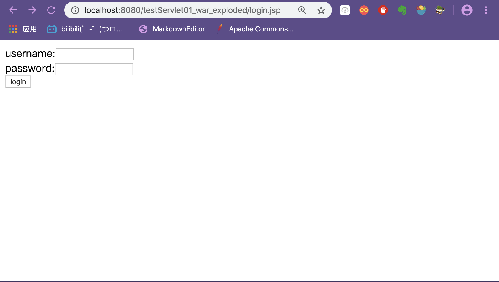

# # 前言

> 虽然Servlet已经被抛弃了，但是现在的一些框架仍然是建立在Servlet的基础上，比如SpringMVC，其实就是为了开发效率，在Servlet又封装了一层。
>
> 在理解了Sevelet的基础上，再理解SpringMVC就相对简单了
>
> 接来通过创建一个Web项目来熟悉大概的流程

# #下载Tomcat

由于我们的项目需要依赖Tomcat，在创建项目之前，需要下载Tomcat，并将其配置到项目中

进入Tomcat,左边Download选择我们想下载的版本，我这里下载的是Tomcat9版本

点击Tomcat9，进去之后往下拉，在Core这一栏里选择需要下载的版本

Mac用户选择第二个[tar.gz](http://mirror.bit.edu.cn/apache/tomcat/tomcat-9/v9.0.31/bin/apache-tomcat-9.0.31.tar.gz) ([pgp](https://www.apache.org/dist/tomcat/tomcat-9/v9.0.31/bin/apache-tomcat-9.0.31.tar.gz.asc), [sha512](https://www.apache.org/dist/tomcat/tomcat-9/v9.0.31/bin/apache-tomcat-9.0.31.tar.gz.sha512))


下载好之后解压，放到一个能找到的目录下

一般情况下，Mac用户放到根目录Macintosh HD 下的资源库(lib)中

# #创建一个Java Enterprise项目

第①步，选择Java Enterprise 版本

第②步右边New


第③步，选择Tomcat Server，会出现窗口让我们选择Tomcat Home，就是TomCat下载之后所放的位置

(注意：这里关联的tomcat home指的是tomcat的解压目录（bin目录的上一级目录）)

然后点击ok就可以了


接着选择第④步，然后⑤Next

这里自己取个项目名，比如testWeb

我最终取得是testServlet01


选择好项目名称之后，Finish

生成如下项目结构


# #项目配置

在 web 目录下的 WEB-INF 目录下新建两个目录: classes 和 lib 


File -> Project Structure，点击 Modules -> 选中项目 “FirstJavaWeb” -> 切换到 Paths 选项卡 -> 勾选 “Use module compile output path”，将 “Output path” 和 “Test output path” 都改为之前创建的classes目录。


# #用Servlet在浏览器中打印出HelloWorld

## ##在src下创建一个包com.hr

在包里创建一个类HelloServlet，并继承HttpServlet

重写doGet方法


代码

```java
import javax.servlet.ServletException;
import javax.servlet.http.HttpServlet;
import javax.servlet.http.HttpServletRequest;
import javax.servlet.http.HttpServletResponse;
import java.io.IOException;
import java.io.PrintWriter;

public class HelloServlet extends HttpServlet {
    @Override
    protected void doGet(HttpServletRequest req, HttpServletResponse resp) throws ServletException, IOException {
        req.setCharacterEncoding("UTF-8");//设置请求的字符集类型
        resp.setContentType("text/html;charset=utf-8");//设置响应的字符集类型
        PrintWriter out=resp.getWriter();//设置输出流
        out.println("Hello，我要学习JSP了，请多多关照");//打印一段话在网页上
    }
}
```

## ##配置web文件夹下的web.xml文件


浏览器每创建一个请求，就会请求一个Servlet，

所以，为了应对不同的请求，我们需要创建不同的Serlet，

我们需要哪些Servlet，就需要事先登记，

而每创建一个Servlet就需要我们在web.xml中加入以下代码（即登记），

之后，浏览器发出请求时，就会在文件中找对应的Servlet，

<servlet-name> 即我们要访问的Servlet的名字。


代码

```xml
<servlet>
    <servlet-name>hello</servlet-name>
    <servlet-class>com.hr.HelloServlet</servlet-class>
</servlet>


<servlet-mapping>
    <servlet-name>hello</servlet-name>
    <url-pattern>/hello</url-pattern>
</servlet-mapping>
```


ps: 在此简单介绍一下其中的过程(有助于理解，大神绕道)

> 用户输入的URL(http://localhost:8080/testServlet01_war_exploded/hello)之后，这个后面“hello”就是我们创建的相对应的Servlet的名字，URL请求服务器相应的Servlet，服务器接到请求后，在web.xml的<servlet-mapping> </servlet-mapping>（本质上是键值对）找我们之前注册的Servlet，即<url-pattern>/hello</url-pattern>，其对应的键为<servlet-name>hello</servlet-name>，由此键找到<servlet> </servlet>标签中的<servlet-name>hello</servlet-name>，<servlet-name>hello</servlet-name> 找到 <servlet-class>com.hr.HelloServlet</servlet-class>从而执行我们创建的类HelloServlet，将其内容打印到浏览器页面。

# #用Servlet在浏览器中创建登录页面

## ##在com.hr包下创建另一个Servelet类，同样继承父类HttpServlet

重写doPost方法


代码

```java
import javax.servlet.ServletException;
import javax.servlet.http.HttpServlet;
import javax.servlet.http.HttpServletRequest;
import javax.servlet.http.HttpServletResponse;
import java.io.IOException;
import java.io.PrintWriter;

public class LoginServlet extends HttpServlet {
    @Override
    protected void doPost(HttpServletRequest req, HttpServletResponse resp) throws ServletException, IOException {
        req.setCharacterEncoding("UTF-8");//设置请求的字符集类型
        resp.setContentType("text/html;charset=utf-8");//设置响应的字符集类型

        // 获取参数值
        String username = (String) req.getParameter("username");
        String password = (String) req.getParameter("password");
        // 输出到控制台
        System.out.println("username: " + username);
        System.out.println("password: " + password);
        PrintWriter out=resp.getWriter();//设置输出流
        out.println("成功！");//打印一段话在网页上
    }
}
```

## ##配置web文件夹下的web.xml文件

在web.xml中加入以下代码


代码

```xml
<servlet>
    <servlet-name>login</servlet-name>
    <servlet-class>com.hr.LoginServlet</servlet-class>
</servlet>
<servlet-mapping>
    <servlet-name>login</servlet-name>
    <url-pattern>/login</url-pattern>
</servlet-mapping>
```

## ##在index.jsp同级目录下创建login.jsp

> 注意: 一定要是index.jsp的同级目录下！！！

将下列代码复制进login.jsp的标签<html> </html>内


代码

```jsp
<head>
    <meta charset="UTF-8">
    <title>Title</title>
</head>
<body>
<form action="login" method="post">
    username:<input type="text" name="username">
    <br>
    password:<input type="password" name="password">
    <br>
    <input type="submit" value="login">
</form>
</body>
```

配置好之后运行,然后通过URL(http://localhost:8080/testServlet01_war_exploded/login.jsp)访问,

注意后面是login.jsp，之后出现登录页面



输入用户名和密码

回车


ps: 过程

> - 浏览器通过URL向服务器请求一个jsp
> - 服务器返回一个jsp，即登录页面
> - 用户输入账号密码登录，将数据提交给服务器
> - 服务器

