<center><font size=7>HOW TO BUILD A HUGO BlOG</font></center>

> [HoryBlog](https://horycloud.github.io/)

# 安装 homebrew 工具

[接下来用brew这个工具来安装hugo（博客工具）](https://www.cnblogs.com/yaogengzhu/p/10833285.html)

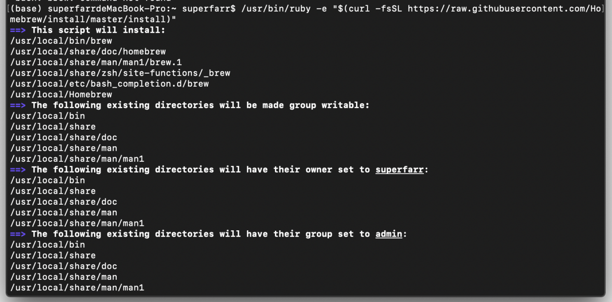

安装完之后，终端输入brew

# 安装Hugo

### Windows

如果是windows[点击](https://github.com/gohugoio/hugo/releases)

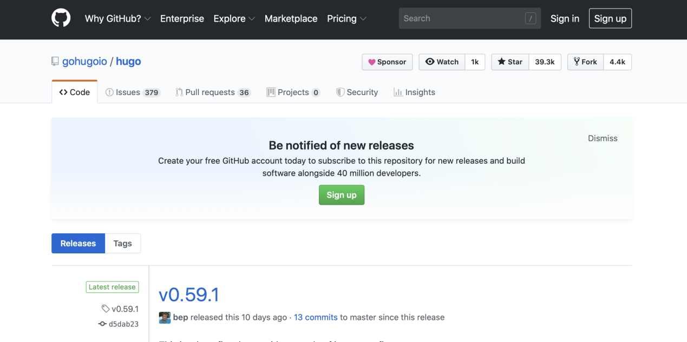


往下拉...

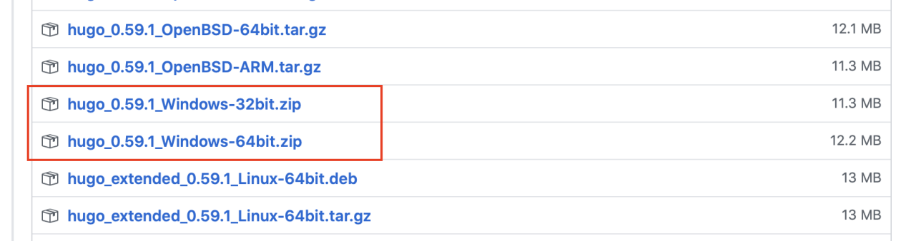

选择windows 32位或64位


### Mac

如果是MAC

在终端输入brew install hugo，安装速度会受到网络影响

请耐心等待...


下载完之后会自动跳到初始命令行


输入hugo version验证是否安装成功

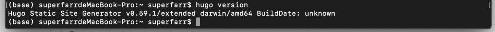

若显示版本信息则证明安装成功，这里的版本信息为

```shell
Hugo Static Site Generator v0.59.1/extended darwin/amd64 BuildDate: unknown
```

# 用Hugo创建Blog项目

> hugo安装完之后，接下来接可以用hugo这个工具来创建个人博客
>
> hugo 的作用就是创建一个工程
>
> 以后再用hugo这个命令，必须切换到HoruBlog下进行

终端输入

```shell
hugo new site HoryBlog
```

其中**HoryBlog**是文件夹名称，可以自己取

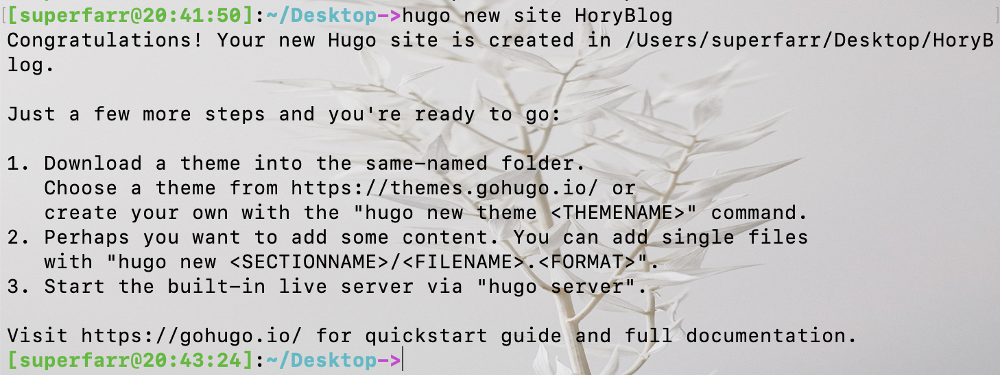

进入 **HoryBlog** 下，输入  pwd   [print workspace directory] 

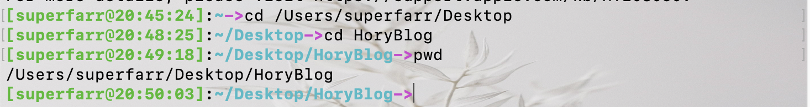

# 设置主题

> [https://themes.gohugo.io](https://themes.gohugo.io)

选择自己喜欢的一款点进去


点进去之后，往下拉...

有相关配置信息

在终端输入git 看是否有git (注意：此时还是在HoryBlog目录下)

git 一定要装好并且配置好，否则无法下载主题

进入到 HoryBlog 下的themes文件夹下

输入类似以下命令即可将主题下载到你的themes文件夹

```shell
git clone https://github.com/themefisher/airspace-hugo.git
```

注意：不同的主题命令不同，具体还是要看所选主题界面提供的信息！

# 本地启动博客

> 说明：本地启动博客可以预先查看博客的界面内容等信息

回到目录HoryBlog，输入以下命令即可在本地启动

```shell
hugo server -t hugo-theme-cleanwhite --buildDrafts
```

其中 **hugo-theme-cleanwhite** 为所选主题名称

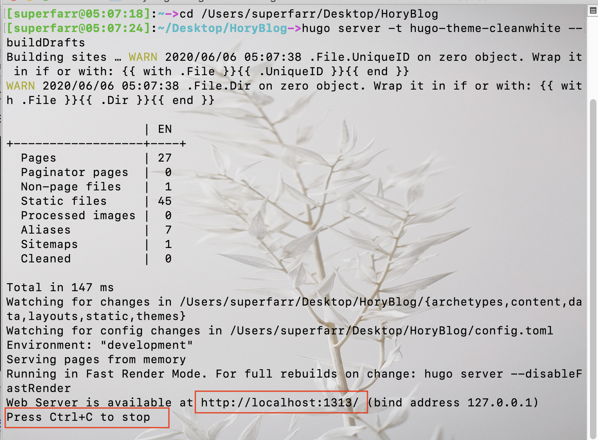

浏览器输入 http://localhost:1313 即可登录界面

Ctrl + C  终止

# 新建文章

> 网站页面搭建好之后就可以写文章了

进入HoryBlog下，输入以下命令即可在post文件下生成blog.md

```shell
hugo new post/blog.md
```

编辑好之后保存

在本地启动即可查看


# 将个人博客部署到gitHub

> 目前只能在本地启动查看，如果想部署到网络，就需要借助gitHub

### 注册gitHub

### 创建Reposipories

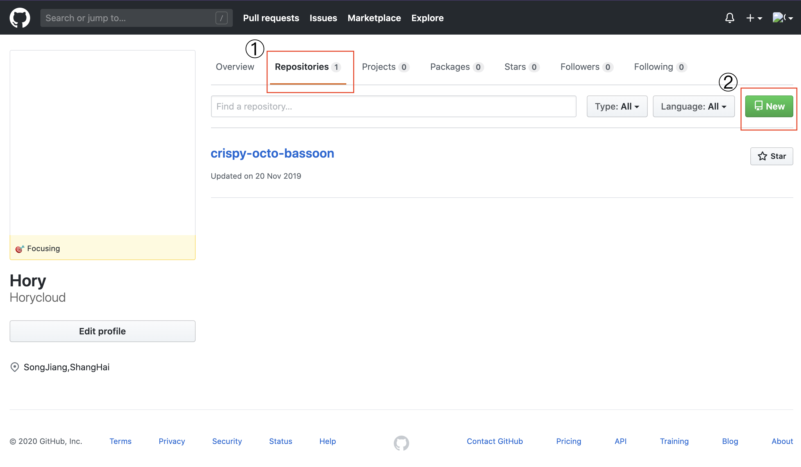

Reposipories名全为小写

格式为    xxx. github.io

**注意**：xxx **必须是Owner名字**的全小写！！比如我的Owner名为Horycloud，那么我的Reposipories名字为**horycloud. github.io**

我这里图中的名字是不对的！应该为**horycloud. github.io**

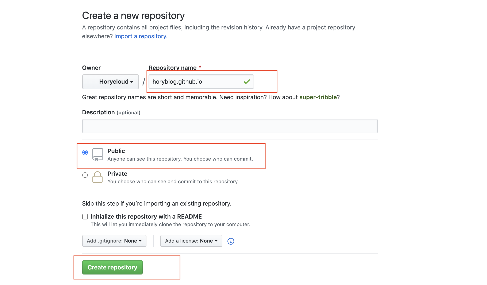

创建成功后显示如下界面

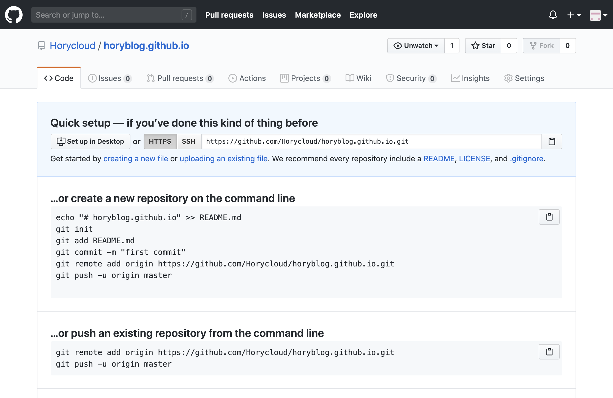


### 部署

打开终端，进入HoryBlog文件夹下，输入以下命令（配置文件中已有相应信息的，直接hugo即可 （后面信息可不带））

```shell
hugo --theme=hugo-theme-cleanwhite --baseUrl="https://horycloud.github.io/" --buildDrafts
```

其中**hugo-theme-cleanwhite**是主题名，**horycloud.github.io**是刚刚创建的Reposipories名称

说明：该命令的作用将主题和md文件”编译成“html

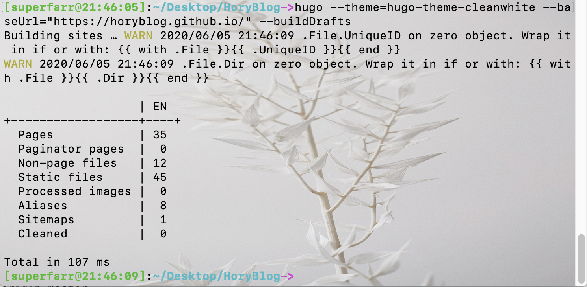.png">

执行完之后会在HoryBlog下创建一个新的文件夹public，即 public仓库

终端进入public下依次输入以下命令

```shell
git init
git add .
git commit -m "My first commit of hugoblog"
git remote add origin https://github.com/Horycloud/horycloud.github.io.git
git push -u origin master
```

接着输入你的 github 用户名和密码（输密码的时候直接输，没有反应）

如果报错，则再次输入git push -u origin master重新输入账号密码

即下面的命令


此时回到你的gitHub的Reposipories下即可查看刚刚提交的内容

说明:

+ **`git init`** 用于创建 `.git文件夹`，只是生成.git框架，但是并没有 url 等配置信息

+ 当实行 **`git remoteXXX`** 之后，则会生成 url 等配置信息，建立连接，以后就不用再 remote 了

+ **`git clone url`** 克隆 GitHub 上的项目，使用 clone 是没有 .git 文件的

+ **`git add .`** 表示提交很多修改

+ **`git commit -m "修改信息"`**     提交到暂存区 ，还没提交到 Repositorys

+ **`git pull  XXX`**     表示拉取远程仓库到本地（建议在push之前pull一下，保证本地修改之前跟远程仓库是一致的）

+ **`git push -u origin master`**    (执行此命令真正提交到master分支)

# 登录博客

最后回到页面输入相应网址即可 https://horycloud.github.io/

另外每次更改博客内容就要进行一系列终端提交操作，比较麻烦且出错率高，建议使用**vscode插件 ** 进行提交

[使用vscode向Github远程仓库进行提交修改](https://blog.csdn.net/zhpf225/article/details/103344385)

