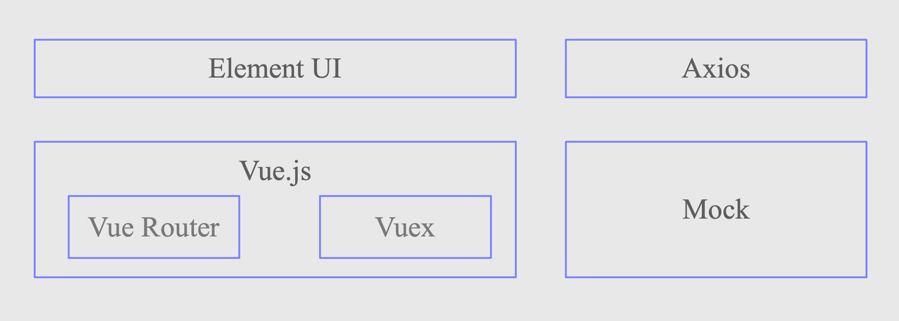
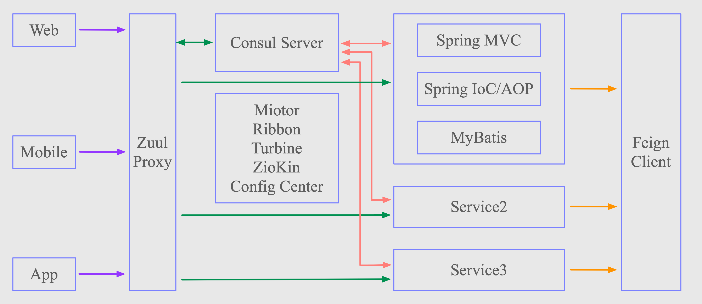

## Comment

> **什么是权限管理系统 ？**

[深入分析什么是权限管理系统](https://www.ssffx.com/wangzhanjianshe/55191.html)


> **项目依赖关系：**

**pom -> (admin -> core -> common)**


> **端口号**

casaba-admin 8001

casaba-backup 8002

casaba-monitor 8000

consul.exe 8500


> **Spring Boot 修改包名报错**

Springboot 修改包名之后，报"错误: 找不到或无法加载主类"

[链接](https://blog.csdn.net/jiang_zf/article/details/84442423)

就是把工程下面的.idea目录下的workspace.xml里面的SPING_BOOT_MAIN_CLASS的路径改成你最新的路径即可


> **maven 的 pom全称**

pom 全称 `project object model`


> **为什么要把DAO作为接口，再用impl类实现？**

解耦，便于后期维护。软件上线之后，如果需要改变一些功能，只需改实现类中代码（即只需改包下面的代码）

如果不使用接口，则会造成耦合，假如修改了 dao 中的代码，因为 service 引用了 dao 中的类，那么也要改 service 中的代码，紧接着 action 中的代码也要改（因为action中引用了service中的类），最终 ，牵一发而动全身，改完之后要重新编译运行。


> **路径通配符**

?：匹配任意一位字符

*：匹配0个，一个或多个字符

**：表示匹配任意的目录，可以零个，一个或多个


> **dao、model、service、util**

**dao** 与数据库的操作，增删改查等方法；

**model** 一般都是javabean对象，例如与数据库的某个表相关联；

**service** 供外部调用，等于对dao、model等进行了包装；

**util** 通常都是工具类，如字符串处理、日期处理等。


## Casaba 项目简介

[如何实现一个权限管理系统?](https://www.jianshu.com/p/50fc0427689d)

`系统安全`一直是在系统开发中不可规避的问题，而`权限控制`又跟系统安全密不可分，大到用户的访问，小到一个页面的按钮，都有可能涉及到权限的控制。


### 前端实现

Mango采用前后端分离架构，前端采用`Vue.js`作为核心框架，并使用同样非常流行的`Element`作为UI框架。前端开发基于`NPM`环境，使用`Visual Studio Code`作为IDE编写代码。

前端使用`Mock`可以模拟后台接口数据，可以在没有后台的情况下使用大部分功能，所以也适合不会部署后端的开发人员学习和使用。


### 后端实现

后端则采用`SpringBoot + Spring Security + Spring Cloud + MyBatis`的主体架构，基于Java环境采用`IntelliJ IDEA`开发，使用`Maven`工具构建，支持使用`Swagger`进行后台接口测试。

总而言之，Casaba 是一个基于SpringBoot、Spring Cloud、Vue.js 、Element UI实现，采用前后端分离架构的权限管理系统，也是一款采用当前主流技术实现的界面优雅、架构优良、代码简洁、注释完善、基础功能相对完整的Java快速开发平台。


### 涉及技术

Vue.js、Element、Mock

Spring Boot、MyBatis、Spring Security、Spring Cloud


### 系统功能

**系统登录**：系统用户登录，系统登录认证（token方式）。

**用户管理**：新建用户，修改用户，删除用户，查询用户。

**机构管理**：新建机构，修改机构，删除机构，查询机构。

**角色管理**：新建角色，修改角色，删除角色，查询角色。

**菜单管理**：新建菜单，修改菜单，删除菜单，查询菜单。

**字典管理**：新建字典，修改字典，删除字典，查询字典。

**配置管理**：新建配置，修改配置，删除配置，查询配置。

**登录日志**：记录用户的登录日志，查看系统登录日志记录。

**操作日志**：记录用户的操作日志，查看系统操作日志记录。

**在线用户**：根据用户的登录状态，查看统计当前在线用户。

**数据监控**：定制`Druid`信息，提供简洁有效的SQL数据监控。

**聚合文档**：定制`Swagger`文档，提供简洁美观的API文档。

**备份还原**：系统数据备份还原，一键恢复系统初始化数据。

**主题切换**：支持主题切换，自定主题颜色，实现一键换肤。

**服务治理**：集成`Consul`注册中心，实现服务的注册和发现。

**服务监控**：集成`Spring Boot Admin`，实现全方位的服务监控。

**服务消费**：集成`Ribbon`、`Feign`，实现服务调用和负载均衡。

**服务熔断**：集成`Hystrix`、`Turbine`，实现服务的熔断和监控。

**服务网关**：集成`Spring Cloud Zuul`，实现统一API服务网关。

**链路追踪**：集成`Sleuth`、`ZipKin`，实现服务分布式链路追踪。

**配置中心**：集成`Cloud Config`和`Bus`，实现分布式配置中心。


### 系统架构

本系统采用前后端分离架构实现，前后端通过`JSON`格式进行交互，前后端皆可分开`独立部署`。

前端支持开启`Mock`模拟接口数据，可以避免对后台接口开发进度的依赖；

后台支持使用`Swagger`进行接口测试，同样可以避免对前端页面开发进度的依赖。

> **前端架构**

前端架构比较简单，核心框架使用当前主流的`Vue.js`，UI使用饿了么开源的`Element`，前后端交互使用了`axios`，使用`Mock`模拟接口数据。



> **后端架构**

后端架构使用`Spring Boot + Spring Security + Spring Cloud + MyBatis`的主体架构，除此之外，选择`Consul`注册中心，使用`Maven`构建工具、`MySQL`数据库等。




### 项目模块

**casaba-common**：公共模块，以`jar`包的形式被其他模块所依赖。实现了一些`工具类`、`常量`和`公共功能`。包含时间处理、分页、Sql过滤、Xss过滤和Redis切面定义、自定义异常处理等功能。

**casaba-core**：放置一些`公共核心业务代码`封装，如`HTTP交互格式`封装、`业务基类`封装和`分页工具`封装等。

**casaba-pom**：该工程依赖所有模块，负责统一进行打包（不然编译的时候需要逐个编译，功能多的时候很麻烦），但是因为我们采用的是微服务架构，每个工程模块使用的依赖版本可能都不同，所以这里的`casaba-pom`与所有模块不存在实质性的父子模块关系，也不由`casaba-pom`进行`统一版本`和`依赖管理`，只是为了方便打包。

**casaba-admin**：管理系统模块，以`war`包形式独立部署。基于前后端分离的思想，主要用来用来开发后台管理系统。包含用户管理、角色管理、部门管理、菜单管理、定时任务、文件上传、API校验，同时采用Redis进行数据缓存，支持单机和集群的部署。


## 项目启动流程

**其中**：

+ `MySQL、Consul、casaba-monitor`为必须启动项

+ 后面的 `casaba-backup、casaba-admin、casaba-producer、casaba-consumer`等，单一测试可单独开启

> 终端启动 **MySQL**

```bash
mysql.server start
```

登录（项目没必要登录）

```bash
mysql -u root -p
```

> 终端启动注册中心 **Consul**

终端进入 `consul.exe` 所在目录，执行如下命令启动 Consul 服务：

```bash
consul agent -dev
```

+ 启动服务
+ `-dev`表示开发模式运行
+ 另外还有`-server`表示服务模式运行

启动之后访问 http://localhost:8500

>IDEA启动服务监控服务器 **casaba-monitor**

启动之后访问 http://localhost:8500

发现服务已经成功注册到注册中心。

>IDEA启动 **casaba-backup**

启动之后访问 http://localhost:8500

发现服务已经成功注册到注册中心。

> IDEA启动 **casaba-admin**

启动之后访问 http://localhost:8500

发现服务已经成功注册到注册中心。

>IDEA启动 **casaba-producer**

启动之后访问 http://localhost:8500

发现服务已经成功注册到注册中心。

> 链路追踪

进入`dockerfile`目录下，然后执行启动命令：

```bash
docker-compose up -d
```

执行完之后通过`docker ps`查看：

```bash
docker ps
```

显示如下证明`ZipKin`和`Elasticsearch`这两个容器启动起来了：

```bash
CONTAINER ID        IMAGE                                                 COMMAND                  CREATED             STATUS                    PORTS                                            NAMES
1b5b1a6d2ddc        openzipkin/zipkin:latest                              "/bin/sh -c /zipkin/…"   27 minutes ago      Up 31 seconds (healthy)   9410/tcp, 0.0.0.0:9411->9411/tcp                 zipkin
1b85503d25f7        docker.elastic.co/elasticsearch/elasticsearch:6.3.0   "/usr/local/bin/dock…"   27 minutes ago      Up 31 seconds             0.0.0.0:9200->9200/tcp, 0.0.0.0:9300->9300/tcp   elasticsearch
```

以上是启动流程，测试完之后需要将这两个容器停止：

查看运行的容器用：

```bash
docker ps -q
```

停止容器：

```bash
docker stop 容器id
```


## ELSE

### 什么是业务逻辑？

[细说业务逻辑](https://www.sohu.com/a/215874696_505923)

软件产品

+ 界面交互
	+ 表示层
+ 业务逻辑
	+ 业务逻辑层
	+ 数据访问层

在简单的、CRUD操作集中型软件中，业务逻辑基本就是对数据访问简单的封装。

而在具体实现系统时，界面交互部分演化成表示层，业务逻辑部分演化成业务逻辑层。所以，可以认为，数据访问层不是软件产品自然演化的直接产物，之所以出现数据访问层，是因为某些产品的业务属于“数据操作集中型”业务，为了实现隔离、复用等目的，架构师从业务逻辑中分离出了频繁使用的数据访问业务，形成了单独的数据访问层。

因为业务逻辑是软件产品自然的一部分，所以拥有业务逻辑是软件产品的必要条件。但是一个软件可以没有数据访问，如“计算器”、“不带存档的小游戏”等。

广义上的义务逻辑——软件本身固有的一种品性，自然存在于软件产品内部，是软件具有的在某个业务领域内的逻辑，是软件的核心和灵魂。软件产品除界面和交互外的一切都可看作是广义业务逻辑。

狭义上的业务逻辑——等同于分层架构中“业务逻辑层”的职责，是软件中处理与业务相关任务的部分，一般狭义上的业务逻辑不包含数据持久化，而只关注领域内的相关业务。

业务逻辑组成结构：

+ 领域实体（Domain Entity）
+ 业务规则（Business Rules）
+ 完整性约束（Validation）
+ 业务流程及工作流（Business Processes and Workflows）


### 如何看一个开源项目？

+ [Java学习笔记——如何解读一个项目](https://blog.csdn.net/YYZZHC999/article/details/82594036)

> **『框架分析』**

项目采用了什么框架，框架实施细节。

> **『界面分析』**

+ 了解一下界面，有哪些功能

> **『功能实现』**

+ 从界面上了解完一个项目之后，可以再从`功能上去分析`这一个项目。比如说他的`私信逻辑`，`消息通知`，`文章搜索`这些常用功能是如何实现的？

+ 比如说我们打开某思维导图社区一个网站，看到文章里面有这种一键分享的功能呐，还有回复的时候可以发小表情。自己不知道怎么做的就可以先把它截图下来，然后到时候去源码里面寻找答案。下次遇到同样的功能的话，你就可以很快的做就来。这就是一个项目的积累过程。

> **『技术分析』**

+ Readme 里面把他选用技术写出来

> **『项目结构』**

+ 从项目结构上可以直观地看到这一个项目的整体情况
+ 在项目架构上面，你可以标记每一个包或者说哪个类是到底用什么的
+ 接下来就应该对代码进行一个深层次的解剖
+ 一般来说解读的顺序，先从`增删改查`开始
+ 跟你平时的使用的方法有什么区别，一般来说整体的封装思想会有一点区别


### CORS

> 跨域解决方案笔记见笔记『ComputerNetwork』下 `跨域解决方案之 CORS`

### Shiro

[W3Cschool](https://www.w3cschool.cn/shiro/co4m1if2.html)

### Consul

常见的注册中心有`zookeeper 、eureka、consul、etcd`。


