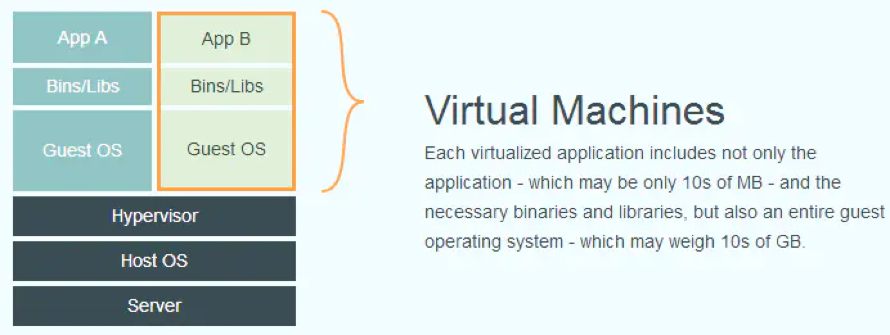
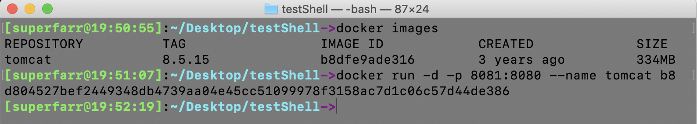

## Docker 

[Docker 官网](https://www.docker.com/)

[视频](https://www.bilibili.com/video/BV1sK4y1s7Cj?p=3)   [笔记1](https://www.lixian.fun/3812.html)   [笔记2](https://www.warlock.live/archives.html)

### Docker 简介

> Docker 是一个跨平台的轻量级虚拟机，可移植性非常高，一次部署，终生可用。Docker 可以在 Linux、Windows、MacOS 等平台上安装使用。我们都知道 Linux 有很多不同的版本，例如 Ubuntu、AIX、CentOS、Debian、Fedora、Oracle Linux、Red Hat Enterprise Linux、openSUSE and SUSE Linux Enterprise等。尽管 Linux 的版本很多，但是我们的 Docker 都可以在它们在面运行。你也可以使用 Docker 云来自动准备和管理你的云实例。

>Docker 是一个开源的应用容器引擎，让开发者可以打包他们的应用以及依赖包到一个可移植的容器中，然后发布到任何流行的 Linux 机器上，也可以实现虚拟化，容器是完全使用**沙箱机制**，相互之间不会有任何接口。简言之，就是可以在 Linux 上镜像使用的这么一个容器。


<font color=DarkOrchid>**Docker 可以用来做什么？**</font>

+ web 应用自动化打包发布，如 Tomcat 应用的发布
+ 自动化测试和持续集成、发布
+ 在服务型环境中部署和调整数据库或其他的后台应用
+ 搭建 paas 环境


<font color=DarkOrchid>**Docker 的优势**</font>

**更高效地利用系统资源**。由于容器不需要进行硬件虚拟以及运行完整操作系统等额外开销，Docker 对系统资源的利用率更高，无论是应用执行速度，内存消耗以及文件存储速度，都要比传统虚拟机技术更高效。因此，相比虚拟机技术，一个相同配置的主机，往往可以运行更多数量的应用。

**更快速的启动时间**。传统的虚拟机技术启动应用服务往往需要数分钟，而 Docker 容器应用，由于`直接运行于宿主内核，无需启动完整的操作系统`，因此可以做到秒级，甚至毫秒级的启动时间，大大地节约了开发、测试、部署的时间。

**一致的运行环境**。开发过程中一个常见的问题是环境一致性问题，由于开发环境、测试环境、生产环境不一致，导致有些 bug 并未在开发过程中被发现，而 Docker 的镜像提供了除内核外完整的运行时环境，确保了应用运行环境一致性。从而不会再出现（这段代码在我机器上运行没问题啊）这类问题。

**持续交付和部署**。对于开发和运维人员来说，最希望的就是一次创建或配置，可以在任意地方正常运行。使用Docker 可以通过定制应用镜像来实现持续集成、持续交付、部署。开发人员可以通过 Dockerfile 来进行镜像构建，并结合持续集成系统进行集成测试，而运维人员则可以在生产环境中快速部署该镜像，甚至结合持续部署系统进行自动部署。

**更轻松的迁移**。由于 Docker 确保了执行环境的一致性，使得应用的迁移更加容易，Docker 可以在很多平台上运行，无论是物理机、虚拟机、公有云、私有云，甚至是比较本，其运行结果是一致的，因此用户可以很轻易地将在一个平台上运行的应用，迁移到另一个平台上，而不用担心运行环境的变化导致应用无法正常运行的情况。

**更轻松的维护和扩展**。Docker 使用的`分层存数`以及`镜像`的技术，使得应用重复部分的复用更为容易，也使得应用的维护更新更加简单，基于基础镜像进一步扩展镜像也变得非常简单，此外，Docker 团队同各个开源项目团队一起维护了一大批高质量的官方镜像，既可以直接在生产环境中使用，又可以作为基础进一步定制，大大地降低了应用服务的镜像制作成本。

**更快速的交付和部署**。对开发和运维（devop）人员来说，最希望的就是一次创建或配置可以在任意地方正常运行。开发者可以使用一个标准的镜像来构建一套开发容器，开发完成之后，运维人员可以直接使用这个容器来部署代码。Docker 可以快速创建容器，快速迭代应用程序，并让整个过程全程可见，使团队中的其他成员更容易理解应用程序是如何创建和工作的。Docker 容器很轻很快！容器的启动时间是秒级的，大量地节约开发、测试、部署的时间。

**更高效的虚拟化**。Docker 容器的运行不需要额外的 hypervisor 支持，它是内核级的虚拟化，因此可以实现更高的性能和效率。

**更简单的管理**。使用 Docker，只需要小小的修改，就可以替代以往大量的更新工作。所有的修改都以增量的方式被分发和更新，从而实现自动化并且高效的管理。

> 下面的图片比较了 Docker 和传统虚拟化方式的不同之处，可见容器是在操作系统层面上实现虚拟化，直接复用本地主机的操作系统，而传统方式则是在硬件层面实现。

**Docker：**

Docker 引擎容器仅仅由`应用程序`和`其依赖`组成，它作为一个独立的进程在主机操作系统的`用户空间`中运行，和其他容器共享一个内核。因此，它享有虚拟机的资源隔离和分配优势，但可移植性和效率更高


**传统虚拟化：**

每个虚拟化的应用程序不仅包括应用程序(可能只有10Mb)和必要的二进制文件和库，还包括整个客户操作系统(可能有10Gb)




### Docker 的组成

> 仓库 Repository

仓库是集中存放镜像文件的场所；

仓库注册服务器 (Registry) 上往往存放着多个仓库，每个仓库中又包含了多个镜像，每个镜像有不同的标签；

仓库分为`公开仓库`和`私有仓库`两种形式；最大的公开仓库是[DockerHub](https://hub.docker.com/)，存放了数量庞大的镜像供用户下载，国内的公开仓库包括阿里云等。


> 镜像 image

Docker镜像就相当于是一个文件系统，通俗来说就是用来创建容器的。


> 容器 Container

就像码头的集装箱。

Docker 利用容器 (Container) 来独立运行一个或一组应用，容器是用镜像创建的运行实例，它可以被启动、开始、停止、删除，每个容器都是相互隔离的、保证安全的平台，可以把容器看做是一个简易版的 Linux 系统。

`镜像好比 Java 中的类，容器就好比 Java 中的对象。`


### Docker 底层原理

Docker 是基于 `C/S结构`的系统，Docker 的守护进程运行在 Linux 服务器（宿主机）上，当我们在 Liunx 服务器上(Docker-Client)输入 Docker 相关命令就会被发送给 Doker-Server


> 为什么 Docker 比 VM(虚拟机) 快 ？

1. Docker 有着比虚拟机更少的抽象层，由于 Docker 不需要 Hypervisor 实现硬件资源虚拟化，运行在 Docker 容器上的程序直接使用的都是实际物理机的硬件资源，因此在 CPU、内存利用率上 Docker 将会在效率上有明显优势。
2. 当新建一个容器时，Docker 不需要和虚拟机一样重新加载一个操作系统内核，因而避免引导、加载操作系统内核这个比较费时费资源的过程，当新建一个虚拟机时，虚拟机软件需要加载 GuestOS (虚拟机中的操作系统)，这个新建过程是分钟级别的，而 Docker 由于直接利用宿主机的操作系统，则省略了这个复杂的过程，因此新建一个 Docker 容器只需要几秒钟。


### Docker 下载

> Mac OS 上用迅雷下载界面版 Docker

由于在官网上下载 Docker 特别慢，这里使用迅雷下载：

将此链接 https://download.docker.com/mac/stable/Docker.dmg 复制到迅雷中即可下载


### Docker 的中央仓库

Docker 官方的中央仓库：这个仓库是镜像最全的，但是下载速度较慢 

+ https://hub.docker.com/

国内的镜像网站：网易蜂巢、daoCloud 等，下载速度快，但是镜像相对不全

+ https://c.163yun.com/hub#/home 

+ http://hub.daocloud.io/ （推荐使用）

在公司内部会采用私服的方式拉取镜像（添加配置），需要创建 `/etc/docker/daemon.json`，并添加如下内容：

```json
{
		"registry-mirrors":["https://registry.docker-cn.com"],
		"insecure-registries":["ip:port"]
}
```

重启两个服务

+ `systemctl daemon-reload`

+ `systemctl restart docker`


### 镜像的操作

> 拉取镜像

从中央仓库拉取镜像到本地使用命令： `docker pull 镜像名称`，如：

进入http://hub.daocloud.io/ 搜索 Tomcat，点击拉取，复制链接，执行操作：

```shell
docker pull daocloud.io/library/tomcat:8.5.15-jre8
```


> 查看本地全部镜像

查看本地已经安装过的镜像信息，包含名称`REPOSITORY`、`版本TAG`、`标识IMAGE ID`、`更新时间CREATED`、`大小SIZE`

```shell
docker iamges
```

如果此时安装了 Tomcat 镜像，会显示如下内容

```shell
REPOSITORY                   TAG                 IMAGE ID            CREATED             SIZE
daocloud.io/library/tomcat   8.5.15-jre8         b8dfe9ade316        3 years ago         334MB
```


> 删除本地镜像

镜像会占用磁盘空间，可以直接手动删除，标识通过查看获取：`docker rmi 镜像的标识`，如：

```shell
docker rmi b8
```


> 镜像的导入导出

我们可以把自己下载好的镜像发给那些需要的人，这就涉及到镜像的导入导出

将本地的镜像导出：`docker save -o 导出的路径 镜像id`

`./tomcat.image` 表示导出到当前目录，且将导出的镜像命名为 `tomcat.image`

```shell
docker save -o ./tomcat.image b8
```

如果是导入到桌面可以

```shell
docker save -o /Users/superfarr/Desktop/tomcat.image b8
```

当我们拿到别人的镜像文件比如 tomcat.image 时，进入到该文件所在文件夹下，用下面的方式加载：

```shell
docker load -i tomcat.image
```


> 修改镜像名称和版本号

但是此时发现名字`REPOSITORY`和版本`TAG`都变为了 `<none>`

```shell
REPOSITORY          TAG                 IMAGE ID            CREATED             SIZE
<none>              <none>              b8dfe9ade316        3 years ago         334MB
```

可以用如下命令修改（:之前是镜像名称，之后的是版本号）：

```shell
docker tag b8 tomcat:8.5.15
```


### 容器的操作

`实际上容器就是运行起来的镜像`

> 运行容器

```shell
docker run 镜像标识|镜像名称[:tag]
```

上面的 `|` 是「或者」的意思

不过以上是简单的运行，通过 web 方式是无法访问到的，下面讲一下完整的用法

```shell
docker run -d -p 宿主机端口:容器端口 --name 容器名称 镜像标识|镜像名称[:tag]
```

+ `-d` 代表后台运行容器
+ `-p 宿主机端口:容器端口 ` 为了映射当前 Linux 的端口和容器的端口
+ `--name` 指定容器名称



这时候试着访问浏览器输入`本地ip:8081`，将会跳出 Tomcat 的服务器页面


> 查看容器

```shell
docker ps -q
```

或者

```shell
docker ps -a
```

+ `-q` 只查看容器的标识
+ `-a` 查看全部的容器（包括没有运行的）

结果如下：

| CONTAINER ID | IMAGE |      COMMAND      |   CREATED    |   STATUS    |         PORTS          | NAMES  |
| :----------: | :---: | :---------------: | :----------: | :---------: | :--------------------: | :----: |
| d804527bef24 |  b8   | "catalina.sh run" | 22 hours ago | Up 22 hours | 0.0.0.0:8081->8080/tcp | tomcat |


> 查看容器日志

```shell
docker logs -f 容器id
```

+ `-f` 可以滚动查看日志的最后几行
+ CONTAINER ID 即容器id
+ 按 control + c 退出


> 进入容器的内部

```shell
docker exec -it 容器id bash
```

退出：输入 `exit`

```sh
root@d804527bef24:/usr/local/tomcat/bin# exit
```


注意：不要在容器内部停止，一般不在容器内部进行操作


> 复制内容到容器

将宿主文件复制到容器内部的指定目录

```shell
docker cp 文件名称 容器id:容器内部路径
```


> 启动\重启\停止\删除容器

启动停止运行的容器：

```shell
docker start 容器id
```

重新启动容器：

```shell
docker restart 容器id
```

停止指定的容器：

```shell
docker stop 容器id
```

停止全部容器：

```shell
docker stop $(docker ps -qa)
```

删除指定容器（删除容器前，需要先停止容器）：

```shell
docker rm 容器id
```

删除全部容器（删除容器前，需要先停止容器）：

```shell
docker rm $(docker ps -qa)
```


### Docker 的应用

> Docker 安装 Tomcat

运行 Tomcat 容器，为部署 SSM 工程做准备

```shell
docker run -d -p 8080:8080 --name tomcat  daocloud.io/library/tomcat:8.5.15-jre8
```

如果已经下载了 Tomcat 镜像

```shell
docker run -d -p 8080:8080 --name tomcat 镜像的标识
```


> 运行 MySQL 容器

```shell
docker run -d -p 3306:3306 --name mysql -e MYSQL_ROOT_PASSWORD=151869 daocloud.io/library/mysql:5.7.4
```


> 部署 SSM 工程

1. 修改 SSM 工程环境，设置为 Linux 中 Docker 容器的信息
2. 通过 Maven 的 package 重新打成 war 包
3. 将 Windows 下的 war 包复制到 Linux 中
4. 通过 docker 命令将宿主机的 war 包复制到容器内部

```shell
docker cp 文件名称 容器id:容器内部路径
```

测试访问 SSM 工程


### 数据卷

为了部署 SSM 工程，需要使用到 `cp` 命令将宿主机内的 ssm.war 文件复制到容器内部。

**数据卷**：将宿主机的一个目录映射到容器的一个目录中。

可以在宿主机中操作目录中的内容，那么容器内部映射的文件，也会跟着一起改变。


> 创建数据卷

```shell
docker volume create 数据卷名称
```

创建数据卷后，默认会存放在目录 `/var/lib/docker/volumes/数据卷名称/_data ` 下


> 查看全部数据卷

查看全部数据卷信息

```shell
docker volume ls
```


> 查看数据卷详情

查看数据卷的详细信息，可以查询到存放的路径，创建时间等等

```shell
docker volume inspect 数据卷名称
```


> 删除数据卷

删除指定的数据卷

```shell
docker volume rm 数据卷名称
```


> 容器映射数据卷

通过数据卷名称映射，如果数据卷不存在。Docker会帮你自动创建，会将容器内部自带的文件，存储在默认的存放路径中。

```shell
docker run -d -p 8080:8080 --name tomcat -v 数据卷名称:容器内部的路径 镜像id
```

通过路径映射数据卷，直接指定一个路径作为数据卷的存放位置。但是这个路径下是空的。

```shell
docker run -d -p 8080:8080 --name tomcat -v 路径(/root/自己创建的文件夹):容器内部的路径 镜像id
```


### Docker 自定义镜像

