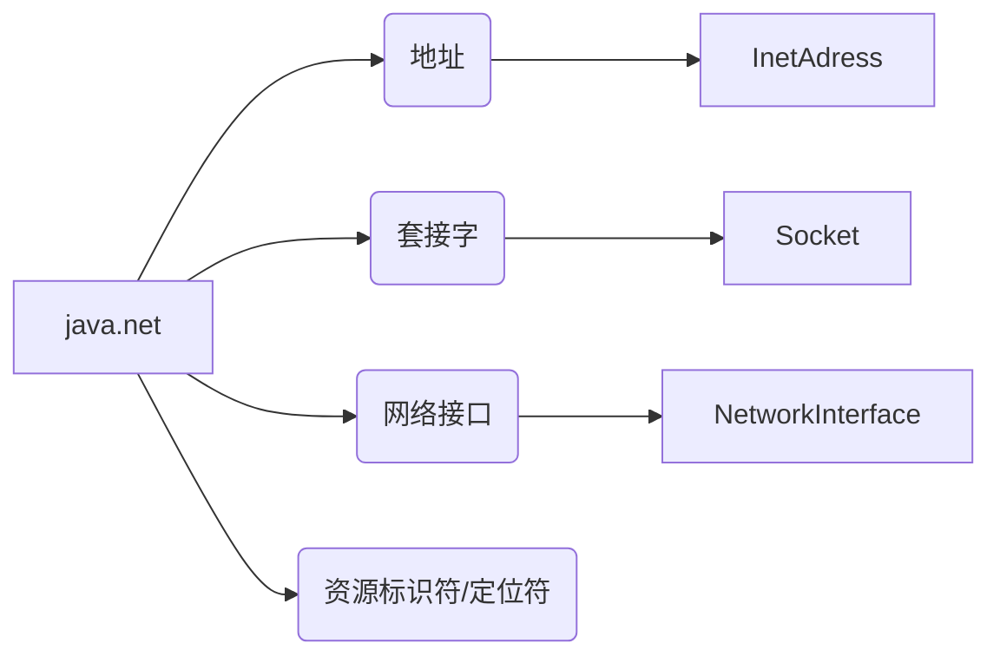
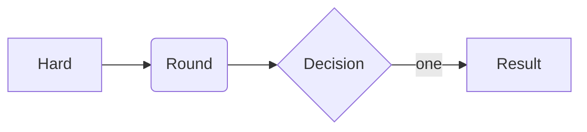
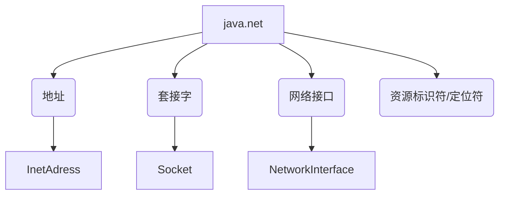
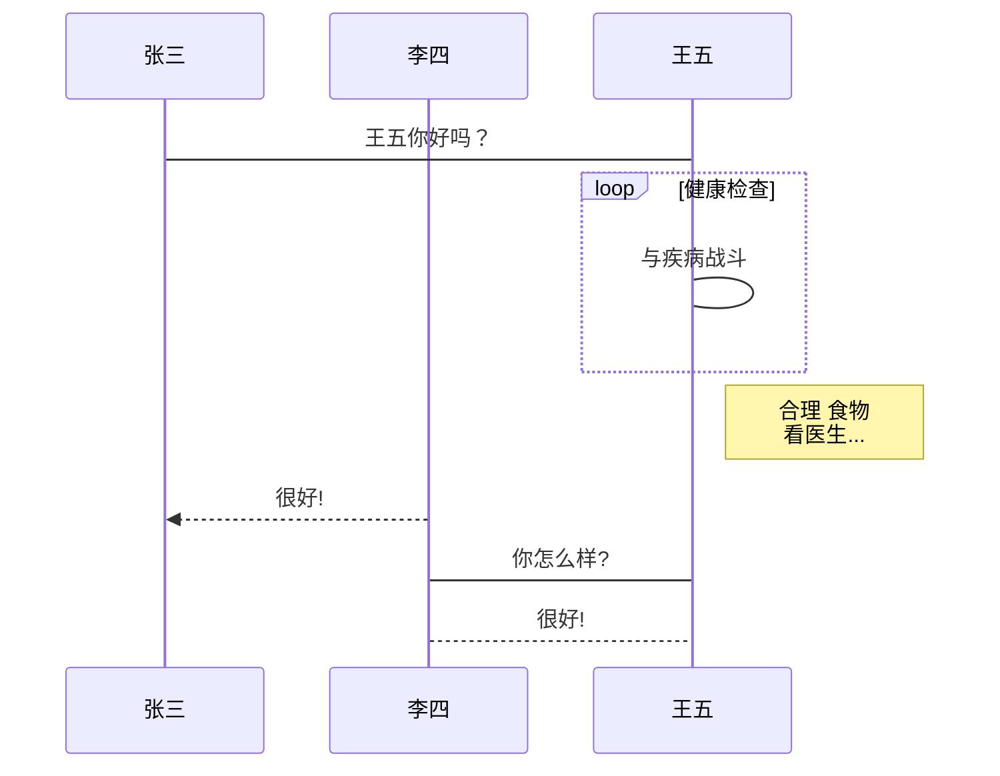
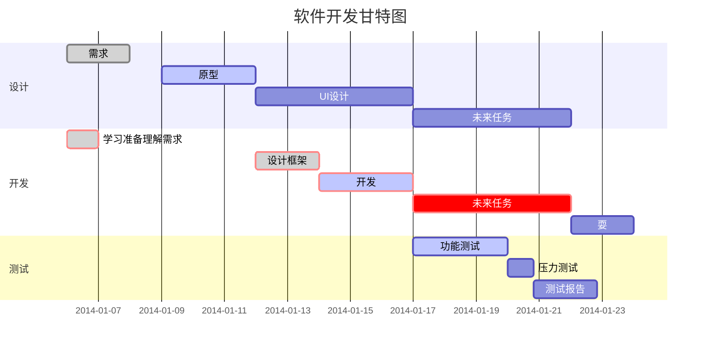

[TOC]

## 目录

语法：

```
[TOC]
```


## Markdown菜鸟教程

[Markdown菜鸟教程](https://www.runoob.com/markdown/md-table.html)


## 标题

<table><td bgcolor=Silver>Silver 


<table><td bgcolor=DarkOrchid>DarkOrchid
<font color=DarkOrchid>DarkOrchid</font>


## 符号

```
→
```


## Typora跳转

`Typora实现页内跳转`

+ <a href="###三级标题标题名称">页内跳转</a>
+ `注意`:  ”###三级标题标题名称" 的  “#三” 之间没有空格

`Typora实现文件跳转`

+ <a href="相对路径">文件跳转</a>


## CSDN 图片

CSDN 上传图片设置自定义图片大小

```
<image src="" width="50%">
```


## 横线注释

~~strickout~~


## 表格

```markdown
|  表头   | 表头  |
|  ----  | ----  |
| 单元格  | 单元格 |
| 单元格  | 单元格 |
```


## 思维导图

1. **水平分支：**







2. **竖向分支：**



3. **标准流程图源码格式：**

```flow
st=>start: 开始框
op=>operation: 处理框
cond=>condition: 判断框(是或否?)
sub1=>subroutine: 子流程
io=>inputoutput: 输入输出框
e=>end: 结束框
st->op->cond
cond(yes)->io->e
cond(no)->sub1(right)->op
```

4. **标准流程图源码格式（横向）：**

```flow
st=>start: 开始框
op=>operation: 处理框
cond=>condition: 判断框(是或否?)
sub1=>subroutine: 子流程
io=>inputoutput: 输入输出框
e=>end: 结束框
st(right)->op(right)->cond
cond(yes)->io(bottom)->e
cond(no)->sub1(right)->op
```

5. **UML时序图源码样例：**

```sequence
对象A->对象B: 对象B你好吗?（请求）
Note right of 对象B: 对象B的描述
Note left of 对象A: 对象A的描述(提示)
对象B-->对象A: 我很好(响应)
对象A->对象B: 你真的好吗？
```

6. **UML时序图源码复杂样例：**

```sequence
Title: 标题：复杂使用
对象A->对象B: 对象B你好吗?（请求）
Note right of 对象B: 对象B的描述
Note left of 对象A: 对象A的描述(提示)
对象B-->对象A: 我很好(响应)
对象B->小三: 你好吗
小三-->>对象A: 对象B找我了
对象A->对象B: 你真的好吗？
Note over 小三,对象B: 我们是朋友
participant C
Note right of C: 没人陪我玩
```

7. **UML标准时序图样例：**



8. **甘特图样例：**




## LaTeX公式

[LaTeX公式手册](https://www.cnblogs.com/1024th/p/11623258.html)

H~2~0   $H_2O$       $H_{i+j}$      $2^n$       

Subscript：X<sub>2</sub>         Superscript ：O<sup>2</sup>

==height==      `mark`

$G=\sum_{i=1}^{n} \frac{s_{i}}{s} W_{i} \quad \text { (where } s=\sum_{i=1}^{n} s_{i})$

f(x) = {{{a_0}} \over 2} + \sum\limits_{n = 1}^\infty  {({a_n}\cos {nx} + {b_n}\sin {nx})}


## iPic图床

[教你免费试用iPic的所有图床](https://www.jianshu.com/p/dbc945b05d55)


## 属性

### Size/Color Of Words Setting 

**Bold**  *Italics*   ***Bold&Italics***  

URL：https://blog.csdn.net/thither_shore/article/details/52181464

+ <font face="黑体">黑体</font>
+ <font face="微软雅黑">微软雅黑</font>
+ <font face="STCAIYUN">华文彩云</font>
+ <font color=red>red</font>
+ <font color=DarkGreen>DarkGreen</font>
+ <font color=Gold>Gold</font>
+ <font color=DarkOrchid>DarkOrchid</font>
+ <font color=Darkorange>Darkorange</font>
+ <font color=HotPink>HotPink</font>
+ <font color=SlateGray>SlateGray</font>
+ <font size=5>size=5</font>
+ <font face="黑体" color=green size=5>Bold，green，size=5</font>

<p align="right">行右对齐</p>

<div><div style="float: left;">“华为杯”第⼗六届中国研究⽣数学建模竞赛全国三等奖</div><div style="float: right;">2019 / 12</div></div> 


### Background Color

<table><tr><td bgcolor=DarkOrchid>DarkOrchid</td></tr></table>

<table><tr><td bgcolor=Silver>Silver</td></tr></table>


<table><td bgcolor=Silver>Silver</td>


### Image Setting

1. %


2. Image Size

   

3. Image Location ( left / right / center )

   <div align=left></div>

   <div align=right></div>

<div align=center></div>


