## 一个可视化git学习网站

[learngitbranching](https://learngitbranching.js.org/?locale=zh_CN)


## 教程

[Learning Git Branching](https://github.com/pcottle/learnGitBranching)

[教程网站地址](https://learngitbranching.js.org)

### Git 简介

<font color=DarkOrchid>**Git 和 GitHub的历史渊源**</font>

Git 比 GitHub 出生的早。时间回到2005年，有个公司不允许 linux 系统继续免费使用它们的版本控制软件了，然后 linux 系统创始人Torvalds 一气之下花了10天时间创造了Git（第一个版本），并且开源给所有人免费试用。3年后，Tom Preston 使用 Git 作为版本控制软件创建了http://Github.com，一个专门托管代码并且可以实现版本控制的网站。Tom之所以把网站叫做 Github，是因为其核心部分版本控制是用 Git 来处理的。但是为什么有人回复调侃 Github 是全球最大男性交友网站呢？那是因为 Github 的注册用户大都是男生，而且彼此之间可以相互关注（类似于微博）。

[Git 官网](https://git-scm.com/)

集中版本控制工具：CVS、SVN、VSS……

分布式版本控制工具：Git、Mercurial、Bazaar、Darcs……


<font color=DarkOrchid>**Git 的优势**</font>

大部分操作在本地完成，不需要联网

完整性保证

尽可能添加数据而不是删除或修改数据

分支操作非常快捷流畅

与Linux 命令全面兼容


### Mac下Git 设置用户名和密码

一般刚安装 Git 都要配置用户名和密码，因为提交代码到本地仓库（上传代码到远程仓库）时会用到，如果没有没有配置，在提交时它会提醒你的。

> 查看 git 的配置列表

**查看一下git的配置列表**：

```bash
git config --list
```

如果没有配置东西，应该是空的。照着下面配置完成后，你可以再试一下该命令，就会出现一系列配置信息。

**查看用户名和邮箱**：

```bash
git config --global user.name
git config --global user.email
```


> 进行配置

`git` 的配置文件路径为`/Users/superfarr/.gitconfig`，该文件为隐藏文件，可以直接编辑。

你也可以在终端进行操作

**设置用户名和邮箱**，将`username`和`email`换成`github`（或者其它类似远程仓库）的用户名和密码：

```bash
git config --global user.name "HoryCloud"
git config --global user.email "xxx@163.com"
```

**全局变量**：`--global` 表示全局的，即当前用户都有效，该配置会出现在 `~/.gitconfig` 文件中，~表示当前电脑操作系统用户的目录，这里为`superfarr`

**局部变量**：既然有全局的，那么肯定有局部的，局部的是不加`--global`的。如下：

先进入该仓库根目录下，再执行：

```bash
git config user.name "HoryCloud"
git config user.email "xxx@163.com"
```

局部是只对`当前仓库`起效的，它的配置信息会在当前仓库根目录`/.git/config`文件下。

局部变量会覆盖全局变量！

> 修改已配置的信息

1. **可以通过编辑配置文件来修改**：

```bash
vi .gitconfig 
```

2. **直接点击文件修改**

3. **也可以提交命令来修改**

修改本地`全局`仓库的用户名和邮箱：

```bash
git config --global --replace user.name "HoryCloud"
git config --replace --replace user.email "xxx@163.com"
```

修改本地`局部`仓库的用户名和邮箱：

需要首先进入该仓库根目录下，然后执行：

```bash
git config --replace user.name "HoryCloud"
git config --replace user.email "xxx@163.com"
```


> `git config`的功能列表

直接输入`git config`，就可以看到简单的命令列表了：

```bash
git config
```

```bash
usage: git config [<options>]

Config file location
    --global              use global config file
    --system              use system config file
    --local               use repository config file
    --worktree            use per-worktree config file
    -f, --file <file>     use given config file
    --blob <blob-id>      read config from given blob object

Action
    --get                 get value: name [value-regex]
    --get-all             get all values: key [value-regex]
    --get-regexp          get values for regexp: name-regex [value-regex]
    --get-urlmatch        get value specific for the URL: section[.var] URL
    --replace-all         replace all matching variables: name value [value_regex]
    --add                 add a new variable: name value
    --unset               remove a variable: name [value-regex]
    --unset-all           remove all matches: name [value-regex]
    --rename-section      rename section: old-name new-name
    --remove-section      remove a section: name
    -l, --list            list all
    -e, --edit            open an editor
    --get-color           find the color configured: slot [default]
    --get-colorbool       find the color setting: slot [stdout-is-tty]

Type
    -t, --type <>         value is given this type
    --bool                value is "true" or "false"
    --int                 value is decimal number
    --bool-or-int         value is --bool or --int
    --path                value is a path (file or directory name)
    --expiry-date         value is an expiry date

Other
    -z, --null            terminate values with NUL byte
    --name-only           show variable names only
    --includes            respect include directives on lookup
    --show-origin         show origin of config (file, standard input, blob, command line)
    --default <value>     with --get, use default value when missing entry
```


> `git config --help`

这个命令默认打开本地git安装目录下的详细的说明文档。

在终端输入`which git` 即可查看git的安装目录：

```bash
which git
```

```bash
/usr/bin/git
```


### Git 用户名 & GitHub 账户

[原文](https://blog.csdn.net/belongtocode/article/details/100716812)

在电脑上，如果要用Git，我们需要通过命令`git config --global user.name "myname"`和`git config --global user.email "myname@email.com"`来配置用户名和email，表明是“谁”在操作Git，来做提交代码等等一系列操作。

另外，如果我们需要使用代码托管的服务，比如GitHub，GitHub也会要求我们提供email和用户名来注册来注册，也需要用户名和email。


### GitHub配置SSH秘钥

SSH 为 `Secure Shell` 的缩写，由 IETF 的网络小组（Network Working Group）所制定；SSH 为建立在应用层基础上的安全协议。

**在管理Git项目上，有两种克隆到本地的方法**：

+ 直接使用`https url`克隆到本地
+ 使用`SSH url`克隆到本地

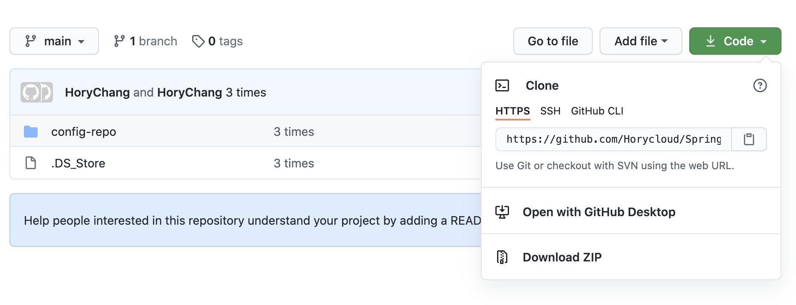


**这两种方式的主要区别在于**：

+ 使用`https url`对初学者来说会比较方便，复制`https url`到`git Bash`里面直接用`clone`命令克隆到本地就好了，但是每次`fetch`和`push`代码都需要输入账号和密码，这也是`https`方式的麻烦之处。

+ 使用`SSH url`需要在使用之前先配置和添加好`SSH key`，每次`fetch`和`push`代码都不需要输入账号和密码，如果你想要每次都输入账号密码才能进行`fetch`和`push`也可以另外进行设置。

> **检查电脑上是否有SSH Key**

用`~/.ssh` 或者`~/.ssh ls`，查看电脑上有没有`.ssh`文件夹：

+ 如果电脑上有，就会显示`-bash: /Users/superfarr/.ssh: is a directory`
+ 如果电脑上没有，就会显示`-bash: /Users/superfarr/.ssh: No such file or directory`

```bash
[superfarr@19:10:39]:~->~/.ssh
-bash: /Users/superfarr/.ssh: is a directory
[superfarr@19:11:23]:~->~/.ssh ls
-bash: /Users/superfarr/.ssh: is a directory
```

> **创建SSH Key**（如果电脑上有，可跳过此教程）

**终端输入**：

```bash
ssh-keygen -t rsa -C "邮箱"
```

+ **注意**：这里输入的邮箱，跟`Git的用户名`以及`GitHub等代码托管网站的用户名`毫无关联。

然后这里就会显示：

```bash
Generating public/private rsa key pair.
Enter file in which to save the key (/Users/superfarr/.ssh/id_rsa):
```

+ 这是让我们输入一个文件名，用于保存刚才生成的 SSH key 代码。
+ 为了避免麻烦，不用输入，直接回车，就会默认生成`id_rsa`和`id_rsa.pub`两个秘钥文件。

这时候已经创建好`.ssh`这个文件夹了，会提示：

```bash
Created directory ‘/Users/superfarr/.ssh’.
```

紧接着会让我们设置密码：

```bash
Enter passphrase (empty for no passphrase):
```

+ 这里如果设置了密码，那么在使用ssh传输文件的时候，就要输入这个密码。
+ 为了避免麻烦，建议不用设置，直接回车。

```bash
Enter same passphrase again:
```

+ 再次提示输入一次密码，就跟我们注册账号时候设置密码需要设置两次一样。
+ 既然上一步没设置密码，这里直接回车就可以了。

到这里秘钥就设置好了，会收到这段代码提示：

```bash
Your identification has been saved in /Users/superfarr/.ssh/id_rsa
Your public key has been saved in /Users/superfarr/.ssh/id_rsa.pub
```

还会显示秘钥信息。

这时候说明 SSH key 已经创建成功，现在再使用`~/.ssh`看一下，文件是真的存在了。

> 添加SSH Key 到GitHub


点击右上角新建一个SSH Key

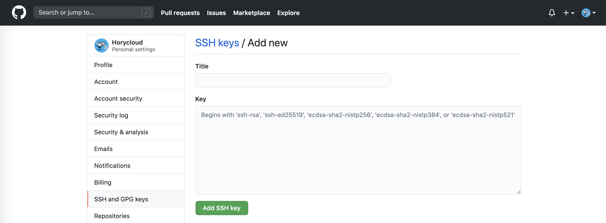


`Title`随便起个名字就好。然后是`Key`，这时候你要打开你刚才在电脑上的`SSH key`

用`~/.ssh` 或者`~/.ssh ls`，查看电脑上`.ssh`文件夹路径：

```bash
[superfarr@19:10:39]:~->~/.ssh
-bash: /Users/superfarr/.ssh: is a directory
```

找到`.ssh`文件夹（它是一个隐藏文件夹）下的`id_rsa.pub`文件，全选其中的内容粘贴到网页的`Key`中。

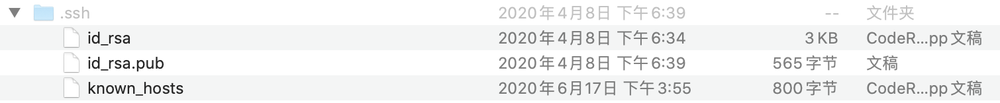


然后你就会受到建立成功的邮件了。

> 测试一下该SSH Key

终端输入：

```bash
ssh -T git@github.com
```

注意是`git@github.com`，不是我们自己的邮箱。

然后会提示：

```bash
The authenticity of host ‘github.com (13.229.188.59)’ can’t be established.
RSA key fingerprint is SHA256:nThbg6kXUp…
Are you sure you want to continue connecting (yes/no/[fingerprint])?
```

输入`yes`，回车

如果上边设置ssh密码，接下来就会提示输入密码，如果没有设置密码会提示：

```bash
Warning: Permanently added ‘github.com,192.30.255.112’ (RSA) to the list of known hosts.
```

警告完了，如果你能看到如下提示，那你已经成功设置SSH密钥：

```bash
Hi Horycloud! You've successfully authenticated, but GitHub does not provide shell access.
```

如果看到 `access denied`，表示拒绝访问，那么就需要使用 `https` 去访问。


### 工作区/暂存区/版本库

**工作区：**就是你在电脑里能看到的目录。

**暂存区：**英文叫 stage 或 index。一般存放在 `.git`目录下的 `index` 文件（.git/index）中，所以我们把暂存区有时也叫作索引（index）。

**版本库：**工作区有一个隐藏目录`.git`，这个不算工作区，而是 Git 的版本库。

下面这个图展示了工作区、版本库中的暂存区和版本库之间的关系：

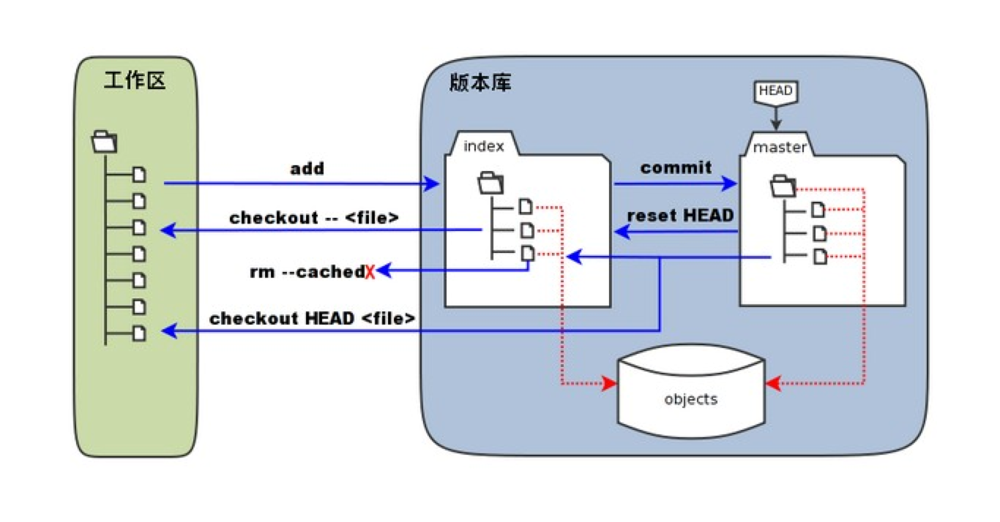


### 基本操作

<font color=DarkOrchid>**查看电脑是否安装了 Git：**</font>

```shell
git --version
```


<font color=DarkOrchid>**查看 git 包的路径：**</font>

```shell
which git
```

可以发现，默认路径为 `/usr/bin/git` 


<font color=DarkOrchid>**查看状态**</font>

```shell
git status -s
```

```shell
git status
```


<font color=DarkOrchid>**git init**</font>

Git 使用 `git init` 命令来`初始化`一个 Git 仓库，Git 的很多命令都需要在 Git 的仓库中运行，所以 **git init** 是使用 Git 的第一个命令。

在执行完成 `git init` 命令后，Git 仓库会生成一个 `.git` 目录，该目录包含了资源的所有元数据，其他的项目目录保持不变（不像 SVN 会在每个子目录生成 `.svn` 目录，Git 只在仓库的根目录生成 `.git` 目录）。

选择一个目录作为 Git 仓库，进入该目录执行`git init`

```bash
cd /Users/superfarr/Desktop/testGit
git init
```

或者不在此目录下，直接指定某一目录作为 Git 仓库

假如现在处于 `/Users/superfarr/Desktop/` 下，想指定该目录下的一个 `testGit` 目录作为Git仓库

```bash
git init testGit
```


<font color=DarkOrchid>**将工作区文件 README.md 添加到暂存区**</font>

```shell
git add README.md
```

<font color=DarkOrchid>**将文件 README.md 移出暂存区**</font>

```shell
git rm --cached README.md
```


如果当前目录下有几个文件想要纳入版本控制，需要先用 `git add` 命令告诉 Git 开始对这些文件进行跟踪，然后提交：

```bash
git add *.c
git add README
git commit -m '版本号'
```

以上命令将目录下以 `.c` 结尾及 `README` 文件提交到仓库中。


> **将文件 README.md 从暂存区提交到本地库**

```shell
git commit README.md
```

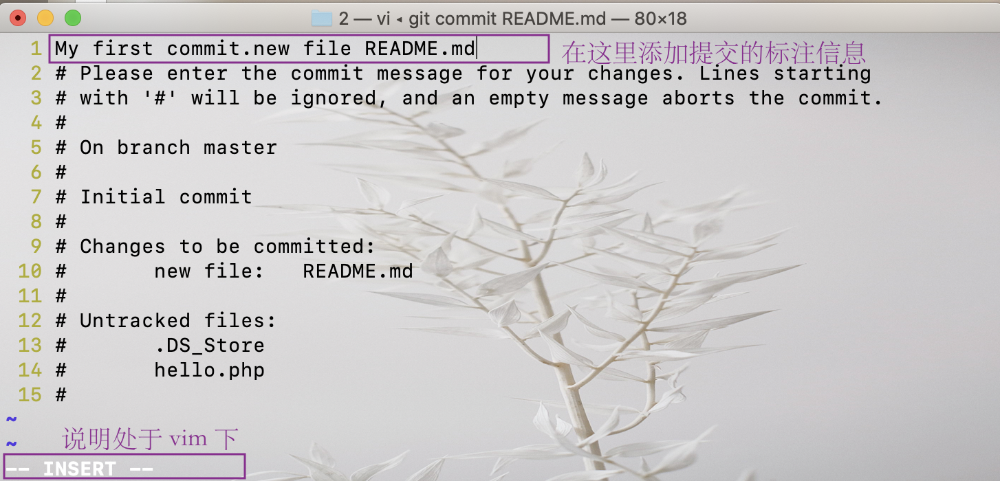


相当于：

```shell
git commit -m "My first commit.new file README.md" README.md
```


<font color=DarkOrchid>**HEAD**</font>

HEAD 是对一个当前检出记录的符号引用——即指向当前正在其基础上进行工作的提交记录。

HEAD 总是指向当前分支上最近一次提交记录。大多数修改提交树的 Git 命令都是从改变 HEAD 的指向开始的。

HEAD 通常情况下是指向分支名的（如 bugFix）。在你提交时，改变了 bugFix 的状态，这一变化通过 HEAD 变得可见。

下面来看一个具体的例子：

现在有这么一个分支

目前是：HEAD 指向 master， master 指向 C1


执行

```bash
git checkout C1
```

现在变成了：HEAD -> C1


执行

```bash
git checkout master
```


执行

```bash
git commit
```


执行

```bash
git checkout C2
```


如果想看 HEAD 指向，可以通过 `cat .git/HEAD` 查看。

如果 HEAD 指向的是一个引用，还可以用 `git symbolic-ref HEAD` 查看它的指向。


<font color=DarkOrchid>**查看历史记录**</font>

> 这里讲四种方式

① 直接：

```shell
git log
```

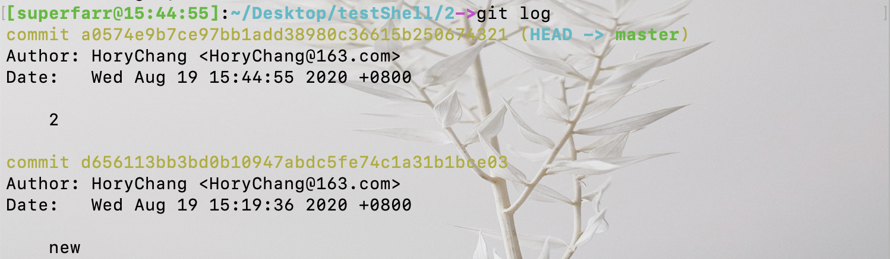

多屏显示控制方式：

+ 空格向下翻页
+ b 向上翻页
+ q 退出

② 当日志较多时，可以用以下命令使得每次修改的日志只显示一条信息，这样看起来就比较简练：

```shell
git log --pretty=oneline
```

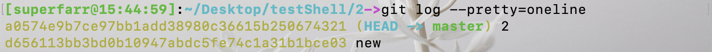

③ 甚至可以：

```shell
git log --oneline
```

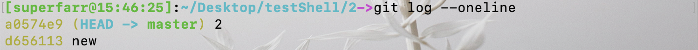

④ 还可以：

```shell
git reflog
```

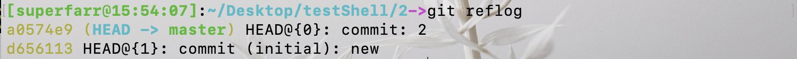

使用`git reflog`会显示版本号HEAD@{X}

可见目前有两个历史版本：HEAD@{0} 和 HEAD@{1}

`HEAD -> master` 就是一个指针，指代当前版本。

HEAD@{移动到当前版本需要多少步}


<font color=DarkOrchid>**前进/后退**</font>

① 基于索引值操作（推荐）

```shell
git reset --hard [局部索引值]
```

例如回到上面的HEAD@{1}，前面的索引值为 d656113，执行如下操作：

```shell
git reset --hard d656113
```

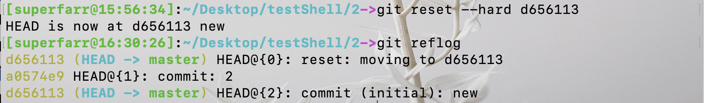

可见`HEAD -> master`指针指向了历史版本 HEAD@{2}

② 使用 ^ 符号（只能后退 ）

```shell
git reset --hard HEAD^
```

```shell
git reset --hard HEAD^^
```

注：一个^表示后退一步，n 个表示后退n 步

③ 使用 ~ 符号（只能后退 ）

```shell
git reset --hard HEAD~n
```

注：表示后退 n 步


<font color=DarkOrchid>**reset 三个参数对比**</font>

```shell
git reset --soft/mixed/hard/ ...
```

> soft 和 mixed 很少用

soft 参数：仅仅在本地库移动HEAD 指针


mixed 参数：在本地库移动HEAD 指针；重置暂存区


hard 参数：在本地库移动HEAD 指针；重置暂存区；重置工作区

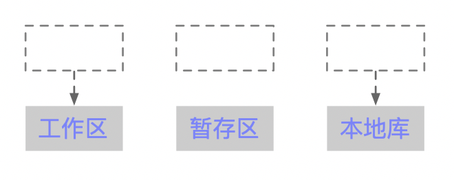

<font color=DarkOrchid>**删除文件并找回**</font>

前提：删除前，文件存在时的状态提交到了本地库。

操作

```shell
git reset --hard [指针位置]
```

 删除操作已经提交到本地库：指针位置指向历史记录

删除操作尚未提交到本地库：指针位置使用HEAD


<font color=DarkOrchid>**比较文件差异**</font>

将工作区中的文件和暂存区进行比较

```shell
git diff [文件名]
```

将工作区中的文件和本地库历史记录比较

```shell
git diff [本地库中历史版本] [文件名]
```


### 分支管理

[Git分支简介](https://git-scm.com/book/zh/v2/Git-%E5%88%86%E6%94%AF-%E5%88%86%E6%94%AF%E7%AE%80%E4%BB%8B)

<font color=DarkOrchid>**什么是分支？**</font>

在版本控制过程中，使用多条线同时推进多个任务。


<font color=DarkOrchid>**分支的好处**</font>

同时并行推进多个功能开发，提高开发效率。

各个分支在开发过程中，如果某一个分支开发失败，不会对其他分支有任何影响。失败的分支删除重新开始即可。


<font color=DarkOrchid>**创建分支**</font>

```shell
git branch [分支名]
```

<font color=DarkOrchid>**查看分支**</font>

```shell
git branch -v
```

<font color=DarkOrchid>**切换分支**</font>

```shell
git checkout [分支名]
```

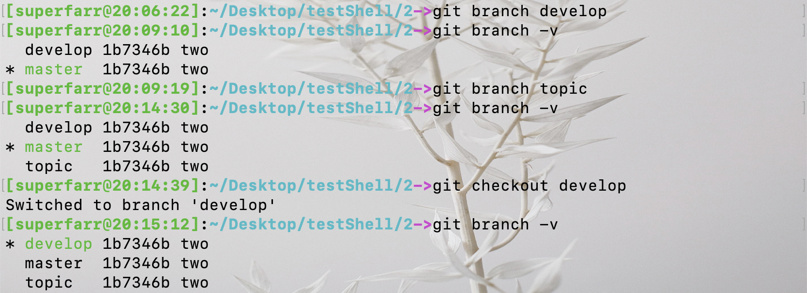

<font color=DarkOrchid>**合并分支**</font>

① 第一步。执行 `git checkout [被合并分支名]`，切换到接受修改的分支（被合并，增加新内容）上

② 第二步。执行 merge 命令 `git merge [有新内容分支名]`

假如我们想把 develop 分支的修改合并到 master 上面：

切换到 master 分支

```shell
git checkout master 
```

执行 merge 命令 将 develop 合并到 master

```shell
git merge develop
```

**冲突的产生：**

当修改的是两个或多个分支的同一个文件的同一个位置，而且内容又不一致，git 在合并的时候则会产生冲突

**冲突的解决：**

+ 第一步：编辑文件，删除特殊符号

+ 第二步：把文件修改到满意的程度，保存退出

+ 第三步：git add [文件名]

+ 第四步：git commit -m "日志信息"

注意：此时 commit 一定不能带具体文件名


### Git 基本原理

<font color=DarkOrchid>**哈希**</font>

Git 底层采用的是SHA-1 算法。

哈希算法可以被用来验证文件。原理如下图所示：

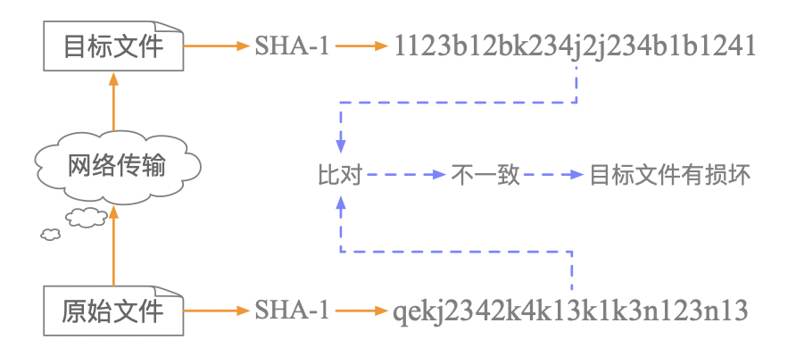

Git 就是靠这种机制来从根本上保证数据完整性的。


<font color=DarkOrchid>**Git 保存版本的机制**</font>

**集中式版本控制工具的文件管理机制**：以文件变更列表的方式存储信息。这类系统将它们保存的信息看作是一组基本

文件和每个文件随时间逐步累积的差异。

**Git 的文件管理机制**

Git 把数据看作是小型文件系统的一组快照。每次提交更新时Git 都会对当前的全部文件制作一个快照并保存这个快照的索引。为了高效，如果文件没有修改，Git 不再重新存储该文件，而是只保留一个**链接指向**之前存储的文件。所以Git 的工作方式可以称之为**快照流**。

**Git 文件管理机制细节**

Git 的「提交对象」

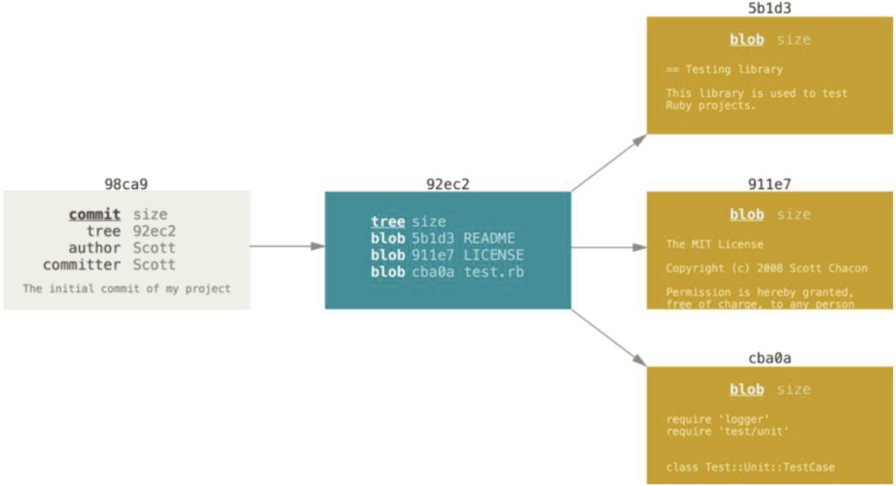

提交对象及其父对象形成的链条

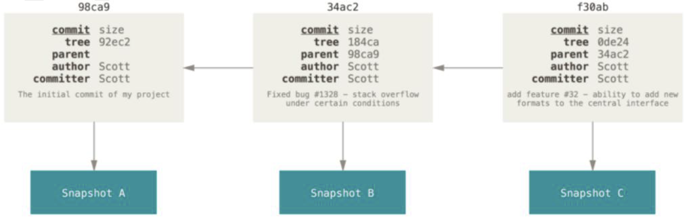


<font color=DarkOrchid>**Git 分支管理机制**</font>

分支的创建

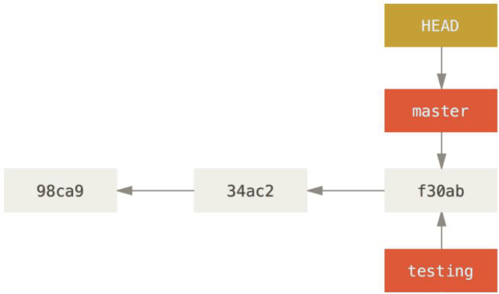

分支的切换

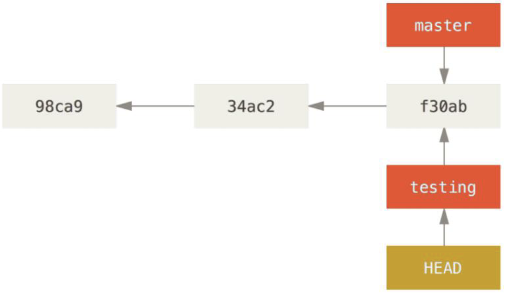

----

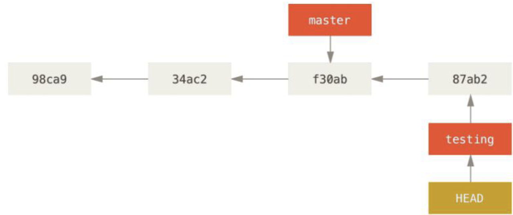

----

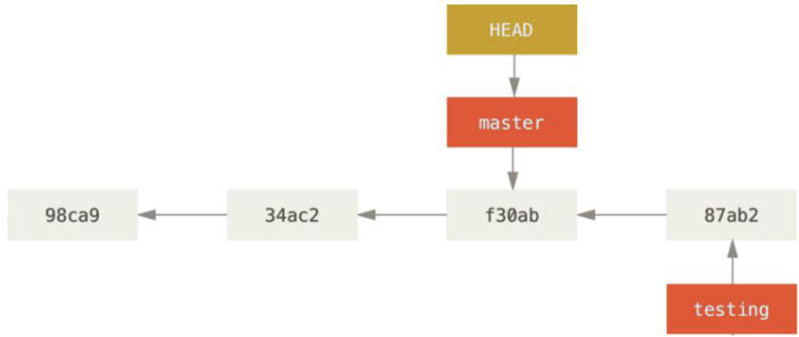

----

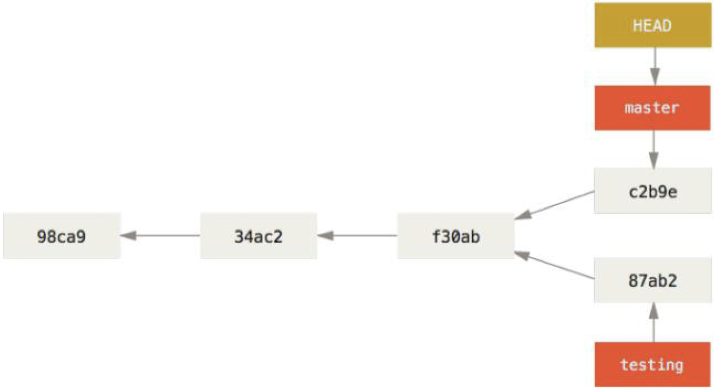

### GitHub 

<font color=DarkOrchid>**查看当前所有远程地址别名**</font>

```shell
git remote -v
```


<font color=DarkOrchid>**创建远程仓库地址别名**</font>

> 由于远程地址比较长，不好记，我们可以给远程地址取个别名，以后就用这个别名代替远程地址

```shell
git remote add [别名] [远程地址]
```


<font color=DarkOrchid>**推送**</font>

```shell
git push [别名] [分支名]
```


<font color=DarkOrchid>**克隆**</font>

```shell
git origin [远程地址]
```

该方式有三个效果：

+ 完整地把远程库下载到本地

+ 创建 origin 远程地址别名

+ 初始化本地库


<font color=DarkOrchid>**团队成员邀请**</font>

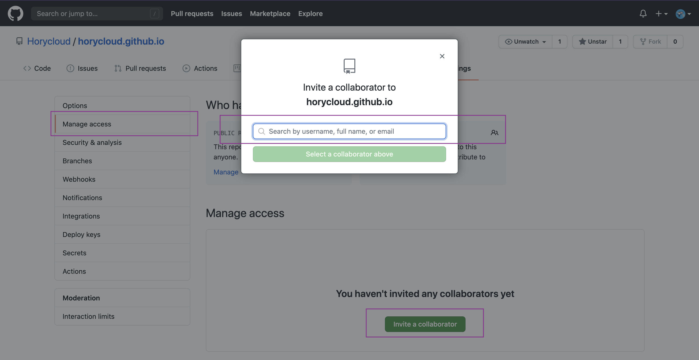

可以填被邀请人的 GitHub账号


<font color=DarkOrchid>**拉取**</font>

pull = fetch + merge

```shell
git fetch [远程库地址别名] [远程分支名]
```

```shell
git merge [远程库地址别名/远程分支名]
```

```shell
git pull [远程库地址别名] [远程分支名]
```


## 本地项目上传到Github

[手把手教如何将本地项目上传到Github（包会）](手把手教如何将本地项目上传到Github（包会）)

[GitHub使用教程及常见错误解决](https://www.cnblogs.com/jenniferhuang/p/3355248.html)


总体命令预览，部署的过程中大概用到以下命令：

```bash
git init
git add .
git status 
git commit -m "My first commit of hugoblog"
git remote -v   
git remote add origin https://github.com/Horycloud/Iceberg-Blog.git
git push -u origin master
```

+ **`git init`** 用于创建 `.git文件夹`，只是生成 .git 框架，但是并没有 url 等配置信息
+ **`git add  .`** 将当前目录中的所有内容全部提交到远程仓库
+ **`git status`**  查看当前选择提交的文件
+ **`git commit -m "修改信息"`**   提交到暂存区 ，还没提交到 Repositorys
+ **`git remote -v`**  查看目前绑定的远程仓库

+ 当实行 **`git remoteXXX`** 之后，则会生成 url 等配置信息，建立连接，以后就不用再 remote 了

+ **`git clone [url]`** 克隆 GitHub 上的项目，使用 clone 按钮下载 zip 是没有 .git 文件的

+ **`git pull XXX`**  表示拉取远程仓库到本地（建议在push之前pull一下，保证本地修改之前跟远程仓库是一致的）

+ **`git push -u origin master`**  执行此命令真正提交到远程仓库的 master 分支


### 注意事项

> **如果初始化 README**

在创建仓库时，如果选择了`Initialize this repository with a README`，则会在仓库目录中生成一个 README.md 文件，该文件的作用主要用于展示该仓库的简介内容。但是在将本地项目提交到远程仓库时，不能直接提交，需要先执行`git clone [url]`将远程仓库克隆下来（加入克隆下来的项目名为 project ），会发现project 中有个README.md，然后将需要提交的内容粘贴到 project 目录中，再进入 project 下执行如下命令即可将该项目中的左右内容提交到远程仓库：

```bash
git add .
git commit -m "message"
git remote add origin [url]
git push -u origin master
```


> **如果不初始化 README**

在创建仓库时，如果不选择`Initialize this repository with a README`，则不用将远程仓库克隆下来，可直接执行如下命令即可将该项目中的左右内容提交到远程仓库：

```bash
git init
git add .
git commit -m "message"
git remote add origin [url]
git push -u origin master
```


